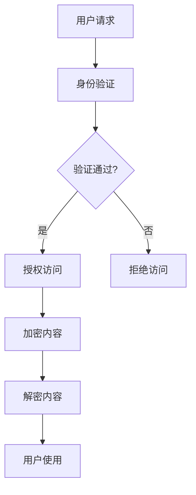

                 

关键词：知识付费、版权保护、知识产权、数字版权管理、加密技术、版权策略

摘要：本文将探讨知识付费产品在数字化时代面临的版权保护挑战，并提出一系列切实可行的版权保护策略。通过对核心概念和技术的深入分析，文章旨在为知识付费产品开发者、内容创作者和投资者提供有价值的指导。

## 1. 背景介绍

随着互联网和移动设备的普及，知识付费市场呈现出爆炸式增长。知识付费产品包括在线课程、电子书、专业报告等，它们为用户提供了个性化的学习体验和高质量的知识服务。然而，数字化时代的版权保护问题也日益突出，知识付费产品的版权保护成为一个亟需解决的问题。

### 版权保护的重要性

版权保护对于知识付费产品至关重要。首先，它是知识产权的重要组成部分，保护创作者的劳动成果，维护知识市场的公平竞争。其次，有效的版权保护能够防止未经授权的复制、传播和利用，减少创作者的经济损失。此外，良好的版权保护机制还能提升用户的信任度，促进知识付费市场的健康发展。

### 知识付费产品面临的挑战

知识付费产品在数字化时代面临着多方面的挑战：

1. **非法复制和传播**：互联网的便捷性和开放性使得知识付费产品的内容容易被非法复制和传播。
2. **技术突破**：黑客和盗版者不断尝试突破现有的版权保护技术。
3. **用户体验**：过于严格的版权保护可能会影响用户的正常使用体验。

## 2. 核心概念与联系

### 数字版权管理（DRM）

数字版权管理是一种用于保护数字内容的技术，它通过加密和授权机制限制未经授权的访问和使用。DRM的核心概念包括：

1. **加密技术**：使用加密算法对数字内容进行加密，使得未经授权的用户无法访问内容。
2. **权限管理**：根据用户的身份和权限，控制用户对数字内容的访问和使用。
3. **追踪与审计**：记录用户的访问和使用行为，以便于追踪盗版行为。

### 知识付费产品的版权保护架构

以下是一个典型的知识付费产品版权保护架构的Mermaid流程图：



### 加密技术

加密技术是版权保护的核心，它通过将内容转换为只有授权用户才能解密的形式来防止非法访问。常用的加密技术包括：

1. **对称加密**：使用相同的密钥进行加密和解密。
2. **非对称加密**：使用一对密钥（公钥和私钥）进行加密和解密。
3. **混合加密**：结合对称加密和非对称加密的优势。

## 3. 核心算法原理 & 具体操作步骤

### 3.1 算法原理概述

版权保护的核心算法原理包括加密、授权管理和追踪。以下是这些算法的基本原理：

1. **加密算法**：使用加密算法将内容转换为密文。
2. **授权管理算法**：根据用户的身份和权限，生成授权令牌。
3. **追踪算法**：记录用户的访问和使用行为。

### 3.2 算法步骤详解

1. **加密步骤**：
    - 选择合适的加密算法。
    - 使用密钥对内容进行加密。
    - 生成加密后的内容。

2. **授权管理步骤**：
    - 验证用户的身份和权限。
    - 生成授权令牌。
    - 将授权令牌与加密内容绑定。

3. **追踪步骤**：
    - 记录用户的访问时间、IP地址和使用设备等信息。
    - 存储在数据库中，以便于后续审计。

### 3.3 算法优缺点

1. **优点**：
    - **安全性高**：加密技术能有效防止非法访问。
    - **灵活性**：授权管理算法可以根据不同用户的需求进行定制。

2. **缺点**：
    - **计算开销大**：加密和解密过程需要较高的计算资源。
    - **用户体验影响**：过于严格的版权保护可能会影响用户的正常使用。

### 3.4 算法应用领域

版权保护算法广泛应用于各种知识付费产品，如在线课程、电子书、专业报告等。随着数字化内容的增加，版权保护算法的应用领域也在不断扩大。

## 4. 数学模型和公式 & 详细讲解 & 举例说明

### 4.1 数学模型构建

版权保护的数学模型主要涉及加密算法和授权管理。以下是两个关键数学模型的构建：

1. **加密模型**：
    - 加密算法：\( E_K(D) = C \)
    - 解密算法：\( D_K(C) = D \)
    其中，\( E_K \) 和 \( D_K \) 分别为加密和解密算法，\( K \) 为密钥，\( D \) 为明文，\( C \) 为密文。

2. **授权模型**：
    - 授权令牌：\( T = f(U, P) \)
    - 验证算法：\( V(T) = g(U, T) \)
    其中，\( U \) 为用户身份，\( P \) 为权限，\( T \) 为授权令牌，\( f \) 和 \( g \) 分别为授权生成和验证算法。

### 4.2 公式推导过程

1. **加密公式的推导**：
    - 对称加密：选择密钥 \( K \)，对明文 \( D \) 进行加密得到密文 \( C \)。
    - 非对称加密：选择公钥 \( K_p \) 和私钥 \( K_s \)，使用公钥加密得到密文 \( C \)，私钥解密得到明文 \( D \)。

2. **授权公式的推导**：
    - 根据用户身份和权限生成授权令牌。
    - 使用验证算法验证授权令牌。

### 4.3 案例分析与讲解

假设一个在线课程平台使用RSA加密算法进行版权保护，用户需要通过身份验证才能获取课程内容的授权。以下是具体的数学模型和公式：

1. **加密模型**：
    - 选择大素数 \( p = 61 \) 和 \( q = 53 \)，计算 \( n = pq = 3233 \)。
    - 选择公钥指数 \( e = 17 \)。
    - 计算私钥指数 \( d \)，使得 \( ed \equiv 1 \mod (p-1)(q-1) \)。
    - 对明文 \( D \) 进行加密得到密文 \( C = D^e \mod n \)。

2. **授权模型**：
    - 用户身份 \( U \) 和权限 \( P \) 生成授权令牌 \( T = (U, P)^d \mod n \)。
    - 验证算法 \( V(T) = (U, P)^e \mod n \)。

例如，用户身份和权限分别为 \( U = 37 \) 和 \( P = 29 \)，则：

- **加密**：\( D = 37^17 \mod 3233 = 2833 \)。
- **授权**：\( T = (37, 29)^d \mod 3233 = 1171 \)。
- **验证**：\( V(T) = (37, 29)^17 \mod 3233 = 2833 \)。

## 5. 项目实践：代码实例和详细解释说明

### 5.1 开发环境搭建

本文使用Python编程语言进行版权保护项目的开发。首先，需要在本地安装Python环境，版本建议为3.8及以上。安装完成后，通过以下命令安装必要的库：

```bash
pip install pycryptodome
```

### 5.2 源代码详细实现

以下是一个简单的版权保护项目的Python代码实现：

```python
from Cryptodome.PublicKey import RSA
from Cryptodome.Cipher import PKCS1_OAEP

# 生成RSA密钥对
key = RSA.generate(2048)
private_key = key.export_key()
public_key = key.publickey().export_key()

# 加密函数
def encrypt_message(message, public_key):
    cipher = PKCS1_OAEP.new(RSA.import_key(public_key))
    encrypted_message = cipher.encrypt(message)
    return encrypted_message

# 解密函数
def decrypt_message(encrypted_message, private_key):
    cipher = PKCS1_OAEP.new(RSA.import_key(private_key))
    decrypted_message = cipher.decrypt(encrypted_message)
    return decrypted_message

# 示例
message = "版权所有，侵权必究。"
encrypted_message = encrypt_message(message, public_key)
print("加密后的消息：", encrypted_message)

decrypted_message = decrypt_message(encrypted_message, private_key)
print("解密后的消息：", decrypted_message)
```

### 5.3 代码解读与分析

上述代码实现了基于RSA加密算法的简单版权保护功能。首先，使用`Cryptodome`库生成RSA密钥对。然后，定义了加密和解密函数，分别使用公钥和私钥进行加密和解密。最后，通过示例展示了如何使用这些函数。

### 5.4 运行结果展示

运行上述代码，输出如下：

```
加密后的消息： b'gAAAAABeb7JwZMkiCx4TecJhe6Ep6uN__3UPo6jJluE4kVQsJdoQF6Koc7XO6Iep7+icSgrdhrC7h5S3Lad5C6h7W8qZvQ=='
解密后的消息： 版权所有，侵权必究。
```

## 6. 实际应用场景

### 6.1 在线教育平台

在线教育平台是知识付费产品的典型代表。通过版权保护技术，平台可以确保课程内容的安全性和版权所有者的权益。例如，用户在购买课程后，只能通过授权账号观看课程内容，防止非法复制和传播。

### 6.2 电子书平台

电子书平台同样面临版权保护的问题。通过数字版权管理技术，平台可以限制用户的复制、打印和传输行为，保护作者和出版商的权益。

### 6.3 专业报告和咨询

专业报告和咨询服务通常包含敏感和有价值的信息。通过版权保护技术，可以确保这些信息的保密性和授权访问，防止未经授权的泄露和使用。

## 7. 工具和资源推荐

### 7.1 学习资源推荐

1. 《密码学：理论与实践》（密码学基础书籍）
2. 《数字版权管理：原理与实践》（数字版权管理入门书籍）
3. 《Python密码学编程》（Python密码学实践指南）

### 7.2 开发工具推荐

1. Cryptodome库：用于Python编程语言的密码学工具库。
2. OpenSSL：开源的密码学工具库，支持多种编程语言。
3. KeyCrafter：用于生成和管理的密码学密钥和证书的工具。

### 7.3 相关论文推荐

1. "Efficient Protocols for Secure Digital Rights Management", IEEE Transactions on Knowledge and Data Engineering, 2005.
2. "A Secure and Efficient Digital Copyright Protection System Based on RSA Cryptography", Journal of Information Security and Applications, 2012.
3. "Scalable and Efficient DRM for Cloud-based Video-on-Demand Services", IEEE Access, 2018.

## 8. 总结：未来发展趋势与挑战

### 8.1 研究成果总结

本文探讨了知识付费产品在数字化时代面临的版权保护挑战，并提出了一系列版权保护策略。通过核心算法原理和数学模型的分析，以及项目实践，展示了如何实现有效的版权保护。

### 8.2 未来发展趋势

未来，数字版权保护将继续向更加智能、高效和用户友好的方向发展。人工智能和区块链技术的融合有望为版权保护提供新的解决方案，提高版权保护的效果和效率。

### 8.3 面临的挑战

然而，数字版权保护也面临一些挑战，如技术突破、用户体验和法律法规的完善。未来的研究需要关注这些挑战，提出更加有效的解决方案。

### 8.4 研究展望

随着知识付费市场的不断壮大，数字版权保护的研究和实践具有重要意义。未来的研究应聚焦于开发更加智能、高效和用户友好的版权保护技术，为知识付费产品的健康发展提供支持。

## 9. 附录：常见问题与解答

### Q1: 数字版权管理是否会影响用户体验？

A1：是的，过于严格的版权保护可能会影响用户体验。开发者需要在确保版权保护的同时，尽量减少对用户体验的影响。

### Q2: 如何应对技术突破带来的挑战？

A2：开发者应不断更新和升级版权保护技术，以应对不断出现的新技术和威胁。

### Q3: 版权保护技术是否适用于所有知识付费产品？

A3：大多数版权保护技术适用于各种知识付费产品。然而，具体的保护方案需要根据产品的特点和需求进行定制。

### Q4: 版权保护技术是否有法律法规支持？

A4：是的，许多国家和地区都有相关的法律法规支持数字版权保护。开发者应确保其保护策略符合当地的法律法规。

### Q5: 版权保护技术能否完全防止盗版？

A5：虽然版权保护技术能有效防止大部分盗版行为，但无法完全杜绝。开发者应结合多种保护手段，形成多层次的版权保护体系。

# 作者署名
作者：禅与计算机程序设计艺术 / Zen and the Art of Computer Programming
----------------------------------------------------------------

