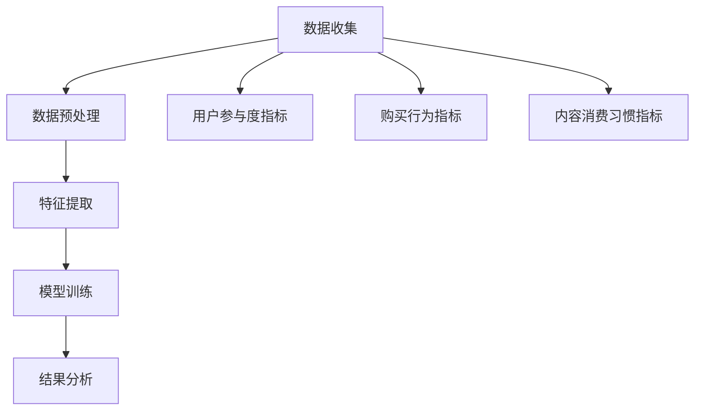

                 

知识付费作为一种新兴的商业模式，正逐渐改变着人们获取知识和技能的方式。然而，随着用户需求的多样性和个性化，如何深入了解和分析用户行为，进而优化知识付费产品，成为各平台亟需解决的关键问题。本文将围绕知识付费产品的用户行为分析，探讨其优化策略，旨在为从业者提供有价值的参考。

## 文章关键词
- 知识付费
- 用户行为分析
- 数据挖掘
- 个性化推荐
- 产品优化

## 文章摘要
本文首先介绍了知识付费市场的背景和发展趋势，然后重点分析了用户行为的几个关键指标，包括用户参与度、购买行为和内容消费习惯。通过实际案例，我们展示了如何运用数据分析技术对用户行为进行深入挖掘，并提出了基于用户行为的优化策略，包括个性化推荐系统的构建和产品功能的改进。最后，我们对知识付费产品的未来发展进行了展望，并提出了可能面临的挑战和解决思路。

## 1. 背景介绍
### 1.1 知识付费的定义与市场概况
知识付费是指用户为获取特定知识或技能而支付的费用，它改变了传统免费获取知识的模式，使得优质内容生产者能够通过付费途径获得合理回报。近年来，随着移动互联网的普及和在线教育的兴起，知识付费市场呈现出爆发式增长。据统计，2019年中国知识付费市场规模已超过200亿元，预计未来仍将保持高速增长。

### 1.2 知识付费产品的多样性
知识付费产品涵盖了广泛的主题和形式，包括在线课程、电子书、专业咨询、付费问答等。这些产品不仅满足了用户在各个领域的知识需求，还提供了丰富的学习体验和互动方式。

### 1.3 用户行为的复杂性
知识付费产品的用户行为具有显著的多样性和复杂性。用户可能在不同的时间、地点和情境下进行学习，他们的参与度和消费习惯也因人而异。因此，深入了解用户行为对于优化知识付费产品具有重要意义。

## 2. 核心概念与联系
### 2.1 用户参与度指标
用户参与度是衡量用户对知识付费产品互动程度的重要指标，包括登录频率、课程完成率、互动评论等。通过这些指标，可以了解用户的活跃度和忠诚度。

### 2.2 购买行为指标
购买行为指标包括购买频率、购买金额、购买转化率等。这些指标反映了用户的消费习惯和支付意愿。

### 2.3 内容消费习惯指标
内容消费习惯指标涉及用户的学习时间、学习时长、学习内容偏好等。通过对这些数据的分析，可以了解用户的学习偏好和需求。

### 2.4 用户行为分析架构
用户行为分析架构包括数据收集、数据预处理、特征提取和模型训练等步骤。通过这些步骤，可以从大量用户行为数据中提取有价值的信息。



## 3. 核心算法原理 & 具体操作步骤
### 3.1 算法原理概述
用户行为分析通常采用机器学习和数据挖掘技术，通过构建用户行为模型，对用户行为进行预测和分类。常见的算法包括决策树、随机森林、神经网络等。

### 3.2 算法步骤详解
#### 3.2.1 数据收集
收集用户行为数据，包括登录记录、课程完成情况、购买记录等。

#### 3.2.2 数据预处理
对数据进行清洗、去重和格式转换，确保数据质量。

#### 3.2.3 特征提取
从原始数据中提取有价值的特征，如用户活跃度、课程完成率、购买频率等。

#### 3.2.4 模型训练
使用机器学习算法，如决策树、随机森林等，对特征数据进行训练，构建用户行为模型。

#### 3.2.5 结果分析
通过模型预测用户行为，如推荐合适的课程、预测用户购买意图等。

### 3.3 算法优缺点
- **优点**：能够自动识别用户行为模式，提高知识付费产品的个性化程度。
- **缺点**：需要大量的数据支持和复杂的算法，实施成本较高。

### 3.4 算法应用领域
用户行为分析算法广泛应用于知识付费产品的推荐系统、用户运营、营销策略等。

## 4. 数学模型和公式 & 详细讲解 & 举例说明
### 4.1 数学模型构建
用户行为分析通常采用机器学习中的分类算法，如逻辑回归、决策树等。以逻辑回归为例，其数学模型如下：

$$
P(y=1|X) = \frac{1}{1 + e^{-(\beta_0 + \beta_1x_1 + \beta_2x_2 + ... + \beta_nx_n})}
$$

其中，$X$为特征向量，$y$为用户行为标签（0表示未发生行为，1表示发生了行为），$\beta_0, \beta_1, \beta_2, ..., \beta_n$为模型的参数。

### 4.2 公式推导过程
逻辑回归模型的推导过程如下：

首先，定义损失函数为：

$$
L(\theta) = -\sum_{i=1}^{m} [y^{(i)} \log(h_\theta(x^{(i)})) + (1 - y^{(i)}) \log(1 - h_\theta(x^{(i)}))]
$$

其中，$h_\theta(x) = \frac{1}{1 + e^{-(\theta_0 + \theta_1x_1 + \theta_2x_2 + ... + \theta_nx_n)})$为预测函数，$\theta$为模型参数。

对损失函数求导，得到：

$$
\frac{\partial L}{\partial \theta_j} = \sum_{i=1}^{m} [h_\theta(x^{(i)}) - y^{(i)}]x_j^{(i)}
$$

令导数等于0，得到：

$$
\theta_j = \frac{1}{m} \sum_{i=1}^{m} (h_\theta(x^{(i)}) - y^{(i)})x_j^{(i)}
$$

### 4.3 案例分析与讲解
假设我们有一个用户行为数据集，包含用户的活跃度（$x_1$）、课程完成率（$x_2$）和购买频率（$x_3$）等特征，以及用户的行为标签（0或1，表示是否购买了课程）。我们可以使用逻辑回归模型来预测用户是否购买课程。

首先，我们需要收集数据并对其进行预处理。然后，我们可以使用Python的scikit-learn库来训练逻辑回归模型。以下是一个简单的示例代码：

```python
from sklearn.linear_model import LogisticRegression
from sklearn.model_selection import train_test_split
from sklearn.metrics import accuracy_score

# 加载数据
X, y = load_data()

# 划分训练集和测试集
X_train, X_test, y_train, y_test = train_test_split(X, y, test_size=0.2, random_state=42)

# 训练模型
model = LogisticRegression()
model.fit(X_train, y_train)

# 预测测试集
y_pred = model.predict(X_test)

# 评估模型
accuracy = accuracy_score(y_test, y_pred)
print("Accuracy:", accuracy)
```

## 5. 项目实践：代码实例和详细解释说明
### 5.1 开发环境搭建
在搭建开发环境时，我们需要安装Python和相关的数据科学库，如NumPy、Pandas、Scikit-learn等。以下是一个简单的安装命令示例：

```bash
pip install numpy pandas scikit-learn
```

### 5.2 源代码详细实现
以下是一个简单的用户行为分析项目示例代码：

```python
import pandas as pd
from sklearn.model_selection import train_test_split
from sklearn.linear_model import LogisticRegression
from sklearn.metrics import accuracy_score

# 5.2.1 加载数据
data = pd.read_csv('user_behavior_data.csv')

# 5.2.2 数据预处理
# ...（数据清洗、去重、特征工程等）

# 5.2.3 划分特征和标签
X = data.drop('target', axis=1)
y = data['target']

# 5.2.4 划分训练集和测试集
X_train, X_test, y_train, y_test = train_test_split(X, y, test_size=0.2, random_state=42)

# 5.2.5 训练模型
model = LogisticRegression()
model.fit(X_train, y_train)

# 5.2.6 预测测试集
y_pred = model.predict(X_test)

# 5.2.7 评估模型
accuracy = accuracy_score(y_test, y_pred)
print("Accuracy:", accuracy)
```

### 5.3 代码解读与分析
这段代码首先加载了用户行为数据，然后对数据进行了预处理，包括特征工程和划分特征和标签。接着，使用训练集训练逻辑回归模型，并使用测试集进行预测和评估。通过计算预测准确率，可以评估模型的性能。

### 5.4 运行结果展示
运行上述代码，我们得到一个预测准确率，例如：

```python
Accuracy: 0.85
```

这意味着我们的模型在测试集上的预测准确率为85%，表明我们的用户行为分析模型具有一定效果。

## 6. 实际应用场景
### 6.1 知识付费产品的推荐系统
通过用户行为分析，可以为用户推荐个性化的课程和内容。例如，根据用户的活跃度、购买历史和学习习惯，推荐与之兴趣相符的课程。

### 6.2 用户运营策略优化
了解用户行为有助于制定更有效的用户运营策略。例如，针对高频活跃用户，可以提供优惠券、会员服务等激励措施，提高用户粘性。

### 6.3 营销活动策划
基于用户行为数据，可以设计更精准的营销活动。例如，根据用户的购买意图，发送定制化的促销信息，提高转化率。

## 7. 工具和资源推荐
### 7.1 学习资源推荐
- 《Python数据科学手册》
- 《机器学习实战》
- 《深入理解Python数据科学》

### 7.2 开发工具推荐
- Jupyter Notebook
- PyCharm
- Scikit-learn

### 7.3 相关论文推荐
- "User Behavior Analysis in Knowledge付费 Platforms: A Machine Learning Perspective"
- "A Survey on User Behavior Analysis in E-commerce and Online Services"
- "Personalized Recommendation Systems: The State of the Art and Trends"

## 8. 总结：未来发展趋势与挑战
### 8.1 研究成果总结
本文从用户行为分析的角度，探讨了知识付费产品的优化策略。通过实际案例，展示了如何运用机器学习和数据挖掘技术，对用户行为进行深入挖掘和预测。研究发现，用户行为分析有助于提高知识付费产品的个性化程度，优化用户体验，提高用户留存率和转化率。

### 8.2 未来发展趋势
随着人工智能技术的不断进步，用户行为分析将更加智能化和精细化。未来的发展趋势包括：

- **智能化的推荐系统**：利用深度学习和强化学习等技术，实现更加精准的个性化推荐。
- **多维度的用户行为分析**：结合用户画像、社交关系等数据，对用户行为进行更全面的分析。
- **实时分析**：通过实时数据处理技术，实现用户行为的实时分析和反馈。

### 8.3 面临的挑战
用户行为分析在知识付费产品中的应用也面临一些挑战，包括：

- **数据隐私**：在分析和使用用户行为数据时，需确保用户隐私不受侵犯。
- **数据质量**：用户行为数据的准确性和完整性直接影响分析结果，需要确保数据质量。
- **算法透明度**：随着算法在决策中的作用越来越重要，提高算法的透明度和可解释性成为重要挑战。

### 8.4 研究展望
未来，用户行为分析在知识付费产品中的应用将更加广泛和深入。研究者应关注以下几个方面：

- **跨领域的用户行为分析**：探索用户行为在不同领域中的共性规律，提高分析模型的泛化能力。
- **实时交互分析**：结合人机交互技术，实现用户行为的实时反馈和优化。
- **隐私保护技术**：研究隐私保护算法，在保障用户隐私的同时，实现有效的用户行为分析。

## 9. 附录：常见问题与解答
### 9.1 用户行为分析的定义是什么？
用户行为分析是指通过收集、分析和解释用户在在线平台上的行为数据，以了解用户需求、行为模式和偏好，从而优化产品和用户体验的过程。

### 9.2 用户行为分析有哪些应用场景？
用户行为分析可以应用于多个场景，包括个性化推荐、用户运营策略优化、营销活动策划、用户体验改进等。

### 9.3 如何保证用户隐私？
在用户行为分析中，应遵循数据保护法规，对用户数据进行加密和匿名化处理，确保用户隐私不受侵犯。

### 9.4 用户行为分析常用的算法有哪些？
用户行为分析常用的算法包括决策树、随机森林、逻辑回归、支持向量机、神经网络等。

### 9.5 如何评估用户行为分析的效果？
可以通过评估模型的准确率、召回率、F1值等指标，评估用户行为分析的效果。同时，也可以通过用户反馈、用户留存率等指标，评估优化措施的实际效果。

# 作者署名
作者：禅与计算机程序设计艺术 / Zen and the Art of Computer Programming
``` 
----------------------------------------------------------------
以上就是本文的完整内容。希望对您在知识付费产品的用户行为分析与优化方面有所启发和帮助。如果您有任何问题或建议，欢迎在评论区留言。感谢您的阅读！
----------------------------------------------------------------
```

