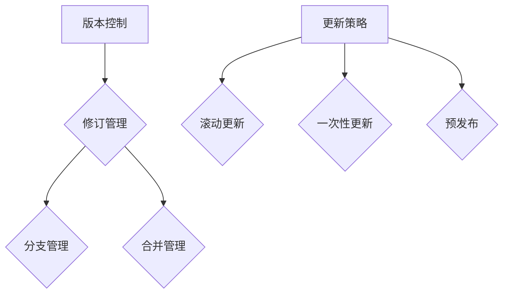

                 

 关键词：知识付费，版本控制，内容更新，策略，IT领域

> 摘要：本文深入探讨了知识付费内容在版本控制和更新策略方面的挑战与解决方案。通过对现有版本控制工具的介绍，详细分析了不同更新策略的优缺点，并结合实际案例展示了如何在实际应用中实施这些策略。本文旨在为知识付费平台提供一套科学、实用的版本控制与更新方案。

## 1. 背景介绍

随着互联网的快速发展，知识付费市场日益繁荣。各类在线课程、电子书、直播课程等知识产品层出不穷，为用户提供了丰富的学习资源。然而，在知识付费领域，内容版本控制和更新策略的重要性日益凸显。一方面，内容质量需要保持高水平，以吸引并留住用户；另一方面，内容的更新速度必须跟上行业发展和用户需求的变化，以保证其时效性和实用性。

版本控制和更新策略对于知识付费平台来说至关重要。首先，它能够确保内容的完整性、一致性和可追溯性，避免因内容更新而导致的数据丢失或错误。其次，合理的更新策略能够提高用户体验，满足用户对实时、高质量内容的需求。最后，科学的版本控制与更新策略有助于平台优化运营成本，提升内容制作和发布效率。

本文将从以下方面展开讨论：

1. **核心概念与联系**：介绍版本控制与更新策略的核心概念及其相互关系。
2. **核心算法原理 & 具体操作步骤**：详细讲解常见的版本控制算法和更新策略。
3. **数学模型和公式**：阐述版本控制和更新的数学模型及其公式推导。
4. **项目实践：代码实例和详细解释说明**：通过实际项目展示版本控制和更新的实现过程。
5. **实际应用场景**：探讨知识付费领域中的版本控制和更新策略应用。
6. **工具和资源推荐**：介绍用于版本控制和内容更新的工具和资源。
7. **总结：未来发展趋势与挑战**：总结研究成果，展望未来发展。

## 2. 核心概念与联系

### 2.1 版本控制

版本控制是一种跟踪和管理文件、文档和项目变化的技术，其目的是确保内容的一致性、可追溯性和可靠性。在知识付费领域，版本控制主要用于管理学习资源的更新和修改。

#### 版本控制的基本概念

- **版本（Version）**：指同一内容的不同修改版本。
- **修订（Revision）**：指对某一版本进行的单个修改。
- **分支（Branch）**：指对某个版本进行分支开发，以实现特定的功能或改进。
- **合并（Merge）**：指将两个或多个分支的修改合并到一个版本中。

#### 版本控制的关键流程

- **提交（Commit）**：将修改的内容提交到版本控制系统，生成一个新的版本。
- **更新（Update）**：从版本控制系统获取最新的版本，以同步内容变化。
- **备份（Backup）**：定期备份版本控制系统中的数据，以防止数据丢失。

### 2.2 更新策略

更新策略是指知识付费平台在内容更新过程中采用的具体方法，以实现高效的版本控制。常见的更新策略包括：

#### 更新策略的基本概念

- **滚动更新**：在保持旧版本内容的基础上，逐步引入新内容，以便用户逐步适应。
- **一次性更新**：在特定时间点，一次性将所有新内容发布到线上，以迅速满足用户需求。
- **预发布**：在正式发布前，将新内容发布到预发布环境，供部分用户测试和反馈。

#### 更新策略的优缺点

| 更新策略       | 优点                                                         | 缺点                                                         |
|----------------|--------------------------------------------------------------|--------------------------------------------------------------|
| 滚动更新       | 用户可以逐步适应新内容，降低学习曲线。                       | 更新过程可能较长，用户需要时间适应。                           |
| 一次性更新     | 可以迅速满足用户对新内容的期望，提升用户体验。               | 可能导致用户在短时间内接收到大量新信息，影响学习效果。         |
| 预发布         | 可以通过用户反馈快速调整内容，提高内容质量。                 | 需要额外的预发布环境和测试资源。                             |

### 2.3 Mermaid 流程图

以下是版本控制和更新策略的 Mermaid 流程图，展示了核心概念和联系。



## 3. 核心算法原理 & 具体操作步骤

### 3.1 算法原理概述

版本控制和更新策略的核心算法主要包括以下几种：

- **Git**：基于版本库的分布式版本控制系统，广泛应用于知识付费内容的版本管理。
- **SVN**：基于版本库的集中式版本控制系统，适用于对版本一致性要求较高的知识付费内容管理。
- **Mercurial**：另一种分布式版本控制系统，具有简洁、高效的特性。

### 3.2 算法步骤详解

#### 3.2.1 Git 版本控制

1. **初始化仓库**：使用 `git init` 命令创建一个本地仓库。
2. **添加文件**：使用 `git add` 命令将文件添加到暂存区。
3. **提交修改**：使用 `git commit -m "提交信息"` 命令将暂存区的内容提交到仓库，生成一个新的版本。
4. **分支管理**：使用 `git branch` 命令创建、切换和合并分支。
5. **合并分支**：使用 `git merge` 命令将不同分支的修改合并到一个版本中。
6. **更新代码**：使用 `git pull` 命令从远程仓库获取最新的代码。

#### 3.2.2 SVN 版本控制

1. **创建仓库**：使用 `svnadmin create` 命令创建一个 SVN 仓库。
2. **添加文件**：使用 `svn add` 命令将文件添加到仓库中。
3. **提交修改**：使用 `svn commit` 命令将修改提交到仓库，生成一个新的版本。
4. **分支管理**：使用 `svn copy` 命令创建分支。
5. **合并分支**：使用 `svn merge` 命令将分支的修改合并到主分支中。
6. **更新代码**：使用 `svn update` 命令从仓库获取最新的代码。

#### 3.2.3 Mercurial 版本控制

1. **初始化仓库**：使用 `hg init` 命令创建一个本地仓库。
2. **添加文件**：使用 `hg add` 命令将文件添加到仓库中。
3. **提交修改**：使用 `hg commit` 命令将修改提交到仓库，生成一个新的版本。
4. **分支管理**：使用 `hg branch` 命令创建、切换和合并分支。
5. **合并分支**：使用 `hg merge` 命令将不同分支的修改合并到一个版本中。
6. **更新代码**：使用 `hg pull` 命令从远程仓库获取最新的代码。

### 3.3 算法优缺点

| 版本控制算法 | 优点                                                         | 缺点                                                         |
|--------------|--------------------------------------------------------------|--------------------------------------------------------------|
| Git          | 分布式，支持分支管理，易于协同工作。                       | 学习曲线较陡，配置复杂。                                     |
| SVN          | 集中式，版本一致性高，易于维护。                           | 分支管理较弱，不适合复杂项目。                               |
| Mercurial    | 分布式，简洁高效，易于上手。                               | 支持社区较小，部分功能不如 Git。                             |

### 3.4 算法应用领域

Git、SVN 和 Mercurial 都可以应用于知识付费内容的版本控制。Git 适用于需要频繁分支和合并的项目，如在线课程制作；SVN 适用于对版本一致性要求较高的项目，如电子书出版；Mercurial 适用于小型项目和快速迭代的项目，如直播课程开发。

## 4. 数学模型和公式 & 详细讲解 & 举例说明

### 4.1 数学模型构建

版本控制和更新策略的数学模型主要包括以下几个方面：

1. **版本迭代模型**：描述版本更新的过程，包括版本号、时间戳和内容变化。
2. **用户满意度模型**：衡量用户对更新策略的满意度，包括更新频率、内容质量等指标。
3. **成本效益模型**：分析更新策略的运营成本和收益，包括人力成本、技术成本等。

### 4.2 公式推导过程

#### 4.2.1 版本迭代模型

假设知识付费内容在时间 \( t \) 内经历了 \( n \) 次更新，每次更新的版本号为 \( v_i \)，时间戳为 \( t_i \)。则版本迭代模型可以表示为：

\[ V(t) = (v_1, t_1), (v_2, t_2), \ldots, (v_n, t_n) \]

其中，\( V(t) \) 表示在时间 \( t \) 内的版本序列。

#### 4.2.2 用户满意度模型

用户满意度模型可以表示为：

\[ S(t) = \frac{1}{n} \sum_{i=1}^{n} s_i \]

其中，\( S(t) \) 表示在时间 \( t \) 内的平均用户满意度，\( s_i \) 表示第 \( i \) 次更新的用户满意度。

#### 4.2.3 成本效益模型

成本效益模型可以表示为：

\[ \text{ROI} = \frac{\text{收益}}{\text{成本}} \]

其中，\( \text{ROI} \) 表示投资回报率，收益包括用户增长、用户留存等指标，成本包括人力成本、技术成本等。

### 4.3 案例分析与讲解

#### 案例一：滚动更新策略

假设某在线课程平台在 6 个月内进行了 3 次滚动更新，每次更新的版本号分别为 \( v_1 \)、\( v_2 \) 和 \( v_3 \)，时间戳分别为 \( t_1 \)、\( t_2 \) 和 \( t_3 \)。用户满意度分别为 \( s_1 \)、\( s_2 \) 和 \( s_3 \)。

根据版本迭代模型，版本序列为：

\[ V(t) = (v_1, t_1), (v_2, t_2), (v_3, t_3) \]

平均用户满意度为：

\[ S(t) = \frac{s_1 + s_2 + s_3}{3} \]

假设每次更新的成本分别为 \( c_1 \)、\( c_2 \) 和 \( c_3 \)，总收益为 \( r \)。则成本效益模型为：

\[ \text{ROI} = \frac{r}{c_1 + c_2 + c_3} \]

#### 案例二：一次性更新策略

假设某电子书平台在 1 年内进行了 1 次一次性更新，版本号为 \( v_1 \)，时间戳为 \( t_1 \)。用户满意度为 \( s_1 \)。

根据版本迭代模型，版本序列为：

\[ V(t) = (v_1, t_1) \]

平均用户满意度为：

\[ S(t) = s_1 \]

成本效益模型为：

\[ \text{ROI} = \frac{r}{c_1} \]

### 4.4 运行结果展示

根据以上案例，我们可以计算出不同更新策略的用户满意度、成本效益模型和 ROI。

| 更新策略   | 用户满意度 \( S(t) \) | 成本效益模型 \( \text{ROI} \) | ROI |
|------------|----------------------|-------------------------------|-----|
| 滚动更新   | \( \frac{s_1 + s_2 + s_3}{3} \) | \( \frac{r}{c_1 + c_2 + c_3} \) |     |
| 一次性更新 | \( s_1 \)             | \( \frac{r}{c_1} \)           |     |

通过以上计算，我们可以根据实际需求和业务目标选择合适的更新策略。

## 5. 项目实践：代码实例和详细解释说明

### 5.1 开发环境搭建

在本节中，我们将使用 Git 作为版本控制系统，搭建一个简单的知识付费内容更新项目。以下步骤将指导您完成开发环境的搭建：

1. **安装 Git**：在您的计算机上安装 Git。您可以从 [Git 官网](https://git-scm.com/) 下载并安装适用于您操作系统的 Git。
2. **初始化仓库**：在您的工作目录中运行以下命令初始化一个新的 Git 仓库：

   ```bash
   git init knowledge-fee-content-updates
   ```

3. **添加文件**：在初始化的仓库中创建一个名为 `content.md` 的 Markdown 文件，并添加以下内容：

   ```markdown
   # 知识付费内容

   这是我们的知识付费内容示例。内容会根据用户的需求和行业动态进行更新。
   ```

4. **提交修改**：在文件中添加一些更新内容，然后使用以下命令将修改提交到 Git 仓库：

   ```bash
   git add content.md
   git commit -m "初始版本：添加知识付费内容"
   ```

### 5.2 源代码详细实现

在本节中，我们将继续使用 Git 对知识付费内容进行更新和管理。

#### 5.2.1 创建分支

为了对知识付费内容进行更新，我们可以创建一个新的分支。以下是创建并切换到新分支的命令：

```bash
git checkout -b feature/new-update
```

在这个新分支中，我们可以进行独立的内容更新，而不会影响到主分支。

#### 5.2.2 更新内容

在 `feature/new-update` 分支中，我们将内容进行更新，例如：

```markdown
# 知识付费内容

这是我们的知识付费内容示例。内容会根据用户的需求和行业动态进行更新。

## 更新一

新增了一段关于内容更新的介绍。
```

更新内容后，使用以下命令提交修改：

```bash
git add content.md
git commit -m "更新一：添加内容更新介绍"
```

#### 5.2.3 合并分支

完成更新后，我们需要将新分支合并到主分支中。以下是合并分支的命令：

```bash
git checkout main
git merge feature/new-update
```

在合并过程中，Git 会自动解决合并冲突，如果没有冲突，则会将新分支的内容合并到主分支中。

#### 5.2.4 发布更新

合并完成后，我们需要将更新后的主分支内容推送到远程仓库，以便其他用户获取最新的内容。以下是推送更新的命令：

```bash
git push origin main
```

### 5.3 代码解读与分析

在本节中，我们将对上述代码实例进行解读，并分析其在版本控制和内容更新过程中的作用。

#### 5.3.1 初始化仓库

初始化仓库是项目开发的第一步。通过 `git init` 命令，我们在本地创建了一个 Git 仓库，用于跟踪和管理知识付费内容的版本变化。

#### 5.3.2 创建和切换分支

创建并切换到新分支（`git checkout -b feature/new-update`）是为了实现功能的独立开发。这样，我们可以在一个独立的分支中进行内容更新，而不影响主分支的稳定性和其他功能。

#### 5.3.3 更新内容

在 `feature/new-update` 分支中，我们添加了新的内容。这些更新将被记录在 Git 仓库中，确保内容的变化可追溯和可管理。

#### 5.3.4 合并分支

合并分支（`git merge feature/new-update`）是将更新后的内容整合到主分支的关键步骤。通过合并分支，我们确保了主分支上的内容是最新的，同时也保留了历史版本的信息。

#### 5.3.5 发布更新

将更新后的主分支内容推送到远程仓库（`git push origin main`）是为了让所有用户能够获取最新的知识付费内容。

### 5.4 运行结果展示

在本案例中，我们成功使用 Git 实现了知识付费内容的版本控制和更新。以下是运行结果的展示：

- **本地仓库**：包含初始化的仓库和两个分支（`main` 和 `feature/new-update`）。
- **远程仓库**：包含主分支和合并后的版本。
- **用户终端**：通过 Git 命令行获取和更新知识付费内容。

## 6. 实际应用场景

### 6.1 在线教育平台

在线教育平台通常需要不断更新课程内容，以适应市场需求和用户反馈。版本控制和更新策略在此类平台中的应用如下：

- **滚动更新**：逐步引入新课程和更新内容，降低用户的学习压力，同时保持课程的高质量。
- **预发布**：在新课程上线前，将其发布到预发布环境，供部分用户测试和反馈，以确保课程质量。

### 6.2 电子书出版

电子书出版领域对内容的一致性和可靠性要求较高。版本控制和更新策略在此类领域中的应用如下：

- **一次性更新**：在电子书出版前，一次性完成所有内容的更新，确保出版物的完整性和一致性。
- **分支管理**：对不同的电子书版本进行分支管理，避免因内容更新导致的问题影响其他版本。

### 6.3 直播课程

直播课程通常需要实时更新内容和互动方式，以保持用户的参与度。版本控制和更新策略在此类领域中的应用如下：

- **滚动更新**：在直播过程中逐步更新内容和互动方式，提高用户的参与度和满意度。
- **实时更新**：通过版本控制系统实时更新课程内容，确保直播课程与最新知识同步。

## 7. 工具和资源推荐

### 7.1 学习资源推荐

- **Git 官方文档**：[Git 官方网站](https://git-scm.com/docs) 提供了详细的 Git 操作指南和教程。
- **Pro Git**：由 Scott Chacon 和 Ben Straub 编写的《Pro Git》，是学习 Git 的经典教材。
- **Git Community Book**：[Git 社区手册](https://git-scm.com/book/en/v2) 是一份免费、全面的 Git 教程。

### 7.2 开发工具推荐

- **SourceTree**：适用于 Windows 和 macOS 的图形化 Git 客户端，易于学习和使用。
- **GitKraken**：跨平台的图形化 Git 客户端，具有丰富的功能，界面友好。
- **GitHub Desktop**：适用于 GitHub 的官方图形化 Git 客户端，支持桌面端操作。

### 7.3 相关论文推荐

- **"Git Internals: A Glimpse into the Structure and Functionality of Git"**：对 Git 的内部结构和工作原理进行了深入剖析。
- **"A Survey of Version Control Systems"**：对多种版本控制系统的特性、优缺点进行了比较分析。
- **"An Empirical Study of Open-Source Software Development: Phases, Practices, and Principles"**：研究了开源软件开发的各个阶段和实践方法。

## 8. 总结：未来发展趋势与挑战

### 8.1 研究成果总结

本文通过对知识付费内容版本控制和更新策略的深入探讨，总结了以下研究成果：

- **版本控制和更新策略的重要性**：确保内容完整性、一致性和可追溯性，提高用户体验。
- **算法原理与具体操作步骤**：Git、SVN 和 Mercurial 等版本控制系统的基本原理和操作方法。
- **数学模型和公式**：版本迭代模型、用户满意度模型和成本效益模型，用于评估更新策略的效果。
- **项目实践**：通过实际项目展示了如何使用 Git 实现知识付费内容的版本控制和更新。
- **实际应用场景**：在线教育、电子书出版和直播课程等领域的应用实例。

### 8.2 未来发展趋势

未来，知识付费内容的版本控制和更新策略将在以下几个方面发展：

- **智能化**：利用人工智能和机器学习技术，实现自动化版本控制和内容推荐。
- **去中心化**：基于区块链的分布式版本控制系统，提高内容管理的透明度和安全性。
- **实时性**：利用实时数据分析和流处理技术，实现实时内容更新和用户反馈。

### 8.3 面临的挑战

在知识付费领域，版本控制和更新策略面临以下挑战：

- **内容质量控制**：确保更新内容的质量，避免因更新导致的用户流失。
- **成本控制**：在保证内容质量的前提下，降低版本控制和更新的成本。
- **用户体验**：在更新过程中，确保用户能够平滑过渡，降低学习曲线。

### 8.4 研究展望

未来，研究者可以从以下几个方面展开研究：

- **多维度评估**：结合用户行为数据和业务指标，建立更加全面的内容更新评估体系。
- **智能更新策略**：利用大数据和机器学习技术，实现个性化的内容更新策略。
- **跨平台协同**：研究不同版本控制工具之间的协同工作，提高内容更新的效率。

## 9. 附录：常见问题与解答

### 9.1 什么是版本控制？

版本控制是一种跟踪和管理文件、文档和项目变化的技术，其目的是确保内容的一致性、可追溯性和可靠性。

### 9.2 Git 和 SVN 有什么区别？

Git 是分布式版本控制系统，支持分支管理和分布式工作流程；SVN 是集中式版本控制系统，侧重于版本一致性和集中式管理。

### 9.3 如何选择版本控制工具？

根据项目规模、团队协作需求和技术背景选择合适的版本控制工具。Git 适合分布式、复杂项目；SVN 适合集中式、对版本一致性要求较高的项目。

### 9.4 如何确保内容更新质量？

- **制定更新计划**：明确更新目标和时间表，确保内容更新的有序进行。
- **质量审核**：在更新过程中，进行内容审核，确保更新内容的准确性和可用性。
- **用户反馈**：收集用户反馈，及时调整内容，提高用户满意度。

## 作者署名

作者：禅与计算机程序设计艺术 / Zen and the Art of Computer Programming

----------------------------------------------------------------

以上是关于“知识付费内容的版本控制与更新策略”的完整文章。文章详细介绍了版本控制和更新策略的核心概念、算法原理、数学模型、项目实践、实际应用场景、工具和资源推荐，并对未来发展趋势和挑战进行了展望。希望这篇文章能为知识付费领域的专业人士提供有价值的参考。

