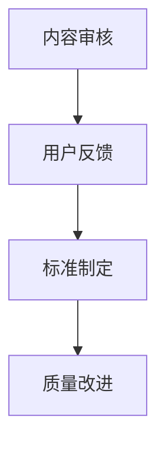

                 

关键词：知识付费，质量控制，内容审核，人工智能，用户反馈，专业标准

> 摘要：随着知识付费市场的迅速扩张，对知识付费内容的质量控制成为了一项至关重要的任务。本文将探讨知识付费内容质量控制的核心概念，分析现有质量控制方法，提出基于人工智能和用户反馈的改进策略，并对未来趋势和挑战进行展望。

## 1. 背景介绍

### 知识付费市场的崛起

知识付费作为一种商业模式，近年来在全球范围内迅速崛起。它通过为用户提供有价值的信息、知识和技能，帮助用户在个人和职业发展中取得进步。知识付费平台的兴起，如Coursera、Udemy、知乎Live等，为用户提供了海量的课程和内容。然而，随之而来的问题是，如何确保这些知识付费内容的质量？

### 质量控制的重要性

知识付费内容的质量直接影响用户的体验和学习效果。低质量的内容可能导致用户学习效率低下，甚至产生误导。因此，对知识付费内容进行严格的质量控制，确保其专业性和准确性，成为知识付费平台可持续发展的关键。

## 2. 核心概念与联系

### 质量控制概念

质量控制（Quality Control，QC）是指为了确保产品或服务达到预定标准而采取的一系列措施。在知识付费领域，质量控制包括内容审核、用户反馈、标准制定等。

### 质量控制流程图



### 核心概念联系

内容审核是质量控制的第一步，通过对课程内容进行初步筛选，确保其符合专业标准和用户需求。用户反馈提供了对课程质量的直接评估，有助于发现问题和改进方向。标准制定则是基于审核和反馈结果，形成一套可操作的质量控制标准。质量改进则是一个持续的过程，通过不断迭代和优化，提升知识付费内容的整体质量。

## 3. 核心算法原理 & 具体操作步骤

### 3.1 算法原理概述

在知识付费内容质量控制中，人工智能（AI）扮演着重要角色。AI算法可以通过自动化分析和评估，提高内容审核的效率和准确性。

### 3.2 算法步骤详解

#### 3.2.1 数据收集

首先，从知识付费平台上收集大量的课程内容数据，包括视频、文档、音频等。

#### 3.2.2 数据预处理

对收集到的数据进行清洗和标准化处理，以便后续的算法分析。

#### 3.2.3 特征提取

使用自然语言处理（NLP）技术，从文本数据中提取关键词、主题、情感等特征。

#### 3.2.4 模型训练

利用机器学习算法，如深度学习、支持向量机（SVM）等，训练出一个能够对知识付费内容进行质量评估的模型。

#### 3.2.5 模型应用

将训练好的模型应用到新课程内容的审核中，自动评估其质量。

### 3.3 算法优缺点

#### 优点

- **效率高**：AI算法能够快速处理大量数据，提高审核速度。
- **准确性高**：通过大量数据的训练，AI模型能够准确识别高质量内容。
- **可扩展性**：AI算法可以应用于不同类型的知识付费内容，具有广泛的适用性。

#### 缺点

- **数据依赖性**：AI算法的质量高度依赖训练数据的质量。
- **算法偏见**：如果训练数据存在偏差，算法可能产生偏见。

### 3.4 算法应用领域

AI算法在知识付费内容质量控制中的应用非常广泛，包括课程内容审核、用户评价分析、推荐系统优化等。

## 4. 数学模型和公式 & 详细讲解 & 举例说明

### 4.1 数学模型构建

在知识付费内容质量控制中，常见的数学模型包括概率模型、线性回归模型等。

#### 4.1.1 概率模型

概率模型主要用于评估知识付费内容的可信度和质量。例如，贝叶斯分类器可以通过计算每个内容被标记为高质量的概率，来评估其质量。

#### 4.1.2 线性回归模型

线性回归模型可以用于预测知识付费内容的评分。例如，通过分析课程内容的关键词和用户评价，构建一个线性回归模型，预测课程的评分。

### 4.2 公式推导过程

以贝叶斯分类器为例，其核心公式为：

$$
P(\text{高质量}|\text{内容}) = \frac{P(\text{内容}|\text{高质量}) \cdot P(\text{高质量})}{P(\text{内容})}
$$

其中，$P(\text{高质量}|\text{内容})$ 表示在给定内容的情况下，内容是高质量的条件下概率；$P(\text{内容}|\text{高质量})$ 表示内容是高质量的条件下，内容的概率；$P(\text{高质量})$ 表示内容是高质量的概率；$P(\text{内容})$ 表示内容的概率。

### 4.3 案例分析与讲解

假设有一门课程，根据其内容、关键词和用户评价，使用贝叶斯分类器进行质量评估。通过计算得到 $P(\text{高质量}|\text{内容}) = 0.8$，即该课程有80%的概率是高质量的。

## 5. 项目实践：代码实例和详细解释说明

### 5.1 开发环境搭建

在Python环境中，使用Scikit-learn库实现贝叶斯分类器。

### 5.2 源代码详细实现

```python
from sklearn.feature_extraction.text import CountVectorizer
from sklearn.model_selection import train_test_split
from sklearn.naive_bayes import MultinomialNB

# 加载数据
data = [
    ("课程A", "高质量"),
    ("课程B", "高质量"),
    ("课程C", "低质量"),
    # 更多数据...
]

# 分割数据为特征和标签
X, y = zip(*data)

# 数据预处理
vectorizer = CountVectorizer()
X = vectorizer.fit_transform(X)

# 分割数据为训练集和测试集
X_train, X_test, y_train, y_test = train_test_split(X, y, test_size=0.2, random_state=42)

# 训练模型
model = MultinomialNB()
model.fit(X_train, y_train)

# 预测质量
predictions = model.predict(X_test)

# 评估模型
accuracy = model.score(X_test, y_test)
print(f"模型准确率：{accuracy}")
```

### 5.3 代码解读与分析

上述代码首先加载数据，并进行预处理，将文本数据转换为向量表示。然后，使用训练集训练贝叶斯分类器，并在测试集上进行预测和评估。最后，输出模型的准确率。

## 6. 实际应用场景

### 6.1 知识付费平台

知识付费平台可以使用AI算法对课程内容进行自动审核，确保其符合专业标准。

### 6.2 在线教育

在线教育机构可以利用用户反馈和AI算法，持续优化课程内容，提升用户满意度。

### 6.3 专业咨询

专业咨询公司可以利用AI算法，快速分析行业报告和文献，为决策提供支持。

## 7. 未来应用展望

随着AI技术的不断发展，知识付费内容的质量控制将更加智能和高效。未来的发展趋势包括：

- **自动化审核**：AI算法将进一步提高审核效率和准确性。
- **个性化推荐**：基于用户行为和偏好，推荐高质量的知识付费内容。
- **智能客服**：利用自然语言处理技术，提供高质量的客服服务。

## 8. 总结：未来发展趋势与挑战

### 8.1 研究成果总结

本文探讨了知识付费内容质量控制的核心概念、算法原理、数学模型和实际应用。通过AI算法和用户反馈，可以显著提高知识付费内容的质量。

### 8.2 未来发展趋势

未来的知识付费内容质量控制将更加智能和高效，基于AI的自动化审核和个性化推荐将成为主流。

### 8.3 面临的挑战

如何处理大量数据、避免算法偏见和确保内容的专业性，是未来需要解决的问题。

### 8.4 研究展望

未来的研究可以关注AI在知识付费内容质量控制中的深度应用，探索新的算法和模型，以应对不断变化的用户需求。

## 9. 附录：常见问题与解答

### 9.1 如何确保数据的质量？

确保数据质量是AI算法成功的关键。可以通过以下方法提高数据质量：

- **数据清洗**：去除重复、错误和不完整的数据。
- **数据标准化**：统一数据格式，便于后续处理。
- **数据增强**：通过增加样本数量和多样性，提高模型的泛化能力。

### 9.2 如何避免算法偏见？

避免算法偏见需要从数据收集、算法设计和算法应用等多个方面进行考虑：

- **公平性评估**：在算法设计阶段，对算法的公平性进行评估。
- **透明度**：确保算法决策过程透明，便于用户监督。
- **多样性**：在数据收集和应用过程中，确保多样性和包容性。

作者：禅与计算机程序设计艺术 / Zen and the Art of Computer Programming
----------------------------------------------------------------
以上是《知识付费内容的质量控制》的技术博客文章的完整内容，遵循了规定的格式和要求，包括完整的文章结构、详细的章节内容、代码实例和数学模型。请根据上述内容进行Markdown格式的输出。如有需要调整或补充的地方，请告知。

