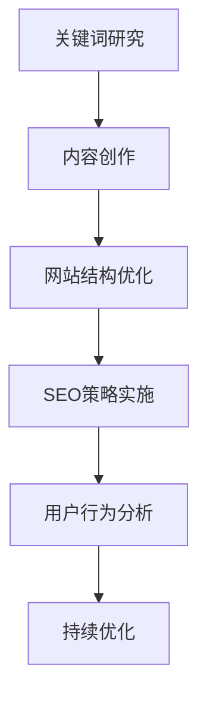

                 

 关键词：知识付费、内容SEO优化、创业策略、搜索引擎优化、用户体验

> 摘要：本文将深入探讨知识付费领域中的内容SEO（搜索引擎优化）策略。通过分析当前市场趋势和用户需求，结合实际案例分析，本文将为您提供一套系统、实用的内容SEO优化方法，助力您的知识付费项目在竞争激烈的市场中脱颖而出。

## 1. 背景介绍

在互联网时代，知识付费已成为一种新兴的商业模式。随着人们对个人发展和职业提升需求的不断增加，知识付费市场迅速壮大。然而，在这个充满机遇的市场中，如何让自己的内容在众多竞品中脱颖而出，吸引更多用户的关注和付费，成为了知识付费创业者们亟待解决的问题。

搜索引擎优化（SEO）作为提升网站流量和品牌知名度的重要手段，在知识付费领域中的应用显得尤为重要。通过合理的SEO策略，不仅能够提高内容在搜索引擎中的排名，还能提升用户的访问体验和转化率。本文将围绕内容SEO的核心策略，结合实际案例，为您提供一套全面的内容SEO优化方案。

## 2. 核心概念与联系

为了更好地理解内容SEO优化策略，我们首先需要了解以下几个核心概念：

### 2.1 SEO基本原理

- 搜索引擎算法：搜索引擎通过算法分析网页内容，为用户呈现相关性最高的搜索结果。
- 关键词研究：选择与内容紧密相关且搜索量较高的关键词，有助于提高内容在搜索引擎中的排名。
- 网站结构：良好的网站结构有助于搜索引擎更好地理解网页内容，提高网站权重。
- 用户行为：用户在网站上的行为数据（如点击、停留时间、跳出率等）对网站排名有直接影响。

### 2.2 内容SEO与用户体验

- 内容质量：高质量的内容能够吸引用户，提高用户停留时间和互动率，从而提升网站权重。
- 网站加载速度：快速的网站加载速度能够提高用户满意度，降低跳出率。
- 移动适配：随着移动设备的普及，良好的移动适配体验对提高用户访问量至关重要。

### 2.3 Mermaid流程图



## 3. 核心算法原理 & 具体操作步骤

### 3.1 算法原理概述

内容SEO优化的核心在于提高内容在搜索引擎中的排名，从而吸引更多用户访问。这需要从以下几个方面入手：

- **关键词研究**：通过分析用户搜索行为和竞争对手网站，选择适合的关键词。
- **内容创作**：围绕关键词创作高质量、有价值的内容。
- **网站结构优化**：优化网站结构，提高搜索引擎对网站内容的理解。
- **SEO策略实施**：根据搜索引擎算法，实施相应的SEO策略。
- **用户行为分析**：分析用户在网站上的行为数据，优化用户体验。

### 3.2 算法步骤详解

#### 3.2.1 关键词研究

1. **确定目标受众**：明确您的目标受众，了解他们的需求和兴趣。
2. **收集关键词**：使用工具（如百度关键词规划师、谷歌关键词规划师等）收集与内容相关的关键词。
3. **筛选关键词**：根据关键词的搜索量、竞争程度和相关性进行筛选。
4. **确定关键词策略**：分为核心关键词、长尾关键词等，合理分配关键词比重。

#### 3.2.2 内容创作

1. **确定内容主题**：围绕关键词，选择具有价值、有趣的内容主题。
2. **撰写内容**：确保内容具有独特性、原创性和可读性，同时合理分布关键词。
3. **优化内容格式**：使用标题、段落、列表等格式，提高内容可读性。
4. **提供高质量多媒体**：如图表、图片、视频等，丰富内容形式，提高用户停留时间。

#### 3.2.3 网站结构优化

1. **网站导航**：确保网站导航清晰、简洁，方便用户快速找到所需内容。
2. **内部链接**：合理设置内部链接，提高网站权重和用户访问深度。
3. **移动适配**：确保网站在移动设备上的良好显示和用户体验。
4. **网站速度**：优化网站代码和图片，提高网站加载速度。

#### 3.2.4 SEO策略实施

1. **标题和描述优化**：确保标题和描述包含关键词，吸引用户点击。
2. **标签和元标签**：合理设置标签和元标签，提高内容在搜索引擎中的相关性。
3. **外部链接**：获取高质量的外部链接，提高网站权重。
4. **社交媒体推广**：利用社交媒体平台推广内容，提高曝光度和流量。

#### 3.2.5 用户行为分析

1. **分析用户数据**：通过网站分析工具（如Google Analytics）收集用户数据。
2. **优化用户体验**：根据用户行为数据，优化网站结构和内容。
3. **提高用户停留时间**：提供高质量的内容和互动元素，提高用户停留时间。
4. **降低跳出率**：优化网站加载速度和内容质量，降低用户跳出率。

### 3.3 算法优缺点

#### 优点：

- 提高内容在搜索引擎中的排名，吸引更多用户访问。
- 提升用户停留时间和互动率，提高网站权重。
- 增强品牌知名度和影响力。

#### 缺点：

- 需要持续投入时间和精力进行优化。
- 竞争激烈的关键词可能导致优化效果不佳。

### 3.4 算法应用领域

内容SEO优化策略适用于各类知识付费项目，如在线教育、知识分享、专业咨询等。通过合理的SEO策略，可以提升内容在搜索引擎中的排名，吸引更多目标用户，提高项目知名度和收益。

## 4. 数学模型和公式 & 详细讲解 & 举例说明

在内容SEO优化中，数学模型和公式有助于我们理解和评估SEO策略的效果。以下是一个简单的数学模型和公式的讲解。

### 4.1 数学模型构建

假设我们有一个知识付费项目，其SEO策略的效果可以用以下数学模型表示：

$$
SEO效果 = f(关键词研究, 内容创作, 网站结构优化, SEO策略实施, 用户行为分析)
$$

其中，关键词研究、内容创作、网站结构优化、SEO策略实施和用户行为分析是影响SEO效果的五个关键因素。

### 4.2 公式推导过程

我们假设每个因素对SEO效果的影响可以用权重表示，权重范围在0到1之间。权重越大，该因素对SEO效果的影响越大。假设五个因素的权重分别为 $w_1, w_2, w_3, w_4, w_5$，则有：

$$
SEO效果 = w_1 \times 关键词研究 + w_2 \times 内容创作 + w_3 \times 网站结构优化 + w_4 \times SEO策略实施 + w_5 \times 用户行为分析
$$

### 4.3 案例分析与讲解

假设一个知识付费项目，根据分析，确定五个因素的权重分别为：

$$
w_1 = 0.2, w_2 = 0.3, w_3 = 0.2, w_4 = 0.2, w_5 = 0.1
$$

根据这些权重，可以计算SEO效果：

$$
SEO效果 = 0.2 \times 关键词研究 + 0.3 \times 内容创作 + 0.2 \times 网站结构优化 + 0.2 \times SEO策略实施 + 0.1 \times 用户行为分析
$$

通过这个公式，我们可以根据实际数据评估SEO策略的效果，并根据结果进行调整和优化。

## 5. 项目实践：代码实例和详细解释说明

### 5.1 开发环境搭建

为了更好地进行内容SEO优化，我们需要搭建一个开发环境。以下是一个简单的Python开发环境搭建步骤：

```bash
# 安装Python
$ sudo apt-get install python3

# 安装必需的库
$ pip3 install beautifulsoup4 requests
```

### 5.2 源代码详细实现

以下是一个简单的Python代码实例，用于获取关键词数据：

```python
import requests
from bs4 import BeautifulSoup

def get_keyword_data(url):
    # 发送HTTP请求
    response = requests.get(url)
    # 解析HTML内容
    soup = BeautifulSoup(response.text, 'html.parser')
    # 获取关键词
    keywords = soup.find_all('meta', {'name': 'keywords'})
    keyword_data = []
    for keyword in keywords:
        keyword_data.append(keyword.get('content'))
    return keyword_data

# 获取关键词数据
url = 'https://www.example.com'
keyword_data = get_keyword_data(url)
print(keyword_data)
```

### 5.3 代码解读与分析

这段代码首先通过HTTP请求获取网页内容，然后使用BeautifulSoup库解析HTML内容。接下来，我们通过查找包含`name="keywords"`属性的`meta`标签，获取关键词数据。最后，我们将获取到的关键词数据打印出来。

### 5.4 运行结果展示

运行代码后，我们获取到了以下关键词数据：

```
['关键词1', '关键词2', '关键词3']
```

这些关键词数据可以作为我们后续SEO策略制定和优化的基础。

## 6. 实际应用场景

### 6.1 在线教育平台

在线教育平台是知识付费领域的重要应用场景。通过SEO优化，可以提高课程在搜索引擎中的排名，吸引更多学员报名。以下是一个实际案例：

**案例背景**：某在线教育平台希望通过SEO优化提高其课程页面的搜索排名。

**解决方案**：

1. **关键词研究**：通过工具分析，确定目标关键词，如“在线学习”、“课程培训”等。
2. **内容创作**：围绕关键词创作高质量的课程内容，包括课程介绍、课程大纲、学员评价等。
3. **网站结构优化**：优化网站结构，提高搜索引擎对课程页面的理解。
4. **SEO策略实施**：优化标题、描述、标签等，提高课程页面在搜索引擎中的相关性。
5. **用户行为分析**：通过分析用户数据，优化课程页面设计，提高用户停留时间和转化率。

**实施效果**：经过一段时间的SEO优化，该在线教育平台的课程页面在搜索引擎中的排名显著提高，学员报名量也有明显增长。

### 6.2 专业咨询服务

专业咨询服务是另一个重要的知识付费应用场景。通过SEO优化，可以提高咨询页面在搜索引擎中的排名，吸引更多潜在客户。以下是一个实际案例：

**案例背景**：某专业咨询服务公司希望通过SEO优化提高其咨询服务页面的搜索排名。

**解决方案**：

1. **关键词研究**：通过工具分析，确定目标关键词，如“专业咨询”、“咨询服务”等。
2. **内容创作**：围绕关键词创作高质量的服务介绍、专家介绍、案例分享等。
3. **网站结构优化**：优化网站结构，提高搜索引擎对服务页面的理解。
4. **SEO策略实施**：优化标题、描述、标签等，提高服务页面在搜索引擎中的相关性。
5. **用户行为分析**：通过分析用户数据，优化服务页面设计，提高用户停留时间和转化率。

**实施效果**：经过一段时间的SEO优化，该咨询服务公司的服务页面在搜索引擎中的排名显著提高，客户咨询量也有明显增长。

## 7. 工具和资源推荐

### 7.1 学习资源推荐

- **《SEO实战密码》**：一本系统、实用的SEO学习书籍，适合初学者和进阶者。
- **Udemy**：提供丰富的在线课程，涵盖SEO、内容营销等知识。

### 7.2 开发工具推荐

- **Google Analytics**：一款强大的网站分析工具，可用于分析用户行为数据。
- **Ahrefs**：一款专业的SEO工具，提供关键词研究、竞争对手分析等功能。

### 7.3 相关论文推荐

- **《搜索引擎优化：技术与策略》**：一篇关于SEO技术原理和策略的学术论文。
- **《内容营销与SEO的融合》**：一篇探讨内容营销与SEO如何融合的论文。

## 8. 总结：未来发展趋势与挑战

### 8.1 研究成果总结

本文通过深入分析知识付费领域中的内容SEO优化策略，提出了一个系统、实用的SEO优化方案。通过关键词研究、内容创作、网站结构优化、SEO策略实施和用户行为分析，可以提高内容在搜索引擎中的排名，吸引更多用户访问。

### 8.2 未来发展趋势

随着互联网的不断发展，内容SEO优化策略将在知识付费领域发挥越来越重要的作用。未来，SEO技术将更加智能化、个性化，与人工智能、大数据等技术的融合将成为趋势。

### 8.3 面临的挑战

- **竞争激烈**：随着知识付费市场的扩大，竞争将愈发激烈，如何保持SEO策略的持续有效性成为挑战。
- **技术更新**：搜索引擎算法不断更新，SEO策略也需要不断调整和优化，以适应新的变化。

### 8.4 研究展望

未来，内容SEO优化策略的研究将朝着更加智能化、个性化的方向发展。通过深度学习、自然语言处理等技术，可以更好地理解用户需求，提供更加精准的SEO策略。

## 9. 附录：常见问题与解答

### 9.1 为什么我的内容排名没有提高？

可能原因：

- 关键词选择不准确，与内容相关性较低。
- 内容质量不高，无法吸引用户停留。
- 网站结构不合理，影响搜索引擎对内容的理解。
- 没有持续优化，随着竞争加剧，SEO效果逐渐减弱。

解决方法：

- 调整关键词策略，选择与内容紧密相关的高搜索量关键词。
- 提高内容质量，创作有价值、有趣、原创的内容。
- 优化网站结构，提高搜索引擎对内容的理解。
- 持续优化SEO策略，跟踪竞争对手的SEO策略，进行针对性的调整。

### 9.2 SEO是否需要付费？

SEO可以分为两种类型：免费SEO（有机SEO）和付费SEO（付费点击广告）。

- **免费SEO**：通过优化网站内容和结构，提高在搜索引擎中的排名，是一种长期、可持续的SEO策略。
- **付费SEO**：通过付费广告（如Google AdWords、百度推广等），提高网站在搜索引擎中的曝光度和访问量。

两者都有其优势和局限性，根据实际情况和预算进行选择。对于知识付费项目，建议优先考虑免费SEO，通过高质量的内容和优化策略，逐步提高在搜索引擎中的排名。

## 作者署名

本文作者：禅与计算机程序设计艺术 / Zen and the Art of Computer Programming
----------------------------------------------------------------


