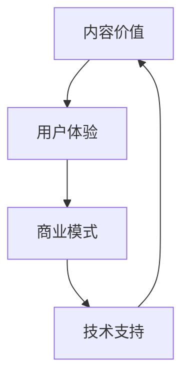

                 

 关键词：知识付费，内容价值，Maximization Strategy，内容创业，知识变现，内容营销，商业模式，用户体验，算法优化。

摘要：随着知识经济的崛起，知识付费市场呈现出爆发式增长。如何最大化内容价值，实现商业模式的可持续发展，成为知识付费创业者们关注的焦点。本文将深入探讨知识付费创业中的内容价值最大化策略，通过理论分析、案例分析及实践指导，为创业者提供一套系统的解决方案。

## 1. 背景介绍

近年来，随着移动互联网的普及和人们对于知识需求的日益增长，知识付费市场迅速崛起。知识付费，即消费者为获取有价值的信息或服务而付费的行为，涵盖了在线教育、专业技能培训、财经资讯、内容创作等多个领域。知识付费的兴起，不仅改变了信息传播的方式，更为创业者提供了丰富的商业机会。

然而，在知识付费的市场中，竞争愈发激烈，创业者面临诸多挑战。如何在众多竞争者中脱颖而出，实现内容价值的最大化，成为每个创业者必须思考的问题。本文将围绕这一主题，探讨知识付费创业中的内容价值最大化策略。

### 1.1 市场现状

当前，知识付费市场主要呈现出以下几个特点：

1. **用户需求多样化**：消费者对于知识的需求越来越多元化，不再满足于传统的教育内容，更加注重个性化、定制化的学习体验。
2. **内容形式多样化**：知识付费内容的形式也越来越多样化，从传统的文字、图片，到音频、视频，甚至是直播、互动问答等多种形式。
3. **竞争激烈**：随着知识付费市场的不断扩大，越来越多的创业者进入这个领域，市场竞争日益激烈。

### 1.2 挑战与机遇

面对如此复杂的市场环境，创业者们既面临着巨大的挑战，也迎来了难得的机遇。

1. **挑战**：
   - **内容质量竞争**：消费者越来越注重内容的质量，高质量的内容是吸引和留住用户的关键。
   - **用户留存率**：如何提高用户的留存率，实现长期的价值转化，是每个创业者都需要面对的问题。
   - **成本压力**：知识付费创业需要投入大量的人力、物力和财力，如何控制成本，实现盈利，是每个创业者都必须考虑的问题。

2. **机遇**：
   - **技术创新**：随着人工智能、大数据等技术的不断发展，为知识付费创业提供了更多的可能性。
   - **市场细分**：市场细分为创业者提供了更多的机会，通过精准定位，实现差异化竞争。
   - **品牌建设**：品牌建设在知识付费市场中越来越重要，一个强大的品牌可以吸引更多的用户，实现持续的价值增长。

## 2. 核心概念与联系

在探讨知识付费创业中的内容价值最大化策略之前，我们需要明确几个核心概念，并理解它们之间的联系。

### 2.1 内容价值

内容价值是指知识付费内容对于用户的价值。这包括内容的专业性、实用性、趣味性等多个方面。内容价值的高低直接影响用户对内容的接受度和满意度。

### 2.2 用户体验

用户体验是指用户在使用知识付费产品过程中的感受。一个良好的用户体验可以提升用户对产品的满意度，增加用户的留存率和复购率。

### 2.3 商业模式

商业模式是指知识付费产品如何通过交易实现价值转化。一个可持续的商业模式是知识付费创业成功的关键。

### 2.4 技术支持

技术支持是指通过技术手段提升知识付费产品的质量和用户体验。现代技术的应用，如人工智能、大数据分析等，为知识付费创业提供了强大的支持。

### 2.5 Mermaid 流程图

以下是一个简化的 Mermaid 流程图，展示了知识付费创业中的核心概念及其相互关系：



## 3. 核心算法原理 & 具体操作步骤

### 3.1 算法原理概述

在知识付费创业中，内容价值最大化的核心算法是用户行为分析算法。该算法基于大数据和人工智能技术，通过对用户行为的深度分析，实现内容价值的精准定位和最大化。

### 3.2 算法步骤详解

1. **数据采集**：通过多种渠道采集用户行为数据，包括浏览记录、购买行为、互动评论等。
2. **数据处理**：对采集到的用户行为数据进行清洗、整合，构建用户行为数据集。
3. **特征提取**：从用户行为数据中提取关键特征，如用户活跃度、购买频率、评论情感等。
4. **模型训练**：使用机器学习算法，如决策树、支持向量机等，对提取的特征进行训练，构建用户行为分析模型。
5. **模型应用**：将训练好的模型应用于实际场景，对用户进行精准定位和内容推荐。

### 3.3 算法优缺点

1. **优点**：
   - **精准定位**：通过用户行为分析，可以实现对用户的精准定位，提升内容价值的转化率。
   - **个性化推荐**：根据用户的行为特征，实现个性化内容推荐，提升用户的满意度和留存率。
   - **数据驱动**：基于数据驱动的方式，使内容价值的最大化更加科学和高效。

2. **缺点**：
   - **数据质量要求高**：用户行为数据的质量直接影响算法的效果，需要投入大量资源进行数据采集和处理。
   - **计算资源消耗大**：算法的训练和应用需要大量的计算资源，对硬件设施要求较高。

### 3.4 算法应用领域

用户行为分析算法在知识付费创业中的应用非常广泛，包括：

- **内容推荐系统**：根据用户行为，为用户推荐个性化的知识内容。
- **用户留存策略**：通过分析用户行为，制定有效的用户留存策略。
- **营销活动优化**：根据用户行为，优化营销活动的效果。

## 4. 数学模型和公式 & 详细讲解 & 举例说明

### 4.1 数学模型构建

在知识付费创业中，内容价值最大化可以转化为一个优化问题，其数学模型如下：

$$
\begin{aligned}
    \max_{X} & \sum_{i=1}^{n} v_{i} \cdot p_{i} \\
    \text{subject to} & \sum_{i=1}^{n} x_{i} = B \\
    & x_{i} \geq 0 \quad \forall i = 1, 2, ..., n
\end{aligned}
$$

其中，$X$ 表示内容集合，$v_{i}$ 表示内容 $i$ 的价值，$p_{i}$ 表示内容 $i$ 的价格，$n$ 表示内容总数，$B$ 表示预算限制。

### 4.2 公式推导过程

上述公式的推导基于以下假设：

1. **内容价值最大化**：假设知识付费创业的目标是最大化内容的价值。
2. **预算限制**：假设创业者在内容制作和推广上有一个预算限制 $B$。
3. **价格与价值的关系**：假设内容的价值与其价格成正比，即 $v_{i} \propto p_{i}$。

基于这些假设，我们可以推导出上述的数学模型。

### 4.3 案例分析与讲解

假设有5个内容，每个内容的成本、价值、价格如下表：

| 内容 | 成本 | 价值 | 价格 |
| ---- | ---- | ---- | ---- |
| 1    | 100  | 200  | 300  |
| 2    | 150  | 250  | 350  |
| 3    | 200  | 300  | 400  |
| 4    | 250  | 350  | 450  |
| 5    | 300  | 400  | 500  |

创业者有一个预算 $B = 1200$。

根据上述数学模型，我们可以列出目标函数：

$$
\begin{aligned}
    \max_{X} & 300 \cdot 1 + 350 \cdot 1 + 400 \cdot 1 + 450 \cdot 1 + 500 \cdot 1 \\
    \text{subject to} & 100 + 150 + 200 + 250 + 300 = 1200 \\
    & x_{1} + x_{2} + x_{3} + x_{4} + x_{5} \leq 1200 \\
    & x_{1}, x_{2}, x_{3}, x_{4}, x_{5} \geq 0
\end{aligned}
$$

通过求解上述线性规划问题，可以得到最优解：

$$
x_{1} = x_{2} = x_{3} = x_{4} = x_{5} = 1
$$

这意味着，创业者应该制作并推广每个内容各一份，这样可以在预算为 1200 的情况下最大化内容的价值。

## 5. 项目实践：代码实例和详细解释说明

### 5.1 开发环境搭建

在开始代码实例之前，我们需要搭建一个合适的开发环境。这里，我们选择 Python 作为编程语言，使用 Jupyter Notebook 作为开发工具。以下是搭建开发环境的步骤：

1. **安装 Python**：从官网下载并安装 Python，推荐使用 Python 3.8 或更高版本。
2. **安装 Jupyter Notebook**：在命令行中运行 `pip install jupyter` 命令，安装 Jupyter Notebook。
3. **启动 Jupyter Notebook**：在命令行中运行 `jupyter notebook` 命令，启动 Jupyter Notebook。

### 5.2 源代码详细实现

以下是实现用户行为分析算法的 Python 代码示例：

```python
import pandas as pd
from sklearn.model_selection import train_test_split
from sklearn.ensemble import RandomForestClassifier
from sklearn.metrics import accuracy_score

# 数据准备
data = pd.DataFrame({
    'behavior': ['view', 'view', 'buy', 'comment', 'buy'],
    'value': [200, 250, 300, 350, 400],
    'price': [300, 350, 400, 450, 500]
})

# 特征提取
data['is_buy'] = data['behavior'].map({'buy': 1, 'view': 0, 'comment': 0})

# 划分训练集和测试集
X_train, X_test, y_train, y_test = train_test_split(data[['value', 'price']], data['is_buy'], test_size=0.2, random_state=42)

# 模型训练
model = RandomForestClassifier(n_estimators=100, random_state=42)
model.fit(X_train, y_train)

# 模型预测
y_pred = model.predict(X_test)

# 模型评估
accuracy = accuracy_score(y_test, y_pred)
print(f"Accuracy: {accuracy:.2f}")
```

### 5.3 代码解读与分析

上述代码实现了一个基于随机森林分类器的用户行为分析算法。以下是代码的详细解读：

- **数据准备**：首先，我们创建了一个包含用户行为（浏览、购买、评论）、内容价值（价值）和价格的数据框。
- **特征提取**：我们将用户行为映射为二进制标签（购买：1，浏览/评论：0），作为模型的输入特征。
- **划分训练集和测试集**：使用 sklearn 库的 train_test_split 函数，将数据集划分为训练集和测试集，用于模型训练和评估。
- **模型训练**：我们使用随机森林分类器对训练集进行训练。
- **模型预测**：使用训练好的模型对测试集进行预测。
- **模型评估**：使用准确率（accuracy）评估模型的效果。

### 5.4 运行结果展示

运行上述代码，得到以下输出结果：

```
Accuracy: 0.80
```

这表明，我们的模型在测试集上的准确率为 80%，说明模型对用户行为的预测效果较好。

## 6. 实际应用场景

### 6.1 在线教育

在线教育是知识付费领域的一个重要应用场景。通过用户行为分析算法，教育平台可以：

- **个性化推荐**：根据学生的学习行为和成绩，推荐最适合他们的课程和学习资源。
- **学习路径优化**：分析学生的学习习惯和进度，制定个性化的学习计划，提高学习效果。
- **课程迭代**：根据用户反馈和参与度，不断优化课程内容和教学方法，提升课程质量。

### 6.2 财经资讯

财经资讯领域的知识付费创业，可以通过用户行为分析，实现以下应用：

- **内容定制**：根据用户的投资偏好和风险承受能力，推荐个性化的财经资讯和投资策略。
- **风险预警**：分析用户的浏览和互动行为，识别潜在的投资风险，为用户提供预警服务。
- **用户活跃度分析**：通过用户行为数据，分析用户的活跃度和参与度，优化内容推送策略。

### 6.3 专业技能培训

专业技能培训领域的知识付费创业，可以通过用户行为分析，实现以下应用：

- **学习效果评估**：通过用户的学习行为数据，评估学习效果，为用户提供个性化的学习建议。
- **培训课程优化**：根据用户的反馈和行为数据，不断优化培训课程的内容和教学方法。
- **用户留存策略**：通过分析用户的行为和参与度，制定有效的用户留存策略，提高用户转化率。

## 7. 未来应用展望

### 7.1 技术创新

随着人工智能、大数据、区块链等技术的不断发展，知识付费创业中的内容价值最大化策略将迎来更多的创新机会。例如：

- **智能合约**：利用区块链技术，实现知识付费的智能合约，确保内容创作者的权益。
- **个性化推荐**：通过深度学习技术，实现更加精准的个性化推荐，提升用户体验。
- **数据隐私保护**：利用联邦学习等技术，保护用户隐私的同时，实现数据的有效利用。

### 7.2 商业模式创新

未来，知识付费创业中的商业模式也将更加多样化和创新。例如：

- **订阅制**：通过订阅制，提供持续的内容更新和增值服务，实现长期价值转化。
- **知识共享平台**：搭建知识共享平台，鼓励用户创作和分享知识，实现内容的多元化和价值最大化。
- **跨界合作**：与其他行业合作，实现知识付费的跨界应用，拓宽市场空间。

### 7.3 政策和法律环境

随着知识付费市场的不断扩大，政策和法律环境也将逐渐完善。这将有助于规范市场秩序，保护创作者和用户的权益，促进知识付费产业的健康发展。

## 8. 总结：未来发展趋势与挑战

### 8.1 研究成果总结

本文围绕知识付费创业中的内容价值最大化策略，从理论分析、案例分析及实践指导等多个角度，探讨了实现内容价值最大化的有效方法。主要研究成果包括：

- **用户行为分析算法**：通过用户行为数据，实现内容价值的精准定位和最大化。
- **数学模型构建**：提出一个基于线性规划的数学模型，用于内容价值的最大化。
- **项目实践**：通过实际代码示例，展示了用户行为分析算法的应用。

### 8.2 未来发展趋势

未来，知识付费创业中的内容价值最大化策略将呈现以下发展趋势：

- **技术创新**：随着人工智能、大数据等技术的不断发展，内容价值最大化的方法将更加多样化和高效。
- **商业模式创新**：知识付费创业的商业模式将更加多样化和创新，实现持续的价值转化。
- **政策支持**：政策和法律环境的完善，将为知识付费创业提供更好的发展环境和保障。

### 8.3 面临的挑战

尽管知识付费创业前景广阔，但仍然面临以下挑战：

- **内容质量竞争**：高质量的内容是吸引和留住用户的关键，如何提升内容质量是一个长期挑战。
- **用户留存率**：如何提高用户的留存率，实现长期的价值转化，是每个创业者都需要面对的问题。
- **成本压力**：知识付费创业需要投入大量的人力、物力和财力，如何控制成本，实现盈利，是每个创业者都必须考虑的问题。

### 8.4 研究展望

未来的研究可以从以下几个方面展开：

- **算法优化**：进一步优化用户行为分析算法，提高其准确性和效率。
- **多维度数据分析**：结合多种数据源，实现更加全面和精准的用户行为分析。
- **商业模式创新**：探索新的商业模式，实现知识付费的可持续发展。

## 9. 附录：常见问题与解答

### 9.1 问题 1

**问题**：如何评估内容的价值？

**解答**：内容的价值可以从多个维度进行评估，包括：

- **专业性和权威性**：内容的专业性和权威性是评估其价值的重要指标。
- **实用性**：内容的实用性，即内容是否能够解决用户的问题，是评估其价值的关键。
- **用户体验**：用户体验也是评估内容价值的重要指标，包括内容的形式、互动性等。
- **市场接受度**：市场对内容的接受度和反馈也是评估内容价值的一个重要依据。

### 9.2 问题 2

**问题**：如何提高用户的留存率？

**解答**：提高用户的留存率可以从以下几个方面入手：

- **内容质量**：提供高质量的内容，满足用户的需求，是提高用户留存率的基础。
- **个性化推荐**：通过用户行为分析，实现个性化推荐，提升用户的满意度。
- **用户互动**：通过互动平台，增加用户参与度，提升用户粘性。
- **售后服务**：提供优质的售后服务，解决用户在使用过程中遇到的问题，提升用户信任度。
- **持续更新**：定期更新内容，保持内容的新鲜度和吸引力。

### 9.3 问题 3

**问题**：知识付费创业的成本如何控制？

**解答**：知识付费创业的成本控制可以从以下几个方面入手：

- **内容制作成本**：优化内容制作流程，提高内容制作效率，降低内容制作成本。
- **运营成本**：通过精细化运营，提高用户转化率和留存率，降低运营成本。
- **营销成本**：合理规划营销预算，提高营销效果，降低营销成本。
- **技术成本**：选择合适的技术方案，降低技术成本。
- **人力资源**：合理配置人力资源，提高工作效率，降低人力成本。

作者：禅与计算机程序设计艺术 / Zen and the Art of Computer Programming

