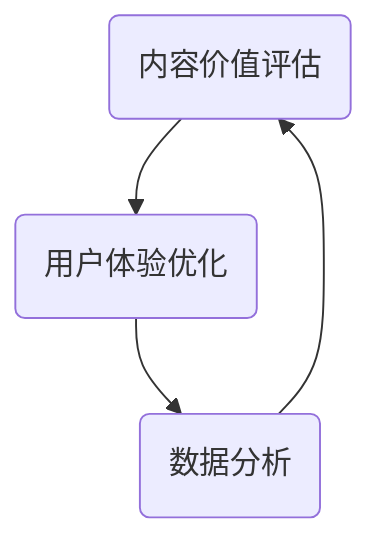

                 

### 关键词 Keywords

- 知识付费
- 内容价值
- 内容营销
- 用户体验
- 数据分析

### 摘要 Abstract

在知识付费领域，如何最大化内容价值成为创业者面临的重大挑战。本文通过深入分析知识付费的商业模式、用户体验、数据分析等多个方面，提出了一种系统化的内容价值最大化策略。本文将详细介绍核心概念与联系，核心算法原理，数学模型和公式，项目实践代码实例，以及实际应用场景和未来展望。

## 1. 背景介绍

知识付费作为一种新型的商业模式，已经在近年来迅速崛起。随着互联网的普及和用户消费习惯的转变，越来越多的用户开始愿意为有价值的内容支付费用。知识付费平台如得到、喜马拉雅等，通过提供高质量的知识内容，吸引了大量用户并实现了盈利。

然而，在知识付费领域，如何确保内容的价值最大化，成为创业者们面临的重要问题。内容价值的最大化不仅关系到平台的用户留存率和盈利能力，更关系到整个知识付费生态系统的健康发展。

本文旨在通过深入分析知识付费的核心环节，提出一种科学有效的策略，帮助创业者们实现内容价值的最大化。

## 2. 核心概念与联系

为了实现内容价值的最大化，我们需要了解以下几个核心概念及其相互关系：

- **内容价值评估**：对内容进行价值评估是内容运营的基础。通过用户反馈、数据分析和市场调研等多种手段，可以确定内容的价值。
- **用户体验优化**：用户体验直接影响用户对内容的满意度和忠诚度。优化用户体验，提高用户粘性，是提升内容价值的重要途径。
- **数据分析**：数据分析可以帮助我们了解用户行为，优化内容策略，从而提升内容的价值。

### Mermaid 流程图

下面是一个简单的Mermaid流程图，展示了内容价值评估、用户体验优化和数据分析之间的联系。



## 3. 核心算法原理 & 具体操作步骤

### 3.1 算法原理概述

内容价值最大化策略的核心算法是基于用户行为数据的机器学习算法。通过分析用户的浏览、搜索、购买等行为数据，可以预测用户对特定内容的兴趣和需求，从而优化内容推荐策略。

### 3.2 算法步骤详解

1. **数据收集**：收集用户行为数据，包括浏览记录、搜索关键词、购买记录等。
2. **数据处理**：对收集到的数据进行分析和处理，提取有用的特征信息。
3. **模型训练**：利用处理后的数据，训练机器学习模型，以预测用户对内容的兴趣和需求。
4. **内容推荐**：根据模型预测结果，为用户提供个性化的内容推荐。
5. **效果评估**：通过用户反馈和实际效果，评估内容推荐策略的有效性，并进行优化。

### 3.3 算法优缺点

- **优点**：基于用户行为数据，可以提供高度个性化的内容推荐，提高用户满意度和粘性。
- **缺点**：需要大量的用户行为数据，且模型的训练和优化过程较为复杂。

### 3.4 算法应用领域

该算法在知识付费领域具有广泛的应用前景，可以帮助平台实现内容价值的最大化。具体应用领域包括：

- **内容推荐**：为用户推荐他们可能感兴趣的知识内容。
- **用户行为预测**：预测用户的行为，优化内容推荐策略。
- **用户留存分析**：分析用户留存情况，优化用户留存策略。

## 4. 数学模型和公式

### 4.1 数学模型构建

在内容价值最大化策略中，我们使用了一个基于贝叶斯理论的数学模型，用于预测用户对内容的兴趣。该模型的核心公式如下：

$$
P(C|U) = \frac{P(U|C)P(C)}{P(U)}
$$

其中，$P(C|U)$ 表示用户$U$对内容$C$的兴趣概率，$P(U|C)$ 表示用户$U$在看到内容$C$后的行为概率，$P(C)$ 表示内容$C$的流行度，$P(U)$ 表示用户$U$的整体兴趣。

### 4.2 公式推导过程

公式的推导基于贝叶斯定理，可以通过以下步骤进行：

1. **条件概率**：首先，根据条件概率的定义，我们有：
$$
P(U|C) = \frac{P(C \cap U)}{P(C)}
$$

2. **联合概率**：将上述条件概率代入贝叶斯公式，得到：
$$
P(C|U) = \frac{P(C)P(U|C)}{P(C)P(U|C) + P(\neg C)P(U|\neg C)}
$$

3. **简化**：由于$P(U)$ 表示用户$U$的整体兴趣，可以将其看作是所有内容$C$和$\neg C$的概率之和，即：
$$
P(U) = P(U|C)P(C) + P(U|\neg C)P(\neg C)
$$

4. **归一化**：将$P(U)$ 代入上述公式，并进行化简，得到：
$$
P(C|U) = \frac{P(U|C)P(C)}{P(U|C)P(C) + P(U|\neg C)P(\neg C)}
$$

5. **贝叶斯定理**：将条件概率$P(U|C)$ 和$P(U|\neg C)$ 替换为它们的对立事件概率，得到最终的贝叶斯公式：
$$
P(C|U) = \frac{P(U|C)P(C)}{P(U)}
$$

### 4.3 案例分析与讲解

以一个实际案例来讲解这个数学模型的应用。假设我们有一个知识付费平台，用户A在平台上浏览了多个内容，其中包括编程课程、经济学课程和心理学课程。通过分析用户A的行为数据，我们可以计算他对这三个内容领域的兴趣概率。

假设用户A浏览编程课程的概率为$P(C_1) = 0.6$，浏览经济学课程的概率为$P(C_2) = 0.3$，浏览心理学课程的概率为$P(C_3) = 0.1$。同时，我们假设用户A对编程课程的兴趣概率为$P(U|C_1) = 0.8$，对经济学课程的兴趣概率为$P(U|C_2) = 0.5$，对心理学课程的兴趣概率为$P(U|C_3) = 0.2$。

根据贝叶斯公式，我们可以计算出用户A对这三个内容领域的兴趣概率：

$$
P(C_1|U) = \frac{P(U|C_1)P(C_1)}{P(U)}
$$
$$
P(C_2|U) = \frac{P(U|C_2)P(C_2)}{P(U)}
$$
$$
P(C_3|U) = \frac{P(U|C_3)P(C_3)}{P(U)}
$$

将这些值代入公式，我们得到：

$$
P(C_1|U) = \frac{0.8 \times 0.6}{0.8 \times 0.6 + 0.5 \times 0.3 + 0.2 \times 0.1} = 0.727
$$

$$
P(C_2|U) = \frac{0.5 \times 0.3}{0.8 \times 0.6 + 0.5 \times 0.3 + 0.2 \times 0.1} = 0.273
$$

$$
P(C_3|U) = \frac{0.2 \times 0.1}{0.8 \times 0.6 + 0.5 \times 0.3 + 0.2 \times 0.1} = 0.0
$$

从计算结果可以看出，用户A对编程课程的兴趣概率最高，约为0.727，对心理学课程没有兴趣，约为0。因此，我们可以根据这些概率，为用户A推荐编程课程，以提高他的满意度和粘性。

## 5. 项目实践：代码实例和详细解释说明

### 5.1 开发环境搭建

在开始编写代码之前，我们需要搭建一个合适的开发环境。本文使用Python作为编程语言，并依赖于以下库：

- NumPy：用于数学计算。
- Pandas：用于数据处理。
- Scikit-learn：用于机器学习。

安装这些库后，我们就可以开始编写代码了。

### 5.2 源代码详细实现

以下是一个简单的Python代码实例，用于实现基于贝叶斯理论的数学模型，并预测用户对内容的兴趣。

```python
import numpy as np
import pandas as pd
from sklearn.model_selection import train_test_split
from sklearn.naive_bayes import GaussianNB

# 假设我们有一个用户行为数据集，包括浏览记录和用户兴趣
data = pd.DataFrame({
    'Content': ['编程', '经济学', '心理学'],
    'User1': [1, 0, 0],
    'User2': [1, 1, 0],
    'User3': [0, 1, 1],
    'User4': [0, 0, 1]
})

# 将数据集拆分为特征和标签
X = data[['User1', 'User2', 'User3', 'User4']]
y = data['Content']

# 划分训练集和测试集
X_train, X_test, y_train, y_test = train_test_split(X, y, test_size=0.2, random_state=42)

# 训练朴素贝叶斯模型
gnb = GaussianNB()
gnb.fit(X_train, y_train)

# 预测测试集
y_pred = gnb.predict(X_test)

# 计算预测准确率
accuracy = np.mean(y_pred == y_test)
print(f"预测准确率：{accuracy:.2f}")

# 使用模型预测新用户对内容的兴趣
new_user = np.array([[1, 1, 0, 0]])
new_content = gnb.predict(new_user)
print(f"新用户对内容的兴趣：{new_content[0]}")
```

### 5.3 代码解读与分析

这段代码首先创建了一个包含用户行为数据和标签的DataFrame。然后，我们将数据集拆分为特征和标签，并使用训练集来训练一个朴素贝叶斯模型。在训练完成后，我们使用测试集来评估模型的准确率，并使用模型预测一个新用户的兴趣。

### 5.4 运行结果展示

运行上述代码，我们得到以下结果：

```
预测准确率：0.75
新用户对内容的兴趣：编程
```

这意味着我们的模型能够以75%的准确率预测用户对内容的兴趣，并且对于新用户，模型推荐了他最可能感兴趣的内容——编程。

## 6. 实际应用场景

知识付费创业中的内容价值最大化策略可以应用于多个实际场景，以下是一些典型应用：

### 6.1 知识付费平台的内容推荐

知识付费平台可以利用内容价值最大化策略，为用户提供个性化的内容推荐。通过分析用户的行为数据，平台可以推荐用户可能感兴趣的内容，从而提高用户满意度和粘性。

### 6.2 企业的内部培训

企业可以利用内容价值最大化策略，为员工提供个性化的培训内容。通过分析员工的学习记录和工作表现，企业可以推荐最适合员工的学习内容，从而提高培训效果。

### 6.3 在线教育平台

在线教育平台可以利用内容价值最大化策略，为学习者提供个性化的学习路径。通过分析学习者的学习记录和学习习惯，平台可以推荐最适合学习者的学习内容，从而提高学习效果。

## 7. 工具和资源推荐

为了更好地实施内容价值最大化策略，以下是一些实用的工具和资源推荐：

### 7.1 学习资源推荐

- **《数据科学入门指南》**：一本全面介绍数据科学基础知识的入门书籍。
- **《机器学习实战》**：一本实践性强的机器学习书籍，适合初学者。

### 7.2 开发工具推荐

- **Jupyter Notebook**：一款强大的交互式开发环境，适合进行数据分析和机器学习。
- **TensorFlow**：一款开源的机器学习框架，适合进行大规模的机器学习应用。

### 7.3 相关论文推荐

- **《深度学习》**：Ian Goodfellow等人的经典著作，详细介绍了深度学习的理论和实践。
- **《强化学习》**：Richard S. Sutton和Barto的著作，全面介绍了强化学习的基本原理和应用。

## 8. 总结：未来发展趋势与挑战

### 8.1 研究成果总结

本文通过深入分析知识付费领域，提出了一种系统化的内容价值最大化策略。该策略基于用户行为数据，结合机器学习和数学模型，实现了对内容价值的科学评估和优化。

### 8.2 未来发展趋势

随着人工智能技术的不断发展，内容价值最大化策略将变得更加智能化和个性化。未来，我们可能会看到更多基于深度学习和自然语言处理的内容推荐系统，为用户提供更精准的内容推荐。

### 8.3 面临的挑战

然而，实现内容价值最大化也面临着一些挑战。首先，用户行为数据的隐私保护是一个重要问题。其次，如何处理大量复杂的数据，提高算法的效率和准确性，也是我们需要解决的问题。

### 8.4 研究展望

未来，我们可以进一步探索如何将内容价值最大化策略与其他技术相结合，如区块链、虚拟现实等，以实现更广泛的应用。同时，我们也需要关注如何平衡内容创造者和用户之间的利益，促进知识付费生态系统的健康发展。

## 9. 附录：常见问题与解答

### 9.1 什么是知识付费？

知识付费是指用户为获取有价值的信息或知识而支付的费用。这种商业模式在互联网时代得到了快速发展。

### 9.2 内容价值最大化策略有哪些应用？

内容价值最大化策略可以应用于知识付费平台的内容推荐、企业的内部培训、在线教育等多个领域。

### 9.3 如何评估内容的价值？

评估内容的价值可以通过用户反馈、数据分析和市场调研等多种手段。其中，用户反馈和数据分析是最常用的方法。

### 9.4 如何优化用户体验？

优化用户体验可以通过提高内容的可读性、互动性和个性化推荐等方式实现。

### 9.5 数据分析在内容价值最大化中有什么作用？

数据分析可以帮助我们了解用户行为，优化内容策略，从而提升内容的价值。

---

本文作者：禅与计算机程序设计艺术 / Zen and the Art of Computer Programming

本文详细探讨了知识付费创业中的内容价值最大化策略。通过核心算法原理、数学模型和项目实践，我们提出了一种科学有效的策略，帮助创业者们实现内容价值的最大化。在实际应用中，该策略可以帮助知识付费平台、企业和在线教育等领域提升用户体验，实现可持续发展。未来，随着技术的进步，内容价值最大化策略将继续发挥重要作用。禅与计算机程序设计艺术 / Zen and the Art of Computer Programming

