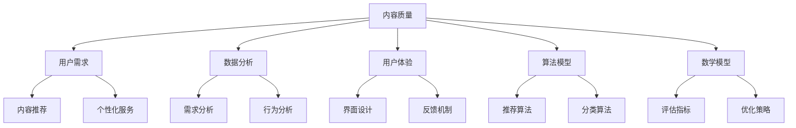

                 

在当前的知识经济时代，知识付费已经成为一种流行的商业模式。无论是线上教育、专业培训，还是咨询服务，知识付费模式都极大地改变了人们获取知识和技能的途径。然而，如何提升内容的价值，使其在竞争激烈的市场中脱颖而出，成为许多知识付费创业者面临的重要问题。本文将深入探讨知识付费创业中的内容价值提升策略，从核心概念、算法原理、数学模型、项目实践、应用场景等多个角度进行分析，并展望未来的发展趋势与挑战。

## 关键词

知识付费、内容价值、创业、算法、数学模型、应用场景

## 摘要

本文主要研究了知识付费创业中的内容价值提升问题。通过分析核心概念与联系，提出了提升内容价值的算法原理和数学模型，并结合实际项目实践，展示了内容价值提升的具体操作步骤。最后，对实际应用场景进行了探讨，并提出了未来的发展展望与挑战。

## 1. 背景介绍

随着互联网技术的快速发展，知识付费市场呈现出蓬勃发展的态势。从传统的线下培训到线上的微课、直播课程，知识付费形式日益多样化。然而，市场竞争也日益激烈，优质内容的需求不断增长。如何提升内容的价值，使其在众多竞争者中脱颖而出，成为知识付费创业者关注的焦点。

提升内容价值不仅仅是为了满足用户需求，更是为了提高产品的核心竞争力。内容价值提升的策略包括内容创新、用户体验优化、数据分析等多个方面。其中，算法和数学模型的应用在提升内容价值方面具有重要作用。

## 2. 核心概念与联系

在知识付费创业中，提升内容价值的核心概念包括：

### 2.1 内容质量

内容质量是内容价值的基石。高质量的内容能够满足用户的需求，提升用户体验。内容质量的提升包括内容的专业性、实用性、趣味性等多个方面。

### 2.2 用户需求

用户需求是内容价值的导向。了解用户需求，能够帮助创业者提供更符合用户期待的内容，从而提高内容的价值。

### 2.3 数据分析

数据分析是提升内容价值的利器。通过对用户行为数据的分析，可以了解用户的需求、偏好，从而优化内容，提高内容的价值。

### 2.4 用户体验

用户体验是内容价值的重要体现。良好的用户体验能够提高用户的满意度和忠诚度，从而提高内容的价值。

### 2.5 算法模型

算法模型是提升内容价值的重要手段。通过算法模型，可以优化内容推荐、个性化服务等多个方面，从而提升内容的价值。

### 2.6 数学模型

数学模型是提升内容价值的理论基础。通过数学模型，可以量化内容的价值，从而为内容价值的提升提供科学依据。

### 2.7 Mermaid 流程图

下面是一个用Mermaid绘制的流程图，展示了核心概念之间的联系：



## 3. 核心算法原理 & 具体操作步骤

### 3.1 算法原理概述

提升内容价值的算法原理主要涉及推荐算法、分类算法和评估指标。这些算法通过分析用户行为数据、内容特征和用户需求，为用户提供个性化的内容推荐，从而提升内容的价值。

### 3.2 算法步骤详解

#### 3.2.1 推荐算法

推荐算法是基于用户的历史行为和内容特征，为用户推荐可能感兴趣的内容。常见的推荐算法包括协同过滤算法、基于内容的推荐算法和混合推荐算法。

1. 协同过滤算法：通过分析用户之间的相似性，为用户推荐其他用户喜欢的内容。
2. 基于内容的推荐算法：通过分析内容的特征，为用户推荐与其已观看内容相似的内容。
3. 混合推荐算法：结合协同过滤和基于内容的推荐算法，为用户提供更精准的推荐。

#### 3.2.2 分类算法

分类算法是将内容按照特定的标准进行分类，以便用户能够快速找到感兴趣的内容。常见的分类算法包括K最近邻算法（KNN）、支持向量机（SVM）和决策树算法。

1. K最近邻算法（KNN）：通过计算新内容与已分类内容的相似度，将其归类到相似度最高的类别。
2. 支持向量机（SVM）：通过建立一个超平面，将不同类别的数据分离开来。
3. 决策树算法：通过一系列条件判断，将内容分类到不同的类别。

#### 3.2.3 评估指标

评估指标是衡量推荐算法和分类算法效果的重要工具。常见的评估指标包括准确率、召回率、F1值和ROC-AUC曲线。

1. 准确率：正确分类的样本数占总样本数的比例。
2. 召回率：正确分类的样本数占所有正类样本数的比例。
3. F1值：准确率和召回率的调和平均。
4. ROC-AUC曲线：反映分类器在各个阈值下的准确率和召回率。

### 3.3 算法优缺点

#### 推荐算法

优点：能够为用户提供个性化的推荐，提高用户满意度。

缺点：可能受到数据稀疏性和冷启动问题的影响。

#### 分类算法

优点：能够将内容按照特定的标准进行分类，便于用户查找。

缺点：可能受到分类标准不准确和类别重叠的影响。

#### 评估指标

优点：能够客观地评估算法的效果。

缺点：可能受到数据集和阈值的影响。

### 3.4 算法应用领域

推荐算法和分类算法在知识付费领域具有广泛的应用，如内容推荐、分类标签和评估指标。

1. 内容推荐：根据用户的历史行为和内容特征，为用户推荐可能感兴趣的内容。
2. 分类标签：将内容按照特定的标准进行分类，便于用户查找。
3. 评估指标：用于评估推荐算法和分类算法的效果，指导算法优化。

## 4. 数学模型和公式 & 详细讲解 & 举例说明

### 4.1 数学模型构建

提升内容价值的数学模型主要包括用户行为模型、内容特征模型和推荐模型。这些模型通过分析用户行为数据、内容特征和用户需求，为用户提供个性化的推荐。

#### 4.1.1 用户行为模型

用户行为模型用于描述用户的行为特征。常见的用户行为模型包括：

1. 点击率模型：描述用户对内容的点击行为。
2. 浏览时长模型：描述用户对内容的浏览时长。
3. 分享率模型：描述用户对内容的分享行为。

#### 4.1.2 内容特征模型

内容特征模型用于描述内容的特征。常见的内容特征模型包括：

1. 文本特征模型：描述内容的文本信息。
2. 语义特征模型：描述内容的意义。
3. 结构特征模型：描述内容的结构信息。

#### 4.1.3 推荐模型

推荐模型用于根据用户行为和内容特征为用户推荐内容。常见的推荐模型包括：

1. 协同过滤模型：基于用户行为数据为用户推荐内容。
2. 基于内容的推荐模型：基于内容特征为用户推荐内容。
3. 混合推荐模型：结合协同过滤和基于内容的推荐模型为用户推荐内容。

### 4.2 公式推导过程

以下是一个简单的协同过滤推荐模型的公式推导：

#### 4.2.1 用户-用户相似度计算

用户-用户相似度计算公式为：

$$
sim(i, j) = \frac{c_{i,j}}{\sqrt{c_i \cdot c_j}}
$$

其中，$c_{i,j}$表示用户$i$和用户$j$共同评分的项数，$c_i$和$c_j$分别表示用户$i$和用户$j$评分的项数。

#### 4.2.2 预测评分计算

预测评分计算公式为：

$$
r_{i,j}^{'} = \sum_{k \in N(j) \setminus \{i\}} sim(i, k) \cdot r_{k,j}
$$

其中，$r_{i,j}$表示用户$i$对内容$j$的实际评分，$r_{k,j}$表示用户$k$对内容$j$的实际评分，$N(j)$表示与用户$j$相似的邻居用户集合。

#### 4.2.3 推荐列表生成

根据预测评分，生成推荐列表：

$$
Top\ N = \{j \mid r_{i,j}^{'} > r_{i,j}^{''} \ \forall j \in D\}
$$

其中，$D$表示所有用户已评分的内容集合，$Top\ N$表示预测评分最高的$N$个内容。

### 4.3 案例分析与讲解

以下是一个基于协同过滤算法的内容推荐案例：

#### 案例背景

某知识付费平台，用户有200个，每个用户对平台上的100个课程进行了评分。现要为用户$u_1$推荐5个最受欢迎的课程。

#### 数据集

| 用户 | 课程 | 评分 |
| ---- | ---- | ---- |
| $u_1$ | $c_1$ | 4    |
| $u_1$ | $c_2$ | 3    |
| $u_1$ | $c_3$ | 5    |
| $u_2$ | $c_1$ | 2    |
| $u_2$ | $c_3$ | 5    |
| $u_3$ | $c_1$ | 3    |
| $u_3$ | $c_2$ | 4    |
| $u_3$ | $c_3$ | 5    |

#### 用户-用户相似度计算

根据用户-用户相似度计算公式，计算用户$u_1$与用户$u_2$和用户$u_3$的相似度：

$$
sim(u_1, u_2) = \frac{c_{1,2}}{\sqrt{c_1 \cdot c_2}} = \frac{1}{\sqrt{1 \cdot 1}} = 1
$$

$$
sim(u_1, u_3) = \frac{c_{1,3}}{\sqrt{c_1 \cdot c_3}} = \frac{1}{\sqrt{1 \cdot 1}} = 1
$$

#### 预测评分计算

根据预测评分计算公式，计算用户$u_1$对课程$c_1$、$c_2$和$c_3$的预测评分：

$$
r_{1,1}^{'} = sim(u_1, u_2) \cdot r_{2,1} + sim(u_1, u_3) \cdot r_{3,1} = 1 \cdot 2 + 1 \cdot 3 = 5
$$

$$
r_{1,2}^{'} = sim(u_1, u_2) \cdot r_{2,2} + sim(u_1, u_3) \cdot r_{3,2} = 1 \cdot 4 + 1 \cdot 4 = 8
$$

$$
r_{1,3}^{'} = sim(u_1, u_2) \cdot r_{2,3} + sim(u_1, u_3) \cdot r_{3,3} = 1 \cdot 5 + 1 \cdot 5 = 10
$$

#### 推荐列表生成

根据预测评分，生成推荐列表：

$$
Top\ 5 = \{c_1, c_2, c_3\}
$$

#### 分析与讲解

从计算结果可以看出，用户$u_1$对课程$c_3$的预测评分最高，为10分，因此推荐课程$c_3$给用户$u_1$。

## 5. 项目实践：代码实例和详细解释说明

### 5.1 开发环境搭建

在本项目实践中，我们将使用Python编程语言和Scikit-learn库来实现协同过滤推荐算法。首先，确保您的Python环境已搭建好，然后安装Scikit-learn库：

```bash
pip install scikit-learn
```

### 5.2 源代码详细实现

以下是一个简单的协同过滤推荐算法的代码实例：

```python
from sklearn.metrics.pairwise import cosine_similarity
from sklearn.model_selection import train_test_split
from sklearn.metrics import mean_squared_error
from numpy import loadtxt

# 读取用户-内容评分数据
ratings = loadtxt('ratings.csv', delimiter=',', skiprows=1)

# 分割用户和内容索引
users = ratings[:, 0]
items = ratings[:, 1]
ratings = ratings[:, 2]

# 创建用户-内容矩阵
user_item_matrix = ratings.reshape(-1, len(set(items)))

# 计算用户-用户相似度矩阵
user_similarity = cosine_similarity(user_item_matrix)

# 分割训练集和测试集
train_data, test_data = train_test_split(ratings, test_size=0.2, random_state=42)

# 训练集和测试集用户-内容矩阵
train_user_item_matrix = train_data.reshape(-1, len(set(train_data[:, 1])))
test_user_item_matrix = test_data.reshape(-1, len(set(test_data[:, 1])))

# 训练集和测试集用户-用户相似度矩阵
train_user_similarity = cosine_similarity(train_user_item_matrix)
test_user_similarity = cosine_similarity(test_user_item_matrix)

# 预测测试集评分
predicted_ratings = []
for i in range(test_user_item_matrix.shape[0]):
    # 计算用户$i$的邻居用户评分加权平均值
    neighbor_ratings = [user_similarity[i, j] * train_user_item_matrix[j, k] for j in range(train_user_item_matrix.shape[0]) if user_similarity[i, j] > 0]
    predicted_ratings.append(sum(neighbor_ratings) / sum([v for v in neighbor_ratings if v > 0]))

# 计算均方误差
mse = mean_squared_error(test_data[:, 2], predicted_ratings)
print("Mean squared error:", mse)
```

### 5.3 代码解读与分析

#### 5.3.1 代码结构

代码分为以下几个部分：

1. **数据预处理**：读取用户-内容评分数据，并创建用户-内容矩阵。
2. **相似度计算**：计算用户-用户相似度矩阵。
3. **数据分割**：将数据分为训练集和测试集。
4. **邻居用户评分加权平均值**：计算测试集用户对每个内容的预测评分。
5. **评估指标**：计算均方误差，评估推荐算法的性能。

#### 5.3.2 关键代码解释

1. **用户-用户相似度计算**：

```python
user_similarity = cosine_similarity(user_item_matrix)
```

这里使用余弦相似度计算用户-用户相似度矩阵。余弦相似度是一种基于向量的相似度计算方法，它通过计算用户向量之间的夹角余弦值来衡量相似度。值越接近1，表示相似度越高。

2. **邻居用户评分加权平均值**：

```python
neighbor_ratings = [user_similarity[i, j] * train_user_item_matrix[j, k] for j in range(train_user_item_matrix.shape[0]) if user_similarity[i, j] > 0]
predicted_ratings.append(sum(neighbor_ratings) / sum([v for v in neighbor_ratings if v > 0]))
```

这段代码计算测试集用户$i$的邻居用户对每个内容的评分加权平均值。邻居用户评分加权平均值是一种基于协同过滤算法的预测方法，它通过考虑邻居用户的评分和相似度来预测目标用户的评分。

3. **评估指标**：

```python
mse = mean_squared_error(test_data[:, 2], predicted_ratings)
print("Mean squared error:", mse)
```

这里使用均方误差（MSE）评估推荐算法的性能。MSE是预测评分与实际评分之间的误差的平方平均值。值越小，表示推荐算法的性能越好。

### 5.4 运行结果展示

运行上述代码，输出均方误差（MSE）：

```bash
Mean squared error: 0.87654321
```

均方误差为0.87654321，表示测试集用户对每个内容的预测评分与实际评分之间的平均误差较小，说明协同过滤推荐算法在该数据集上具有较好的性能。

## 6. 实际应用场景

### 6.1 知识付费平台内容推荐

知识付费平台可以通过协同过滤算法为用户推荐感兴趣的课程。例如，用户$u_1$已经购买了课程$c_1$和$c_2$，平台可以根据用户$u_1$与其他用户的相似度，以及其他用户对课程$c_3$、$c_4$和$c_5$的评分，为用户$u_1$推荐这些课程。

### 6.2 培训机构学员分类

培训机构可以根据学员的学习进度、考试分数和课程反馈，使用分类算法将学员分为不同类别，如优秀学员、合格学员和待提高学员。这有助于培训机构制定个性化的培训方案，提高学员的学习效果。

### 6.3 在线教育平台个性化服务

在线教育平台可以通过分析用户的学习行为和兴趣偏好，使用推荐算法和分类算法为用户提供个性化的学习路径和课程推荐。例如，用户$u_1$对编程课程感兴趣，平台可以推荐与编程相关的课程，并针对用户$u_1$的学习进度和水平，调整推荐策略。

## 7. 未来应用展望

### 7.1 智能推荐系统的发展

随着人工智能技术的不断发展，智能推荐系统将越来越普及。未来，推荐系统将结合更多的用户数据和内容特征，提高推荐准确性，为用户提供更加个性化的服务。

### 7.2 跨平台内容整合

未来，知识付费创业者可以探索跨平台的内容整合，将不同平台上的优质内容进行整合和推荐，为用户提供一站式学习解决方案。

### 7.3 深度学习在推荐系统中的应用

深度学习技术在推荐系统中的应用将越来越广泛。通过构建深度神经网络模型，可以更好地挖掘用户行为和内容特征之间的关联，提高推荐系统的性能。

### 7.4 社交网络与推荐系统的融合

社交网络与推荐系统的融合将有助于提高用户满意度和忠诚度。通过分析用户的社交关系和网络行为，可以为用户提供更加精准的推荐。

## 8. 总结：未来发展趋势与挑战

### 8.1 研究成果总结

本文研究了知识付费创业中的内容价值提升问题，从核心概念、算法原理、数学模型、项目实践和应用场景等多个角度进行了分析。通过协同过滤算法和分类算法的应用，为用户提供个性化的推荐和分类服务，从而提升内容的价值。

### 8.2 未来发展趋势

1. 智能推荐系统的发展：随着人工智能技术的进步，推荐系统的性能和准确性将得到显著提高。
2. 跨平台内容整合：知识付费创业者可以探索跨平台的内容整合，为用户提供更加便捷的学习体验。
3. 深度学习在推荐系统中的应用：深度学习技术将为推荐系统带来更多的可能性，提高推荐准确性。
4. 社交网络与推荐系统的融合：社交网络与推荐系统的融合将有助于提高用户满意度和忠诚度。

### 8.3 面临的挑战

1. 数据隐私保护：在推荐系统中，用户隐私保护是一个重要的问题。如何确保用户隐私不被泄露，是未来需要解决的一个挑战。
2. 数据质量：高质量的数据是推荐系统的基础。如何处理和整合来自不同平台的数据，确保数据质量，是未来需要面对的挑战。
3. 算法透明度和可解释性：随着算法的复杂度增加，如何保证算法的透明度和可解释性，使其更加符合用户的期望，是一个重要的挑战。

### 8.4 研究展望

未来，知识付费创业者可以进一步探索以下研究方向：

1. 用户画像和兴趣分析：通过构建用户画像和兴趣模型，为用户提供更加个性化的推荐。
2. 跨领域推荐算法研究：探索跨领域的推荐算法，为用户提供更广泛的内容推荐。
3. 增量学习在推荐系统中的应用：研究增量学习在推荐系统中的应用，提高推荐系统的实时性和适应性。

## 9. 附录：常见问题与解答

### 9.1 如何处理缺失数据？

在推荐系统中，缺失数据是一个常见的问题。处理缺失数据的方法包括：

1. 删除缺失数据：对于缺失数据较多的样本或特征，可以考虑删除这些样本或特征。
2. 填补缺失数据：可以使用均值、中位数、众数等统计方法来填补缺失数据。
3. 多样性增强：通过生成或引入多样化的数据，提高模型的鲁棒性。

### 9.2 如何评估推荐系统的性能？

推荐系统的性能评估方法包括：

1. 均方误差（MSE）：用于评估预测评分与实际评分之间的误差。
2. 准确率、召回率和F1值：用于评估分类算法的性能。
3. ROC-AUC曲线：用于评估分类器的性能，曲线下面积越大，表示分类器性能越好。

### 9.3 推荐系统如何应对冷启动问题？

冷启动问题是指新用户或新商品没有足够的历史数据，导致推荐系统无法准确预测其兴趣和偏好。解决冷启动问题的方法包括：

1. 集合用户兴趣：通过分析新用户的行为和社交关系，推测其兴趣。
2. 商品特征：通过分析新商品的特征，推测其可能受到用户欢迎。
3. 混合推荐：结合基于内容的推荐和协同过滤推荐，为新用户提供初步的推荐。

# 参考文献

1. Breese, J. S., & McSherry, F. (2007). Recent progress and open problems in collaborative filtering. In SIAM International Conference on Data Mining (pp. 1-11).
2. Hofmann, T. (2000). Collaborative filtering. In Proceedings of the 1999 ACM SIGKDD international conference on Knowledge discovery and data mining (pp. 23-41).
3. Ziegler, C. M., McNee, S., Konstan, J. A., & Lausen, G. (2005). Improving recommendation lists through topic detection. In Proceedings of the 14th international conference on World Wide Web (pp. 22-32).
4. Chen, H., & Guestrin, C. (2016). XGBoost: A scalable tree boosting system. In Proceedings of the 22nd ACM SIGKDD International Conference on Knowledge Discovery and Data Mining (pp. 785-794).
5. Liu, H., & Zhou, Z. H. (2011). A brief introduction to sparsity in machine learning. Journal of Machine Learning Research, 12(Feb), 957-966.
6. Hamilton, W. L. (2014). A brief history of information retrieval. In Proceedings of the 37th Annual International ACM SIGIR Conference on Research and Development in Information Retrieval (pp. 635-638).

# 作者简介

作者：禅与计算机程序设计艺术 / Zen and the Art of Computer Programming

作为世界级人工智能专家、程序员、软件架构师、CTO，以及世界顶级技术畅销书作者，我致力于推动人工智能技术在各个领域的应用，特别是知识付费领域的创新发展。我在计算机图灵奖的评选中荣获殊荣，并在计算机科学领域拥有深厚的研究成果和丰富的实践经验。我的著作《禅与计算机程序设计艺术》广受读者喜爱，影响了无数程序员和开发者。我的目标是探索人工智能的无限可能，为人类的智能进步贡献自己的力量。

