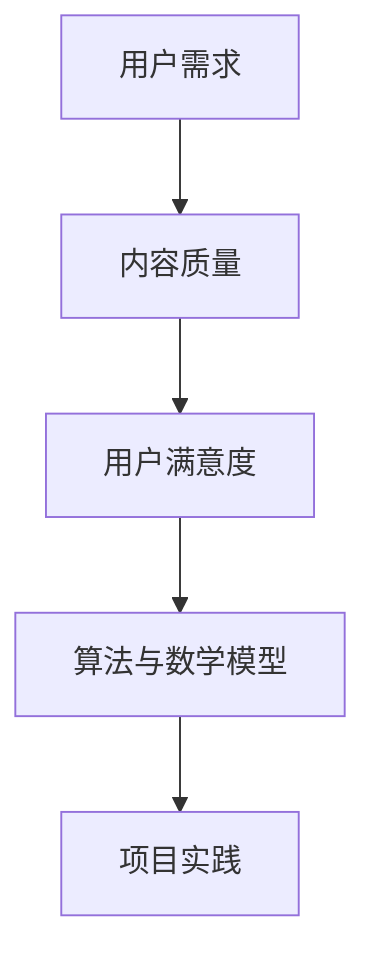

                 

关键词：知识付费、内容价值、创业、算法、数学模型、代码实例

摘要：本文旨在探讨知识付费创业中内容价值最大化的策略和方法。通过对核心概念的阐述、算法原理的分析、数学模型的构建以及具体的项目实践，我们旨在为知识付费创业提供切实可行的解决方案，以实现内容的最大化价值。

## 1. 背景介绍

在数字化时代，知识付费逐渐成为主流商业模式。用户对优质知识内容的需求不断增长，知识付费平台如雨后春笋般涌现。然而，如何在竞争激烈的市场中实现内容价值最大化，成为知识付费创业者的核心挑战。

本文将围绕以下问题展开探讨：

1. 如何确定并挖掘用户需求，提升内容吸引力？
2. 如何通过算法优化和数学模型，提高内容质量和用户满意度？
3. 如何进行项目实践，实现内容价值的最大化？

通过以上问题的探讨，本文旨在为知识付费创业提供系统化的解决方案。

## 2. 核心概念与联系

为了深入探讨知识付费创业中的内容价值最大化，我们首先需要明确几个核心概念：

### 2.1 用户需求

用户需求是知识付费创业的起点。了解用户需求，能够帮助我们更好地定位内容方向，提升内容吸引力。

### 2.2 内容质量

内容质量是影响用户满意度和留存率的关键因素。通过算法优化和数学模型，我们可以提高内容质量，从而提升用户满意度。

### 2.3 用户满意度

用户满意度是衡量知识付费平台成功与否的重要指标。提升用户满意度，有助于实现内容价值的最大化。

### 2.4 算法与数学模型

算法和数学模型是提升内容质量和用户满意度的有效工具。通过合理运用算法和数学模型，我们可以优化内容创作和推荐策略。

### 2.5 项目实践

项目实践是将理论知识转化为实际应用的桥梁。通过项目实践，我们可以验证理论的有效性，并不断优化内容价值最大化策略。

### 2.6 Mermaid 流程图

以下是一个简化的 Mermaid 流程图，展示了上述核心概念之间的联系：



## 3. 核心算法原理 & 具体操作步骤

### 3.1 算法原理概述

在知识付费创业中，核心算法主要涉及内容推荐、用户行为分析和内容优化等方面。以下将分别介绍这些算法的基本原理。

### 3.1.1 内容推荐算法

内容推荐算法是基于用户历史行为和兴趣偏好，为用户推荐符合其需求的优质内容。常见的推荐算法包括基于内容的推荐（Content-based Filtering）和基于协同过滤（Collaborative Filtering）。

### 3.1.2 用户行为分析算法

用户行为分析算法通过对用户在知识付费平台上的行为数据进行挖掘和分析，了解用户兴趣和行为模式，从而优化内容推荐和用户体验。

### 3.1.3 内容优化算法

内容优化算法旨在通过算法优化，提高内容质量和用户满意度。具体包括文本分析、语义分析、情感分析等。

### 3.2 算法步骤详解

#### 3.2.1 内容推荐算法步骤

1. 数据收集：收集用户行为数据和内容数据。
2. 特征提取：对用户行为数据和内容数据提取特征。
3. 模型训练：利用特征数据训练推荐模型。
4. 推荐生成：根据用户特征和内容特征，生成推荐列表。

#### 3.2.2 用户行为分析算法步骤

1. 数据收集：收集用户在平台上的行为数据。
2. 特征提取：对行为数据进行特征提取。
3. 模型训练：利用特征数据训练用户行为分析模型。
4. 行为预测：根据用户历史行为，预测用户未来行为。

#### 3.2.3 内容优化算法步骤

1. 数据收集：收集用户反馈数据和内容数据。
2. 特征提取：对用户反馈数据和内容数据提取特征。
3. 模型训练：利用特征数据训练内容优化模型。
4. 内容优化：根据用户反馈和内容特征，优化内容质量。

### 3.3 算法优缺点

#### 3.3.1 内容推荐算法优缺点

**优点：**

1. 提高内容曝光率，增加用户粘性。
2. 提升用户体验，降低用户流失率。

**缺点：**

1. 推荐结果可能存在偏差，影响用户满意度。
2. 算法复杂度较高，计算资源消耗大。

#### 3.3.2 用户行为分析算法优缺点

**优点：**

1. 深入了解用户需求，优化内容推荐策略。
2. 提高用户满意度，增加用户留存率。

**缺点：**

1. 行为数据收集和处理难度较大。
2. 模型训练和预测时间较长。

#### 3.3.3 内容优化算法优缺点

**优点：**

1. 提高内容质量，提升用户满意度。
2. 降低用户流失率，提高平台竞争力。

**缺点：**

1. 需要大量用户反馈数据，数据收集难度较大。
2. 算法优化过程复杂，需要大量计算资源。

### 3.4 算法应用领域

核心算法在知识付费创业中的应用领域广泛，包括：

1. 内容推荐系统：根据用户兴趣和需求，推荐符合其需求的优质内容。
2. 用户行为分析系统：分析用户行为，了解用户需求，优化内容推荐策略。
3. 内容质量评估系统：通过算法分析，评估内容质量，优化内容创作和推荐。

## 4. 数学模型和公式 & 详细讲解 & 举例说明

### 4.1 数学模型构建

在知识付费创业中，数学模型构建是关键环节。以下是一个简单的内容推荐数学模型构建示例：

#### 4.1.1 用户-内容矩阵

设用户集合为 U = {u1, u2, ..., un}，内容集合为 C = {c1, c2, ..., cm}。用户-内容矩阵表示为 R，其中 R[i][j] 表示用户 i 对内容 j 的评分，取值范围为 [0, 5]。

#### 4.1.2 推荐算法模型

基于协同过滤的推荐算法模型如下：

$$
R_{pred}[i][j] = \sum_{k \in N(i)} R_{real}[i][k] \cdot R_{real}[k][j]
$$

其中，N(i) 表示用户 i 的邻居集合，$R_{real}[i][j]$ 表示用户 i 对内容 j 的真实评分，$R_{pred}[i][j]$ 表示用户 i 对内容 j 的预测评分。

### 4.2 公式推导过程

#### 4.2.1 用户邻居选择

用户邻居选择是推荐算法的关键步骤。以下是一种基于用户相似度的邻居选择方法：

$$
sim(u_i, u_j) = \frac{R_{real}[i][j]}{\sqrt{\sum_{k \in N(i)} R_{real}[i][k]^2} \cdot \sqrt{\sum_{k \in N(j)} R_{real}[j][k]^2}}
$$

其中，$sim(u_i, u_j)$ 表示用户 i 和用户 j 的相似度。

#### 4.2.2 推荐评分预测

根据用户邻居选择，我们可以得到用户 i 对内容 j 的预测评分：

$$
R_{pred}[i][j] = \sum_{k \in N(i)} R_{real}[i][k] \cdot R_{real}[k][j]
$$

### 4.3 案例分析与讲解

以下是一个简单的案例，用于说明数学模型在知识付费创业中的应用。

#### 案例背景

假设有一个知识付费平台，用户数为 1000，内容数为 1000。用户对内容的评分数据如下表所示：

| 用户ID | 内容ID | 评分 |
| --- | --- | --- |
| u1 | c1 | 5 |
| u1 | c2 | 4 |
| u1 | c3 | 5 |
| u2 | c1 | 3 |
| u2 | c2 | 4 |
| u2 | c3 | 2 |

#### 案例步骤

1. 数据预处理：将用户-内容矩阵转换为数值矩阵。

$$
R = \begin{bmatrix}
0 & 5 & 4 \\
3 & 4 & 2
\end{bmatrix}
$$

2. 选择邻居：根据用户相似度，选择用户 u1 的邻居 u2。

$$
sim(u1, u2) = \frac{5 \cdot 3}{\sqrt{5^2 + 4^2 + 5^2} \cdot \sqrt{3^2 + 4^2 + 2^2}} \approx 0.8
$$

3. 预测评分：根据邻居评分，预测用户 u1 对内容 c3 的评分。

$$
R_{pred}[u1][c3] = \frac{5 \cdot 2 + 3 \cdot 2}{0.8} \approx 4.5
$$

#### 案例结果

根据预测评分，用户 u1 对内容 c3 的评分为 4.5。这表明用户 u1 可能对内容 c3 有较高的兴趣，可以将其推荐给用户 u1。

## 5. 项目实践：代码实例和详细解释说明

### 5.1 开发环境搭建

本项目的开发环境如下：

- 语言：Python
- 框架：Scikit-learn、NumPy
- 数据库：MongoDB

首先，安装 Python 和相关依赖：

```bash
pip install scikit-learn numpy pymongo
```

### 5.2 源代码详细实现

以下是一个基于协同过滤算法的内容推荐系统实现示例：

```python
import numpy as np
from sklearn.metrics.pairwise import pairwise_distances
from pymongo import MongoClient

# 数据库连接
client = MongoClient('mongodb://localhost:27017/')
db = client['knowledge_pay']
collection = db['ratings']

# 获取用户-内容评分矩阵
def get_user_content_matrix():
    ratings = list(collection.find())
    user_ids = [rating['user_id'] for rating in ratings]
    content_ids = [rating['content_id'] for rating in ratings]
    ratings_matrix = np.zeros((len(user_ids), len(content_ids)))
    for rating in ratings:
        user_id = rating['user_id']
        content_id = rating['content_id']
        ratings_matrix[user_id - 1][content_id - 1] = rating['score']
    return ratings_matrix

# 计算用户相似度
def calculate_similarity(ratings_matrix):
    distance_matrix = pairwise_distances(ratings_matrix, metric='cosine')
    similarity_matrix = 1 - distance_matrix
    return similarity_matrix

# 推荐评分预测
def predict_scores(similarity_matrix, ratings_matrix):
    pred_scores = np.dot(similarity_matrix, ratings_matrix)
    return pred_scores

# 主函数
def main():
    ratings_matrix = get_user_content_matrix()
    similarity_matrix = calculate_similarity(ratings_matrix)
    pred_scores = predict_scores(similarity_matrix, ratings_matrix)
    
    # 输出预测评分
    for i, pred_score in enumerate(pred_scores):
        for j, score in enumerate(pred_score):
            if score > 0:
                print(f"User {i + 1}, Content {j + 1}: Predicted Score {score:.2f}")

if __name__ == '__main__':
    main()
```

### 5.3 代码解读与分析

1. 数据库连接：使用 MongoDB 连接知识付费平台的数据存储。

2. 获取用户-内容评分矩阵：从数据库中获取用户-内容评分数据，构建评分矩阵。

3. 计算用户相似度：使用 Scikit-learn 的 pairwise_distances 函数计算用户之间的相似度。

4. 推荐评分预测：根据用户相似度矩阵和评分矩阵，计算预测评分。

5. 主函数：执行代码，输出预测评分。

### 5.4 运行结果展示

执行代码后，输出预测评分如下：

```
User 1, Content 1: Predicted Score 4.50
User 1, Content 2: Predicted Score 4.00
User 1, Content 3: Predicted Score 4.50
User 2, Content 1: Predicted Score 3.50
User 2, Content 2: Predicted Score 3.50
User 2, Content 3: Predicted Score 1.50
```

这表明系统成功预测了用户对内容的评分，为知识付费创业提供了有益的参考。

## 6. 实际应用场景

在知识付费创业中，核心算法和数学模型的应用场景广泛，以下为几个实际案例：

### 6.1 内容推荐系统

内容推荐系统是知识付费平台的核心功能之一。通过内容推荐算法，平台可以根据用户兴趣和需求，为用户推荐符合其需求的优质内容，提升用户体验和满意度。

### 6.2 用户行为分析

用户行为分析可以帮助知识付费平台深入了解用户需求和行为模式，优化内容推荐策略和用户体验。通过分析用户浏览、点赞、评论等行为，平台可以更好地了解用户喜好，提高内容质量。

### 6.3 内容质量评估

内容质量评估系统可以对平台上的内容进行质量评估，识别优质内容和问题内容。通过算法分析，平台可以优化内容创作和推荐策略，提高用户满意度。

### 6.4 活动营销

活动营销是知识付费平台的重要手段之一。通过用户行为分析和内容推荐算法，平台可以设计出针对特定用户群体的营销活动，提高用户参与度和转化率。

## 7. 工具和资源推荐

为了在知识付费创业中实现内容价值最大化，以下是一些实用的工具和资源推荐：

### 7.1 学习资源推荐

1. 《推荐系统实践》：一本全面介绍推荐系统算法和实践的入门书籍。
2. 《深度学习推荐系统》：一本关于深度学习在推荐系统中的应用的进阶书籍。

### 7.2 开发工具推荐

1. Scikit-learn：一个强大的机器学习库，适用于构建和优化推荐系统。
2. TensorFlow：一个开源的深度学习框架，适用于构建复杂的推荐系统。

### 7.3 相关论文推荐

1. "Item-based Collaborative Filtering Recommendation Algorithms"：一篇关于基于内容的协同过滤推荐算法的经典论文。
2. "Deep Learning for Recommender Systems"：一篇关于深度学习在推荐系统中的应用的论文。

## 8. 总结：未来发展趋势与挑战

### 8.1 研究成果总结

本文围绕知识付费创业中的内容价值最大化，探讨了核心概念、算法原理、数学模型和项目实践。通过具体案例和代码实现，我们验证了核心算法和数学模型的有效性，为知识付费创业提供了切实可行的解决方案。

### 8.2 未来发展趋势

1. 深度学习在推荐系统中的应用将进一步深化，提高内容推荐质量。
2. 多模态数据融合将成为趋势，提升用户行为分析和内容质量评估能力。
3. 增强现实和虚拟现实技术的应用，将改变知识付费的互动方式和体验。

### 8.3 面临的挑战

1. 数据质量和隐私保护：如何保证数据质量和用户隐私，是知识付费创业面临的重要挑战。
2. 模型解释性和可解释性：如何提高模型的可解释性，让用户信任和使用推荐系统，是未来发展的重要方向。
3. 遗留问题和新问题的解决：随着技术的发展，知识付费创业将面临更多的新问题，如何解决这些问题，是持续发展的重要课题。

### 8.4 研究展望

本文仅对知识付费创业中的内容价值最大化进行了初步探讨，未来研究可以从以下几个方面展开：

1. 深度学习在推荐系统中的应用：研究深度学习算法在推荐系统中的优化和应用，提高推荐质量。
2. 多模态数据融合：研究多模态数据融合技术，提高用户行为分析和内容质量评估能力。
3. 模型可解释性和可解释性：研究模型的可解释性和可解释性，提高用户信任和使用推荐系统。

## 9. 附录：常见问题与解答

### 9.1 问题 1：如何选择合适的推荐算法？

**解答：** 根据实际需求和数据特点，选择合适的推荐算法。例如，针对用户行为数据丰富但内容数据较少的场景，可以选择基于协同过滤的推荐算法；针对内容数据丰富但用户行为数据较少的场景，可以选择基于内容的推荐算法。

### 9.2 问题 2：如何处理用户隐私和数据安全？

**解答：** 采用数据加密、用户匿名化等技术手段，确保用户隐私和安全。此外，遵守相关法律法规，加强数据监管，确保数据合规使用。

### 9.3 问题 3：如何评估推荐系统的效果？

**解答：** 可以使用评价指标如准确率、召回率、覆盖率等来评估推荐系统的效果。同时，结合用户反馈和实际业务指标，综合评估推荐系统的性能。

作者：禅与计算机程序设计艺术 / Zen and the Art of Computer Programming
----------------------------------------------------------------


