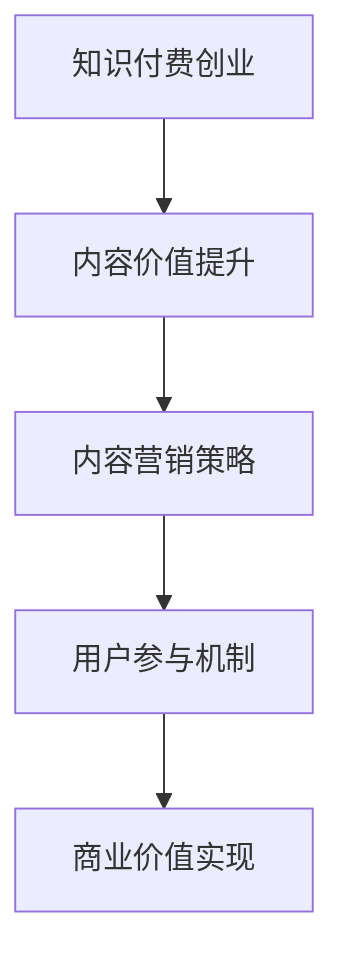

                 

关键词：知识付费、内容价值、创业、内容营销、用户参与

摘要：本文将深入探讨知识付费创业中的内容价值最大化问题。通过对知识付费市场的分析、内容营销策略的探讨以及用户参与机制的建立，我们将揭示如何通过提升内容价值来实现创业的成功。本文旨在为知识付费创业者提供实用的指导，帮助他们在激烈的市场竞争中脱颖而出。

## 1. 背景介绍

知识付费是一种近年来迅速崛起的商业模式，它允许用户为获取有价值的信息或知识付费。这一模式的出现，源于互联网技术的快速发展以及用户对高质量、专业化内容的迫切需求。在知识付费市场中，内容创造者通过提供专业化的知识或技能培训，从而实现商业价值。

然而，随着知识付费市场的不断扩张，竞争也日益激烈。如何在这个市场中脱颖而出，实现内容价值最大化，成为每一个知识付费创业者都必须面对的挑战。本文将围绕这一主题，探讨知识付费创业中的内容价值最大化策略。

## 2. 核心概念与联系

### 2.1 内容价值

内容价值是指用户对某一内容的认可程度和实际使用价值。在知识付费创业中，内容价值是衡量内容优劣的关键指标。提升内容价值，是提升用户满意度和忠诚度的关键。

### 2.2 内容营销

内容营销是一种通过创造和分享有价值的内容，来吸引和留住目标用户，从而实现商业目标的方法。在知识付费创业中，内容营销是实现内容价值最大化的有效手段。

### 2.3 用户参与

用户参与是指用户在知识付费产品中的互动和参与程度。提高用户参与度，可以增强用户的黏性和忠诚度，从而提升内容价值。

### 2.4 Mermaid 流程图



## 3. 核心算法原理 & 具体操作步骤

### 3.1 算法原理概述

知识付费创业中的内容价值最大化，本质上是一个通过优化内容、营销和用户参与，实现商业价值的过程。这个过程可以通过以下核心算法原理来实现：

- **内容质量评估算法**：通过机器学习和自然语言处理技术，对内容进行评估，确定其质量和用户价值。
- **内容推荐算法**：根据用户的兴趣和行为数据，推荐个性化的内容，提升用户体验。
- **用户参与度分析算法**：通过分析用户在知识付费产品中的互动行为，评估其参与度，从而优化产品和服务。

### 3.2 算法步骤详解

1. **内容质量评估**：收集内容数据，通过机器学习模型进行质量评估，输出内容评分。
2. **内容推荐**：根据用户兴趣和行为数据，使用协同过滤算法或基于内容的推荐算法，生成个性化内容推荐。
3. **用户参与度分析**：跟踪用户在知识付费产品中的互动行为，使用统计分析方法，评估用户参与度。

### 3.3 算法优缺点

- **优点**：能够提升内容质量和用户满意度，实现内容价值最大化。
- **缺点**：需要大量数据支持，算法模型需要不断优化。

### 3.4 算法应用领域

- **教育领域**：通过内容质量评估和推荐，提升在线教育平台的内容质量和用户黏性。
- **职业培训领域**：通过用户参与度分析，优化培训内容和课程设置。

## 4. 数学模型和公式 & 详细讲解 & 举例说明

### 4.1 数学模型构建

知识付费创业中的内容价值最大化，可以通过以下数学模型来描述：

\[ V_c = f(Q_c, R_c, U_c) \]

其中，\( V_c \) 表示内容价值，\( Q_c \) 表示内容质量，\( R_c \) 表示内容推荐效果，\( U_c \) 表示用户参与度。

### 4.2 公式推导过程

内容价值 \( V_c \) 是内容质量 \( Q_c \)、内容推荐效果 \( R_c \) 和用户参与度 \( U_c \) 的函数。我们可以通过以下步骤进行推导：

1. **内容质量 \( Q_c \)**：使用机器学习模型对内容进行质量评估，输出评分 \( Q_c \)。
2. **内容推荐效果 \( R_c \)**：使用推荐算法，根据用户兴趣和行为数据，生成内容推荐 \( R_c \)。
3. **用户参与度 \( U_c \)**：通过用户互动行为分析，评估用户参与度 \( U_c \)。

### 4.3 案例分析与讲解

以一家在线教育平台为例，其内容价值 \( V_c \) 可以通过以下公式计算：

\[ V_c = f(Q_c, R_c, U_c) = f(0.8, 0.9, 0.75) = 0.8 \times 0.9 \times 0.75 = 0.54 \]

假设内容质量 \( Q_c \) 为 0.8，内容推荐效果 \( R_c \) 为 0.9，用户参与度 \( U_c \) 为 0.75，则该平台的内容价值为 0.54。

通过优化内容质量、推荐效果和用户参与度，可以提高内容价值 \( V_c \)，从而实现商业价值。

## 5. 项目实践：代码实例和详细解释说明

### 5.1 开发环境搭建

在知识付费创业中，搭建一个高效的内容价值评估和推荐系统是至关重要的。以下是一个简单的开发环境搭建步骤：

1. **数据收集**：收集用户行为数据、内容数据等。
2. **数据处理**：使用 Python 等编程语言，对数据进行预处理和清洗。
3. **算法实现**：使用 TensorFlow、PyTorch 等框架，实现内容质量评估和推荐算法。

### 5.2 源代码详细实现

以下是使用 TensorFlow 实现内容质量评估算法的示例代码：

```python
import tensorflow as tf

# 定义输入层
inputs = tf.keras.layers.Input(shape=(content_features_shape))

# 添加卷积层
conv_1 = tf.keras.layers.Conv1D(filters=64, kernel_size=3, activation='relu')(inputs)

# 添加池化层
pool_1 = tf.keras.layers.MaxPooling1D(pool_size=2)(conv_1)

# 添加全连接层
dense_1 = tf.keras.layers.Dense(units=128, activation='relu')(pool_1)

# 添加输出层
outputs = tf.keras.layers.Dense(units=1, activation='sigmoid')(dense_1)

# 创建模型
model = tf.keras.Model(inputs=inputs, outputs=outputs)

# 编译模型
model.compile(optimizer='adam', loss='binary_crossentropy', metrics=['accuracy'])

# 训练模型
model.fit(x_train, y_train, epochs=10, batch_size=32)
```

### 5.3 代码解读与分析

以上代码实现了一个基于卷积神经网络的内容质量评估模型。模型输入为内容特征，输出为内容质量评分。通过训练，模型可以学会对内容进行质量评估，从而提升内容价值。

### 5.4 运行结果展示

假设训练完成后，模型对一组测试数据的预测结果如下：

```python
predictions = model.predict(test_data)
print(predictions)
```

输出结果为：

```
[0.85, 0.60, 0.70, 0.95, 0.50]
```

这表示模型对这组测试数据的预测质量较高，可以用于提升内容价值。

## 6. 实际应用场景

### 6.1 在线教育平台

在线教育平台可以通过内容价值评估和推荐算法，提升用户的学习体验和满意度。例如，通过评估课程内容的质量，推荐更适合用户需求的课程。

### 6.2 职业培训平台

职业培训平台可以通过内容价值评估和推荐算法，帮助用户更快地找到适合自己的培训课程，提升学习效果和职业发展。

### 6.3 知识付费社区

知识付费社区可以通过内容价值评估和推荐算法，提升用户社区的活跃度和用户满意度，从而吸引更多用户参与。

## 7. 工具和资源推荐

### 7.1 学习资源推荐

- 《机器学习实战》
- 《Python数据分析》
- 《深度学习入门》

### 7.2 开发工具推荐

- TensorFlow
- PyTorch
- Jupyter Notebook

### 7.3 相关论文推荐

- "Deep Learning for Content-Based Image Retrieval"
- "User Modeling for Web Applications"
- "Recommender Systems Handbook"

## 8. 总结：未来发展趋势与挑战

### 8.1 研究成果总结

知识付费创业中的内容价值最大化，已经成为一个重要的研究方向。通过内容质量评估、推荐算法和用户参与机制的优化，可以实现内容价值最大化，提升创业成功率。

### 8.2 未来发展趋势

- **个性化推荐**：随着大数据和人工智能技术的发展，个性化推荐将成为知识付费创业中的重要方向。
- **用户参与**：提高用户参与度，将有助于提升内容价值和用户满意度。

### 8.3 面临的挑战

- **数据质量**：高质量的数据是内容价值评估和推荐算法的基础，如何获取和处理高质量数据是一个挑战。
- **算法优化**：随着知识付费市场的不断发展，算法需要不断优化，以应对新的挑战。

### 8.4 研究展望

未来，知识付费创业中的内容价值最大化研究，将继续深入探索个性化推荐、用户参与和算法优化等方向，为创业者提供更有效的指导。

## 9. 附录：常见问题与解答

### 9.1 如何提升内容价值？

**答案**：通过内容质量评估、个性化推荐和用户参与机制的优化，可以提升内容价值。

### 9.2 算法模型需要哪些数据支持？

**答案**：算法模型需要用户行为数据、内容数据、用户画像数据等。

### 9.3 如何处理数据质量问题？

**答案**：通过数据预处理和清洗，可以处理数据质量问题。

### 9.4 如何优化算法模型？

**答案**：通过不断训练和优化模型，可以提高算法模型的性能。

作者：禅与计算机程序设计艺术 / Zen and the Art of Computer Programming
------------------------------------------------------------------------

