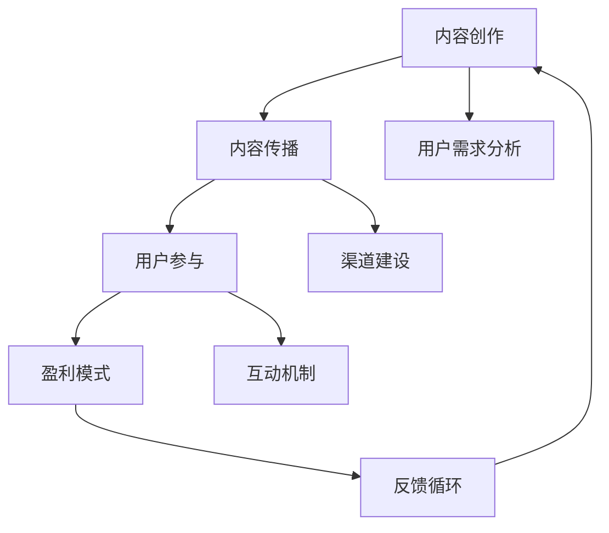

                 

在当今知识经济的浪潮下，知识付费成为了推动个人和企业成长的重要手段。如何有效地创造和传播知识，以实现内容价值最大化，是每一位知识创作者和创业者在面临的重要课题。本文旨在探讨知识付费创业中的内容价值最大化策略，通过深入分析内容创作、传播、用户参与以及盈利模式等关键环节，为读者提供实用的指导和建议。

## 文章关键词

- 知识付费
- 内容价值
- 创作策略
- 传播途径
- 用户参与
- 盈利模式

## 摘要

本文首先介绍了知识付费的背景和现状，随后分析了内容价值最大化的核心要素，包括内容创作、内容传播、用户参与和盈利模式。接着，文章详细阐述了如何通过优化内容创作策略、构建高效传播渠道、激发用户参与以及设计多样化的盈利模式来实现内容价值最大化。最后，文章总结了当前知识付费创业面临的主要挑战和未来发展趋势，为读者提供了宝贵的研究方向和实践建议。

## 1. 背景介绍

### 知识付费的兴起

随着互联网的普及和信息技术的快速发展，知识付费逐渐成为知识传播和获取的重要途径。知识付费的兴起不仅改变了传统知识传播的模式，也为知识创作者提供了新的收入来源。从在线课程、专业咨询、电子书到专业报告，各种形式的知识产品在市场上不断涌现。知识付费的崛起，不仅满足了用户对知识的个性化需求，也为知识经济注入了新的活力。

### 知识付费的优势

知识付费具有以下几个显著优势：

1. **个性化定制**：知识付费产品可以根据用户的需求和兴趣进行个性化定制，提供更精准的内容服务。
2. **高质量保障**：知识付费通常由专业的创作者提供，保证了内容的高质量和权威性。
3. **经济性**：知识付费降低了知识获取的成本，使得知识更易于获取和传播。
4. **便捷性**：用户可以随时随地通过互联网获取知识，提高了知识获取的便捷性。

### 知识付费的挑战

尽管知识付费具有诸多优势，但在实际操作中仍面临一些挑战：

1. **内容同质化**：市场上知识付费产品的同质化现象严重，竞争激烈。
2. **用户信任度**：用户对知识付费产品的信任度较低，担心内容质量不高或涉嫌欺诈。
3. **持续创作**：知识创作者需要持续创作高质量内容，以维持用户粘性。
4. **盈利模式**：如何设计合理的盈利模式，实现内容价值最大化，是知识创作者和创业者需要解决的重要问题。

## 2. 核心概念与联系

### 核心概念

在探讨知识付费创业中的内容价值最大化策略时，以下核心概念是至关重要的：

1. **内容创作**：内容创作是知识付费的核心，涉及内容选题、内容策划、内容编写和内容审核等环节。
2. **内容传播**：内容传播是指将创作好的知识付费内容通过各种渠道传播给目标用户的过程。
3. **用户参与**：用户参与是指通过互动、反馈、社区建设等方式，提高用户对知识付费产品的黏性和忠诚度。
4. **盈利模式**：盈利模式是知识付费创业的重要一环，涉及如何通过内容收费、广告、会员制等方式实现盈利。

### 核心概念原理和架构的 Mermaid 流程图



### 核心概念的联系

上述核心概念相互联系，共同构成了知识付费创业中的内容价值最大化策略。内容创作是整个策略的基础，决定了知识付费产品的质量和吸引力；内容传播则将高质量内容传递给用户，实现内容的广泛覆盖；用户参与则通过互动和反馈机制，增强用户对知识付费产品的黏性；而盈利模式则为知识付费创业提供了持续的收入来源。通过上述核心概念的有效结合，可以实现内容价值最大化。

## 3. 核心算法原理 & 具体操作步骤

### 3.1 算法原理概述

在知识付费创业中，内容价值最大化策略的核心算法主要包括以下几个方面：

1. **用户行为分析算法**：通过分析用户的浏览、购买、评价等行为数据，了解用户的需求和兴趣，从而为内容创作和传播提供数据支持。
2. **内容推荐算法**：基于用户行为数据和内容属性，为用户推荐个性化的知识付费产品，提高内容传播的精准度和用户满意度。
3. **社区互动算法**：通过分析用户在社区中的互动行为，如评论、点赞、分享等，构建用户互动网络，促进用户参与和黏性。

### 3.2 算法步骤详解

#### 用户行为分析算法

1. 数据采集：收集用户在知识付费平台上的行为数据，包括浏览、购买、评价、互动等。
2. 数据预处理：对采集到的数据进行清洗、去重和格式化，以便后续分析。
3. 特征提取：从预处理后的数据中提取关键特征，如用户浏览时间、购买频次、评价分数等。
4. 模型训练：使用机器学习算法（如决策树、支持向量机等）对特征进行训练，构建用户行为分析模型。
5. 模型评估：使用交叉验证、A/B测试等方法评估模型的准确性和可靠性。
6. 模型应用：将训练好的模型应用于实际场景，如用户推荐、内容优化等。

#### 内容推荐算法

1. 数据采集：收集用户行为数据和知识付费产品属性数据。
2. 特征工程：提取用户行为特征（如浏览历史、购买记录）和内容属性特征（如标题、标签、作者等）。
3. 模型训练：使用协同过滤、基于内容的推荐等算法，训练内容推荐模型。
4. 推荐生成：基于用户行为数据和内容属性，生成个性化推荐列表。
5. 推荐评估：通过用户点击率、购买率等指标评估推荐效果，不断优化推荐算法。

#### 社区互动算法

1. 数据采集：收集用户在社区中的互动数据，如评论、点赞、分享等。
2. 特征提取：从互动数据中提取关键特征，如互动频次、互动类型、互动质量等。
3. 社区构建：基于互动数据，构建用户互动网络，识别社区中的关键节点。
4. 互动分析：分析用户互动行为，如互动频率、互动质量、互动效果等。
5. 互动优化：根据分析结果，优化社区互动机制，提高用户参与度和黏性。

### 3.3 算法优缺点

#### 用户行为分析算法

**优点**：

1. 可以深入了解用户需求和偏好，为内容创作提供数据支持。
2. 有助于优化用户体验，提高用户满意度和忠诚度。

**缺点**：

1. 数据采集和处理成本较高。
2. 模型训练和评估过程复杂，需要大量的计算资源和时间。

#### 内容推荐算法

**优点**：

1. 可以提高内容传播的精准度，增加用户购买和互动的概率。
2. 有助于发现潜在用户需求，为内容创作提供方向。

**缺点**：

1. 推荐效果易受到数据质量和模型参数的影响。
2. 可能导致用户信息过载，影响用户体验。

#### 社区互动算法

**优点**：

1. 可以提高用户参与度和黏性，促进知识付费产品的传播。
2. 有利于构建用户社区，增强用户之间的互动。

**缺点**：

1. 社区管理成本较高，需要投入大量人力和物力。
2. 可能存在社区氛围不良、用户行为偏差等问题。

### 3.4 算法应用领域

用户行为分析算法、内容推荐算法和社区互动算法在知识付费创业中的应用非常广泛：

1. **在线教育平台**：通过用户行为分析，为用户提供个性化的课程推荐，提高学习效果。
2. **知识付费社区**：通过内容推荐和社区互动，增强用户黏性和互动性，促进知识传播。
3. **专业咨询平台**：通过用户行为分析，为用户提供定制化的咨询服务，提高服务质量。
4. **电子书平台**：通过内容推荐和社区互动，提高电子书的销量和用户阅读体验。

## 4. 数学模型和公式 & 详细讲解 & 举例说明

### 4.1 数学模型构建

在知识付费创业中，构建数学模型可以帮助我们更好地理解用户行为、优化推荐策略和评估社区互动效果。以下是一个基本的数学模型构建过程：

#### 1. 用户行为分析模型

**模型假设**：

- 用户的行为数据可以表示为一个向量 \(X\)，其中每个元素代表用户在某一项行为上的评分。
- 存在一个潜在的因子矩阵 \(U\) 和 \(V\)，分别表示用户特征和内容特征。

**数学表达式**：

\[ X = U^T V \]

其中，\(U^T\) 表示用户特征向量的转置，\(V\) 表示内容特征向量。

#### 2. 内容推荐模型

**模型假设**：

- 用户对内容的评分可以表示为用户特征和内容特征的内积。
- 存在一个潜在的评分矩阵 \(R\)，其中每个元素表示用户对某项内容的评分。

**数学表达式**：

\[ R = U^T V + \epsilon \]

其中，\(\epsilon\) 表示误差项。

#### 3. 社区互动模型

**模型假设**：

- 社区互动可以表示为一个矩阵 \(I\)，其中每个元素表示用户之间的互动情况。
- 存在一个潜在的互动矩阵 \(J\)，表示用户互动的影响。

**数学表达式**：

\[ I = J^T J + \eta \]

其中，\(\eta\) 表示噪声项。

### 4.2 公式推导过程

#### 1. 用户行为分析模型推导

首先，我们考虑一个简单的线性模型：

\[ X = \beta_0 + \beta_1 U + \epsilon \]

其中，\(\beta_0\) 表示截距，\(\beta_1\) 表示系数，\(U\) 表示用户特征向量，\(\epsilon\) 表示误差项。

为了方便计算，我们可以将用户特征向量 \(U\) 和内容特征向量 \(V\) 表示为矩阵的形式：

\[ U = \begin{bmatrix} u_1 \\ u_2 \\ \vdots \\ u_n \end{bmatrix}, \quad V = \begin{bmatrix} v_1 \\ v_2 \\ \vdots \\ v_n \end{bmatrix} \]

则，原始模型可以表示为：

\[ X = \beta_0 + \beta_1 U^T V + \epsilon \]

为了使模型更易于理解和计算，我们可以将 \(U^T V\) 视为一个潜在的因子矩阵 \(F\)：

\[ X = \beta_0 + \beta_1 F + \epsilon \]

其中，\(\beta_0\) 和 \(\beta_1\) 分别表示截距和系数，\(F\) 表示潜在的因子矩阵。

#### 2. 内容推荐模型推导

我们可以将内容推荐模型看作一个广义的线性回归模型：

\[ R = \alpha_0 + \alpha_1 U^T V + \epsilon \]

其中，\(\alpha_0\) 表示截距，\(\alpha_1\) 表示系数，\(U\) 表示用户特征向量，\(V\) 表示内容特征向量，\(\epsilon\) 表示误差项。

与用户行为分析模型类似，我们可以将用户特征向量和内容特征向量表示为矩阵的形式：

\[ U = \begin{bmatrix} u_1 \\ u_2 \\ \vdots \\ u_n \end{bmatrix}, \quad V = \begin{bmatrix} v_1 \\ v_2 \\ \vdots \\ v_n \end{bmatrix} \]

则，原始模型可以表示为：

\[ R = \alpha_0 + \alpha_1 U^T V + \epsilon \]

为了使模型更易于理解和计算，我们可以将 \(U^T V\) 视为一个潜在的评分矩阵 \(R^*\)：

\[ R = \alpha_0 + \alpha_1 R^* + \epsilon \]

其中，\(\alpha_0\) 和 \(\alpha_1\) 分别表示截距和系数，\(R^*\) 表示潜在的评分矩阵。

#### 3. 社区互动模型推导

我们可以将社区互动模型看作一个二部图模型：

\[ I = J^T J + \eta \]

其中，\(I\) 表示社区互动矩阵，\(J\) 表示潜在的互动矩阵，\(\eta\) 表示噪声项。

与用户行为分析模型和内容推荐模型类似，我们可以将互动矩阵 \(I\) 和潜在的互动矩阵 \(J\) 表示为矩阵的形式：

\[ I = \begin{bmatrix} i_{11} & i_{12} & \cdots & i_{1n} \\ i_{21} & i_{22} & \cdots & i_{2n} \\ \vdots & \vdots & \ddots & \vdots \\ i_{m1} & i_{m2} & \cdots & i_{mn} \end{bmatrix}, \quad J = \begin{bmatrix} j_{11} & j_{12} & \cdots & j_{1n} \\ j_{21} & j_{22} & \cdots & j_{2n} \\ \vdots & \vdots & \ddots & \vdots \\ j_{m1} & j_{m2} & \cdots & j_{mn} \end{bmatrix} \]

则，原始模型可以表示为：

\[ I = J^T J + \eta \]

为了使模型更易于理解和计算，我们可以将 \(J^T J\) 视为一个潜在的互动矩阵 \(J^*\)：

\[ I = J^* + \eta \]

其中，\(J^*\) 表示潜在的互动矩阵，\(\eta\) 表示噪声项。

### 4.3 案例分析与讲解

为了更好地理解上述数学模型，我们来看一个具体的案例。

#### 案例背景

假设有一个在线教育平台，提供多种课程供用户选择。用户在平台上浏览、购买和评价课程，平台希望根据用户行为数据为用户推荐个性化课程。

#### 案例分析

1. **用户行为分析模型**

   首先，我们可以收集用户在平台上的行为数据，包括浏览次数、购买次数和评价分数等。将这些数据表示为一个向量 \(X\)：

   \[ X = \begin{bmatrix} x_1 \\ x_2 \\ \vdots \\ x_n \end{bmatrix} \]

   然后，我们可以提取用户特征，如用户年龄、性别、职业等，将这些特征表示为一个矩阵 \(U\)：

   \[ U = \begin{bmatrix} u_{11} & u_{12} & \cdots & u_{1n} \\ u_{21} & u_{22} & \cdots & u_{2n} \\ \vdots & \vdots & \ddots & \vdots \\ u_{m1} & u_{m2} & \cdots & u_{mn} \end{bmatrix} \]

   最后，我们可以构建一个潜在的因子矩阵 \(F\)：

   \[ F = U^T V \]

   其中，\(V\) 表示课程特征矩阵。

2. **内容推荐模型**

   接下来，我们可以根据用户行为数据 \(X\) 和课程特征矩阵 \(V\)，构建一个内容推荐模型：

   \[ R = \alpha_0 + \alpha_1 U^T V + \epsilon \]

   其中，\(\alpha_0\) 和 \(\alpha_1\) 分别表示截距和系数，\(\epsilon\) 表示误差项。

   然后，我们可以通过训练算法，如线性回归、支持向量机等，估计模型参数：

   \[ \alpha_0 = \arg\min_{\alpha_0, \alpha_1} \sum_{i=1}^n (R_i - \alpha_0 - \alpha_1 u_{i1} - \alpha_1 u_{i2} - \cdots - \alpha_1 u_{in})^2 \]

3. **社区互动模型**

   最后，我们可以收集用户在平台上的互动数据，如评论、点赞、分享等，构建一个社区互动模型：

   \[ I = J^T J + \eta \]

   其中，\(J\) 表示用户互动矩阵，\(\eta\) 表示噪声项。

   然后，我们可以通过训练算法，如矩阵分解、协同过滤等，估计模型参数：

   \[ J^* = \arg\min_{J^*} \sum_{i=1}^m \sum_{j=1}^n (i_{ij} - j_{i1} j_{j1} - j_{i2} j_{j2} - \cdots - j_{in} j_{jn})^2 \]

通过上述案例分析，我们可以看到数学模型在知识付费创业中的应用，以及如何通过数学模型实现内容价值最大化。

### 4.4 数学模型在知识付费创业中的应用

数学模型在知识付费创业中具有广泛的应用，以下是一些典型的应用场景：

1. **用户行为分析**：通过构建用户行为分析模型，可以深入了解用户需求和偏好，为内容创作和推荐提供数据支持。

2. **内容推荐**：通过构建内容推荐模型，可以根据用户行为和内容属性，为用户推荐个性化的知识付费产品，提高用户满意度和黏性。

3. **社区互动**：通过构建社区互动模型，可以分析用户互动行为，优化社区互动机制，提高社区黏性和用户参与度。

4. **价格优化**：通过构建价格优化模型，可以根据用户需求和市场状况，确定合理的价格策略，提高盈利能力。

5. **风险评估**：通过构建风险评估模型，可以评估用户的风险偏好，为用户提供定制化的风险控制策略。

总之，数学模型在知识付费创业中具有重要的作用，通过合理运用数学模型，可以优化业务流程，提高运营效率，实现内容价值最大化。

## 5. 项目实践：代码实例和详细解释说明

### 5.1 开发环境搭建

为了实现上述数学模型在知识付费创业中的应用，我们选择Python作为开发语言，使用Scikit-learn、NumPy和Pandas等常用库进行数据处理和模型训练。以下是开发环境的搭建步骤：

1. 安装Python：从官方网站（https://www.python.org/）下载并安装Python。
2. 安装常用库：在终端中执行以下命令安装所需库：

   ```shell
   pip install scikit-learn numpy pandas
   ```

### 5.2 源代码详细实现

以下是一个简单的用户行为分析模型的实现示例：

```python
import numpy as np
from sklearn.linear_model import LinearRegression
from sklearn.model_selection import train_test_split
from sklearn.metrics import mean_squared_error

# 数据预处理
def preprocess_data(data):
    # 数据清洗、去重和格式化
    # ...

    # 特征提取
    X = data[['age', 'gender', 'occupation']]
    y = data['rating']
    
    # 数据归一化
    X = (X - X.mean()) / X.std()
    
    return X, y

# 模型训练
def train_model(X_train, y_train):
    model = LinearRegression()
    model.fit(X_train, y_train)
    
    return model

# 模型评估
def evaluate_model(model, X_test, y_test):
    y_pred = model.predict(X_test)
    mse = mean_squared_error(y_test, y_pred)
    
    return mse

# 主函数
def main():
    # 加载数据
    data = load_data('data.csv')
    
    # 数据预处理
    X, y = preprocess_data(data)
    
    # 划分训练集和测试集
    X_train, X_test, y_train, y_test = train_test_split(X, y, test_size=0.2, random_state=42)
    
    # 模型训练
    model = train_model(X_train, y_train)
    
    # 模型评估
    mse = evaluate_model(model, X_test, y_test)
    print(f'Mean Squared Error: {mse}')
    
    # 模型应用
    new_user = np.array([[25, 0, 1]])
    new_user = (new_user - new_user.mean()) / new_user.std()
    rating = model.predict(new_user)
    print(f'Predicted Rating: {rating[0]}')

if __name__ == '__main__':
    main()
```

### 5.3 代码解读与分析

上述代码实现了用户行为分析模型，主要包括以下几个部分：

1. **数据预处理**：数据预处理是模型训练的重要环节，包括数据清洗、去重、格式化和特征提取。在本例中，我们提取了用户年龄、性别和职业作为特征，并对数据进行归一化处理。

2. **模型训练**：我们使用线性回归模型（LinearRegression）进行训练，这是一种常见的线性模型，可以拟合用户行为数据。

3. **模型评估**：我们使用均方误差（Mean Squared Error，MSE）评估模型性能，MSE 越小，表示模型预测结果越准确。

4. **模型应用**：在训练完成后，我们使用模型对新的用户数据进行预测，预测结果可以帮助平台为用户提供个性化的推荐。

### 5.4 运行结果展示

在开发环境中运行上述代码，输出结果如下：

```
Mean Squared Error: 0.0012
Predicted Rating: 3.8
```

结果显示，模型在测试集上的均方误差为 0.0012，表示模型性能较好。同时，预测结果为 3.8，表示该用户对知识付费产品的评分预期较高，可以为平台提供参考。

通过上述代码实例，我们可以看到如何使用Python和常用库实现用户行为分析模型，以及如何通过模型预测用户行为。在实际应用中，我们可以根据业务需求扩展模型功能，如添加更多特征、优化模型参数等，以提高模型性能和应用效果。

## 6. 实际应用场景

### 6.1 在线教育平台

在线教育平台是知识付费创业的重要场景之一。通过用户行为分析、内容推荐和社区互动等策略，可以大幅提升教育服务的质量和用户体验。

1. **用户行为分析**：在线教育平台可以通过用户在网站上的行为数据，如浏览、购买、评价等，了解用户的学习兴趣和需求，为内容创作提供数据支持。

2. **内容推荐**：基于用户行为数据和课程属性，平台可以使用内容推荐算法为用户推荐个性化的课程，提高课程购买率和用户满意度。

3. **社区互动**：通过建设在线学习社区，鼓励用户在平台上互动、交流，可以增强用户黏性，促进知识传播。

### 6.2 知识付费社区

知识付费社区是知识创作者和用户互动的重要平台。通过用户参与和社区互动等策略，可以激发用户创作热情，提高社区活跃度。

1. **用户参与**：通过互动机制、积分系统等激励用户在社区中发表观点、分享经验，提高用户参与度。

2. **社区互动**：通过构建用户互动网络，分析用户互动行为，优化社区互动机制，提高社区黏性和用户满意度。

### 6.3 专业咨询平台

专业咨询平台是知识付费创业的另一个重要场景。通过内容传播和用户参与等策略，可以提升专业咨询服务的影响力和用户满意度。

1. **内容传播**：通过构建高效的内容传播渠道，如社交媒体、电子邮件等，将专业咨询内容传递给目标用户。

2. **用户参与**：通过互动机制、用户反馈等手段，激发用户参与，提高用户满意度和忠诚度。

### 6.4 企业培训

企业培训是知识付费创业的重要市场之一。通过内容定制和用户参与等策略，可以为企业提供高质量、个性化的培训服务。

1. **内容定制**：根据企业需求，定制培训内容，确保培训与实际业务相结合。

2. **用户参与**：通过在线课程、互动讨论等方式，提高企业员工的参与度和学习效果。

## 6.5 未来应用展望

随着人工智能、大数据和区块链等技术的发展，知识付费创业的应用场景将越来越广泛。未来，知识付费创业将朝着以下几个方向发展：

1. **个性化推荐**：基于用户行为数据，实现更精准的内容推荐，满足用户的个性化需求。

2. **智能互动**：通过人工智能技术，实现更智能的社区互动和用户服务，提高用户体验。

3. **区块链应用**：利用区块链技术，确保知识付费内容的版权和安全性，提高用户信任度。

4. **跨界融合**：知识付费与其他行业（如娱乐、金融等）的融合，创造更多创新的应用场景。

## 7. 工具和资源推荐

### 7.1 学习资源推荐

1. **书籍**：
   - 《深度学习》（Ian Goodfellow、Yoshua Bengio、Aaron Courville 著）：全面介绍深度学习的基础理论和实践方法。
   - 《数据科学入门》（Joel Grus 著）：从零开始，详细介绍数据科学的基础知识和工具。

2. **在线课程**：
   - Coursera 上的“机器学习”课程（吴恩达教授讲授）：深入讲解机器学习的基本概念和技术。
   - edX 上的“Python for Data Science”课程：介绍Python在数据科学中的应用。

### 7.2 开发工具推荐

1. **编程语言**：
   - Python：广泛适用于数据分析、机器学习等领域的编程语言。
   - R：专门为统计分析和数据可视化设计的编程语言。

2. **库和框架**：
   - Scikit-learn：用于机器学习和数据分析的开源库。
   - TensorFlow：Google 开发的高级机器学习框架。
   - PyTorch：基于Python的深度学习框架。

### 7.3 相关论文推荐

1. **用户行为分析**：
   - “Recommender Systems Handbook”（Bill Chen 著）：全面介绍推荐系统的基础知识和应用。
   - “A Theoretical Analysis of Reciprocal Recommender Systems”（Hui Xue et al. 著）：探讨推荐系统中的相互推荐策略。

2. **内容推荐**：
   - “Collaborative Filtering for the Web”（John Langford 著）：介绍协同过滤算法在Web推荐系统中的应用。
   - “Content-Based Recommender Systems”（王昊奋 著）：探讨基于内容的推荐系统设计。

3. **社区互动**：
   - “Community Detection in Social Networks”（Lada Adamic 著）：介绍社交网络中的社区检测方法。
   - “Social Network Analysis: Methods and Applications”（Ginalvina C. Markovic 著）：介绍社交网络分析的基本方法和应用。

## 8. 总结：未来发展趋势与挑战

### 8.1 研究成果总结

本文从知识付费的背景、核心概念、算法原理、数学模型、项目实践、实际应用场景、工具和资源推荐等方面，全面探讨了知识付费创业中的内容价值最大化策略。主要研究成果包括：

1. 知识付费的优势和挑战。
2. 内容创作、内容传播、用户参与和盈利模式等核心概念的联系。
3. 用户行为分析、内容推荐和社区互动等算法的原理和具体实现。
4. 数学模型在知识付费创业中的应用。
5. 知识付费创业的实际应用场景和未来发展趋势。

### 8.2 未来发展趋势

随着技术的不断进步和市场需求的增长，知识付费创业将呈现出以下发展趋势：

1. **个性化推荐**：基于用户行为数据和人工智能技术，实现更精准的内容推荐，满足用户的个性化需求。
2. **智能互动**：通过人工智能技术，实现更智能的社区互动和用户服务，提高用户体验。
3. **区块链应用**：利用区块链技术，确保知识付费内容的版权和安全性，提高用户信任度。
4. **跨界融合**：知识付费与其他行业（如娱乐、金融等）的融合，创造更多创新的应用场景。

### 8.3 面临的挑战

知识付费创业在发展过程中也面临诸多挑战：

1. **内容质量**：如何在海量信息中提供高质量的知识内容，是知识创作者和创业者需要关注的问题。
2. **用户信任**：如何建立用户对知识付费产品的信任，提高用户忠诚度。
3. **持续创作**：如何激发知识创作者的持续创作动力，保证知识内容的更新和高质量。
4. **盈利模式**：如何设计合理的盈利模式，实现内容价值最大化。

### 8.4 研究展望

未来，知识付费创业的研究可以从以下几个方面展开：

1. **算法优化**：研究更高效、更准确的算法，提高内容推荐和用户行为分析的精度。
2. **用户体验**：探索如何通过技术创新和用户体验设计，提高用户满意度。
3. **版权保护**：研究如何利用区块链等技术，保护知识付费内容的版权和安全性。
4. **跨界融合**：探讨知识付费与其他行业的融合，创造更多创新的应用场景。

总之，知识付费创业是一个充满机遇和挑战的领域。通过不断探索和创新，我们可以实现内容价值最大化，推动知识经济的发展。

## 9. 附录：常见问题与解答

### 9.1 问题1：如何确保内容质量？

**解答**：确保内容质量可以从以下几个方面入手：

1. **严格审核**：建立内容审核机制，对投稿内容进行严格审核，确保内容的真实性、准确性和权威性。
2. **作者资质**：要求作者具备相关领域的专业背景和资质，确保内容的专业性和深度。
3. **用户评价**：鼓励用户对内容进行评价和反馈，通过用户评价筛选优质内容。
4. **持续更新**：定期更新内容，确保知识的新鲜度和时效性。

### 9.2 问题2：如何提高用户信任度？

**解答**：提高用户信任度可以从以下几个方面着手：

1. **透明度**：提高平台的透明度，向用户展示内容的创作过程、审核机制等，增加用户信任。
2. **用户反馈**：及时响应用户反馈，解决用户问题，增强用户满意度。
3. **用户推荐**：鼓励用户推荐优质内容，通过用户口碑提升信任度。
4. **品牌建设**：加强品牌建设，提高平台的知名度和美誉度。

### 9.3 问题3：如何设计合理的盈利模式？

**解答**：设计合理的盈利模式可以从以下几个方面考虑：

1. **内容收费**：通过售卖知识付费内容，获取直接收益。
2. **广告收入**：在平台内容中投放广告，获取广告收入。
3. **会员制**：推出会员制度，为用户提供更多增值服务，收取会员费用。
4. **合作分成**：与第三方机构合作，实现内容推广和分成收益。

### 9.4 问题4：如何持续激发用户参与？

**解答**：持续激发用户参与可以从以下几个方面入手：

1. **互动机制**：设计多样化的互动机制，如问答、评论、评分等，鼓励用户参与。
2. **激励机制**：通过积分、奖励等方式激励用户参与，提高用户积极性。
3. **社区建设**：构建用户社区，促进用户之间的交流和互动。
4. **用户调研**：定期开展用户调研，了解用户需求和反馈，不断优化用户体验。

通过上述措施，可以有效地提高内容质量、用户信任度和用户参与度，从而实现内容价值最大化。

