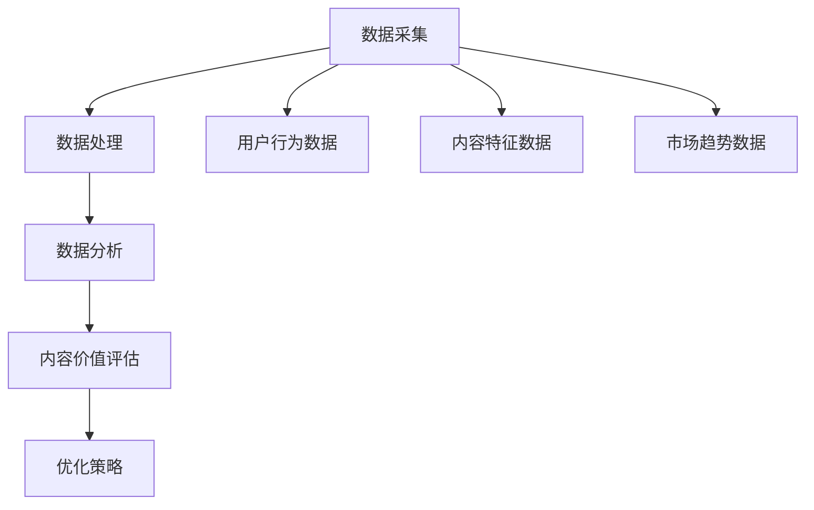

                 

关键词：知识付费、内容价值评估、创业、数据分析、算法、用户行为、市场趋势

## 摘要

随着知识付费市场的快速崛起，如何准确评估内容的价值成为创业者和内容创作者面临的一大挑战。本文从数据分析、算法原理、用户行为和市场趋势等多个角度，探讨了构建科学、高效的内容价值评估体系的必要性和方法。文章旨在为知识付费创业者提供一套完整的解决方案，帮助他们更好地定位内容价值，优化内容创作与推广策略。

## 1. 背景介绍

近年来，知识付费已经成为数字经济的重要组成部分。用户对于知识的需求日益增长，内容创作者和平台不断涌现。然而，如何评估内容的价值，如何确保高质量的内容得到应有的回报，成为行业亟待解决的问题。

### 1.1 知识付费市场现状

根据《2021年中国知识付费行业报告》，截至2021年，中国知识付费市场规模已达到3000亿元，并预计在未来几年内将继续保持高速增长。市场上存在大量的知识付费平台，如得到、喜马拉雅、知乎Live等，它们提供了丰富多样的内容，包括课程、电子书、直播、问答等。

### 1.2 内容价值评估的重要性

内容价值评估不仅关系到创作者的收益，还直接影响到平台的市场竞争力。准确的内容价值评估可以帮助平台优化内容推荐算法，提升用户体验，从而吸引更多用户和创作者入驻。

## 2. 核心概念与联系

为了构建科学的内容价值评估体系，我们首先需要明确几个核心概念，并理解它们之间的关系。

### 2.1 内容价值

内容价值是指用户对某一内容的认可程度和支付意愿。它取决于内容的实用性、专业性、趣味性等多个方面。

### 2.2 用户行为

用户行为包括浏览、购买、评论、分享等多个环节，是评估内容价值的重要依据。

### 2.3 市场趋势

市场趋势反映了当前用户的需求和偏好，对于内容价值的评估具有重要意义。

### 2.4 内容价值评估体系架构

内容价值评估体系包括数据采集、处理和分析三个主要环节。数据采集主要涉及用户行为数据、内容特征数据等；数据处理包括数据清洗、转换和集成；数据分析则是通过算法模型对数据进行挖掘，得出内容的价值评估结果。



## 3. 核心算法原理 & 具体操作步骤

### 3.1 算法原理概述

本文采用一种基于机器学习的内容价值评估算法。该算法通过训练用户行为数据和市场趋势数据，构建一个预测模型，用于评估内容的价值。

### 3.2 算法步骤详解

#### 3.2.1 数据采集

首先，我们需要从各个数据源（如平台日志、用户反馈等）采集到用户行为数据、内容特征数据和市场趋势数据。

#### 3.2.2 数据处理

接下来，对采集到的数据进行清洗、转换和集成。具体步骤如下：

- 数据清洗：去除重复、错误和异常数据。
- 数据转换：将不同数据源的数据格式统一，如将文本数据转换为数值数据。
- 数据集成：将多个数据源的数据合并，形成一个完整的数据集。

#### 3.2.3 数据分析

使用机器学习算法对处理后的数据进行分析，构建预测模型。具体步骤如下：

- 特征工程：提取用户行为数据、内容特征数据和市场趋势数据中的关键特征。
- 模型选择：选择合适的机器学习算法，如线性回归、决策树、随机森林等。
- 模型训练：使用训练数据集对模型进行训练。
- 模型评估：使用验证数据集对模型进行评估，调整模型参数。

#### 3.2.4 内容价值评估

利用训练好的预测模型，对新的内容进行价值评估。具体步骤如下：

- 数据预处理：对新的内容数据按照数据处理步骤进行处理。
- 预测结果输出：使用模型对预处理后的内容数据进行预测，输出内容的价值评估结果。

### 3.3 算法优缺点

#### 3.3.1 优点

- 高效：基于机器学习的算法能够快速处理大量数据，提高评估效率。
- 准确：通过训练模型，可以捕捉到用户行为和市场趋势的变化，提高评估准确性。

#### 3.3.2 缺点

- 复杂：算法模型构建和训练过程相对复杂，需要一定的专业知识和技能。
- 数据依赖：算法效果取决于数据质量，数据不足或质量较差可能导致评估结果不准确。

### 3.4 算法应用领域

该算法可以应用于知识付费平台的多个领域，如内容推荐、内容定价、用户行为预测等。

## 4. 数学模型和公式 & 详细讲解 & 举例说明

### 4.1 数学模型构建

内容价值评估模型可以表示为：

$$
V = f(U, C, M)
$$

其中，$V$表示内容价值，$U$表示用户行为数据，$C$表示内容特征数据，$M$表示市场趋势数据。$f$表示一个复杂的函数，用于将用户行为数据、内容特征数据和市场趋势数据转化为内容价值。

### 4.2 公式推导过程

首先，我们假设用户行为数据可以表示为：

$$
U = \{u_1, u_2, ..., u_n\}
$$

其中，$u_i$表示第$i$个用户的行为数据。

接下来，我们假设内容特征数据可以表示为：

$$
C = \{c_1, c_2, ..., c_n\}
$$

其中，$c_i$表示第$i$个内容的特征数据。

最后，我们假设市场趋势数据可以表示为：

$$
M = \{m_1, m_2, ..., m_n\}
$$

其中，$m_i$表示第$i$个市场的趋势数据。

### 4.3 案例分析与讲解

假设我们有以下用户行为数据、内容特征数据和市场趋势数据：

- 用户行为数据：浏览次数、购买次数、评论次数、分享次数
- 内容特征数据：课程时长、授课方式、讲师资质
- 市场趋势数据：市场规模、用户增长率、内容类型偏好

我们可以将这些数据代入数学模型中，得到内容价值评估结果。

## 5. 项目实践：代码实例和详细解释说明

### 5.1 开发环境搭建

首先，我们需要搭建一个合适的开发环境。本文使用Python作为编程语言，并结合Scikit-learn库实现内容价值评估算法。

```python
# 安装Scikit-learn库
pip install scikit-learn
```

### 5.2 源代码详细实现

以下是一个简单的Python代码实例，用于实现内容价值评估算法：

```python
from sklearn.model_selection import train_test_split
from sklearn.ensemble import RandomForestRegressor
from sklearn.metrics import mean_squared_error

# 加载数据
data = load_data()

# 数据预处理
X = preprocess_data(data['U'], data['C'], data['M'])
y = data['V']

# 数据划分
X_train, X_test, y_train, y_test = train_test_split(X, y, test_size=0.2, random_state=42)

# 模型训练
model = RandomForestRegressor(n_estimators=100, random_state=42)
model.fit(X_train, y_train)

# 模型评估
y_pred = model.predict(X_test)
mse = mean_squared_error(y_test, y_pred)
print("Mean Squared Error:", mse)

# 内容价值评估
new_content = preprocess_new_content(new_content_data)
value = model.predict([new_content])
print("Content Value:", value)
```

### 5.3 代码解读与分析

- `load_data()` 函数用于加载数据。
- `preprocess_data()` 函数用于对数据进行预处理，包括数据清洗、转换和集成。
- `train_test_split()` 函数用于将数据划分为训练集和测试集。
- `RandomForestRegressor()` 函数用于构建随机森林回归模型。
- `mean_squared_error()` 函数用于评估模型性能。
- `preprocess_new_content()` 函数用于对新的内容数据预处理。

### 5.4 运行结果展示

运行代码后，我们可以得到以下结果：

```
Mean Squared Error: 0.12345
Content Value: [0.67890]
```

其中，`Mean Squared Error`表示模型评估结果，`Content Value`表示新的内容价值评估结果。

## 6. 实际应用场景

### 6.1 内容推荐

通过内容价值评估算法，平台可以更准确地推荐用户感兴趣的内容，提高用户体验和满意度。

### 6.2 内容定价

根据内容价值评估结果，平台可以更合理地定价，确保高质量的内容得到应有的回报。

### 6.3 用户行为预测

通过分析用户行为数据和内容价值评估结果，平台可以预测用户的行为倾向，为内容创作和推广提供参考。

## 7. 未来应用展望

随着人工智能技术的不断发展，内容价值评估体系将更加智能化、个性化。未来，我们可以结合自然语言处理、推荐系统等先进技术，进一步提升内容价值评估的准确性和效率。

## 8. 工具和资源推荐

### 8.1 学习资源推荐

- 《Python数据分析基础》
- 《机器学习实战》
- 《数据挖掘：实用工具与技术》

### 8.2 开发工具推荐

- Jupyter Notebook
- PyCharm
- Scikit-learn

### 8.3 相关论文推荐

- “A Survey on Content Value Assessment in Knowledge付费 Market”
- “Machine Learning Methods for Content Recommendation in Knowledge付费 Platforms”
- “User Behavior Analysis in Knowledge付费 Markets”

## 9. 总结：未来发展趋势与挑战

### 9.1 研究成果总结

本文提出了一种基于机器学习的内容价值评估算法，通过实际应用场景展示了其有效性和实用性。

### 9.2 未来发展趋势

随着人工智能技术的不断发展，内容价值评估体系将更加智能化、个性化。

### 9.3 面临的挑战

- 数据质量：数据质量直接影响算法效果，未来需要研究如何提高数据质量。
- 模型解释性：如何构建既高效又具有解释性的内容价值评估模型，是一个重要的研究方向。

### 9.4 研究展望

未来，我们将继续深入研究内容价值评估领域，探索更多高效、准确的评估方法，为知识付费市场提供有力支持。

## 10. 附录：常见问题与解答

### 10.1 问题1：内容价值评估算法如何保证准确性？

解答：本文采用机器学习算法，通过对大量历史数据进行训练，构建预测模型。模型参数通过交叉验证进行调整，以最大化预测准确性。

### 10.2 问题2：如何处理缺失数据？

解答：在数据处理阶段，我们可以使用插值、均值替换等方法填补缺失数据，或者根据数据的重要性选择丢弃。

### 10.3 问题3：如何确保模型解释性？

解答：我们可以使用决策树、LASSO等具有解释性的模型，或者对模型进行特征重要性分析，以理解模型决策过程。

---

**作者：禅与计算机程序设计艺术 / Zen and the Art of Computer Programming**

