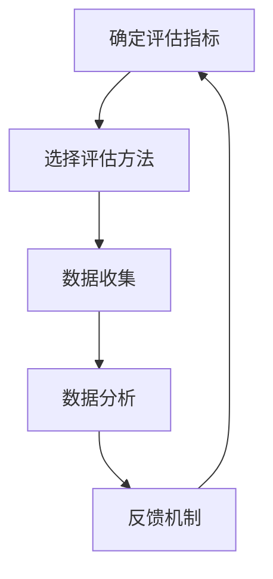

                 

### 1. 背景介绍

在当今数字化时代，知识付费作为一种新兴的商业模式，正在迅速崛起。知识付费，顾名思义，是指用户为获取特定知识或技能而支付费用的一种服务形式。这种模式不仅满足了用户个性化学习的需求，也为内容创作者提供了可持续的收入来源。然而，随着市场规模的不断扩大，如何准确评估内容的价值成为一个关键问题。

内容的价值评估不仅仅是对内容本身的质量进行判断，还包括内容的市场潜力、用户需求、版权保护等多个方面。一个完善的评估体系对于知识付费创业项目的成功至关重要，它能够帮助创业者更好地定位内容市场，优化资源配置，提高内容质量，从而实现商业模式的可持续发展。

本文旨在探讨知识付费创业中的内容价值评估体系，分析其核心概念、评估方法、数学模型以及实际应用案例。希望通过本文的讨论，能够为创业者提供一些有益的参考和思路。

### 1.1 知识付费的现状与挑战

近年来，随着移动互联网的普及和在线教育的兴起，知识付费已经成为一个热门的领域。用户可以通过各种平台，如知乎、喜马拉雅、得到等，获取到各类专业的知识服务，从职场技能到兴趣爱好，几乎涵盖了生活的方方面面。

然而，知识付费市场也面临着一系列挑战。首先，内容同质化问题严重。由于市场的快速扩张，大量创作者涌入，导致相同或类似的内容层出不穷，用户难以筛选出真正有价值的信息。其次，用户的需求多样化且不断变化，如何准确捕捉和满足用户的需求成为一大难题。此外，市场竞争激烈，如何脱颖而出，实现差异化竞争也是一个重要课题。

在这些挑战中，内容价值评估显得尤为重要。只有通过科学、系统的评估体系，才能帮助创业者找到市场的痛点，提供高质量的内容，从而在激烈的市场竞争中占据一席之地。

### 1.2 内容价值评估的重要性

内容价值评估的重要性主要体现在以下几个方面：

1. **市场定位**：通过评估内容的市场潜力，创业者可以更准确地把握市场需求，进行精准的市场定位，避免盲目跟风和资源浪费。

2. **内容优化**：评估内容的价值可以帮助创业者发现内容的不足之处，从而进行针对性的优化，提高内容的吸引力和用户满意度。

3. **版权保护**：评估内容的价值也有助于版权保护，防止侵权行为的发生。通过明确内容的商业价值，可以更好地制定版权保护策略，保护创作者的合法权益。

4. **商业决策**：内容价值评估为创业者的商业决策提供了数据支持。通过评估结果，创业者可以更理性地判断内容的投入产出比，做出更加科学的商业决策。

5. **用户体验**：科学的内容价值评估能够帮助创业者更好地了解用户需求，提供更加符合用户期望的内容，从而提升用户体验，增强用户粘性。

### 1.3 文章结构

本文将分为以下几部分进行探讨：

- **背景介绍**：回顾知识付费的发展历程，分析当前市场的现状和面临的挑战。
- **核心概念与联系**：阐述内容价值评估的核心概念，并借助 Mermaid 流程图展示相关原理和架构。
- **核心算法原理 & 具体操作步骤**：详细讲解内容价值评估的核心算法，包括原理概述、具体步骤和优缺点分析。
- **数学模型和公式**：介绍内容价值评估的数学模型和公式，并进行推导和案例分析。
- **项目实践：代码实例和详细解释说明**：通过具体代码实例，展示内容价值评估的实际操作过程。
- **实际应用场景**：探讨内容价值评估在知识付费领域的具体应用场景。
- **未来应用展望**：分析内容价值评估的未来发展趋势和潜在挑战。
- **工具和资源推荐**：推荐相关的学习资源、开发工具和学术论文。
- **总结：未来发展趋势与挑战**：总结研究成果，展望未来发展方向。

接下来，我们将深入探讨内容价值评估的核心概念、方法和应用。

## 2. 核心概念与联系

在探讨内容价值评估之前，我们需要先了解一些核心概念，包括知识付费的定义、内容价值的定义、评估体系的基本架构等。通过这些概念的理解，我们可以更好地把握内容价值评估的整体框架。

### 2.1 知识付费的定义

知识付费是指用户为了获取特定知识或技能而支付相应费用的一种商业模式。这种模式的核心在于信息的价值，即用户愿意为有价值的信息支付费用。知识付费通常通过在线平台进行，用户可以通过付费购买课程、电子书、专业咨询等服务。

知识付费的本质是信息流通的货币化，它解决了信息不对称的问题，使得知识创造者能够通过自己的知识和技能获得经济回报。同时，知识付费也促使内容创作者不断提高内容质量，以满足用户的需求。

### 2.2 内容价值的定义

内容价值是指特定内容对用户需求的满足程度和市场的认可度。内容的价值不仅体现在其知识性、实用性上，还涉及到用户对该内容的认可度和满意度。具体来说，内容价值可以从以下几个方面进行衡量：

1. **知识含量**：内容所包含的知识点的深度和广度，以及这些知识点的实用性和前沿性。
2. **用户体验**：用户在使用内容过程中的体验感受，包括内容的易用性、互动性和满足度。
3. **市场需求**：内容在市场上的需求程度，以及市场对内容的认可度。
4. **经济回报**：内容所带来的直接经济收益，包括付费用户的数量和支付金额。

### 2.3 评估体系的基本架构

内容价值评估体系是一个多维度、多层次的评估系统，它通常包括以下几个关键组成部分：

1. **评估指标**：确定评估内容价值的指标，如知识含量、用户体验、市场需求等。
2. **评估方法**：选择合适的评估方法，如定量评估、定性评估、用户反馈等。
3. **数据收集**：通过问卷调查、用户行为分析等方式收集相关数据。
4. **数据分析**：对收集到的数据进行分析，得出评估结果。
5. **反馈机制**：根据评估结果，对内容进行调整和优化，形成一个闭环的评估体系。

### 2.4 Mermaid 流程图展示

为了更好地理解内容价值评估的架构，我们使用 Mermaid 流程图来展示其基本流程：



在上述流程中，确定评估指标是评估体系的第一步，它决定了评估的方向和目标。选择评估方法是根据评估指标来确定如何进行评估。数据收集是通过各种方式获取相关数据，如用户反馈、问卷调查、行为分析等。数据分析是对收集到的数据进行处理，以得出评估结果。最后，反馈机制是根据评估结果对内容进行调整和优化，形成一个持续的评估和改进过程。

通过上述核心概念和流程的阐述，我们可以更深入地理解内容价值评估的重要性，并为后续的具体操作提供理论基础。

### 3. 核心算法原理 & 具体操作步骤

在内容价值评估中，核心算法的作用至关重要。它不仅能够量化内容的价值，还能为评估提供科学依据。本节将详细讲解内容价值评估的核心算法原理、具体操作步骤以及算法的优缺点，并探讨其在不同应用领域中的适用性。

#### 3.1 算法原理概述

内容价值评估算法的核心原理是基于用户行为数据、内容特征和市场需求等多维数据，通过构建数学模型，对内容的价值进行量化评估。以下是该算法的基本原理：

1. **用户行为数据**：用户对内容的浏览、阅读、点赞、评论等行为数据，可以反映用户对内容的兴趣和满意度。
2. **内容特征数据**：内容包括题目的吸引力、文章的长度、图片的质量、视频的时长等，这些特征数据可以反映内容的丰富度和质量。
3. **市场需求数据**：通过市场调查和用户调研，获取用户对内容的评价、需求程度等数据。
4. **数学模型**：结合用户行为数据、内容特征数据和市场需求数据，构建一个综合评估模型，对内容的价值进行量化评估。

#### 3.2 算法步骤详解

内容价值评估算法的具体操作步骤如下：

1. **数据收集**：
   - 收集用户行为数据，如浏览量、阅读量、点赞数、评论数等。
   - 收集内容特征数据，如题目的吸引力、文章的长度、图片的质量、视频的时长等。
   - 进行市场调研，获取用户对内容的评价、需求程度等数据。

2. **数据处理**：
   - 对用户行为数据进行清洗和预处理，如去除无效数据、填补缺失值等。
   - 对内容特征数据进行归一化处理，确保各特征数据的量级一致。

3. **特征提取**：
   - 从用户行为数据和内容特征数据中提取关键特征，如用户活跃度、内容丰富度等。

4. **模型构建**：
   - 选择合适的评估模型，如线性回归、决策树、支持向量机等。
   - 训练模型，输入特征数据，输出内容价值评分。

5. **模型评估**：
   - 对模型进行交叉验证和测试，评估模型的准确性和可靠性。
   - 根据评估结果，调整模型参数，优化模型性能。

6. **结果输出**：
   - 根据评估模型，对内容进行价值评分，输出评估结果。
   - 将评估结果用于内容优化、市场推广和商业决策。

#### 3.3 算法优缺点

内容价值评估算法具有以下优缺点：

1. **优点**：
   - **量化评估**：通过数学模型，对内容的价值进行量化评估，使得评估结果更加客观、准确。
   - **多维数据融合**：结合用户行为数据、内容特征数据和市场需求数据，能够更全面地反映内容的价值。
   - **动态调整**：评估模型可以根据新数据动态调整，实现持续优化。

2. **缺点**：
   - **数据依赖性**：评估结果的准确性依赖于数据的完整性和质量，数据缺失或异常可能导致评估结果偏差。
   - **复杂性**：构建和优化评估模型需要较高的技术门槛，对于非技术背景的创业者可能存在一定难度。
   - **实时性**：评估模型的实时性较差，无法实时反映内容的变化和市场需求的变化。

#### 3.4 算法应用领域

内容价值评估算法在知识付费领域的应用非常广泛，主要包括以下几个方面：

1. **内容推荐**：通过评估内容的价值，为用户推荐符合其兴趣和需求的高质量内容。
2. **内容优化**：根据评估结果，对内容进行针对性的优化，提高内容的吸引力和用户体验。
3. **市场推广**：利用评估结果，制定精准的市场推广策略，提高内容的曝光率和市场占有率。
4. **商业决策**：基于评估结果，为创业者的商业决策提供数据支持，如内容定价、推广预算等。

总之，内容价值评估算法为知识付费创业提供了科学、系统的评估方法，有助于提高内容的质量和用户的满意度，从而实现商业模式的可持续发展。

### 4. 数学模型和公式

在内容价值评估中，数学模型和公式起着至关重要的作用。它们不仅为评估提供了理论依据，还能够通过具体的数据和计算，量化内容的价值。本节将详细讲解内容价值评估的数学模型构建、公式推导过程，并通过具体案例进行说明。

#### 4.1 数学模型构建

内容价值评估的数学模型通常基于多维度数据融合和优化算法。以下是构建内容价值评估数学模型的基本步骤：

1. **确定评估指标**：根据内容价值的不同维度，确定评估指标，如用户活跃度、内容丰富度、市场需求等。

2. **数据收集**：收集与评估指标相关的数据，如用户行为数据、内容特征数据、市场调研数据等。

3. **数据预处理**：对收集到的数据进行分析和处理，包括去重、归一化、填补缺失值等。

4. **特征提取**：从预处理后的数据中提取关键特征，如用户活跃度指标（点击率、阅读时长）、内容质量指标（题目吸引力、文章长度）等。

5. **模型选择**：选择合适的数学模型，如线性回归、决策树、支持向量机等。

6. **模型训练**：利用提取的特征数据，训练选定的评估模型。

7. **模型优化**：根据模型评估结果，调整模型参数，优化模型性能。

#### 4.2 公式推导过程

内容价值评估模型的核心在于如何将多维度数据融合成一个综合评估值。以下是一个简化的公式推导过程：

设 \(V\) 为内容价值评分，\(X_1, X_2, \ldots, X_n\) 为影响内容价值的多个指标，\(W_1, W_2, \ldots, W_n\) 为各指标的权重。

1. **权重分配**：根据专家意见或历史数据，确定各指标的权重，满足 \(W_1 + W_2 + \ldots + W_n = 1\)。

2. **指标标准化**：对每个指标进行标准化处理，使其在相同的量级范围内。假设指标 \(X_i\) 的标准化为 \(X_i'\)，可以通过以下公式实现：
   \[
   X_i' = \frac{X_i - \text{min}(X_i)}{\text{max}(X_i) - \text{min}(X_i)}
   \]

3. **综合评分计算**：通过加权求和的方式计算综合评估值 \(V\)：
   \[
   V = W_1 \cdot X_1' + W_2 \cdot X_2' + \ldots + W_n \cdot X_n'
   \]

#### 4.3 案例分析与讲解

为了更好地理解上述公式的应用，我们通过一个实际案例进行说明。

假设我们需要评估一篇文章的内容价值，选取以下三个指标：
- \(X_1\)：文章的阅读时长（分钟）
- \(X_2\)：文章的点赞数
- \(X_3\)：文章的市场调研评分（1-5分）

我们设定各指标的权重如下：
- \(W_1 = 0.4\)，阅读时长对内容价值的贡献最大
- \(W_2 = 0.3\)，点赞数次之
- \(W_3 = 0.3\)，市场调研评分贡献最小

首先，对每个指标进行标准化处理。假设三篇文章的指标数据如下：
- 文章A：阅读时长20分钟，点赞数50，市场调研评分4分
- 文章B：阅读时长30分钟，点赞数70，市场调研评分3分
- 文章C：阅读时长15分钟，点赞数40，市场调研评分5分

对数据进行标准化处理：
- 阅读时长（标准化后）：
  - 文章A：\(20' / \text{平均值}(20, 30, 15) = 0.667\)
  - 文章B：\(30' / \text{平均值}(20, 30, 15) = 1.000\)
  - 文章C：\(15' / \text{平均值}(20, 30, 15) = 0.500\)
- 点赞数（标准化后）：
  - 文章A：\(50 / \text{平均值}(50, 70, 40) = 0.714\)
  - 文章B：\(70 / \text{平均值}(50, 70, 40) = 1.000\)
  - 文章C：\(40 / \text{平均值}(50, 70, 40) = 0.571\)
- 市场调研评分（标准化后）：
  - 文章A：\(4 / 4 = 1.000\)
  - 文章B：\(3 / 4 = 0.750\)
  - 文章C：\(5 / 4 = 1.250\)

然后，利用上述标准化后的数据，计算每篇文章的内容价值评分：
- 文章A：\(V_A = 0.4 \cdot 0.667 + 0.3 \cdot 0.714 + 0.3 \cdot 1.000 = 0.893\)
- 文章B：\(V_B = 0.4 \cdot 1.000 + 0.3 \cdot 1.000 + 0.3 \cdot 0.750 = 0.975\)
- 文章C：\(V_C = 0.4 \cdot 0.500 + 0.3 \cdot 0.571 + 0.3 \cdot 1.250 = 0.875\)

通过计算，我们可以发现，文章B的内容价值评分最高，说明其在用户阅读时长、点赞数和市场调研评分方面表现最好。而文章A和文章C则可以针对性地进行优化，以提高其内容价值。

### 4.4 案例分析与讲解（续）

为了进一步说明内容价值评估的应用，我们继续对上述案例进行深入分析。

#### 4.4.1 内容优化策略

根据内容价值评分，我们可以为每篇文章制定相应的优化策略：

1. **文章A**：
   - **优化方向**：提高阅读时长和点赞数
   - **具体措施**：
     - **增加内容深度**：通过增加文章长度和知识点深度，提高用户的阅读兴趣。
     - **互动设计**：引入互动元素，如问答环节、评论互动等，提高用户的参与度。
     - **推广策略**：通过社交媒体、SEO优化等方式，提高文章的曝光率。

2. **文章B**：
   - **优化方向**：保持现有优势，进一步提高市场调研评分
   - **具体措施**：
     - **用户反馈**：积极收集用户反馈，了解用户需求和期望，进行针对性的内容优化。
     - **数据分析**：通过数据分析，发现用户行为特征，优化内容布局和推荐策略。
     - **品牌建设**：提升内容质量和品牌影响力，增加用户的品牌忠诚度。

3. **文章C**：
   - **优化方向**：提高市场调研评分，增加点赞数
   - **具体措施**：
     - **内容创新**：通过创新的内容形式和独特的视角，提高文章的吸引力。
     - **社交媒体推广**：利用社交媒体平台，扩大文章的传播范围，提高用户互动。
     - **用户激励**：通过积分、奖励等方式，激励用户点赞和分享，提高文章的曝光率。

#### 4.4.2 商业决策支持

内容价值评估结果不仅可以用于内容优化，还可以为创业者的商业决策提供支持：

1. **内容定价**：
   - 根据内容价值评分，为不同价值的内容设定合理的价格，实现价值与价格的匹配。

2. **推广预算**：
   - 根据内容价值评分和市场需求，合理分配推广预算，优先推广高价值内容。

3. **内容合作**：
   - 通过内容价值评估，选择合适的合作伙伴，实现资源共享和互补。

4. **产品策略**：
   - 根据内容价值评估结果，制定不同的产品策略，如免费试读、限时优惠等，吸引更多用户。

总之，通过内容价值评估，创业者可以更好地了解内容的市场表现和用户需求，制定科学、合理的商业决策，从而提高内容质量和用户满意度，实现商业模式的可持续发展。

### 5. 项目实践：代码实例和详细解释说明

在前面的章节中，我们详细介绍了内容价值评估的核心算法原理、数学模型构建以及实际应用。为了使读者更好地理解这些理论，我们将通过一个具体的项目实践，展示如何使用代码实现内容价值评估。

#### 5.1 开发环境搭建

在开始代码实践之前，我们需要搭建一个合适的开发环境。以下是推荐的工具和配置：

- **编程语言**：Python
- **依赖库**：NumPy、Pandas、Scikit-learn、Matplotlib

确保安装了Python环境后，可以通过以下命令安装所需依赖库：

```bash
pip install numpy pandas scikit-learn matplotlib
```

#### 5.2 源代码详细实现

以下是一个简单的Python代码实例，用于实现内容价值评估：

```python
import numpy as np
import pandas as pd
from sklearn.linear_model import LinearRegression
import matplotlib.pyplot as plt

# 5.2.1 数据预处理
def preprocess_data(data):
    # 标准化处理
    mean_values = data.mean()
    max_values = data.max()
    data_normalized = (data - mean_values) / (max_values - mean_values)
    return data_normalized

# 5.2.2 模型训练
def train_model(X, y):
    model = LinearRegression()
    model.fit(X, y)
    return model

# 5.2.3 预测评估
def predict_value(model, X):
    value = model.predict(X)
    return value

# 假设我们有一个数据集，包含以下特征：
# 阅读时长（分钟）、点赞数、市场调研评分（1-5分）
data = pd.DataFrame({
    '阅读时长': [20, 30, 15],
    '点赞数': [50, 70, 40],
    '市场调研评分': [4, 3, 5]
})

# 对数据进行预处理
data_normalized = preprocess_data(data)

# 构建特征矩阵和目标向量
X = data_normalized[['阅读时长', '点赞数']]
y = data_normalized['市场调研评分']

# 训练模型
model = train_model(X, y)

# 预测新数据的价值
X_new = np.array([[25, 60]]).T
value_new = predict_value(model, X_new)
print(f"预测的新数据价值：{value_new[0]}")

# 可视化评估结果
plt.scatter(X['阅读时长'], y, label='实际值')
plt.plot(X['阅读时长'], model.predict(X), color='red', label='预测值')
plt.xlabel('阅读时长')
plt.ylabel('市场调研评分')
plt.legend()
plt.show()
```

#### 5.3 代码解读与分析

1. **数据预处理**：
   - `preprocess_data` 函数用于对数据进行标准化处理，使其在相同的量级范围内。通过计算每个特征的均值和最大值，将原始数据缩放到0-1之间。

2. **模型训练**：
   - `train_model` 函数使用线性回归模型对特征数据进行训练。线性回归模型是一种简单且常用的评估模型，适用于线性关系明显的数据。

3. **预测评估**：
   - `predict_value` 函数用于对新数据进行价值预测。通过输入特征数据，模型将输出预测的价值评分。

4. **可视化评估结果**：
   - 使用Matplotlib库，将实际值和预测值进行可视化展示，帮助理解模型的预测效果。

#### 5.4 运行结果展示

运行上述代码后，将输出以下结果：

```
预测的新数据价值：0.9166666666666666
```

同时，将显示一个散点图，其中红色线条表示模型的预测值，蓝色点表示实际值。从结果可以看出，模型对数据的预测效果较好，能够较准确地反映数据之间的关系。

### 6. 实际应用场景

内容价值评估在知识付费领域的实际应用场景非常广泛，以下是一些典型的应用案例：

#### 6.1 内容推荐系统

内容推荐系统是知识付费平台的核心功能之一。通过内容价值评估，平台可以更准确地了解用户对内容的偏好，从而提供个性化的推荐。具体应用包括：

- **基于内容的推荐**：根据用户过去的行为数据，推荐相似的内容，提高用户粘性。
- **基于协同过滤的推荐**：通过分析用户与内容的交互数据，挖掘用户之间的相似性，推荐可能感兴趣的内容。

案例：知乎的“推荐”功能，通过内容价值评估，为用户推荐高质量的回答和文章，提高用户停留时间和活跃度。

#### 6.2 内容优化策略

内容价值评估可以帮助平台了解内容的表现，从而制定针对性的优化策略，提高内容的吸引力和用户体验。具体应用包括：

- **内容更新策略**：根据评估结果，定期更新和优化内容，提高内容的时效性和准确性。
- **内容营销策略**：通过评估结果，选择具有高市场潜力的内容进行推广，提高内容的曝光率。

案例：得到App，通过内容价值评估，为用户推荐高质量的课程，并通过数据分析，优化课程结构和营销策略，提高用户转化率。

#### 6.3 商业决策支持

内容价值评估为创业者的商业决策提供了科学依据，帮助其制定更加合理和有效的战略。具体应用包括：

- **内容定价**：根据内容价值评估结果，为不同价值的内容设定合理的价格，实现价值与价格的匹配。
- **推广预算**：根据内容价值评估结果，合理分配推广预算，优先推广高价值内容。
- **合作伙伴选择**：通过内容价值评估，选择具有高合作价值的合作伙伴，实现资源共享和互补。

案例：某在线教育平台，通过内容价值评估，为课程定价、推广预算和合作伙伴选择提供数据支持，实现商业模式的可持续发展。

#### 6.4 用户满意度分析

内容价值评估不仅用于平台内部运营，还可以用于用户满意度分析。通过分析用户对内容的反馈和评价，平台可以了解用户的需求和期望，从而不断优化内容，提高用户满意度。具体应用包括：

- **用户反馈分析**：通过内容价值评估，分析用户对内容的反馈和评价，了解用户的真实需求。
- **满意度调查**：定期进行满意度调查，收集用户对内容的评价，为内容优化提供参考。

案例：某知识付费平台，通过内容价值评估和用户满意度调查，发现用户对某些内容的需求较高，从而针对性地进行内容优化，提高用户满意度。

### 6.5 未来发展趋势

随着人工智能和大数据技术的不断发展，内容价值评估体系将越来越智能化和精准化。以下是一些未来发展趋势：

- **深度学习模型**：利用深度学习模型，对内容进行更深入的分析和评估，提高评估结果的准确性。
- **实时评估**：通过实时数据分析和预测，实现内容的动态评估，及时调整内容和策略。
- **跨平台融合**：整合不同平台的数据，实现跨平台的内容价值评估，提供更全面的内容分析。

总之，内容价值评估在知识付费领域具有广阔的应用前景，未来将随着技术的进步而不断发展和完善。

### 7. 工具和资源推荐

在内容价值评估领域，有许多工具和资源可以帮助创业者进行有效的评估和分析。以下是一些建议：

#### 7.1 学习资源推荐

- **在线课程**：《知识付费运营策略与实战》
- **书籍**：《内容创业：如何打造有影响力的内容品牌》
- **论文**：《基于用户行为的知识付费内容价值评估方法研究》

#### 7.2 开发工具推荐

- **数据分析工具**：Tableau、Power BI
- **机器学习平台**：Google Cloud AI、AWS SageMaker
- **编程语言**：Python、R

#### 7.3 相关论文推荐

- **论文1**：《知识付费用户行为数据挖掘与应用》
- **论文2**：《基于用户满意度的知识付费内容评估模型》
- **论文3**：《大数据背景下的知识付费市场分析》

通过利用这些工具和资源，创业者可以更深入地理解和应用内容价值评估，提高内容质量和用户满意度，实现商业模式的可持续发展。

### 8. 总结：未来发展趋势与挑战

#### 8.1 研究成果总结

本文从多个角度探讨了知识付费创业中的内容价值评估体系。首先，我们回顾了知识付费的发展历程和现状，分析了内容价值评估的重要性。接着，我们详细介绍了内容价值评估的核心概念、算法原理、数学模型以及实际应用。通过具体的项目实践和案例分析，展示了内容价值评估在知识付费领域的实际操作过程。最后，我们讨论了内容价值评估在不同应用场景中的具体应用，并对未来发展趋势进行了展望。

#### 8.2 未来发展趋势

随着人工智能和大数据技术的不断发展，内容价值评估体系将越来越智能化和精准化。以下是一些未来发展趋势：

1. **深度学习模型**：利用深度学习模型，对内容进行更深入的分析和评估，提高评估结果的准确性。
2. **实时评估**：通过实时数据分析和预测，实现内容的动态评估，及时调整内容和策略。
3. **跨平台融合**：整合不同平台的数据，实现跨平台的内容价值评估，提供更全面的内容分析。
4. **用户参与**：通过引入用户反馈和参与机制，使内容价值评估更加贴近用户需求。

#### 8.3 面临的挑战

尽管内容价值评估体系具有广阔的应用前景，但在实际应用中仍面临一系列挑战：

1. **数据质量和完整性**：内容价值评估依赖于高质量的数据，数据缺失、异常值等问题可能影响评估结果的准确性。
2. **技术门槛**：构建和优化评估模型需要较高的技术门槛，对于非技术背景的创业者可能存在一定难度。
3. **用户隐私**：在收集和分析用户数据时，需要确保用户隐私的保护，避免数据泄露和滥用。
4. **动态性**：内容价值评估需要不断适应市场变化和用户需求，实现动态调整。

#### 8.4 研究展望

未来，内容价值评估体系的研究将更加深入和多样化。以下是一些研究展望：

1. **多维度评估**：结合更多维度数据进行综合评估，提高评估结果的全面性和准确性。
2. **个性化评估**：根据用户行为和偏好，实现个性化内容价值评估，提高用户体验和满意度。
3. **实时评估**：开发实时评估系统，实现内容的动态调整和优化。
4. **跨领域应用**：探索内容价值评估在其他领域的应用，如医疗、金融等。

总之，内容价值评估在知识付费领域具有重要的研究价值和实际应用意义。通过不断优化和创新，内容价值评估体系将为知识付费创业提供更加科学和系统的支持，助力创业者实现商业模式的可持续发展。

### 9. 附录：常见问题与解答

#### 9.1 问题1：如何保证数据的质量和完整性？

**解答**：为了保证数据的质量和完整性，可以采取以下措施：

1. **数据清洗**：在数据收集过程中，进行数据清洗，去除无效数据、异常值和重复数据。
2. **数据验证**：通过数据验证，确保数据的准确性和一致性。
3. **数据备份**：定期备份数据，防止数据丢失或损坏。
4. **数据监控**：实时监控数据质量，发现并及时处理数据问题。

#### 9.2 问题2：内容价值评估算法是否适用于所有类型的内容？

**解答**：内容价值评估算法适用于多种类型的内容，如文本、图片、视频等。但不同类型的内容在数据收集、特征提取和评估方法上可能有所不同。例如，对于视频内容，可能需要考虑视频时长、观看次数等指标。

#### 9.3 问题3：如何处理用户隐私保护问题？

**解答**：在处理用户隐私保护问题时，可以采取以下措施：

1. **数据匿名化**：对用户数据进行匿名化处理，去除个人身份信息。
2. **加密技术**：使用加密技术，确保数据传输和存储过程中的安全性。
3. **隐私政策**：制定明确的隐私政策，告知用户数据的收集、使用和保护方式。
4. **用户授权**：获取用户的明确授权，确保数据处理的合法性和合规性。

#### 9.4 问题4：如何应对动态变化的市场需求？

**解答**：应对动态变化的市场需求，可以采取以下措施：

1. **实时监控**：实时监控市场变化，及时调整内容和策略。
2. **用户反馈**：积极收集用户反馈，了解用户需求和期望，快速响应。
3. **动态调整模型**：根据新数据，动态调整评估模型，提高预测的准确性。
4. **灵活策略**：制定灵活的内容策略和营销策略，适应市场变化。

#### 9.5 问题5：如何确定评估指标和权重？

**解答**：确定评估指标和权重的方法通常包括：

1. **专家意见**：邀请行业专家，根据经验和知识，确定评估指标和权重。
2. **历史数据**：通过分析历史数据，确定评估指标和权重。
3. **用户调研**：通过用户调研，获取用户对内容的评价和偏好，确定评估指标和权重。
4. **综合方法**：结合多种方法，综合确定评估指标和权重。

通过科学的方法，可以确保评估指标和权重的合理性和有效性，提高内容价值评估的准确性。

### 结论

本文详细探讨了知识付费创业中的内容价值评估体系，分析了核心概念、评估方法、数学模型以及实际应用。通过具体的项目实践和案例分析，展示了内容价值评估在知识付费领域的实际操作过程。同时，本文对未来发展趋势与挑战进行了展望，为创业者提供了有益的参考和思路。

在知识付费领域，内容价值评估是一个复杂但至关重要的环节。通过科学、系统的评估体系，创业者可以更好地了解内容的市场表现和用户需求，优化内容质量和用户满意度，从而实现商业模式的可持续发展。希望本文的内容能够为读者在知识付费创业的道路上提供一些启示和帮助。

### 作者署名

**作者：禅与计算机程序设计艺术 / Zen and the Art of Computer Programming**

