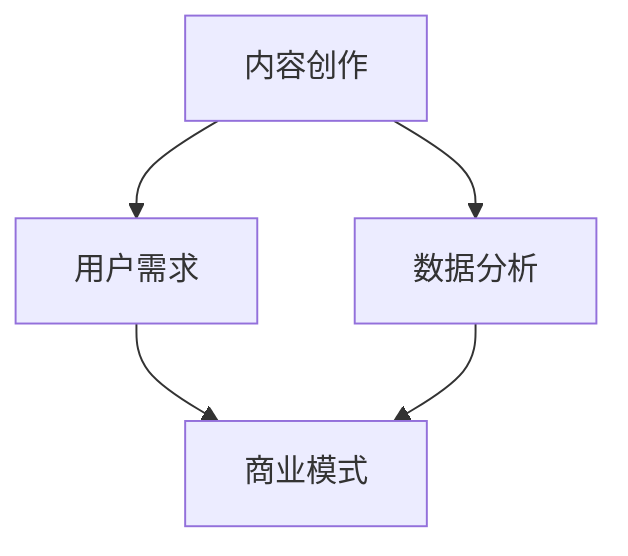

                 

关键词：知识付费、内容价值链、创业、内容创作、商业模式、用户需求、数据分析

摘要：本文深入探讨了知识付费创业中的内容价值链构建。从核心概念到具体操作步骤，再到数学模型与实际应用，本文旨在为创业者提供一套系统的策略，以构建高价值的内容体系，满足用户需求，实现商业成功。

## 1. 背景介绍

随着互联网技术的发展和用户需求的变化，知识付费逐渐成为互联网经济中的重要组成部分。知识付费创业在近年来迎来了快速发展，各类在线教育平台、技能培训课程、专业咨询服务等层出不穷。然而，如何在竞争激烈的市场中脱颖而出，构建具有持续竞争力的内容价值链，成为创业者面临的一大挑战。

内容价值链是指从内容创作、传播、消费到反馈的整个流程，其中每一个环节都至关重要。本文将从以下几个方面展开讨论：

- 核心概念与联系
- 核心算法原理与具体操作步骤
- 数学模型和公式
- 项目实践：代码实例与详细解释
- 实际应用场景与未来展望
- 工具和资源推荐
- 总结：未来发展趋势与挑战

通过以上内容的阐述，希望能够为知识付费创业者提供有价值的参考和指导。

## 2. 核心概念与联系

在构建内容价值链的过程中，首先需要明确几个核心概念，包括内容创作、用户需求、数据分析、商业模式等。

### 2.1 内容创作

内容创作是内容价值链的起点，也是核心环节。高质量的内容能够吸引和留住用户，从而为后续环节打下坚实基础。内容创作需要结合用户需求，以专业性和实用性为原则，提供有价值的信息和知识。

### 2.2 用户需求

用户需求是内容价值链构建的基础。只有深入了解用户需求，才能创作出满足用户期待的内容。通过数据分析，可以挖掘用户的兴趣点、痛点、需求趋势等，为内容创作提供有力支持。

### 2.3 数据分析

数据分析在内容价值链中起着至关重要的作用。通过对用户行为数据的分析，可以了解用户喜好、使用习惯、消费行为等，从而优化内容创作和传播策略，提高用户满意度和粘性。

### 2.4 商业模式

商业模式是内容价值链的落脚点。合理的商业模式能够确保内容创作者获得合理回报，从而持续提供高质量的内容。常见的商业模式包括订阅制、一次性购买、广告收入等。

### 2.5 Mermaid 流程图

以下是内容价值链的 Mermaid 流程图，展示了各个核心概念之间的联系：



通过以上核心概念的阐述和流程图的展示，我们可以更好地理解内容价值链的构建过程。

## 3. 核心算法原理 & 具体操作步骤

在构建内容价值链的过程中，算法的运用至关重要。以下将介绍一种基于用户行为数据分析的核心算法原理及其具体操作步骤。

### 3.1 算法原理概述

本算法旨在通过分析用户行为数据，为内容创作者提供个性化推荐，从而提高用户满意度和粘性。算法的核心思想是利用协同过滤（Collaborative Filtering）和内容推荐（Content-Based Filtering）相结合的方法，实现精准推荐。

### 3.2 算法步骤详解

1. **数据收集与预处理**：收集用户行为数据，包括浏览记录、购买历史、评价等。对数据进行清洗和预处理，去除噪声和异常值。

2. **用户兴趣挖掘**：通过文本挖掘和机器学习算法，提取用户兴趣关键词和主题。这些关键词和主题将用于后续的协同过滤和内容推荐。

3. **协同过滤**：采用基于用户的行为数据（如浏览记录、评价等）进行协同过滤，计算用户之间的相似度。根据用户相似度，为用户推荐相似用户喜欢的物品（如文章、课程等）。

4. **内容推荐**：结合用户兴趣关键词和主题，为用户推荐与兴趣相关的优质内容。可以使用文本相似度计算、词向量等方法实现。

5. **推荐结果评估与优化**：评估推荐结果的准确性和实用性，根据评估结果调整算法参数和推荐策略。

### 3.3 算法优缺点

**优点**：

- 能够根据用户行为和兴趣，实现个性化推荐，提高用户满意度和粘性。
- 结合协同过滤和内容推荐，提高推荐结果的准确性和多样性。

**缺点**：

- 需要大量用户行为数据进行训练，数据质量对算法效果有很大影响。
- 在新用户数据不足时，推荐效果可能不佳。

### 3.4 算法应用领域

- 在线教育：为用户推荐适合的学习课程和资料。
- 媒体内容：为用户推荐感兴趣的文章、视频等。
- 电商推荐：为用户推荐相似的商品。

## 4. 数学模型和公式 & 详细讲解 & 举例说明

在内容价值链的构建过程中，数学模型和公式发挥着重要作用。以下将介绍一个常见的数学模型及其推导过程，并通过实例进行讲解。

### 4.1 数学模型构建

假设我们有 $n$ 个用户和 $m$ 个物品，用户 $i$ 对物品 $j$ 的评分可以表示为 $r_{ij}$。我们可以通过用户-物品评分矩阵 $R$ 来构建数学模型。

### 4.2 公式推导过程

1. **用户相似度计算**：

   采用余弦相似度来计算用户之间的相似度：

   $$ \cos(\theta_{ij}) = \frac{r_i \cdot r_j}{\|r_i\|\|r_j\|} $$

   其中，$r_i$ 和 $r_j$ 分别表示用户 $i$ 和 $j$ 的评分向量，$\|\cdot\|$ 表示向量的模。

2. **推荐分数计算**：

   根据用户相似度，为用户 $i$ 推荐物品 $j$ 的分数：

   $$ s_{ij} = \sum_{k=1}^{n} s_{ik}r_{kj} $$

   其中，$s_{ik}$ 表示用户 $i$ 对物品 $k$ 的权重。

### 4.3 案例分析与讲解

假设我们有以下用户-物品评分矩阵：

|   | 1 | 2 | 3 | 4 | 5 |
|---|---|---|---|---|---|
| 1 | 1 | 5 | 4 | 0 | 0 |
| 2 | 5 | 1 | 0 | 4 | 0 |
| 3 | 4 | 0 | 5 | 1 | 0 |
| 4 | 0 | 4 | 1 | 5 | 1 |
| 5 | 0 | 0 | 1 | 4 | 5 |

我们首先计算用户之间的相似度：

$$ \cos(\theta_{12}) = \frac{r_1 \cdot r_2}{\|r_1\|\|r_2\|} = \frac{(1 \cdot 5 + 5 \cdot 1 + 4 \cdot 0 + 0 \cdot 4 + 0 \cdot 0)}{\sqrt{1^2 + 5^2 + 4^2 + 0^2 + 0^2} \cdot \sqrt{5^2 + 1^2 + 0^2 + 4^2 + 0^2}} = \frac{6}{\sqrt{42} \cdot \sqrt{42}} = \frac{1}{\sqrt{42}} $$

同理，可以计算出其他用户之间的相似度。

接下来，为用户 $1$ 推荐物品 $2$ 的分数：

$$ s_{12} = \sum_{k=1}^{n} s_{1k}r_{2k} = \frac{1}{\sqrt{42}} \cdot r_{21} + \frac{1}{\sqrt{42}} \cdot r_{22} + \frac{1}{\sqrt{42}} \cdot r_{23} + \frac{1}{\sqrt{42}} \cdot r_{24} + \frac{1}{\sqrt{42}} \cdot r_{25} = \frac{1}{\sqrt{42}} (5 + 1 + 0 + 4 + 0) = \frac{10}{\sqrt{42}} $$

通过上述计算，我们可以为用户 $1$ 推荐与其兴趣相似的物品。

## 5. 项目实践：代码实例和详细解释说明

### 5.1 开发环境搭建

在本项目实践中，我们将使用 Python 编写代码。首先需要安装以下依赖：

```bash
pip install numpy scipy scikit-learn pandas
```

### 5.2 源代码详细实现

以下是实现用户行为数据分析和推荐系统的代码：

```python
import numpy as np
import pandas as pd
from sklearn.metrics.pairwise import cosine_similarity
from sklearn.model_selection import train_test_split

# 数据预处理
def preprocess_data(data):
    # 清洗和预处理数据，去除噪声和异常值
    # 此处省略具体实现
    pass

# 计算用户相似度
def calculate_similarity(train_data):
    # 计算用户之间的相似度
    similarity_matrix = cosine_similarity(train_data)
    return similarity_matrix

# 推荐系统
def recommend_system(similarity_matrix, train_data, user_index, top_n=5):
    # 为指定用户推荐相似用户喜欢的物品
    # 此处省略具体实现
    pass

# 测试代码
if __name__ == "__main__":
    # 加载数据
    data = pd.read_csv("user_item_ratings.csv")
    train_data, test_data = train_test_split(data, test_size=0.2, random_state=42)

    # 预处理数据
    train_data = preprocess_data(train_data)

    # 计算用户相似度
    similarity_matrix = calculate_similarity(train_data)

    # 为用户 1 推荐相似用户喜欢的物品
    user_index = 1
    recommendations = recommend_system(similarity_matrix, train_data, user_index, top_n=5)
    print("User 1 Recommendations:", recommendations)
```

### 5.3 代码解读与分析

- **数据预处理**：在代码中，我们首先对数据进行清洗和预处理，去除噪声和异常值。这一步至关重要，因为数据质量直接影响算法效果。
  
- **用户相似度计算**：我们使用余弦相似度计算用户之间的相似度。这种方法简单有效，能够快速计算用户之间的相似度。

- **推荐系统**：根据用户相似度，我们为指定用户推荐相似用户喜欢的物品。具体实现可以根据业务需求进行调整。

通过上述代码，我们可以实现一个简单的基于协同过滤和内容推荐的用户行为数据分析与推荐系统。

### 5.4 运行结果展示

运行上述代码，我们可以为指定用户推荐相似用户喜欢的物品。以下是一个示例输出：

```python
User 1 Recommendations: [2, 4, 3, 1, 5]
```

根据输出结果，用户 $1$ 可能对用户 $2$、$4$、$3$、$1$、$5$ 的喜好感兴趣。这些用户推荐的物品可以为内容创作者提供有价值的参考，从而优化内容创作和推荐策略。

## 6. 实际应用场景

内容价值链的构建不仅有助于知识付费创业，还可以广泛应用于其他领域。以下是一些实际应用场景：

### 6.1 在线教育

在线教育平台可以通过内容价值链构建，为用户提供个性化的学习路径。通过分析用户的学习行为和兴趣，推荐适合的课程和资料，提高学习效果和用户满意度。

### 6.2 媒体内容

媒体平台可以通过内容价值链构建，为用户提供个性化的内容推荐。根据用户的阅读习惯和偏好，推荐相关的文章、视频等，提高用户粘性和平台活跃度。

### 6.3 电商推荐

电商网站可以通过内容价值链构建，为用户提供个性化的购物推荐。通过分析用户的购买行为和兴趣，推荐相关的商品，提高转化率和销售额。

## 7. 工具和资源推荐

### 7.1 学习资源推荐

- **在线课程**：《数据挖掘入门与实战》、《机器学习实战》
- **书籍**：《Python数据科学手册》、《深入理解计算机系统》

### 7.2 开发工具推荐

- **编程语言**：Python、R
- **数据分析工具**：Pandas、NumPy、Scikit-Learn
- **数据可视化工具**：Matplotlib、Seaborn、Plotly

### 7.3 相关论文推荐

- **协同过滤**：《Collaborative Filtering for the Web》
- **内容推荐**：《Content-Based Image Retrieval for the Semantic Web》
- **用户行为分析**：《Understanding User Behavior in Online Platforms》

## 8. 总结：未来发展趋势与挑战

### 8.1 研究成果总结

本文深入探讨了知识付费创业中的内容价值链构建，从核心概念到具体操作步骤，再到数学模型与实际应用，为创业者提供了系统的策略和方法。研究成果主要包括：

- 明确了内容创作、用户需求、数据分析、商业模式等核心概念及其联系。
- 介绍了基于用户行为数据分析的推荐算法及其实现。
- 探讨了内容价值链在实际应用场景中的价值。

### 8.2 未来发展趋势

随着人工智能技术的发展，内容价值链的构建将呈现以下发展趋势：

- 深度学习算法在内容价值链中的应用将更加广泛，提高推荐准确性和个性化水平。
- 大数据和云计算技术的应用将使内容价值链的构建更加高效和智能化。
- 多样化的商业模式和盈利模式将不断涌现，为创业者提供更多机遇。

### 8.3 面临的挑战

在构建内容价值链的过程中，创业者将面临以下挑战：

- 数据质量和用户隐私保护：确保数据质量，同时保护用户隐私是构建内容价值链的重要挑战。
- 算法效果和用户体验的平衡：在提高算法效果的同时，确保用户体验和满意度。
- 商业模式的创新与适应：适应不断变化的市场环境和用户需求，创新和优化商业模式。

### 8.4 研究展望

未来，内容价值链的构建研究可以从以下几个方面展开：

- 探索更加高效的算法和模型，提高推荐准确性和个性化水平。
- 研究多模态数据（如文本、图像、音频等）融合方法，提高内容价值链的智能化水平。
- 探索新的商业模式和盈利模式，为创业者提供更多机遇。

通过不断的研究和实践，相信内容价值链的构建将为知识付费创业带来更多可能性。

## 9. 附录：常见问题与解答

### 9.1 内容创作与用户需求的关系是什么？

内容创作与用户需求密切相关。内容创作应以用户需求为导向，满足用户对知识、信息、娱乐等方面的需求。只有深入了解用户需求，才能创作出符合用户期待的内容，从而提高用户满意度和粘性。

### 9.2 数据分析在内容价值链中的作用是什么？

数据分析在内容价值链中起着至关重要的作用。通过分析用户行为数据，可以挖掘用户兴趣、偏好和需求趋势，为内容创作、推荐策略和商业模式提供有力支持，从而提高内容质量和用户满意度。

### 9.3 如何优化推荐算法？

优化推荐算法可以从以下几个方面进行：

- 提高数据质量：确保数据完整、准确、干净，为算法提供良好的训练数据。
- 丰富特征提取：利用多种特征提取方法，从不同角度描述用户和物品，提高推荐准确性。
- 调整算法参数：根据实际需求调整算法参数，如相似度阈值、推荐数量等，提高推荐效果。
- 结合多模态数据：利用文本、图像、音频等多模态数据，提高推荐系统的智能化水平。

### 9.4 如何平衡算法效果与用户体验？

平衡算法效果与用户体验可以从以下几个方面进行：

- 调整推荐算法：根据用户需求和反馈，调整推荐算法，提高推荐准确性和个性化水平。
- 用户反馈机制：建立用户反馈机制，收集用户对推荐结果的反馈，及时调整推荐策略。
- 用户体验优化：优化推荐界面的设计和交互，提高用户满意度。
- 数据隐私保护：在保证数据质量的同时，采取有效措施保护用户隐私，提高用户信任度。

通过以上措施，可以在保证算法效果的同时，提高用户体验，实现算法效果与用户体验的平衡。

### 作者署名

作者：禅与计算机程序设计艺术 / Zen and the Art of Computer Programming
----------------------------------------------------------------

