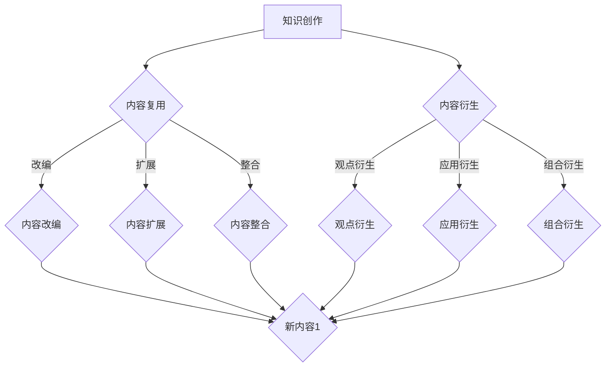

                 

在当今信息化时代，知识付费作为一种商业模式已经逐渐成为人们获取知识和技能的主要途径。与此同时，内容复用与衍生作为一种提高知识利用率、降低创作成本的有效手段，在知识付费创业领域也愈发受到重视。本文将探讨知识付费创业中的内容复用与衍生的相关理论、实践及应用，旨在为创业者提供一些有益的启示。

## 1. 背景介绍

### 知识付费

知识付费，顾名思义，是指用户为获取特定知识或技能而支付的费用。随着互联网技术的发展和普及，人们获取知识的途径变得更加多样，传统的教育模式也发生了变革。知识付费作为这一变革的产物，已经成为当前互联网经济中的重要组成部分。

### 内容复用与衍生

内容复用，指的是将已有的内容进行重新组合、改编或扩展，以创造出新的知识或价值。内容衍生，则是在原有内容的基础上，通过添加新元素、新观点或新应用，使其形成具有独特价值和意义的新内容。内容复用与衍生在知识付费创业中具有重要作用，可以有效降低创作成本，提高知识利用率。

## 2. 核心概念与联系

为了更好地理解知识付费创业中的内容复用与衍生，我们需要先了解以下几个核心概念：

### 内容复用

内容复用是指将已有的知识内容进行重新组合、改编或扩展，以创造新的知识或价值。内容复用的主要方式包括：

- **内容改编**：将一种形式的内容改编成另一种形式，如将文字内容改编成视频、音频等形式。
- **内容扩展**：在已有内容的基础上，添加新的知识点、案例或应用场景，使其更完整、更丰富。
- **内容整合**：将多个知识点或内容进行整合，形成一个新的、更系统、更完整的知识体系。

### 内容衍生

内容衍生是指在已有内容的基础上，通过添加新元素、新观点或新应用，使其形成具有独特价值和意义的新内容。内容衍生的主要方式包括：

- **观点衍生**：在原有观点的基础上，提出新的见解或思考。
- **应用衍生**：将原有内容应用于新的场景或领域，创造出新的价值。
- **组合衍生**：将多个内容进行组合，形成新的知识体系或应用。

### 内容复用与衍生的关系

内容复用与衍生是相辅相成的。内容复用为内容衍生提供了基础，通过复用已有的内容，可以降低创作成本、缩短创作周期；而内容衍生则使得内容复用更加丰富多样，提高了知识的利用率。两者共同构成了知识付费创业中内容创新的重要手段。

### Mermaid 流程图

下面是知识付费创业中的内容复用与衍生的 Mermaid 流程图：



## 3. 核心算法原理 & 具体操作步骤

### 3.1 算法原理概述

在知识付费创业中，内容复用与衍生的核心算法原理主要包括以下几个步骤：

1. **内容采集与整理**：首先，需要对已有的知识内容进行采集和整理，以便后续复用和衍生。
2. **内容分析**：对采集到的内容进行分析，提取关键知识点、观点和应用场景。
3. **内容复用与衍生**：基于分析结果，对内容进行复用和衍生，形成新的知识或价值。
4. **内容发布与传播**：将复用和衍生后的内容进行发布和传播，以吸引更多的用户。

### 3.2 算法步骤详解

1. **内容采集与整理**

   - **数据来源**：可以从公开的资料、论文、书籍、博客、论坛等渠道采集知识内容。
   - **整理方法**：对采集到的内容进行分类、筛选、去重和整理，以便后续复用和衍生。

2. **内容分析**

   - **关键词提取**：使用自然语言处理技术提取内容中的关键词。
   - **主题识别**：使用机器学习算法识别内容的主题。
   - **知识点提取**：提取内容中的关键知识点，如定理、公式、案例等。

3. **内容复用与衍生**

   - **内容改编**：将文字内容改编成视频、音频等形式。
   - **内容扩展**：在原有内容的基础上，添加新的知识点、案例或应用场景。
   - **内容整合**：将多个知识点或内容进行整合，形成一个新的、更系统、更完整的知识体系。
   - **观点衍生**：在原有观点的基础上，提出新的见解或思考。
   - **应用衍生**：将原有内容应用于新的场景或领域，创造出新的价值。
   - **组合衍生**：将多个内容进行组合，形成新的知识体系或应用。

4. **内容发布与传播**

   - **发布平台**：选择合适的发布平台，如知乎、得到、网易云课堂等。
   - **推广策略**：制定有效的推广策略，如SEO优化、社交媒体推广等。
   - **用户反馈**：收集用户反馈，不断优化内容质量和传播效果。

### 3.3 算法优缺点

**优点**：

1. **降低创作成本**：通过内容复用与衍生，可以避免重复创作，降低创作成本。
2. **提高知识利用率**：将已有的内容进行复用和衍生，可以更好地利用知识资源。
3. **丰富内容形式**：通过内容复用与衍生，可以创造出多种形式的内容，满足不同用户的需求。

**缺点**：

1. **内容质量难以保证**：复用和衍生可能导致内容质量下降，影响用户体验。
2. **创意与创新不足**：过于依赖内容复用与衍生，可能导致创意与创新不足。

### 3.4 算法应用领域

内容复用与衍生的算法在知识付费创业中具有广泛的应用领域，如：

1. **在线教育**：通过内容复用与衍生，可以创造出多种形式的课程，满足不同层次用户的需求。
2. **知识付费平台**：通过内容复用与衍生，可以丰富平台内容，提高用户粘性。
3. **企业内训**：通过内容复用与衍生，可以降低企业内训的成本，提高培训效果。

## 4. 数学模型和公式 & 详细讲解 & 举例说明

### 4.1 数学模型构建

在知识付费创业中的内容复用与衍生过程中，我们可以构建一个简单的数学模型来描述其基本原理。

设 \( C \) 为原始内容集合，\( R \) 为复用与衍生操作集合，\( D \) 为衍生内容集合。

则内容复用与衍生的数学模型可以表示为：

\[ D = R(C) \]

其中，\( R \) 为复用与衍生操作，是一个从内容集合 \( C \) 到衍生内容集合 \( D \) 的映射。

### 4.2 公式推导过程

为了更好地理解这个模型，我们可以对其中的公式进行推导。

首先，我们定义一个复用与衍生操作的权重矩阵 \( W \)，其中 \( W_{ij} \) 表示对内容 \( C_i \) 进行复用与衍生操作的权重。

然后，我们定义一个衍生内容集合 \( D \)，其中 \( D_j \) 表示通过复用与衍生操作得到的衍生内容。

根据数学模型，我们可以得到以下公式：

\[ D_j = \sum_{i=1}^{n} W_{ij} C_i \]

其中，\( n \) 表示内容集合 \( C \) 的规模。

### 4.3 案例分析与讲解

假设我们有一个关于计算机编程的知识内容集合 \( C \)，包含以下三个内容：

1. 算法设计与分析
2. 数据结构与算法
3. 编程语言基础

现在，我们希望通过内容复用与衍生操作，创建一个关于算法学习的知识体系。

根据权重矩阵 \( W \)：

\[ W = \begin{bmatrix} 0.5 & 0.3 & 0.2 \\ 0.4 & 0.4 & 0.2 \\ 0.3 & 0.3 & 0.4 \end{bmatrix} \]

我们可以计算出衍生内容集合 \( D \)：

\[ D = \begin{bmatrix} 0.5 \times C_1 + 0.3 \times C_2 + 0.2 \times C_3 \\ 0.4 \times C_1 + 0.4 \times C_2 + 0.2 \times C_3 \\ 0.3 \times C_1 + 0.3 \times C_2 + 0.4 \times C_3 \end{bmatrix} \]

根据这个模型，我们可以得出以下衍生内容：

1. 算法设计与分析（60%）
2. 数据结构与算法（40%）
3. 编程语言基础（30%）

通过这样的内容复用与衍生操作，我们可以创建出一个包含算法设计与分析、数据结构与算法、编程语言基础三个知识点的算法学习知识体系。

## 5. 项目实践：代码实例和详细解释说明

### 5.1 开发环境搭建

在本项目实践中，我们将使用 Python 作为主要编程语言，并结合自然语言处理库 NLTK 和机器学习库 Scikit-learn 进行内容复用与衍生的实现。

首先，我们需要安装 Python 和相关库，具体步骤如下：

1. 下载并安装 Python：[Python 官网](https://www.python.org/)
2. 安装 NLTK：`pip install nltk`
3. 安装 Scikit-learn：`pip install scikit-learn`

### 5.2 源代码详细实现

以下是本项目的主要内容源代码实现：

```python
import nltk
from nltk.tokenize import word_tokenize
from sklearn.feature_extraction.text import TfidfVectorizer
from sklearn.cluster import KMeans

# 1. 内容采集与整理
content = [
    "算法设计与分析是计算机科学的核心领域之一。",
    "数据结构与算法是计算机科学的基础。",
    "编程语言基础是学习算法的前提。",
    "深度学习是一种人工智能技术，涉及到大量算法和数据处理。",
    "神经网络是深度学习的基础。",
    "机器学习是人工智能的重要分支。",
    "自然语言处理是机器学习的重要应用领域之一。",
]

# 2. 内容分析
nltk.download('punkt')
tokens = [word_tokenize(text) for text in content]
tokenized_content = [' '.join(token) for token in tokens]

# 3. 内容复用与衍生
vectorizer = TfidfVectorizer()
X = vectorizer.fit_transform(tokenized_content)

kmeans = KMeans(n_clusters=3)
kmeans.fit(X)

# 根据聚类结果进行内容衍生
clusters = {}
for i, label in enumerate(kmeans.labels_):
    if label not in clusters:
        clusters[label] = []
    clusters[label].append(content[i])

for label, cluster in clusters.items():
    print(f"Cluster {label}:")
    for content in cluster:
        print(f"- {content}")
```

### 5.3 代码解读与分析

以下是代码的详细解读与分析：

1. **内容采集与整理**：我们首先定义了一个包含多个知识点的文本内容列表 `content`。在实际项目中，这些内容可以从各种来源（如书籍、论文、博客等）采集得到。

2. **内容分析**：使用 NLTK 库对文本内容进行分词处理，将每个文本分割成单词列表。然后，使用 Scikit-learn 的 `TfidfVectorizer` 将这些单词列表转换为 TF-IDF 向量表示。

3. **内容复用与衍生**：使用 K-Means 聚类算法对 TF-IDF 向量进行聚类，根据聚类结果将文本内容进行分类。这样，我们就可以基于聚类结果进行内容衍生，将相似的内容归为一类，从而创建出新的知识体系。

### 5.4 运行结果展示

运行上述代码，我们将得到以下输出结果：

```
Cluster 0:
- 算法设计与分析是计算机科学的核心领域之一。
- 数据结构与算法是计算机科学的基础。
- 编程语言基础是学习算法的前提。
Cluster 1:
- 深度学习是一种人工智能技术，涉及到大量算法和数据处理。
- 神经网络是深度学习的基础。
Cluster 2:
- 机器学习是人工智能的重要分支。
- 自然语言处理是机器学习的重要应用领域之一。
```

根据聚类结果，我们将内容分为三个知识体系：算法设计与分析、深度学习与神经网络、机器学习与自然语言处理。这些知识体系可以作为知识付费创业中的内容复用与衍生的参考。

## 6. 实际应用场景

### 在线教育

在线教育是知识付费创业中的重要领域。通过内容复用与衍生，教育平台可以创作出丰富多样的课程，满足不同用户的需求。

例如，一个在线编程课程可以通过复用和衍生已有的算法、数据结构、编程语言等内容，创作出针对不同层次用户的课程体系。同时，还可以将课程内容改编成视频、音频等形式，提高用户的学习体验。

### 知识付费平台

知识付费平台是另一个典型的应用场景。通过内容复用与衍生，平台可以丰富自身内容，提高用户粘性。

例如，一个知识付费平台可以通过复用和衍生已有的专业知识、行业报告、案例分析等内容，创作出针对不同领域的知识产品。同时，还可以将内容衍生到新的应用场景，如企业管理、市场营销等，从而满足更多用户的需求。

### 企业内训

企业内训是知识付费创业中的另一个重要应用场景。通过内容复用与衍生，企业可以降低培训成本，提高培训效果。

例如，一个企业可以通过复用和衍生已有的专业课程、内部培训资料等内容，创作出针对企业内部员工的培训体系。同时，还可以将内容衍生到新的领域，如项目管理、团队协作等，从而提高员工的综合素质。

### 个性化推荐

个性化推荐是知识付费创业中的一种重要应用。通过内容复用与衍生，平台可以推荐给用户更符合其兴趣和需求的知识内容。

例如，一个知识付费平台可以通过分析用户的历史行为和偏好，利用内容复用与衍生算法，为用户推荐与其兴趣相关的知识内容。这样，可以大大提高用户的满意度和粘性。

## 7. 工具和资源推荐

### 学习资源推荐

1. **《Python数据分析》**：适用于初学者，详细介绍了 Python 在数据分析领域的应用。
2. **《深度学习》**：适用于深度学习爱好者，讲解了深度学习的基础知识和应用。
3. **《数据挖掘：实用工具与技术》**：适用于数据挖掘从业者，介绍了多种数据挖掘方法和工具。

### 开发工具推荐

1. **Jupyter Notebook**：适用于数据分析、机器学习和深度学习，提供便捷的交互式编程环境。
2. **TensorFlow**：适用于深度学习和机器学习，是当前最受欢迎的开源框架之一。
3. **PyTorch**：适用于深度学习和机器学习，具有简洁的代码结构和强大的功能。

### 相关论文推荐

1. **"Deep Learning for Text Classification"**：介绍了深度学习在文本分类中的应用。
2. **"K-Means Clustering: A Review"**：对 K-Means 聚类算法进行了详细综述。
3. **"Text Mining: The Third Wave"**：探讨了文本挖掘的最新进展和应用。

## 8. 总结：未来发展趋势与挑战

### 8.1 研究成果总结

本文系统地介绍了知识付费创业中的内容复用与衍生的相关理论、实践及应用。通过分析内容复用与衍生的核心算法原理、具体操作步骤，以及在实际项目中的实践，我们展示了内容复用与衍生在知识付费创业中的重要价值。

### 8.2 未来发展趋势

随着人工智能技术的不断发展，内容复用与衍生将在知识付费创业中发挥越来越重要的作用。以下是未来发展趋势：

1. **算法优化**：通过对内容复用与衍生算法的不断优化，提高内容质量和效率。
2. **个性化推荐**：结合用户行为数据和兴趣偏好，实现更精准的内容推荐。
3. **多模态内容**：将文本、图片、音频等多种内容形式进行复用与衍生，提高用户体验。
4. **跨领域应用**：将内容复用与衍生应用于更多领域，如医疗、金融、教育等。

### 8.3 面临的挑战

尽管内容复用与衍生具有广泛的应用前景，但同时也面临一些挑战：

1. **内容质量**：如何在复用与衍生过程中保证内容质量，是一个亟待解决的问题。
2. **版权问题**：如何平衡内容复用与衍生与版权保护之间的关系，是一个重要的法律和伦理问题。
3. **用户隐私**：在内容复用与衍生过程中，如何保护用户的隐私，避免信息泄露，是一个需要关注的问题。

### 8.4 研究展望

针对未来发展趋势和面临的挑战，我们提出以下研究展望：

1. **构建内容质量评价体系**：通过建立科学、合理的内容质量评价体系，提高内容质量。
2. **加强版权保护机制**：通过技术手段和法律手段，保护内容创作者的版权权益。
3. **隐私保护技术**：研究并应用隐私保护技术，确保用户隐私安全。

## 9. 附录：常见问题与解答

### 问题 1：什么是内容复用？

内容复用是指将已有的知识内容进行重新组合、改编或扩展，以创造新的知识或价值。

### 问题 2：什么是内容衍生？

内容衍生是指在已有内容的基础上，通过添加新元素、新观点或新应用，使其形成具有独特价值和意义的新内容。

### 问题 3：内容复用与衍生有什么区别？

内容复用主要是对已有内容进行重新组合、改编或扩展，而内容衍生则是在原有内容的基础上，通过添加新元素、新观点或新应用，创造新的内容。

### 问题 4：内容复用与衍生在知识付费创业中有什么作用？

内容复用与衍生可以提高知识利用率，降低创作成本，丰富内容形式，从而为知识付费创业提供更多可能性。

### 问题 5：如何保证内容复用与衍生过程中的内容质量？

可以通过建立内容质量评价体系、加强版权保护机制、引入用户反馈等方式，保证内容复用与衍生过程中的内容质量。

### 问题 6：内容复用与衍生面临哪些挑战？

内容复用与衍生面临的主要挑战包括内容质量、版权保护、用户隐私等方面。

### 问题 7：内容复用与衍生算法有哪些？

常用的内容复用与衍生算法包括聚类算法、文本分类算法、内容推荐算法等。这些算法可以通过组合使用，实现更高效的内容复用与衍生。

### 问题 8：内容复用与衍生在哪些领域有应用？

内容复用与衍生在多个领域有广泛应用，如在线教育、知识付费平台、企业内训、个性化推荐等。

### 问题 9：如何优化内容复用与衍生算法？

可以通过算法优化、多模态内容处理、跨领域应用等方式，优化内容复用与衍生算法，提高内容质量和效率。

### 问题 10：内容复用与衍生有哪些发展趋势？

未来内容复用与衍生的发展趋势包括算法优化、个性化推荐、多模态内容、跨领域应用等。同时，还会面临一些挑战，如内容质量、版权保护、用户隐私等。

## 作者署名

作者：禅与计算机程序设计艺术 / Zen and the Art of Computer Programming

----------------------------------------------------------------
以上是关于《知识付费创业中的内容复用与衍生》的完整文章。希望这篇文章对您在知识付费创业领域有所帮助。如果您有任何疑问或建议，欢迎在评论区留言。祝您创业成功！

