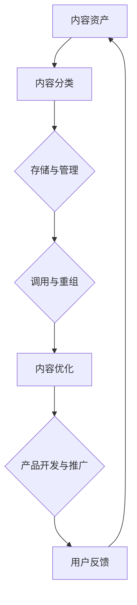

                 

 在当今数字化时代，知识付费已成为一种新兴的商业模式，它为创业者提供了丰富的机会。然而，如何有效地管理和复用内容，以最大化商业价值，成为了许多知识付费创业者面临的挑战。本文将深入探讨知识付费创业中的内容复用技巧，帮助创业者提高效率、降低成本，并实现内容的持续创新。

> **关键词：** 知识付费、内容复用、商业模式、效率、成本、创新

> **摘要：** 本文首先介绍了知识付费的背景和发展趋势，随后探讨了内容复用的核心概念和重要性。接着，文章分析了内容复用的主要方法和技术，并通过具体实例展示了其在知识付费创业中的应用。最后，文章提出了未来知识付费创业中内容复用的发展趋势和面临的挑战。

## 1. 背景介绍

### 1.1 知识付费的概念与现状

知识付费，指的是消费者为获取专业知识和经验而支付的费用。这一模式在互联网时代迅速崛起，主要是因为以下几个方面：

- **信息爆炸：** 互联网的普及使得知识获取变得更加容易，但也导致了信息过载。用户愿意为高质量、针对性的内容付费，以便筛选出有价值的信息。
- **专业服务需求：** 随着社会分工的细化，人们对专业服务的需求日益增长。知识付费平台提供了专业的课程、教程、咨询服务等，满足了用户的需求。
- **移动支付普及：** 移动支付技术的成熟，为知识付费提供了便捷的支付手段，降低了交易成本。

目前，知识付费已成为互联网经济的重要一环，众多创业者纷纷涌入这一市场，包括在线教育平台、专业咨询公司、知识分享平台等。

### 1.2 内容复用的概念

内容复用是指在知识付费产品开发、推广、运营等过程中，对已有内容进行重新组合、改编或优化，以创造出新的产品或服务。内容复用不仅能提高效率，还能降低成本，以下是内容复用的几个关键方面：

- **内容优化：** 对已有内容进行审查和改进，提升其质量和用户体验。
- **内容组合：** 将不同来源或类型的知识内容进行整合，形成新的组合产品。
- **内容改编：** 根据不同用户群体的需求，对内容进行适当的改编和调整。
- **内容扩展：** 在已有内容的基础上，增加新的模块或知识点，以丰富产品内容。

## 2. 核心概念与联系

### 2.1 内容复用的核心概念

内容复用的核心概念包括以下几个方面：

- **内容资产：** 内容资产是指创业者拥有的知识资源，包括文章、视频、音频、课程等。
- **复用策略：** 复用策略是指如何有效地对内容进行分类、存储和检索，以便于快速调用和重组。
- **用户需求：** 用户需求是内容复用的重要驱动力，创业者需要了解用户的具体需求和偏好，以优化内容复用效果。
- **技术手段：** 技术手段是实现内容复用的基础，包括内容管理系统（CMS）、自动化工具、数据分析工具等。

### 2.2 内容复用与知识付费的关系

内容复用与知识付费之间存在密切的联系：

- **提高效率：** 通过内容复用，创业者可以快速开发出新的知识付费产品，节省时间和人力成本。
- **降低成本：** 内容复用减少了重复劳动，降低了内容创作的成本。
- **增强竞争力：** 复用已有优质内容，可以提高知识付费产品的质量和用户体验，增强市场竞争力。
- **持续创新：** 内容复用有助于创业者发现新的市场需求和商业模式，推动持续创新。

### 2.3 内容复用的 Mermaid 流程图

下面是一个简化的内容复用流程图，展示了内容复用的主要步骤和关键节点。



## 3. 核心算法原理 & 具体操作步骤

### 3.1 算法原理概述

内容复用的核心算法原理主要涉及以下几个方面：

- **内容分类与标签：** 通过对内容进行分类和标签化，实现内容的结构化存储和管理。
- **内容检索与匹配：** 基于用户需求和内容标签，快速检索和匹配相关内容。
- **内容重组与优化：** 根据用户反馈和市场需求，对内容进行重组和优化，提高用户体验。
- **自动化工具与数据分析：** 利用自动化工具和数据分析技术，实现内容的自动化处理和优化。

### 3.2 算法步骤详解

以下是内容复用的具体操作步骤：

#### 步骤 1：内容分类与标签

1. **内容分类：** 根据内容的主题、类型、难度等属性，对内容进行分类。
2. **标签化：** 为每条内容添加相应的标签，便于后续检索和匹配。

#### 步骤 2：内容存储与管理

1. **存储：** 将内容存储在内容管理系统（CMS）中，便于统一管理和调用。
2. **管理：** 定期审查和更新内容，确保内容的时效性和准确性。

#### 步骤 3：内容检索与匹配

1. **用户需求分析：** 收集用户需求信息，包括学习目标、兴趣偏好等。
2. **内容匹配：** 根据用户需求和内容标签，快速检索和匹配相关内容。

#### 步骤 4：内容重组与优化

1. **内容重组：** 根据用户需求和内容匹配结果，将相关内容进行重组。
2. **内容优化：** 根据用户反馈和市场变化，对内容进行优化，提高用户体验。

#### 步骤 5：产品开发与推广

1. **产品开发：** 利用重组和优化后的内容，开发新的知识付费产品。
2. **推广：** 通过多种渠道推广产品，提高知名度和用户转化率。

### 3.3 算法优缺点

#### 优点：

- **提高效率：** 内容复用可以大大减少内容创作和修改的工作量，提高开发效率。
- **降低成本：** 通过复用已有内容，减少了重复劳动，降低了内容创作成本。
- **增强灵活性：** 内容复用使得创业者可以根据市场需求快速调整产品内容，增强灵活性。
- **提高用户体验：** 复用优质内容，可以提高知识付费产品的质量和用户体验。

#### 缺点：

- **内容质量风险：** 复用过程中，如果内容质量不高或与用户需求不符，可能导致用户体验下降。
- **创新不足：** 过度依赖内容复用，可能导致创新不足，影响长期竞争力。

### 3.4 算法应用领域

内容复用算法广泛应用于知识付费的各个领域，包括：

- **在线教育：** 教学内容的重组和优化，提高教学效果。
- **专业咨询：** 咨询报告的复用，提高咨询效率。
- **知识分享：** 博客文章、视频教程的重组和推广，扩大影响力。

## 4. 数学模型和公式 & 详细讲解 & 举例说明

### 4.1 数学模型构建

内容复用的数学模型可以基于以下公式构建：

\[ R = f(P, D, U) \]

其中，\( R \) 表示内容复用效果，\( P \) 表示内容质量，\( D \) 表示内容多样性，\( U \) 表示用户需求。

### 4.2 公式推导过程

#### 步骤 1：定义变量

- \( P \)：内容质量，衡量内容的准确性、权威性和实用性。
- \( D \)：内容多样性，衡量内容的丰富性和多样性。
- \( U \)：用户需求，衡量用户对内容的兴趣和需求。

#### 步骤 2：构建函数关系

- \( f \)：函数关系，表示内容复用效果与内容质量、多样性、用户需求之间的关系。

#### 步骤 3：函数具体形式

根据内容复用的实际情况，可以设定以下函数形式：

\[ R = P \times D \times U \]

### 4.3 案例分析与讲解

#### 案例一：在线教育平台

假设一个在线教育平台，其内容质量 \( P \) 为 0.8，内容多样性 \( D \) 为 0.7，用户需求 \( U \) 为 0.9，根据上述公式计算内容复用效果：

\[ R = 0.8 \times 0.7 \times 0.9 = 0.504 \]

#### 案例二：专业咨询公司

假设一个专业咨询公司，其内容质量 \( P \) 为 0.9，内容多样性 \( D \) 为 0.6，用户需求 \( U \) 为 0.8，根据上述公式计算内容复用效果：

\[ R = 0.9 \times 0.6 \times 0.8 = 0.432 \]

通过这两个案例可以看出，内容质量、多样性和用户需求是影响内容复用效果的重要因素。

## 5. 项目实践：代码实例和详细解释说明

### 5.1 开发环境搭建

为了实现内容复用，我们需要搭建一个内容管理系统（CMS），并集成自动化工具和数据分析平台。以下是开发环境的搭建步骤：

1. **选择 CMS：** 选择一款适合的内容管理系统，如 WordPress、Joomla 或 Drupal。
2. **安装 CMS：** 按照官方文档安装 CMS，并配置数据库和服务器。
3. **集成自动化工具：** 选择合适的自动化工具，如 Jenkins、Travis CI，配置自动化流程。
4. **集成数据分析平台：** 选择合适的数据分析平台，如 Google Analytics、Kibana，配置数据收集和分析流程。

### 5.2 源代码详细实现

以下是使用 Python 实现的内容复用系统的一部分源代码：

```python
# 导入必要的库
import os
import json
import re

# 内容分类函数
def classify_content(content_path):
    with open(content_path, 'r', encoding='utf-8') as f:
        content = f.read()
        # 根据内容主题进行分类
        if "编程" in content:
            return "编程"
        elif "经济" in content:
            return "经济"
        else:
            return "其他"

# 内容标签化函数
def tag_content(content_path):
    category = classify_content(content_path)
    # 为内容添加标签
    tags = [category]
    with open(content_path, 'r', encoding='utf-8') as f:
        content = f.read()
        # 提取关键词作为标签
        keywords = re.findall(r'\b\w+\b', content)
        tags.extend(keywords)
    return tags

# 内容存储函数
def store_content(content_path, content_tags):
    with open(f"{content_path}.json", 'w', encoding='utf-8') as f:
        json.dump({'content_path': content_path, 'tags': content_tags}, f)

# 主函数
def main():
    content_path = input("请输入内容路径：")
    content_tags = tag_content(content_path)
    store_content(content_path, content_tags)

# 运行主函数
if __name__ == "__main__":
    main()
```

### 5.3 代码解读与分析

上述代码实现了内容分类、标签化和存储的功能：

- **内容分类函数：** 根据内容主题对内容进行分类，返回分类结果。
- **内容标签化函数：** 对内容进行分类后，提取关键词作为标签，并将标签与分类结果一起存储。
- **内容存储函数：** 将内容和标签存储为 JSON 格式的文件。

通过这些函数，我们可以实现对内容的高效管理和快速调用，从而提高内容复用的效率。

### 5.4 运行结果展示

假设我们有一个名为 "Python 编程入门" 的文档，内容如下：

```
Python 是一种广泛应用于数据科学、人工智能和 Web 开发的编程语言。学习 Python 需要从基础语法和数据结构开始。
```

运行代码后，我们将得到以下结果：

- **分类结果：** 编程
- **标签列表：** ["编程", "Python", "数据科学", "人工智能", "Web 开发"]

这些结果将被存储为 JSON 文件，便于后续检索和使用。

## 6. 实际应用场景

### 6.1 在线教育平台

在线教育平台可以利用内容复用技术，提高课程开发和更新的效率。例如，一个编程课程可以基于已有的编程基础知识进行扩展和改编，以满足不同层次用户的需求。通过内容复用，平台可以快速推出新课程，提高市场竞争力。

### 6.2 专业咨询公司

专业咨询公司可以通过内容复用，提高咨询报告的生成效率。例如，一个关于市场分析的咨询报告可以基于已有的市场分析模板进行改编和更新，以满足不同客户的需求。通过内容复用，公司可以节省时间和人力成本，提高咨询效率。

### 6.3 知识分享平台

知识分享平台可以利用内容复用，提高知识文章的传播效果。例如，一篇关于编程技巧的文章可以改编为视频教程、PPT 讲义和在线课程，以满足不同用户的学习需求。通过内容复用，平台可以扩大知识传播范围，提高用户参与度。

### 6.4 未来应用展望

随着人工智能和大数据技术的发展，内容复用技术将得到进一步优化和拓展。未来，内容复用可能实现以下趋势：

- **自动化程度更高：** 通过人工智能技术，实现内容的自动分类、标签化和存储，提高内容复用效率。
- **个性化推荐：** 利用数据分析技术，为用户提供个性化的内容推荐，提高内容复用的精准度。
- **跨平台复用：** 支持跨平台的内容复用，实现内容在不同平台之间的无缝迁移和共享。

## 7. 工具和资源推荐

### 7.1 学习资源推荐

- **在线课程：** Coursera、edX、Udemy 提供丰富的编程、数据分析、人工智能等在线课程。
- **技术博客：** Medium、Hackernoon、Dev.to 等平台上有许多高质量的编程和技术博客。
- **专业书籍：** 《深度学习》、《Python 编程：从入门到实践》、《人工智能：一种现代的方法》等书籍。

### 7.2 开发工具推荐

- **内容管理系统：** WordPress、Joomla、Drupal 等。
- **自动化工具：** Jenkins、Travis CI、Circle CI 等。
- **数据分析工具：** Google Analytics、Kibana、Tableau 等。

### 7.3 相关论文推荐

- **内容复用研究：** "Content Repurposing: Strategies and Techniques for Effective Knowledge Sharing"。
- **知识付费研究：** "The Business Model of Knowledge Payment in the Digital Age"。
- **人工智能与大数据：** "Deep Learning for Knowledge Representation and Reasoning"。

## 8. 总结：未来发展趋势与挑战

### 8.1 研究成果总结

本文从知识付费的背景和内容复用的核心概念出发，探讨了内容复用在知识付费创业中的应用和重要性。通过数学模型和具体案例，分析了内容复用的方法和效果，并提出了未来发展的趋势和挑战。

### 8.2 未来发展趋势

- **自动化与智能化：** 人工智能和大数据技术的发展，将使内容复用更加自动化和智能化。
- **个性化推荐：** 通过数据分析，实现个性化的内容推荐，提高用户体验。
- **跨平台共享：** 内容复用将跨越不同平台，实现更广泛的知识共享。

### 8.3 面临的挑战

- **内容质量风险：** 过度依赖内容复用可能导致内容质量下降，影响用户体验。
- **创新不足：** 过度依赖内容复用可能抑制创新，影响长期竞争力。

### 8.4 研究展望

未来，内容复用技术将在知识付费、在线教育、专业咨询等领域得到广泛应用。通过不断优化和拓展，内容复用有望实现更高的效率和更广泛的应用。

## 9. 附录：常见问题与解答

### 9.1 内容复用与版权问题

**问：** 如何确保内容复用不侵犯版权？

**答：** 内容复用时要确保内容来源的合法性和版权归属。在使用他人作品时，应获得授权或使用开源内容。此外，可以采用加密技术保护内容，防止未经授权的复制和传播。

### 9.2 内容复用与用户体验

**问：** 内容复用如何保证用户体验？

**答：** 内容复用时，要充分考虑用户需求和偏好，对内容进行适当的改编和优化。同时，利用数据分析技术，对用户反馈进行实时监控和调整，以提高用户体验。

### 9.3 内容复用与商业策略

**问：** 内容复用如何与商业策略相结合？

**答：** 内容复用可以与商业策略相结合，通过提高内容开发效率、降低成本，实现商业价值的最大化。同时，可以探索新的商业模式，如订阅制、按需定制等，以适应市场需求。

----------------------------------------------------------------

### 结束语

本文从多个角度探讨了知识付费创业中的内容复用技巧，分析了其核心概念、算法原理、应用实践和未来发展趋势。希望本文能为您在知识付费创业中的内容管理和创新提供有益的启示。作者：禅与计算机程序设计艺术 / Zen and the Art of Computer Programming。感谢您的阅读！

