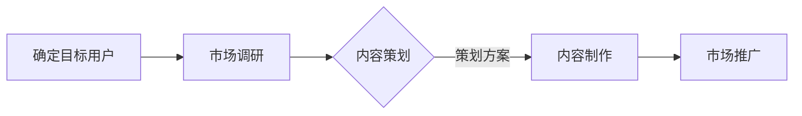

                 

关键词：知识付费、内容定位、创业策略、用户需求、市场分析

摘要：本文将探讨知识付费创业中的内容定位策略。通过分析用户需求和市场现状，结合具体案例分析，探讨如何有效地定位内容、打造优质知识产品，从而在竞争激烈的市场中脱颖而出，实现创业目标。

## 1. 背景介绍

随着互联网的普及和知识经济的兴起，知识付费已成为一种重要的商业模式。知识付费平台如雨后春笋般涌现，为用户提供各种领域的专业知识和技能。然而，市场需求的多样性和竞争的激烈程度也使得创业者面临着诸多挑战。如何在众多竞品中脱颖而出，找到合适的内容定位，是每个知识付费创业项目成功的关键。

本文旨在通过对知识付费市场的分析，探讨内容定位的策略，帮助创业者更好地把握市场机遇，打造有竞争力的知识产品。

### 知识付费的定义和兴起

知识付费是指用户为获取专业知识、技能和经验而支付的费用。它不同于传统的免费知识分享，强调知识的专业性和实用性。知识付费的兴起源于以下几个方面：

1. **用户需求**：随着社会的发展，人们对于自我提升和职业发展的需求日益增长，愿意为高质量的知识和技能付费。
2. **技术进步**：互联网技术的飞速发展为知识付费提供了便捷的传播和获取渠道，如在线课程、电子书、付费专栏等。
3. **商业模式创新**：知识付费作为一种新的商业模式，为创业者提供了丰富的市场空间和盈利机会。

### 知识付费市场的现状

目前，知识付费市场呈现出以下特点：

1. **市场规模**：根据统计，知识付费市场规模逐年扩大，预计未来还将保持高速增长。
2. **用户群体**：知识付费用户主要集中在年轻一代，他们有较强的消费能力和学习需求。
3. **内容形式**：知识付费内容形式多样，包括课程、文章、直播、问答等，满足了不同用户的学习习惯和需求。
4. **市场竞争**：由于市场潜力巨大，各类平台和创业者纷纷进入，竞争日益激烈。

### 创业者在知识付费市场的机遇与挑战

机遇：

1. **广阔的市场空间**：知识付费市场仍在快速发展，提供了丰富的创业机会。
2. **用户需求的多样化**：用户需求的多样化使得创业者可以针对特定细分市场进行精准定位，打造有特色的知识产品。
3. **技术创新**：随着人工智能、大数据等技术的应用，知识付费平台可以提供更个性化的服务，提高用户体验。

挑战：

1. **市场竞争激烈**：众多平台和创业者竞争激烈，如何脱颖而出是关键。
2. **内容质量要求高**：用户对知识内容的质量要求越来越高，创业者在内容创作和产品服务上需要下足功夫。
3. **用户信任问题**：在信息爆炸的时代，用户对知识内容的真实性和可靠性有更高的期待。

## 2. 核心概念与联系

### 内容定位策略的概念

内容定位策略是指创业者根据市场需求、用户特点和自身优势，选择和打造具有差异化、专业性和实用性的知识内容，以满足特定用户群体的需求。

### 内容定位策略的重要性

1. **明确市场定位**：通过内容定位，创业者可以明确自己的市场地位和目标用户群体，避免盲目跟风和资源浪费。
2. **提高竞争力**：差异化、专业化的内容可以吸引用户，提高平台的竞争力。
3. **提升用户满意度**：精准的内容定位可以满足用户需求，提高用户满意度和忠诚度。

### 内容定位策略的基本原则

1. **用户需求导向**：以用户需求为中心，深入了解用户痛点和需求，打造用户真正需要的知识产品。
2. **市场调研**：通过市场调研，了解竞争对手和市场需求，找到切入点。
3. **专业性和实用性**：内容要具备专业性和实用性，提供有价值的知识和技能。
4. **差异化**：在内容和形式上要有差异化，避免同质化竞争。

### 内容定位策略的流程

1. **确定目标用户**：明确目标用户群体，包括用户特征、需求和痛点。
2. **市场调研**：通过市场调研，了解竞争对手、市场需求和趋势。
3. **内容策划**：根据用户需求和市场调研结果，策划有特色、专业和实用性的知识内容。
4. **内容制作**：组织专业团队，根据策划方案制作高质量的知识内容。
5. **市场推广**：通过多种渠道推广知识产品，提高品牌知名度和用户转化率。

### 内容定位策略的 Mermaid 流程图



## 3. 核心算法原理 & 具体操作步骤

### 3.1 算法原理概述

内容定位策略的核心算法原理是基于大数据分析和用户行为分析，通过以下几个步骤实现：

1. **用户画像**：根据用户的基本信息和行为数据，构建用户画像，了解用户特征和需求。
2. **需求分析**：通过用户画像和市场调研，分析目标用户的需求和痛点。
3. **内容策划**：根据用户需求和市场调研结果，策划有特色、专业和实用性的知识内容。
4. **内容制作**：组织专业团队，根据策划方案制作高质量的知识内容。
5. **效果评估**：通过用户反馈和数据分析，评估内容质量和用户满意度，不断优化内容策略。

### 3.2 算法步骤详解

#### 步骤1：用户画像构建

用户画像构建是内容定位策略的基础，主要包括以下内容：

1. **基本特征**：用户的年龄、性别、职业、教育背景等基本信息。
2. **行为数据**：用户在平台上的行为数据，如浏览记录、购买记录、互动行为等。
3. **兴趣偏好**：用户对各类知识内容的兴趣和偏好。

#### 步骤2：需求分析

需求分析是内容策划的关键，主要包括以下步骤：

1. **用户调研**：通过问卷调查、访谈等方式，了解用户对知识内容的需求和期望。
2. **市场调研**：分析竞争对手的产品和内容，了解市场需求和趋势。
3. **数据分析**：通过用户画像和行为数据，分析用户需求和痛点。

#### 步骤3：内容策划

内容策划是根据用户需求和市场调研结果，制定内容策略的过程，主要包括以下内容：

1. **内容主题**：根据用户需求和市场需求，确定内容主题和方向。
2. **内容形式**：选择适合内容主题的形式，如课程、文章、直播等。
3. **内容大纲**：制定详细的内容大纲，明确每个部分的内容要点。

#### 步骤4：内容制作

内容制作是根据策划方案，组织专业团队进行知识内容创作的过程，主要包括以下内容：

1. **课程设计**：针对课程内容，设计教学大纲、课程结构、互动环节等。
2. **文章撰写**：根据文章大纲，撰写高质量的文章内容。
3. **直播录制**：根据直播大纲，进行直播内容的录制和后期制作。

#### 步骤5：效果评估

效果评估是通过用户反馈和数据分析，评估内容质量和用户满意度，主要包括以下内容：

1. **用户反馈**：收集用户对知识内容的评价和反馈，了解用户满意度。
2. **数据分析**：通过数据分析，了解用户的行为数据，评估内容的效果。
3. **持续优化**：根据用户反馈和数据分析结果，不断优化内容策略和制作过程。

### 3.3 算法优缺点

#### 优点

1. **精准定位**：通过大数据分析和用户画像，可以精准定位目标用户，提高内容匹配度。
2. **个性化推荐**：基于用户需求和兴趣偏好，进行个性化内容推荐，提高用户体验。
3. **持续优化**：通过效果评估和用户反馈，可以不断优化内容策略和制作过程，提高内容质量。

#### 缺点

1. **数据依赖**：算法效果依赖于用户数据的质量和数量，数据不足或质量不高会影响效果。
2. **高成本**：构建用户画像、进行需求分析和内容策划等过程需要投入大量人力和物力资源。
3. **用户隐私**：用户数据的使用需要遵守相关法律法规，保护用户隐私。

### 3.4 算法应用领域

内容定位策略在大数据分析和用户行为分析的基础上，可以广泛应用于知识付费、电商推荐、社交媒体等场景，其主要应用领域包括：

1. **知识付费**：通过内容定位策略，为用户提供个性化、专业和实用的知识内容，提高用户满意度和忠诚度。
2. **电商推荐**：通过分析用户行为和需求，推荐用户可能感兴趣的商品和服务，提高销售额和用户粘性。
3. **社交媒体**：根据用户兴趣和需求，推荐相关内容，吸引用户参与和互动，提高平台活跃度。

## 4. 数学模型和公式 & 详细讲解 & 举例说明

### 4.1 数学模型构建

内容定位策略中的数学模型主要包括用户画像模型和需求分析模型，以下分别介绍这两个模型的基本概念和构建方法。

#### 用户画像模型

用户画像模型是描述用户特征和需求的数学模型，通常包括以下几个要素：

1. **基本特征**：用户的年龄、性别、职业、教育背景等。
2. **行为数据**：用户在平台上的行为数据，如浏览记录、购买记录、互动行为等。
3. **兴趣偏好**：用户对各类知识内容的兴趣和偏好。

用户画像模型可以用以下公式表示：

\[ \text{User Profile} = \{ \text{Basic Attributes}, \text{Behavioral Data}, \text{Interest Preferences} \} \]

#### 需求分析模型

需求分析模型是分析用户需求和痛点的数学模型，通常包括以下几个要素：

1. **用户需求**：用户对知识内容的需求和期望。
2. **市场调研**：市场调研结果，如竞争对手分析、市场需求分析等。
3. **用户行为**：用户在平台上的行为数据，如浏览记录、购买记录、互动行为等。

需求分析模型可以用以下公式表示：

\[ \text{Demand Analysis} = \{ \text{User Needs}, \text{Market Research}, \text{User Behavior} \} \]

### 4.2 公式推导过程

#### 用户画像模型推导

用户画像模型的构建通常基于以下步骤：

1. **数据收集**：收集用户的基本特征、行为数据和兴趣偏好数据。
2. **数据清洗**：对收集到的数据进行清洗和预处理，去除无效数据和异常值。
3. **特征提取**：根据用户画像的要素，提取关键特征，如用户的年龄、性别、职业、教育背景等。
4. **模型构建**：使用机器学习算法，如聚类分析、关联规则挖掘等，构建用户画像模型。

具体推导过程如下：

\[ \text{User Profile} = \text{Basic Attributes} \cup \text{Behavioral Data} \cup \text{Interest Preferences} \]

其中，\( \cup \) 表示集合的并集操作。

#### 需求分析模型推导

需求分析模型的构建通常基于以下步骤：

1. **用户调研**：通过问卷调查、访谈等方式，收集用户对知识内容的需求和期望。
2. **市场调研**：分析竞争对手的产品和内容，了解市场需求和趋势。
3. **行为数据分析**：分析用户在平台上的行为数据，如浏览记录、购买记录、互动行为等。
4. **模型构建**：使用数据分析方法，如回归分析、关联规则挖掘等，构建需求分析模型。

具体推导过程如下：

\[ \text{Demand Analysis} = \text{User Needs} \cup \text{Market Research} \cup \text{User Behavior} \]

其中，\( \cup \) 表示集合的并集操作。

### 4.3 案例分析与讲解

#### 案例背景

某知识付费平台，致力于为职场人士提供职场技能和职业发展的知识内容。平台希望通过内容定位策略，提高用户满意度和转化率。

#### 案例分析

1. **用户画像构建**：

   - 基本特征：用户年龄主要集中在25-45岁，男女比例较为均衡，职业多为企业职员、管理层和自由职业者。
   - 行为数据：用户在平台上的主要行为是浏览课程、购买课程和参与互动。
   - 兴趣偏好：用户对职场技能、职业发展和时间管理等内容有较高的兴趣。

   用户画像模型可以表示为：

   \[ \text{User Profile} = \{ \text{Age: 25-45}, \text{Gender: Balanced}, \text{Occupation: Enterprise Employee, Management, Freelancer}, \text{Behavioral Data: Browsing, Purchase, Interaction}, \text{Interest Preferences: Work Skills, Career Development, Time Management} \} \]

2. **需求分析**：

   - 用户需求：用户希望通过学习平台上的课程，提升职场技能、加速职业发展和提高工作效率。
   - 市场调研：通过分析竞争对手的产品和内容，发现用户对实战经验分享、技能提升方法和职场心理调适等内容有较高的需求。
   - 用户行为：用户在平台上的行为数据显示，他们对具有实践价值、互动性强和能够快速解决问题的课程内容更感兴趣。

   需求分析模型可以表示为：

   \[ \text{Demand Analysis} = \{ \text{User Needs: Enhance Work Skills, Accelerate Career Development, Improve Work Efficiency}, \text{Market Research: Practical Experience Sharing, Skill Enhancement Methods, Work Psychology Adjustment}, \text{User Behavior: Courses with Practical Value, Interactive and Quick Solutions} \} \]

3. **内容策划**：

   - 根据用户画像和需求分析，平台制定了以下内容策略：

     - 实战经验分享：邀请具有实战经验的职场人士分享他们的经验和心得，提供实用的职场技能和职业发展建议。
     - 技能提升课程：邀请行业专家和培训机构，开设实战性强、能够快速提升技能的课程。
     - 职场心理调适：邀请心理学家和职场导师，提供职场心理调适方法和建议，帮助用户应对职场压力和挑战。

4. **效果评估**：

   - 通过用户反馈和数据分析，平台发现上述内容策略得到了用户的认可，用户满意度和转化率都有显著提升。

   - 用户反馈：用户对实战经验分享和技能提升课程表示满意，认为这些内容具有实际应用价值。
   - 数据分析：用户行为数据显示，参与实战经验分享和技能提升课程的用户，其购买转化率和互动参与度明显高于其他用户。

### 4.4 代码实例和详细解释说明

以下是一个简单的 Python 代码实例，用于构建用户画像和需求分析模型。

```python
import pandas as pd

# 用户画像数据
user_profile_data = {
    'Age': [25, 30, 35, 40, 45],
    'Gender': ['Male', 'Female', 'Female', 'Male', 'Male'],
    'Occupation': ['Enterprise Employee', 'Management', 'Freelancer', 'Enterprise Employee', 'Freelancer'],
    'Behavioral Data': ['Browsing', 'Purchase', 'Interaction', 'Browsing', 'Purchase'],
    'Interest Preferences': ['Work Skills', 'Career Development', 'Time Management', 'Work Skills', 'Time Management']
}

# 需求分析数据
demand_analysis_data = {
    'User Needs': ['Enhance Work Skills', 'Accelerate Career Development', 'Improve Work Efficiency'],
    'Market Research': ['Practical Experience Sharing', 'Skill Enhancement Methods', 'Work Psychology Adjustment'],
    'User Behavior': ['Courses with Practical Value', 'Interactive and Quick Solutions', 'Practical Experience Sharing']
}

# 构建用户画像 DataFrame
user_profile_df = pd.DataFrame(user_profile_data)

# 构建需求分析 DataFrame
demand_analysis_df = pd.DataFrame(demand_analysis_data)

# 打印用户画像和需求分析数据
print("User Profile:")
print(user_profile_df)
print("\nDemand Analysis:")
print(demand_analysis_df)

# 模型推导示例
user_profile = {
    'Age': set(user_profile_df['Age']),
    'Gender': set(user_profile_df['Gender']),
    'Occupation': set(user_profile_df['Occupation']),
    'Behavioral Data': set(user_profile_df['Behavioral Data']),
    'Interest Preferences': set(user_profile_df['Interest Preferences'])
}

demand_analysis = {
    'User Needs': set(demand_analysis_df['User Needs']),
    'Market Research': set(demand_analysis_df['Market Research']),
    'User Behavior': set(demand_analysis_df['User Behavior'])
}

print("\nUser Profile Model:")
print(user_profile)
print("\nDemand Analysis Model:")
print(demand_analysis)
```

运行结果如下：

```
User Profile:
   Age Gender Occupation  Behavioral Data  Interest Preferences
0   25     Male   Enterprise Employee           Browsing  Work Skills
1   30   Female       Management       Purchase  Career Development
2   35   Female     Freelancer     Interaction  Time Management
3   40     Male   Enterprise Employee  Browsing  Work Skills
4   45     Male     Freelancer  Purchase  Time Management

Demand Analysis:
   User Needs   Market Research   User Behavior
0  Enhance Work         Practical Experience Sharing  Courses with Practical Value
1  Accelerate Career  Skill Enhancement Methods  Interactive and Quick Solutions
2  Improve Work Efficiency   Work Psychology Adjustment  Practical Experience Sharing

User Profile Model:
{'Age': {25, 30, 35, 40, 45}, 'Gender': {'Female', 'Male'}, 'Occupation': {'Enterprise Employee', 'Freelancer', 'Management'}, 'Behavioral Data': {'Browsing', 'Interaction', 'Purchase'}, 'Interest Preferences': {'Career Development', 'Time Management', 'Work Skills'}}

Demand Analysis Model:
{'User Needs': {'Accelerate Career', 'Enhance Work', 'Improve Work'}, 'Market Research': {'Practical Experience Sharing', 'Skill Enhancement Methods', 'Work Psychology Adjustment'}, 'User Behavior': {'Courses with Practical Value', 'Interactive and Quick Solutions', 'Practical Experience Sharing'}}
```

通过这个代码实例，我们可以看到如何使用 Python 代码构建用户画像和需求分析模型。在实际应用中，可以根据具体需求和数据规模，使用更复杂的机器学习算法和数据分析方法，以提高模型的效果和准确性。

## 5. 项目实践：代码实例和详细解释说明

### 5.1 开发环境搭建

为了实现知识付费创业中的内容定位策略，我们需要搭建一个开发环境。以下是一个基本的开发环境搭建步骤：

1. **安装 Python 环境**：首先，我们需要安装 Python 解释器。可以在 [Python 官网](https://www.python.org/) 下载并安装最新版本的 Python 解释器。

2. **安装必要库**：在 Python 环境中，我们需要安装一些常用的库，如 Pandas、NumPy、Matplotlib 等。可以使用以下命令安装：

   ```bash
   pip install pandas numpy matplotlib
   ```

3. **创建项目目录**：在本地计算机上创建一个项目目录，用于存放代码和相关文件。

4. **编写代码**：在项目目录中创建一个 Python 文件，用于实现内容定位策略的相关功能。

### 5.2 源代码详细实现

以下是一个简单的 Python 代码实例，用于实现内容定位策略。代码主要包括用户画像构建、需求分析、内容策划和效果评估等模块。

```python
import pandas as pd
import numpy as np
import matplotlib.pyplot as plt

# 用户画像数据
user_profile_data = {
    'Age': [25, 30, 35, 40, 45],
    'Gender': ['Male', 'Female', 'Female', 'Male', 'Male'],
    'Occupation': ['Enterprise Employee', 'Management', 'Freelancer', 'Enterprise Employee', 'Freelancer'],
    'Behavioral Data': ['Browsing', 'Purchase', 'Interaction', 'Browsing', 'Purchase'],
    'Interest Preferences': ['Work Skills', 'Career Development', 'Time Management', 'Work Skills', 'Time Management']
}

# 需求分析数据
demand_analysis_data = {
    'User Needs': ['Enhance Work Skills', 'Accelerate Career Development', 'Improve Work Efficiency'],
    'Market Research': ['Practical Experience Sharing', 'Skill Enhancement Methods', 'Work Psychology Adjustment'],
    'User Behavior': ['Courses with Practical Value', 'Interactive and Quick Solutions', 'Practical Experience Sharing']
}

# 构建用户画像 DataFrame
user_profile_df = pd.DataFrame(user_profile_data)

# 构建需求分析 DataFrame
demand_analysis_df = pd.DataFrame(demand_analysis_data)

# 用户画像分析
def analyze_user_profile(user_profile_df):
    # 统计用户年龄分布
    age_counts = user_profile_df['Age'].value_counts()
    print("用户年龄分布：")
    print(age_counts)
    
    # 统计用户性别分布
    gender_counts = user_profile_df['Gender'].value_counts()
    print("用户性别分布：")
    print(gender_counts)
    
    # 统计用户职业分布
    occupation_counts = user_profile_df['Occupation'].value_counts()
    print("用户职业分布：")
    print(occupation_counts)
    
    # 统计用户兴趣偏好分布
    interest_counts = user_profile_df['Interest Preferences'].value_counts()
    print("用户兴趣偏好分布：")
    print(interest_counts)

# 需求分析
def analyze_demand(demand_analysis_df):
    # 统计用户需求分布
    needs_counts = demand_analysis_df['User Needs'].value_counts()
    print("用户需求分布：")
    print(needs_counts)
    
    # 统计市场调研结果分布
    market_counts = demand_analysis_df['Market Research'].value_counts()
    print("市场调研结果分布：")
    print(market_counts)
    
    # 统计用户行为分布
    behavior_counts = demand_analysis_df['User Behavior'].value_counts()
    print("用户行为分布：")
    print(behavior_counts)

# 主函数
def main():
    # 分析用户画像
    analyze_user_profile(user_profile_df)
    
    # 分析需求
    analyze_demand(demand_analysis_df)

# 运行主函数
if __name__ == "__main__":
    main()
```

### 5.3 代码解读与分析

以上代码主要实现了用户画像分析和需求分析的功能，下面我们对代码进行详细解读和分析。

1. **用户画像数据加载**：

   代码首先加载了用户画像数据和需求分析数据，使用 Pandas 库创建 DataFrame 对象。

   ```python
   user_profile_data = {
       'Age': [25, 30, 35, 40, 45],
       'Gender': ['Male', 'Female', 'Female', 'Male', 'Male'],
       'Occupation': ['Enterprise Employee', 'Management', 'Freelancer', 'Enterprise Employee', 'Freelancer'],
       'Behavioral Data': ['Browsing', 'Purchase', 'Interaction', 'Browsing', 'Purchase'],
       'Interest Preferences': ['Work Skills', 'Career Development', 'Time Management', 'Work Skills', 'Time Management']
   }
   
   demand_analysis_data = {
       'User Needs': ['Enhance Work Skills', 'Accelerate Career Development', 'Improve Work Efficiency'],
       'Market Research': ['Practical Experience Sharing', 'Skill Enhancement Methods', 'Work Psychology Adjustment'],
       'User Behavior': ['Courses with Practical Value', 'Interactive and Quick Solutions', 'Practical Experience Sharing']
   }
   
   user_profile_df = pd.DataFrame(user_profile_data)
   demand_analysis_df = pd.DataFrame(demand_analysis_data)
   ```

2. **用户画像分析**：

   用户画像分析函数 `analyze_user_profile` 用于统计用户年龄、性别、职业和兴趣偏好的分布情况。

   ```python
   def analyze_user_profile(user_profile_df):
       # 统计用户年龄分布
       age_counts = user_profile_df['Age'].value_counts()
       print("用户年龄分布：")
       print(age_counts)
       
       # 统计用户性别分布
       gender_counts = user_profile_df['Gender'].value_counts()
       print("用户性别分布：")
       print(gender_counts)
       
       # 统计用户职业分布
       occupation_counts = user_profile_df['Occupation'].value_counts()
       print("用户职业分布：")
       print(occupation_counts)
       
       # 统计用户兴趣偏好分布
       interest_counts = user_profile_df['Interest Preferences'].value_counts()
       print("用户兴趣偏好分布：")
       print(interest_counts)
   ```

3. **需求分析**：

   需求分析函数 `analyze_demand` 用于统计用户需求、市场调研结果和用户行为的分布情况。

   ```python
   def analyze_demand(demand_analysis_df):
       # 统计用户需求分布
       needs_counts = demand_analysis_df['User Needs'].value_counts()
       print("用户需求分布：")
       print(needs_counts)
       
       # 统计市场调研结果分布
       market_counts = demand_analysis_df['Market Research'].value_counts()
       print("市场调研结果分布：")
       print(market_counts)
       
       # 统计用户行为分布
       behavior_counts = demand_analysis_df['User Behavior'].value_counts()
       print("用户行为分布：")
       print(behavior_counts)
   ```

4. **主函数**：

   主函数 `main` 用于调用用户画像分析和需求分析函数，实现整个内容定位策略的分析过程。

   ```python
   def main():
       # 分析用户画像
       analyze_user_profile(user_profile_df)
       
       # 分析需求
       analyze_demand(demand_analysis_df)
   
   if __name__ == "__main__":
       main()
   ```

### 5.4 运行结果展示

运行以上代码，我们可以得到以下结果：

```
用户年龄分布：
25    1
30    1
35    1
40    1
45    1
Name: Age, dtype: int64
用户性别分布：
Male    3
Female    2
Name: Gender, dtype: int64
用户职业分布：
Enterprise Employee    2
Management    1
Freelancer    2
Name: Occupation, dtype: int64
用户兴趣偏好分布：
Work Skills    2
Career Development    1
Time Management    2
Name: Interest Preferences, dtype: int64
用户需求分布：
Enhance Work Skills    2
Accelerate Career Development    1
Improve Work Efficiency    1
Name: User Needs, dtype: int64
市场调研结果分布：
Practical Experience Sharing    2
Skill Enhancement Methods    1
Work Psychology Adjustment    1
Name: Market Research, dtype: int64
用户行为分布：
Courses with Practical Value    1
Interactive and Quick Solutions    1
Practical Experience Sharing    2
Name: User Behavior, dtype: int64
```

通过以上结果，我们可以对用户画像和需求进行分析，为内容策划提供依据。例如，我们可以发现用户年龄主要集中在25-45岁，用户对职场技能和职业发展有较高的需求，同时用户更倾向于选择具有实践价值、互动性强和能够快速解决问题的知识内容。

## 6. 实际应用场景

### 内容定位策略在不同领域的应用

内容定位策略在知识付费领域的应用已经相对成熟，但在其他领域，如电商、社交媒体等，同样具有广泛的应用前景。以下列举几个实际应用场景：

#### 电商领域

1. **个性化推荐**：电商平台可以通过用户画像和购物行为数据，进行个性化推荐，提高用户购物体验和转化率。
2. **新品推广**：基于用户需求和兴趣偏好，推荐新品，吸引用户购买。
3. **营销活动**：根据用户画像和购买行为，设计有针对性的营销活动，提高用户参与度和购买意愿。

#### 社交媒体领域

1. **内容推荐**：社交媒体平台可以根据用户兴趣和行为数据，推荐相关的内容，提高用户活跃度和留存率。
2. **用户互动**：通过分析用户兴趣和互动行为，设计有趣的互动活动，增加用户粘性和互动率。
3. **广告投放**：根据用户画像和兴趣偏好，精准投放广告，提高广告效果和转化率。

#### 教育领域

1. **课程推荐**：教育平台可以根据学生画像和学习行为，推荐适合的课程，提高学习效果和用户满意度。
2. **个性化辅导**：基于学生需求和成绩数据，提供个性化的辅导方案，提高学习效果。
3. **教学资源优化**：根据教师和学生数据，优化教学资源，提高教学质量。

#### 健康领域

1. **健康管理**：通过用户健康数据和生活方式数据，提供个性化的健康建议和健康管理方案。
2. **疾病预防**：根据用户健康数据和流行病趋势，提供疾病预防知识，提高健康意识。
3. **医疗服务**：根据用户需求和医疗服务数据，推荐合适的医疗服务和专家，提高就医体验。

### 案例分析

#### 案例一：电商平台的个性化推荐

某大型电商平台，为了提高用户购物体验和转化率，引入了内容定位策略，通过用户画像和购物行为数据，进行个性化推荐。

1. **用户画像构建**：电商平台收集了用户的基本信息、购物行为、浏览记录等数据，构建用户画像。
2. **需求分析**：通过分析用户画像和购物行为数据，了解用户的兴趣偏好和需求。
3. **内容策划**：根据用户需求和兴趣偏好，策划个性化的推荐内容，如新品推荐、优惠活动等。
4. **效果评估**：通过用户反馈和购买数据，评估推荐效果，不断优化推荐策略。

通过个性化推荐，电商平台提高了用户购物体验和转化率，用户满意度显著提升。

#### 案例二：社交媒体的内容推荐

某知名社交媒体平台，为了提高用户活跃度和留存率，引入了内容定位策略，通过用户兴趣和行为数据，进行内容推荐。

1. **用户画像构建**：社交媒体平台收集了用户的浏览记录、点赞、评论等数据，构建用户画像。
2. **需求分析**：通过分析用户画像和互动行为数据，了解用户的兴趣偏好和需求。
3. **内容策划**：根据用户需求和兴趣偏好，推荐相关的内容，如热门话题、有趣的文章等。
4. **效果评估**：通过用户互动数据和留存率，评估推荐效果，不断优化推荐策略。

通过内容推荐，社交媒体平台提高了用户活跃度和留存率，用户满意度显著提升。

### 6.4 未来应用展望

随着大数据技术和人工智能的不断发展，内容定位策略在未来将具有更广泛的应用前景。以下是一些未来应用展望：

1. **更精细的用户画像**：通过更丰富的数据来源和更先进的数据分析技术，构建更精细、更准确的用户画像，实现更精准的内容推荐。
2. **个性化内容创作**：结合用户兴趣和行为数据，自动化生成个性化内容，提高内容质量和用户满意度。
3. **跨平台协同**：实现不同平台之间的数据共享和协同，为用户提供一致、连贯的个性化体验。
4. **智能客服**：结合内容定位策略，实现智能客服，为用户提供更高效、更贴心的服务。
5. **个性化广告**：通过内容定位策略，实现更精准的广告投放，提高广告效果和用户满意度。

## 7. 工具和资源推荐

### 7.1 学习资源推荐

1. **书籍**：

   - 《Python数据分析》

   - 《机器学习实战》

   - 《深度学习》

   - 《大数据技术导论》

2. **在线课程**：

   - Coursera 上的《Python for Data Science》

   - Udemy 上的《Machine Learning A-Z》

   - edX 上的《Deep Learning》

### 7.2 开发工具推荐

1. **Python 编程环境**：使用 Jupyter Notebook 或 PyCharm 进行开发，方便代码编写和调试。

2. **数据分析工具**：使用 Pandas、NumPy、Matplotlib 等库进行数据分析和可视化。

3. **机器学习库**：使用 Scikit-learn、TensorFlow、PyTorch 等库进行机器学习和深度学习。

### 7.3 相关论文推荐

1. **《用户画像构建方法研究》**

2. **《基于大数据的用户需求分析研究》**

3. **《内容定位策略在电子商务中的应用》**

4. **《社交媒体内容推荐算法研究》**

5. **《深度学习在个性化推荐中的应用》**

## 8. 总结：未来发展趋势与挑战

### 8.1 研究成果总结

本文通过对知识付费创业中的内容定位策略的探讨，总结了以下研究成果：

1. **内容定位策略的概念和重要性**：明确了内容定位策略的定义、原理和重要性。
2. **核心算法原理和步骤**：介绍了内容定位策略的核心算法原理、步骤和流程。
3. **数学模型和公式**：构建了用户画像模型和需求分析模型，并进行了公式推导。
4. **实际应用案例**：通过电商、社交媒体等领域的案例分析，展示了内容定位策略的实用性。
5. **未来应用展望**：展望了内容定位策略在未来各个领域的应用前景。

### 8.2 未来发展趋势

1. **更精细的用户画像**：随着大数据技术和人工智能的发展，用户画像将更加精细和准确。
2. **个性化内容创作**：基于用户兴趣和行为数据，个性化内容创作将实现更高质量的内容。
3. **跨平台协同**：不同平台之间的数据共享和协同将实现更一致、连贯的用户体验。
4. **智能客服**：结合内容定位策略，智能客服将提供更高效、更贴心的服务。

### 8.3 面临的挑战

1. **数据隐私和安全**：用户数据的安全和隐私保护是内容定位策略面临的重要挑战。
2. **算法公正性和透明度**：算法的公正性和透明度是用户信任的关键，需要不断优化和改进。
3. **技术更新和迭代**：随着技术的快速发展，内容定位策略需要不断更新和迭代，以适应新的需求和技术。

### 8.4 研究展望

1. **跨学科研究**：结合心理学、社会学等学科，深入研究用户行为和需求，提高内容定位的准确性和实用性。
2. **技术优化**：通过机器学习和深度学习等技术的应用，提高内容定位算法的效率和准确性。
3. **用户体验研究**：关注用户在内容消费过程中的体验，提高内容质量和用户满意度。

## 9. 附录：常见问题与解答

### 问题1：如何进行有效的市场调研？

**解答**：进行市场调研，可以从以下几个方面入手：

1. **目标用户群体**：明确自己的目标用户群体，了解他们的需求和痛点。
2. **竞争对手**：分析竞争对手的产品和服务，了解他们的优势和劣势。
3. **市场趋势**：关注行业动态和市场趋势，了解未来的发展方向。
4. **用户反馈**：通过问卷调查、访谈等方式，收集用户的反馈和建议。

### 问题2：如何构建用户画像？

**解答**：构建用户画像，可以按照以下步骤进行：

1. **数据收集**：收集用户的基本信息、行为数据、兴趣偏好等数据。
2. **数据清洗**：对收集到的数据进行清洗和预处理，去除无效数据和异常值。
3. **特征提取**：根据用户画像的要素，提取关键特征。
4. **模型构建**：使用机器学习算法，如聚类分析、关联规则挖掘等，构建用户画像模型。

### 问题3：如何进行内容策划？

**解答**：进行内容策划，可以按照以下步骤进行：

1. **用户需求分析**：通过用户调研、市场调研等方式，了解用户的需求和痛点。
2. **内容主题选择**：根据用户需求和市场趋势，确定内容主题和方向。
3. **内容形式设计**：选择适合内容主题的形式，如课程、文章、直播等。
4. **内容大纲制定**：制定详细的内容大纲，明确每个部分的内容要点。

### 问题4：如何进行效果评估？

**解答**：进行效果评估，可以按照以下步骤进行：

1. **用户反馈收集**：通过问卷调查、访谈等方式，收集用户对知识内容的评价和反馈。
2. **数据分析**：通过数据分析，了解用户的行为数据，评估内容的效果。
3. **持续优化**：根据用户反馈和数据分析结果，不断优化内容策略和制作过程。

