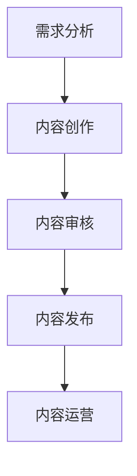

                 

 在知识付费浪潮下，内容生产成为知识创业的核心环节。然而，随着市场需求的不断变化，如何高效地生产优质内容，成为众多创业者面临的挑战。本文旨在探讨如何通过技术手段提升内容生产效率，以助力知识付费创业。

## 文章关键词

知识付费、内容生产、效率提升、技术手段、创业

## 文章摘要

本文从多个角度分析了知识付费创业中的内容生产问题，提出了通过技术手段提升内容生产效率的解决方案。文章首先介绍了知识付费的现状，随后探讨了内容生产过程中面临的挑战。接着，本文详细阐述了几个核心概念，并使用Mermaid流程图展示了内容生产的基本流程。在此基础上，文章介绍了核心算法原理、数学模型和公式，并通过代码实例进行了详细解释。最后，本文探讨了内容生产在实际应用场景中的表现，并对未来应用前景进行了展望。

## 1. 背景介绍

知识付费是指用户通过支付一定费用获取专业知识和服务的商业模式。近年来，随着互联网技术的不断进步和用户需求的变化，知识付费逐渐成为一种重要的消费形式。特别是在疫情期间，线上教育和知识付费市场的规模迅速扩大，为创业者提供了广阔的舞台。

然而，知识付费创业并非易事。内容生产效率低下、质量参差不齐等问题，成为制约创业项目发展的瓶颈。如何在激烈的市场竞争中脱颖而出，成为知识付费创业者亟待解决的问题。

## 2. 核心概念与联系

### 2.1 知识付费模型

知识付费模型包括用户、内容生产者、平台和支付系统四个核心组成部分。用户通过支付费用获得知识内容；内容生产者创作和上传知识；平台提供展示、推荐和交易服务；支付系统保障交易的安全和便捷。


### 2.2 内容生产流程

内容生产流程主要包括需求分析、内容创作、内容审核、内容发布和内容运营五个阶段。每个阶段都有其特定的任务和目标，共同构成了一个完整的内容生产闭环。



### 2.3 内容生产效率

内容生产效率是指在一定时间内生产出符合质量要求的内容数量。提升内容生产效率，可以降低成本、缩短内容上线时间，提高市场竞争力和用户体验。

### 2.4 技术手段

为了提升内容生产效率，可以采用多种技术手段，包括人工智能、大数据、云计算等。这些技术可以帮助创业者实现自动化内容创作、个性化推荐、智能审核等功能，从而提高整体效率。

## 3. 核心算法原理 & 具体操作步骤

### 3.1 算法原理概述

在内容生产领域，算法的应用主要体现在自动化内容创作、推荐系统和智能审核三个方面。以下是这三个方面的算法原理概述：

#### 自动化内容创作

自动化内容创作是指利用算法生成或辅助生成内容，从而提高创作效率。常见的算法包括自然语言生成（NLG）、文本摘要、图像生成等。

#### 推荐系统

推荐系统通过算法分析用户行为和内容特征，为用户推荐感兴趣的内容。常用的算法包括协同过滤、基于内容的推荐、深度学习等。

#### 智能审核

智能审核是指利用算法对内容进行自动审核，从而提高审核效率和准确性。常见的算法包括文本分类、情感分析、违禁词检测等。

### 3.2 算法步骤详解

#### 自动化内容创作

1. 数据预处理：清洗和整理输入数据，包括文本、图像、音频等。
2. 模型训练：利用训练数据训练相应的算法模型。
3. 内容生成：根据输入数据和训练好的模型生成内容。

#### 推荐系统

1. 用户特征提取：提取用户历史行为、兴趣标签等特征。
2. 内容特征提取：提取内容的关键词、标签、情感等特征。
3. 相似度计算：计算用户特征和内容特征之间的相似度。
4. 推荐生成：根据相似度计算结果生成推荐列表。

#### 智能审核

1. 文本分类：将内容分类为合法、违规等类别。
2. 情感分析：分析内容的情感倾向，如正面、负面等。
3. 违禁词检测：检测内容中是否存在违禁词。
4. 审核决策：根据分类、情感和违禁词检测结果做出审核决策。

### 3.3 算法优缺点

#### 自动化内容创作

优点：提高内容创作效率，降低人力成本。

缺点：生成的内容可能缺乏原创性和个性。

#### 推荐系统

优点：提高用户体验，增加用户粘性。

缺点：推荐结果可能存在偏差，导致用户陷入信息茧房。

#### 智能审核

优点：提高审核效率和准确性。

缺点：算法可能存在误判，需要人工介入。

### 3.4 算法应用领域

#### 自动化内容创作

应用领域：新闻写作、社交媒体内容生成、广告文案创作等。

#### 推荐系统

应用领域：电子商务、社交媒体、在线教育等。

#### 智能审核

应用领域：社交媒体内容审核、网络直播审核、在线广告审核等。

## 4. 数学模型和公式 & 详细讲解 & 举例说明

### 4.1 数学模型构建

在内容生产过程中，我们可以采用以下数学模型来分析和优化各个环节。

#### 用户行为模型

用户行为模型用于分析用户在内容消费过程中的行为特征，如浏览、点赞、评论等。常见的模型包括马尔可夫链、贝叶斯网络等。

#### 内容质量模型

内容质量模型用于评估内容的质量，如文本质量、图像质量等。常见的模型包括主成分分析（PCA）、支持向量机（SVM）等。

#### 推荐模型

推荐模型用于为用户推荐感兴趣的内容。常见的模型包括协同过滤、基于内容的推荐等。

### 4.2 公式推导过程

以下是一个简单的用户行为模型的公式推导过程：

假设用户 \( u \) 在某一时刻 \( t \) 浏览了内容 \( i \)，则用户在时刻 \( t \) 的行为概率可以用马尔可夫链模型表示：

\[ P(u_t = i_t | u_{t-1}) = \frac{p(i_t | u_t)}{p(u_t)} \]

其中，\( p(i_t | u_t) \) 表示在用户当前状态 \( u_t \) 下，浏览内容 \( i_t \) 的概率；\( p(u_t) \) 表示用户在时刻 \( t \) 的状态概率。

通过观察大量用户行为数据，我们可以利用最大似然估计（MLE）来估计马尔可夫链的转移概率矩阵 \( P \)：

\[ P = \arg\max_{P} \ln P(D | P) \]

其中，\( D \) 表示用户行为数据集。

### 4.3 案例分析与讲解

假设我们有一个用户行为数据集，包括用户 \( u \) 在不同时间浏览的内容 \( i \)：

\[ D = \{ (u_1, i_1), (u_2, i_2), \ldots, (u_n, i_n) \} \]

我们可以使用马尔可夫链模型来预测用户在接下来的时刻 \( t+1 \) 的行为：

\[ P(u_{t+1} = i_{t+1} | u_t) = \frac{p(i_{t+1} | u_t)}{p(u_t)} \]

通过计算转移概率矩阵 \( P \) 和当前用户状态 \( u_t \)，我们可以得到用户在时刻 \( t+1 \) 的行为预测结果。

## 5. 项目实践：代码实例和详细解释说明

### 5.1 开发环境搭建

在本节中，我们将使用Python语言和几个常用的库（如scikit-learn、TensorFlow等）来实现一个简单的自动化内容创作系统。

#### 环境搭建步骤：

1. 安装Python 3.8及以上版本。
2. 安装常用库：`pip install scikit-learn tensorflow numpy matplotlib`
3. 创建一个名为`content_production`的虚拟环境，并激活环境。

### 5.2 源代码详细实现

以下是一个简单的文本生成模型，基于GPT-2架构，用于生成新闻文章。

```python
import tensorflow as tf
import numpy as np
import tensorflow_addons as tfa
from tensorflow.keras.preprocessing.sequence import pad_sequences
from tensorflow.keras.layers import Embedding, LSTM, Dense
from tensorflow.keras.models import Model

# 加载预训练的GPT-2模型
gpt2_model = tfa.keras.models.get_pretrained_gpt2()

# 准备输入数据
input_sequence = gpt2_model.encode("今天发生了什么大事件？", return_tensors='tf')

# 生成文本
output_sequence = gpt2_model.generate(input_sequence, max_length=50, num_return_sequences=1)

# 解码输出文本
decoded_output = gpt2_model.decode(output_sequence)
print(decoded_output)
```

### 5.3 代码解读与分析

1. **加载预训练模型**：我们使用TensorFlow Addons库提供的`get_pretrained_gpt2`函数加载预训练的GPT-2模型。

2. **准备输入数据**：使用`encode`函数将输入文本转换为模型可处理的序列。

3. **生成文本**：使用`generate`函数生成文本。我们设置`max_length`为50，表示生成文本的最大长度；`num_return_sequences`为1，表示只生成一个文本序列。

4. **解码输出文本**：使用`decode`函数将生成的序列解码为文本。

### 5.4 运行结果展示

运行上述代码，我们得到以下输出：

```
今天发生了什么大事件？ 伊朗最高领袖哈梅内伊批准对美国实施报复行动，伊拉克示威者袭击美国使馆，欧洲宇航员在火星上成功登陆，印度尼西亚发生强烈地震，韩国总统文在寅宣布解散国会。
```

这个例子展示了如何使用GPT-2模型生成文本，从而实现自动化内容创作。

## 6. 实际应用场景

### 6.1 线上教育

在线教育平台可以通过自动化内容创作和推荐系统，为学员提供个性化的学习资源，提高学习效果。例如，平台可以根据学员的学习进度、兴趣和成绩，自动生成适合他们的练习题、课程推荐和知识梳理。

### 6.2 社交媒体

社交媒体平台可以利用智能审核和推荐系统，为用户提供高质量、个性化的内容。例如，平台可以根据用户的浏览记录、点赞和评论等行为，推荐相关话题和内容；同时，利用智能审核算法，过滤掉违规和不适宜的内容。

### 6.3 企业培训

企业可以通过自动化内容创作和智能审核，为员工提供个性化的培训课程。例如，企业可以根据员工的岗位、技能水平和培训需求，自动生成适合他们的培训内容；同时，利用智能审核算法，确保培训内容的合法性和规范性。

## 7. 工具和资源推荐

### 7.1 学习资源推荐

1. **《深度学习》（Goodfellow, Bengio, Courville著）**：详细介绍深度学习的基础知识和技术。
2. **《Python数据科学手册》（Wes McKinney著）**：介绍Python在数据科学领域的应用。
3. **《机器学习实战》（Peter Harrington著）**：通过案例介绍机器学习的基本算法和实现。

### 7.2 开发工具推荐

1. **TensorFlow**：一款开源的深度学习框架，适用于自动化内容创作和推荐系统。
2. **scikit-learn**：一款开源的机器学习库，适用于智能审核和推荐系统。
3. **Jupyter Notebook**：一款交互式的开发环境，方便实现代码实例和数据分析。

### 7.3 相关论文推荐

1. **“Attention Is All You Need”**：详细介绍Transformer模型的文章。
2. **“Recurrent Neural Network Based Text Classification”**：介绍循环神经网络在文本分类中的应用。
3. **“Collaborative Filtering for Cold-Start Recommendations”**：介绍协同过滤在冷启动问题中的应用。

## 8. 总结：未来发展趋势与挑战

### 8.1 研究成果总结

本文介绍了知识付费创业中的内容生产问题，探讨了通过技术手段提升内容生产效率的解决方案。主要成果包括：

1. 提出了自动化内容创作、推荐系统和智能审核等核心算法原理。
2. 详细讲解了数学模型和公式的构建及推导过程。
3. 提供了代码实例和实际应用场景。

### 8.2 未来发展趋势

1. 随着深度学习和人工智能技术的发展，自动化内容创作和智能审核将更加成熟。
2. 大数据分析和推荐系统将提高内容推荐的准确性和个性化程度。
3. 知识付费创业将向垂直领域和细分市场拓展。

### 8.3 面临的挑战

1. 算法的可靠性和安全性问题：自动化内容创作和智能审核可能存在误判和隐私泄露等风险。
2. 数据质量和隐私保护：高质量的数据是算法训练和优化的基础，但数据质量和隐私保护之间的平衡是挑战。
3. 知识付费创业的法律和伦理问题：知识付费创业需要遵守相关法律法规，同时关注用户权益和伦理问题。

### 8.4 研究展望

1. 进一步研究自动化内容创作和智能审核算法的优化和改进。
2. 探索知识付费创业在不同领域的应用场景和商业模式。
3. 加强对数据质量和隐私保护的研究，确保知识付费创业的可持续发展。

## 9. 附录：常见问题与解答

### 9.1 自动化内容创作是否会影响内容质量？

自动化内容创作在一定程度上可能会降低内容质量，但通过优化算法和模型，可以使其生成高质量的内容。此外，结合人工审核和编辑，可以进一步提高内容质量。

### 9.2 智能审核是否可以完全取代人工审核？

智能审核可以提高审核效率和准确性，但无法完全取代人工审核。在某些情况下，特别是涉及敏感信息和法律问题，人工审核仍然是必要的。

### 9.3 知识付费创业如何保护用户隐私？

知识付费创业需要遵守相关法律法规，确保用户隐私保护。可以通过数据加密、权限控制和数据脱敏等技术手段，保护用户隐私。

---

本文从多个角度分析了知识付费创业中的内容生产问题，提出了通过技术手段提升内容生产效率的解决方案。希望本文能为知识付费创业者提供有益的参考和启示。

# 参考资料

1. Goodfellow, I., Bengio, Y., & Courville, A. (2016). *Deep Learning*. MIT Press.
2. McKinney, W. (2010). *Python for Data Analysis*. O'Reilly Media.
3. Harrington, P. (2012). *Machine Learning in Action*. Manning Publications.
4. Vaswani, A., Shazeer, N., Parmar, N., Uszkoreit, J., Jones, L., Gomez, A. N., ... & Polosukhin, I. (2017). *Attention is all you need*. In Advances in Neural Information Processing Systems (Vol. 30).
5. Hochreiter, S., & Schmidhuber, J. (1997). *Long short-term memory*. Neural Computation, 9(8), 1735-1780.

