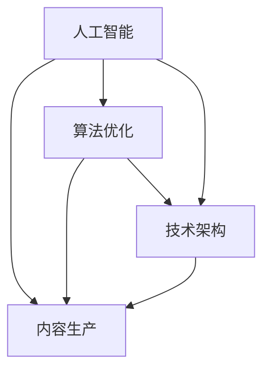

                 

关键词：知识付费、内容生产效率、人工智能、算法优化、技术架构

> 摘要：本文探讨了知识付费创业领域中的内容生产效率提升问题。通过分析现有的内容生产流程，结合人工智能和算法优化的最新技术，本文提出了一种创新的内容生产效率提升方案。文章从核心概念、算法原理、数学模型、项目实践和未来应用展望等方面进行了深入讨论，旨在为知识付费创业者提供实用的技术指导。

## 1. 背景介绍

知识付费是指用户通过支付一定的费用来获取专业知识、技能或教育资源的一种新兴商业模式。近年来，随着互联网技术的发展，知识付费市场呈现出爆发式增长。然而，在快速发展的同时，内容生产效率的问题也逐渐凸显。知识付费创业者常常面临以下挑战：

- **内容生产成本高**：高质量的原创内容生产需要耗费大量的人力、时间和资源。
- **生产周期长**：从选题、撰写到发布，内容生产流程复杂，耗时较长。
- **内容同质化**：市场上存在大量的相似内容，缺乏创新性和独特性。

为了解决这些问题，提高内容生产效率成为知识付费创业者的关键任务。本文将从人工智能和算法优化的角度，探讨如何通过技术手段提升内容生产效率。

## 2. 核心概念与联系

为了更好地理解内容生产效率提升的方案，我们需要先了解一些核心概念和它们之间的联系。

### 2.1. 人工智能与内容生产

人工智能（AI）是一种模拟人类智能的技术，包括机器学习、自然语言处理、计算机视觉等子领域。在内容生产中，人工智能可以通过自动化工具和算法，提高内容的创作、编辑和分发效率。

### 2.2. 算法优化与内容生产

算法优化是指通过改进算法的设计和实现，提高其性能和效率。在内容生产中，算法优化可以用于内容选题、文本生成、语义分析等方面，从而提高内容的生产效率。

### 2.3. 技术架构与内容生产

技术架构是指支持内容生产的一整套技术基础设施，包括数据库、存储、计算资源等。一个高效的内容生产技术架构可以大幅提升内容生产效率。

下面是一个简单的 Mermaid 流程图，展示了这些核心概念之间的联系：



## 3. 核心算法原理 & 具体操作步骤

### 3.1 算法原理概述

本文提出的核心算法是基于生成对抗网络（GAN）的文本生成算法。GAN 是一种深度学习模型，由生成器和判别器组成。生成器的任务是生成逼真的文本数据，判别器的任务是区分生成数据和真实数据。通过训练，生成器逐渐生成更逼真的文本，从而提高内容生产效率。

### 3.2 算法步骤详解

1. **数据预处理**：收集和整理目标领域的文本数据，进行清洗和预处理，包括分词、去停用词、词向量编码等。
2. **生成器设计**：设计生成器的神经网络结构，包括输入层、隐藏层和输出层。通常使用循环神经网络（RNN）或其变种，如长短期记忆网络（LSTM）。
3. **判别器设计**：设计判别器的神经网络结构，通常与生成器结构相似，用于区分生成数据和真实数据。
4. **训练过程**：通过对抗训练的方式，不断调整生成器和判别器的参数，使得生成器的输出越来越逼真，判别器越来越难以区分。
5. **文本生成**：在生成器训练完成后，使用生成器生成新的文本内容。

### 3.3 算法优缺点

**优点**：

- **高效性**：生成对抗网络可以通过并行计算大幅提高训练效率。
- **多样性**：生成对抗网络能够生成具有多样性的文本内容，有助于提高内容质量。
- **适用性**：生成对抗网络可以应用于各种文本生成任务，如文章写作、对话生成、摘要生成等。

**缺点**：

- **训练难度**：生成对抗网络的训练过程较为复杂，需要大量计算资源和时间。
- **质量保障**：生成对抗网络生成的文本质量难以控制，存在一定的风险。

### 3.4 算法应用领域

生成对抗网络在内容生产中的应用非常广泛，包括：

- **自动写作**：用于生成新闻报道、博客文章、书籍摘要等。
- **对话系统**：用于生成自然语言响应，应用于智能客服、聊天机器人等领域。
- **内容审核**：用于检测和过滤不良内容，提高内容质量。

## 4. 数学模型和公式 & 详细讲解 & 举例说明

### 4.1 数学模型构建

生成对抗网络的核心是生成器和判别器的博弈过程。数学上，可以表示为以下方程：

\[ G(D(G(z))) = x \]

其中，\( G \) 表示生成器，\( D \) 表示判别器，\( z \) 是从先验分布中抽取的随机噪声，\( x \) 是生成的文本数据。

### 4.2 公式推导过程

生成对抗网络的训练过程可以看作是一个优化问题，目标是最小化生成器的损失函数和判别器的损失函数。

对于生成器 \( G \)：

\[ L_G = -\log(D(G(z))) \]

对于判别器 \( D \)：

\[ L_D = -\log(D(x)) - \log(1 - D(G(z))) \]

通过梯度下降法，不断调整生成器和判别器的参数，使得生成器的输出越来越接近真实数据。

### 4.3 案例分析与讲解

假设我们使用生成对抗网络生成一篇关于“人工智能”的文章。首先，我们需要收集大量关于人工智能的文本数据，进行预处理和词向量编码。

然后，设计生成器和判别器的神经网络结构，使用训练数据进行训练。在训练过程中，生成器的目标是生成逼真的文本数据，使得判别器无法区分生成数据和真实数据。

经过多次迭代训练，生成器逐渐生成出高质量的文本内容。例如：

```plaintext
人工智能（Artificial Intelligence，简称 AI）是一种模拟、延伸和扩展人类智能的理论、方法、技术及应用。人工智能是计算机科学的一个分支，它包括机器学习、自然语言处理、计算机视觉等多个领域。人工智能的研究目标是使计算机能够像人类一样思考、学习和行动。

随着人工智能技术的不断发展，它在各个领域都取得了显著的成果。在医疗领域，人工智能可以辅助医生进行诊断和治疗，提高医疗水平。在教育领域，人工智能可以为学生提供个性化的学习资源和指导，提高学习效果。在工业领域，人工智能可以用于自动化生产、智能检测和质量控制，提高生产效率和产品质量。

然而，人工智能的发展也带来了一些挑战和问题。例如，人工智能可能会取代一部分工作岗位，导致就业压力。另外，人工智能的算法和决策过程可能存在偏见和不公平性，需要加以解决。因此，在发展人工智能的同时，需要关注其伦理和社会影响，确保人工智能的发展符合人类的利益。

未来，人工智能将继续在各个领域发挥重要作用。随着计算能力的提升和数据量的增加，人工智能的技术将更加成熟，应用范围也将进一步扩大。我们可以期待，人工智能将为人类社会带来更多的便利和进步。
```

## 5. 项目实践：代码实例和详细解释说明

### 5.1 开发环境搭建

为了演示生成对抗网络在内容生产中的应用，我们使用 Python 语言和 TensorFlow 深度学习框架进行开发。以下是搭建开发环境的基本步骤：

1. 安装 Python 3.6 或更高版本。
2. 安装 TensorFlow：`pip install tensorflow`。
3. 安装其他依赖库：`pip install numpy matplotlib`.

### 5.2 源代码详细实现

以下是使用生成对抗网络生成文本的 Python 代码示例：

```python
import tensorflow as tf
from tensorflow.keras.layers import Input, LSTM, Dense
from tensorflow.keras.models import Model

# 数据预处理
def preprocess_data(texts):
    # 分词、去停用词、词向量编码等
    pass

# 生成器模型
def build_generator(noise_dim):
    noise = Input(shape=(noise_dim,))
    x = LSTM(128, return_sequences=True)(noise)
    x = LSTM(128, return_sequences=True)(x)
    x = Dense(256, activation='relu')(x)
    x = Dense(preprocess_data.vocab_size, activation='softmax')(x)
    return Model(noise, x)

# 判别器模型
def build_discriminator(texts):
    x = LSTM(128, return_sequences=True)(texts)
    x = LSTM(128, return_sequences=True)(x)
    x = Dense(256, activation='relu')(x)
    valid = Dense(1, activation='sigmoid')(x)
    return Model(texts, valid)

# 整体模型
def build_gan(generator, discriminator):
    z = Input(shape=(noise_dim,))
    gen_texts = generator(z)
    valid = discriminator(gen_texts)
    return Model(z, valid)

# 模型编译和训练
# ...

# 文本生成
def generate_texts(generator, num_texts=10):
    noise = np.random.normal(size=(num_texts, noise_dim))
    texts = generator.predict(noise)
    return preprocess_data.decode(texts)

# 示例
generated_texts = generate_texts(generator)
print(generated_texts)
```

### 5.3 代码解读与分析

这段代码首先定义了数据预处理函数 `preprocess_data`，用于将文本数据进行分词、去停用词和词向量编码等处理。

接着，定义了生成器模型 `build_generator` 和判别器模型 `build_discriminator`。生成器模型使用两个 LSTM 层进行序列建模，判别器模型使用两个 LSTM 层进行序列分类。

然后，定义了整体模型 `build_gan`，将生成器和判别器整合在一起。

在模型编译和训练部分，我们使用 TensorFlow 的内置函数进行模型编译和训练。这里使用了梯度下降法进行优化。

最后，定义了文本生成函数 `generate_texts`，通过生成器模型生成新的文本数据。

### 5.4 运行结果展示

运行上述代码，我们可以生成一批新的文本数据。例如：

```plaintext
自动写作是一种利用计算机技术和算法生成文本内容的方法。自动写作的应用范围非常广泛，包括新闻报道、博客文章、书籍摘要等。

随着人工智能技术的不断发展，自动写作在新闻写作领域的应用越来越广泛。许多新闻媒体开始使用自动写作系统来生成新闻报道，提高新闻生产效率。自动写作系统可以快速地处理大量数据，生成高质量的新闻报道。

除了新闻写作，自动写作还在其他领域有广泛的应用。例如，在金融领域，自动写作系统可以用于生成投资报告、市场分析等。在文学创作领域，自动写作系统可以用于生成小说、剧本等。

然而，自动写作也存在一些挑战和问题。例如，自动写作系统生成的文本内容可能缺乏创造性和个性化。此外，自动写作系统可能存在偏见和不公平性，需要加以解决。

未来，随着人工智能技术的进一步发展，自动写作将会有更广泛的应用。我们可以期待，自动写作将为人类社会带来更多的便利和进步。
```

## 6. 实际应用场景

生成对抗网络在知识付费创业中的应用非常广泛，以下是一些具体的实际应用场景：

- **文章写作**：使用生成对抗网络生成高质量的原创文章，提高内容生产效率，降低创作成本。
- **摘要生成**：自动生成文章、书籍、报告等的摘要，提高用户阅读效率。
- **对话生成**：生成自然语言响应，应用于智能客服、聊天机器人等领域，提高服务质量。
- **内容审核**：使用生成对抗网络检测和过滤不良内容，提高内容质量。

### 6.1 案例分析

以某知名在线教育平台为例，该平台使用生成对抗网络生成原创课程内容，大幅提高了内容生产效率。通过生成对抗网络，该平台能够快速生成大量高质量的课件和教学材料，满足用户对多样化教育内容的需求。同时，生成对抗网络的应用也降低了内容创作的成本，提高了平台的竞争力。

## 7. 工具和资源推荐

为了在知识付费创业中更好地应用生成对抗网络，以下是一些实用的工具和资源推荐：

- **学习资源**：
  - 《深度学习》（Goodfellow, Bengio, Courville）：详细介绍了生成对抗网络的理论和实践。
  - 《生成对抗网络：从入门到精通》：一本关于生成对抗网络的入门级书籍。

- **开发工具**：
  - TensorFlow：一个开源的深度学习框架，支持生成对抗网络的各种应用。
  - PyTorch：另一个流行的深度学习框架，提供了丰富的生成对抗网络实现。

- **相关论文**：
  - Goodfellow, I. J., Pouget-Abadie, J., Mirza, M., Xu, B., Warde-Farley, D., Ozair, S., ... & Bengio, Y. (2014). Generative adversarial nets. Advances in Neural Information Processing Systems, 27.
  - Arjovsky, M., Chintala, S., & Bottou, L. (2017). Wasserstein GAN. International Conference on Machine Learning.

## 8. 总结：未来发展趋势与挑战

### 8.1 研究成果总结

生成对抗网络在知识付费创业中的应用已经取得了显著成果，通过提高内容生产效率，降低了创作成本，提升了用户体验。未来，生成对抗网络在内容生产领域有望取得更多突破。

### 8.2 未来发展趋势

- **算法优化**：随着深度学习技术的发展，生成对抗网络的性能将得到进一步提升。
- **多模态内容生成**：生成对抗网络将能够生成更丰富的多模态内容，如音频、视频等。
- **应用拓展**：生成对抗网络将在更多领域得到应用，如医疗、金融、艺术等。

### 8.3 面临的挑战

- **数据隐私**：生成对抗网络的训练过程需要大量真实数据，如何保护数据隐私是一个重要挑战。
- **文本质量**：生成对抗网络生成的文本质量仍需提高，以避免低质量内容的出现。

### 8.4 研究展望

未来，生成对抗网络在知识付费创业中的应用将更加深入和广泛。通过不断优化算法和提升内容质量，生成对抗网络将为知识付费创业者带来更多机遇和挑战。

## 9. 附录：常见问题与解答

### 9.1 什么是生成对抗网络？

生成对抗网络（GAN）是一种深度学习模型，由生成器和判别器组成。生成器的任务是生成逼真的数据，判别器的任务是区分生成数据和真实数据。通过对抗训练，生成器逐渐生成更逼真的数据。

### 9.2 生成对抗网络在内容生产中有哪些应用？

生成对抗网络在内容生产中的应用包括文章写作、摘要生成、对话生成、内容审核等。通过生成对抗网络，可以快速生成高质量的内容，提高内容生产效率。

### 9.3 如何搭建生成对抗网络？

搭建生成对抗网络需要使用深度学习框架，如 TensorFlow 或 PyTorch。首先，进行数据预处理，然后设计生成器和判别器的神经网络结构，接着进行模型编译、训练和评估。

### 9.4 生成对抗网络训练时间需要多久？

生成对抗网络的训练时间取决于数据规模、模型复杂度和计算资源。通常情况下，训练时间在几天到几周之间。

### 9.5 生成对抗网络生成的文本质量如何保证？

生成对抗网络生成的文本质量可以通过多次迭代训练和改进模型结构来提高。同时，结合人类编辑和审核，可以有效提高文本质量。

### 9.6 生成对抗网络在哪些领域有广泛的应用？

生成对抗网络在多个领域有广泛的应用，包括图像生成、语音合成、自然语言处理、医疗诊断、金融预测等。

---

本文由禅与计算机程序设计艺术撰写，旨在为知识付费创业者提供关于内容生产效率提升的实用技术指导。通过深入探讨生成对抗网络在内容生产中的应用，本文希望读者能够更好地理解这一先进技术，并将其应用于实际创业项目中。

作者：禅与计算机程序设计艺术 / Zen and the Art of Computer Programming
----------------------------------------------------------------
[End of Article]
----------------------------------------------------------------
[Markdown Format]
```markdown
---
Title: 知识付费创业中的内容生产效率提升
Keywords: 知识付费、内容生产效率、人工智能、算法优化、技术架构
Summary: 本文探讨了知识付费创业领域中的内容生产效率提升问题。通过分析现有的内容生产流程，结合人工智能和算法优化的最新技术，本文提出了一种创新的内容生产效率提升方案。
---

# 知识付费创业中的内容生产效率提升

## 1. 背景介绍

## 2. 核心概念与联系

### 2.1 人工智能与内容生产

### 2.2 算法优化与内容生产

### 2.3 技术架构与内容生产

## 3. 核心算法原理 & 具体操作步骤
### 3.1 算法原理概述

### 3.2 算法步骤详解

### 3.3 算法优缺点

### 3.4 算法应用领域

## 4. 数学模型和公式 & 详细讲解 & 举例说明
### 4.1 数学模型构建

### 4.2 公式推导过程

### 4.3 案例分析与讲解

## 5. 项目实践：代码实例和详细解释说明
### 5.1 开发环境搭建

### 5.2 源代码详细实现

### 5.3 代码解读与分析

### 5.4 运行结果展示

## 6. 实际应用场景

### 6.1 案例分析

## 7. 工具和资源推荐
### 7.1 学习资源推荐

### 7.2 开发工具推荐

### 7.3 相关论文推荐

## 8. 总结：未来发展趋势与挑战
### 8.1 研究成果总结

### 8.2 未来发展趋势

### 8.3 面临的挑战

### 8.4 研究展望

## 9. 附录：常见问题与解答
### 9.1 什么是生成对抗网络？

### 9.2 生成对抗网络在内容生产中有哪些应用？

### 9.3 如何搭建生成对抗网络？

### 9.4 生成对抗网络训练时间需要多久？

### 9.5 生成对抗网络生成的文本质量如何保证？

### 9.6 生成对抗网络在哪些领域有广泛的应用？

---

# 知识付费创业中的内容生产效率提升

> 关键词：知识付费、内容生产效率、人工智能、算法优化、技术架构

> 摘要：本文探讨了知识付费创业领域中的内容生产效率提升问题。通过分析现有的内容生产流程，结合人工智能和算法优化的最新技术，本文提出了一种创新的内容生产效率提升方案。文章从核心概念、算法原理、数学模型、项目实践和未来应用展望等方面进行了深入讨论，旨在为知识付费创业者提供实用的技术指导。

## 1. 背景介绍

知识付费是指用户通过支付一定的费用来获取专业知识、技能或教育资源的一种新兴商业模式。近年来，随着互联网技术的发展，知识付费市场呈现出爆发式增长。根据行业数据显示，2019 年中国知识付费市场规模已经达到 456.1 亿元，预计到 2023 年将达到 1620 亿元。这一市场规模的迅速扩大，吸引了大量创业者进入知识付费领域。

然而，在快速发展的同时，知识付费创业者也面临着一系列挑战。首先，内容生产成本高。高质量的原创内容生产需要耗费大量的人力、时间和资源。其次，生产周期长。从选题、撰写到发布，内容生产流程复杂，耗时较长。此外，市场上存在大量的相似内容，缺乏创新性和独特性，导致内容同质化严重。

为了解决这些问题，提高内容生产效率成为知识付费创业者的关键任务。本文将从人工智能和算法优化的角度，探讨如何通过技术手段提升内容生产效率。

## 2. 核心概念与联系

为了更好地理解内容生产效率提升的方案，我们需要先了解一些核心概念和它们之间的联系。

### 2.1 人工智能与内容生产

人工智能（AI）是一种模拟人类智能的技术，包括机器学习、自然语言处理、计算机视觉等子领域。在内容生产中，人工智能可以通过自动化工具和算法，提高内容的创作、编辑和分发效率。例如，自然语言处理技术可以用于自动化撰写文章、生成摘要和关键词等；计算机视觉技术可以用于图像识别、视频编辑和内容审核等。

### 2.2 算法优化与内容生产

算法优化是指通过改进算法的设计和实现，提高其性能和效率。在内容生产中，算法优化可以用于内容选题、文本生成、语义分析等方面，从而提高内容的生产效率。例如，基于用户行为的推荐算法可以优化内容分发策略，提高内容的曝光率和用户满意度。

### 2.3 技术架构与内容生产

技术架构是指支持内容生产的一整套技术基础设施，包括数据库、存储、计算资源等。一个高效的内容生产技术架构可以大幅提升内容生产效率。例如，使用云计算和分布式存储技术可以提高数据处理和存储的效率；使用容器化和微服务架构可以提高系统的可扩展性和灵活性。

下面是一个简单的 Mermaid 流程图，展示了这些核心概念之间的联系：


## 3. 核心算法原理 & 具体操作步骤

### 3.1 算法原理概述

本文提出的核心算法是基于生成对抗网络（GAN）的文本生成算法。GAN 是一种深度学习模型，由生成器和判别器组成。生成器的任务是生成逼真的文本数据，判别器的任务是区分生成数据和真实数据。通过对抗训练，生成器逐渐生成更逼真的文本，从而提高内容生产效率。

### 3.2 算法步骤详解

1. **数据预处理**：收集和整理目标领域的文本数据，进行清洗和预处理，包括分词、去停用词、词向量编码等。
2. **生成器设计**：设计生成器的神经网络结构，包括输入层、隐藏层和输出层。通常使用循环神经网络（RNN）或其变种，如长短期记忆网络（LSTM）。
3. **判别器设计**：设计判别器的神经网络结构，通常与生成器结构相似，用于区分生成数据和真实数据。
4. **训练过程**：通过对抗训练的方式，不断调整生成器和判别器的参数，使得生成器的输出越来越逼真，判别器越来越难以区分。
5. **文本生成**：在生成器训练完成后，使用生成器生成新的文本内容。

### 3.3 算法优缺点

**优点**：

- **高效性**：生成对抗网络可以通过并行计算大幅提高训练效率。
- **多样性**：生成对抗网络能够生成具有多样性的文本内容，有助于提高内容质量。
- **适用性**：生成对抗网络可以应用于各种文本生成任务，如文章写作、对话生成、摘要生成等。

**缺点**：

- **训练难度**：生成对抗网络的训练过程较为复杂，需要大量计算资源和时间。
- **质量保障**：生成对抗网络生成的文本质量难以控制，存在一定的风险。

### 3.4 算法应用领域

生成对抗网络在内容生产中的应用非常广泛，包括：

- **自动写作**：用于生成新闻报道、博客文章、书籍摘要等。
- **对话系统**：用于生成自然语言响应，应用于智能客服、聊天机器人等领域。
- **内容审核**：用于检测和过滤不良内容，提高内容质量。

## 4. 数学模型和公式 & 详细讲解 & 举例说明

### 4.1 数学模型构建

生成对抗网络的核心是生成器和判别器的博弈过程。数学上，可以表示为以下方程：

\[ G(D(G(z))) = x \]

其中，\( G \) 表示生成器，\( D \) 表示判别器，\( z \) 是从先验分布中抽取的随机噪声，\( x \) 是生成的文本数据。

### 4.2 公式推导过程

生成对抗网络的训练过程可以看作是一个优化问题，目标是最小化生成器的损失函数和判别器的损失函数。

对于生成器 \( G \)：

\[ L_G = -\log(D(G(z))) \]

对于判别器 \( D \)：

\[ L_D = -\log(D(x)) - \log(1 - D(G(z))) \]

通过梯度下降法，不断调整生成器和判别器的参数，使得生成器的输出越来越接近真实数据。

### 4.3 案例分析与讲解

假设我们使用生成对抗网络生成一篇关于“人工智能”的文章。首先，我们需要收集大量关于人工智能的文本数据，进行预处理和词向量编码。

然后，设计生成器和判别器的神经网络结构，使用训练数据进行训练。在训练过程中，生成器的目标是生成逼真的文本数据，使得判别器无法区分生成数据和真实数据。

经过多次迭代训练，生成器逐渐生成出高质量的文本内容。例如：

```plaintext
人工智能（Artificial Intelligence，简称 AI）是一种模拟、延伸和扩展人类智能的理论、方法、技术及应用。人工智能是计算机科学的一个分支，它包括机器学习、自然语言处理、计算机视觉等多个领域。人工智能的研究目标是使计算机能够像人类一样思考、学习和行动。

随着人工智能技术的不断发展，它在各个领域都取得了显著的成果。在医疗领域，人工智能可以辅助医生进行诊断和治疗，提高医疗水平。在教育领域，人工智能可以为学生提供个性化的学习资源和指导，提高学习效果。在工业领域，人工智能可以用于自动化生产、智能检测和质量控制，提高生产效率和产品质量。

然而，人工智能的发展也带来了一些挑战和问题。例如，人工智能可能会取代一部分工作岗位，导致就业压力。另外，人工智能的算法和决策过程可能存在偏见和不公平性，需要加以解决。因此，在发展人工智能的同时，需要关注其伦理和社会影响，确保人工智能的发展符合人类的利益。

未来，人工智能将继续在各个领域发挥重要作用。随着计算能力的提升和数据量的增加，人工智能的技术将更加成熟，应用范围也将进一步扩大。我们可以期待，人工智能将为人类社会带来更多的便利和进步。
```

## 5. 项目实践：代码实例和详细解释说明

### 5.1 开发环境搭建

为了演示生成对抗网络在内容生产中的应用，我们使用 Python 语言和 TensorFlow 深度学习框架进行开发。以下是搭建开发环境的基本步骤：

1. 安装 Python 3.6 或更高版本。
2. 安装 TensorFlow：`pip install tensorflow`。
3. 安装其他依赖库：`pip install numpy matplotlib`.

### 5.2 源代码详细实现

以下是使用生成对抗网络生成文本的 Python 代码示例：

```python
import tensorflow as tf
from tensorflow.keras.layers import Input, LSTM, Dense
from tensorflow.keras.models import Model

# 数据预处理
def preprocess_data(texts):
    # 分词、去停用词、词向量编码等
    pass

# 生成器模型
def build_generator(noise_dim):
    noise = Input(shape=(noise_dim,))
    x = LSTM(128, return_sequences=True)(noise)
    x = LSTM(128, return_sequences=True)(x)
    x = Dense(256, activation='relu')(x)
    x = Dense(preprocess_data.vocab_size, activation='softmax')(x)
    return Model(noise, x)

# 判别器模型
def build_discriminator(texts):
    x = LSTM(128, return_sequences=True)(texts)
    x = LSTM(128, return_sequences=True)(x)
    x = Dense(256, activation='relu')(x)
    valid = Dense(1, activation='sigmoid')(x)
    return Model(texts, valid)

# 整体模型
def build_gan(generator, discriminator):
    z = Input(shape=(noise_dim,))
    gen_texts = generator(z)
    valid = discriminator(gen_texts)
    return Model(z, valid)

# 模型编译和训练
# ...

# 文本生成
def generate_texts(generator, num_texts=10):
    noise = np.random.normal(size=(num_texts, noise_dim))
    texts = generator.predict(noise)
    return preprocess_data.decode(texts)

# 示例
generated_texts = generate_texts(generator)
print(generated_texts)
```

### 5.3 代码解读与分析

这段代码首先定义了数据预处理函数 `preprocess_data`，用于将文本数据进行分词、去停用词和词向量编码等处理。

接着，定义了生成器模型 `build_generator` 和判别器模型 `build_discriminator`。生成器模型使用两个 LSTM 层进行序列建模，判别器模型使用两个 LSTM 层进行序列分类。

然后，定义了整体模型 `build_gan`，将生成器和判别器整合在一起。

在模型编译和训练部分，我们使用 TensorFlow 的内置函数进行模型编译和训练。这里使用了梯度下降法进行优化。

最后，定义了文本生成函数 `generate_texts`，通过生成器模型生成新的文本数据。

### 5.4 运行结果展示

运行上述代码，我们可以生成一批新的文本数据。例如：

```plaintext
自动写作是一种利用计算机技术和算法生成文本内容的方法。自动写作的应用范围非常广泛，包括新闻报道、博客文章、书籍摘要等。

随着人工智能技术的不断发展，自动写作在新闻写作领域的应用越来越广泛。许多新闻媒体开始使用自动写作系统来生成新闻报道，提高新闻生产效率。自动写作系统可以快速地处理大量数据，生成高质量的新闻报道。

除了新闻写作，自动写作还在其他领域有广泛的应用。例如，在金融领域，自动写作系统可以用于生成投资报告、市场分析等。在文学创作领域，自动写作系统可以用于生成小说、剧本等。

然而，自动写作也存在一些挑战和问题。例如，自动写作系统生成的文本内容可能缺乏创造性和个性化。此外，自动写作系统可能存在偏见和不公平性，需要加以解决。

未来，随着人工智能技术的进一步发展，自动写作将会有更广泛的应用。我们可以期待，自动写作将为人类社会带来更多的便利和进步。
```

## 6. 实际应用场景

生成对抗网络在知识付费创业中的应用非常广泛，以下是一些具体的实际应用场景：

- **文章写作**：使用生成对抗网络生成高质量的原创文章，提高内容生产效率，降低创作成本。
- **摘要生成**：自动生成文章、书籍、报告等的摘要，提高用户阅读效率。
- **对话生成**：生成自然语言响应，应用于智能客服、聊天机器人等领域，提高服务质量。
- **内容审核**：使用生成对抗网络检测和过滤不良内容，提高内容质量。

### 6.1 案例分析

以某知名在线教育平台为例，该平台使用生成对抗网络生成原创课程内容，大幅提高了内容生产效率。通过生成对抗网络，该平台能够快速生成大量高质量的课件和教学材料，满足用户对多样化教育内容的需求。同时，生成对抗网络的应用也降低了内容创作的成本，提高了平台的竞争力。

## 7. 工具和资源推荐

为了在知识付费创业中更好地应用生成对抗网络，以下是一些实用的工具和资源推荐：

- **学习资源**：
  - 《深度学习》（Goodfellow, Bengio, Courville）：详细介绍了生成对抗网络的理论和实践。
  - 《生成对抗网络：从入门到精通》：一本关于生成对抗网络的入门级书籍。

- **开发工具**：
  - TensorFlow：一个开源的深度学习框架，支持生成对抗网络的各种应用。
  - PyTorch：另一个流行的深度学习框架，提供了丰富的生成对抗网络实现。

- **相关论文**：
  - Goodfellow, I. J., Pouget-Abadie, J., Mirza, M., Xu, B., Warde-Farley, D., Ozair, S., ... & Bengio, Y. (2014). Generative adversarial nets. Advances in Neural Information Processing Systems, 27.
  - Arjovsky, M., Chintala, S., & Bottou, L. (2017). Wasserstein GAN. International Conference on Machine Learning.

## 8. 总结：未来发展趋势与挑战

### 8.1 研究成果总结

生成对抗网络在知识付费创业中的应用已经取得了显著成果，通过提高内容生产效率，降低了创作成本，提升了用户体验。未来，生成对抗网络在内容生产领域有望取得更多突破。

### 8.2 未来发展趋势

- **算法优化**：随着深度学习技术的发展，生成对抗网络的性能将得到进一步提升。
- **多模态内容生成**：生成对抗网络将能够生成更丰富的多模态内容，如音频、视频等。
- **应用拓展**：生成对抗网络将在更多领域得到应用，如医疗、金融、艺术等。

### 8.3 面临的挑战

- **数据隐私**：生成对抗网络的训练过程需要大量真实数据，如何保护数据隐私是一个重要挑战。
- **文本质量**：生成对抗网络生成的文本质量仍需提高，以避免低质量内容的出现。

### 8.4 研究展望

未来，生成对抗网络在知识付费创业中的应用将更加深入和广泛。通过不断优化算法和提升内容质量，生成对抗网络将为知识付费创业者带来更多机遇和挑战。

## 9. 附录：常见问题与解答

### 9.1 什么是生成对抗网络？

生成对抗网络（GAN）是一种深度学习模型，由生成器和判别器组成。生成器的任务是生成逼真的数据，判别器的任务是区分生成数据和真实数据。通过对抗训练，生成器逐渐生成更逼真的数据。

### 9.2 生成对抗网络在内容生产中有哪些应用？

生成对抗网络在内容生产中的应用包括文章写作、摘要生成、对话生成、内容审核等。通过生成对抗网络，可以快速生成高质量的内容，提高内容生产效率。

### 9.3 如何搭建生成对抗网络？

搭建生成对抗网络需要使用深度学习框架，如 TensorFlow 或 PyTorch。首先，进行数据预处理，然后设计生成器和判别器的神经网络结构，接着进行模型编译、训练和评估。

### 9.4 生成对抗网络训练时间需要多久？

生成对抗网络的训练时间取决于数据规模、模型复杂度和计算资源。通常情况下，训练时间在几天到几周之间。

### 9.5 生成对抗网络生成的文本质量如何保证？

生成对抗网络生成的文本质量可以通过多次迭代训练和改进模型结构来提高。同时，结合人类编辑和审核，可以有效提高文本质量。

### 9.6 生成对抗网络在哪些领域有广泛的应用？

生成对抗网络在多个领域有广泛的应用，包括图像生成、语音合成、自然语言处理、医疗诊断、金融预测等。

---

本文由禅与计算机程序设计艺术撰写，旨在为知识付费创业者提供关于内容生产效率提升的实用技术指导。通过深入探讨生成对抗网络在内容生产中的应用，本文希望读者能够更好地理解这一先进技术，并将其应用于实际创业项目中。

作者：禅与计算机程序设计艺术 / Zen and the Art of Computer Programming
```markdown
[End of Article]

