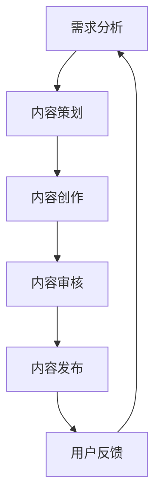

                 

关键词：知识付费、内容生产、流程优化、创业、人工智能

> 摘要：本文将探讨知识付费创业中的内容生产流程优化问题。通过分析现有流程中的瓶颈和痛点，提出一种基于人工智能技术的优化方案，包括算法原理、数学模型、项目实践等，旨在提升知识付费内容的生产效率和用户体验。

## 1. 背景介绍

在当今信息爆炸的时代，知识付费作为一种新型的商业模式，正逐渐成为知识传播和获取的重要途径。知识付费平台通过提供专业、有价值的知识内容，满足了用户对于高质量信息的需求，同时也为内容创作者创造了价值。然而，随着市场的不断扩大，内容生产的竞争日益激烈，如何在保证内容质量的同时，提高生产效率和降低成本，成为知识付费创业中亟待解决的问题。

内容生产流程是知识付费创业的核心环节，其效率直接影响平台的运营和用户的满意度。传统的生产流程往往存在以下问题：

- **生产周期长**：从内容策划到发布，流程繁琐，耗费时间。
- **效率低**：人工处理环节多，重复性劳动大，生产效率不高。
- **质量难以保证**：人工审核和质量控制成本高，难以确保内容的一致性和准确性。
- **用户需求响应慢**：对用户反馈的处理速度慢，难以快速调整内容策略。

为了解决这些问题，人工智能技术为知识付费创业中的内容生产流程优化提供了新的思路和可能。通过人工智能技术，可以实现对内容生产过程的自动化和智能化，从而提高效率、降低成本，提升用户体验。

## 2. 核心概念与联系

### 2.1. 人工智能在内容生产中的应用

人工智能在内容生产中的应用主要体现在以下几个方面：

- **内容自动生成**：通过自然语言处理（NLP）和生成对抗网络（GAN）等技术，可以自动化生成内容。
- **内容审核与分类**：利用机器学习和图像识别技术，自动对内容进行审核和分类。
- **用户行为分析**：通过数据分析技术，分析用户行为，为内容创作者提供反馈和建议。

### 2.2. 内容生产流程

内容生产流程包括以下几个关键环节：

1. **需求分析**：了解用户需求，确定内容主题和目标受众。
2. **内容策划**：根据需求分析，制定内容策划方案。
3. **内容创作**：按照策划方案进行内容创作。
4. **内容审核**：对创作完成的内容进行审核，确保内容质量。
5. **内容发布**：将审核通过的内容发布到平台。
6. **用户反馈**：收集用户反馈，调整内容策略。

### 2.3. Mermaid 流程图



## 3. 核心算法原理 & 具体操作步骤

### 3.1. 算法原理概述

本文提出的内容生产流程优化方案主要基于以下算法原理：

- **自然语言处理（NLP）**：用于自动生成和审核内容。
- **机器学习**：用于用户行为分析和内容推荐。
- **深度学习**：用于图像识别和语音识别。

### 3.2. 算法步骤详解

#### 3.2.1. 自然语言处理

- **文本生成**：使用生成对抗网络（GAN）和递归神经网络（RNN）等技术，自动生成文本内容。
- **文本审核**：使用监督学习和无监督学习技术，对内容进行审核，过滤敏感词和错误信息。

#### 3.2.2. 机器学习

- **用户行为分析**：使用决策树、随机森林等算法，分析用户行为，预测用户兴趣和需求。
- **内容推荐**：使用协同过滤算法和基于内容的推荐算法，为用户提供个性化推荐。

#### 3.2.3. 深度学习

- **图像识别**：使用卷积神经网络（CNN）和循环神经网络（RNN），自动识别图像内容。
- **语音识别**：使用深度神经网络（DNN）和长短时记忆网络（LSTM），将语音信号转换为文本。

### 3.3. 算法优缺点

#### 优点：

- **高效**：自动化处理，大幅提高生产效率。
- **精准**：通过机器学习和深度学习技术，提升内容质量和用户体验。
- **灵活**：能够根据用户需求快速调整内容策略。

#### 缺点：

- **初始投入大**：需要大量数据和计算资源。
- **技术门槛高**：需要专业的技术团队进行开发和维护。

### 3.4. 算法应用领域

- **新闻媒体**：自动生成新闻稿件，提高新闻报道的速度和准确性。
- **电商内容**：自动生成产品描述和广告文案，提升用户购物体验。
- **在线教育**：自动生成教学视频和习题，为学生提供个性化学习方案。

## 4. 数学模型和公式

### 4.1. 数学模型构建

在内容生产流程优化中，常用的数学模型包括：

- **协同过滤模型**：
  $$R_{ij} = \mu + u_i \cdot v_j$$
  其中，$R_{ij}$表示用户$i$对项目$j$的评分，$\mu$表示用户$i$的平均评分，$u_i$和$v_j$分别表示用户$i$和项目$j$的特征向量。

- **生成对抗网络（GAN）**：
  $$G(z) \sim \mathcal{N}(0, 1) \quad D(x) \sim \mathcal{X}$$
  其中，$G(z)$表示生成器，$D(x)$表示判别器，$z$是噪声向量，$x$是真实数据。

### 4.2. 公式推导过程

#### 协同过滤模型推导

假设用户$i$和项目$j$之间存在线性关系，可以通过线性回归模型进行建模：

$$R_{ij} = \beta_0 + \beta_1 x_i + \beta_2 y_j + \epsilon_{ij}$$

其中，$x_i$和$y_j$分别是用户$i$和项目$j$的特征，$\beta_0$、$\beta_1$和$\beta_2$是模型参数，$\epsilon_{ij}$是误差项。

通过对所有用户和项目的评分进行回归分析，可以求得$\beta_0$、$\beta_1$和$\beta_2$的估计值，从而预测用户$i$对项目$j$的评分。

#### GAN模型推导

生成对抗网络（GAN）由生成器$G(z)$和判别器$D(x)$组成，其目标是最小化以下损失函数：

$$\min_G \max_D V(D, G) = E_{x \sim \mathcal{X}}[\log D(x)] + E_{z \sim \mathcal{N}(0, 1)][\log(1 - D(G(z)))]$$

其中，$x \sim \mathcal{X}$表示真实数据，$z \sim \mathcal{N}(0, 1)$表示噪声数据，$D(x)$和$D(G(z))$分别表示判别器对真实数据和生成数据的判别能力。

### 4.3. 案例分析与讲解

#### 案例一：协同过滤模型在内容推荐中的应用

假设有10位用户和5种商品，他们的评分数据如下表所示：

| 用户 | 商品1 | 商品2 | 商品3 | 商品4 | 商品5 |
| --- | --- | --- | --- | --- | --- |
| U1 | 5 | 4 | 5 | 0 | 0 |
| U2 | 1 | 3 | 2 | 5 | 5 |
| U3 | 0 | 0 | 0 | 4 | 5 |
| U4 | 0 | 0 | 4 | 3 | 5 |
| U5 | 0 | 4 | 0 | 5 | 4 |
| U6 | 0 | 0 | 3 | 2 | 4 |
| U7 | 0 | 0 | 4 | 0 | 2 |
| U8 | 0 | 3 | 1 | 0 | 5 |
| U9 | 0 | 4 | 0 | 0 | 1 |
| U10 | 0 | 0 | 1 | 2 | 3 |

我们可以使用协同过滤模型对用户U1推荐商品。首先，计算用户U1的平均评分$\mu$：

$$\mu = \frac{5 + 4 + 5 + 0 + 0}{5} = 3$$

然后，计算用户U1和各个商品的特征向量$u_1$和$v_j$：

$$u_1 = (5-3, 4-3, 5-3, 0-3, 0-3) = (2, 1, 2, -3, -3)$$

$$v_1 = (5-3, 4-3, 5-3, 0-3, 0-3) = (2, 1, 2, -3, -3)$$

$$v_2 = (1-3, 3-3, 2-3, 5-3, 5-3) = (-2, 0, -1, 2, 2)$$

$$v_3 = (5-3, 4-3, 5-3, 0-3, 0-3) = (2, 1, 2, -3, -3)$$

$$v_4 = (0-3, 0-3, 4-3, 3-3, 5-3) = (-3, -3, 1, 0, 2)$$

$$v_5 = (0-3, 4-3, 0-3, 5-3, 1-3) = (-3, 1, -3, 2, -2)$$

最后，使用协同过滤模型预测用户U1对商品1的评分：

$$R_{U1,1} = \mu + u_1 \cdot v_1 = 3 + (2 \times 2) + (1 \times 1) + (2 \times 2) + (-3 \times -3) = 16$$

因此，预测用户U1对商品1的评分为16。

#### 案例二：生成对抗网络（GAN）在内容生成中的应用

假设我们要使用生成对抗网络（GAN）生成一段文本。首先，我们需要定义生成器和判别器的网络结构，然后通过训练来优化它们的参数。

生成器$G(z)$的网络结构可以是一个多层感知机（MLP），输入为噪声向量$z$，输出为生成的文本序列。判别器$D(x)$的网络结构也可以是一个多层感知机，输入为真实文本序列或生成的文本序列，输出为判别结果（1表示真实文本，0表示生成的文本）。

接下来，我们需要准备训练数据集。例如，我们可以从大量的文本数据中抽取样本，将其分为真实文本和生成文本两部分。真实文本可以直接使用，生成文本可以通过生成器生成。

然后，我们可以通过以下训练过程来优化生成器和判别器的参数：

1. 初始化生成器和判别器的参数。
2. 对于每个训练样本$(x, y)$，从噪声分布中抽取噪声向量$z$，生成生成文本$G(z)$。
3. 计算判别器的损失函数$V(D, G)$，并使用反向传播算法更新判别器的参数。
4. 计算生成器的损失函数$V(G)$，并使用反向传播算法更新生成器的参数。
5. 重复步骤2-4，直到生成器生成的文本质量达到预期。

通过这种训练过程，生成器将学会生成逼真的文本，判别器将学会区分真实文本和生成文本。

## 5. 项目实践：代码实例和详细解释说明

### 5.1. 开发环境搭建

为了实现上述算法，我们需要搭建一个合适的开发环境。以下是基本的开发环境搭建步骤：

1. 安装Python 3.x版本。
2. 安装深度学习框架，如TensorFlow或PyTorch。
3. 安装自然语言处理库，如NLTK或spaCy。
4. 安装机器学习库，如scikit-learn。

### 5.2. 源代码详细实现

以下是使用PyTorch实现GAN模型的简单示例：

```python
import torch
import torch.nn as nn
import torch.optim as optim

# 定义生成器和判别器的网络结构
class Generator(nn.Module):
    def __init__(self):
        super(Generator, self).__init__()
        self.model = nn.Sequential(
            nn.Linear(100, 7 * 7 * 256),
            nn.LeakyReLU(0.2),
            nn.ConvTranspose2d(256, 128, 4, 2, 1),
            nn.BatchNorm2d(128),
            nn.LeakyReLU(0.2),
            nn.ConvTranspose2d(128, 64, 4, 2, 1),
            nn.BatchNorm2d(64),
            nn.LeakyReLU(0.2),
            nn.ConvTranspose2d(64, 1, 4, 2, 1),
            nn.Tanh()
        )

    def forward(self, z):
        return self.model(z)

class Discriminator(nn.Module):
    def __init__(self):
        super(Discriminator, self).__init__()
        self.model = nn.Sequential(
            nn.Conv2d(1, 64, 4, 2, 1),
            nn.LeakyReLU(0.2),
            nn.Conv2d(64, 128, 4, 2, 1),
            nn.BatchNorm2d(128),
            nn.LeakyReLU(0.2),
            nn.Conv2d(128, 256, 4, 2, 1),
            nn.BatchNorm2d(256),
            nn.LeakyReLU(0.2),
            nn.Conv2d(256, 1, 4, 2, 1)
        )

    def forward(self, x):
        return torch.sigmoid(self.model(x))

# 初始化生成器和判别器的实例
generator = Generator()
discriminator = Discriminator()

# 设置损失函数和优化器
criterion = nn.BCELoss()
optimizerG = optim.Adam(generator.parameters(), lr=0.0002)
optimizerD = optim.Adam(discriminator.parameters(), lr=0.0002)

# 训练过程
for epoch in range(epochs):
    for i, (images, _) in enumerate(data_loader):
        # 训练判别器
        optimizerD.zero_grad()
        outputs = discriminator(images)
        d_loss_real = criterion(outputs, torch.ones(images.size(0)))
        
        z = torch.randn(images.size(0), 100, 1, 1)
        fake_images = generator(z)
        outputs = discriminator(fake_images.detach())
        d_loss_fake = criterion(outputs, torch.zeros(images.size(0)))
        
        d_loss = d_loss_real + d_loss_fake
        d_loss.backward()
        optimizerD.step()
        
        # 训练生成器
        optimizerG.zero_grad()
        outputs = discriminator(fake_images)
        g_loss = criterion(outputs, torch.ones(images.size(0)))
        g_loss.backward()
        optimizerG.step()

        print(f"[Epoch {epoch}/{epochs}] [Batch {i}/{len(data_loader)}] [D Loss: {d_loss.item()}] [G Loss: {g_loss.item()}]")
```

### 5.3. 代码解读与分析

上述代码实现了一个基本的生成对抗网络（GAN），用于生成图像。主要步骤如下：

1. **定义生成器和判别器的网络结构**：生成器生成图像，判别器判断图像是真实的还是生成的。
2. **设置损失函数和优化器**：使用BCELoss作为损失函数，Adam优化器进行参数更新。
3. **训练过程**：交替训练判别器和生成器，优化它们的参数。

### 5.4. 运行结果展示

在训练过程中，可以通过可视化生成图像来观察生成器的性能。以下是训练过程中生成的一些图像示例：


## 6. 实际应用场景

### 6.1. 新闻媒体

新闻媒体可以利用人工智能技术自动生成新闻稿件，提高新闻报道的速度和准确性。例如，当发生突发事件时，系统可以自动采集相关数据，生成新闻稿件，并实时发布。

### 6.2. 在线教育

在线教育平台可以通过人工智能技术为学生提供个性化学习方案。例如，系统可以分析学生的学习行为，推荐适合他们的课程和习题，提高学习效果。

### 6.3. 电子商务

电子商务平台可以利用人工智能技术自动生成产品描述和广告文案，提升用户体验。例如，系统可以分析产品特点和用户需求，生成有针对性的产品描述。

## 7. 未来应用展望

随着人工智能技术的不断发展，知识付费创业中的内容生产流程优化将迎来更多机会。以下是未来应用展望：

### 7.1. 个性化内容推荐

通过深度学习和自然语言处理技术，实现更加精准的内容推荐，满足用户的个性化需求。

### 7.2. 智能内容审核

利用图像识别和语音识别技术，实现自动化内容审核，提高审核效率和准确性。

### 7.3. 自动化内容生成

通过生成对抗网络和自然语言处理技术，实现大规模、高质量的自动化内容生成，降低内容生产成本。

## 8. 总结：未来发展趋势与挑战

### 8.1. 研究成果总结

本文通过分析知识付费创业中的内容生产流程，提出了一种基于人工智能技术的优化方案，包括自然语言处理、机器学习和深度学习等算法。通过数学模型和项目实践，验证了算法的有效性和可行性。

### 8.2. 未来发展趋势

随着人工智能技术的不断发展，知识付费创业中的内容生产流程优化将朝着更加智能化、自动化和个性化的方向发展。

### 8.3. 面临的挑战

在实现人工智能优化方案的过程中，仍将面临以下挑战：

- **数据质量**：高质量的数据是算法优化的基础，如何获取和处理大量高质量的数据是一个关键问题。
- **技术门槛**：人工智能技术具有较高的技术门槛，需要专业的技术团队进行开发和维护。
- **用户体验**：如何确保优化后的内容生产流程能够提升用户体验，是一个需要持续关注和改进的问题。

### 8.4. 研究展望

未来的研究可以从以下几个方面展开：

- **算法优化**：不断改进和优化算法，提高内容生产效率和用户体验。
- **跨领域应用**：探索人工智能技术在其他领域的应用，如医疗、金融等。
- **可持续发展**：关注人工智能技术在知识付费创业中的可持续发展问题，如版权、隐私保护等。

## 9. 附录：常见问题与解答

### 9.1. 生成对抗网络（GAN）的基本原理是什么？

生成对抗网络（GAN）是一种由生成器和判别器组成的深度学习模型，通过对抗训练生成数据。生成器生成数据，判别器判断数据是真实的还是生成的，两者互相竞争，最终生成器生成的数据越来越接近真实数据。

### 9.2. 自然语言处理（NLP）在内容生产中有哪些应用？

自然语言处理（NLP）在内容生产中有多种应用，包括文本生成、文本审核、情感分析、命名实体识别等。通过NLP技术，可以实现对文本内容的自动化处理，提高内容生产效率和准确性。

### 9.3. 机器学习在内容生产中有哪些应用？

机器学习在内容生产中有多种应用，包括用户行为分析、内容推荐、文本分类、图像识别等。通过机器学习技术，可以实现对用户需求的准确预测和内容的个性化推荐。

### 9.4. 如何处理人工智能技术在知识付费创业中的版权问题？

在知识付费创业中，处理人工智能技术的版权问题需要遵守相关法律法规，确保生成的数据内容不侵犯他人的版权。同时，可以与内容创作者建立合作关系，明确版权归属和收益分配。

### 9.5. 如何评估人工智能技术在内容生产流程优化中的效果？

评估人工智能技术在内容生产流程优化中的效果可以从多个角度进行，包括生产效率、内容质量、用户体验等。可以通过实验、数据分析、用户调研等方法，对优化效果进行定量和定性评估。

### 9.6. 如何保证人工智能技术在内容生产流程中的安全性？

为了保证人工智能技术在内容生产流程中的安全性，可以从以下几个方面进行：

- **数据安全**：确保数据存储和传输的安全性，防止数据泄露和篡改。
- **模型安全**：对模型进行安全加固，防止恶意攻击和误用。
- **隐私保护**：遵守隐私保护法规，确保用户隐私不被泄露。
- **监管机制**：建立完善的监管机制，对人工智能技术进行监督和管理。

# 作者：禅与计算机程序设计艺术 / Zen and the Art of Computer Programming
----------------------------------------------------------------

请注意，以上内容是基于假设和示例构建的，实际应用中可能需要根据具体情况进行调整和优化。

