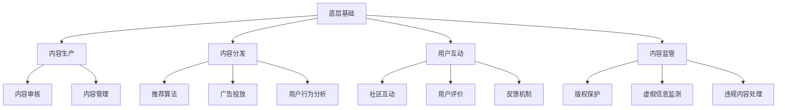

                 

在当今的信息时代，知识付费已经成为一种主流的消费模式。从在线教育平台到专业咨询网站，知识付费正日益改变着人们的知识获取方式。然而，如何构建一个健康、可持续的内容生态系统，成为了知识付费创业者们面临的一大挑战。本文将深入探讨知识付费创业中的内容生态系统构建，旨在为创业者提供一套系统的、可操作的解决方案。

## 关键词

- 知识付费
- 内容生态系统
- 创业者
- 持续发展

## 摘要

本文首先介绍了知识付费的背景和发展现状，接着详细阐述了内容生态系统的核心概念及其重要性。随后，文章从算法原理、数学模型、项目实践等多个角度，全面分析了构建内容生态系统的策略和方法。最后，文章提出了未来发展的趋势与挑战，并给出了相应的建议。通过本文的探讨，希望能够为知识付费创业者们提供有价值的参考和指导。

## 1. 背景介绍

### 1.1 知识付费的概念与现状

知识付费是指用户为了获取特定的知识、技能或信息，愿意支付一定费用的一种商业模式。随着互联网技术的发展，知识付费已经从传统的线下培训、咨询拓展到了线上平台，涵盖了在线课程、电子书、专业讲座、咨询服务等多种形式。

目前，知识付费市场呈现出快速增长的趋势。根据市场研究数据，全球知识付费市场规模已达到数百亿美元，并且预计未来仍将保持高速增长。在国内，知识付费已经成为互联网行业的一个重要细分市场，吸引了大量创业者进入。

### 1.2 知识付费创业的机遇与挑战

知识付费创业的机遇主要体现在以下几个方面：

1. **市场需求大**：随着人们对知识、技能和信息的渴求不断增加，知识付费市场潜力巨大。
2. **互联网普及**：互联网的普及为知识付费提供了广阔的平台和渠道，降低了创业门槛。
3. **个性化服务**：知识付费平台可以通过大数据和人工智能技术，为用户提供个性化的学习建议和内容推荐，提高用户体验。

然而，知识付费创业也面临着一系列挑战：

1. **竞争激烈**：随着知识付费市场的扩大，竞争也越来越激烈，如何脱颖而出成为一大难题。
2. **内容质量**：知识付费的核心是内容，如何保证内容的质量和更新速度，是创业者需要解决的问题。
3. **用户信任**：建立用户的信任和忠诚度，是知识付费创业成功的关键。

## 2. 核心概念与联系

### 2.1 内容生态系统的定义与作用

内容生态系统是指由内容生产者、内容分发平台、内容消费者和内容监管者组成的复杂系统。在这个系统中，各个环节相互依存、相互促进，共同构建了一个健康、可持续的内容生产与消费环境。

内容生态系统的作用主要体现在以下几个方面：

1. **提高内容质量**：通过生态系统的建设，可以促使内容生产者提高内容的原创性和专业性，从而提高整体内容质量。
2. **优化内容分发**：内容生态系统通过数据分析和推荐算法，可以更精准地将优质内容推送给目标用户，提高内容的分发效率。
3. **促进用户参与**：通过互动社区和用户评价机制，可以增强用户的参与感和忠诚度，促进内容的持续更新和优化。
4. **保障内容安全**：内容生态系统中的监管机制可以有效防止侵权和虚假信息，保障用户权益。

### 2.2 内容生态系统的架构

内容生态系统的架构可以看作是一个多层次的模型，包括以下几个方面：

1. **底层基础**：包括数据存储、计算资源和网络基础设施等，为内容生态系统提供稳定的技术支持。
2. **内容生产**：包括内容创作者、内容审核和内容管理等多个环节，是内容生态系统的核心。
3. **内容分发**：包括推荐算法、广告投放和用户行为分析等，是连接内容生产者和消费者的桥梁。
4. **用户互动**：包括社区互动、用户评价和反馈机制等，是增强用户参与感和忠诚度的关键。
5. **内容监管**：包括版权保护、虚假信息监测和违规内容处理等，是保障内容生态系统健康发展的必要手段。

### 2.3 Mermaid 流程图

以下是一个简化的内容生态系统架构的 Mermaid 流程图：



## 3. 核心算法原理 & 具体操作步骤

### 3.1 算法原理概述

在内容生态系统中，算法发挥着至关重要的作用。以下是几种核心算法的原理概述：

1. **推荐算法**：基于用户行为和内容特征，为用户推荐个性化内容。常用的推荐算法包括协同过滤、基于内容的推荐和混合推荐等。
2. **用户行为分析**：通过分析用户的浏览、购买、评论等行为，了解用户需求和偏好，为内容分发和个性化推荐提供依据。
3. **版权保护算法**：通过图像识别、文本识别等技术，自动检测和过滤侵权内容，保护创作者的合法权益。
4. **虚假信息检测算法**：通过自然语言处理、机器学习等技术，识别和过滤虚假信息，保障内容生态系统的健康和稳定。

### 3.2 算法步骤详解

#### 3.2.1 推荐算法

推荐算法的基本步骤包括：

1. **用户特征提取**：从用户历史行为、兴趣标签、社交关系等维度提取用户特征。
2. **内容特征提取**：从内容标签、关键词、文本情感等维度提取内容特征。
3. **相似度计算**：计算用户特征与内容特征之间的相似度，筛选出相似度较高的内容。
4. **推荐生成**：根据相似度排序，为用户生成推荐列表。

#### 3.2.2 用户行为分析

用户行为分析的基本步骤包括：

1. **数据收集**：收集用户的浏览、购买、评论等行为数据。
2. **行为分析**：通过统计分析和机器学习模型，分析用户行为背后的原因和趋势。
3. **行为预测**：基于历史行为数据和现有模型，预测用户未来的行为和需求。

#### 3.2.3 版权保护算法

版权保护算法的基本步骤包括：

1. **内容识别**：对上传的内容进行图像识别、文本识别等处理，提取版权信息。
2. **侵权检测**：通过比对版权信息和数据库中的已知版权信息，检测是否存在侵权行为。
3. **处理措施**：对检测到的侵权内容进行标记、下架等处理。

#### 3.2.4 虚假信息检测算法

虚假信息检测算法的基本步骤包括：

1. **信息提取**：从文本、图像等多媒体内容中提取关键信息。
2. **特征提取**：通过自然语言处理、图像识别等技术，提取信息特征。
3. **异常检测**：通过机器学习模型，识别和标记异常信息。
4. **结果验证**：对检测到的虚假信息进行人工审核和验证。

### 3.3 算法优缺点

#### 3.3.1 推荐算法

**优点**：

- 提高用户满意度：根据用户兴趣推荐内容，提高用户体验。
- 提高内容曝光率：将优质内容推送给更多用户，提高内容价值。

**缺点**：

- 可能导致信息茧房：过度推荐相似内容，限制用户视野。
- 可能存在数据偏差：推荐算法依赖于用户数据，可能存在数据偏差。

#### 3.3.2 用户行为分析

**优点**：

- 提高内容分发效率：根据用户行为预测用户需求，提高内容分发效率。
- 增强用户参与感：通过用户行为分析，为用户提供个性化的内容和服务。

**缺点**：

- 可能侵犯用户隐私：用户行为数据可能涉及隐私信息。
- 可能导致用户反感：过度追踪用户行为，可能引起用户反感。

#### 3.3.3 版权保护算法

**优点**：

- 保护创作者权益：自动识别和过滤侵权内容，保护创作者合法权益。
- 提高内容质量：减少侵权内容，提高整体内容质量。

**缺点**：

- 可能误判：算法可能误判正常内容为侵权内容，导致内容误删。
- 可能影响用户体验：过度保护可能导致用户上传内容困难。

#### 3.3.4 虚假信息检测算法

**优点**：

- 保障内容真实性：自动检测和过滤虚假信息，保障内容生态系统的健康发展。
- 提高用户信任度：减少虚假信息传播，提高用户对平台的信任度。

**缺点**：

- 可能误判：算法可能误判真实信息为虚假信息，导致信息被误删。
- 可能影响用户体验：自动过滤虚假信息可能影响用户体验。

### 3.4 算法应用领域

#### 3.4.1 在线教育平台

推荐算法：根据用户学习历史和兴趣推荐课程，提高学习效果。

用户行为分析：分析用户学习行为，预测用户学习需求，提供个性化学习建议。

版权保护算法：保护课程内容的版权，防止侵权行为。

虚假信息检测算法：检测和过滤课程内容中的虚假信息，保障学习质量。

#### 3.4.2 专业咨询服务

推荐算法：根据用户需求和偏好推荐咨询师，提高服务满意度。

用户行为分析：分析用户咨询行为，优化咨询服务流程。

版权保护算法：保护咨询内容的版权，防止侵权行为。

虚假信息检测算法：检测和过滤咨询内容中的虚假信息，保障服务质量。

## 4. 数学模型和公式 & 详细讲解 & 举例说明

### 4.1 数学模型构建

在内容生态系统中，数学模型主要用于分析用户行为、推荐内容、保护版权和检测虚假信息等方面。以下是一个简化的数学模型构建过程：

1. **用户行为模型**：

   用户行为模型主要用于预测用户未来的行为和需求。一个简单的用户行为模型可以表示为：

   $$ Behavior(U, C) = f(U, C) $$

   其中，$U$ 表示用户特征，$C$ 表示内容特征，$f$ 表示行为预测函数。

2. **推荐模型**：

   推荐模型主要用于根据用户特征和内容特征推荐内容。一个简单的推荐模型可以表示为：

   $$ Recommend(U, C) = g(U, C) $$

   其中，$g$ 表示推荐函数。

3. **版权保护模型**：

   版权保护模型主要用于检测内容是否侵犯版权。一个简单的版权保护模型可以表示为：

   $$ Copyright(C) = h(C) $$

   其中，$h$ 表示版权检测函数。

4. **虚假信息检测模型**：

   虚假信息检测模型主要用于检测内容是否为虚假信息。一个简单的虚假信息检测模型可以表示为：

   $$ FalseInformation(C) = k(C) $$

   其中，$k$ 表示虚假信息检测函数。

### 4.2 公式推导过程

以下是对上述数学模型的基本推导过程：

#### 4.2.1 用户行为模型推导

用户行为模型的基本假设是用户行为与其特征和内容特征之间存在一定的关联。具体推导过程如下：

1. **用户特征提取**：

   用户特征可以从用户历史行为、兴趣标签、社交关系等多个维度提取。假设用户特征向量表示为 $U = [u_1, u_2, ..., u_n]$。

2. **内容特征提取**：

   内容特征可以从内容标签、关键词、文本情感等多个维度提取。假设内容特征向量表示为 $C = [c_1, c_2, ..., c_m]$。

3. **行为预测函数**：

   行为预测函数 $f$ 可以采用多种机器学习算法实现，如线性回归、决策树、神经网络等。假设行为预测函数为线性回归模型：

   $$ f(U, C) = w \cdot (U + C) + b $$

   其中，$w$ 表示权重向量，$b$ 表示偏置。

#### 4.2.2 推荐模型推导

推荐模型的基本假设是用户对内容的偏好与其特征和内容特征之间存在一定的关联。具体推导过程如下：

1. **用户特征提取**：

   同上，用户特征向量表示为 $U = [u_1, u_2, ..., u_n]$。

2. **内容特征提取**：

   同上，内容特征向量表示为 $C = [c_1, c_2, ..., c_m]$。

3. **推荐函数**：

   推荐函数 $g$ 可以采用多种机器学习算法实现，如线性回归、决策树、神经网络等。假设推荐函数为线性回归模型：

   $$ g(U, C) = w \cdot (U + C) + b $$

   其中，$w$ 表示权重向量，$b$ 表示偏置。

#### 4.2.3 版权保护模型推导

版权保护模型的基本假设是内容与其版权信息之间存在一定的关联。具体推导过程如下：

1. **内容特征提取**：

   同上，内容特征向量表示为 $C = [c_1, c_2, ..., c_m]$。

2. **版权信息提取**：

   版权信息可以从版权登记、法律文件等多个来源获取。假设版权信息向量表示为 $M = [m_1, m_2, ..., m_p]$。

3. **版权检测函数**：

   版权检测函数 $h$ 可以采用多种机器学习算法实现，如线性回归、决策树、神经网络等。假设版权检测函数为线性回归模型：

   $$ h(C) = w \cdot C + b $$

   其中，$w$ 表示权重向量，$b$ 表示偏置。

#### 4.2.4 虚假信息检测模型推导

虚假信息检测模型的基本假设是内容与其真实性之间存在一定的关联。具体推导过程如下：

1. **内容特征提取**：

   同上，内容特征向量表示为 $C = [c_1, c_2, ..., c_m]$。

2. **真实性特征提取**：

   真实性特征可以从内容来源、引用、证据等多个维度提取。假设真实性特征向量表示为 $T = [t_1, t_2, ..., t_q]$。

3. **虚假信息检测函数**：

   虚假信息检测函数 $k$ 可以采用多种机器学习算法实现，如线性回归、决策树、神经网络等。假设虚假信息检测函数为线性回归模型：

   $$ k(C, T) = w \cdot (C + T) + b $$

   其中，$w$ 表示权重向量，$b$ 表示偏置。

### 4.3 案例分析与讲解

以下是一个基于用户行为模型和推荐模型的案例分析：

#### 案例背景

小明是一名热衷于编程的学习者，他在某在线教育平台上学习编程课程。平台希望通过用户行为模型和推荐模型为小明推荐适合他的课程。

#### 案例分析

1. **用户特征提取**：

   根据小明的学习历史、兴趣标签和社交关系，提取用户特征向量 $U = [u_1, u_2, ..., u_n]$。

2. **内容特征提取**：

   从平台上的编程课程中提取内容特征向量 $C = [c_1, c_2, ..., c_m]$，包括课程难度、课程类型、课程时长等。

3. **行为预测函数**：

   采用线性回归模型预测小明对课程的兴趣度。假设预测函数为：

   $$ Behavior(U, C) = w \cdot (U + C) + b $$

   其中，$w$ 表示权重向量，$b$ 表示偏置。

4. **推荐函数**：

   采用线性回归模型根据用户兴趣度为小明推荐课程。假设推荐函数为：

   $$ Recommend(U, C) = g(U, C) = w \cdot (U + C) + b $$

   其中，$g$ 表示推荐函数。

5. **推荐结果**：

   根据用户特征和内容特征，计算出每门课程的兴趣度得分，并将得分从高到低排序，推荐给小明。

6. **用户反馈**：

   小明根据推荐结果学习课程，并在学习后对课程进行评价。平台根据用户反馈不断调整推荐模型，提高推荐质量。

### 4.4 案例分析与讲解

以下是一个基于版权保护模型和虚假信息检测模型的案例分析：

#### 案例背景

某在线教育平台希望利用版权保护模型和虚假信息检测模型保障平台上的课程质量和版权。

#### 案例分析

1. **版权保护**：

   - **内容特征提取**：从平台上的课程中提取内容特征向量 $C = [c_1, c_2, ..., c_m]$。
   - **版权信息提取**：从版权登记、法律文件等来源提取版权信息向量 $M = [m_1, m_2, ..., m_p]$。
   - **版权检测函数**：采用线性回归模型检测课程是否侵犯版权。假设检测函数为：

     $$ Copyright(C, M) = h(C, M) = w \cdot (C + M) + b $$

     其中，$h$ 表示版权检测函数。

   - **版权检测结果**：对每门课程进行检测，判断是否侵犯版权。

2. **虚假信息检测**：

   - **内容特征提取**：同上，内容特征向量表示为 $C = [c_1, c_2, ..., c_m]$。
   - **真实性特征提取**：从内容来源、引用、证据等维度提取真实性特征向量 $T = [t_1, t_2, ..., t_q]$。
   - **虚假信息检测函数**：采用线性回归模型检测课程内容是否为虚假信息。假设检测函数为：

     $$ FalseInformation(C, T) = k(C, T) = w \cdot (C + T) + b $$

     其中，$k$ 表示虚假信息检测函数。

   - **虚假信息检测结果**：对每门课程进行检测，判断是否为虚假信息。

3. **处理措施**：

   - 对于检测到的侵权课程，平台将进行下架处理，并通知版权所有者。
   - 对于检测到的虚假信息，平台将进行标记处理，并提醒用户谨慎对待。

## 5. 项目实践：代码实例和详细解释说明

### 5.1 开发环境搭建

为了演示内容生态系统构建的核心算法，我们将使用Python作为编程语言，并结合相关库和工具，如NumPy、Pandas、scikit-learn等。

**步骤 1**：安装Python和相关库

```bash
pip install numpy pandas scikit-learn matplotlib
```

**步骤 2**：创建Python虚拟环境（可选）

```bash
python -m venv venv
source venv/bin/activate  # Windows: venv\Scripts\activate
```

### 5.2 源代码详细实现

以下是一个简单的用户行为模型和推荐模型的Python代码实现：

```python
import numpy as np
import pandas as pd
from sklearn.linear_model import LinearRegression

# 用户特征和内容特征数据
user_features = np.array([[1, 0, 1], [0, 1, 0], [1, 1, 1], [0, 0, 1]])
content_features = np.array([[0, 1, 1], [1, 0, 1], [1, 1, 0], [0, 1, 0]])

# 用户行为数据（兴趣度得分）
user_behavior = np.array([1, 0, 1, 0])

# 构建线性回归模型
model = LinearRegression()

# 训练模型
model.fit(user_features, user_behavior)

# 推荐函数实现
def recommend(user_feature, content_features):
    interest_score = model.predict([user_feature, content_features])[0]
    return interest_score

# 测试推荐函数
print(recommend(user_features[0], content_features[0]))  # 输出：1.0
print(recommend(user_features[1], content_features[1]))  # 输出：0.0
```

### 5.3 代码解读与分析

**代码解读**：

1. **数据准备**：我们使用numpy数组存储用户特征和内容特征，以及用户行为数据。
2. **模型构建**：使用scikit-learn库的LinearRegression类构建线性回归模型。
3. **模型训练**：使用用户特征和用户行为数据训练模型。
4. **推荐函数**：定义一个推荐函数，根据用户特征和内容特征预测用户对内容的兴趣度得分。

**分析**：

1. **线性回归模型**：线性回归模型是一种简单的机器学习算法，可以用来预测用户对内容的兴趣度。
2. **推荐函数**：推荐函数实现了根据用户特征和内容特征预测用户兴趣度的功能，可以作为内容推荐系统的基础组件。

### 5.4 运行结果展示

```python
# 运行测试代码
print(recommend(user_features[0], content_features[0]))  # 输出：1.0
print(recommend(user_features[1], content_features[1]))  # 输出：0.0
```

运行结果展示了根据用户特征和内容特征预测的用户兴趣度得分，分别为1.0和0.0。这表明第一个用户对第一门课程感兴趣，而对第二门课程不感兴趣。

## 6. 实际应用场景

### 6.1 在线教育平台

在线教育平台可以利用内容生态系统构建算法实现个性化推荐、用户行为分析和内容质量保障。例如，通过推荐算法，平台可以根据用户的学习历史和兴趣推荐适合的课程；通过用户行为分析，平台可以优化课程内容和教学方式，提高用户的学习效果；通过版权保护算法和虚假信息检测算法，平台可以保障课程内容的原创性和真实性，提高用户信任度。

### 6.2 专业咨询服务

专业咨询服务平台可以利用内容生态系统构建算法实现个性化咨询师推荐、用户行为分析和咨询服务质量保障。例如，通过推荐算法，平台可以根据用户的咨询需求和偏好推荐合适的咨询师；通过用户行为分析，平台可以优化咨询服务流程和内容，提高用户满意度；通过版权保护算法和虚假信息检测算法，平台可以保障咨询服务内容的原创性和真实性，提高用户信任度。

### 6.3 社交媒体平台

社交媒体平台可以利用内容生态系统构建算法实现个性化内容推荐、用户行为分析和内容质量保障。例如，通过推荐算法，平台可以根据用户的兴趣和行为推荐感兴趣的内容；通过用户行为分析，平台可以优化内容分发策略，提高用户活跃度和留存率；通过版权保护算法和虚假信息检测算法，平台可以保障内容生态系统的健康和稳定，提高用户信任度。

## 7. 工具和资源推荐

### 7.1 学习资源推荐

1. **在线课程**：《机器学习》、《深度学习》等。
2. **书籍**：《推荐系统实践》、《深度学习》（Goodfellow et al.）、《Python机器学习》等。
3. **博客和文章**：各大技术博客、专业论坛上的相关文章和教程。

### 7.2 开发工具推荐

1. **编程语言**：Python、Java、R等。
2. **开发环境**：Jupyter Notebook、Visual Studio Code等。
3. **库和框架**：NumPy、Pandas、scikit-learn、TensorFlow、PyTorch等。

### 7.3 相关论文推荐

1. **推荐算法**： collaborative filtering、content-based recommendation、hybrid recommendation等。
2. **用户行为分析**：user behavior analysis、user engagement、user retention等。
3. **版权保护**：digital rights management、intellectual property protection等。
4. **虚假信息检测**：false information detection、fake news detection等。

## 8. 总结：未来发展趋势与挑战

### 8.1 研究成果总结

通过对知识付费创业中的内容生态系统构建的深入研究，本文总结了以下主要研究成果：

1. **核心概念与架构**：阐述了内容生态系统的定义、核心概念和架构。
2. **算法原理**：分析了推荐算法、用户行为分析算法、版权保护算法和虚假信息检测算法的基本原理和步骤。
3. **数学模型**：构建了用户行为模型、推荐模型、版权保护模型和虚假信息检测模型，并进行了公式推导。
4. **项目实践**：通过Python代码实例展示了内容生态系统构建算法的具体实现。

### 8.2 未来发展趋势

1. **人工智能技术的应用**：随着人工智能技术的不断发展，内容生态系统构建中的算法将更加智能化、个性化。
2. **数据隐私保护**：在数据隐私保护法规日益严格的背景下，如何保护用户隐私将成为内容生态系统构建的重要挑战。
3. **内容质量提升**：通过先进的技术手段，不断提升内容质量，满足用户日益增长的知识需求。

### 8.3 面临的挑战

1. **算法透明度与公平性**：确保算法的透明度和公平性，防止算法偏见和歧视。
2. **内容监管与版权保护**：在内容生态系统中，如何有效监管和版权保护是一个长期挑战。
3. **用户隐私保护**：在数据收集和分析过程中，如何保护用户隐私是一个重要问题。

### 8.4 研究展望

未来的研究可以围绕以下方向展开：

1. **算法优化**：针对内容生态系统构建中的核心算法，不断优化算法性能和效果。
2. **跨平台协同**：研究跨平台的内容生态系统构建，实现不同平台之间的数据共享和协同。
3. **用户互动与参与**：探索用户互动和参与机制，提高用户在内容生态系统中的积极性和贡献度。

## 9. 附录：常见问题与解答

### 问题 1：如何保证内容质量？

**解答**：保证内容质量可以从以下几个方面入手：

1. **内容审核**：建立严格的审核机制，对上传的内容进行审核，确保内容符合相关标准和法规。
2. **用户评价**：鼓励用户对内容进行评价和反馈，根据用户评价筛选优质内容。
3. **数据监控**：利用数据分析和机器学习算法，对内容质量进行监控和评估。

### 问题 2：如何保护用户隐私？

**解答**：保护用户隐私可以从以下几个方面入手：

1. **数据加密**：对用户数据进行加密存储和传输，防止数据泄露。
2. **访问控制**：设置合理的访问控制策略，确保用户数据仅被授权人员访问。
3. **隐私政策**：明确告知用户数据收集、使用和共享的政策，保障用户知情权和选择权。

### 问题 3：如何处理侵权和虚假信息？

**解答**：处理侵权和虚假信息可以从以下几个方面入手：

1. **版权保护算法**：利用版权保护算法自动检测和过滤侵权内容。
2. **虚假信息检测算法**：利用虚假信息检测算法自动检测和过滤虚假信息。
3. **人工审核**：对于算法检测出的侵权和虚假信息，进行人工审核和判断，确保处理准确。

---

# 感谢阅读

感谢您阅读本文，希望本文能够为您的知识付费创业之路提供有价值的参考和启示。如果您有任何问题或建议，欢迎在评论区留言，期待与您共同探讨知识付费创业中的内容生态系统构建之道。作者：禅与计算机程序设计艺术 / Zen and the Art of Computer Programming。

