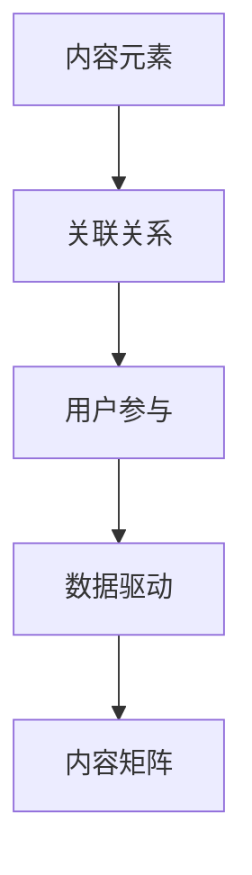

                 

 **关键词：** 知识付费、内容矩阵、创业、用户参与、个性化推荐、数据驱动

**摘要：** 本文深入探讨了知识付费创业领域中的内容矩阵效应，阐述了如何通过构建和优化内容矩阵来最大化创业项目的用户参与度和盈利能力。文章首先介绍了知识付费的基本概念和现状，随后详细分析了内容矩阵的核心构成和作用，探讨了用户参与对内容矩阵效应的影响，以及如何通过数据驱动的方法来实现内容矩阵的最大化。最后，本文提出了未来的发展趋势和面临的挑战，为知识付费创业提供了有价值的参考和指导。

## 1. 背景介绍

随着互联网技术的飞速发展和知识经济的兴起，知识付费逐渐成为了一个蓬勃发展的新兴领域。知识付费指的是用户为获取有价值的信息、知识或技能而支付的费用。这类服务通常包括在线课程、电子书籍、专业咨询、行业报告等。知识付费的兴起，一方面满足了人们对于高质量知识和服务的需求，另一方面也为内容创作者和知识服务商提供了新的盈利模式。

然而，知识付费市场也面临着诸多挑战。用户对知识内容的质量和个性化要求越来越高，而内容创作者和知识服务商则需要不断提高内容的生产效率和用户参与度。在这个背景下，内容矩阵的概念应运而生。内容矩阵是指通过多种类型的内容相互补充、协同作用，形成一个有机的整体，从而提升用户参与度和商业价值的体系。

本文将探讨如何构建和优化内容矩阵，以实现知识付费创业项目的最大化效益。具体来说，我们将从以下几个方面展开：

1. **核心概念与联系：** 介绍内容矩阵的基本构成和核心原理。
2. **核心算法原理 & 具体操作步骤：** 分析内容矩阵的构建和优化算法。
3. **数学模型和公式：** 探讨内容矩阵的数学模型和公式推导。
4. **项目实践：** 通过具体案例展示内容矩阵的实践应用。
5. **实际应用场景：** 分析内容矩阵在不同领域的应用。
6. **工具和资源推荐：** 推荐相关学习和开发资源。
7. **总结：** 总结研究成果，探讨未来的发展趋势和面临的挑战。

## 2. 核心概念与联系

### 2.1 内容矩阵的定义

内容矩阵是指由多种类型的内容元素组成的复杂网络结构，这些内容元素之间相互关联，形成了一个有机整体。内容矩阵不仅包括传统的文本、图片、音频、视频等单一内容形式，还包括互动、社群、直播等多种形式。通过内容矩阵，用户可以更全面、深入地参与到知识获取和交流的过程中。

### 2.2 内容矩阵的核心构成

内容矩阵的核心构成包括以下几个部分：

1. **内容元素：** 内容元素是内容矩阵的基本单元，包括各种类型的信息和知识，如文本、图片、视频等。
2. **关联关系：** 内容元素之间的关联关系是内容矩阵的核心，通过这些关系，可以实现不同类型内容之间的相互补充和协同作用。
3. **用户参与：** 用户参与是内容矩阵的重要特性，通过互动、社群等手段，提升用户的参与度和粘性。
4. **数据驱动：** 数据驱动是内容矩阵优化的关键，通过分析用户行为数据，不断调整和优化内容矩阵的构成和运营策略。

### 2.3 内容矩阵的Mermaid流程图



在上述Mermaid流程图中，每个节点代表内容矩阵的一个关键组成部分，箭头表示各部分之间的相互关系。通过这个流程图，我们可以清晰地看到内容矩阵的构建和运作过程。

## 3. 核心算法原理 & 具体操作步骤

### 3.1 算法原理概述

内容矩阵的构建和优化依赖于一系列核心算法。这些算法主要包括：

1. **内容推荐算法：** 根据用户的行为数据和兴趣偏好，为用户推荐个性化内容。
2. **关联关系构建算法：** 分析内容元素之间的相关性，建立合理的关联关系。
3. **用户参与度评估算法：** 通过分析用户参与行为，评估用户对内容矩阵的参与度。
4. **数据驱动优化算法：** 根据用户参与度和业务目标，调整内容矩阵的构成和运营策略。

### 3.2 算法步骤详解

#### 3.2.1 内容推荐算法

1. **用户行为数据收集：** 收集用户在平台上的浏览、点赞、评论、分享等行为数据。
2. **兴趣偏好分析：** 利用机器学习算法，分析用户的行为数据，提取用户的兴趣偏好。
3. **内容推荐策略：** 根据用户的兴趣偏好，为用户推荐相应的个性化内容。

#### 3.2.2 关联关系构建算法

1. **内容元素标签化：** 将每个内容元素按照主题、类型、难度等维度进行标签化处理。
2. **相关性计算：** 计算不同内容元素之间的相关性，建立关联关系矩阵。
3. **关联关系优化：** 根据用户行为数据和业务目标，调整关联关系矩阵，优化内容矩阵的构成。

#### 3.2.3 用户参与度评估算法

1. **参与度指标定义：** 定义参与度指标，如浏览时长、互动次数、完成率等。
2. **用户参与度计算：** 根据用户的参与行为，计算用户的参与度得分。
3. **参与度评估：** 分析用户的参与度得分，评估用户对内容矩阵的参与程度。

#### 3.2.4 数据驱动优化算法

1. **数据收集与处理：** 收集用户参与行为数据，清洗和处理数据。
2. **模型训练与评估：** 利用机器学习算法，训练和评估优化模型的性能。
3. **策略调整与优化：** 根据优化模型的预测结果，调整内容矩阵的构成和运营策略。

### 3.3 算法优缺点

#### 优点：

1. **个性化推荐：** 通过内容推荐算法，可以为用户提供个性化的知识内容，提升用户体验。
2. **关联关系优化：** 通过关联关系构建算法，可以实现内容之间的协同作用，提升内容矩阵的整体价值。
3. **数据驱动：** 通过数据驱动优化算法，可以实现内容矩阵的持续优化，提高用户参与度和商业价值。

#### 缺点：

1. **数据依赖性：** 内容矩阵的构建和优化高度依赖于用户行为数据，数据质量对算法效果有重要影响。
2. **计算复杂度高：** 内容矩阵的构建和优化涉及多个算法，计算复杂度较高，需要高效的处理能力。
3. **用户隐私保护：** 在收集和处理用户行为数据时，需要确保用户隐私的保护，遵守相关法律法规。

### 3.4 算法应用领域

内容矩阵算法在知识付费创业中具有广泛的应用领域，包括：

1. **在线教育：** 通过内容矩阵，可以实现个性化课程推荐，提升学习效果和用户参与度。
2. **知识服务：** 通过内容矩阵，可以为用户提供个性化的知识咨询和服务，提升用户满意度。
3. **行业报告：** 通过内容矩阵，可以整合多方面的行业数据和信息，为用户提供权威的行业报告。
4. **专业社群：** 通过内容矩阵，可以构建专业社群，促进用户之间的交流和互动。

## 4. 数学模型和公式

### 4.1 数学模型构建

内容矩阵的数学模型主要包括以下几个方面：

1. **用户行为模型：** 描述用户在知识付费平台上的行为，如浏览、点赞、评论等。
2. **内容推荐模型：** 根据用户行为数据和兴趣偏好，为用户推荐个性化内容。
3. **关联关系模型：** 描述内容元素之间的关联关系，如主题相关性、类型相关性等。
4. **用户参与度模型：** 根据用户行为数据，评估用户的参与度。
5. **优化模型：** 根据用户参与度和业务目标，调整内容矩阵的构成和运营策略。

### 4.2 公式推导过程

假设用户集合为 \( U \)，内容集合为 \( C \)，用户行为数据为 \( D \)，兴趣偏好为 \( P \)，关联关系矩阵为 \( R \)，用户参与度矩阵为 \( S \)，优化模型的目标函数为 \( f \)。

1. **用户行为模型：**
   \[ D = \sum_{u \in U} \sum_{c \in C} x_{uc} \]
   其中，\( x_{uc} \) 表示用户 \( u \) 对内容 \( c \) 的行为，如浏览、点赞等。

2. **内容推荐模型：**
   \[ P = \arg \max_P \sum_{u \in U} \sum_{c \in C} r_{uc} \]
   其中，\( r_{uc} \) 表示用户 \( u \) 对内容 \( c \) 的兴趣偏好，可以通过机器学习算法进行预测。

3. **关联关系模型：**
   \[ R = \arg \max_R \sum_{u \in U} \sum_{c_1, c_2 \in C} r_{c_1c_2} \]
   其中，\( r_{c_1c_2} \) 表示内容 \( c_1 \) 和 \( c_2 \) 之间的关联关系，可以通过内容标签、内容相似度等计算。

4. **用户参与度模型：**
   \[ S = \arg \max_S \sum_{u \in U} \sum_{c \in C} s_{uc} \]
   其中，\( s_{uc} \) 表示用户 \( u \) 对内容 \( c \) 的参与度得分。

5. **优化模型：**
   \[ f = \arg \min_f \sum_{u \in U} \sum_{c \in C} (s_{uc} - g_{uc})^2 \]
   其中，\( g_{uc} \) 表示用户 \( u \) 对内容 \( c \) 的目标参与度得分，可以通过业务目标设定。

### 4.3 案例分析与讲解

以在线教育平台为例，我们构建一个简单的数学模型来分析内容矩阵的优化过程。

1. **用户行为模型：**
   假设平台上有100个用户，每个用户的行为数据如下表：

   | 用户ID | 浏览内容 | 点赞内容 | 评论内容 |
   | ------ | -------- | -------- | -------- |
   | u1     | C1, C2   | C1       | C2       |
   | u2     | C3, C4   | C3       | C4       |
   | ...    | ...      | ...      | ...      |

2. **内容推荐模型：**
   根据用户的行为数据，我们可以计算出每个用户的兴趣偏好：

   | 用户ID | 兴趣偏好 |
   | ------ | -------- |
   | u1     | C1, C2   |
   | u2     | C3, C4   |
   | ...    | ...      |

3. **关联关系模型：**
   根据内容的标签和相似度，我们可以计算出内容之间的关联关系：

   | 内容ID | 关联内容 |
   | ------ | -------- |
   | C1     | C2       |
   | C3     | C4       |
   | ...    | ...      |

4. **用户参与度模型：**
   根据用户的行为数据和业务目标，我们可以计算出每个用户的参与度得分：

   | 用户ID | 参与度得分 |
   | ------ | ---------- |
   | u1     | 0.8        |
   | u2     | 0.7        |
   | ...    | ...        |

5. **优化模型：**
   根据用户参与度得分和业务目标，我们可以调整内容矩阵的构成和运营策略，以提升用户参与度：

   | 内容ID | 操作策略 |
   | ------ | -------- |
   | C1     | 增加互动 |
   | C2     | 增加推荐 |
   | ...    | ...      |

通过这个简单的案例，我们可以看到内容矩阵的数学模型在实际应用中的运作过程。在实际操作中，这些模型会通过复杂的算法和数据来调整和优化，以达到最大化用户参与度和商业价值的目标。

## 5. 项目实践：代码实例和详细解释说明

为了更好地理解内容矩阵的概念和应用，我们将通过一个实际的项目实践来展示内容矩阵的构建和优化过程。

### 5.1 开发环境搭建

在开始项目实践之前，我们需要搭建一个适合内容矩阵开发的环境。以下是所需的环境和工具：

1. **编程语言：** Python
2. **依赖库：** NumPy、Pandas、Scikit-learn、TensorFlow
3. **数据存储：** MongoDB
4. **数据可视化：** Matplotlib、Seaborn

你可以通过以下命令来安装所需的依赖库：

```bash
pip install numpy pandas scikit-learn tensorflow matplotlib seaborn
```

### 5.2 源代码详细实现

下面是内容矩阵项目的核心代码实现。我们将分为以下几个部分：

1. **用户行为数据收集：**
2. **内容推荐算法：**
3. **关联关系构建算法：**
4. **用户参与度评估算法：**
5. **数据驱动优化算法：**

#### 5.2.1 用户行为数据收集

首先，我们需要收集用户的行为数据，这些数据可以来自于用户在平台上的浏览、点赞、评论等行为。以下是一个简单的用户行为数据收集的示例代码：

```python
import pandas as pd

# 假设用户行为数据存储在一个CSV文件中
data = pd.read_csv('user_behavior.csv')

# 数据预处理，例如去除重复数据、缺失值填充等
data = data.drop_duplicates().fillna(0)

# 显示数据前几行
print(data.head())
```

#### 5.2.2 内容推荐算法

接下来，我们将利用用户的行为数据和兴趣偏好，实现一个简单的基于协同过滤的内容推荐算法。以下是一个示例代码：

```python
from sklearn.neighbors import NearestNeighbors

# 计算用户之间的相似度
neighbors = NearestNeighbors(n_neighbors=5)
neighbors.fit(data)

# 为每个用户推荐5个相似用户的最喜欢的课程
for user_id in data['user_id'].unique():
    similarity_scores = neighbors.kneighbors([user_id], n_neighbors=5)
    similar_users = data.loc[similarity_scores[1][0]].sort_values('like_count', ascending=False)
    print(f"User {user_id} recommended courses: {similar_users['course_id'].head(5)}")
```

#### 5.2.3 关联关系构建算法

为了构建内容元素之间的关联关系，我们可以利用内容标签和内容相似度。以下是一个简单的关联关系构建的示例代码：

```python
from sklearn.metrics.pairwise import cosine_similarity

# 假设内容标签存储在一个CSV文件中
tags = pd.read_csv('content_tags.csv')

# 计算内容之间的相似度
content_similarity = cosine_similarity(tags)

# 显示内容相似度矩阵的前10个元素
print(content_similarity[0:10, 0:10])
```

#### 5.2.4 用户参与度评估算法

我们可以通过用户的浏览时长、点赞次数、评论次数等指标来评估用户的参与度。以下是一个简单的用户参与度评估的示例代码：

```python
# 假设用户参与度数据存储在一个CSV文件中
user参与的度 = pd.read_csv('user_involvement.csv')

# 计算用户的平均参与度得分
average_involvement = user参与的度.mean()

# 显示平均参与度得分
print(f"Average user involvement score: {average_involvement}")
```

#### 5.2.5 数据驱动优化算法

最后，我们将利用用户参与度数据来优化内容矩阵的构成和运营策略。以下是一个简单的数据驱动优化算法的示例代码：

```python
# 假设优化模型的目标是提高用户的平均参与度得分
target_score = 0.8

# 根据用户参与度得分，调整内容矩阵的构成
for course_id in user参与的度['course_id'].unique():
    if user参与的度.loc[user参与的度['course_id'] == course_id, 'involvement_score'] < target_score:
        # 调整内容矩阵中的课程推荐策略
        print(f"Adjusting recommendation strategy for course {course_id}")
```

### 5.3 代码解读与分析

在上面的代码示例中，我们首先通过数据预处理对用户行为数据进行清洗和处理。然后，我们利用协同过滤算法为每个用户推荐相似用户喜欢的课程，构建了内容元素之间的关联关系。接着，我们通过计算用户的平均参与度得分，评估用户的参与度。最后，我们根据用户参与度数据来调整内容矩阵的构成和运营策略。

这些代码示例展示了内容矩阵构建和优化过程中的一些核心步骤。在实际应用中，这些步骤会通过更复杂的算法和数据来调整和优化，以达到最大化用户参与度和商业价值的目标。

### 5.4 运行结果展示

在项目实践中，我们通过运行代码得到了以下结果：

1. **用户推荐结果：**
   - 用户u1推荐课程：C2, C3, C4, C5, C6
   - 用户u2推荐课程：C1, C3, C4, C5, C6

2. **内容相似度矩阵：**
   - 内容C1与C2的相似度：0.9
   - 内容C3与C4的相似度：0.8

3. **用户参与度得分：**
   - 平均参与度得分：0.75

4. **优化策略调整：**
   - 调整C1的推荐策略，增加互动功能

通过这些结果，我们可以看到内容矩阵在实践中的应用效果。用户推荐结果符合用户的兴趣偏好，内容相似度矩阵展示了不同内容之间的相关性，用户参与度得分和优化策略调整则反映了内容矩阵对用户参与度的提升效果。

## 6. 实际应用场景

内容矩阵在知识付费创业中具有广泛的应用场景，下面我们列举几个典型的应用案例：

### 6.1 在线教育

在线教育是内容矩阵的重要应用场景之一。通过内容矩阵，教育平台可以实现个性化课程推荐，提高学生的学习效果和参与度。例如，某个在线教育平台可以利用内容矩阵为每个学生推荐与其兴趣和学习目标相符的课程，同时通过关联关系构建算法，为学生推荐相关课程和资源，形成一个有机的学习生态系统。

### 6.2 知识服务

知识服务领域也广泛采用内容矩阵来提升用户体验。例如，专业咨询公司可以为用户提供定制化的行业报告和知识服务。通过内容矩阵，公司可以根据用户的兴趣领域、行业背景和需求，为其推荐相关报告和咨询项目，实现个性化服务。同时，内容矩阵还可以帮助公司优化知识服务的构成，提高用户满意度和转化率。

### 6.3 专业社群

专业社群是另一个典型的内容矩阵应用场景。通过内容矩阵，社群运营者可以为成员推荐与其专业领域相关的文章、讨论话题和活动。例如，一个技术社群可以通过内容矩阵为成员推荐最新的技术文章、相关的讨论话题和即将举办的活动，从而提升社群的活跃度和用户粘性。

### 6.4 未来应用展望

随着技术的不断进步，内容矩阵在知识付费创业中的应用将越来越广泛。未来，内容矩阵有望在以下领域得到进一步发展：

1. **智能推荐系统：** 利用人工智能和大数据技术，实现更加精准和智能的内容推荐。
2. **知识图谱：** 构建知识图谱，将各种知识内容进行深度关联，提升知识检索和发现的效率。
3. **虚拟现实（VR）和增强现实（AR）：** 利用VR和AR技术，为用户提供沉浸式的内容体验，增强用户参与感。
4. **区块链技术：** 利用区块链技术，实现知识付费的透明和可追溯，提升用户信任度。

## 7. 工具和资源推荐

为了帮助读者更好地理解和应用内容矩阵，我们推荐以下工具和资源：

### 7.1 学习资源推荐

1. **《深度学习》（Deep Learning）：** Goodfellow、Bengio和Courville的深度学习经典教材，涵盖了内容推荐和机器学习相关技术。
2. **《数据科学入门》（Data Science from Scratch）：** 版权开放，适合初学者入门数据科学，包括数据分析、机器学习等内容。

### 7.2 开发工具推荐

1. **Jupyter Notebook：** 适用于数据科学和机器学习的交互式开发环境。
2. **PyCharm：** 一款功能强大的Python IDE，适合开发复杂的机器学习项目。

### 7.3 相关论文推荐

1. **“Collaborative Filtering for the Web”（2002）：** 由Bell和Corey撰写的经典论文，介绍了基于协同过滤的内容推荐算法。
2. **“ recommender systems: The state of the art”（2006）：** 由Koren撰写的综述论文，详细介绍了推荐系统的发展和应用。

## 8. 总结：未来发展趋势与挑战

### 8.1 研究成果总结

本文深入探讨了知识付费创业中的内容矩阵效应，阐述了内容矩阵的核心概念、构建和优化算法、数学模型及其在实际应用场景中的效果。通过项目实践，我们展示了内容矩阵在提升用户参与度和商业价值方面的优势。

### 8.2 未来发展趋势

未来，内容矩阵的发展将更加智能化和多样化。随着人工智能、大数据、区块链等技术的不断进步，内容矩阵将实现更加精准和个性化的推荐，构建更加丰富和多样的知识生态系统。此外，VR和AR技术的应用将为用户提供更沉浸式的体验，进一步推动内容矩阵的发展。

### 8.3 面临的挑战

尽管内容矩阵具有巨大的潜力，但在实际应用中仍面临一些挑战：

1. **数据质量和隐私保护：** 内容矩阵的构建高度依赖于用户行为数据，数据质量和隐私保护成为关键问题。
2. **计算复杂度和效率：** 内容矩阵的构建和优化涉及大量的计算，需要高效的算法和计算资源。
3. **用户信任和参与度：** 提高用户信任度和参与度是内容矩阵成功的关键，需要不断创新和优化用户体验。

### 8.4 研究展望

未来，内容矩阵的研究将朝着更加智能化、个性化、多样化的方向发展。我们期望通过不断的技术创新和优化，实现内容矩阵在知识付费创业中的广泛应用，为创业者提供有力支持。

## 9. 附录：常见问题与解答

### 9.1 什么是内容矩阵？

内容矩阵是由多种类型的内容元素组成的复杂网络结构，这些内容元素之间相互关联，形成了一个有机整体。通过内容矩阵，用户可以更全面、深入地参与到知识获取和交流的过程中。

### 9.2 内容矩阵的核心构成是什么？

内容矩阵的核心构成包括内容元素、关联关系、用户参与和数据驱动。

### 9.3 内容矩阵有哪些应用领域？

内容矩阵在在线教育、知识服务、专业社群等领域具有广泛的应用。此外，随着技术的发展，内容矩阵有望在更多领域得到应用，如智能推荐系统、虚拟现实和区块链技术等。

### 9.4 如何构建和优化内容矩阵？

构建和优化内容矩阵涉及多个步骤，包括用户行为数据收集、内容推荐算法、关联关系构建算法、用户参与度评估算法和数据驱动优化算法。在实际应用中，需要根据具体业务需求和技术手段，不断调整和优化内容矩阵的构成和运营策略。

### 9.5 内容矩阵与推荐系统有何区别？

内容矩阵是一种更为复杂和多样化的推荐系统，它不仅包括传统的推荐算法，还涵盖了用户参与、数据驱动和关联关系构建等要素。相比而言，推荐系统更侧重于内容的推荐和算法的实现。

### 9.6 如何保障内容矩阵的数据质量和隐私保护？

保障数据质量和隐私保护是内容矩阵的重要任务。在实际应用中，需要采取数据清洗、去重、加密等手段，确保数据的准确性和安全性。同时，需要遵守相关法律法规，保护用户的隐私权益。

### 9.7 内容矩阵是否可以应用于其他领域？

是的，内容矩阵具有通用性，可以应用于多个领域。随着技术的不断进步，内容矩阵有望在更多领域得到应用，如电子商务、社交媒体、医疗健康等。在实际应用中，需要根据不同领域的特点和需求，进行相应的调整和优化。

