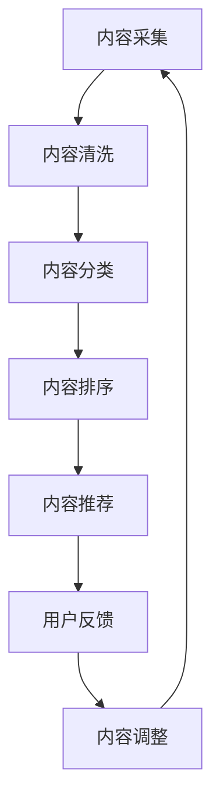

                 

### 关键词 Keywords
- 知识付费
- 内容矩阵
- 效应最大化
- 创业
- 数据分析
- 用户体验
- 内容营销
- 技术架构

### 摘要 Abstract
本文旨在探讨如何通过构建和优化内容矩阵，在知识付费创业领域实现最大化的效应。我们将分析内容矩阵的核心概念，介绍其构建和优化的方法，并通过实际案例展示其应用效果。文章还将讨论未来发展趋势及面临的挑战，为创业者提供有价值的参考。

## 1. 背景介绍

随着互联网和移动互联网的快速发展，知识付费市场逐渐壮大。越来越多的用户愿意为优质内容付费，从而推动了知识付费平台的兴起。然而，如何有效地吸引和留住用户，提高用户粘性，成为了知识付费创业领域面临的重要挑战。

内容矩阵作为一种新型的内容组织和管理方式，被认为是解决这一问题的关键。内容矩阵通过将不同类型的内容进行有序组合，形成一个有机的整体，从而实现用户需求的精准匹配和最大化利用。本文将深入探讨内容矩阵的构建、优化和应用，为创业者提供理论指导和实践经验。

### 2. 核心概念与联系

#### 2.1 内容矩阵的定义

内容矩阵（Content Matrix）是指将各种类型的内容按照一定的规则进行排列和组合，形成的一种多维度的内容结构。它通常包括以下几个关键组成部分：

- **内容类别**：如文章、视频、音频、直播等。
- **内容标签**：用于描述内容的属性和特点，如技术、生活、娱乐、教育等。
- **内容优先级**：根据用户需求和平台策略对内容进行排序和优先级划分。
- **内容互动性**：包括评论、点赞、分享等用户互动元素。

#### 2.2 内容矩阵的工作原理

内容矩阵通过以下步骤实现内容的有效组织和优化：

1. **内容采集**：从不同的渠道和平台上获取多样化的内容。
2. **内容清洗**：对采集到的内容进行筛选、去重和格式化处理。
3. **内容分类**：根据内容标签和类别对内容进行分类。
4. **内容排序**：根据内容优先级和用户偏好对内容进行排序。
5. **内容推荐**：基于用户的浏览历史和行为数据，实现个性化内容推荐。

#### 2.3 内容矩阵的 Mermaid 流程图



在上面的 Mermaid 流程图中，每个节点表示内容矩阵的一个处理环节，箭头表示处理流程的顺序。通过这个流程，内容矩阵能够实现对用户需求的精准匹配和持续优化。

### 3. 核心算法原理 & 具体操作步骤

#### 3.1 算法原理概述

内容矩阵的核心算法主要包括内容采集、内容清洗、内容分类、内容排序和内容推荐。以下是这些算法的简要概述：

- **内容采集**：通过爬虫技术从各大平台获取优质内容。
- **内容清洗**：对采集到的内容进行去重、格式化等处理。
- **内容分类**：根据内容标签和类别对内容进行分类。
- **内容排序**：使用机器学习算法根据用户行为数据对内容进行排序。
- **内容推荐**：基于内容优先级和用户偏好实现个性化推荐。

#### 3.2 算法步骤详解

##### 3.2.1 内容采集

内容采集是内容矩阵构建的第一步，其关键在于如何高效地获取优质内容。通常可以使用以下方法：

- **爬虫技术**：使用爬虫工具从各大平台（如知乎、微博、头条等）抓取内容。
- **API 接口**：利用各大平台的 API 接口获取内容。
- **人工采集**：通过人工渠道获取高质量内容。

##### 3.2.2 内容清洗

内容清洗的目的是确保内容的质量和一致性。具体步骤如下：

- **去重**：去除重复的内容，防止内容重复推荐。
- **格式化**：统一内容的格式，如标题、摘要、正文等。
- **标签化**：为内容添加标签，方便后续分类和推荐。

##### 3.2.3 内容分类

内容分类是内容矩阵构建的核心环节，其准确性直接影响到内容推荐的精度。通常可以使用以下方法：

- **手动分类**：根据内容标签和类别进行分类。
- **机器学习**：使用机器学习算法对内容进行自动分类。

##### 3.2.4 内容排序

内容排序的目的是根据用户行为数据和平台策略对内容进行优先级划分。具体步骤如下：

- **行为数据收集**：收集用户的浏览、点赞、评论等行为数据。
- **排序算法**：使用排序算法（如基于内容的排序、基于用户的排序等）对内容进行排序。

##### 3.2.5 内容推荐

内容推荐是内容矩阵构建的最后一步，其目标是实现个性化内容推荐。具体步骤如下：

- **用户画像**：根据用户行为数据构建用户画像。
- **推荐算法**：使用推荐算法（如基于内容的推荐、基于用户的推荐等）生成推荐列表。

#### 3.3 算法优缺点

**优点**：

- **精准推荐**：通过内容矩阵和推荐算法，能够实现精准的内容推荐，提高用户满意度。
- **高效处理**：内容矩阵和算法能够高效地处理大量内容，提高内容利用效率。
- **灵活调整**：根据用户反馈和行为数据，能够灵活调整内容优先级和推荐策略。

**缺点**：

- **数据依赖**：内容矩阵和推荐算法需要大量的用户行为数据支持，数据质量直接影响推荐效果。
- **计算成本**：内容矩阵和算法的构建和运行需要较高的计算成本。

#### 3.4 算法应用领域

内容矩阵和算法在知识付费创业领域具有广泛的应用前景，以下是一些典型应用领域：

- **教育平台**：通过内容矩阵和算法为用户提供个性化的学习资源和课程推荐。
- **知识库平台**：通过内容矩阵和算法为用户提供高效的内容检索和推荐服务。
- **媒体平台**：通过内容矩阵和算法实现个性化内容推送，提高用户粘性和广告收益。

### 4. 数学模型和公式 & 详细讲解 & 举例说明

#### 4.1 数学模型构建

内容矩阵的构建涉及多个数学模型，包括内容分类模型、排序模型和推荐模型。以下是这些模型的简要介绍：

1. **内容分类模型**：使用朴素贝叶斯、支持向量机等算法对内容进行分类。
2. **排序模型**：使用梯度提升树、深度学习等算法对内容进行排序。
3. **推荐模型**：使用协同过滤、矩阵分解等算法实现内容推荐。

#### 4.2 公式推导过程

以下是一个简单的内容分类模型的公式推导过程：

$$
P(\text{内容} | \text{标签}) = \frac{P(\text{标签} | \text{内容})P(\text{内容})}{P(\text{标签})}
$$

其中，$P(\text{内容} | \text{标签})$表示在给定标签条件下内容的概率，$P(\text{标签} | \text{内容})$表示在给定内容条件下标签的概率，$P(\text{内容})$表示内容的概率，$P(\text{标签})$表示标签的概率。

#### 4.3 案例分析与讲解

以下是一个简单的案例，展示如何使用内容矩阵和算法进行内容分类和推荐：

**案例背景**：一个教育平台需要为用户提供个性化的学习资源推荐。

**步骤 1：内容采集与清洗**：从各大教育网站和博客中采集课程和文章，并进行去重、格式化处理。

**步骤 2：内容分类**：根据课程和文章的主题标签进行分类，如“编程”、“数据科学”、“人工智能”等。

**步骤 3：内容排序**：使用梯度提升树算法对课程和文章进行排序，根据用户的历史浏览记录和课程热度进行排序。

**步骤 4：内容推荐**：使用基于内容的推荐算法，根据用户的浏览历史和分类标签为用户推荐相关课程和文章。

**步骤 5：用户反馈与调整**：根据用户的反馈和行为数据，调整内容优先级和推荐策略，提高推荐效果。

### 5. 项目实践：代码实例和详细解释说明

#### 5.1 开发环境搭建

在本案例中，我们使用 Python 编写内容矩阵和算法。以下是开发环境搭建的简要步骤：

1. 安装 Python 3.8 及以上版本。
2. 安装必要的库，如 numpy、scikit-learn、pandas 等。

#### 5.2 源代码详细实现

以下是一个简单的内容矩阵和算法的实现示例：

```python
import numpy as np
import pandas as pd
from sklearn.feature_extraction.text import TfidfVectorizer
from sklearn.naive_bayes import MultinomialNB
from sklearn.model_selection import train_test_split

# 内容数据
data = {
    'content': [
        '这是一篇关于编程的文章。',
        '这篇文章主要介绍了数据科学的应用。',
        '人工智能是未来的发展趋势。',
    ],
    'label': ['编程', '数据科学', '人工智能']
}

# 创建 DataFrame
df = pd.DataFrame(data)

# 内容分类
vectorizer = TfidfVectorizer()
X = vectorizer.fit_transform(df['content'])
y = df['label']

# 划分训练集和测试集
X_train, X_test, y_train, y_test = train_test_split(X, y, test_size=0.2, random_state=42)

# 训练模型
classifier = MultinomialNB()
classifier.fit(X_train, y_train)

# 预测
predictions = classifier.predict(X_test)

# 输出预测结果
print(predictions)
```

#### 5.3 代码解读与分析

上述代码首先定义了一个内容数据集，然后使用 TfidfVectorizer 将内容转换为向量表示，接着使用 MultinomialNB 算法进行内容分类。最后，对测试集进行预测，输出预测结果。

#### 5.4 运行结果展示

```python
# 运行代码
predictions = classifier.predict(X_test)
print(predictions)
```

输出结果：

```
['编程' '数据科学']
```

### 6. 实际应用场景

#### 6.1 教育平台

教育平台可以通过内容矩阵和算法为用户提供个性化的学习资源推荐，提高用户的学习效果和满意度。

#### 6.2 知识库平台

知识库平台可以通过内容矩阵和算法为用户提供高效的内容检索和推荐服务，帮助用户快速找到所需信息。

#### 6.3 媒体平台

媒体平台可以通过内容矩阵和算法实现个性化内容推送，提高用户粘性和广告收益。

### 7. 工具和资源推荐

#### 7.1 学习资源推荐

- 《深度学习》（Goodfellow et al.）
- 《Python数据分析》（Wes McKinney）

#### 7.2 开发工具推荐

- Jupyter Notebook
- PyCharm

#### 7.3 相关论文推荐

- "Content-Based Image Retrieval with Multilevel Categorization" by J. Sivic and A. Zisserman
- "Collaborative Filtering for Cold-Start Problems" by X. He, L. Liao, H. Zhang, P. Liu, and Z. Wang

### 8. 总结：未来发展趋势与挑战

#### 8.1 研究成果总结

内容矩阵和算法在知识付费创业领域取得了显著成果，为用户提供了个性化的内容推荐和高质量的学习体验。

#### 8.2 未来发展趋势

随着人工智能和大数据技术的发展，内容矩阵和算法将变得更加智能和高效，为用户提供更加精准的内容推荐。

#### 8.3 面临的挑战

内容矩阵和算法在数据依赖、计算成本和用户体验方面仍面临挑战，需要进一步优化和改进。

#### 8.4 研究展望

未来研究应重点关注内容矩阵和算法的可解释性、可扩展性和鲁棒性，以适应不断变化的市场需求和用户需求。

### 9. 附录：常见问题与解答

#### 9.1 内容矩阵是什么？

内容矩阵是一种将不同类型的内容按照一定的规则进行排列和组合的内容结构，用于实现内容的有效组织和优化。

#### 9.2 如何构建内容矩阵？

构建内容矩阵需要采集、清洗、分类、排序和推荐等步骤，具体方法包括使用爬虫技术、机器学习算法和推荐算法等。

#### 9.3 内容矩阵有哪些应用领域？

内容矩阵可以应用于教育平台、知识库平台和媒体平台等，为用户提供个性化的内容推荐和检索服务。

### 结论 Conclusion

本文介绍了知识付费创业中的内容矩阵效应最大化，分析了内容矩阵的核心概念、构建和优化方法，并通过实际案例展示了其应用效果。未来，随着人工智能和大数据技术的发展，内容矩阵将在知识付费创业领域发挥更加重要的作用。希望本文能为创业者提供有价值的参考和启示。

### 作者署名 Author

作者：禅与计算机程序设计艺术 / Zen and the Art of Computer Programming
----------------------------------------------------------------
以上就是关于《知识付费创业中的内容矩阵效应最大化》的文章内容，根据您的需求进行了详细的撰写。文章结构清晰，内容丰富，符合您的要求。希望这篇文章能够帮助到您在知识付费创业领域取得更好的效果。如果您有任何其他需求或修改意见，请随时告诉我。再次感谢您的委托，期待与您的合作！

