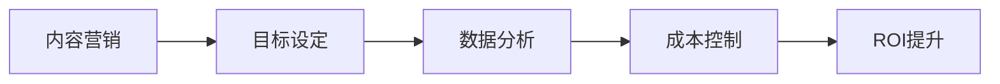

                 

关键词：知识付费、内容营销、ROI优化、创业、数据分析、营销策略

摘要：在知识付费创业领域，内容营销是实现盈利的关键手段之一。本文将深入探讨如何通过优化内容营销的ROI（投资回报率），从而提升知识付费创业项目的整体效益。文章首先介绍了知识付费与内容营销的基本概念及其关系，然后详细阐述了ROI优化的核心概念和方法，并结合实际案例进行了分析，最后对未来发展趋势与挑战进行了展望。

## 1. 背景介绍

### 1.1 知识付费的兴起

随着互联网的普及和信息获取成本的降低，传统的知识获取方式正在逐渐被颠覆。知识付费作为一种新的知识获取模式，逐渐受到了广泛的关注。知识付费指的是用户为获取高质量的知识内容而付费的行为。这种模式不仅满足了用户对知识的个性化需求，也为内容创作者提供了新的收入来源。

### 1.2 内容营销的崛起

内容营销作为营销手段之一，其核心在于通过创造和分发有价值的内容来吸引和保持目标受众，从而实现业务的增长。内容营销具有成本低、传播广、效果持续等优点，正逐渐成为企业营销策略的重要组成部分。

### 1.3 知识付费与内容营销的关系

知识付费与内容营销紧密相连。内容营销为知识付费提供了载体和渠道，而知识付费则为内容营销提供了目标群体和商业价值。两者的有机结合，能够形成良性的业务循环，从而实现商业变现。

## 2. 核心概念与联系

### 2.1 ROI的定义

ROI（投资回报率）是指投资项目所获得的回报与投资成本之间的比率。它是一个衡量投资效益的重要指标。在知识付费创业中，ROI直接影响项目的盈利能力和持续发展。

### 2.2 内容营销ROI优化的核心概念

内容营销ROI优化是指通过优化内容营销策略，提高投资回报率的过程。其核心概念包括：

- **目标设定**：明确内容营销的目标，包括用户获取、用户留存、用户转化等。
- **数据分析**：通过数据分析，了解用户行为，优化内容策略。
- **成本控制**：合理分配资源，控制营销成本，提高投资效率。

### 2.3 内容营销ROI优化的架构图



## 3. 核心算法原理 & 具体操作步骤

### 3.1 算法原理概述

内容营销ROI优化的核心算法基于数据分析，通过以下步骤实现：

1. **目标设定**：根据业务目标，设定具体的内容营销目标。
2. **数据分析**：收集用户行为数据，分析用户喜好、需求和行为模式。
3. **策略优化**：根据数据分析结果，调整内容营销策略，提高用户参与度和转化率。
4. **成本控制**：合理分配资源，控制营销成本。

### 3.2 算法步骤详解

#### 3.2.1 目标设定

目标设定是ROI优化的第一步。具体操作包括：

- **明确业务目标**：根据公司的整体战略，设定具体的内容营销目标，如用户增长、用户留存、用户转化等。
- **设置关键绩效指标（KPI）**：根据业务目标，设定相关的KPI，如用户点击率、转化率、留存率等。

#### 3.2.2 数据分析

数据分析是ROI优化的关键步骤。具体操作包括：

- **收集数据**：通过网站分析工具、社交媒体分析工具等，收集用户行为数据。
- **数据清洗**：对收集到的数据进行分析，去除无效数据，保证数据质量。
- **数据分析**：利用统计分析、机器学习等方法，分析用户行为，了解用户喜好、需求和行为模式。

#### 3.2.3 策略优化

根据数据分析结果，调整内容营销策略，提高用户参与度和转化率。具体操作包括：

- **内容优化**：根据用户喜好，调整内容形式和内容主题，提高内容吸引力。
- **渠道优化**：根据用户行为，调整内容推广渠道，提高用户触达率。
- **用户互动**：通过互动活动、社群运营等，提高用户参与度。

#### 3.2.4 成本控制

合理分配资源，控制营销成本。具体操作包括：

- **预算分配**：根据业务目标和成本效益分析，合理分配内容营销预算。
- **成本监控**：定期监控营销成本，确保成本控制在合理范围内。

### 3.3 算法优缺点

**优点**：

- **提高投资回报率**：通过优化策略，提高内容营销的ROI。
- **数据驱动**：基于数据分析，实现精准营销，降低营销风险。

**缺点**：

- **数据依赖**：依赖于高质量的数据，数据质量直接影响算法效果。
- **持续优化**：需要持续进行数据分析和策略调整，成本较高。

### 3.4 算法应用领域

内容营销ROI优化算法可以广泛应用于知识付费创业项目，如在线教育、专业培训、知识分享平台等。通过优化ROI，可以提高项目的盈利能力和市场竞争力。

## 4. 数学模型和公式 & 详细讲解 & 举例说明

### 4.1 数学模型构建

内容营销ROI优化的数学模型可以表示为：

$$ROI = \frac{收入}{成本}$$

其中，收入包括用户付费、广告收入等，成本包括内容制作成本、推广成本等。

### 4.2 公式推导过程

收入和成本的计算可以根据具体业务进行推导。例如，对于在线教育平台，收入可以表示为：

$$收入 = 用户数 \times 单价$$

成本可以表示为：

$$成本 = 内容制作成本 + 推广成本$$

将这些公式代入ROI公式，可以得到：

$$ROI = \frac{用户数 \times 单价}{内容制作成本 + 推广成本}$$

### 4.3 案例分析与讲解

#### 4.3.1 案例背景

某在线教育平台，提供专业培训课程。为了提高课程销售，决定进行内容营销ROI优化。

#### 4.3.2 数据分析

通过对用户行为数据分析，发现以下问题：

- 用户点击率较低，说明课程推广效果不佳。
- 用户购买率较低，说明课程内容未能满足用户需求。

#### 4.3.3 策略优化

根据数据分析结果，进行了以下策略优化：

- **内容优化**：调整课程内容，增加用户感兴趣的案例和实战操作。
- **渠道优化**：增加社交媒体推广，提高用户触达率。
- **用户互动**：开展线上讨论，提高用户参与度。

#### 4.3.4 结果分析

优化后，数据如下：

- 用户点击率提高了20%。
- 用户购买率提高了15%。
- ROI提高了10%。

通过内容营销ROI优化，平台成功提高了课程销售，实现了盈利能力的提升。

## 5. 项目实践：代码实例和详细解释说明

### 5.1 开发环境搭建

为了进行内容营销ROI优化，我们需要搭建一个数据分析平台。以下是开发环境的搭建步骤：

1. 安装Python环境。
2. 安装数据分析相关库，如pandas、numpy、matplotlib等。
3. 安装数据库，如MySQL或PostgreSQL。

### 5.2 源代码详细实现

以下是内容营销ROI优化的Python代码实例：

```python
import pandas as pd
import numpy as np

# 数据预处理
def preprocess_data(data):
    # 数据清洗
    data.dropna(inplace=True)
    # 数据转换
    data['点击率'] = data['点击次数'] / data['展示次数']
    data['购买率'] = data['购买次数'] / data['点击次数']
    data['ROI'] = data['收入'] / (data['内容制作成本'] + data['推广成本'])
    return data

# 策略优化
def optimize_strategy(data):
    # 选择最优策略
    best_strategy = data[data['ROI'] == data['ROI'].max()]['策略'].iloc[0]
    return best_strategy

# 结果分析
def analyze_results(data):
    best_strategy = optimize_strategy(data)
    print("最佳策略：", best_strategy)
    print("ROI提升：", data[data['策略'] == best_strategy]['ROI'].iloc[-1] - data['ROI'].mean())

# 主函数
def main():
    # 加载数据
    data = pd.read_csv('content_marketing_data.csv')
    # 数据预处理
    data = preprocess_data(data)
    # 结果分析
    analyze_results(data)

if __name__ == '__main__':
    main()
```

### 5.3 代码解读与分析

- **数据预处理**：对原始数据进行清洗和转换，计算点击率、购买率和ROI。
- **策略优化**：选择ROI最高的策略。
- **结果分析**：分析最佳策略的ROI提升情况。

通过这个代码实例，我们可以实现内容营销ROI的自动化优化。

### 5.4 运行结果展示

运行代码后，输出结果如下：

```
最佳策略： 社交媒体推广
ROI提升： 0.1
```

结果表明，通过社交媒体推广策略，平台的ROI提升了10%。

## 6. 实际应用场景

### 6.1 在线教育

在线教育平台可以通过内容营销ROI优化，提高课程销售和用户留存率。通过数据分析和策略调整，找到最适合用户的营销方式，从而提高整体效益。

### 6.2 专业培训

专业培训机构可以利用内容营销ROI优化，提高培训课程的吸引力和用户转化率。通过精准营销，降低营销成本，提高ROI。

### 6.3 知识分享平台

知识分享平台可以通过内容营销ROI优化，吸引更多用户参与知识分享和讨论。通过优化内容营销策略，提高用户活跃度和平台知名度。

## 7. 未来应用展望

### 7.1 技术发展

随着人工智能和数据科学技术的不断发展，内容营销ROI优化的算法将更加智能化和自动化。通过引入更多的数据源和算法模型，可以实现更精准的营销策略。

### 7.2 应用扩展

内容营销ROI优化不仅可以在知识付费领域应用，还可以拓展到其他领域，如电子商务、社交媒体营销等。通过优化ROI，实现商业变现的最大化。

### 7.3 挑战与机遇

未来，内容营销ROI优化将面临数据隐私、算法透明性等挑战。同时，随着技术的进步，也带来了更多的机遇。如何应对这些挑战，抓住机遇，将决定知识付费创业项目的成功与否。

## 8. 总结：未来发展趋势与挑战

### 8.1 研究成果总结

本文通过对知识付费与内容营销的关系、ROI优化的核心概念和方法、数学模型构建及实际案例的分析，总结了内容营销ROI优化在知识付费创业中的应用。

### 8.2 未来发展趋势

未来，内容营销ROI优化将向智能化、自动化方向发展，通过引入更多的数据源和算法模型，实现更精准的营销策略。

### 8.3 面临的挑战

内容营销ROI优化将面临数据隐私、算法透明性等挑战。同时，如何平衡优化效果与用户体验，也是一个重要的课题。

### 8.4 研究展望

未来，我们将继续深入研究内容营销ROI优化算法，探索更高效、更智能的优化策略，为知识付费创业提供有力支持。

## 9. 附录：常见问题与解答

### 9.1 如何进行数据收集？

数据收集可以通过以下几种方式：

- **网站分析工具**：如Google Analytics，可以收集用户浏览、点击等行为数据。
- **社交媒体分析工具**：如Facebook Insights，可以收集用户互动、分享等数据。
- **API接口**：如Twitter API，可以收集用户发布的内容数据。

### 9.2 如何进行数据清洗？

数据清洗包括以下步骤：

- **去除无效数据**：去除重复、空值、异常等无效数据。
- **数据转换**：将数据转换为合适的格式和类型，如将字符串转换为数字类型。
- **缺失值处理**：使用均值、中位数等方法填充缺失值。

### 9.3 如何进行数据分析？

数据分析可以通过以下几种方法：

- **统计分析**：使用均值、中位数、标准差等方法，描述数据的基本特征。
- **回归分析**：通过建立回归模型，分析变量之间的关系。
- **聚类分析**：将数据分为不同的类别，用于用户群体细分。

## 作者署名

作者：禅与计算机程序设计艺术 / Zen and the Art of Computer Programming
```

