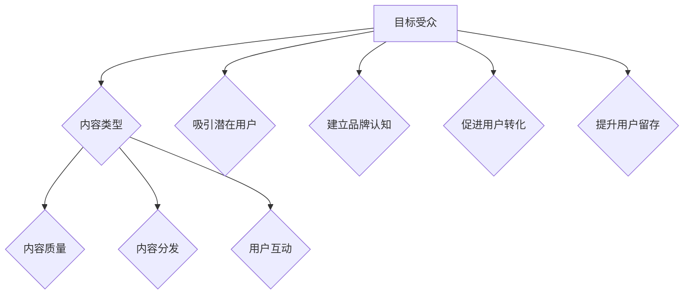

                 

 关键词：知识付费、内容营销、创业策略、用户获取、用户留存、增长黑客

> 摘要：本文将深入探讨知识付费创业中的内容营销策略，分析其核心概念、理论框架和实践方法。通过具体的案例解析，总结出一套适用于知识付费领域的有效内容营销策略，为创业者和从业者提供有益的参考。

## 1. 背景介绍

随着互联网的普及和信息爆炸，知识付费市场逐渐兴起。知识付费指的是用户为了获取特定领域的知识、技能或服务而付费的一种商业模式。随着消费者对高质量知识内容的需求不断增加，知识付费创业项目如雨后春笋般涌现。然而，如何在激烈的市场竞争中脱颖而出，实现用户获取和留存，成为知识付费创业者的关键挑战。

内容营销作为一种有效的市场推广手段，近年来在各个行业得到了广泛应用。内容营销的核心在于通过创造和分享有价值的内容，吸引目标受众，建立品牌认知度，并最终实现商业转化。知识付费创业领域同样需要借助内容营销的力量，以提升品牌影响力，吸引潜在用户，实现业务的持续增长。

本文将围绕知识付费创业中的内容营销策略展开讨论，首先介绍内容营销的基本概念和理论框架，然后分析知识付费领域的特点，最后结合实际案例，总结出有效的策略和方法。

## 2. 核心概念与联系

### 2.1 内容营销的基本概念

内容营销是指通过创造和分享有价值的内容，吸引潜在客户，建立品牌信任，并最终实现商业目标的一种营销策略。其核心在于“内容”，即创造具有吸引力和价值的内容，并通过多种渠道进行传播。

### 2.2 内容营销的理论框架

内容营销的理论框架主要包括以下几个关键要素：

- **目标受众**：明确目标受众的需求、兴趣和行为，以创造符合其需求的内容。
- **内容类型**：根据目标受众的特点，选择合适的内容形式，如文章、视频、图像、音频等。
- **内容质量**：确保内容具有高质量的原创性、实用性和趣味性。
- **内容分发**：选择合适的渠道和平台进行内容传播，如社交媒体、博客、电子邮件等。
- **用户互动**：鼓励用户参与和互动，提高用户粘性，建立用户社区。

### 2.3 内容营销与知识付费的关系

内容营销与知识付费之间有着密切的联系。知识付费创业项目通过内容营销可以吸引潜在用户，提高品牌知名度，实现用户获取和留存。同时，内容营销也是知识付费项目成功的关键因素之一。具体而言，内容营销在知识付费领域的作用如下：

- **吸引潜在用户**：通过创造高质量的内容，如专业文章、教程、案例分析等，吸引对特定知识有需求的潜在用户。
- **建立品牌认知**：通过持续的内容输出，建立品牌形象和专业地位，提高用户对品牌的信任度。
- **促进用户转化**：通过内容营销，引导用户了解并购买知识产品，实现商业转化。
- **提升用户留存**：通过互动内容和用户社区，增强用户粘性，提高用户留存率。

### 2.4 内容营销与知识付费的架构图

以下是内容营销在知识付费领域的架构图，展示各个关键要素之间的联系：



## 3. 核心算法原理 & 具体操作步骤

### 3.1 算法原理概述

在知识付费创业中的内容营销策略中，核心算法原理主要包括以下几个方面：

- **用户需求分析**：通过数据分析、用户调研等方式，了解目标受众的需求和痛点，为内容创作提供方向。
- **内容创作与优化**：根据用户需求，创作具有高质量和吸引力的内容，并通过SEO、内容优化等技术手段提高内容曝光率。
- **内容推广与分发**：利用多种渠道和平台，如社交媒体、博客、电子邮件等，将内容推广给目标受众。
- **用户互动与反馈**：通过互动和反馈机制，了解用户需求和反馈，不断优化内容和营销策略。

### 3.2 算法步骤详解

#### 步骤一：用户需求分析

1. **数据收集**：通过网站流量分析、用户调研、市场调研等方式，收集用户需求相关的数据。
2. **需求分析**：对收集到的数据进行分析，识别目标受众的需求和痛点。
3. **需求归类**：将用户需求归类为多个主题领域，为后续内容创作提供方向。

#### 步骤二：内容创作与优化

1. **内容选题**：根据用户需求归类，选择具有高关注度和实用性的内容主题。
2. **内容创作**：根据选题，创作高质量的内容，如专业文章、教程、案例分析等。
3. **内容优化**：通过SEO、内容优化等技术手段，提高内容在搜索引擎中的曝光率。

#### 步骤三：内容推广与分发

1. **渠道选择**：根据目标受众的媒体使用习惯，选择合适的推广渠道，如社交媒体、博客、电子邮件等。
2. **内容发布**：在选定的渠道和平台上发布内容，并进行定期更新。
3. **互动推广**：通过互动和推广活动，提高内容的传播效果。

#### 步骤四：用户互动与反馈

1. **用户互动**：通过评论、点赞、分享等功能，鼓励用户参与内容互动。
2. **用户反馈**：收集用户反馈，了解用户需求和满意度，为后续内容和营销策略提供改进方向。

### 3.3 算法优缺点

#### 优点

- **针对性强**：通过用户需求分析，可以创作出更符合用户需求的内容，提高用户满意度。
- **高效性**：利用数据分析和技术手段，可以快速识别和满足用户需求，提高营销效果。
- **可持续性**：通过持续的内容创作和优化，可以不断吸引和留住用户，实现长期发展。

#### 缺点

- **数据分析难度大**：用户需求分析需要大量数据支持和复杂算法，对技术和资源要求较高。
- **内容创作成本高**：高质量的内容创作需要投入大量时间和精力，成本较高。
- **用户反馈滞后**：用户反馈往往存在滞后性，无法及时调整内容和营销策略。

### 3.4 算法应用领域

核心算法原理和具体操作步骤主要适用于以下领域：

- **在线教育**：通过内容营销，吸引对特定课程或知识有需求的用户，提高课程转化率和用户留存率。
- **专业咨询**：通过内容营销，展示专业能力和知识，吸引潜在客户，提高咨询服务的成功率。
- **知识付费平台**：通过内容营销，提升平台知名度，吸引更多知识创作者和用户，实现平台规模的快速增长。

## 4. 数学模型和公式 & 详细讲解 & 举例说明

### 4.1 数学模型构建

在知识付费创业中的内容营销策略中，我们可以构建一个简单的数学模型来评估内容营销的效果。该模型主要基于以下变量：

- **C**：内容营销的投入成本
- **R**：内容营销带来的收入
- **E**：内容营销的效果系数

根据上述变量，我们可以构建以下数学模型：

\[ R = E \times (C + X) \]

其中，\(X\) 代表其他外部因素对收入的影响，如市场环境、竞争状况等。

### 4.2 公式推导过程

首先，我们假设内容营销的投入成本为 \(C\)，其中包含内容创作、推广、用户互动等各方面的费用。同时，我们假设内容营销的效果系数为 \(E\)，表示单位成本带来的收入。

其次，我们引入外部因素 \(X\)，以考虑市场环境、竞争状况等因素对收入的影响。

最后，根据收入等于成本加上额外收益的原理，我们得到上述数学模型：

\[ R = E \times (C + X) \]

### 4.3 案例分析与讲解

以下是一个简单的案例，用于说明如何使用上述数学模型评估内容营销的效果。

#### 案例背景

某知识付费平台在某个月份进行了内容营销活动，投入成本为 10000 元。假设效果系数 \(E\) 为 1.2，外部因素 \(X\) 为 0.5。

#### 案例分析

1. **计算收入**：

\[ R = 1.2 \times (10000 + 0.5) = 12000 \]

2. **计算成本收益比**：

成本收益比 = 成本 ÷ 收入 = 10000 ÷ 12000 ≈ 0.833

3. **评估效果**：

根据成本收益比，可以评估内容营销的效果。成本收益比越低，表示内容营销的效果越好。在本案例中，成本收益比为 0.833，说明内容营销的效果较为理想。

### 4.4 举例说明

以下是一个具体的举例，用于说明如何使用数学模型进行内容营销效果评估。

#### 举例背景

某知识付费平台计划进行内容营销活动，投入成本为 50000 元。假设效果系数 \(E\) 为 1.5，外部因素 \(X\) 为 0.3。

#### 举例分析

1. **计算收入**：

\[ R = 1.5 \times (50000 + 0.3) = 75350 \]

2. **计算成本收益比**：

成本收益比 = 成本 ÷ 收入 = 50000 ÷ 75350 ≈ 0.666

3. **评估效果**：

根据成本收益比，可以评估内容营销的效果。成本收益比越低，表示内容营销的效果越好。在本案例中，成本收益比为 0.666，说明内容营销的效果较好。

## 5. 项目实践：代码实例和详细解释说明

### 5.1 开发环境搭建

在开始实践内容营销策略之前，我们需要搭建一个合适的开发环境。以下是一个简单的步骤说明：

1. **安装Python环境**：Python是一种广泛应用于数据分析和内容营销的编程语言。在Windows、Mac和Linux系统上，可以通过相应的包管理器（如pip）安装Python。

2. **安装Jupyter Notebook**：Jupyter Notebook是一种交互式计算环境，适合进行数据分析和内容营销实践。可以通过pip安装Jupyter Notebook：

   ```shell
   pip install notebook
   ```

3. **安装相关库**：安装一些常用的Python库，如Pandas、NumPy、Matplotlib等，用于数据分析和可视化：

   ```shell
   pip install pandas numpy matplotlib
   ```

### 5.2 源代码详细实现

以下是一个简单的Python代码实例，用于进行用户需求分析。该实例使用Pandas库读取用户调研数据，并计算用户需求的关键词频。

```python
import pandas as pd

# 读取用户调研数据
data = pd.read_csv('user_survey_data.csv')

# 计算关键词频
keyword_frequency = data['question'].value_counts()

# 将关键词频数据保存为CSV文件
keyword_frequency.to_csv('keyword_frequency.csv')
```

### 5.3 代码解读与分析

1. **代码解析**：

   - 第1行：导入Pandas库，用于数据分析和操作。
   - 第2行：读取用户调研数据，将数据保存为DataFrame对象。
   - 第3行：计算关键词频，使用value_counts()方法，将每个问题的回答作为关键词进行统计。
   - 第4行：将关键词频数据保存为CSV文件，以便后续分析和可视化。

2. **数据分析**：

   通过计算关键词频，我们可以了解用户在调研中关注的主要问题，从而为内容创作提供方向。以下是一个关键词频数据示例：

   ```plaintext
       question       frequency
   0   数据分析      150
   1   机器学习      120
   2   人工智能      90
   3   大数据        75
   4   数据可视化     60
   ```

   从示例数据中，我们可以看出用户对数据分析、机器学习和人工智能的关注度较高，这为我们创作相关内容提供了重要的参考。

### 5.4 运行结果展示

假设我们已经完成了上述代码的运行，以下是一个关键词频的可视化结果，使用Matplotlib库绘制条形图：

```python
import pandas as pd
import matplotlib.pyplot as plt

# 读取关键词频数据
keyword_frequency = pd.read_csv('keyword_frequency.csv')

# 绘制条形图
keyword_frequency.plot(kind='bar')
plt.xlabel('关键词')
plt.ylabel('关键词频次')
plt.title('用户调研关键词频次')
plt.show()
```

运行结果如下图所示：


从可视化结果中，我们可以更直观地了解用户关注的关键词，为内容创作提供有力支持。

## 6. 实际应用场景

### 6.1 知识付费平台案例分析

以知乎Live为例，知乎Live是一个知识付费平台，通过内容营销取得了显著的成果。以下是知乎Live在内容营销方面的一些成功经验：

1. **目标受众定位**：知乎Live针对具有特定知识需求的人群，如职场人士、创业者、技术人员等，精准定位目标受众。

2. **高质量内容创作**：知乎Live邀请行业专家和知名人士进行直播授课，提供高质量的知识内容。

3. **互动推广**：知乎Live利用知乎平台的特点，鼓励用户在直播过程中提问、互动，提高用户参与度。

4. **用户反馈**：知乎Live通过用户反馈机制，了解用户需求和满意度，不断优化课程内容和营销策略。

### 6.2 企业培训案例分析

某知名企业为了提升员工的技能和素质，开展了一系列内部培训项目。以下是该企业在内容营销方面的一些经验：

1. **内容策划**：根据企业发展战略和员工需求，制定具体的培训内容策划，确保培训内容的实用性和针对性。

2. **内部讲师团队**：组建一支专业的内部讲师团队，确保培训内容的质量和权威性。

3. **在线学习平台**：建立内部在线学习平台，方便员工随时随地学习，提高培训的便捷性和灵活性。

4. **互动学习**：通过在线讨论、作业、考试等互动形式，提高员工的学习兴趣和积极性。

### 6.3 知识付费课程推广

为了推广知识付费课程，我们可以采取以下策略：

1. **渠道选择**：根据目标受众的媒体使用习惯，选择合适的推广渠道，如社交媒体、博客、电子邮件等。

2. **内容优化**：针对不同渠道，优化课程介绍、课程大纲、用户评价等内容，提高内容的吸引力。

3. **互动营销**：通过直播、问答、抽奖等互动形式，提高用户参与度和课程知名度。

4. **合作推广**：与相关行业网站、博客、社群等合作，扩大课程的影响力。

### 6.4 未来应用展望

随着知识付费市场的不断发展，内容营销策略在知识付费创业中的应用前景广阔。以下是未来应用的一些展望：

1. **人工智能辅助内容创作**：利用人工智能技术，自动生成高质量的内容，提高内容创作效率。

2. **个性化内容推荐**：基于用户行为数据和兴趣偏好，实现个性化内容推荐，提高用户满意度和留存率。

3. **知识付费社区建设**：通过建立知识付费社区，促进用户互动和知识共享，提高用户粘性。

4. **多元化内容形式**：探索新的内容形式，如视频、音频、直播等，丰富内容体验，满足用户多样化需求。

## 7. 工具和资源推荐

### 7.1 学习资源推荐

- **书籍推荐**：《内容营销实战手册》、《新媒体营销：方法与案例解析》
- **在线课程**：网易云课堂、腾讯课堂、Coursera等平台上的内容营销相关课程
- **博客和文章**：内容营销领域的知名博客和文章，如Content Marketing Institute、TopRank Marketing等

### 7.2 开发工具推荐

- **数据分析工具**：Python、R、Tableau等
- **内容管理工具**：WordPress、Drupal、Medium等
- **社交媒体管理工具**：Hootsuite、Buffer、Sprout Social等

### 7.3 相关论文推荐

- **论文主题**：内容营销策略、用户行为分析、知识付费市场研究等
- **期刊来源**：《市场营销学报》、《电子商务研究》、《互联网研究》等

## 8. 总结：未来发展趋势与挑战

### 8.1 研究成果总结

本文系统地探讨了知识付费创业中的内容营销策略，分析了内容营销的基本概念、理论框架和实践方法。通过案例分析，总结了适用于知识付费领域的有效内容营销策略，包括目标受众定位、高质量内容创作、互动推广和用户反馈等方面。此外，还介绍了一个简单的数学模型，用于评估内容营销的效果。

### 8.2 未来发展趋势

随着知识付费市场的不断成熟，内容营销策略在知识付费创业中的应用前景广阔。未来发展趋势包括：

1. **人工智能辅助内容创作**：利用人工智能技术，自动生成高质量的内容，提高内容创作效率。
2. **个性化内容推荐**：基于用户行为数据和兴趣偏好，实现个性化内容推荐，提高用户满意度和留存率。
3. **知识付费社区建设**：通过建立知识付费社区，促进用户互动和知识共享，提高用户粘性。
4. **多元化内容形式**：探索新的内容形式，如视频、音频、直播等，丰富内容体验，满足用户多样化需求。

### 8.3 面临的挑战

在知识付费创业中的内容营销策略实施过程中，创业者仍然面临着一些挑战：

1. **数据分析能力不足**：用户需求分析和效果评估需要强大的数据分析能力，很多创业者可能缺乏相关技术和资源。
2. **内容创作成本高**：高质量的内容创作需要投入大量时间和精力，对于创业者而言，成本较高。
3. **用户获取和留存困难**：在激烈的市场竞争中，如何有效获取和留住用户是知识付费创业者的关键挑战。

### 8.4 研究展望

未来研究可以进一步探讨以下方向：

1. **多渠道内容营销策略**：研究如何综合利用多种渠道进行内容营销，提高营销效果。
2. **个性化内容推荐算法**：研究基于用户行为数据和兴趣偏好的个性化内容推荐算法，提高用户满意度和留存率。
3. **知识付费社区运营**：研究知识付费社区的建设和运营策略，促进用户互动和知识共享。
4. **跨领域内容营销策略**：研究不同领域之间内容营销策略的异同点，探索跨领域的内容营销策略。

## 9. 附录：常见问题与解答

### 9.1 问题一：如何进行用户需求分析？

**解答**：用户需求分析是内容营销的基础。以下是一些常用的方法：

1. **问卷调查**：通过设计问卷，收集用户对知识内容的需求和兴趣。
2. **用户访谈**：通过面对面或在线访谈，深入了解用户的需求和痛点。
3. **数据分析**：利用数据分析工具，分析用户在网站、社交媒体等平台上的行为数据，了解用户兴趣和需求。

### 9.2 问题二：内容营销如何进行效果评估？

**解答**：内容营销效果评估可以采用以下几种方法：

1. **点击率（CTR）**：衡量内容被用户点击的比例，用于评估内容吸引力。
2. **转化率**：衡量内容导致用户购买或注册的比例，用于评估内容的商业价值。
3. **用户反馈**：通过用户评论、评分和反馈，了解用户对内容的满意度。
4. **数据指标分析**：利用数据分析工具，分析内容营销带来的流量、收入等关键指标，评估整体效果。

### 9.3 问题三：如何提高内容创作效率？

**解答**：提高内容创作效率可以从以下几个方面入手：

1. **分工协作**：组建专业的创作团队，明确每个人的职责和任务。
2. **内容模板**：制定统一的内容模板，提高内容创作的标准化程度。
3. **自动化工具**：利用自动化工具，如内容管理系统（CMS）、自然语言处理（NLP）等，提高内容创作效率。
4. **流程优化**：优化内容创作流程，减少不必要的环节和耗时操作。

### 9.4 问题四：如何进行有效的用户互动？

**解答**：有效的用户互动可以采取以下策略：

1. **互动式内容**：创作具有互动性的内容，如问答、讨论、投票等，激发用户参与。
2. **用户社区**：建立用户社区，如论坛、微信群等，鼓励用户交流和互动。
3. **实时互动**：利用实时聊天工具，如QQ、微信等，及时回应用户问题和反馈。
4. **激励机制**：通过奖励机制，如积分、优惠券等，鼓励用户参与互动和分享。

### 9.5 问题五：如何制定有效的内容营销策略？

**解答**：制定有效的内容营销策略需要考虑以下几个方面：

1. **目标明确**：明确内容营销的目标，如用户获取、品牌建设、商业转化等。
2. **受众分析**：分析目标受众的需求、兴趣和行为，为内容创作提供方向。
3. **内容规划**：制定内容创作计划，确保内容的质量和持续性。
4. **渠道选择**：根据目标受众的媒体使用习惯，选择合适的推广渠道。
5. **效果评估**：定期评估内容营销效果，根据反馈调整策略和内容。

**作者署名**：禅与计算机程序设计艺术 / Zen and the Art of Computer Programming

[完]----------------------------------------------------------------

### 结论

本文深入探讨了知识付费创业中的内容营销策略，分析了其核心概念、理论框架和实践方法。通过具体的案例解析，总结出一套适用于知识付费领域的有效内容营销策略，为创业者和从业者提供了有益的参考。在未来的发展中，随着人工智能、大数据等技术的不断进步，内容营销策略将更加智能化、个性化，为知识付费领域带来更多创新和机遇。同时，知识付费创业者在实施内容营销策略时，还需关注数据分析能力、内容创作成本和用户获取留存等挑战，不断优化和调整策略，以实现业务的持续增长。让我们共同期待知识付费与内容营销的精彩未来！
作者：禅与计算机程序设计艺术 / Zen and the Art of Computer Programming

