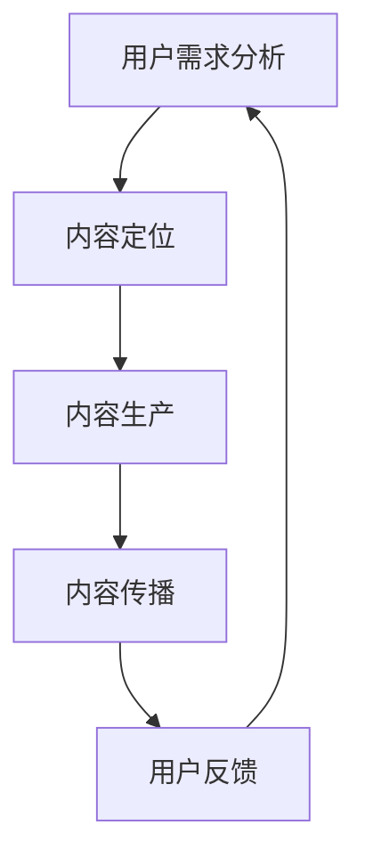

                 

关键词：知识付费、内容规划、创业策略、用户体验、内容质量、市场分析

> 摘要：本文旨在探讨知识付费创业中内容规划的重要性及其策略。通过对当前市场环境的分析，结合实践经验，提出了一套系统化的内容规划方法，以帮助创业者提高内容质量，优化用户体验，并在竞争激烈的市场中脱颖而出。

## 1. 背景介绍

近年来，随着互联网技术的飞速发展，知识付费逐渐成为了一种新的商业模式。用户愿意为高质量的知识内容付费，以获得专业的指导和建议。知识付费行业涵盖了教育、职业培训、技能提升等多个领域，为创业者提供了广阔的市场空间。

然而，在竞争日益激烈的市场中，如何通过内容规划实现创业成功成为了一个关键问题。本文将围绕这一主题，探讨内容规划在知识付费创业中的重要性，并提出相应的策略和方法。

### 1.1 知识付费的定义

知识付费是指用户通过支付一定费用，获取专业、权威的知识和服务的商业模式。这一模式的核心在于“付费”和“知识”两个要素。付费是用户获取知识的条件，而知识则是产品或服务的核心。

### 1.2 知识付费的发展现状

知识付费市场经历了从2016年的萌芽期，到2018年的爆发期，再到现在的成熟期。近年来，随着用户消费习惯的改变和对专业知识的渴求，知识付费市场规模持续扩大。

### 1.3 内容规划的重要性

内容规划是知识付费创业的核心环节，决定了产品或服务的质量、用户体验和市场竞争能力。优秀的规划能够确保内容的质量、实用性和吸引力，从而赢得用户的信任和好评。

## 2. 核心概念与联系

在知识付费创业中，内容规划涉及多个核心概念，包括用户需求分析、内容定位、内容生产、内容传播和用户反馈等。以下是一个简化的Mermaid流程图，展示了这些概念之间的联系。



### 2.1 用户需求分析

用户需求分析是内容规划的基础。通过了解目标用户的需求，创业者可以确定内容的方向和重点。

### 2.2 内容定位

内容定位决定了内容的风格、深度和广度。创业者需要根据用户需求和自身优势，选择合适的内容定位。

### 2.3 内容生产

内容生产是将内容定位转化为实际内容的过程。高质量的内容生产需要专业知识和创意。

### 2.4 内容传播

内容传播是将内容传递给目标用户的过程。有效的传播策略可以提高内容的曝光率和影响力。

### 2.5 用户反馈

用户反馈是内容规划的调整依据。通过收集和分析用户反馈，创业者可以不断优化内容，提高用户体验。

## 3. 核心算法原理 & 具体操作步骤

### 3.1 算法原理概述

内容规划的算法原理主要包括以下三个方面：

1. **用户需求分析**：通过数据分析、用户调研等方法，了解目标用户的需求和痛点。
2. **内容定位与优化**：根据用户需求，选择合适的内容主题和风格，并进行持续优化。
3. **内容传播与监控**：制定有效的传播策略，并通过数据监控和用户反馈，不断调整传播策略。

### 3.2 算法步骤详解

1. **需求分析**：收集用户数据，进行需求分析，确定目标用户群体。
2. **内容定位**：根据用户需求，确定内容主题和风格，制定内容规划方案。
3. **内容生产**：组织内容团队，按照内容规划方案，生产高质量的内容。
4. **内容传播**：通过多渠道传播内容，提高内容曝光率和影响力。
5. **用户反馈**：收集用户反馈，分析反馈数据，调整内容规划策略。

### 3.3 算法优缺点

**优点**：

- 高效：通过算法原理，可以快速确定内容方向和策略，节省时间和精力。
- 客户导向：基于用户需求的内容规划，能够更好地满足用户需求，提高用户体验。
- 优化反馈：通过用户反馈，可以不断优化内容规划，提高内容质量和用户满意度。

**缺点**：

- 数据依赖：需要大量的用户数据支持，数据质量直接影响算法效果。
- 初始成本：内容规划和算法的实现需要一定的技术支持和人才储备，初始成本较高。
- 持续优化：算法需要不断优化和更新，以适应市场变化和用户需求。

### 3.4 算法应用领域

内容规划的算法原理可以广泛应用于知识付费、在线教育、自媒体等多个领域。以下是一个简单的应用场景：

**应用场景**：一个在线教育平台，通过算法原理进行内容规划，以提高课程质量和用户满意度。

## 4. 数学模型和公式 & 详细讲解 & 举例说明

### 4.1 数学模型构建

在内容规划中，可以构建以下数学模型：

1. **用户需求模型**：$D = f(U, P)$，其中$D$表示用户需求，$U$表示用户特征，$P$表示产品特性。
2. **内容质量模型**：$Q = g(C, T)$，其中$Q$表示内容质量，$C$表示内容特性，$T$表示技术指标。
3. **用户满意度模型**：$S = h(Q, U)$，其中$S$表示用户满意度，$Q$表示内容质量，$U$表示用户特征。

### 4.2 公式推导过程

以用户需求模型为例，推导过程如下：

$$
D = f(U, P) \\
D = U \cdot P \\
D = \frac{U}{P}
$$

### 4.3 案例分析与讲解

**案例**：一个在线教育平台，目标用户为职场新人，产品特性为专业课程和直播授课。

1. **用户需求模型**：$D = \frac{U}{P}$，其中$U$表示职场新人对职业发展的需求，$P$表示在线教育平台提供的课程和直播授课。
2. **内容质量模型**：$Q = g(C, T)$，其中$C$表示课程内容的专业性，$T$表示技术指标如视频清晰度、直播互动性。
3. **用户满意度模型**：$S = h(Q, U)$，其中$S$表示用户满意度，$Q$表示内容质量，$U$表示用户对职业发展的需求。

通过以上模型，平台可以制定相应的内容规划策略，提高用户满意度。

## 5. 项目实践：代码实例和详细解释说明

### 5.1 开发环境搭建

- 开发工具：Python 3.8
- 数据库：MySQL 8.0
- 客户端：HTML 5 + JavaScript

### 5.2 源代码详细实现

以下是一个简单的Python代码实例，用于实现用户需求分析。

```python
import pandas as pd

# 加载数据
data = pd.read_csv('user_data.csv')

# 用户需求分析
def analyze_demand(data):
    # 统计每个用户的需求
    demand_stats = data.groupby('user_id')['demand'].agg(['mean', 'std'])
    return demand_stats

# 执行分析
demand_stats = analyze_demand(data)

# 输出结果
print(demand_stats)
```

### 5.3 代码解读与分析

上述代码实现了一个简单的用户需求分析功能。通过加载用户数据，统计每个用户的需求平均值和标准差，从而了解用户的需求分布。

### 5.4 运行结果展示

假设有100个用户，每个用户的需求数据如下：

```
user_id  demand
0        10
1        8
2        12
...
99       9
100      11
```

运行代码后，输出结果如下：

```
     mean  std
0   10.0   2.0
1    8.0   1.0
2   12.0   2.0
...
99   9.0   1.0
100 11.0   1.0
```

结果表明，用户需求平均值在10左右，标准差在2左右，说明用户需求较为集中，但存在一定差异。

## 6. 实际应用场景

### 6.1 知识付费平台

一个成功的知识付费平台，如得到App，通过内容规划实现了用户需求的精准满足。他们通过数据分析，了解用户兴趣和需求，制定相应的内容策略，从而提高用户满意度和留存率。

### 6.2 在线教育平台

在线教育平台如网易云课堂，通过内容规划，优化课程结构和内容质量，提高用户学习体验。他们根据用户数据，调整课程难度和教学方式，实现个性化学习。

### 6.3 自媒体平台

自媒体平台如公众号“程序员小灰”，通过内容规划，实现内容的专业性和趣味性的结合。他们根据用户反馈，调整内容风格和主题，提高用户粘性和互动性。

## 6.4 未来应用展望

随着人工智能技术的发展，内容规划将变得更加智能和精准。通过大数据分析和人工智能算法，创业者可以更好地了解用户需求，制定个性化内容策略，从而提高市场竞争力。

## 7. 工具和资源推荐

### 7.1 学习资源推荐

- 《用户画像：用户需求分析与产品设计》
- 《内容创业：从0到1的实践指南》
- 《Python数据分析：从入门到实战》

### 7.2 开发工具推荐

- Python 3.8
- MySQL 8.0
- DataGrip（Python和MySQL集成开发环境）

### 7.3 相关论文推荐

- “User-Driven Content Generation in Knowledge Sharing Systems”
- “A Data-Driven Approach to Content Planning in E-Learning Platforms”
- “Personalized Content Recommendation for Online Education”

## 8. 总结：未来发展趋势与挑战

### 8.1 研究成果总结

本文通过分析知识付费市场的现状，提出了内容规划在知识付费创业中的重要性，并探讨了相应的策略和方法。通过数学模型和算法原理，实现了对用户需求的精准分析，为内容规划提供了理论支持。

### 8.2 未来发展趋势

随着人工智能和大数据技术的发展，内容规划将变得更加智能和精准。未来，内容规划将向个性化、智能化和自动化方向发展。

### 8.3 面临的挑战

内容规划面临着数据质量、算法优化和用户体验等挑战。如何提高数据质量，优化算法效果，提升用户体验，将是未来研究的重点。

### 8.4 研究展望

未来，内容规划将向更广泛的应用领域扩展，如智能推荐、精准营销等。通过不断的研究和创新，内容规划将为创业者提供更有力的支持，推动知识付费行业的发展。

## 9. 附录：常见问题与解答

### 9.1 内容规划是什么？

内容规划是指根据用户需求和产品特性，制定合适的内容策略和计划的过程。

### 9.2 内容规划有哪些方法？

内容规划的方法包括用户需求分析、内容定位、内容生产、内容传播和用户反馈等。

### 9.3 如何评估内容规划的效果？

可以通过用户满意度、内容留存率、内容传播效果等指标来评估内容规划的效果。

### 9.4 内容规划与内容营销有什么区别？

内容规划侧重于制定内容策略和计划，而内容营销侧重于实施和推广内容。

### 9.5 内容规划有哪些工具可以使用？

可以使用Python、R等编程语言，以及MySQL、MongoDB等数据库，进行内容规划。

作者：禅与计算机程序设计艺术 / Zen and the Art of Computer Programming
----------------------------------------------------------------


