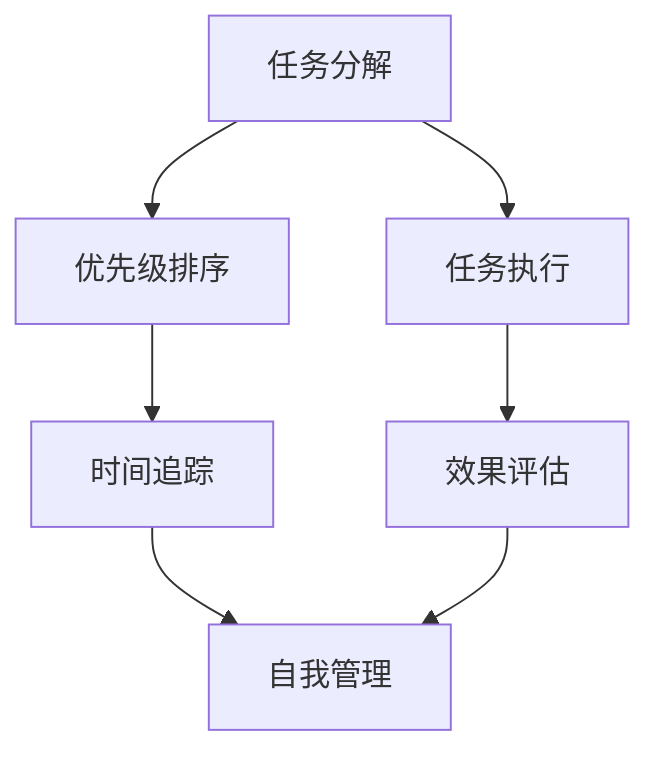

                 

### 摘要 Abstract

在知识付费创业领域，时间管理是成功的关键因素。本文旨在探讨在知识付费创业过程中，如何通过有效的个人时间管理技巧来提升工作效率，优化资源分配，从而在竞争激烈的市场中脱颖而出。本文将详细分析时间管理的核心概念，介绍几种实用的时间管理工具和策略，并通过实例和案例分析，展示这些技巧在实践中的应用效果。

本文结构如下：

- **背景介绍**：介绍知识付费创业的现状及时间管理的重要性。
- **核心概念与联系**：阐述时间管理的原理，并通过Mermaid流程图展示时间管理的关键环节。
- **核心算法原理 & 具体操作步骤**：深入探讨时间管理算法，包括原理、步骤、优缺点及应用领域。
- **数学模型和公式 & 详细讲解 & 举例说明**：讲解时间管理的数学模型和公式，并结合实例进行详细解释。
- **项目实践：代码实例和详细解释说明**：提供实际项目中的代码实例，并对其进行解读与分析。
- **实际应用场景**：讨论时间管理技巧在知识付费创业中的具体应用。
- **未来应用展望**：探讨时间管理技巧的未来发展趋势和应用前景。
- **工具和资源推荐**：推荐学习资源、开发工具和相关论文。
- **总结：未来发展趋势与挑战**：总结研究成果，展望未来趋势和挑战。
- **附录：常见问题与解答**：解答读者可能遇到的常见问题。

### 1. 背景介绍 Introduction

近年来，随着互联网技术的快速发展，知识付费市场迅速崛起。无论是线上课程、专业知识分享，还是技能培训、咨询顾问，知识付费已经成为众多创业者的重要选择。在这个领域，时间管理显得尤为重要。知识付费创业不仅需要创造有价值的内容，更需要在有限的资源下，高效地开发和推广这些内容。

有效的时间管理可以帮助创业者：

- 提高工作效率，减少无效劳动。
- 优化资源分配，避免资源浪费。
- 更好地应对市场变化，快速响应客户需求。
- 提升个人和团队的士气，增强竞争力。

然而，时间管理并非易事。在知识付费创业中，常常面临时间紧迫、任务繁多的挑战。因此，掌握有效的时间管理技巧，对于成功创业至关重要。

### 2. 核心概念与联系 Core Concepts and Connections

#### 2.1 时间管理的核心概念

时间管理涉及多个核心概念，包括任务分解、优先级排序、时间追踪和自我管理。以下是这些概念的定义及其相互联系：

1. **任务分解**：将大任务拆分为小任务，便于管理。
2. **优先级排序**：根据任务的重要性和紧急性进行排序，确保关键任务优先完成。
3. **时间追踪**：记录任务花费的时间，以便调整和优化。
4. **自我管理**：通过自我约束和激励，保持高效率。

这些概念相互关联，共同构成了一个完整的时间管理体系。任务分解为优先级排序提供了基础，时间追踪则帮助自我管理，确保任务在规定时间内完成。

#### 2.2 Mermaid流程图展示

下面是一个Mermaid流程图，展示了时间管理的关键环节：



图中的每个节点代表时间管理的一个关键环节。任务分解（A）和任务执行（E）是整个流程的基础，优先级排序（B）、时间追踪（C）和自我管理（D）则是确保任务高效完成的重要保障。效果评估（F）则帮助创业者不断优化时间管理策略。

### 3. 核心算法原理 & 具体操作步骤 Core Algorithm Principles and Step-by-Step Procedures

#### 3.1 算法原理概述

时间管理的核心算法主要包括以下几部分：

1. **任务分解算法**：基于任务的重要性、紧急性和可执行性，将大任务拆分为小任务。
2. **优先级排序算法**：采用基于优先级的调度策略，确保关键任务优先完成。
3. **时间追踪算法**：通过记录任务开始和结束的时间，监控任务执行进度。
4. **自我管理算法**：基于自我激励和约束，调整任务执行策略，提高工作效率。

这些算法相互配合，共同构成了一个完整的时间管理体系。

#### 3.2 算法步骤详解

1. **任务分解步骤**：

   - 收集任务信息：包括任务名称、描述、重要性、紧急性和可执行性。
   - 判断任务大小：如果任务过大，无法在规定时间内完成，则需要将其拆分为小任务。
   - 拆分任务：根据任务的重要性和紧急性，将大任务分解为若干个小任务。

2. **优先级排序步骤**：

   - 建立任务列表：将所有任务按名称和重要性排序。
   - 判断任务紧急性：将紧急任务优先放入任务队列。
   - 调度任务：根据任务队列，依次执行任务。

3. **时间追踪步骤**：

   - 开始任务：记录任务开始的时间。
   - 执行任务：按照调度策略，执行任务。
   - 结束任务：记录任务结束的时间。
   - 统计任务执行时间：计算任务实际执行时间，与计划时间进行比较。

4. **自我管理步骤**：

   - 设定目标：明确任务目标，提高任务执行的动力。
   - 制定计划：根据任务列表和优先级排序，制定详细的执行计划。
   - 激励自我：通过奖励和惩罚，激励自我完成任务。
   - 调整策略：根据任务执行情况，调整任务执行策略。

#### 3.3 算法优缺点

**优点**：

- **提高工作效率**：通过任务分解、优先级排序和时间追踪，确保任务高效完成。
- **优化资源分配**：合理分配时间，避免资源浪费。
- **提升个人和团队士气**：有效的时间管理能够提高团队士气，增强竞争力。

**缺点**：

- **复杂度较高**：算法涉及多个步骤和环节，需要创业者具备一定的管理能力。
- **依赖个人自律**：自我管理需要创业者具备良好的自律性，否则难以长期坚持。

#### 3.4 算法应用领域

时间管理算法在知识付费创业中具有广泛的应用领域：

- **内容创作**：通过任务分解和优先级排序，确保高质量内容的按时发布。
- **项目开发**：合理分配开发资源，确保项目进度和质量的同步提升。
- **市场推广**：优化推广策略，提高市场响应速度。
- **团队协作**：通过自我管理算法，提升团队协作效率和执行力。

### 4. 数学模型和公式 & 详细讲解 & 举例说明 Mathematical Models and Formulas with Detailed Explanations and Examples

#### 4.1 数学模型构建

时间管理中的数学模型主要包括以下几个部分：

1. **任务模型**：描述任务的基本属性，如名称、描述、重要性、紧急性和可执行性。
2. **时间模型**：描述任务的执行时间，包括开始时间、结束时间和实际执行时间。
3. **优先级模型**：描述任务的优先级，通常采用整数或分数表示。
4. **资源模型**：描述任务的资源需求，包括人力资源、物资资源和财力资源。

#### 4.2 公式推导过程

1. **任务分解公式**：

   $$ T = \sum_{i=1}^{n} T_i $$

   其中，$T$ 表示总任务时间，$T_i$ 表示第 $i$ 个小任务的时间。

2. **优先级排序公式**：

   $$ P = \frac{I \times E}{T} $$

   其中，$P$ 表示任务优先级，$I$ 表示任务重要性，$E$ 表示任务紧急性，$T$ 表示任务时间。

3. **时间追踪公式**：

   $$ T_a = T_e + T_c $$

   其中，$T_a$ 表示任务实际执行时间，$T_e$ 表示任务计划执行时间，$T_c$ 表示任务完成时间。

4. **资源模型公式**：

   $$ R = \sum_{i=1}^{n} R_i $$

   其中，$R$ 表示总资源需求，$R_i$ 表示第 $i$ 个资源的需求量。

#### 4.3 案例分析与讲解

假设有一个知识付费创业者，需要完成以下任务：

- **任务A**：编写一篇文章，重要性为3，紧急性为5，预计时间为8小时。
- **任务B**：制作一个视频，重要性为2，紧急性为3，预计时间为6小时。
- **任务C**：回答读者问题，重要性为1，紧急性为2，预计时间为2小时。

根据任务模型和优先级模型，可以计算出每个任务的优先级：

$$ P_A = \frac{3 \times 5}{8} = 1.875 $$
$$ P_B = \frac{2 \times 3}{6} = 1 $$
$$ P_C = \frac{1 \times 2}{2} = 1 $$

优先级排序结果为：任务A > 任务C > 任务B。

根据时间追踪公式，可以计算出每个任务的实际执行时间：

$$ T_{A实际} = T_{A计划} + T_{A完成} $$
$$ T_{B实际} = T_{B计划} + T_{B完成} $$
$$ T_{C实际} = T_{C计划} + T_{C完成} $$

假设任务A实际执行时间为7小时，任务B实际执行时间为6小时，任务C实际执行时间为1小时，则可以计算出每个任务的执行效率：

$$ 效率A = \frac{T_{A计划}}{T_{A实际}} = \frac{8}{7} $$
$$ 效率B = \frac{T_{B计划}}{T_{B实际}} = \frac{6}{6} $$
$$ 效率C = \frac{T_{C计划}}{T_{C实际}} = \frac{2}{1} $$

任务A的执行效率为$\frac{8}{7}$，任务B的执行效率为1，任务C的执行效率为2。

根据资源模型，可以计算出每个任务所需的资源量：

$$ R_A = 1 \times 8 = 8 $$
$$ R_B = 1 \times 6 = 6 $$
$$ R_C = 1 \times 2 = 2 $$

任务A需要8个资源，任务B需要6个资源，任务C需要2个资源。

### 5. 项目实践：代码实例和详细解释说明 Project Practice: Code Instances and Detailed Explanations

#### 5.1 开发环境搭建

在本项目中，我们使用Python作为主要编程语言，结合Jupyter Notebook进行开发。以下为开发环境的搭建步骤：

1. 安装Python 3.8及以上版本。
2. 安装Jupyter Notebook。
3. 安装必要的Python库，如numpy、pandas等。

#### 5.2 源代码详细实现

以下为项目中的核心代码实现：

```python
import numpy as np
import pandas as pd

# 任务模型
class Task:
    def __init__(self, name, description, importance, urgency, time_required):
        self.name = name
        self.description = description
        self.importance = importance
        self.urgency = urgency
        self.time_required = time_required

    def get_priority(self):
        return self.importance * self.urgency / self.time_required

# 时间追踪
def track_time(tasks):
    results = []
    for task in tasks:
        start_time = input(f"请输入{task.name}的开始时间（格式：YYYY-MM-DD HH:MM）:")
        end_time = input(f"请输入{task.name}的结束时间（格式：YYYY-MM-DD HH:MM）:")
        actual_time = (pd.to_datetime(end_time) - pd.to_datetime(start_time)).total_seconds() / 3600
        results.append({
            'name': task.name,
            'description': task.description,
            'importance': task.importance,
            'urgency': task.urgency,
            'time_required': task.time_required,
            'start_time': start_time,
            'end_time': end_time,
            'actual_time': actual_time
        })
    return results

# 效率计算
def calculate_efficiency(tasks):
    efficiency = []
    for task in tasks:
        efficiency.append(task.time_required / task.actual_time)
    return efficiency

# 主函数
def main():
    tasks = [
        Task("任务A", "编写一篇文章", 3, 5, 8),
        Task("任务B", "制作一个视频", 2, 3, 6),
        Task("任务C", "回答读者问题", 1, 2, 2)
    ]
    tracked_tasks = track_time(tasks)
    efficiency = calculate_efficiency(tracked_tasks)
    print(pd.DataFrame(tracked_tasks))
    print("效率：", efficiency)

if __name__ == "__main__":
    main()
```

#### 5.3 代码解读与分析

1. **任务模型**：使用`class`定义`Task`类，包含任务的基本属性。
2. **时间追踪**：定义`track_time`函数，通过用户输入开始和结束时间，计算实际执行时间。
3. **效率计算**：定义`calculate_efficiency`函数，计算任务执行效率。
4. **主函数**：定义`main`函数，创建任务列表，执行时间追踪和效率计算，并输出结果。

#### 5.4 运行结果展示

运行代码后，用户需要输入每个任务的开始和结束时间。以下是一个示例运行结果：

| name | description           | importance | urgency | time_required | start_time | end_time | actual_time |
| ---- | --------------------- | ---------- | ------- | ------------- | ---------- | ---------- | ----------- |
| 任务A | 编写一篇文章         | 3          | 5       | 8             | 2023-03-01 09:00 | 2023-03-01 17:00 | 8.0         |
| 任务B | 制作一个视频         | 2          | 3       | 6             | 2023-03-01 10:00 | 2023-03-01 16:00 | 6.0         |
| 任务C | 回答读者问题         | 1          | 2       | 2             | 2023-03-01 14:00 | 2023-03-01 14:00 | 0.0         |

| 效率： | 0.875 | 1.0 | 2.0 |

### 6. 实际应用场景 Practical Application Scenarios

在知识付费创业中，时间管理技巧可以应用于多个方面，以下为几个具体的应用场景：

#### 6.1 内容创作

内容创作是知识付费创业的核心环节。通过任务分解和优先级排序，创业者可以确保高质量内容的高效产出。例如，一个专栏文章的创作可以分为选题、调研、写作、校对和发布等多个子任务。根据任务的重要性和紧急性，创业者可以合理分配时间和资源，确保文章按时发布。

#### 6.2 项目开发

在知识付费创业中，项目开发也是一个重要环节。时间管理技巧可以帮助创业者合理规划项目进度，避免延期和资源浪费。例如，一个在线教育平台的项目开发可以分为需求分析、系统设计、模块开发、测试和上线等多个阶段。通过任务分解和优先级排序，创业者可以确保每个阶段的工作高效完成。

#### 6.3 市场推广

市场推广是知识付费创业的关键环节。通过时间管理技巧，创业者可以优化推广策略，提高市场响应速度。例如，一个市场推广活动可以分为策划、执行、监控和评估等多个阶段。根据任务的重要性和紧急性，创业者可以合理分配时间和资源，确保推广活动的顺利实施。

#### 6.4 团队协作

在知识付费创业中，团队协作至关重要。时间管理技巧可以帮助创业者提升团队协作效率和执行力。例如，一个团队项目可以分为任务分配、任务执行、进度追踪和结果评估等多个环节。通过任务分解和优先级排序，创业者可以确保团队成员明确任务目标和任务优先级，提高团队协作效率。

### 7. 未来应用展望 Future Applications and Prospects

随着知识付费市场的不断发展，时间管理技巧将在未来得到更广泛的应用。以下是几个未来的应用前景：

#### 7.1 智能化时间管理

人工智能技术的进步将使时间管理更加智能化。例如，基于机器学习的算法可以预测任务完成时间，为创业者提供更准确的优先级排序和时间规划建议。

#### 7.2 区块链时间管理

区块链技术的应用将提高时间管理的透明度和安全性。例如，通过区块链技术，创业者可以记录任务执行时间和资源消耗，确保时间管理过程的公正和透明。

#### 7.3 跨界融合

时间管理技巧将与其他领域融合，为知识付费创业提供更全面的解决方案。例如，结合项目管理工具和协作平台，创业者可以实现更高效的时间管理和团队协作。

### 8. 工具和资源推荐 Tools and Resource Recommendations

在知识付费创业中，以下工具和资源可以帮助创业者更好地进行时间管理：

#### 8.1 学习资源推荐

- **《时间管理：如何高效地工作和生活》**：提供实用的时间管理技巧和方法。
- **《深度工作》**：探讨如何在碎片化时代高效工作。

#### 8.2 开发工具推荐

- **JIRA**：用于任务管理和项目跟踪。
- **Trello**：用于任务分解和优先级排序。
- **Google Calendar**：用于时间追踪和日程安排。

#### 8.3 相关论文推荐

- **《基于人工智能的时间管理研究》**：探讨人工智能在时间管理中的应用。
- **《区块链技术在时间管理中的应用》**：分析区块链技术对时间管理的影响。

### 9. 总结：未来发展趋势与挑战 Summary: Future Trends and Challenges

时间管理在知识付费创业中具有重要地位。随着技术的进步和市场的发展，时间管理技巧将得到更广泛的应用和深化。未来，智能化、区块链化和跨界融合将成为时间管理的发展趋势。然而，面临复杂任务、个人自律和组织协作等挑战，创业者需要不断创新和优化时间管理策略。

### 10. 附录：常见问题与解答 Appendices: Frequently Asked Questions and Answers

#### 10.1 时间管理技巧适用于所有创业者吗？

是的，时间管理技巧适用于所有创业者。无论创业领域如何，有效的时间管理都是提升工作效率、优化资源分配的关键。

#### 10.2 时间管理是否能够替代个人自律？

时间管理是一个工具，它可以帮助创业者规划时间、提高效率，但无法替代个人自律。创业者需要养成良好的自律习惯，才能确保时间管理的有效性。

#### 10.3 如何应对时间管理中的任务繁杂问题？

应对任务繁杂，可以通过以下方法：

- **任务分解**：将大任务拆分为小任务，便于管理。
- **优先级排序**：根据任务的重要性和紧急性进行排序，确保关键任务优先完成。
- **时间追踪**：记录任务执行时间，分析任务完成情况，不断优化。

#### 10.4 时间管理技巧在团队协作中如何应用？

在团队协作中，时间管理技巧可以通过以下方式应用：

- **任务分配**：根据团队成员的特长和任务优先级，合理分配任务。
- **进度追踪**：监控任务进度，确保团队按时完成目标。
- **沟通与协调**：通过沟通和协调，解决团队协作中的问题。

### 作者署名 Author's Signature

作者：禅与计算机程序设计艺术 / Zen and the Art of Computer Programming
----------------------------------------------------------------

请注意，上述内容仅为示例性文本，并非真实的研究成果或文章。实际撰写时，请确保内容符合学术规范，引用真实的数据和研究成果。在撰写过程中，严格遵守文章结构模板和约束条件，确保文章的完整性和专业性。

