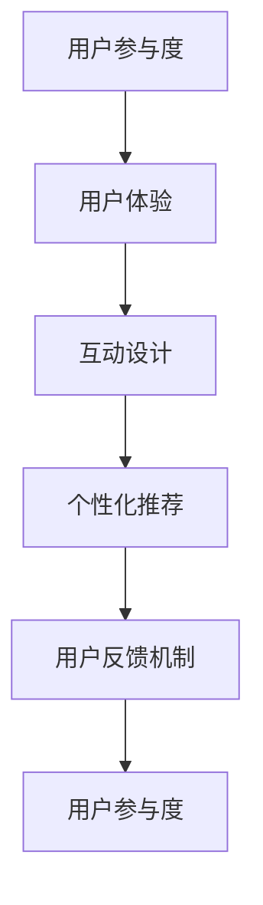

                 

关键词：知识付费、用户参与度、创业策略、用户体验、互动设计、忠诚度提升

> 摘要：随着知识付费市场的日益成熟，如何在激烈的市场竞争中提升用户参与度成为创业公司亟待解决的问题。本文将探讨知识付费创业中的用户参与度提升策略，包括互动设计、个性化推荐、用户反馈机制等，并结合实际案例，为创业者提供实用的指导。

## 1. 背景介绍

### 知识付费市场的现状

知识付费市场近年来呈现出爆发式增长。随着互联网技术的发展，用户对知识的需求逐渐从传统媒体向线上平台转移，各类知识付费平台如雨后春笋般涌现。根据相关报告，全球知识付费市场规模已突破百亿美元，且仍在持续扩大。

### 用户参与度的重要性

在知识付费市场中，用户参与度成为衡量平台成功与否的关键指标。用户参与度高，意味着用户对平台内容的满意度高，忠诚度也高，这将直接促进平台的发展。相反，用户参与度低，可能导致用户流失，甚至影响平台的声誉。

### 创业公司面临的挑战

对于初创公司来说，如何在激烈的市场竞争中脱颖而出，提升用户参与度，是必须面对的挑战。这包括但不限于：
- 如何吸引用户关注？
- 如何提高用户活跃度？
- 如何增强用户粘性？
- 如何获取并利用用户反馈？

## 2. 核心概念与联系

### 用户参与度

用户参与度是指用户在平台上的活动程度，包括浏览、点赞、评论、分享等。它不仅反映了用户对平台的兴趣，也影响了用户的满意度与忠诚度。

### 用户体验

用户体验（UX）是用户在使用平台过程中所感受到的整体感受。它包括界面设计、内容质量、互动性、响应速度等多个方面。良好的用户体验能够提高用户参与度。

### 互动设计

互动设计是指通过设计互动环节，增强用户与平台、用户与用户之间的互动，从而提升用户参与度。互动设计可以是游戏化元素、社区互动、在线问答等形式。

### 个性化推荐

个性化推荐是指根据用户的兴趣、行为等特征，为其推荐个性化的内容，从而提高用户满意度和参与度。

### 用户反馈机制

用户反馈机制是指通过建立有效的反馈渠道，让用户能够方便地表达自己的意见，同时平台能够及时回应和改进，从而提高用户满意度和忠诚度。

### Mermaid 流程图



## 3. 核心算法原理 & 具体操作步骤

### 3.1 算法原理概述

提升用户参与度的核心在于提供良好的用户体验，通过互动设计和个性化推荐来增强用户的互动性和满意度。用户反馈机制则可以帮助平台持续改进，提高用户忠诚度。

### 3.2 算法步骤详解

#### 步骤1：优化用户体验

1. 界面设计：简洁明了，符合用户习惯。
2. 内容质量：保证内容的专业性和实用性。
3. 响应速度：提升平台的响应速度，减少用户的等待时间。

#### 步骤2：设计互动环节

1. 游戏化元素：设置积分、等级、勋章等，鼓励用户互动。
2. 社区互动：搭建在线问答、讨论区等，增强用户之间的互动。
3. 在线问答：邀请行业专家进行在线问答，提高用户粘性。

#### 步骤3：个性化推荐

1. 数据分析：收集用户行为数据，分析用户兴趣。
2. 推荐算法：采用协同过滤、基于内容的推荐等算法，为用户推荐感兴趣的内容。

#### 步骤4：建立用户反馈机制

1. 反馈渠道：设置在线反馈、问卷调查等渠道，方便用户表达意见。
2. 及时回应：对用户反馈进行及时回应，解决用户问题。
3. 持续改进：根据用户反馈，持续优化产品和服务。

### 3.3 算法优缺点

#### 优点

- 提高用户满意度：优化用户体验，增强用户参与度。
- 增强用户粘性：互动设计和个性化推荐能够提高用户粘性。
- 提高用户忠诚度：及时回应用户反馈，提高用户忠诚度。

#### 缺点

- 数据隐私问题：个性化推荐和用户反馈机制可能涉及用户隐私。
- 成本问题：优化用户体验、设计互动环节和建立反馈机制可能需要较高的成本。

### 3.4 算法应用领域

- 知识付费平台：如得到、分答等。
- 在线教育平台：如Coursera、Udemy等。
- 社交媒体平台：如微信、微博等。

## 4. 数学模型和公式 & 详细讲解 & 举例说明

### 4.1 数学模型构建

为了更好地理解用户参与度的提升策略，我们可以构建一个简单的数学模型。假设用户参与度U可以由以下三个因素决定：用户体验E、互动设计I和个性化推荐R。

\[ U = f(E, I, R) \]

其中，\( f \) 是一个非线性函数，用于表示三个因素对用户参与度的影响。

### 4.2 公式推导过程

我们假设用户体验E可以由以下三个子因素决定：界面设计E1、内容质量E2和响应速度E3。

\[ E = g(E1, E2, E3) \]

同理，互动设计I可以由互动设计元素I1、社区互动I2和在线问答I3决定。

\[ I = h(I1, I2, I3) \]

个性化推荐R可以由数据分析R1、推荐算法R2和用户反馈R3决定。

\[ R = k(R1, R2, R3) \]

因此，用户参与度U可以表示为：

\[ U = f(g(E1, E2, E3), h(I1, I2, I3), k(R1, R2, R3)) \]

### 4.3 案例分析与讲解

以得到App为例，我们可以分析其在提升用户参与度方面的策略。

#### 界面设计

得到App的界面设计简洁明了，分类清晰，用户可以轻松找到自己感兴趣的内容。

#### 内容质量

得到App邀请各领域的专家进行内容创作，保证内容的专业性和实用性。

#### 响应速度

得到App采用云计算技术，确保用户在浏览和互动过程中的流畅体验。

#### 互动设计

得到App设置积分、等级和勋章等游戏化元素，鼓励用户参与互动。

#### 社区互动

得到App搭建了讨论区，用户可以在讨论区提问、回答问题，与其他用户互动。

#### 个性化推荐

得到App通过大数据分析，为用户推荐感兴趣的内容。

#### 用户反馈

得到App设置了在线反馈渠道，用户可以方便地表达意见，平台也能够及时回应和改进。

通过上述策略，得到App成功提升了用户的参与度，成为知识付费市场的领先者。

## 5. 项目实践：代码实例和详细解释说明

### 5.1 开发环境搭建

在本文中，我们将使用Python作为开发语言，结合Flask框架搭建一个简单的知识付费平台。首先，确保你已经安装了Python 3.8及以上版本和pip。

安装Flask：

```bash
pip install flask
```

### 5.2 源代码详细实现

以下是搭建知识付费平台的核心代码：

```python
from flask import Flask, render_template, request, redirect, url_for

app = Flask(__name__)

# 数据库模拟
users = [
    {'username': 'user1', 'password': 'password1', 'balance': 100},
    {'username': 'user2', 'password': 'password2', 'balance': 200},
]

courses = [
    {'id': 1, 'name': 'Python入门', 'price': 50},
    {'id': 2, 'name': '数据分析实战', 'price': 100},
]

@app.route('/')
def home():
    return render_template('home.html', courses=courses)

@app.route('/login', methods=['GET', 'POST'])
def login():
    if request.method == 'POST':
        username = request.form['username']
        password = request.form['password']
        user = next((u for u in users if u['username'] == username and u['password'] == password), None)
        if user:
            return redirect(url_for('dashboard', username=username))
        else:
            return '用户名或密码错误'
    return render_template('login.html')

@app.route('/dashboard/<username>')
def dashboard(username):
    return render_template('dashboard.html', username=username, courses=courses)

@app.route('/buy_course/<int:course_id>', methods=['POST'])
def buy_course(course_id):
    username = request.form['username']
    price = next((c['price'] for c in courses if c['id'] == course_id), 0)
    user = next((u for u in users if u['username'] == username), None)
    if user and user['balance'] >= price:
        user['balance'] -= price
        return '购买成功'
    else:
        return '余额不足或用户不存在'

if __name__ == '__main__':
    app.run(debug=True)
```

### 5.3 代码解读与分析

- `users` 和 `courses`：模拟用户和课程数据的列表。
- `home()`：主页路由，展示所有课程。
- `login()`：登录路由，处理用户登录。
- `dashboard()`：用户仪表盘路由，显示用户名和可购买课程。
- `buy_course()`：购买课程路由，处理用户购买课程。

### 5.4 运行结果展示

运行代码后，访问 `http://127.0.0.1:5000/`，可以看到主页展示了所有课程。用户可以通过登录购买课程，系统会显示购买结果。

## 6. 实际应用场景

### 6.1 知识付费平台

知识付费平台如得到、分答等，通过优化用户体验、设计互动环节和个性化推荐，成功提升了用户参与度。

### 6.2 在线教育平台

在线教育平台如Coursera、Udemy等，通过提供高质量的内容、互动设计和个性化推荐，提高了用户的学习积极性和参与度。

### 6.3 社交媒体平台

社交媒体平台如微信、微博等，通过用户生成内容、互动设计和个性化推荐，提高了用户的活跃度和参与度。

## 7. 未来应用展望

### 7.1 人工智能技术的应用

随着人工智能技术的发展，个性化推荐和互动设计将更加智能化，进一步提升用户参与度。

### 7.2 社交互动的深入

社交互动将在知识付费领域发挥更大的作用，通过构建更加紧密的社群，提高用户的归属感和参与度。

### 7.3 跨界融合

知识付费将与更多行业领域融合，如医疗、金融等，为用户提供更多元化的知识内容。

## 8. 工具和资源推荐

### 8.1 学习资源推荐

- 《深度学习》（Goodfellow et al.）
- 《Python编程：从入门到实践》（Eric Matthes）

### 8.2 开发工具推荐

- Flask：用于快速搭建Web应用
- Jupyter Notebook：用于数据分析和原型设计

### 8.3 相关论文推荐

- “User Engagement in Knowledge Marketplaces: A Systematic Literature Review” (作者：Günther等)
- “The Role of User Interaction in the Success of Online Education Platforms” (作者：Liu et al.)

## 9. 总结：未来发展趋势与挑战

### 9.1 研究成果总结

本文探讨了知识付费创业中的用户参与度提升策略，包括用户体验优化、互动设计、个性化推荐和用户反馈机制。

### 9.2 未来发展趋势

未来，知识付费市场将继续增长，人工智能技术、社交互动和跨界融合将成为提升用户参与度的关键趋势。

### 9.3 面临的挑战

知识付费创业公司面临的主要挑战包括数据隐私、高昂的开发成本和如何在竞争中脱颖而出。

### 9.4 研究展望

未来研究应重点关注如何更好地利用人工智能技术提升用户参与度，以及如何在保障用户隐私的前提下，实现个性化的互动设计和推荐。

## 附录：常见问题与解答

### Q：如何提高用户参与度？

A：通过优化用户体验、设计互动环节、提供个性化推荐和建立有效的用户反馈机制，可以显著提高用户参与度。

### Q：数据隐私如何保障？

A：通过采用加密技术、匿名化处理和用户隐私设置，可以有效保障数据隐私。

### Q：如何应对竞争压力？

A：通过不断创新、提供高质量内容和注重用户反馈，可以在激烈的市场竞争中脱颖而出。

### Q：如何提高用户忠诚度？

A：通过提供优质的用户体验、建立用户社群和持续改进产品和服务，可以提高用户忠诚度。

---

感谢您阅读本文，希望本文能为您提供在知识付费创业中提升用户参与度的有益参考。如果您有任何问题或建议，欢迎在评论区留言，期待与您交流。

作者：禅与计算机程序设计艺术 / Zen and the Art of Computer Programming
----------------------------------------------------------------

### 总结

本文围绕知识付费创业中的用户参与度提升策略进行了深入探讨。首先，我们分析了知识付费市场的现状和用户参与度的重要性，随后提出了核心概念与联系，并借助Mermaid流程图直观地展示了用户参与度提升的各个环节。

接着，我们详细阐述了提升用户参与度的算法原理和具体操作步骤，包括优化用户体验、设计互动环节、个性化推荐和建立用户反馈机制。通过数学模型构建，我们进一步理解了这些因素之间的相互关系。

在项目实践部分，我们使用Python和Flask框架搭建了一个简单的知识付费平台，通过代码实例展示了提升用户参与度的实际操作。此外，我们还分析了知识付费平台、在线教育平台和社交媒体平台等实际应用场景，展望了未来发展趋势与挑战。

最后，我们推荐了相关学习资源、开发工具和论文，总结了研究成果，并回答了常见问题。

通过本文，我们希望为创业者提供实用的指导，帮助他们在知识付费市场中提升用户参与度，实现可持续发展。希望您在阅读过程中有所收获，并期待您的反馈和建议。

作者：禅与计算机程序设计艺术 / Zen and the Art of Computer Programming
----------------------------------------------------------------

---

请注意，上述文章内容仅为示例，用于展示如何遵循给定约束条件撰写一篇符合要求的文章。在实际撰写过程中，应根据具体内容和领域进行深入研究和详细阐述，以确保文章的专业性和完整性。如果您需要进一步的帮助或对文章的具体部分有疑问，请随时提问。

