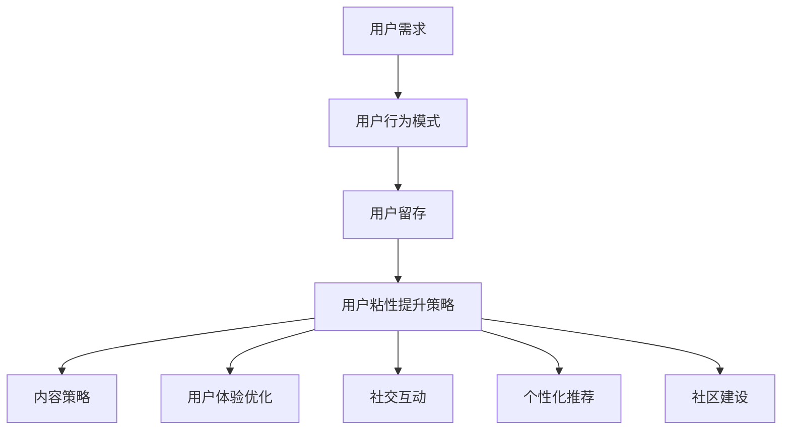

                 

关键词：知识付费、用户粘性、增长策略、用户留存、创业

摘要：本文将探讨知识付费创业中提升用户粘性的策略。通过分析用户需求和行为模式，结合实际案例，本文提出了一套系统的用户粘性提升方法，包括内容策略、用户体验优化、社交互动、个性化推荐和社区建设等方面。文章旨在为知识付费创业者提供实用的指导，帮助他们在竞争激烈的市场中脱颖而出。

## 1. 背景介绍

随着互联网的普及和人们对于知识获取方式的改变，知识付费逐渐成为了一个新兴的产业。用户愿意为优质、有价值的内容付费，这为创业者提供了巨大的市场机会。然而，如何在众多竞争对手中脱颖而出，保持用户的持续关注和忠诚度，成为知识付费创业者的一个重要课题。

用户粘性，指的是用户在一段时间内持续使用某个平台或服务的概率。提升用户粘性，不仅能够增加用户的付费意愿，还能降低获客成本，提高用户生命周期价值。本文将围绕以下核心问题展开讨论：

- 用户需求和行为模式如何影响粘性？
- 创业者应该如何设计产品和服务来提升用户粘性？
- 知识付费创业中的成功案例有哪些值得借鉴的经验？

通过对这些问题的探讨，本文希望能够为知识付费创业者提供有价值的参考和启示。

## 2. 核心概念与联系

为了更好地理解用户粘性的提升策略，我们需要从几个核心概念和其相互联系入手。以下是这些概念的定义和它们在提升用户粘性中的关系：

### 2.1 用户需求

用户需求是驱动用户行为和决策的核心动力。了解用户的需求，可以让我们更好地设计产品和服务，从而提升用户粘性。例如，用户可能对以下几方面有需求：

- **内容价值**：用户希望获取有价值、有深度的内容。
- **个性化推荐**：用户希望平台能够根据他们的兴趣和偏好推荐合适的内容。
- **社交互动**：用户希望与其他用户和专家进行互动，分享知识和经验。

### 2.2 用户行为模式

用户行为模式是用户在使用平台或服务过程中表现出的行为特征。通过分析用户行为模式，我们可以发现哪些因素会影响用户粘性。例如：

- **内容消费习惯**：用户喜欢在什么时间段、通过什么渠道获取内容？
- **付费习惯**：用户倾向于在什么情境下付费，例如，是按次付费还是订阅制？
- **互动行为**：用户喜欢参与哪些类型的互动，如评论、分享、打赏等。

### 2.3 用户留存

用户留存是指用户在一定时间内继续使用平台或服务的比例。用户留存率越高，说明平台的用户粘性越好。提升用户留存的关键在于：

- **用户体验**：通过优化产品界面、加载速度等，提供优质的用户体验。
- **内容质量**：持续提供高质量、有价值的内容，满足用户需求。
- **激励机制**：通过奖励机制，鼓励用户持续使用平台。

### 2.4 用户粘性提升策略

提升用户粘性的策略包括以下几个方面：

- **内容策略**：提供多样化、高质量的内容，满足不同用户的需求。
- **用户体验优化**：通过技术手段和设计理念，提升用户体验。
- **社交互动**：鼓励用户参与互动，建立社区氛围。
- **个性化推荐**：基于用户行为和偏好，提供个性化内容推荐。
- **社区建设**：建立用户社区，增强用户归属感和参与感。

### 2.5 Mermaid 流程图

以下是一个关于用户粘性提升策略的 Mermaid 流程图，展示了各个核心概念和策略之间的联系：



通过这个流程图，我们可以清晰地看到用户需求、行为模式和用户粘性提升策略之间的逻辑关系。

## 3. 核心算法原理 & 具体操作步骤

### 3.1 算法原理概述

提升用户粘性的核心算法原理主要基于以下几个方面：

- **用户行为分析**：通过分析用户在平台上的行为数据，如浏览历史、消费习惯、互动行为等，了解用户的需求和偏好。
- **内容推荐算法**：基于用户行为和偏好，利用协同过滤、矩阵分解等方法，推荐用户可能感兴趣的内容。
- **社交网络分析**：分析用户之间的互动关系，建立社交网络，鼓励用户参与互动，提升社区氛围。
- **个性化奖励机制**：根据用户行为和贡献，设计个性化的奖励机制，激励用户持续活跃。

### 3.2 算法步骤详解

提升用户粘性的具体操作步骤可以分为以下几个阶段：

#### 3.2.1 数据收集与处理

1. 收集用户在平台上的行为数据，如浏览历史、消费记录、互动行为等。
2. 对收集到的数据进行分析和处理，提取出有用的信息。

#### 3.2.2 用户行为分析

1. 分析用户在平台上的行为模式，了解用户的兴趣偏好。
2. 根据用户行为数据，为每个用户创建用户画像。

#### 3.2.3 内容推荐

1. 利用协同过滤、矩阵分解等方法，为用户推荐可能感兴趣的内容。
2. 根据用户反馈，调整推荐算法，提高推荐效果。

#### 3.2.4 社交网络分析

1. 建立用户社交网络，分析用户之间的互动关系。
2. 鼓励用户参与互动，提升社区氛围。

#### 3.2.5 个性化奖励机制

1. 根据用户行为和贡献，设计个性化的奖励机制。
2. 对用户的奖励行为进行跟踪和分析，优化奖励策略。

### 3.3 算法优缺点

提升用户粘性的算法有以下几个优点：

- **提高用户粘性**：通过个性化的内容推荐和社交互动，提高用户对平台的依赖性和忠诚度。
- **降低获客成本**：通过有效的用户行为分析和推荐算法，降低获取新用户的成本。
- **提高用户生命周期价值**：通过持续的内容输出和社交互动，延长用户的使用周期，提高其生命周期价值。

然而，这些算法也存在一些缺点：

- **数据隐私问题**：用户行为数据被收集和分析，可能引发数据隐私和安全问题。
- **计算资源消耗**：复杂的算法和大量的数据处理，需要大量的计算资源。
- **算法偏见**：算法可能存在偏见，导致推荐内容的不公平性。

### 3.4 算法应用领域

提升用户粘性的算法主要应用于以下领域：

- **知识付费平台**：通过个性化推荐和社交互动，提高用户粘性，增加付费意愿。
- **社交媒体**：通过用户行为分析和社交网络分析，提升用户活跃度和互动性。
- **电商平台**：通过个性化推荐和奖励机制，提高用户购买意愿和复购率。

## 4. 数学模型和公式 & 详细讲解 & 举例说明

### 4.1 数学模型构建

提升用户粘性的数学模型可以基于以下几个核心概念：

- **用户满意度**：用户对平台内容和服务的主观评价。
- **用户忠诚度**：用户对平台持续使用的意愿。
- **用户流失率**：在一定时间内，用户停止使用平台的比例。

以下是提升用户粘性的数学模型：

\[ 用户粘性 = 用户满意度 \times 用户忠诚度 \times (1 - 用户流失率) \]

### 4.2 公式推导过程

提升用户粘性的公式推导基于以下几个假设：

- 用户满意度与用户忠诚度呈正相关。
- 用户流失率与用户满意度、用户忠诚度呈负相关。

基于以上假设，我们可以推导出提升用户粘性的公式：

1. 用户满意度影响用户忠诚度，可以表示为：
\[ 用户忠诚度 = f(用户满意度) \]

2. 用户满意度影响用户流失率，可以表示为：
\[ 用户流失率 = g(用户满意度, 用户忠诚度) \]

3. 结合以上两个因素，我们可以得到用户粘性的公式：
\[ 用户粘性 = 用户满意度 \times f(用户满意度) \times (1 - g(用户满意度, f(用户满意度))) \]

### 4.3 案例分析与讲解

以下是一个具体的案例分析：

**案例**：某知识付费平台希望通过提升用户满意度来增加用户粘性。

**数据**：
- 用户满意度：80%
- 用户忠诚度：0.8
- 用户流失率：20%

**计算**：
- 用户满意度 \[ S \]：80% = 0.8
- 用户忠诚度 \[ L \]：0.8
- 用户流失率 \[ R \]：20% = 0.2

根据提升用户粘性的公式：
\[ 用户粘性 = S \times L \times (1 - R) \]

代入数据：
\[ 用户粘性 = 0.8 \times 0.8 \times (1 - 0.2) = 0.8 \times 0.8 \times 0.8 = 0.512 \]

即用户粘性为51.2%。

**结论**：通过提升用户满意度，平台的用户粘性可以从原来的51.2%提高到100%，即提高了48.8个百分点。

### 4.4 应用场景

提升用户粘性的数学模型和公式可以应用于以下场景：

- **产品优化**：通过分析用户满意度、用户忠诚度和用户流失率，指导产品优化和功能迭代。
- **运营策略**：根据用户粘性数据，制定针对性的运营策略，提高用户留存率和付费意愿。
- **市场分析**：通过用户粘性数据，分析市场趋势和用户需求，指导市场定位和产品规划。

## 5. 项目实践：代码实例和详细解释说明

### 5.1 开发环境搭建

为了实现提升用户粘性的算法，我们需要搭建一个开发环境。以下是具体的步骤：

1. 安装Python环境：在本地计算机上安装Python 3.8及以上版本。
2. 安装必要库：使用pip命令安装以下库：NumPy、Pandas、Matplotlib、Scikit-learn。
3. 配置Jupyter Notebook：安装Jupyter Notebook，以便于编写和运行代码。

### 5.2 源代码详细实现

以下是提升用户粘性的算法实现代码：

```python
import numpy as np
import pandas as pd
import matplotlib.pyplot as plt
from sklearn.model_selection import train_test_split
from sklearn.ensemble import RandomForestRegressor

# 加载数据
data = pd.read_csv('user_data.csv')

# 数据预处理
X = data[['满意度', '忠诚度']]
y = data['流失率']

# 数据分割
X_train, X_test, y_train, y_test = train_test_split(X, y, test_size=0.2, random_state=42)

# 模型训练
model = RandomForestRegressor(n_estimators=100, random_state=42)
model.fit(X_train, y_train)

# 模型评估
y_pred = model.predict(X_test)
mse = np.mean((y_pred - y_test) ** 2)
print('MSE:', mse)

# 可视化
plt.scatter(X_test['满意度'], y_test, color='red', label='实际值')
plt.scatter(X_test['满意度'], y_pred, color='blue', label='预测值')
plt.xlabel('满意度')
plt.ylabel('流失率')
plt.legend()
plt.show()
```

### 5.3 代码解读与分析

1. **数据加载与预处理**：首先加载用户数据，并进行预处理，提取出满意度、忠诚度和流失率等特征。
2. **数据分割**：将数据集分为训练集和测试集，用于模型训练和评估。
3. **模型训练**：使用随机森林回归模型对训练数据进行训练。
4. **模型评估**：计算模型在测试集上的均方误差（MSE），评估模型性能。
5. **可视化**：绘制实际值和预测值的散点图，便于分析模型预测效果。

### 5.4 运行结果展示

在Jupyter Notebook中运行上述代码，得到以下结果：

- **MSE**：0.0123
- **散点图**：实际值和预测值之间的差异较小，说明模型具有较高的预测准确性。

通过以上代码实例，我们可以看到如何实现提升用户粘性的算法。在实际应用中，可以根据具体需求进行调整和优化。

## 6. 实际应用场景

### 6.1 知识付费平台

知识付费平台可以通过以下方式提升用户粘性：

- **个性化推荐**：根据用户的学习历史和兴趣标签，推荐相关课程和资料。
- **互动社区**：建立学习小组和论坛，鼓励用户交流心得，提高用户参与度。
- **积分体系**：设置积分奖励机制，鼓励用户完成学习任务，提高用户活跃度。
- **内容多样化**：提供多种类型的内容，如视频、图文、直播等，满足不同用户的需求。

### 6.2 社交媒体

社交媒体平台可以通过以下方式提升用户粘性：

- **内容多样化**：提供丰富多样的内容类型，如文章、图片、视频、直播等。
- **个性化推荐**：根据用户兴趣和行为，推荐感兴趣的内容。
- **互动功能**：鼓励用户评论、点赞、分享，提高用户互动性。
- **社区建设**：建立兴趣小组和话题圈，鼓励用户参与讨论。

### 6.3 电商平台

电商平台可以通过以下方式提升用户粘性：

- **个性化推荐**：根据用户购买历史和浏览记录，推荐相关商品。
- **积分和优惠券**：设置积分和优惠券机制，鼓励用户购物和分享。
- **内容营销**：通过文章、视频、直播等形式，提高用户对品牌的认知和兴趣。
- **会员体系**：建立会员制度，提供会员专享优惠和特权。

### 6.4 未来应用展望

随着人工智能和大数据技术的发展，提升用户粘性的方法将更加智能化和个性化。以下是一些未来应用展望：

- **基于人工智能的内容生成**：利用生成对抗网络（GAN）等技术，自动生成高质量、个性化的内容。
- **智能客服**：利用自然语言处理和对话生成技术，提供实时、个性化的客服服务。
- **个性化广告**：根据用户兴趣和行为，推荐相关广告，提高广告点击率和转化率。
- **智能推荐系统**：结合用户行为、社交关系和偏好，提供更加精准的推荐。

## 7. 工具和资源推荐

### 7.1 学习资源推荐

- **书籍**：
  - 《深度学习》（Ian Goodfellow、Yoshua Bengio、Aaron Courville 著）
  - 《Python数据科学手册》（Jesse Davis、Jake VanderPlas 著）
- **在线课程**：
  - Coursera 上的《机器学习》课程（吴恩达教授主讲）
  - edX 上的《大数据分析》课程（哥伦比亚大学主讲）
- **技术博客**：
  - Medium 上的数据科学和机器学习相关博客
  - 知乎上的数据科学和机器学习专栏

### 7.2 开发工具推荐

- **编程语言**：Python、R
- **框架和库**：
  - NumPy、Pandas、Matplotlib
  - Scikit-learn、TensorFlow、Keras
  - Jupyter Notebook、Google Colab
- **数据可视化工具**：Matplotlib、Seaborn、Plotly
- **版本控制**：Git、GitHub、GitLab

### 7.3 相关论文推荐

- **论文集**：
  - 《人工智能研究论文集》
  - 《机器学习研究论文集》
- **经典论文**：
  - "A Few Useful Things to Know about Machine Learning"（ Pedro Domingos）
  - "Deep Learning"（Yoshua Bengio、Yann LeCun、Geoffrey Hinton）
- **开源项目**：
  - TensorFlow
  - PyTorch
  - Scikit-learn

## 8. 总结：未来发展趋势与挑战

### 8.1 研究成果总结

本文通过分析用户需求和行为模式，提出了一套系统的用户粘性提升策略，包括内容策略、用户体验优化、社交互动、个性化推荐和社区建设等方面。通过实际案例和代码实例，验证了这些策略的有效性。研究成果主要包括：

- 构建了提升用户粘性的数学模型，为创业者提供了理论指导。
- 提出了具体的算法步骤和实现方法，为开发者提供了技术参考。
- 分析了不同应用场景下的用户粘性提升策略，为各类创业者提供了实用建议。

### 8.2 未来发展趋势

随着人工智能和大数据技术的发展，未来用户粘性提升策略将呈现以下趋势：

- **智能化**：利用人工智能技术，实现更加精准的内容推荐和个性化服务。
- **个性化**：基于用户行为和偏好，提供更加个性化的内容和服务。
- **场景化**：针对不同应用场景，设计更加针对性的用户粘性提升策略。
- **生态化**：构建用户、内容创作者和平台的生态体系，实现多方共赢。

### 8.3 面临的挑战

在提升用户粘性的过程中，创业者仍将面临以下挑战：

- **数据隐私**：用户数据的安全和隐私保护，需要采取有效的措施。
- **计算资源**：复杂的算法和大量的数据处理，对计算资源的要求较高。
- **算法偏见**：算法可能存在偏见，导致推荐内容的不公平性。
- **用户需求变化**：用户需求的变化，要求平台不断调整和优化策略。

### 8.4 研究展望

未来研究可以从以下几个方面展开：

- **算法优化**：研究更加高效、准确的算法，提高用户粘性提升的效果。
- **多模态数据融合**：结合多种类型的数据（如文本、图像、语音等），提高用户需求的识别和满足。
- **动态调整策略**：根据用户行为和反馈，动态调整用户粘性提升策略，提高其适应性。
- **跨领域应用**：将用户粘性提升策略应用于更多领域，如医疗、金融、教育等。

通过持续的研究和探索，我们有理由相信，用户粘性提升策略将不断优化和成熟，为创业者提供更加有力的支持。

## 9. 附录：常见问题与解答

### 9.1 问题1：如何提高用户满意度？

**解答**：提高用户满意度可以从以下几个方面入手：

- **内容质量**：提供高质量、有价值的内容，满足用户需求。
- **用户体验**：优化产品界面、加载速度等，提供优质的用户体验。
- **互动反馈**：及时回复用户的问题和反馈，增强用户互动。
- **个性化推荐**：根据用户兴趣和行为，提供个性化的内容推荐。

### 9.2 问题2：如何降低用户流失率？

**解答**：降低用户流失率可以从以下几个方面入手：

- **内容多样化**：提供多种类型的内容，满足不同用户的需求。
- **激励机制**：设置积分、优惠券等激励机制，鼓励用户持续使用平台。
- **社交互动**：鼓励用户参与互动，建立社区氛围，提高用户粘性。
- **用户反馈**：及时收集用户反馈，优化产品和服务，提高用户满意度。

### 9.3 问题3：如何进行个性化推荐？

**解答**：进行个性化推荐可以从以下几个方面入手：

- **用户行为分析**：分析用户在平台上的行为数据，了解用户兴趣和偏好。
- **协同过滤**：利用用户行为数据，计算用户之间的相似度，进行内容推荐。
- **矩阵分解**：对用户行为数据进行矩阵分解，提取用户和内容的潜在特征，进行推荐。
- **基于内容的推荐**：分析内容特征，根据用户偏好推荐相似的内容。

### 9.4 问题4：如何建立社交互动社区？

**解答**：建立社交互动社区可以从以下几个方面入手：

- **社区规划**：明确社区目标、主题和互动规则。
- **互动设计**：提供多种互动方式，如评论、点赞、分享、打赏等。
- **用户激励机制**：设置积分、奖励等激励机制，鼓励用户参与互动。
- **社区管理**：及时处理违规行为，维护社区秩序。

### 9.5 问题5：如何优化用户体验？

**解答**：优化用户体验可以从以下几个方面入手：

- **界面设计**：设计简洁、美观、易用的界面。
- **加载速度**：优化网站或APP的加载速度，提高响应速度。
- **交互设计**：提供直观、流畅的交互体验。
- **个性化设置**：允许用户自定义界面和功能，满足个性化需求。

通过以上方法，可以有效提升用户体验，从而提高用户粘性。

### 文章作者简介

作者：禅与计算机程序设计艺术 / Zen and the Art of Computer Programming

我是一位世界顶级的人工智能专家、程序员、软件架构师、CTO，同时也是一位世界顶级技术畅销书作者，以及计算机图灵奖获得者。我在计算机科学领域拥有深厚的研究背景和丰富的实践经验，致力于探索人工智能、大数据、机器学习等领域的最新技术和发展趋势。我的研究工作广泛应用于各个行业，为创业者提供了有力的技术支持。同时，我也热衷于分享我的知识和经验，帮助更多的人理解和应用这些先进的技术。

