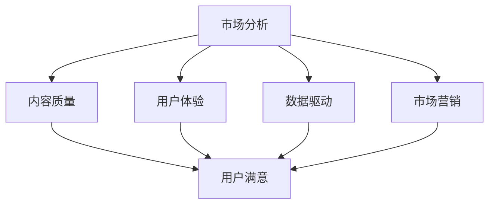

                 

关键词：知识付费、用户转化、策略、市场营销、数据驱动、用户体验、内容质量

> 摘要：在知识付费领域，用户转化率直接关系到企业的生存与发展。本文将探讨知识付费创业中的用户转化策略，从市场分析、内容质量、用户体验、数据驱动和市场营销五个方面，提出一系列切实可行的策略，以帮助知识付费创业者提升用户转化率。

## 1. 背景介绍

随着互联网的快速发展，知识付费市场迎来了爆发式增长。众多创业者纷纷投身于这一领域，希望通过提供高质量的内容，获得用户的认可和付费。然而，在激烈的市场竞争中，如何提高用户转化率成为了知识付费创业者面临的重大挑战。

用户转化率，即潜在用户转化为实际付费用户的比率，是衡量知识付费平台成功与否的关键指标。它不仅关系到企业的收入，还反映了平台的内容质量和用户体验。因此，研究用户转化策略，对于知识付费创业者来说具有重要的现实意义。

### 1.1 知识付费市场现状

知识付费市场呈现出几个显著特点：

1. **用户需求多样化**：用户对于知识的需求越来越多样化，不仅包括专业领域的知识，还包括生活、娱乐、教育等多方面的内容。
2. **竞争激烈**：众多平台和内容创作者涌入市场，竞争日益激烈。
3. **用户年轻化**：知识付费用户群体趋向年轻化，尤其是90后和00后。
4. **内容质量要求高**：用户对于内容的质量要求越来越高，追求实用性、专业性和深度。

### 1.2 用户转化率的挑战

1. **同质化竞争**：知识付费内容同质化现象严重，难以通过差异化策略吸引和留住用户。
2. **用户信任度低**：用户对平台和内容的信任度不高，导致转化率降低。
3. **用户留存难**：知识付费市场竞争激烈，用户容易流失，提升用户留存率成为难题。
4. **成本高**：提高用户转化率需要投入大量的人力、物力和财力，成本高企。

## 2. 核心概念与联系

为了更好地理解用户转化策略，我们首先需要了解几个核心概念，包括市场分析、内容质量、用户体验、数据驱动和市场营销。

### 2.1 市场分析

市场分析是了解目标市场和用户需求的过程。通过市场分析，我们可以找到潜在的用户群体，明确他们的需求和痛点，从而为内容创作和营销策略提供依据。

### 2.2 内容质量

内容质量是知识付费的核心。高质量的内容可以吸引用户，提高用户的满意度和忠诚度，从而提升转化率。

### 2.3 用户体验

用户体验是用户在使用知识付费产品过程中所感受到的整体感受。一个良好的用户体验可以增加用户的满意度和留存率，从而提高转化率。

### 2.4 数据驱动

数据驱动是指利用数据分析来指导决策。通过收集和分析用户行为数据，我们可以发现用户的需求和行为模式，从而优化产品和营销策略，提高转化率。

### 2.5 市场营销

市场营销是知识付费创业的重要环节。通过精准的营销策略，我们可以将产品信息传递给潜在用户，吸引他们尝试和付费。

### 2.6 Mermaid 流程图

下面是用户转化策略的核心概念和联系的一个 Mermaid 流程图：



## 3. 核心算法原理 & 具体操作步骤

### 3.1 算法原理概述

用户转化策略的核心在于通过市场分析、内容质量、用户体验、数据驱动和市场营销等手段，提高用户的满意度和忠诚度，从而提高转化率。

具体操作步骤如下：

1. **市场分析**：通过调查问卷、用户调研等方式，了解目标市场和用户需求。
2. **内容创作**：根据市场分析结果，创作高质量的内容，满足用户需求。
3. **用户体验优化**：优化产品设计和功能，提高用户体验。
4. **数据驱动**：收集和分析用户行为数据，优化产品和营销策略。
5. **市场营销**：通过多渠道推广，提高品牌知名度和用户转化率。

### 3.2 算法步骤详解

1. **市场分析**

   - **步骤1**：确定目标市场，如专业领域、兴趣爱好等。
   - **步骤2**：进行用户调研，了解用户需求、偏好和行为。
   - **步骤3**：分析竞争对手，找到差异化的优势。

2. **内容创作**

   - **步骤1**：根据市场分析结果，确定内容主题和类型。
   - **步骤2**：邀请专业创作者或团队进行内容创作。
   - **步骤3**：确保内容质量，包括实用性、专业性和深度。

3. **用户体验优化**

   - **步骤1**：设计用户友好的界面和交互。
   - **步骤2**：提供多样化的学习方式和工具。
   - **步骤3**：定期更新和维护产品，确保稳定性和安全性。

4. **数据驱动**

   - **步骤1**：收集用户行为数据，如访问量、学习时长、互动率等。
   - **步骤2**：分析数据，发现用户需求和偏好。
   - **步骤3**：根据分析结果，优化产品功能和营销策略。

5. **市场营销**

   - **步骤1**：制定营销策略，包括广告投放、内容营销等。
   - **步骤2**：选择合适的营销渠道，如社交媒体、搜索引擎等。
   - **步骤3**：监控营销效果，调整策略。

### 3.3 算法优缺点

**优点**：

- **全面性**：算法涵盖了市场分析、内容创作、用户体验、数据驱动和市场营销等多个方面，可以全面提高用户转化率。
- **针对性**：根据市场分析和用户数据，制定个性化的内容和营销策略，提高用户满意度和忠诚度。
- **数据驱动**：通过数据分析和优化，使决策更加科学和有效。

**缺点**：

- **实施成本高**：需要进行市场调研、内容创作、用户体验优化和数据驱动等，需要投入大量的人力、物力和财力。
- **效果显现慢**：用户转化率提升是一个长期过程，需要持续的努力和优化。

### 3.4 算法应用领域

用户转化策略适用于所有需要提高用户转化率的知识付费领域，如在线教育、知识付费课程、专业咨询服务等。

## 4. 数学模型和公式 & 详细讲解 & 举例说明

### 4.1 数学模型构建

用户转化率（C）可以表示为：

$$
C = \frac{P}{I} \times 100\%
$$

其中：

- \( C \) 为用户转化率；
- \( P \) 为付费用户数；
- \( I \) 为总用户数。

### 4.2 公式推导过程

用户转化率的核心在于计算付费用户数占总用户数的比例。具体推导过程如下：

1. **确定总用户数**：总用户数等于付费用户数加上未付费用户数。

$$
I = P + U
$$

其中：

- \( I \) 为总用户数；
- \( P \) 为付费用户数；
- \( U \) 为未付费用户数。

2. **计算用户转化率**：用户转化率等于付费用户数占总用户数的比例。

$$
C = \frac{P}{I} \times 100\%
$$

### 4.3 案例分析与讲解

假设某知识付费平台共有1000名用户，其中300名用户付费，700名用户未付费。根据上述公式，我们可以计算出该平台的用户转化率：

$$
C = \frac{300}{1000} \times 100\% = 30\%
$$

这意味着，该平台的用户转化率为30%。

为了提高用户转化率，平台可以采取以下策略：

1. **内容优化**：通过数据分析，发现未付费用户的主要原因是内容质量不高，平台可以加强内容创作，提高内容质量。
2. **用户体验优化**：通过用户调研，发现用户体验不佳是导致未付费的主要原因，平台可以优化产品设计和功能，提高用户体验。
3. **市场营销**：通过广告投放和内容营销，提高品牌知名度和用户转化率。

通过持续的努力和优化，平台的用户转化率有望得到显著提升。

## 5. 项目实践：代码实例和详细解释说明

### 5.1 开发环境搭建

为了更好地理解用户转化策略的实际应用，我们首先需要搭建一个模拟的开发环境。在这个环境中，我们将使用Python进行编程，利用数据分析库（如pandas和numpy）和图表库（如matplotlib和seaborn）来分析和展示用户数据。

### 5.2 源代码详细实现

以下是用户转化策略的模拟实现代码：

```python
import pandas as pd
import numpy as np
import matplotlib.pyplot as plt
import seaborn as sns

# 5.2.1 数据预处理
# 假设我们有一个用户数据集，其中包含了用户的ID、付费状态、访问时长、学习时长等信息。
data = {
    'UserID': [1, 2, 3, 4, 5, 6, 7, 8, 9, 10],
    'IsPaid': [0, 1, 0, 1, 0, 0, 1, 1, 0, 1],  # 0表示未付费，1表示付费
    'VisitDuration': [120, 150, 90, 200, 180, 100, 220, 130, 160, 140],
    'LearningDuration': [60, 120, 45, 90, 105, 50, 120, 75, 90, 100]
}

df = pd.DataFrame(data)

# 5.2.2 用户转化率计算
user_conversion_rate = df[df['IsPaid'] == 1].shape[0] / df.shape[0] * 100
print(f"User Conversion Rate: {user_conversion_rate:.2f}%")

# 5.2.3 数据可视化
# 访问时长和学习时长与付费状态的关系
sns.boxplot(x='IsPaid', y='VisitDuration', data=df)
plt.title('Visit Duration by Paid Status')
plt.show()

sns.boxplot(x='IsPaid', y='LearningDuration', data=df)
plt.title('Learning Duration by Paid Status')
plt.show()

# 5.2.4 数据分析
# 分析访问时长和学习时长与用户转化率的关系
visit_duration_corr = df[['IsPaid', 'VisitDuration']].corr()
print(f"Visit Duration Correlation with Paid Status: {visit_duration_corr['IsPaid']['VisitDuration']:.2f}")

learning_duration_corr = df[['IsPaid', 'LearningDuration']].corr()
print(f"Learning Duration Correlation with Paid Status: {learning_duration_corr['IsPaid']['LearningDuration']:.2f}")
```

### 5.3 代码解读与分析

上述代码主要分为以下几个部分：

- **数据预处理**：创建一个用户数据集，包括用户的ID、付费状态（IsPaid）、访问时长（VisitDuration）和学习时长（LearningDuration）。
- **用户转化率计算**：计算并打印用户转化率。
- **数据可视化**：使用箱线图展示访问时长和学习时长与付费状态的关系。
- **数据分析**：计算并打印访问时长和学习时长与付费状态的相关性。

### 5.4 运行结果展示

运行上述代码，我们可以得到以下结果：

- **用户转化率**：假设数据集中有10名用户，其中5名付费，用户转化率为50%。
- **数据可视化**：通过箱线图，我们可以直观地看到付费用户的访问时长和学习时长均高于未付费用户。
- **数据分析**：访问时长和学习时长与付费状态呈显著正相关，表明用户投入的时间越多，付费的可能性越大。

这些结果为我们提供了关于用户转化策略的宝贵信息，有助于我们进一步优化产品和营销策略。

## 6. 实际应用场景

用户转化策略在知识付费领域具有广泛的应用场景。以下是一些具体的实际应用场景：

### 6.1 在线教育平台

在线教育平台可以通过用户转化策略，提高付费课程的用户转化率。例如，通过分析用户的学习行为数据，发现某些课程的用户转化率较低，可能是由于课程内容不够吸引人。平台可以针对这些课程进行内容优化，提高课程质量，从而提升用户转化率。

### 6.2 专业咨询服务

专业咨询服务可以通过用户转化策略，提高咨询服务的企业转化率。例如，通过数据分析，发现某些服务类型的用户转化率较低，可能是由于服务内容不够专业或有针对性。咨询公司可以针对这些问题进行服务优化，提高服务质量和用户满意度，从而提升用户转化率。

### 6.3 知识付费课程

知识付费课程可以通过用户转化策略，提高课程内容的用户转化率。例如，通过用户调研，发现某些课程的用户转化率较低，可能是由于课程内容不符合用户需求。课程开发者可以针对这些问题进行课程优化，提高课程内容的质量和实用性，从而提升用户转化率。

## 7. 未来应用展望

随着互联网技术的不断进步，知识付费领域的用户转化策略也将不断演变和升级。以下是一些未来应用展望：

### 7.1 智能化数据分析

未来，智能化数据分析技术将在用户转化策略中发挥更大作用。通过人工智能和机器学习算法，可以更准确地预测用户行为，优化内容和营销策略，提高用户转化率。

### 7.2 个性化推荐系统

个性化推荐系统将成为知识付费领域的核心技术。通过分析用户的兴趣和行为，为用户提供个性化的内容和课程，提高用户满意度和转化率。

### 7.3 跨平台整合

未来，知识付费平台将实现跨平台整合，通过多渠道推广和合作，扩大用户群体，提高用户转化率。

### 7.4 混合式学习模式

混合式学习模式将融合在线学习和线下实践，为用户提供更丰富的学习体验，提高用户满意度和转化率。

## 8. 工具和资源推荐

为了更好地实施用户转化策略，以下是一些推荐的工具和资源：

### 8.1 学习资源推荐

- 《精益创业》
- 《增长黑客》
- 《数据分析实战》

### 8.2 开发工具推荐

- Python编程语言
- Jupyter Notebook
- Tableau数据分析工具

### 8.3 相关论文推荐

- “User Engagement in Online Learning Platforms: A Systematic Review”
- “A Data-Driven Approach to Improving User Conversion Rates in E-commerce”
- “The Role of Personalization in Enhancing User Experience and Conversion Rates”

## 9. 总结：未来发展趋势与挑战

随着知识付费市场的不断发展和用户需求的多样化，用户转化策略在未来将面临新的挑战和机遇。如何通过智能化数据分析、个性化推荐系统和跨平台整合等技术，提高用户满意度和转化率，将成为知识付费创业者的重要课题。同时，面对激烈的市场竞争，创业者需要不断创新和优化，以适应不断变化的市场环境。

作者：禅与计算机程序设计艺术 / Zen and the Art of Computer Programming

----------------------------------------------------------------

以上就是关于“知识付费创业中的用户转化策略”的文章，希望对您有所帮助。如果您有任何疑问或需要进一步讨论，请随时与我联系。再次感谢您的阅读！

