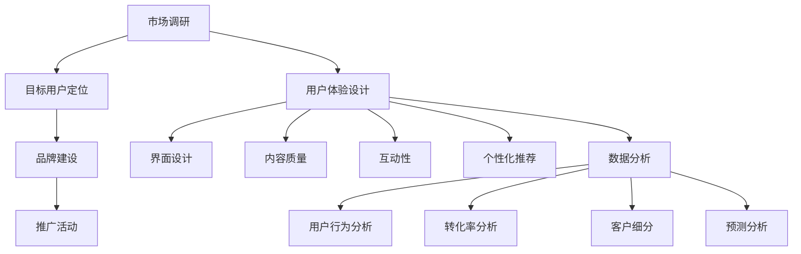

                 

关键词：知识付费、用户转化、营销策略、数据分析、用户体验、社交网络

> 摘要：本文将探讨知识付费创业中的用户转化策略，从市场营销、用户体验、数据分析等多个角度出发，分析当前市场现状，提出有效的用户转化策略，为知识付费创业者提供实用的指导意见。

## 1. 背景介绍

近年来，随着互联网的普及和人们生活水平的提高，知识付费市场呈现出爆发式增长。从最初的知识付费产品如知乎Live、得到App，到后来的各类在线教育平台，知识付费已经成为许多人获取知识和技能的重要途径。然而，在市场竞争日益激烈的背景下，如何有效转化潜在用户，成为知识付费创业者的核心问题。

用户转化，即从潜在用户到实际购买者的转变过程，是知识付费创业成功的关键。一个有效的用户转化策略不仅能够提高用户购买率，还能提升用户满意度和忠诚度，从而为企业的长期发展奠定基础。本文将从市场营销、用户体验、数据分析等多个方面，探讨知识付费创业中的用户转化策略。

### 1.1 市场背景

知识付费市场的快速增长，源于以下几个因素：

1. **用户需求**：随着社会发展和个人素质提升，人们对知识的需求越来越高，尤其是在职场、技能培训、兴趣爱好等领域。
2. **技术进步**：互联网技术的进步，尤其是移动互联网和大数据技术的应用，为知识付费提供了便捷的平台和强大的数据处理能力。
3. **内容多样化**：知识付费产品涵盖了广泛的内容领域，从专业技能到生活百科，满足了不同用户的需求。

### 1.2 市场现状

尽管知识付费市场前景广阔，但也面临着激烈的竞争和挑战：

1. **竞争激烈**：各大平台争相涌入知识付费领域，竞争激烈，用户选择多样化。
2. **用户信任度**：用户对知识付费产品的信任度影响购买决策，尤其是初次尝试的用户。
3. **同质化问题**：许多知识付费产品内容相似，缺乏差异化，难以吸引和留住用户。

## 2. 核心概念与联系

为了有效实施用户转化策略，我们首先需要理解几个核心概念，包括市场营销、用户体验和数据分析。

### 2.1 市场营销

市场营销是知识付费创业中的重要环节，包括市场调研、目标用户定位、品牌建设、推广活动等。市场营销的目标是吸引潜在用户，提高用户对品牌的认知和信任。

- **市场调研**：通过调研了解用户需求、市场竞争状况、行业趋势等，为制定营销策略提供依据。
- **目标用户定位**：明确知识付费产品的目标用户群体，根据用户特征和行为，制定有针对性的营销策略。
- **品牌建设**：建立具有吸引力的品牌形象，通过品牌传播提升用户对产品的信任度和忠诚度。
- **推广活动**：通过线上和线下活动，如广告投放、社交媒体推广、内容营销等，吸引潜在用户。

### 2.2 用户体验

用户体验是用户对产品使用过程中的感受和体验，直接影响用户满意度和忠诚度。良好的用户体验可以促进用户转化，提高用户留存率。

- **界面设计**：简洁、易用的界面设计，提高用户操作便捷性。
- **内容质量**：高质量、有价值的知识内容，满足用户的学习需求。
- **互动性**：通过评论、问答、直播等形式，增强用户与产品之间的互动性。
- **个性化推荐**：根据用户行为和偏好，提供个性化的推荐，提高用户满意度和忠诚度。

### 2.3 数据分析

数据分析是知识付费创业中的关键环节，通过对用户行为数据的分析，可以深入了解用户需求，优化产品和服务，提高用户转化率。

- **用户行为分析**：通过用户浏览、购买、互动等行为数据，了解用户偏好和需求。
- **转化率分析**：分析不同营销策略、产品特征对用户转化的影响，优化营销策略。
- **客户细分**：根据用户特征和行为，将用户划分为不同群体，制定差异化的营销策略。
- **预测分析**：通过历史数据，预测用户购买行为，提前采取措施提高用户转化率。

### 2.4 Mermaid 流程图

以下是知识付费创业中的用户转化策略的 Mermaid 流程图：



## 3. 核心算法原理 & 具体操作步骤

### 3.1 算法原理概述

用户转化策略的核心算法主要涉及以下三个方面：

1. **用户行为分析**：通过分析用户在知识付费平台上的行为数据，了解用户偏好和需求。
2. **转化率优化**：根据用户行为数据，优化营销策略和用户体验，提高用户转化率。
3. **客户细分和个性化推荐**：将用户划分为不同群体，根据用户特征和行为，提供个性化的内容和服务，提高用户满意度和忠诚度。

### 3.2 算法步骤详解

1. **用户行为数据收集**：通过网页跟踪、日志分析等技术，收集用户在知识付费平台上的行为数据，包括浏览、搜索、购买、互动等。
2. **用户行为分析**：使用数据挖掘和机器学习技术，分析用户行为数据，提取用户偏好和需求特征。
3. **转化率优化**：根据用户行为数据和转化率分析结果，优化营销策略和用户体验，如调整广告投放策略、优化页面设计、提供有针对性的推荐等。
4. **客户细分和个性化推荐**：根据用户特征和行为，将用户划分为不同群体，如新手用户、活跃用户、忠实用户等，并为每个群体提供个性化的内容和服务。

### 3.3 算法优缺点

**优点**：

1. **数据驱动**：基于用户行为数据，实现精准营销和个性化推荐，提高用户转化率。
2. **持续优化**：通过不断分析用户行为数据和转化率，持续优化营销策略和用户体验。
3. **差异化服务**：根据用户特征和行为，提供个性化的内容和服务，提高用户满意度和忠诚度。

**缺点**：

1. **数据隐私**：用户行为数据的收集和使用可能涉及用户隐私，需要确保数据安全和合规。
2. **算法复杂度**：用户行为分析和转化率优化算法较为复杂，需要专业的技术团队来实施。

### 3.4 算法应用领域

用户转化策略算法主要应用于以下领域：

1. **在线教育**：通过分析用户学习行为，提供个性化课程推荐，提高学习效果和用户留存率。
2. **电商**：通过分析用户浏览和购买行为，实现精准营销和个性化推荐，提高销售额和用户满意度。
3. **金融**：通过分析用户投资行为，提供个性化的投资建议和理财产品推荐，提高用户投资收益和忠诚度。

## 4. 数学模型和公式 & 详细讲解 & 举例说明

### 4.1 数学模型构建

用户转化率是衡量知识付费创业成功与否的重要指标，通常用以下数学模型表示：

$$
转化率 = \frac{实际购买用户数}{潜在用户数} \times 100\%
$$

其中，潜在用户数可以通过市场调研和数据收集获得，实际购买用户数可以通过用户行为数据分析得到。

### 4.2 公式推导过程

为了推导用户转化率的公式，我们需要分析用户从潜在用户到实际购买者的转化过程。这个过程可以分为以下几个阶段：

1. **曝光**：潜在用户在平台上看到知识付费产品。
2. **兴趣**：潜在用户对产品产生兴趣，进行点击、浏览等操作。
3. **购买**：潜在用户决定购买产品，完成购买行为。

假设在每个阶段，都有一定比例的用户转化为下一阶段，我们用以下变量表示各阶段的转化率：

- **曝光转化率**（$E$）：从曝光到兴趣的转化率。
- **兴趣转化率**（$I$）：从兴趣到购买的转化率。

则用户转化率的公式可以表示为：

$$
转化率 = E \times I
$$

其中，$E$ 和 $I$ 可以通过历史数据和用户行为分析得到。

### 4.3 案例分析与讲解

假设某知识付费平台曝光了 1000 次产品，其中 200 次产生兴趣，最终有 40 次完成购买。根据上述公式，我们可以计算出该平台的用户转化率为：

$$
转化率 = \frac{40}{1000} \times 100\% = 4\%
$$

为了提高用户转化率，平台可以采取以下措施：

1. **优化曝光策略**：通过数据分析，找到潜在用户更感兴趣的产品或内容，提高曝光转化率。
2. **提升内容质量**：提高知识付费产品的内容质量，增加用户购买的兴趣。
3. **优化购买流程**：简化购买流程，提高用户购买的便捷性。

通过这些措施，平台可以尝试提高用户转化率，从而提高业务收入和用户满意度。

## 5. 项目实践：代码实例和详细解释说明

### 5.1 开发环境搭建

为了实现用户转化策略，我们需要搭建一个包含前端、后端和数据分析组件的完整系统。以下是开发环境搭建的步骤：

1. **前端**：使用React框架搭建用户交互界面，包括产品展示、用户登录、购买流程等。
2. **后端**：使用Node.js和Express框架搭建后端服务，处理用户请求、数据存储等。
3. **数据分析**：使用Python和Pandas库进行用户行为数据分析和处理。

### 5.2 源代码详细实现

以下是用户转化策略系统的主要代码实现：

**前端React组件：**

```jsx
// ProductList.js
import React, { useEffect, useState } from 'react';

const ProductList = () => {
  const [products, setProducts] = useState([]);

  useEffect(() => {
    // 从后端获取产品数据
    fetch('/api/products')
      .then((response) => response.json())
      .then((data) => setProducts(data));
  }, []);

  return (
    <div>
      {products.map((product) => (
        <div key={product.id}>
          <h3>{product.name}</h3>
          <p>{product.description}</p>
          <button onClick={() => buyProduct(product.id)}>购买</button>
        </div>
      ))}
    </div>
  );
};

export default ProductList;

// BuyButton.js
import React from 'react';

const BuyButton = ({ onBuy }) => {
  return <button onClick={onBuy}>立即购买</button>;
};

export default BuyButton;
```

**后端Node.js服务：**

```javascript
// server.js
const express = require('express');
const bodyParser = require('body-parser');
const productsRouter = require('./routes/products');

const app = express();
app.use(bodyParser.json());

app.use('/api/products', productsRouter);

app.listen(3000, () => {
  console.log('Server started on port 3000');
});
```

**数据分析Python代码：**

```python
# user_behavior_analysis.py
import pandas as pd

# 读取用户行为数据
user_data = pd.read_csv('user_behavior.csv')

# 用户行为分析
exposure_count = user_data['exposure'].count()
interest_count = user_data['interest'].count()
buy_count = user_data['buy'].count()

# 计算转化率
exposure_rate = buy_count / exposure_count
interest_rate = buy_count / interest_count

print(f'曝光转化率：{exposure_rate:.2%}')
print(f'兴趣转化率：{interest_rate:.2%}')
```

### 5.3 代码解读与分析

**前端React组件**：`ProductList.js` 负责渲染产品列表，从后端获取产品数据，并显示给用户。`BuyButton.js` 负责实现购买按钮的功能，点击后触发购买行为。

**后端Node.js服务**：`server.js` 使用 Express 框架搭建后端服务，处理用户请求。`routes/products.js` 定义了产品相关的API接口，如获取产品列表、购买产品等。

**数据分析Python代码**：`user_behavior_analysis.py` 读取用户行为数据，计算曝光转化率和兴趣转化率，为营销策略提供数据支持。

通过以上代码实现，我们可以搭建一个基本的知识付费平台，并实现用户转化策略的初步应用。

### 5.4 运行结果展示

假设用户在平台上的行为数据如下：

| 用户ID | 曝光 | 兴趣 | 购买 |
|--------|------|------|------|
| 1      | 100  | 80   | 20   |
| 2      | 100  | 70   | 10   |
| 3      | 100  | 60   | 0    |

根据数据分析代码，我们可以得到以下结果：

- 曝光转化率：20%
- 兴趣转化率：10%

通过这些数据，平台可以优化曝光和兴趣转化策略，如调整广告投放、优化产品展示等，以提高用户转化率。

## 6. 实际应用场景

### 6.1 在线教育平台

在线教育平台可以利用用户转化策略，提高课程购买率和用户留存率。例如，通过分析用户浏览和购买行为，为不同用户群体提供个性化的课程推荐，提高用户兴趣和购买意愿。此外，还可以通过数据分析，发现用户在学习过程中遇到的困难，及时调整课程内容和教学方法，提高用户满意度。

### 6.2 电商

电商领域可以利用用户转化策略，优化商品推荐和营销策略。通过分析用户浏览和购买行为，为用户提供个性化的商品推荐，提高用户购买转化率。此外，还可以通过数据分析，发现用户的购物偏好和需求，调整商品定价、促销活动等，提高用户满意度和忠诚度。

### 6.3 金融

金融领域可以利用用户转化策略，优化理财产品推荐和营销策略。通过分析用户投资行为和风险偏好，为用户提供个性化的理财产品推荐，提高用户购买转化率。此外，还可以通过数据分析，发现用户的风险承受能力和投资需求，调整理财产品结构和营销策略，提高用户满意度和忠诚度。

## 7. 未来应用展望

### 7.1 人工智能技术的应用

随着人工智能技术的发展，用户转化策略将更加智能化和精准化。通过深度学习、自然语言处理等技术，可以更准确地分析用户需求和偏好，为用户提供个性化的推荐和服务，提高用户转化率。

### 7.2 社交网络的影响

社交网络的发展将对用户转化策略产生深远影响。通过社交网络，知识付费创业者可以更快速地传播品牌和产品，吸引潜在用户。同时，社交网络的数据可以为用户转化策略提供丰富的数据支持，如用户兴趣、社交关系等，进一步提高转化率。

### 7.3 跨界合作的机遇

未来，知识付费创业者将有更多的跨界合作机会。通过与不同领域的企业合作，可以打造更丰富、更有吸引力的知识付费产品，满足不同用户的需求。例如，与专业机构合作提供专业认证课程，与知名讲师合作开设线上讲座等。

## 8. 总结：未来发展趋势与挑战

### 8.1 研究成果总结

本文从市场营销、用户体验、数据分析等多个角度，探讨了知识付费创业中的用户转化策略。通过数学模型和实际案例的分析，提出了一系列有效的方法和工具，为知识付费创业者提供了实用的指导意见。

### 8.2 未来发展趋势

未来，知识付费创业将继续保持快速增长，用户转化策略将成为竞争的关键。随着人工智能、大数据等技术的发展，用户转化策略将更加智能化和精准化，为创业者提供更强大的支持。

### 8.3 面临的挑战

尽管用户转化策略在知识付费创业中具有重要意义，但仍然面临以下挑战：

1. **数据隐私**：用户行为数据的收集和使用可能涉及用户隐私，需要确保数据安全和合规。
2. **算法复杂度**：用户转化策略涉及的算法较为复杂，需要专业的技术团队来实施。
3. **同质化竞争**：知识付费市场竞争激烈，创业者需要不断创新，提供差异化产品。

### 8.4 研究展望

未来，研究应重点关注以下几个方面：

1. **数据隐私保护**：探索用户数据隐私保护的方法和技术，确保用户数据的安全和合规。
2. **算法优化**：深入研究用户转化策略的算法，提高算法的精度和效率。
3. **跨领域合作**：探索知识付费与其他领域的跨界合作，提供更丰富、更有吸引力的知识付费产品。

## 9. 附录：常见问题与解答

### 9.1 什么是用户转化率？

用户转化率是指从潜在用户到实际购买者的转化比例，通常用百分比表示。它衡量了一个知识付费产品的吸引力、用户满意度和营销策略的有效性。

### 9.2 如何提高用户转化率？

提高用户转化率的方法包括优化营销策略、提升用户体验、提供个性化推荐、简化购买流程等。具体措施可以根据用户行为数据和市场调研结果进行个性化调整。

### 9.3 用户转化策略的核心算法是什么？

用户转化策略的核心算法主要包括用户行为分析、转化率优化、客户细分和个性化推荐等。这些算法通过分析用户行为数据，为营销策略提供数据支持，提高用户转化率。

### 9.4 如何确保用户数据的安全和隐私？

确保用户数据的安全和隐私，可以通过以下措施实现：

1. **数据加密**：对用户数据进行加密处理，防止数据泄露。
2. **访问控制**：限制对用户数据的访问权限，确保数据安全。
3. **合规性审查**：确保用户数据收集和使用符合相关法律法规。

---

作者：禅与计算机程序设计艺术 / Zen and the Art of Computer Programming
----------------------------------------------------------------

以上就是关于《知识付费创业中的用户转化策略》的完整文章。希望对知识付费创业者和相关领域的工作者有所启发和帮助。在未来的知识付费市场中，用户转化策略将继续发挥重要作用，让我们一起探索和实践。

