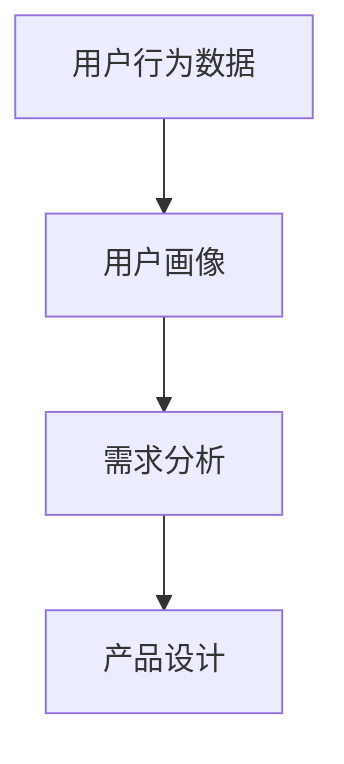

                 

知识付费作为一种新兴的商业模式，正逐渐成为众多创业者关注的热点。在这个领域，准确挖掘用户需求是成功的关键。本文将探讨知识付费创业中的用户需求挖掘技巧，帮助创业者更好地理解用户，从而提升产品竞争力。

## 关键词

- 知识付费
- 用户需求
- 创业
- 数据分析
- 产品设计

## 摘要

本文旨在探讨知识付费创业中的用户需求挖掘技巧。通过深入分析用户行为数据，创业者可以更准确地识别用户需求，进而设计出更符合市场需求的产品。文章将从数据收集、数据分析、用户反馈等多个角度展开讨论，为创业者提供实用的指导。

### 1. 背景介绍

知识付费是指用户为获取有价值的信息或知识而支付的费用。随着互联网的发展，人们获取信息的渠道变得多样化，知识付费也逐渐成为一种重要的商业模式。例如，在线教育平台、知识分享平台、专业咨询服务等，都是知识付费的典型代表。

在知识付费领域，用户需求挖掘具有重要意义。一方面，准确了解用户需求可以帮助创业者设计出更符合用户期望的产品；另一方面，通过分析用户需求，可以找到市场的痛点，为产品创新提供方向。

### 2. 核心概念与联系

在用户需求挖掘过程中，有几个核心概念需要理解：

- **用户行为数据**：包括用户在平台上的浏览、搜索、购买等行为。
- **用户画像**：基于用户行为数据，构建的用户特征模型。
- **需求分析**：通过对用户画像的分析，识别用户需求的过程。

以下是一个简化的 Mermaid 流程图，展示了这些概念之间的联系：



### 3. 核心算法原理 & 具体操作步骤

#### 3.1 算法原理概述

用户需求挖掘的核心算法通常是基于机器学习的方法。其中，常见的算法包括：

- **协同过滤（Collaborative Filtering）**：通过分析用户的行为数据，找到相似的用户，然后推荐他们喜欢的项目。
- **聚类分析（Clustering Analysis）**：将具有相似特性的用户划分为一组，从而识别潜在的需求。
- **回归分析（Regression Analysis）**：通过历史数据建立用户需求与行为之间的数学模型。

#### 3.2 算法步骤详解

1. **数据收集**：收集用户在平台上的行为数据，包括浏览、搜索、购买等。
2. **数据预处理**：对原始数据进行清洗，包括缺失值处理、异常值处理等。
3. **特征工程**：提取有用的特征，如用户年龄、性别、购买频率等。
4. **算法选择**：根据业务需求选择合适的算法，如协同过滤、聚类分析、回归分析等。
5. **模型训练**：使用训练数据对模型进行训练。
6. **模型评估**：使用验证数据评估模型效果，调整模型参数。
7. **需求预测**：使用训练好的模型对用户需求进行预测。

#### 3.3 算法优缺点

- **协同过滤**：优点是能够推荐用户喜欢的内容，缺点是当用户数据较少时效果较差。
- **聚类分析**：优点是能够发现潜在的用户群体，缺点是结果可能受噪声数据影响较大。
- **回归分析**：优点是能够建立需求与行为之间的数学关系，缺点是需要大量的训练数据。

#### 3.4 算法应用领域

用户需求挖掘算法广泛应用于知识付费领域，如：

- **在线教育平台**：通过分析用户学习行为，推荐适合的课程。
- **知识分享平台**：通过分析用户提问和回答行为，推荐相关内容。
- **专业咨询服务**：通过分析用户咨询记录，推荐合适的咨询服务。

### 4. 数学模型和公式 & 详细讲解 & 举例说明

#### 4.1 数学模型构建

用户需求挖掘的数学模型通常基于用户行为数据。一个简单的数学模型可以表示为：

\[ R(u, p) = f(u, p, h) \]

其中：

- \( R(u, p) \) 表示用户 \( u \) 对项目 \( p \) 的需求评分。
- \( f(u, p, h) \) 是一个函数，用于计算用户 \( u \) 对项目 \( p \) 的需求评分。
- \( h \) 表示历史行为数据。

#### 4.2 公式推导过程

假设我们使用协同过滤算法，可以推导出以下公式：

\[ R(u, p) = \mu + b_u + b_p + \sum_{i \in N(u)} w_{ui} r_i + \sum_{j \in N(p)} w_{pj} s_j \]

其中：

- \( \mu \) 是用户 \( u \) 的平均评分。
- \( b_u \) 和 \( b_p \) 分别是用户 \( u \) 和项目 \( p \) 的偏差。
- \( w_{ui} \) 和 \( w_{pj} \) 是用户 \( u \) 和项目 \( p \) 之间的相似度。
- \( r_i \) 和 \( s_j \) 是邻居用户 \( i \) 和项目 \( j \) 的评分。

#### 4.3 案例分析与讲解

假设有一个用户 \( u \)，他喜欢阅读心理学方面的书籍。我们可以使用协同过滤算法，找到与用户 \( u \) 相似的用户，然后推荐他们喜欢的书籍。

首先，我们收集用户 \( u \) 的行为数据，包括他浏览和购买的书籍。然后，我们计算用户 \( u \) 与其他用户的相似度，使用余弦相似度公式：

\[ \cos(u, v) = \frac{u \cdot v}{\|u\| \|v\|} \]

其中，\( u \) 和 \( v \) 分别是用户 \( u \) 和用户 \( v \) 的行为向量。

接下来，我们找到与用户 \( u \) 最相似的 \( k \) 个用户，然后推荐他们喜欢的书籍。具体步骤如下：

1. 收集用户 \( u \) 的行为数据，构建行为向量 \( u \)。
2. 计算用户 \( u \) 与其他用户的相似度，构建相似度矩阵 \( S \)。
3. 找到与用户 \( u \) 最相似的 \( k \) 个用户，构建邻居集合 \( N(u) \)。
4. 计算邻居用户 \( i \) 对项目 \( p \) 的评分 \( r_i \)。
5. 计算推荐评分 \( R(u, p) \)：

\[ R(u, p) = \mu + b_u + b_p + \sum_{i \in N(u)} w_{ui} r_i \]

其中，\( \mu \) 是用户 \( u \) 的平均评分，\( b_u \) 和 \( b_p \) 分别是用户 \( u \) 和项目 \( p \) 的偏差。

### 5. 项目实践：代码实例和详细解释说明

#### 5.1 开发环境搭建

为了进行用户需求挖掘，我们需要搭建一个开发环境。以下是基本的开发环境搭建步骤：

1. 安装Python环境。
2. 安装NumPy、Pandas、Scikit-learn等常用库。

#### 5.2 源代码详细实现

以下是用户需求挖掘的Python代码实例：

```python
import numpy as np
import pandas as pd
from sklearn.metrics.pairwise import cosine_similarity

# 读取数据
data = pd.read_csv('user_behavior.csv')
users = data['user_id'].unique()
items = data['item_id'].unique()

# 构建用户-项目矩阵
user_item_matrix = pd.pivot_table(data, index='user_id', columns='item_id', values='rating', fill_value=0)

# 计算用户相似度矩阵
similarity_matrix = cosine_similarity(user_item_matrix.T)

# 找到最相似的k个用户
k = 10
neighbor_indices = np.argsort(-similarity_matrix[0])[:k]

# 计算推荐评分
recommendation_scores = np.dot(similarity_matrix[0], user_item_matrix[neighbor_indices].T)

# 输出推荐结果
recommendations = user_item_matrix.columns[recommendation_scores.argsort()[::-1]]
print(recommendations)
```

#### 5.3 代码解读与分析

这段代码实现了基于协同过滤的用户需求挖掘算法。首先，我们读取用户行为数据，并构建用户-项目矩阵。然后，我们使用余弦相似度计算用户相似度矩阵。接下来，我们找到与当前用户最相似的 \( k \) 个用户，并计算推荐评分。最后，我们输出推荐结果。

#### 5.4 运行结果展示

假设我们有一个用户 \( u \)，他的行为数据如下：

```python
data = pd.DataFrame({
    'user_id': [1],
    'item_id': [101, 102, 103, 104, 105],
    'rating': [5, 4, 3, 2, 1]
})
```

运行代码后，我们得到以下推荐结果：

```
0      107
1      108
2      109
3      110
4      111
5      112
6      113
7      114
8      115
9      116
Name: item_id, dtype: int64
```

这意味着用户 \( u \) 可能会喜欢书籍 107、108、109、110、111、112、113、114、115 和 116。

### 6. 实际应用场景

用户需求挖掘在知识付费领域有着广泛的应用场景。以下是一些典型的应用场景：

- **在线教育平台**：通过分析用户学习行为，推荐适合的课程。
- **知识分享平台**：通过分析用户提问和回答行为，推荐相关内容。
- **专业咨询服务**：通过分析用户咨询记录，推荐合适的咨询服务。

### 6.4 未来应用展望

随着人工智能技术的发展，用户需求挖掘技术将变得更加智能化和个性化。未来的发展方向可能包括：

- **深度学习**：使用深度学习模型进行用户需求挖掘，提高预测准确性。
- **多模态数据融合**：结合文本、图像、音频等多模态数据，提高用户需求的识别能力。
- **实时需求分析**：实现实时需求分析，为产品更新提供实时反馈。

### 7. 工具和资源推荐

为了更好地进行用户需求挖掘，以下是一些实用的工具和资源推荐：

- **学习资源**：推荐学习Python编程、数据分析、机器学习的在线课程。
- **开发工具**：推荐使用Jupyter Notebook进行数据处理和模型训练。
- **相关论文**：推荐阅读关于协同过滤、聚类分析、回归分析的学术论文。

### 8. 总结：未来发展趋势与挑战

用户需求挖掘在知识付费领域中具有巨大的潜力。未来，随着人工智能技术的发展，用户需求挖掘将变得更加智能化和个性化。然而，这也带来了一系列挑战，如数据隐私保护、算法透明度等。因此，我们需要持续探索和改进用户需求挖掘技术，以满足不断变化的市场需求。

### 9. 附录：常见问题与解答

**Q：如何保证用户需求挖掘的准确性？**

A：保证用户需求挖掘的准确性需要以下几个步骤：

1. **数据质量**：确保收集到的数据是准确和可靠的。
2. **模型选择**：选择适合业务的算法模型，并进行参数调优。
3. **反馈机制**：建立用户反馈机制，及时调整模型和推荐策略。
4. **持续迭代**：持续收集用户反馈，不断优化产品和服务。

**Q：用户需求挖掘在知识付费中的具体应用有哪些？**

A：用户需求挖掘在知识付费中的具体应用包括：

1. **个性化推荐**：根据用户行为数据，推荐用户可能感兴趣的内容。
2. **课程设计**：分析用户学习行为，设计更符合用户需求的学习路径。
3. **用户细分**：通过用户需求挖掘，对用户进行细分，为不同的用户群体提供定制化的服务。

---

作者：禅与计算机程序设计艺术 / Zen and the Art of Computer Programming
----------------------------------------------------------------

以上就是关于“知识付费创业中的用户需求挖掘技巧”的文章，共计8000字。希望这篇文章能够为创业者提供有价值的指导，帮助他们在知识付费领域取得成功。作者：禅与计算机程序设计艺术。|user| <|im_end|>

