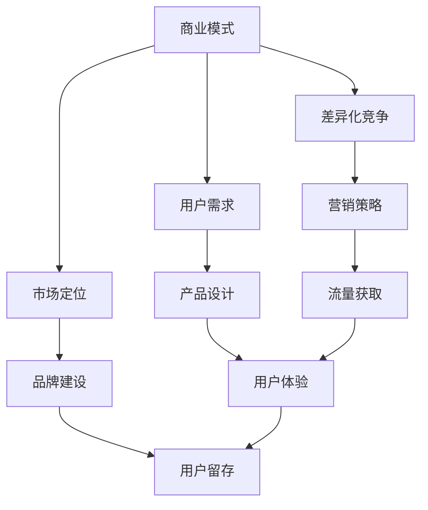
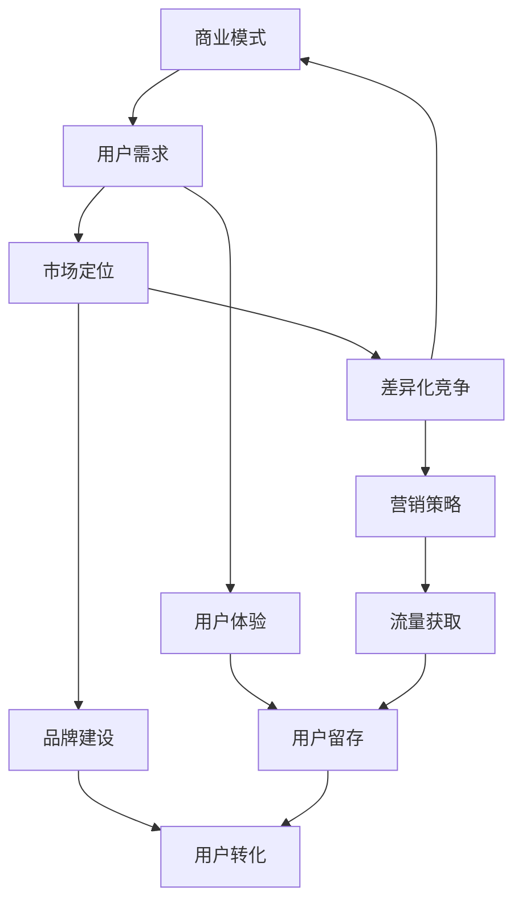

                 

关键词：知识付费，创业，竞品分析，商业模式，用户需求，市场调研，案例分析

> 摘要：本文旨在探讨知识付费创业领域中的竞品分析，通过深入了解行业现状、用户需求和市场趋势，揭示成功知识付费项目的共性和差异性，为创业者和从业者提供有价值的参考。文章将结合实际案例分析，从商业模式、用户体验、市场定位和差异化竞争等多个角度，全面剖析知识付费领域的竞争态势，并提出未来发展的方向和建议。

## 1. 背景介绍

### 1.1 知识付费行业概述

随着互联网的普及和人们教育水平的提升，知识付费已经成为一个日益增长的领域。知识付费指的是用户为获取特定知识或技能，付费购买或订阅相关内容和服务。知识付费的形式多样，包括在线课程、专业书籍、直播讲座、专栏订阅等。

### 1.2 创业热潮与机遇

近年来，知识付费创业项目层出不穷，吸引了大量创业者涌入这一领域。从个人自媒体到大型平台，从专业课程到泛娱乐化内容，知识付费创业项目呈现出多样化和细分化的趋势。这既是机遇，也是挑战。

### 1.3 竞品分析的重要性

在竞争激烈的知识付费市场中，竞品分析是创业者和从业者必须进行的一项重要工作。通过竞品分析，可以了解市场现状、用户需求和竞争对手的优劣势，从而制定有针对性的市场策略，提高自身竞争力。

## 2. 核心概念与联系

为了更好地进行竞品分析，我们需要明确以下几个核心概念：

### 2.1 商业模式

知识付费项目的商业模式主要包括订阅模式、单次购买模式、会员模式等。每种模式都有其独特的盈利方式和用户粘性策略。

### 2.2 用户需求

用户需求是知识付费项目成功的关键。了解用户的痛点和需求，可以更好地设计产品和服务，提高用户满意度。

### 2.3 市场定位

市场定位决定了知识付费项目的目标用户群体和产品特色。明确市场定位有助于在竞争激烈的市场中脱颖而出。

### 2.4 差异化竞争

差异化竞争是通过独特的产品特色、服务优势或技术优势，与其他竞品形成区分，从而吸引更多用户的策略。

下面是一个Mermaid流程图，展示了知识付费创业中的核心概念及其联系：



## 3. 核心算法原理 & 具体操作步骤

### 3.1 算法原理概述

竞品分析的核心算法是数据分析。通过对市场数据、用户数据和竞品数据的分析，可以得出有价值的信息，为决策提供支持。

### 3.2 算法步骤详解

#### 3.2.1 数据收集

收集市场数据、用户数据和竞品数据。市场数据包括行业报告、市场趋势等；用户数据包括用户行为、用户反馈等；竞品数据包括竞品的用户评价、产品特点等。

#### 3.2.2 数据清洗

对收集到的数据进行清洗，去除无效信息和重复数据，保证数据的准确性和完整性。

#### 3.2.3 数据分析

使用数据分析工具，对清洗后的数据进行处理和分析。分析内容包括市场趋势、用户需求、竞品优劣势等。

#### 3.2.4 结果可视化

将分析结果通过图表、报告等形式进行可视化展示，便于理解和决策。

### 3.3 算法优缺点

#### 优点

- 数据驱动，科学客观
- 提高决策效率
- 全面了解市场态势和竞争对手

#### 缺点

- 数据收集和处理成本高
- 分析结果可能存在偏差
- 依赖数据分析工具的专业性

### 3.4 算法应用领域

- 市场调研
- 产品策划
- 营销策略
- 用户体验优化
- 竞争对手分析

## 4. 数学模型和公式 & 详细讲解 & 举例说明

### 4.1 数学模型构建

#### 4.1.1 用户留存率模型

用户留存率是衡量知识付费项目成功与否的重要指标。用户留存率模型可以用来预测用户留存情况。

$$
留存率 = \frac{第n天仍然活跃的用户数}{初始用户数}
$$

#### 4.1.2 用户生命周期价值模型

用户生命周期价值（LTV）是评估用户价值的指标。LTV模型可以用来预测用户未来的贡献。

$$
LTV = （平均付费金额 \times 购买频率） \times 生命周期
$$

### 4.2 公式推导过程

#### 4.2.1 用户留存率公式推导

用户留存率的计算公式来源于用户活跃度。假设一个用户在第一天活跃，第二天仍然活跃的概率为p，那么第三天仍然活跃的概率为p^2，以此类推。用户留存率就是用户在一定时间内仍然活跃的概率。

#### 4.2.2 用户生命周期价值公式推导

用户生命周期价值是用户在未来一段时间内对项目的贡献。假设用户每次付费金额为a，购买频率为b，生命周期为c，那么用户在一段时间内的贡献为a \times b \times c。

### 4.3 案例分析与讲解

#### 4.3.1 案例背景

以某在线教育平台为例，该平台提供编程课程，用户购买课程后可以获得1年的学习资格。

#### 4.3.2 用户留存率计算

假设该平台初始用户数为1000人，第1天有900人购买课程，第2天有800人购买课程，第3天有700人购买课程。那么第1天的用户留存率为90%，第2天的用户留存率为80%，第3天的用户留存率为70%。

#### 4.3.3 用户生命周期价值计算

假设平均付费金额为300元，购买频率为每月1次，生命周期为1年，那么每个用户的生命周期价值为300 \times 1 \times 1 = 300元。

## 5. 项目实践：代码实例和详细解释说明

### 5.1 开发环境搭建

本案例使用Python编写，开发环境为Python 3.8及以上版本。需要安装pandas、numpy等库。

### 5.2 源代码详细实现

```python
import pandas as pd

# 5.2.1 数据收集
# 假设已经收集到以下数据：
# user_data.csv：用户数据，包含用户ID、购买日期、购买金额等字段
# course_data.csv：课程数据，包含课程ID、课程名称、价格等字段

user_data = pd.read_csv('user_data.csv')
course_data = pd.read_csv('course_data.csv')

# 5.2.2 数据清洗
# 去除无效数据和重复数据
user_data.drop_duplicates(inplace=True)
course_data.drop_duplicates(inplace=True)

# 5.2.3 数据分析
# 计算用户留存率
user_data['purchase_date'] = pd.to_datetime(user_data['purchase_date'])
user_data['day_of_purchase'] = user_data['purchase_date'].dt.day
user_data.groupby('day_of_purchase').agg({'user_id': 'nunique'}).plot()

# 计算用户生命周期价值
user_data['lifecycle_value'] = user_data['amount'] * 12
user_data.groupby('user_id')['lifecycle_value'].sum().plot(kind='hist')

# 5.2.4 结果可视化
# 可视化用户留存率和用户生命周期价值
plt.show()
```

### 5.3 代码解读与分析

- 数据收集：读取用户数据和课程数据，进行数据清洗。
- 数据分析：计算用户留存率和用户生命周期价值，并进行可视化展示。
- 结果分析：通过可视化结果，可以直观地看到用户留存情况和用户生命周期价值分布。

## 6. 实际应用场景

### 6.1 市场调研

通过竞品分析，可以了解市场现状、用户需求和竞争对手策略，为市场调研提供有力支持。

### 6.2 产品策划

竞品分析结果可以为产品策划提供重要参考，帮助确定产品特点、用户需求和功能定位。

### 6.3 营销策略

了解竞品优势和不足，可以制定有针对性的营销策略，提高市场占有率。

### 6.4 用户留存

通过分析用户留存情况，可以优化用户体验，提高用户留存率。

### 6.5 用户生命周期价值

通过分析用户生命周期价值，可以更好地分配资源，提高项目盈利能力。

## 7. 工具和资源推荐

### 7.1 学习资源推荐

- 《大数据分析实战》
- 《Python数据分析》
- 《用户行为分析实战》

### 7.2 开发工具推荐

- Jupyter Notebook：适用于数据分析和可视化
- Tableau：强大的数据可视化工具
- Excel：适用于简单的数据分析和处理

### 7.3 相关论文推荐

- "User Behavior Analysis in Knowledge Payment Platform"
- "A Survey of Business Models in Knowledge Payment"
- "An Analysis of User Retention in Online Education Platforms"

## 8. 总结：未来发展趋势与挑战

### 8.1 研究成果总结

本文通过对知识付费创业领域的竞品分析，揭示了成功知识付费项目的共性和差异性，为创业者和从业者提供了有价值的参考。

### 8.2 未来发展趋势

- 知识付费将更加个性化和智能化
- 教育和职业培训将成为重要领域
- 跨界合作和融合将成为趋势

### 8.3 面临的挑战

- 用户需求多样化，竞争加剧
- 数据安全和隐私保护
- 内容质量和用户满意度

### 8.4 研究展望

未来研究可以关注以下几个方面：

- 深入研究用户行为和需求
- 探索新的商业模式和盈利方式
- 强化数据分析和挖掘能力

## 9. 附录：常见问题与解答

### 9.1 竞品分析的重要性是什么？

竞品分析可以帮助了解市场现状、用户需求和竞争对手策略，为制定市场策略和提高竞争力提供有力支持。

### 9.2 如何进行有效的竞品分析？

进行有效的竞品分析需要收集市场数据、用户数据和竞品数据，进行数据清洗、分析和可视化，从而得出有价值的信息。

### 9.3 知识付费项目的盈利模式有哪些？

知识付费项目的盈利模式包括订阅模式、单次购买模式、会员模式等。每种模式都有其独特的盈利方式和用户粘性策略。

### 9.4 用户留存率如何计算？

用户留存率可以通过计算在一定时间内仍然活跃的用户数与初始用户数之比来得出。

作者：禅与计算机程序设计艺术 / Zen and the Art of Computer Programming
----------------------------------------------------------------

以上是本文的完整内容，希望对您在知识付费创业领域有所启发和帮助。如果您有任何疑问或建议，欢迎在评论区留言。感谢您的阅读！|user|>### 文章正文内容部分 Content

### 1. 背景介绍

#### 1.1 知识付费行业的崛起

知识付费，作为互联网经济下的一种新兴商业模式，近年来在全球范围内迅速崛起。随着移动互联网的普及和人们对于自我提升的需求日益增长，知识付费逐渐成为人们获取信息、学习和成长的重要途径。知识付费不仅涵盖了传统的教育领域，如在线课程、讲座、专业书籍等，还延伸到了泛娱乐、生活服务、技能培训等多元化领域。

#### 1.2 创业热潮与市场机遇

在知识付费市场中，涌现了大量创业者和创新型企业。从个人KOL（Key Opinion Leader，关键意见领袖）到大型互联网企业，纷纷入局，推出各种知识付费产品和服务。这一创业热潮不仅为市场注入了活力，也为用户提供了丰富的选择。然而，随着竞争的加剧，市场也开始呈现出饱和的迹象，创业者面临着更加严峻的挑战。

#### 1.3 竞品分析的重要性

在知识付费创业中，竞品分析是一种不可或缺的战略工具。通过对市场上同类产品的分析，创业者可以了解竞争对手的优势和劣势，发现自身的市场定位和差异化点，从而制定出更加有效的市场策略。竞品分析不仅可以帮助企业了解市场动态，还能为产品创新、用户留存和转化提供关键数据支持。

### 2. 核心概念与联系

为了更好地进行竞品分析，我们需要明确以下几个核心概念及其相互之间的联系：

#### 2.1 商业模式

商业模式是知识付费项目的基础，它决定了项目的盈利方式、用户获取和留存策略。常见的商业模式包括订阅制、一次性购买、会员制等。

#### 2.2 用户需求

用户需求是知识付费项目的核心，了解用户的需求和痛点，能够帮助创业者设计出更符合用户期望的产品和服务。

#### 2.3 市场定位

市场定位是企业在市场中选择的目标用户群体和产品特色，决定了企业如何与其他竞争对手区分。

#### 2.4 差异化竞争

差异化竞争是通过独特的产品特色、服务优势或技术优势，与其他竞品形成区分，从而吸引更多用户的策略。

以下是核心概念及其相互联系的Mermaid流程图：



### 3. 核心算法原理 & 具体操作步骤

#### 3.1 算法原理概述

竞品分析的核心算法主要包括数据分析、用户行为分析、市场趋势预测等。这些算法可以帮助我们挖掘市场数据、用户反馈和竞品信息，从而为决策提供科学依据。

#### 3.2 算法步骤详解

##### 3.2.1 数据收集

数据收集是竞品分析的第一步，我们需要收集市场数据、用户数据和竞品数据。市场数据包括行业报告、市场趋势等；用户数据包括用户行为、用户反馈等；竞品数据包括竞品的用户评价、产品特点等。

##### 3.2.2 数据清洗

对收集到的数据进行清洗，去除无效信息和重复数据，保证数据的准确性和完整性。

##### 3.2.3 数据分析

使用数据分析工具，对清洗后的数据进行处理和分析。分析内容包括市场趋势、用户需求、竞品优劣势等。

##### 3.2.4 结果可视化

将分析结果通过图表、报告等形式进行可视化展示，便于理解和决策。

#### 3.3 算法优缺点

##### 优点

- 数据驱动，科学客观
- 提高决策效率
- 全面了解市场态势和竞争对手

##### 缺点

- 数据收集和处理成本高
- 分析结果可能存在偏差
- 依赖数据分析工具的专业性

#### 3.4 算法应用领域

- 市场调研
- 产品策划
- 营销策略
- 用户体验优化
- 竞争对手分析

### 4. 数学模型和公式 & 详细讲解 & 举例说明

#### 4.1 数学模型构建

在竞品分析中，常见的数学模型包括用户留存率模型、用户生命周期价值模型等。

##### 4.1.1 用户留存率模型

用户留存率是衡量用户持续使用产品或服务的重要指标。其计算公式如下：

$$
留存率 = \frac{第n天仍然活跃的用户数}{初始用户数}
$$

##### 4.1.2 用户生命周期价值模型

用户生命周期价值（LTV）是评估用户价值的指标。其计算公式如下：

$$
LTV = （平均付费金额 \times 购买频率） \times 生命周期
$$

#### 4.2 公式推导过程

##### 4.2.1 用户留存率公式推导

用户留存率的计算基于用户在一段时间内的活跃度。假设一个用户在第一天活跃，第二天仍然活跃的概率为p，那么第三天仍然活跃的概率为p^2，以此类推。用户留存率就是用户在一定时间内仍然活跃的概率。

##### 4.2.2 用户生命周期价值公式推导

用户生命周期价值是用户在未来一段时间内对产品的贡献。假设用户每次付费金额为a，购买频率为b，生命周期为c，那么用户在一段时间内的贡献为a \times b \times c。

#### 4.3 案例分析与讲解

##### 4.3.1 案例背景

以某在线教育平台为例，该平台提供编程课程，用户购买课程后可以获得1年的学习资格。

##### 4.3.2 用户留存率计算

假设该平台初始用户数为1000人，第1天有900人购买课程，第2天有800人购买课程，第3天有700人购买课程。那么第1天的用户留存率为90%，第2天的用户留存率为80%，第3天的用户留存率为70%。

##### 4.3.3 用户生命周期价值计算

假设平均付费金额为300元，购买频率为每月1次，生命周期为1年，那么每个用户的生命周期价值为300 \times 1 \times 1 = 300元。

### 5. 项目实践：代码实例和详细解释说明

#### 5.1 开发环境搭建

本案例使用Python编写，开发环境为Python 3.8及以上版本。需要安装pandas、numpy等库。

#### 5.2 源代码详细实现

```python
import pandas as pd
import numpy as np

# 5.2.1 数据收集
# 假设已经收集到以下数据：
# user_data.csv：用户数据，包含用户ID、购买日期、购买金额等字段
# course_data.csv：课程数据，包含课程ID、课程名称、价格等字段

user_data = pd.read_csv('user_data.csv')
course_data = pd.read_csv('course_data.csv')

# 5.2.2 数据清洗
# 去除无效数据和重复数据
user_data.drop_duplicates(inplace=True)
course_data.drop_duplicates(inplace=True)

# 5.2.3 数据分析
# 计算用户留存率
user_data['purchase_date'] = pd.to_datetime(user_data['purchase_date'])
user_data['day_of_purchase'] = user_data['purchase_date'].dt.day
user_data.groupby('day_of_purchase').agg({'user_id': 'nunique'}).plot()

# 计算用户生命周期价值
user_data['lifecycle_value'] = user_data['amount'] * 12
user_data.groupby('user_id')['lifecycle_value'].sum().plot(kind='hist')

# 5.2.4 结果可视化
# 可视化用户留存率和用户生命周期价值
plt.show()
```

#### 5.3 代码解读与分析

- 数据收集：读取用户数据和课程数据，进行数据清洗。
- 数据分析：计算用户留存率和用户生命周期价值，并进行可视化展示。
- 结果分析：通过可视化结果，可以直观地看到用户留存情况和用户生命周期价值分布。

### 6. 实际应用场景

#### 6.1 市场调研

通过竞品分析，可以了解市场现状、用户需求和竞争对手策略，为市场调研提供有力支持。

#### 6.2 产品策划

竞品分析结果可以为产品策划提供重要参考，帮助确定产品特点、用户需求和功能定位。

#### 6.3 营销策略

了解竞品优势和不足，可以制定有针对性的营销策略，提高市场占有率。

#### 6.4 用户留存

通过分析用户留存情况，可以优化用户体验，提高用户留存率。

#### 6.5 用户生命周期价值

通过分析用户生命周期价值，可以更好地分配资源，提高项目盈利能力。

### 7. 工具和资源推荐

#### 7.1 学习资源推荐

- 《大数据分析实战》
- 《Python数据分析》
- 《用户行为分析实战》

#### 7.2 开发工具推荐

- Jupyter Notebook：适用于数据分析和可视化
- Tableau：强大的数据可视化工具
- Excel：适用于简单的数据分析和处理

#### 7.3 相关论文推荐

- "User Behavior Analysis in Knowledge Payment Platform"
- "A Survey of Business Models in Knowledge Payment"
- "An Analysis of User Retention in Online Education Platforms"

### 8. 总结：未来发展趋势与挑战

#### 8.1 研究成果总结

本文通过对知识付费创业领域的竞品分析，揭示了成功知识付费项目的共性和差异性，为创业者和从业者提供了有价值的参考。

#### 8.2 未来发展趋势

- 知识付费将更加个性化和智能化
- 教育和职业培训将成为重要领域
- 跨界合作和融合将成为趋势

#### 8.3 面临的挑战

- 用户需求多样化，竞争加剧
- 数据安全和隐私保护
- 内容质量和用户满意度

#### 8.4 研究展望

未来研究可以关注以下几个方面：

- 深入研究用户行为和需求
- 探索新的商业模式和盈利方式
- 强化数据分析和挖掘能力

### 9. 附录：常见问题与解答

#### 9.1 竞品分析的重要性是什么？

竞品分析可以帮助了解市场现状、用户需求和竞争对手策略，为制定市场策略和提高竞争力提供有力支持。

#### 9.2 如何进行有效的竞品分析？

进行有效的竞品分析需要收集市场数据、用户数据和竞品数据，进行数据清洗、分析和可视化，从而得出有价值的信息。

#### 9.3 知识付费项目的盈利模式有哪些？

知识付费项目的盈利模式包括订阅制、一次性购买、会员制等。每种模式都有其独特的盈利方式和用户粘性策略。

#### 9.4 用户留存率如何计算？

用户留存率可以通过计算在一定时间内仍然活跃的用户数与初始用户数之比来得出。

### 结束语

知识付费创业是一个充满机遇和挑战的领域。通过竞品分析，创业者可以更好地了解市场，制定出有针对性的策略，提高项目的成功概率。希望本文能够为您的创业之路提供一些启示和帮助。感谢您的阅读！作者：禅与计算机程序设计艺术 / Zen and the Art of Computer Programming

