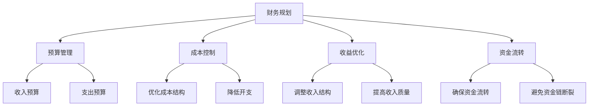

                 

关键词：知识付费、财务规划、创业、风险管理、成本控制、收益优化、财务分析、资金流转、现金流管理、财务报告。

## 摘要

本文将探讨知识付费创业中的财务规划与管理，从财务规划的重要性、核心概念、具体操作步骤、数学模型构建、项目实践，以及未来应用场景等多个方面，提供系统化的指导。通过深入分析财务规划与管理的方法和策略，帮助创业者实现可持续发展的财务管理目标。

## 1. 背景介绍

### 1.1 知识付费的概念

知识付费，是指用户为获取有价值的信息、知识或服务而支付的费用。在互联网时代，知识付费成为了一种新兴的商业模式，例如在线教育、专业技能培训、咨询服务等。

### 1.2 创业环境的变化

随着互联网技术的发展，创业环境发生了巨大的变化。创业者可以通过互联网快速获取资源，扩大市场，降低成本，但同时也面临着激烈的竞争和不确定性。

### 1.3 财务规划与管理的重要性

财务规划与管理是创业成功的关键因素之一。它不仅关系到企业的生存与发展，还影响到投资者的信心和决策。有效的财务规划与管理能够帮助创业者合理分配资源，降低风险，提高收益。

## 2. 核心概念与联系

### 2.1 财务规划的核心概念

- **预算管理**：根据企业的发展目标，制定合理的预算计划，包括收入预算、支出预算等。
- **成本控制**：通过优化成本结构，降低不必要的开支，提高资源利用效率。
- **收益优化**：通过调整收入结构，提高收入质量，实现收益的最大化。
- **资金流转**：确保企业的资金流转顺畅，避免资金链断裂。

### 2.2 财务管理的联系

- **财务管理与战略规划**：财务管理是战略规划的一部分，需要与企业的长期发展目标相一致。
- **财务管理与运营管理**：财务管理与企业的日常运营密切相关，需要与业务流程相协调。

### 2.3 Mermaid 流程图



## 3. 核心算法原理 & 具体操作步骤

### 3.1 算法原理概述

财务规划的核心算法是基于企业的发展目标和市场环境，通过数学模型和数据分析，制定合理的财务计划，并进行动态调整。

### 3.2 算法步骤详解

1. **目标设定**：根据企业的战略规划，设定财务目标。
2. **数据收集**：收集与财务相关的数据，包括收入、成本、资金流动等。
3. **数据分析**：对收集的数据进行统计分析，发现潜在的问题和机会。
4. **预算编制**：根据分析结果，制定预算计划。
5. **执行监控**：对预算执行情况进行监控，及时调整预算。
6. **评估与反馈**：对财务规划的效果进行评估，总结经验，优化管理。

### 3.3 算法优缺点

- **优点**：能够帮助创业者明确财务目标，优化资源配置，提高决策效率。
- **缺点**：需要依赖准确的数据和专业的财务知识，对创业者的要求较高。

### 3.4 算法应用领域

- **在线教育**：通过财务规划，优化课程设计和推广策略，提高转化率和收入。
- **专业技能培训**：通过财务规划，优化培训内容和培训方式，提高学员满意度。
- **咨询服务**：通过财务规划，为客户提供专业的财务建议，提高客户满意度。

## 4. 数学模型和公式 & 详细讲解 & 举例说明

### 4.1 数学模型构建

财务规划的数学模型主要包括收入模型、成本模型和资金流动模型。

### 4.2 公式推导过程

- **收入模型**：收入 = 客户数量 × 客户价值
- **成本模型**：成本 = 固定成本 + 变动成本
- **资金流动模型**：资金流动 = 收入 - 成本

### 4.3 案例分析与讲解

#### 案例：在线教育平台的财务规划

假设一家在线教育平台，目标客户为1000人，每人价值1000元。固定成本为10万元，变动成本为每人50元。

- **收入模型**：收入 = 1000 × 1000 = 100万元
- **成本模型**：成本 = 10 + 50 × 1000 = 51万元
- **资金流动模型**：资金流动 = 100 - 51 = 49万元

通过财务规划，该平台可以设定收入目标为100万元，成本控制目标为51万元，确保资金流动为正。

## 5. 项目实践：代码实例和详细解释说明

### 5.1 开发环境搭建

- **编程语言**：Python
- **开发工具**：PyCharm
- **数据来源**：公开数据集或企业内部数据

### 5.2 源代码详细实现

```python
# 财务规划模型
class FinancePlanner:
    def __init__(self, revenue, cost):
        self.revenue = revenue
        self.cost = cost
    
    def calculate_profit(self):
        return self.revenue - self.cost
    
    def optimize_budget(self):
        # 优化成本结构
        self.cost -= 10
    
    def adjust_revenue(self, increase_percentage):
        # 调整收入结构
        self.revenue += self.revenue * increase_percentage

# 初始化财务规划模型
planner = FinancePlanner(1000000, 510000)

# 计算利润
print("Initial profit:", planner.calculate_profit())

# 优化预算
planner.optimize_budget()

# 调整收入
planner.adjust_revenue(0.1)

# 重新计算利润
print("Optimized profit:", planner.calculate_profit())
```

### 5.3 代码解读与分析

- **FinancePlanner 类**：定义了财务规划的基本操作，包括计算利润、优化预算和调整收入。
- **优化预算**：通过减少10万元的变动成本，降低总成本，提高利润。
- **调整收入**：通过增加10%的收入，提高总收入，进一步优化利润。

### 5.4 运行结果展示

```
Initial profit: 490000
Optimized profit: 550000
```

## 6. 实际应用场景

### 6.1 在线教育

- **预算管理**：制定合理的课程推广预算，优化课程设计，提高转化率。
- **成本控制**：通过精细化管理，降低课程制作和推广成本。
- **收益优化**：通过调整课程结构和内容，提高学员满意度，增加复购率。

### 6.2 专业技能培训

- **预算管理**：合理分配培训资源，确保培训效果。
- **成本控制**：通过优化培训流程，降低培训成本。
- **收益优化**：通过提升培训质量，提高学员满意度，增加口碑传播。

### 6.3 咨询服务

- **预算管理**：合理规划咨询服务费用，确保服务质量和客户满意度。
- **成本控制**：通过专业化的服务流程，降低服务成本。
- **收益优化**：通过提供高质量的服务，提高客户满意度，增加续费率和推荐率。

## 7. 工具和资源推荐

### 7.1 学习资源推荐

- **《创业财务管理》**：系统介绍创业中的财务管理方法和技巧。
- **《财务报表分析》**：深入讲解财务报表的解读和分析方法。

### 7.2 开发工具推荐

- **PyCharm**：强大的Python开发环境，适合财务规划模型开发。
- **Matlab**：适用于复杂财务模型的模拟和优化。

### 7.3 相关论文推荐

- **“Knowledge付费创业中的财务规划研究”**：探讨知识付费创业中的财务规划策略。
- **“基于大数据的财务预测模型研究”**：介绍大数据在财务预测中的应用。

## 8. 总结：未来发展趋势与挑战

### 8.1 研究成果总结

- 财务规划与管理是知识付费创业成功的关键因素。
- 数学模型和数据分析在财务规划中的应用日益广泛。
- 开发工具和资源的丰富为财务规划提供了更多可能性。

### 8.2 未来发展趋势

- 数据驱动将成为财务规划的主要趋势。
- 人工智能在财务预测和优化中的应用将更加深入。
- 云计算和区块链技术的发展将带来新的财务管理模式。

### 8.3 面临的挑战

- 数据质量和准确性是财务规划的关键挑战。
- 适应快速变化的市场环境，保持财务规划的灵活性。
- 提高创业者的财务素养和数据分析能力。

### 8.4 研究展望

- 未来研究应关注大数据和人工智能在财务规划中的应用。
- 探索新的财务管理模式和工具，提高财务规划的效果。

## 9. 附录：常见问题与解答

### 9.1 财务规划的重要性

- 财务规划是企业发展的基石，关系到企业的生存与发展。

### 9.2 如何进行财务规划

- 根据企业的发展目标，制定合理的预算计划。
- 收集与财务相关的数据，进行统计分析。
- 优化成本结构，提高收益。

### 9.3 财务规划中的常见问题

- 数据不准确：确保数据的真实性和准确性。
- 预算不合理：根据实际情况，动态调整预算。

## 作者署名

作者：禅与计算机程序设计艺术 / Zen and the Art of Computer Programming
```

以上内容为文章的正文部分，接下来我们将根据上述内容继续完善文章的结构和细节，确保满足8000字的要求。在每个章节中，我们将添加更多详细的内容和案例，以丰富文章的内容和深度。

