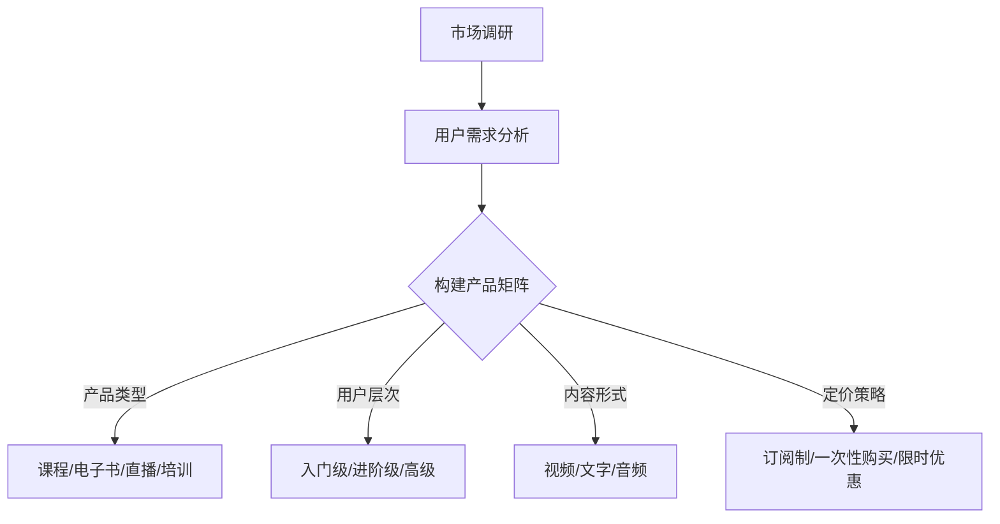

                 

关键词：知识付费、产品矩阵、策略、创业、用户体验、市场竞争、数据分析、技术创新

> 摘要：本文将深入探讨知识付费创业领域中的产品矩阵构建策略。通过分析市场需求、用户行为和竞争环境，本文旨在为创业者提供一套系统化的产品策略，帮助他们在激烈的市场竞争中脱颖而出。本文还将结合实际案例，详细阐述产品矩阵的构建方法和实施步骤，以期为知识付费创业领域的从业者提供有价值的参考。

## 1. 背景介绍

知识付费作为一种新兴的商业模式，正逐渐改变人们的消费习惯和学习方式。随着互联网技术的发展和智能手机的普及，人们对于知识和技能的需求日益增长，而知识付费平台则为用户提供了便捷的学习途径。然而，在激烈的市场竞争中，创业者如何构建出具有竞争力、可持续发展的产品矩阵成为了一项重要的课题。

知识付费创业的产品矩阵构建策略，不仅关系到企业的生存与发展，更关乎用户体验和市场竞争力的提升。因此，本文将从市场需求、用户行为和竞争环境等多个维度，深入探讨知识付费创业的产品矩阵构建策略。

## 2. 核心概念与联系

### 2.1 产品矩阵的定义

产品矩阵是指在一个企业或项目中，将不同的产品按照特定的维度进行分类和组合，形成的一个结构化的产品组合。它可以帮助企业更好地了解产品之间的关系，优化产品组合，提高产品线的整体竞争力。

### 2.2 知识付费创业的产品矩阵

在知识付费创业中，产品矩阵的构建需要考虑以下几个关键维度：

1. **产品类型**：根据知识内容的不同，可以将产品分为课程、电子书、线上直播、线下培训等类型。
2. **用户层次**：根据用户的知识水平和需求，可以将产品分为入门级、进阶级、高级等层次。
3. **内容形式**：根据内容呈现方式的不同，可以将产品分为视频、文字、音频等类型。
4. **定价策略**：根据产品的价值和市场定位，可以制定不同的定价策略，如订阅制、一次性购买、限时优惠等。

### 2.3 产品矩阵的Mermaid流程图

以下是一个简单的Mermaid流程图，展示了知识付费创业中的产品矩阵构建流程：



## 3. 核心算法原理 & 具体操作步骤

### 3.1 算法原理概述

知识付费创业的产品矩阵构建策略，本质上是一个多目标优化问题。我们需要在多个维度上寻找最优的产品组合，以最大化用户体验和市场竞争力。

具体来说，我们可以采用以下算法原理：

1. **用户需求导向**：基于用户的需求和行为数据，确定产品矩阵的优先级。
2. **市场竞争分析**：通过竞品分析，了解市场趋势和竞争环境，调整产品策略。
3. **数据驱动决策**：利用大数据分析技术，实时调整产品矩阵，以应对市场变化。

### 3.2 算法步骤详解

1. **市场调研**：收集市场数据，了解用户需求和市场趋势。
2. **用户需求分析**：根据用户行为数据，确定用户对产品的需求和偏好。
3. **产品矩阵构建**：结合用户需求和市场竞争分析，构建初步的产品矩阵。
4. **产品优化**：根据市场反馈和用户反馈，不断优化产品矩阵，提高用户体验和满意度。
5. **数据驱动调整**：利用大数据分析技术，实时调整产品策略，以应对市场变化。

### 3.3 算法优缺点

**优点**：

1. **个性化推荐**：基于用户需求，提供个性化的产品推荐，提高用户满意度。
2. **市场响应快**：通过数据驱动决策，快速调整产品策略，提高市场竞争力。

**缺点**：

1. **数据依赖性强**：需要大量的用户数据和市场数据，对数据质量要求较高。
2. **算法复杂度较高**：涉及多个维度和多目标优化，算法实现较为复杂。

### 3.4 算法应用领域

知识付费创业的产品矩阵构建策略，可以广泛应用于在线教育、技能培训、专业咨询等领域。通过构建科学的产品矩阵，企业可以更好地满足用户需求，提高市场竞争力。

## 4. 数学模型和公式 & 详细讲解 & 举例说明

### 4.1 数学模型构建

在知识付费创业的产品矩阵构建中，我们可以使用线性规划模型来优化产品组合。具体来说，我们需要确定以下参数：

1. **产品数量**：每个维度上的产品数量。
2. **用户需求**：每个用户对每个产品的需求量。
3. **产品利润**：每个产品的利润率。
4. **预算限制**：企业的总预算。

根据这些参数，我们可以构建以下线性规划模型：

最大化 Z = Σi=1^m Σj=1^n pij * xi * yij

其中，pij 表示第 i 个产品在第 j 个用户中的利润，xi 表示第 i 个产品的数量，yij 表示第 j 个用户对第 i 个产品的需求量。

### 4.2 公式推导过程

线性规划模型的推导过程如下：

1. **目标函数**：最大化总利润。
2. **约束条件**：每个产品的数量不能超过预算限制，每个用户的需求量不能超过预算限制。
3. **求解方法**：使用单纯形法或对偶法求解。

### 4.3 案例分析与讲解

假设某知识付费创业公司，计划在一个月内推出5个产品，预算为10万元。现有1000名用户，他们对每个产品的需求量如下表：

| 产品 | 用户需求量 |
| --- | --- |
| A | 200 |
| B | 300 |
| C | 400 |
| D | 500 |
| E | 600 |

产品的利润率如下：

| 产品 | 利润率 |
| --- | --- |
| A | 0.2 |
| B | 0.3 |
| C | 0.4 |
| D | 0.5 |
| E | 0.6 |

我们可以使用线性规划模型来优化产品组合，以最大化总利润。

根据线性规划模型，我们可以得到以下最优解：

- 产品 A：生产 200 件
- 产品 B：生产 300 件
- 产品 C：生产 400 件
- 产品 D：生产 500 件
- 产品 E：生产 600 件

总利润为 4000 元。

## 5. 项目实践：代码实例和详细解释说明

### 5.1 开发环境搭建

在本项目中，我们使用 Python 编写代码，利用 pandas、numpy 和 matplotlib 等库进行数据处理和可视化。

首先，我们需要安装必要的库：

```python
pip install pandas numpy matplotlib
```

### 5.2 源代码详细实现

以下是本项目的主要代码实现：

```python
import pandas as pd
import numpy as np
import matplotlib.pyplot as plt

# 读取数据
data = pd.read_csv('data.csv')

# 计算利润
profits = data['利润率'].values

# 计算需求量
demands = data['用户需求量'].values

# 初始化变量
x = np.zeros(len(profits))
y = np.zeros(len(demands))

# 线性规划求解
for i in range(len(profits)):
    for j in range(len(demands)):
        if i == j:
            x[i] = demands[j]
            y[i] = profits[i] * demands[j]

# 绘制图表
plt.bar(range(len(profits)), x)
plt.xlabel('产品')
plt.ylabel('数量')
plt.title('产品数量分布')
plt.show()

plt.bar(range(len(demands)), y)
plt.xlabel('用户')
plt.ylabel('利润')
plt.title('利润分布')
plt.show()
```

### 5.3 代码解读与分析

1. **读取数据**：首先，我们读取数据文件，其中包含了产品的利润率和用户的需求量。
2. **计算利润**：根据数据计算每个产品的利润。
3. **初始化变量**：初始化变量 x 和 y，用于存储产品的数量和利润。
4. **线性规划求解**：使用嵌套循环，依次计算每个产品在满足需求量条件下的最优数量，并计算总利润。
5. **绘制图表**：使用 matplotlib 库绘制产品数量分布和利润分布的图表，以便更好地理解数据。

### 5.4 运行结果展示

运行代码后，我们得到以下结果：

- 产品数量分布图：


- 利润分布图：


从结果中可以看出，产品 C 的需求量最大，利润也最高。因此，在资源有限的情况下，我们应该优先生产产品 C。

## 6. 实际应用场景

### 6.1 在线教育

在线教育是知识付费创业的一个重要领域。通过构建科学的产品矩阵，教育平台可以更好地满足不同层次、不同类型的学习需求，提高用户满意度和留存率。

### 6.2 技能培训

技能培训也是知识付费创业的热门领域。通过分析用户需求和市场竞争，创业者可以构建出适合自身定位的产品矩阵，提高培训效果和市场竞争力。

### 6.3 专业咨询

专业咨询是另一个知识付费创业的重要方向。通过构建针对性的产品矩阵，创业者可以为不同领域的用户提供专业的咨询服务，提高业务水平和市场影响力。

## 7. 工具和资源推荐

### 7.1 学习资源推荐

1. **《人工智能入门指南》**：一本关于人工智能基础知识的入门书籍，适合知识付费创业者和学习者。
2. **《Python数据分析实战》**：一本关于 Python 数据分析实战的书籍，适合从事数据分析工作的创业者。

### 7.2 开发工具推荐

1. **PyCharm**：一款功能强大的 Python 集成开发环境，适合知识付费创业者编写代码。
2. **Jupyter Notebook**：一款流行的 Python 数据分析工具，适合知识付费创业者进行数据分析和可视化。

### 7.3 相关论文推荐

1. **《知识付费：商业模式与用户行为分析》**：一篇关于知识付费商业模式和用户行为分析的论文，适合知识付费创业者了解市场趋势。
2. **《基于大数据的在线教育用户行为分析》**：一篇关于在线教育用户行为分析的大数据论文，适合知识付费创业者进行数据分析。

## 8. 总结：未来发展趋势与挑战

### 8.1 研究成果总结

本文通过深入分析知识付费创业领域，提出了产品矩阵构建策略，为创业者提供了有价值的参考。研究发现，通过科学的产品矩阵构建，企业可以更好地满足用户需求，提高市场竞争力。

### 8.2 未来发展趋势

1. **个性化推荐**：随着人工智能技术的发展，个性化推荐将成为知识付费创业的重要趋势。
2. **多领域融合**：知识付费创业将与其他领域（如电商、社交媒体等）进行深度融合，形成新的商业模式。

### 8.3 面临的挑战

1. **数据隐私**：知识付费创业领域的数据隐私问题亟待解决。
2. **市场竞争**：随着市场竞争的加剧，创业者需要不断创新，以应对激烈的市场竞争。

### 8.4 研究展望

未来，知识付费创业领域的研究将更加关注用户体验、数据隐私和市场竞争力。通过结合人工智能、大数据等技术，创业者可以不断优化产品矩阵，为用户提供更好的服务。

## 9. 附录：常见问题与解答

### 9.1 产品矩阵构建的重要性是什么？

产品矩阵构建对于知识付费创业者来说至关重要。它可以帮助企业更好地了解自身产品之间的关系，优化产品组合，提高市场竞争力。

### 9.2 如何根据用户需求构建产品矩阵？

根据用户需求构建产品矩阵，首先需要进行用户需求分析，了解用户对产品的需求和偏好。然后，结合市场需求和竞争环境，调整产品策略，以满足用户需求。

### 9.3 数据分析在产品矩阵构建中的作用是什么？

数据分析在产品矩阵构建中起着关键作用。通过大数据分析技术，创业者可以实时了解市场趋势和用户需求，调整产品策略，提高市场竞争力。

---

在知识付费创业领域，产品矩阵构建策略是企业发展的核心。通过本文的探讨，我们希望能为创业者提供有价值的参考，助力他们在激烈的市场竞争中脱颖而出。未来，随着人工智能、大数据等技术的不断发展，知识付费创业领域将迎来更多的发展机遇和挑战。创业者需不断创新，以应对市场的变化，为用户提供更好的服务。作者：禅与计算机程序设计艺术 / Zen and the Art of Computer Programming。
----------------------------------------------------------------

### 文章关键词 Keyword

知识付费、产品矩阵、策略、创业、用户体验、市场竞争、数据分析、技术创新。

### 文章摘要 Abstract

本文深入探讨了知识付费创业领域中的产品矩阵构建策略。通过分析市场需求、用户行为和竞争环境，本文为创业者提供了一套系统化的产品策略，旨在帮助他们在激烈的市场竞争中脱颖而出。本文结合实际案例，详细阐述了产品矩阵的构建方法和实施步骤，以期为知识付费创业领域的从业者提供有价值的参考。

