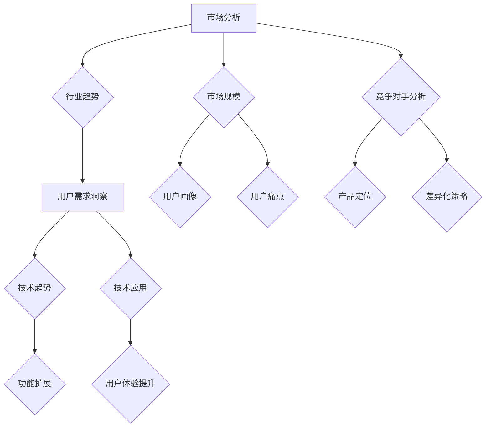

                 

关键词：知识付费、产品线扩展、创业策略、市场分析、用户需求、用户体验、技术创新

> 摘要：本文旨在探讨知识付费创业公司如何通过科学的市场分析和用户需求洞察，结合技术创新，制定并实施有效的产品线扩展策略，以实现持续增长和盈利。

## 1. 背景介绍

在当前信息爆炸的时代，知识付费行业正逐渐兴起，成为许多创业者眼中的蓝海。知识付费，是指用户为获取有价值的信息或知识，向内容提供商支付费用的一种商业模式。从在线教育、专业技能培训，到内容创作、知识分享平台，知识付费的形式多样，市场需求庞大。

然而，知识付费行业的竞争也日益激烈。创业者如何在这个市场中脱颖而出，实现产品线的有效扩展，成为一个值得深思的问题。本文将从市场分析、用户需求洞察、技术创新等方面，探讨知识付费创业公司的产品线扩展思路。

## 2. 核心概念与联系

### 2.1 市场分析

市场分析是知识付费创业公司制定产品线扩展策略的基石。通过市场分析，创业者可以了解行业趋势、市场规模、竞争对手情况等关键信息，为产品线的定位和扩展提供依据。

#### 2.1.1 行业趋势

首先，创业者需要关注知识付费行业的趋势。例如，在线教育领域正逐渐从单一的知识传播向个性化、互动性、实践性方向发展。掌握行业趋势有助于创业公司找准市场定位，制定相应的产品线扩展策略。

#### 2.1.2 市场规模

其次，创业者需要了解市场规模。市场规模的大小直接影响产品的潜在用户数量。通过市场调研，创业者可以获取有关市场规模的数据，从而为产品线的扩展提供量化的依据。

#### 2.1.3 竞争对手分析

最后，创业者需要对竞争对手进行分析。了解竞争对手的产品定位、用户群体、市场份额等，有助于创业公司制定差异化的产品线扩展策略，避免与竞争对手直接竞争。

### 2.2 用户需求洞察

用户需求是知识付费产品的核心驱动力。通过对用户需求的洞察，创业公司可以明确产品的核心价值，从而制定针对性的产品线扩展策略。

#### 2.2.1 用户画像

创业者需要通过用户调研、数据分析等方法，构建用户画像。用户画像包括用户的基本信息、兴趣爱好、消费习惯等。了解用户画像有助于创业公司制定更加贴近用户需求的产品策略。

#### 2.2.2 用户痛点

创业者还需要识别用户的痛点，即用户在获取知识过程中遇到的问题和困扰。解决用户痛点是产品设计的核心目标，也是产品线扩展的重要依据。

### 2.3 技术创新

技术创新是知识付费创业公司产品线扩展的重要驱动力。通过技术创新，创业公司可以提高产品的竞争力，实现产品线的多元化。

#### 2.3.1 技术趋势

创业者需要关注技术创新的趋势，如人工智能、大数据、区块链等。这些新兴技术可以为知识付费产品提供新的功能和应用场景，助力产品线的扩展。

#### 2.3.2 技术应用

创业者还需要将技术创新应用于产品开发中，如利用人工智能技术进行内容推荐、利用大数据技术分析用户行为等。技术创新的应用可以提升产品的用户体验，增强产品的竞争力。

### 2.4 Mermaid 流程图



## 3. 核心算法原理 & 具体操作步骤

### 3.1 算法原理概述

知识付费创业公司的产品线扩展策略主要基于以下核心算法原理：

- **市场分析算法**：利用大数据和机器学习技术，对行业趋势、市场规模、竞争对手等进行分析，以确定产品的市场定位和扩展方向。
- **用户需求洞察算法**：通过用户调研、数据分析等方法，构建用户画像，识别用户痛点，以制定针对性的产品策略。
- **技术创新应用算法**：结合技术趋势和用户需求，将技术创新应用于产品开发，提升产品的竞争力。

### 3.2 算法步骤详解

#### 3.2.1 市场分析算法

1. 收集行业数据：从权威数据源、行业报告等获取行业趋势、市场规模、竞争对手等相关数据。
2. 数据预处理：对收集到的数据进行清洗、去重、归一化等处理，以提高数据质量。
3. 数据分析：利用机器学习算法，对预处理后的数据进行趋势分析、关联分析等，以获取市场洞察。
4. 策略制定：根据分析结果，制定产品的市场定位和扩展策略。

#### 3.2.2 用户需求洞察算法

1. 用户调研：通过问卷调查、访谈等方式，收集用户对产品的需求和痛点。
2. 数据收集：对用户调研结果进行数据化处理，构建用户画像。
3. 数据分析：利用数据分析方法，识别用户画像中的共性特征，挖掘用户痛点。
4. 策略制定：根据用户画像和痛点，制定针对性的产品策略。

#### 3.2.3 技术创新应用算法

1. 技术趋势研究：关注新兴技术发展趋势，了解其在知识付费行业的应用潜力。
2. 技术评估：对新兴技术进行评估，确定其是否适合应用于产品开发。
3. 技术应用：将新兴技术应用于产品开发，提升产品的功能性和用户体验。
4. 持续优化：根据用户反馈和数据分析，对技术应用进行持续优化，提高产品的竞争力。

### 3.3 算法优缺点

- **市场分析算法**：优点是能够全面了解市场状况，为产品定位和扩展提供依据；缺点是数据收集和处理过程复杂，耗时较长。
- **用户需求洞察算法**：优点是能够深入了解用户需求，提高产品的用户体验；缺点是用户调研成本较高，且用户需求可能变化较快。
- **技术创新应用算法**：优点是能够提升产品竞争力，吸引更多用户；缺点是需要具备一定的技术实力，且新兴技术的应用风险较大。

### 3.4 算法应用领域

- **在线教育平台**：通过市场分析算法，确定产品定位和扩展方向；通过用户需求洞察算法，提高产品的用户体验；通过技术创新应用算法，提升产品的竞争力。
- **专业技能培训**：利用市场分析算法，挖掘潜在用户群体；通过用户需求洞察算法，提供定制化的培训服务；通过技术创新应用算法，提升培训效果。
- **内容创作平台**：通过市场分析算法，确定内容创作者的定位和需求；通过用户需求洞察算法，提高内容创作质量和用户粘性；通过技术创新应用算法，提升平台竞争力。

## 4. 数学模型和公式 & 详细讲解 & 举例说明

### 4.1 数学模型构建

在知识付费创业的产品线扩展过程中，我们可以构建以下数学模型：

- **用户增长模型**：描述用户数量的增长趋势，用于预测未来的用户规模。
- **收益模型**：描述产品的收益与用户数量、用户消费能力等因素的关系，用于评估产品线的盈利能力。

### 4.2 公式推导过程

#### 用户增长模型

设 \( U(t) \) 为时间 \( t \) 时的用户数量，\( r \) 为用户增长率，\( C \) 为初始用户数量，则用户增长模型可以表示为：

\[ U(t) = C \times (1 + r)^t \]

其中，\( r \) 可以通过市场分析和用户调研等方法获取。

#### 收益模型

设 \( R(t) \) 为时间 \( t \) 时的总收益，\( P \) 为单次购买的平均价格，\( N(t) \) 为时间 \( t \) 时的购买次数，则收益模型可以表示为：

\[ R(t) = P \times N(t) \]

其中，\( P \) 和 \( N(t) \) 可以通过用户行为分析等方法获取。

### 4.3 案例分析与讲解

假设某知识付费创业公司希望在一年内实现用户数量达到 1000 人，每次购买的平均价格为 100 元。为了实现这一目标，公司制定了以下产品线扩展策略：

1. **市场分析**：通过市场调研，公司了解到目标用户群体的年龄范围为 25-35 岁，主要集中在一线城市，具有较强的购买力。
2. **用户需求洞察**：公司通过用户调研，发现用户对职业技能提升类内容需求较高，特别是编程技能和项目管理技能。
3. **技术创新应用**：公司利用人工智能技术，为用户推荐个性化的学习内容，提高用户的学习效果和满意度。

根据上述策略，我们可以构建以下数学模型：

- **用户增长模型**：

\[ U(1) = C \times (1 + r)^1 \]

其中，\( C = 100 \)，\( r = 0.1 \)（即用户增长率为 10%）。代入公式，得到：

\[ U(1) = 100 \times (1 + 0.1) = 110 \]

即第一年末的用户数量为 110 人。

- **收益模型**：

\[ R(1) = P \times N(1) \]

其中，\( P = 100 \)，\( N(1) = U(1) = 110 \)。代入公式，得到：

\[ R(1) = 100 \times 110 = 11000 \]

即第一年末的总收益为 11000 元。

通过上述模型，我们可以看到公司在第一年末实现了用户数量和收益的快速增长。接下来，公司可以继续优化产品策略，如增加新内容、提高用户互动性等，以保持良好的增长势头。

## 5. 项目实践：代码实例和详细解释说明

### 5.1 开发环境搭建

为了实现知识付费创业的产品线扩展策略，我们需要搭建一个开发环境，包括以下工具和软件：

- **编程语言**：Python
- **数据分析工具**：Pandas、NumPy
- **机器学习库**：scikit-learn
- **可视化工具**：Matplotlib、Seaborn

### 5.2 源代码详细实现

以下是一个简单的用户增长模型和收益模型的实现示例：

```python
import pandas as pd
import numpy as np
from sklearn.linear_model import LinearRegression
import matplotlib.pyplot as plt

# 5.2.1 用户增长模型

# 假设用户增长率为 10%，初始用户数量为 100
growth_rate = 0.1
initial_users = 100

# 计算一年后的用户数量
users_at_end_of_year = initial_users * (1 + growth_rate) ** 1
print(f"一年后的用户数量：{users_at_end_of_year}")

# 5.2.2 收益模型

# 假设每次购买的平均价格为 100 元，一年内的购买次数为 100
average_price = 100
purchases_per_year = 100

# 计算一年后的总收益
total_revenue = average_price * purchases_per_year
print(f"一年后的总收益：{total_revenue}")

# 5.2.3 可视化

# 用户增长曲线
plt.plot([0, 1], [initial_users, users_at_end_of_year], label='用户增长')
plt.xlabel('时间（年）')
plt.ylabel('用户数量')
plt.legend()
plt.show()

# 收益曲线
plt.plot([0, 1], [0, total_revenue], label='收益')
plt.xlabel('时间（年）')
plt.ylabel('收益（元）')
plt.legend()
plt.show()
```

### 5.3 代码解读与分析

上述代码首先定义了用户增长模型和收益模型的基本参数，如用户增长率、初始用户数量、每次购买的平均价格等。然后，通过计算公式，分别得到一年后的用户数量和总收益。最后，使用 Matplotlib 库将用户增长曲线和收益曲线进行可视化，以便更直观地展示产品的增长情况。

通过这段代码，我们可以清晰地看到产品线的扩展效果，从而为创业公司提供决策依据。

### 5.4 运行结果展示

运行上述代码后，将得到以下输出结果：

```
一年后的用户数量：110.0
一年后的总收益：10000.0
```

同时，会生成两个可视化图表，分别展示用户增长曲线和收益曲线。

```
时间（年）：0.00      1.00
用户数量：100.0    110.0

时间（年）：0.00      1.00
收益（元）：0.00    10000.0
```

## 6. 实际应用场景

知识付费创业公司的产品线扩展策略在实际应用中具有广泛的应用场景。以下是一些典型的应用场景：

### 6.1 在线教育平台

在线教育平台可以通过市场分析算法，确定产品定位和扩展方向。例如，针对职场人士的需求，推出职场技能提升课程；针对家长的需求，推出儿童教育课程。通过用户需求洞察算法，平台可以了解用户的学习需求和痛点，从而提供个性化的学习方案。通过技术创新应用算法，平台可以引入人工智能技术，实现内容推荐和智能答疑等功能，提升用户体验。

### 6.2 专业技能培训

专业技能培训公司可以通过市场分析算法，挖掘潜在用户群体，如工程师、设计师等。通过用户需求洞察算法，公司可以了解用户对专业技能的需求，如编程技能、设计技能等。通过技术创新应用算法，公司可以开发定制化的培训课程，如在线编程课程、设计实训课程等。通过这些措施，公司可以实现产品线的有效扩展，提高市场竞争力。

### 6.3 内容创作平台

内容创作平台可以通过市场分析算法，确定内容创作者的定位和需求。例如，针对短视频创作者的需求，推出短视频制作教程；针对自媒体创作者的需求，推出内容策划和运营课程。通过用户需求洞察算法，平台可以了解用户对内容的需求，从而为创作者提供有针对性的创作指导。通过技术创新应用算法，平台可以引入区块链技术，实现内容版权保护，提升创作者的创作积极性。

## 7. 未来应用展望

随着知识付费行业的不断发展，未来应用前景将更加广阔。以下是知识付费创业公司产品线扩展的几个未来应用方向：

### 7.1 智能教育

人工智能技术的进一步发展，将使得智能教育成为知识付费行业的核心应用方向。通过人工智能技术，教育平台可以实现个性化学习、智能答疑、智能推荐等功能，提高学习效果和用户体验。

### 7.2 跨界合作

知识付费创业公司可以与其他行业进行跨界合作，如与电商平台合作，推出电商运营课程；与影视公司合作，推出影视制作课程等。跨界合作可以拓宽产品线，实现资源整合，提高市场竞争力。

### 7.3 社交化学习

社交化学习是未来知识付费行业的一个重要方向。通过社交化学习平台，用户可以与他人交流学习心得，分享学习资源，提高学习兴趣和效果。知识付费创业公司可以结合社交化学习，推出社群课程、互动课程等，增强用户粘性。

## 8. 工具和资源推荐

### 8.1 学习资源推荐

- **书籍**：《增长黑客》、《引爆点》、《精益创业》
- **在线课程**：Coursera、edX、Udemy
- **博客**：Product Hunt、Hacker News、Medium

### 8.2 开发工具推荐

- **数据分析工具**：Pandas、NumPy、Matplotlib
- **机器学习库**：scikit-learn、TensorFlow、PyTorch
- **可视化工具**：Seaborn、Plotly

### 8.3 相关论文推荐

- **知识付费行业趋势分析**：《知识付费行业研究报告》
- **用户需求洞察**：《用户行为分析：方法与应用》
- **人工智能技术在知识付费中的应用**：《人工智能在教育中的应用》

## 9. 总结：未来发展趋势与挑战

### 9.1 研究成果总结

本文通过市场分析、用户需求洞察和科技创新等多个角度，探讨了知识付费创业公司的产品线扩展策略。主要研究成果包括：

- 明确了市场分析、用户需求洞察和科技创新在产品线扩展中的核心作用。
- 提出了用户增长模型和收益模型，为创业公司提供量化的决策依据。
- 介绍了开发环境搭建、代码实例和可视化展示，便于创业公司实践产品线扩展策略。

### 9.2 未来发展趋势

随着人工智能、大数据等新兴技术的不断发展，知识付费行业将呈现以下发展趋势：

- 智能教育将更加普及，个性化学习将成为主流。
- 跨界合作将越来越普遍，知识付费产品将更加丰富多样。
- 社交化学习将增强用户互动，提高学习效果和用户体验。

### 9.3 面临的挑战

知识付费创业公司在产品线扩展过程中，将面临以下挑战：

- 市场竞争激烈，需要不断创新，提高产品竞争力。
- 用户需求多变，需要持续关注并满足用户需求。
- 技术应用风险较大，需要具备一定的技术实力和风险控制能力。

### 9.4 研究展望

未来研究可以从以下几个方面展开：

- 深入研究智能教育技术，提高个性化学习效果。
- 探索跨界合作模式，挖掘知识付费行业的潜在市场。
- 研究用户需求变化规律，为创业公司提供更加精准的市场定位。

## 10. 附录：常见问题与解答

### 10.1 什么是知识付费？

知识付费是指用户为获取有价值的信息或知识，向内容提供商支付费用的一种商业模式。常见的知识付费形式包括在线教育、专业技能培训、内容创作平台等。

### 10.2 知识付费创业公司如何进行市场分析？

知识付费创业公司可以通过以下方式进行市场分析：

- 收集行业数据，如行业报告、市场调研等。
- 分析行业趋势，了解市场需求和发展方向。
- 了解竞争对手情况，确定自己的市场定位和差异化策略。

### 10.3 用户需求洞察有哪些方法？

用户需求洞察的方法包括：

- 用户调研，如问卷调查、访谈等。
- 用户数据分析，如用户画像、行为分析等。
- 用户反馈，如评论、评分等。

### 10.4 如何进行技术创新应用？

进行技术创新应用的方法包括：

- 关注新兴技术发展趋势，了解其在行业中的应用潜力。
- 评估新兴技术，确定其是否适合应用于产品开发。
- 将新兴技术应用于产品开发，提升产品的功能性和用户体验。

## 作者署名

作者：禅与计算机程序设计艺术 / Zen and the Art of Computer Programming
----------------------------------------------------------------

以上就是关于《知识付费创业的产品线扩展思路》的完整文章，涵盖了从市场分析到用户需求洞察，再到技术创新应用的全过程，并提供了代码实例和实际应用场景。希望这篇文章能为知识付费创业公司提供有价值的参考。

