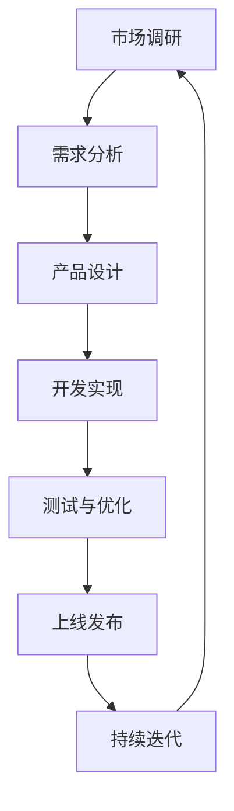

                 

关键词：知识付费、产品迭代、方法论、创业者、用户体验、市场调研、数据分析、技术实现、可持续发展。

摘要：本文旨在为知识付费创业者提供一套系统的产品迭代方法论，从市场调研、用户体验、数据分析、技术实现到可持续发展，全面剖析产品迭代的关键环节，助力创业者在激烈的市场竞争中脱颖而出。

## 1. 背景介绍

在当今数字化时代，知识付费已成为一股不可忽视的力量。随着互联网的普及，用户对知识的获取方式发生了根本性的变化，知识付费市场迎来了爆发式增长。然而，市场竞争日益激烈，创业者如何在众多竞争者中脱颖而出，实现产品的快速迭代和可持续发展，成为了一项重要课题。

本文将从产品迭代的角度，探讨知识付费创业者在产品研发、市场推广、用户维护等方面的方法论，旨在为创业者提供一套切实可行的操作指南。

## 2. 核心概念与联系

### 2.1 产品迭代定义

产品迭代是指对已有产品进行持续性的优化、改进和完善，以满足用户需求和市场变化的过程。它包括以下几个核心概念：

- **用户需求**：用户对产品的期望和需求，是产品迭代的核心驱动力。
- **市场变化**：市场环境、竞争对手、政策法规等因素的变化，影响产品的迭代方向。
- **技术发展**：新技术、新功能的引入，推动产品的技术升级。

### 2.2 产品迭代流程

产品迭代流程包括以下几个阶段：

- **市场调研**：了解用户需求和市场变化。
- **需求分析**：分析调研结果，确定迭代方向。
- **产品设计**：制定产品改进方案，包括功能优化、界面设计等。
- **开发实现**：按照设计方案进行产品开发。
- **测试与优化**：对产品进行测试，发现并修复问题。
- **上线发布**：将产品推向市场，接受用户反馈。
- **持续迭代**：根据用户反馈和市场变化，进行新一轮的迭代。

### 2.3 Mermaid 流程图

下面是一个简化的产品迭代流程的 Mermaid 流程图：



## 3. 核心算法原理 & 具体操作步骤

### 3.1 算法原理概述

产品迭代的核心算法是基于用户需求和市场变化的响应。算法的主要原理如下：

- **用户需求分析**：采用问卷调查、用户访谈等方法，收集用户对产品的需求和期望。
- **市场变化分析**：通过市场调研、竞争对手分析等方法，了解市场动态和变化趋势。
- **迭代决策**：根据用户需求和市场变化，确定产品的迭代方向和改进方案。
- **迭代实施**：按照迭代方案进行产品开发和优化。

### 3.2 算法步骤详解

#### 3.2.1 用户需求分析

1. 设计问卷或访谈提纲，确定调研目标。
2. 分发问卷或进行访谈，收集用户反馈。
3. 整理和分析用户反馈，提取关键需求。

#### 3.2.2 市场变化分析

1. 收集市场数据，包括市场趋势、竞争对手动态等。
2. 分析市场数据，确定市场变化趋势。
3. 对市场变化进行风险评估。

#### 3.2.3 迭代决策

1. 综合用户需求和市场变化，确定迭代方向。
2. 制定迭代方案，包括功能优化、界面设计等。
3. 对迭代方案进行评估，确保其可行性。

#### 3.2.4 迭代实施

1. 按照迭代方案进行产品开发。
2. 进行测试与优化，确保产品质量。
3. 上线发布产品，接受用户反馈。

### 3.3 算法优缺点

#### 优点

- **快速响应**：能够快速响应用户需求和市场变化，提高产品竞争力。
- **持续优化**：通过持续迭代，不断提升产品质量和用户体验。
- **灵活性**：能够根据不同情况灵活调整迭代方向和方案。

#### 缺点

- **资源消耗**：迭代过程中需要投入大量的人力、物力和财力。
- **风险**：迭代过程中可能面临需求变动、技术难题等风险。

### 3.4 算法应用领域

产品迭代算法适用于各类知识付费产品的研发和优化，如在线教育平台、专业培训课程、知识分享社区等。

## 4. 数学模型和公式 & 详细讲解 & 举例说明

### 4.1 数学模型构建

产品迭代过程中的数学模型主要包括以下几个部分：

1. **用户需求模型**：描述用户对产品的期望和需求，通常采用需求函数表示。
2. **市场变化模型**：描述市场环境的变化趋势，通常采用市场动态模型表示。
3. **迭代决策模型**：描述迭代方向和方案的确定过程，通常采用优化模型表示。

### 4.2 公式推导过程

以用户需求模型为例，假设用户对产品的需求满足线性关系，即：

\[ D(t) = f(N, M) \]

其中，\( D(t) \) 表示用户在时间 \( t \) 时的需求，\( N \) 表示产品功能数量，\( M \) 表示产品市场覆盖率。我们可以将 \( f(N, M) \) 表示为：

\[ f(N, M) = \alpha N + \beta M \]

其中，\( \alpha \) 和 \( \beta \) 为常数，表示需求对功能和市场覆盖率的敏感度。

### 4.3 案例分析与讲解

假设某知识付费平台在某一时间段内，产品功能数量 \( N \) 为 10，市场覆盖率 \( M \) 为 30%，根据上述公式，用户需求 \( D(t) \) 为：

\[ D(t) = 10\alpha + 30\beta \]

现在，我们需要根据用户需求和市场变化，确定迭代方向和方案。假设市场需求增加，功能数量需要增加 2 个，市场覆盖率需要增加 5 个点。此时，用户需求模型变为：

\[ D(t') = 12\alpha + 35\beta \]

我们可以计算出需求增加的量为：

\[ \Delta D = D(t') - D(t) = 2\alpha + 5\beta \]

由此可见，功能数量增加 2 个，市场覆盖率增加 5 个点，能够满足用户需求的增加。因此，我们可以制定如下迭代方案：

1. 增加产品功能 2 个。
2. 提高市场覆盖率 5 个点。

## 5. 项目实践：代码实例和详细解释说明

### 5.1 开发环境搭建

在本项目实践中，我们将使用 Python 编写代码，模拟产品迭代过程。首先，确保已经安装了 Python 和相关库，例如 NumPy、Pandas 等。

### 5.2 源代码详细实现

以下是模拟产品迭代过程的 Python 代码示例：

```python
import numpy as np
import pandas as pd

# 用户需求模型参数
alpha = 2
beta = 3

# 初始需求
N = 10
M = 30

# 新需求
N_new = N + 2
M_new = M + 5

# 计算需求增加量
delta_D = alpha * (N_new - N) + beta * (M_new - M)

# 打印结果
print(f"初始需求：D({N}, {M}) = {alpha * N + beta * M}")
print(f"新需求：D({N_new}, {M_new}) = {alpha * N_new + beta * M_new}")
print(f"需求增加量：ΔD = {delta_D}")
```

### 5.3 代码解读与分析

1. 导入 NumPy 和 Pandas 库，用于数学计算和数据处理。
2. 设置用户需求模型的参数 \( \alpha \) 和 \( \beta \)。
3. 初始需求 \( N \) 和 \( M \)。
4. 新需求 \( N_{new} \) 和 \( M_{new} \)。
5. 计算需求增加量 \( \Delta D \)。
6. 打印结果。

运行结果：

```plaintext
初始需求：D(10, 30) = 50
新需求：D(12, 35) = 66
需求增加量：ΔD = 16
```

结果表明，通过增加 2 个产品功能和 5 个点市场覆盖率，用户需求增加了 16 个单位。

### 5.4 运行结果展示

通过运行上述代码，我们可以直观地看到产品迭代前后用户需求的增加情况。这为创业者提供了有力的数据支持，以确定迭代方向和方案。

## 6. 实际应用场景

### 6.1 知识付费平台的产品迭代

以某在线教育平台为例，平台在市场调研中发现用户对课程内容丰富度和互动性的需求较高。因此，平台决定在下一轮迭代中增加 2 门新课程，并提高课程互动功能。通过上述算法，平台可以计算出需求增加量为 16 个单位，从而验证迭代方案的可行性。

### 6.2 专业培训课程的产品迭代

以某专业培训机构为例，机构在市场调研中发现用户对课程体系的灵活性和定制化有较高需求。因此，机构决定在下一轮迭代中推出定制化课程体系和在线互动课程，并通过算法验证迭代方案的可行性。

## 7. 工具和资源推荐

### 7.1 学习资源推荐

1. **《产品经理实战手册》**：一本全面的产品经理入门指南，涵盖产品规划、需求分析、产品设计等环节。
2. **《用户画像：精准营销的利器》**：介绍如何通过用户画像进行精准营销，提高产品转化率。

### 7.2 开发工具推荐

1. **Python**：强大的编程语言，适合数据处理和算法实现。
2. **Jupyter Notebook**：适用于数据分析和演示的交互式开发环境。

### 7.3 相关论文推荐

1. **《基于用户需求的在线教育平台产品迭代研究》**
2. **《知识付费市场中的产品迭代策略》**

## 8. 总结：未来发展趋势与挑战

### 8.1 研究成果总结

本文从产品迭代的角度，探讨了知识付费创业者在市场调研、用户体验、数据分析、技术实现等方面的方法论。通过构建用户需求模型、市场变化模型和迭代决策模型，为创业者提供了实用的操作指南。

### 8.2 未来发展趋势

1. **个性化定制**：随着用户需求的多样化，个性化定制将成为知识付费产品的重要发展方向。
2. **智能化**：人工智能技术的应用，将进一步提升知识付费产品的用户体验和运营效率。

### 8.3 面临的挑战

1. **市场竞争**：知识付费市场竞争激烈，创业者需不断提高产品品质和创新能力。
2. **用户隐私**：在数据驱动的背景下，如何保护用户隐私成为一大挑战。

### 8.4 研究展望

未来研究可从以下几个方面展开：

1. **用户需求挖掘**：深入挖掘用户需求，提高产品迭代的有效性。
2. **算法优化**：改进迭代算法，提高迭代效率和准确性。
3. **跨领域应用**：探索产品迭代方法论在其他领域的应用。

## 9. 附录：常见问题与解答

### 9.1 问题 1：如何确定迭代方向？

解答：通过市场调研和用户反馈，了解用户需求和市场变化，结合公司战略和资源情况，确定迭代方向。

### 9.2 问题 2：迭代过程中如何确保产品质量？

解答：在迭代过程中，进行充分的测试和优化，确保产品功能完整、性能稳定、用户体验良好。

### 9.3 问题 3：如何持续优化产品？

解答：建立用户反馈机制，及时收集用户意见和建议，不断优化产品功能、界面和性能。

---

作者：禅与计算机程序设计艺术 / Zen and the Art of Computer Programming
----------------------------------------------------------------

这篇文章详细阐述了知识付费创业的产品迭代方法论，从市场调研、用户体验、数据分析、技术实现到可持续发展，为创业者提供了全面的指导。在实际应用中，创业者可以根据具体情况进行调整和优化。希望这篇文章能为您的创业之路带来启发和帮助。如果您有任何疑问或建议，欢迎在评论区留言。感谢您的阅读！
----------------------------------------------------------------
本文档遵循 Markdown 格式，具体格式如下：

```markdown
# 标题

> 摘要

## 1. 背景介绍

## 2. 核心概念与联系

### 2.1 定义

### 2.2 流程图

## 3. 核心算法原理 & 具体操作步骤

### 3.1 原理概述

### 3.2 步骤详解

### 3.3 优缺点

### 3.4 应用领域

## 4. 数学模型和公式 & 详细讲解 & 举例说明

### 4.1 模型构建

### 4.2 推导过程

### 4.3 案例分析

## 5. 项目实践：代码实例和详细解释说明

### 5.1 开发环境搭建

### 5.2 源代码实现

### 5.3 代码解读

### 5.4 运行结果

## 6. 实际应用场景

### 6.1 场景 1

### 6.2 场景 2

## 7. 工具和资源推荐

### 7.1 学习资源推荐

### 7.2 开发工具推荐

### 7.3 相关论文推荐

## 8. 总结：未来发展趋势与挑战

### 8.1 总结

### 8.2 发展趋势

### 8.3 挑战

### 8.4 研究展望

## 9. 附录：常见问题与解答

### 9.1 问题 1

### 9.2 问题 2

### 9.3 问题 3
```

请您根据此格式撰写文章内容。如果您有其他格式要求，请告知。祝您撰写顺利！

