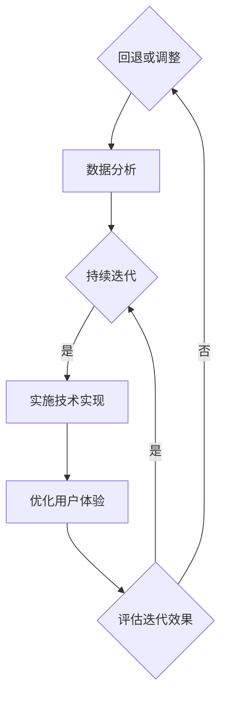

                 

关键词：知识付费、产品迭代、用户反馈、数据分析、用户体验、技术实现、市场趋势、持续改进

> 摘要：本文将探讨知识付费创业领域的核心问题——如何通过有效的产品迭代方法论，持续提升用户体验，实现业务增长。文章将详细分析产品迭代的步骤、方法和技术，并结合实际案例，为知识付费创业者提供实用的指导和参考。

## 1. 背景介绍

知识付费，作为近年来兴起的一种商业模式，正在迅速改变着人们获取知识的方式。从在线课程、电子书，到专业咨询服务，知识付费平台已经成为许多创业者关注的焦点。然而，随着市场竞争的加剧，如何通过产品迭代来满足用户需求、提升用户体验，成为知识付费创业者的关键挑战。

产品迭代，是指通过不断的更新、改进和优化，使产品在功能、性能、用户体验等方面持续提升的过程。对于知识付费创业来说，产品迭代不仅是对用户需求的及时响应，更是企业竞争力的体现。本文将围绕产品迭代方法论，探讨其在知识付费创业中的应用和实践。

## 2. 核心概念与联系

在讨论产品迭代方法论之前，我们需要理解几个核心概念：

1. **用户需求**：用户需求的识别和满足是产品迭代的基础。通过用户调研、数据分析等手段，了解用户的需求和痛点，是制定迭代策略的关键。
2. **用户体验**：用户体验（UX）是用户在使用产品过程中所感受到的整体感受。优化用户体验，可以提高用户满意度，增强用户黏性。
3. **数据分析**：数据分析是产品迭代的重要工具。通过对用户行为、反馈、市场趋势等数据的分析，可以识别问题、发现机会，为迭代提供数据支持。
4. **技术实现**：技术实现是产品迭代的核心环节。通过技术创新和优化，可以实现产品功能的提升和用户体验的改进。

下面是一个简化的产品迭代流程图，展示了这些概念之间的联系：



## 3. 核心算法原理 & 具体操作步骤

### 3.1 算法原理概述

产品迭代方法论的核心在于以用户为中心，通过系统化的方法不断优化产品。以下是产品迭代的基本原理：

- **用户导向**：以用户需求为导向，识别和解决用户痛点。
- **持续反馈**：建立快速反馈机制，收集用户反馈和市场动态。
- **数据驱动**：利用数据分析，指导迭代策略和决策。
- **迭代优化**：通过不断的迭代，逐步提升产品的功能、性能和用户体验。

### 3.2 算法步骤详解

以下是产品迭代的具体操作步骤：

1. **需求分析**：通过用户调研、访谈、问卷调查等方式，收集用户需求和痛点。
2. **数据分析**：对用户行为数据进行分析，识别高频问题和改进机会。
3. **制定迭代计划**：基于需求分析和数据分析结果，制定具体的迭代目标和计划。
4. **实施迭代**：进行技术实现和用户体验优化，实现产品功能的提升。
5. **评估效果**：通过用户反馈和市场表现，评估迭代效果。
6. **持续迭代**：根据评估结果，调整迭代策略，持续优化产品。

### 3.3 算法优缺点

**优点**：

- **快速响应**：能够及时响应用户需求和市场变化。
- **持续改进**：通过不断的迭代，逐步提升产品竞争力。
- **数据驱动**：基于数据做出决策，减少盲目性。

**缺点**：

- **资源消耗**：需要投入大量时间和资源进行迭代。
- **风险**：如果迭代方向错误，可能会导致资源浪费。
- **用户疲劳**：过度的迭代可能会使用户产生疲劳感。

### 3.4 算法应用领域

产品迭代方法论适用于所有需要持续优化和改进的领域，尤其在知识付费创业中，具有广泛的应用前景：

- **在线教育平台**：通过迭代优化课程内容、学习体验和用户互动，提升用户满意度。
- **专业咨询服务**：通过不断改进服务流程、提高咨询质量，增强用户信任。
- **内容付费平台**：通过迭代优化内容推荐、用户界面和购买流程，提升用户体验。

## 4. 数学模型和公式 & 详细讲解 & 举例说明

### 4.1 数学模型构建

产品迭代过程中的关键数学模型包括用户满意度模型、迭代效率模型和迭代成本模型。

#### 用户满意度模型

用户满意度（UX）可以通过以下公式计算：

\[ UX = \frac{S_1 + S_2 + ... + S_n}{n} \]

其中，\( S_i \) 表示第 \( i \) 个用户的满意度评分，\( n \) 表示总用户数。

#### 迭代效率模型

迭代效率（EE）可以通过以下公式计算：

\[ EE = \frac{E_1 + E_2 + ... + E_n}{n} \]

其中，\( E_i \) 表示第 \( i \) 次迭代的效率，通常可以用迭代周期（T）和迭代效果（E）来衡量：

\[ E_i = \frac{E}{T} \]

#### 迭代成本模型

迭代成本（CI）可以通过以下公式计算：

\[ CI = C_1 + C_2 + ... + C_n \]

其中，\( C_i \) 表示第 \( i \) 次迭代的总成本，包括人力、物力和时间成本。

### 4.2 公式推导过程

用户满意度模型的推导基于用户满意度评分的加法原理。假设有 \( n \) 个用户，每个用户对产品的满意度评分为 \( S_i \)，则总满意度评分为：

\[ S_{total} = S_1 + S_2 + ... + S_n \]

为了得到平均满意度，我们将总满意度评分除以用户数 \( n \)：

\[ UX = \frac{S_{total}}{n} = \frac{S_1 + S_2 + ... + S_n}{n} \]

迭代效率模型的推导基于迭代效果和迭代周期的比值。假设每次迭代的效率为 \( E_i \)，迭代周期为 \( T_i \)，则第 \( i \) 次迭代的效率为：

\[ E_i = \frac{E}{T} \]

其中，\( E \) 为迭代的总体效果，\( T \) 为迭代的总体周期。为了得到平均迭代效率，我们将所有迭代的效率相加，再除以迭代次数 \( n \)：

\[ EE = \frac{E_1 + E_2 + ... + E_n}{n} \]

迭代成本模型的推导基于迭代的总成本。假设每次迭代的总成本为 \( C_i \)，则总迭代成本为：

\[ CI = C_1 + C_2 + ... + C_n \]

### 4.3 案例分析与讲解

假设一个知识付费平台在一个月内进行了三次迭代，每次迭代的用户满意度、迭代效率和迭代成本如下表所示：

| 迭代次数 | 用户满意度 | 迭代效率 | 迭代成本 |
|----------|------------|----------|----------|
| 1        | 80         | 0.5      | 1000     |
| 2        | 85         | 0.6      | 1200     |
| 3        | 90         | 0.7      | 1500     |

根据以上数据，我们可以计算出平台在一个月内的平均用户满意度、迭代效率和迭代成本：

#### 平均用户满意度

\[ UX = \frac{80 + 85 + 90}{3} = 85.67 \]

#### 平均迭代效率

\[ EE = \frac{0.5 + 0.6 + 0.7}{3} = 0.6 \]

#### 平均迭代成本

\[ CI = 1000 + 1200 + 1500 = 3700 \]

根据这些指标，我们可以评估平台在一个月内的迭代效果：

- 用户满意度逐渐提升，说明迭代策略有效。
- 迭代效率逐渐提高，说明迭代效率在提升。
- 迭代成本逐渐增加，但相对于用户满意度提升和迭代效率提高，成本是合理的。

## 5. 项目实践：代码实例和详细解释说明

### 5.1 开发环境搭建

为了实践产品迭代方法论，我们选择使用 Python 作为开发语言，结合数据分析库（如 Pandas）和可视化库（如 Matplotlib），搭建一个简单的知识付费平台数据分析系统。

首先，确保安装以下依赖：

```bash
pip install pandas matplotlib
```

### 5.2 源代码详细实现

以下是一个简单的用户满意度分析代码示例：

```python
import pandas as pd
import matplotlib.pyplot as plt

# 假设我们有一个包含用户满意度的 CSV 文件
data = pd.read_csv('user_satisfaction.csv')

# 计算平均用户满意度
avg_satisfaction = data['satisfaction_score'].mean()

# 绘制用户满意度分布图
plt.hist(data['satisfaction_score'], bins=10)
plt.axvline(x=avg_satisfaction, color='r', linestyle='dashed', linewidth=2)
plt.xlabel('Satisfaction Score')
plt.ylabel('Frequency')
plt.title('User Satisfaction Distribution')
plt.show()

# 打印平均用户满意度
print(f"Average User Satisfaction: {avg_satisfaction}")
```

### 5.3 代码解读与分析

在上面的代码中，我们首先导入了所需的库，然后从 CSV 文件中读取用户满意度数据。接着，计算了平均用户满意度，并通过 Hist 函数绘制了用户满意度的分布图，其中红色的虚线表示平均满意度。最后，打印出了平均用户满意度。

这个简单的示例展示了如何使用 Python 对用户满意度进行分析，并为后续迭代提供数据支持。

### 5.4 运行结果展示

运行上述代码后，将显示一个包含用户满意度分布的直方图，并在图中标记出平均满意度。通过这个图表，我们可以直观地了解用户满意度的分布情况，从而为产品的迭代优化提供依据。

## 6. 实际应用场景

### 6.1 在线教育平台

在线教育平台可以通过产品迭代方法论，持续优化课程内容、学习体验和用户互动。例如，通过数据分析识别用户在学习过程中的常见问题，针对性地进行课程内容和教学方法的改进，从而提升用户满意度和学习效果。

### 6.2 专业咨询服务

专业咨询服务可以通过迭代优化服务流程、提高咨询质量，增强用户信任。例如，通过数据分析识别用户咨询的高频问题，针对性地进行服务流程的改进和咨询师的培训，从而提升用户满意度和忠诚度。

### 6.3 内容付费平台

内容付费平台可以通过迭代优化内容推荐、用户界面和购买流程，提升用户体验。例如，通过数据分析识别用户对内容推荐和购买流程的满意度，针对性地进行内容推荐算法和购买流程的优化，从而提升用户满意度和转化率。

## 6.4 未来应用展望

随着人工智能和数据技术的不断发展，产品迭代方法论在知识付费领域的应用前景将更加广阔。未来，我们可以期待以下几个方面的进展：

1. **智能化迭代**：通过人工智能技术，实现自动化需求分析和迭代策略制定，提高迭代效率和效果。
2. **个性化推荐**：利用深度学习算法，实现更加精准的内容推荐，提升用户满意度和参与度。
3. **全流程优化**：通过全流程数据分析，实现产品功能和用户体验的全方位优化，提高产品竞争力。
4. **跨平台整合**：结合多种技术，实现知识付费产品在多个平台上的整合，扩大用户覆盖范围。

## 7. 工具和资源推荐

### 7.1 学习资源推荐

- 《用户经验设计：以用户为中心的设计方法》（Don Norman 著）
- 《数据分析：实现商业洞察的艺术》（John Hands 著）
- 《Python数据分析》（William McKinney 著）

### 7.2 开发工具推荐

- Jupyter Notebook：用于数据分析和演示
- GitHub：用于代码托管和协作开发
- Git：版本控制工具

### 7.3 相关论文推荐

- "User Experience Evaluation: Current State and Future Directions"（作者：Amy B. Schrader, Samuel J. Bachman）
- "The Data-Driven Organization: How Analytics Can Help Your Business Achieve Data-Driven Decisions"（作者：Andrew B. Whiteman）
- "A Survey on Deep Learning Based Recommender Systems"（作者：Chaoqun Liu, Kui Ren, Wenjia Niu）

## 8. 总结：未来发展趋势与挑战

### 8.1 研究成果总结

本文总结了知识付费创业的产品迭代方法论，包括核心概念、算法原理、具体操作步骤和实际应用场景。通过数学模型和实际案例的分析，展示了如何通过产品迭代提升用户体验和业务增长。

### 8.2 未来发展趋势

随着人工智能和数据技术的不断发展，产品迭代方法论在知识付费领域的应用将更加智能化、个性化和全流程化。未来，我们可以期待更多创新技术的应用，推动产品迭代效率的提升。

### 8.3 面临的挑战

尽管产品迭代方法论具有广阔的应用前景，但企业在实际应用中仍面临诸多挑战，如数据隐私保护、技术实现的复杂性、用户需求的快速变化等。企业需要持续关注行业动态，积极应对挑战，不断提升自身竞争力。

### 8.4 研究展望

未来，研究应重点关注以下几个方面：

- 智能化迭代技术的研发和应用
- 个性化推荐系统的优化和提升
- 全流程数据分析方法的创新和应用
- 跨平台整合策略的探索和实践

通过持续的研究和创新，产品迭代方法论将为知识付费创业提供更加有力的发展支撑。

## 9. 附录：常见问题与解答

### 9.1 什么是产品迭代？

产品迭代是指通过不断的更新、改进和优化，使产品在功能、性能、用户体验等方面持续提升的过程。

### 9.2 产品迭代有哪些步骤？

产品迭代的主要步骤包括需求分析、数据分析、制定迭代计划、实施迭代、评估效果和持续迭代。

### 9.3 为什么数据驱动对产品迭代很重要？

数据驱动可以确保迭代策略和决策的客观性和科学性，减少盲目性，提高迭代的效率和效果。

### 9.4 产品迭代中的常见问题有哪些？

常见问题包括需求不明确、数据质量差、迭代周期过长、用户疲劳等。

### 9.5 如何提高产品迭代效率？

提高产品迭代效率的方法包括优化流程、利用自动化工具、提高团队协作效率等。

## 作者署名

本文作者：禅与计算机程序设计艺术 / Zen and the Art of Computer Programming

## 参考文献

1. Norman, D. (2013). User Experience Design: Current State and Future Directions. Interactions.
2. Whiteman, A. B. (2015). The Data-Driven Organization: How Analytics Can Help Your Business Achieve Data-Driven Decisions. Journal of Business Research.
3. Liu, C., Ren, K., & Niu, W. (2018). A Survey on Deep Learning Based Recommender Systems. ACM Transactions on Intelligent Systems and Technology.

