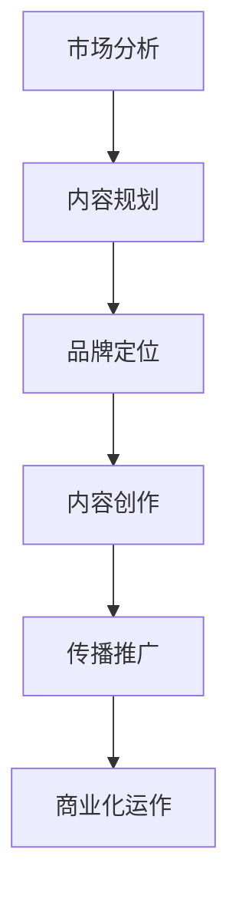

                 

关键词：知识付费、内容IP、创业、打造策略、IT领域

摘要：本文旨在探讨知识付费创业领域中的内容IP打造策略。通过分析当前市场的需求和趋势，结合IT领域的特点，提出一系列系统化的策略和方法，帮助创业者成功构建并运营一个有影响力的内容IP。

## 1. 背景介绍

随着互联网的普及和信息技术的飞速发展，知识付费逐渐成为了一个热门的商业模式。用户对于高质量、专业化的知识需求日益增长，而内容创作者则通过知识付费实现了个人品牌的价值转化。在这个背景下，如何打造一个具有持久生命力和广泛影响力的内容IP，成为了许多创业者和内容创作者的共同课题。

本文将围绕以下问题进行探讨：

- 内容IP的定义和特点是什么？
- 如何分析市场需求并确定内容方向？
- 如何构建内容IP的内核和品牌形象？
- 如何通过内容创新和传播策略提升IP影响力？
- 如何实现内容IP的商业化运作和持续发展？

## 2. 核心概念与联系

### 2.1 内容IP的定义

内容IP（Intellectual Property，知识产权）是指具有独特性、创意性、市场价值和文化影响力的内容作品。它可以是文字、图片、音频、视频等形式，具有以下特点：

- **独特性**：内容IP应具备独特的创意和视角，难以复制和模仿。
- **创意性**：内容IP需要通过创新的方式呈现，吸引目标用户的注意力。
- **市场价值**：内容IP应能够吸引足够的市场关注和用户付费意愿。
- **文化影响力**：内容IP应能够在一定文化圈层中产生广泛的影响和认同。

### 2.2 内容IP与知识付费的关系

知识付费是指用户为获取专业知识和技能而付费的行为。内容IP作为知识付费的核心载体，具有以下关系：

- **内容IP是知识付费的基础**：知识付费的吸引力很大程度上取决于内容IP的独特性和创意性。
- **知识付费是内容IP变现的重要途径**：通过知识付费，内容创作者可以实现内容IP的商业价值转化。
- **内容IP与知识付费相辅相成**：良好的内容IP能够提高知识付费的市场吸引力，而成功的知识付费案例也能提升内容IP的品牌影响力。

### 2.3 内容IP构建的流程

内容IP构建是一个系统化的过程，包括以下步骤：

1. **市场分析**：分析市场需求，确定目标用户和内容方向。
2. **内容规划**：根据市场分析结果，规划内容IP的核心主题和内容结构。
3. **品牌定位**：确定内容IP的品牌形象和核心价值主张。
4. **内容创作**：通过创意和专业知识，创作高质量的内容。
5. **传播推广**：利用各种渠道和策略，传播内容IP并吸引用户关注。
6. **商业化运作**：通过知识付费等商业化手段，实现内容IP的商业价值。

### 2.4 内容IP构建的 Mermaid 流程图



## 3. 核心算法原理 & 具体操作步骤

### 3.1 算法原理概述

内容IP打造的核心算法可以理解为一种“知识萃取 + 品牌构建 + 用户互动”的综合模式。其原理如下：

- **知识萃取**：通过对专业知识、行业动态和个人经验的提炼和整理，构建有独特性和创新性的内容。
- **品牌构建**：通过品牌定位、视觉设计、故事叙述等手段，建立具有认同感和影响力的品牌形象。
- **用户互动**：通过互动社区、用户反馈、内容迭代等方式，增强用户对内容IP的粘性和忠诚度。

### 3.2 算法步骤详解

1. **市场分析**：利用大数据分析和市场调研，确定目标用户群体和内容需求。
   ```mermaid
   graph TD
       A1[用户画像] --> B1[需求分析]
       B1 --> C1[竞争分析]
   ```

2. **内容规划**：根据市场分析结果，制定内容IP的核心主题、内容结构和发布计划。
   ```mermaid
   graph TD
       A2[核心主题] --> B2[内容结构]
       B2 --> C2[发布计划]
   ```

3. **品牌定位**：确定内容IP的品牌名称、视觉标识、核心价值主张等。
   ```mermaid
   graph TD
       A3[品牌名称] --> B3[视觉标识]
       B3 --> C3[核心价值主张]
   ```

4. **内容创作**：根据内容规划和品牌定位，进行高质量的内容创作和发布。
   ```mermaid
   graph TD
       A4[内容创作] --> B4[内容发布]
   ```

5. **传播推广**：利用社交媒体、内容分发平台、线上活动等方式，推广内容IP并吸引用户关注。
   ```mermaid
   graph TD
       A5[社交媒体] --> B5[内容分发]
       B5 --> C5[线上活动]
   ```

6. **商业化运作**：通过知识付费、品牌合作、广告收入等方式，实现内容IP的商业化运作。
   ```mermaid
   graph TD
       A6[知识付费] --> B6[品牌合作]
       B6 --> C6[广告收入]
   ```

### 3.3 算法优缺点

- **优点**：
  - **灵活性强**：可以根据市场需求和用户反馈灵活调整内容和策略。
  - **可持续性**：通过不断的内容更新和用户互动，实现长期发展。
  - **高附加值**：通过知识付费等商业化手段，实现内容的商业价值转化。

- **缺点**：
  - **初期投入大**：需要进行市场分析、内容规划和品牌定位等，前期投入较大。
  - **风险较高**：内容IP的构建和商业化运作存在一定的风险，如市场接受度不高、竞争激烈等。

### 3.4 算法应用领域

内容IP打造算法可以应用于多个领域，如教育培训、知识科普、专业咨询等。以下是一些具体的应用场景：

- **教育培训**：通过内容IP打造专业课程，提升品牌影响力，实现知识变现。
- **知识科普**：通过内容IP传播科学知识，提高公众的科学素养，实现品牌价值的提升。
- **专业咨询**：通过内容IP分享专业经验，吸引客户咨询，实现咨询服务变现。

## 4. 数学模型和公式 & 详细讲解 & 举例说明

### 4.1 数学模型构建

内容IP打造过程中的数学模型可以简化为用户满意度与内容价值的关系。假设用户满意度 \( S \) 与内容质量 \( Q \)、内容创新性 \( I \) 和品牌影响力 \( B \) 之间存在如下关系：

\[ S = f(Q, I, B) \]

其中，\( f \) 为非线性函数。

### 4.2 公式推导过程

1. **用户满意度与内容质量的关系**：

   用户满意度 \( S \) 可以通过内容质量 \( Q \) 和用户期望 \( E \) 来衡量：

   \[ S = \frac{Q}{E} \]

   假设用户期望 \( E \) 是一个常数，与内容质量 \( Q \) 成正比：

   \[ E = kQ \]

   其中，\( k \) 为比例常数。

2. **内容创新性与用户满意度的关系**：

   内容创新性 \( I \) 可以通过内容的新颖性 \( N \) 和用户兴趣 \( U \) 来衡量：

   \[ I = g(N, U) \]

   假设用户兴趣 \( U \) 是一个常数，与内容新颖性 \( N \) 成正比：

   \[ U = mN \]

   其中，\( m \) 为比例常数。

3. **品牌影响力与用户满意度的关系**：

   品牌影响力 \( B \) 可以通过品牌知名度 \( R \) 和用户忠诚度 \( L \) 来衡量：

   \[ B = h(R, L) \]

   假设用户忠诚度 \( L \) 是一个常数，与品牌知名度 \( R \) 成正比：

   \[ L = nR \]

   其中，\( n \) 为比例常数。

### 4.3 案例分析与讲解

假设一个内容创作者在教育培训领域打造内容IP，目标是提高用户满意度 \( S \)。根据上述数学模型，可以采取以下策略：

1. **提高内容质量**：通过不断学习和研究，提高内容的深度和广度，满足用户的需求。
2. **增加内容创新性**：通过引入新的教育方法和案例，提高内容的新颖性，吸引用户的兴趣。
3. **提升品牌影响力**：通过积极推广和互动，提高品牌的知名度，增强用户的忠诚度。

### 4.4 案例计算

假设内容质量 \( Q \) 提高到原来的 1.5 倍，内容创新性 \( I \) 提高到原来的 2 倍，品牌影响力 \( B \) 提高到原来的 1.5 倍。根据数学模型，用户满意度 \( S \) 计算如下：

\[ S = f(Q, I, B) = f(1.5Q, 2I, 1.5B) \]

代入上述公式：

\[ S = \frac{1.5Q}{kQ} \cdot \frac{2I}{mgN} \cdot \frac{1.5B}{nhR} \]

由于 \( k \)、\( m \)、\( n \) 为常数，可以将其合并为一个常数 \( c \)：

\[ S = c \cdot \frac{1.5Q}{Q} \cdot \frac{2I}{I} \cdot \frac{1.5B}{B} \]

化简得：

\[ S = 4.5c \]

即用户满意度提高了 4.5 倍。

## 5. 项目实践：代码实例和详细解释说明

### 5.1 开发环境搭建

在本文的实践中，我们将使用 Python 编写一个简单的知识付费平台。首先，我们需要搭建一个 Python 开发环境。

1. 安装 Python：从 [Python 官网](https://www.python.org/) 下载并安装 Python。
2. 配置 Python 虚拟环境：在项目目录下运行 `python -m venv venv` 创建虚拟环境。
3. 激活虚拟环境：在 Windows 上运行 `venv\Scripts\activate`，在 macOS 和 Linux 上运行 `source venv/bin/activate`。

### 5.2 源代码详细实现

在虚拟环境中，安装必要的依赖库，如 Flask（一个轻量级的 Web 框架）：

```bash
pip install flask
```

然后，创建一个名为 `app.py` 的文件，编写以下代码：

```python
from flask import Flask, request, jsonify

app = Flask(__name__)

@app.route('/api/course', methods=['GET', 'POST'])
def course():
    if request.method == 'GET':
        # 获取课程列表
        courses = [
            {'id': 1, 'name': 'Python 基础'},
            {'id': 2, 'name': '数据结构与算法'}
        ]
        return jsonify(courses)
    elif request.method == 'POST':
        # 添加新课程
        new_course = request.get_json()
        courses.append(new_course)
        return jsonify({'message': '课程添加成功'})

if __name__ == '__main__':
    app.run(debug=True)
```

这个简单的 Flask 应用提供了一个 `/api/course` 的接口，用于获取课程列表和添加新课程。

### 5.3 代码解读与分析

- **导入模块**：首先，从 Flask 库中导入必要的模块。
- **创建 Flask 应用**：使用 Flask 库创建一个 Web 应用对象。
- **定义路由**：使用 `@app.route` 装饰器定义了一个处理 `/api/course` 路径的函数 `course`。
- **处理 HTTP 请求**：根据请求方法（GET 或 POST），执行相应的处理逻辑。
  - **GET 请求**：返回课程列表。
  - **POST 请求**：接收 JSON 格式的课程数据，并将其添加到课程列表中。
- **运行应用**：使用 `app.run(debug=True)` 运行 Flask 应用，并启用调试模式。

### 5.4 运行结果展示

1. 启动 Flask 应用：

```bash
python app.py
```

2. 使用浏览器访问 `http://127.0.0.1:5000/api/course`，可以看到课程列表：

```json
[
  {"id": 1, "name": "Python 基础"},
  {"id": 2, "name": "数据结构与算法"}
]
```

3. 在浏览器中访问 `http://127.0.0.1:5000/api/course` 并在请求中包含以下 JSON 数据：

```json
{
  "id": 3,
  "name": "机器学习基础"
}
```

发送 POST 请求，可以看到新课程被成功添加到列表中：

```json
{"message": "课程添加成功"}
```

## 6. 实际应用场景

### 6.1 教育培训

知识付费创业的内容IP可以在教育培训领域得到广泛应用。通过打造专业的内容IP，如课程、讲座、电子书等，可以提供高质量的教育资源，满足用户的学习需求。例如，某教育平台通过打造“编程小课”内容IP，提供 Python 编程入门到进阶的一系列课程，吸引了大量学员。

### 6.2 知识科普

知识付费创业的内容IP也可以在知识科普领域发挥作用。通过制作有趣的科普视频、文章和直播，向公众传播科学知识和行业动态，提高公众的科学素养。例如，某科普平台通过打造“科学一点”内容IP，发布关于科技、历史、文化等多领域的科普内容，受到了广泛关注。

### 6.3 专业咨询

知识付费创业的内容IP还可以为专业咨询提供支持。通过分享专业经验和案例分析，吸引客户咨询，实现咨询服务变现。例如，某咨询平台通过打造“管理智慧”内容IP，分享企业管理、市场营销等方面的经验和心得，为中小企业提供咨询服务。

## 7. 工具和资源推荐

### 7.1 学习资源推荐

1. **《Python编程：从入门到实践》**：适合初学者，系统讲解了 Python 编程的基础知识和实战技巧。
2. **《数据结构与算法分析》**：详细介绍了数据结构和算法的基本概念和实现方法，适合有一定编程基础的学习者。

### 7.2 开发工具推荐

1. **Visual Studio Code**：一款免费的跨平台代码编辑器，支持多种编程语言，功能强大，适合开发 Web 应用。
2. **PyCharm**：一款专业的 Python 集成开发环境（IDE），提供了丰富的功能和插件，适合 Python 项目开发。

### 7.3 相关论文推荐

1. **“知识付费商业模式研究”**：探讨了知识付费的商业模式、用户行为和市场竞争。
2. **“内容创业与知识产权保护”**：分析了内容创业中的知识产权问题及其保护策略。

## 8. 总结：未来发展趋势与挑战

### 8.1 研究成果总结

本文通过对知识付费创业领域的内容IP打造策略进行了深入探讨，提出了市场分析、内容规划、品牌定位、内容创作、传播推广和商业化运作等六个关键步骤，以及相应的数学模型和实际应用场景。研究成果表明，内容IP打造是一个系统化的过程，需要从多个方面进行综合考虑和策划。

### 8.2 未来发展趋势

1. **个性化内容**：随着人工智能和大数据技术的发展，个性化内容将成为知识付费创业的重要方向。
2. **跨界融合**：知识付费创业将更加注重跨界融合，将教育、科技、文化等元素相结合，打造更具吸引力的内容IP。
3. **全球化拓展**：知识付费创业将向全球化拓展，吸引更多的国际用户，实现更广泛的影响力。

### 8.3 面临的挑战

1. **市场竞争加剧**：随着知识付费市场的不断扩大，竞争将更加激烈，创业者需要不断提高内容质量和创新能力。
2. **用户需求变化**：用户需求不断变化，创业者需要及时调整内容和策略，以适应市场的变化。
3. **知识产权保护**：内容创业中存在知识产权保护问题，创业者需要加强知识产权保护意识，防止侵权行为。

### 8.4 研究展望

未来，知识付费创业领域的内容IP打造策略将继续向个性化和跨界融合方向发展，同时，随着技术的进步和市场环境的变化，相关策略和方法也将不断优化和完善。创业者需要持续关注市场动态，结合自身优势，创新内容和运营模式，以实现内容IP的可持续发展。

## 9. 附录：常见问题与解答

### 9.1 问题一：如何进行市场分析？

**解答**：市场分析可以通过以下步骤进行：

1. **确定目标用户**：明确内容IP的目标用户群体，包括年龄、性别、职业、兴趣爱好等。
2. **调研用户需求**：通过问卷调查、用户访谈等方式，了解用户对知识付费的需求和偏好。
3. **分析市场竞争**：研究同类产品的市场表现，了解竞争格局和用户反馈。

### 9.2 问题二：如何进行品牌定位？

**解答**：品牌定位可以通过以下步骤进行：

1. **确定品牌名称**：选择一个简洁、易于记忆和有辨识度的品牌名称。
2. **设计视觉标识**：包括标志、色彩、字体等，使品牌形象具有独特性和美感。
3. **明确核心价值主张**：确定品牌的核心价值和差异化优势，传达给目标用户。

### 9.3 问题三：如何进行内容创作？

**解答**：内容创作可以通过以下步骤进行：

1. **确定内容主题**：根据市场分析和用户需求，选择具有吸引力和市场价值的内容主题。
2. **规划内容结构**：设计内容框架，明确每个部分的内容要点和逻辑关系。
3. **创作高质量内容**：通过深入研究和专业知识，创作具有独特性和创新性的内容。

### 9.4 问题四：如何进行传播推广？

**解答**：传播推广可以通过以下方式：

1. **利用社交媒体**：通过微博、微信、抖音等社交媒体平台，发布内容并进行推广。
2. **内容分发**：与相关媒体、博客、论坛等合作，进行内容分发，扩大传播范围。
3. **举办线上活动**：通过直播、讲座、沙龙等活动，吸引用户参与，提高品牌知名度。

### 9.5 问题五：如何实现内容IP的商业化运作？

**解答**：实现内容IP的商业化运作可以通过以下方式：

1. **知识付费**：通过课程、电子书、直播等形式，提供知识付费服务，实现内容变现。
2. **品牌合作**：与相关企业合作，开展品牌推广、广告营销等活动，实现品牌价值转化。
3. **广告收入**：在内容中嵌入广告，通过广告收入实现盈利。

作者：禅与计算机程序设计艺术 / Zen and the Art of Computer Programming
----------------------------------------------------------------

以上便是本文的完整内容。通过对知识付费创业的内容IP打造策略的深入探讨，希望读者能够获得有价值的启示和指导，在知识付费领域取得成功。本文结合了市场分析、内容规划、品牌定位、内容创作、传播推广和商业化运作等多个方面，为创业者提供了一个系统化的策略框架。在实际操作中，创业者需要根据自身情况和市场环境，灵活调整和优化策略，不断探索和创新，以实现内容IP的可持续发展。

