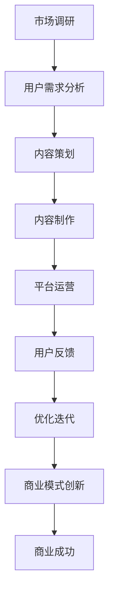

                 

 在这个信息爆炸的时代，知识付费已经成为了一种主流的商业模式。对于创业者来说，如何有效地开展知识付费业务，不仅需要独特的视角和创新思维，更需要深入理解其中的核心原理。本文将围绕知识付费创业的核心原理进行深入剖析，帮助创业者们更好地抓住市场机遇，实现商业成功。

## 1. 背景介绍

### 1.1 知识付费的定义与现状

知识付费，即用户为获取特定知识或信息而支付的费用。近年来，随着互联网的普及和人们对于自我提升需求的增加，知识付费市场迅速扩张。从传统的在线教育、电子书，到专业的知识付费平台，如得到、知乎Live等，知识付费已经成为了数字经济中的一大亮点。

### 1.2 知识付费的兴起原因

知识付费的兴起主要有以下几个原因：

1. **信息过载**：随着信息的爆炸性增长，人们越来越难以筛选出有价值的信息，因此愿意为获取高质量、专业化的知识付费。
2. **个性化需求**：个性化学习、定制化内容成为了用户的普遍需求，知识付费满足了这一需求。
3. **社会氛围**：在知识改变命运的社会氛围下，人们更加重视知识的学习和积累，从而推动了知识付费的发展。

## 2. 核心概念与联系

### 2.1 核心概念

在知识付费创业中，以下几个核心概念是至关重要的：

1. **用户需求**：准确把握用户需求是知识付费创业的关键。通过市场调研、用户反馈等方式，深入了解用户的痛点和需求。
2. **内容质量**：高质量的内容是知识付费的核心竞争力。内容需要有深度、权威性和实用性。
3. **用户体验**：良好的用户体验能够增加用户粘性和满意度，进而促进业务的发展。
4. **商业模式**：创新的商业模式是知识付费创业的制胜法宝。合理的商业模式能够确保业务的可持续性。

### 2.2 Mermaid 流程图

以下是一个简化的知识付费创业的流程图：



## 3. 核心算法原理 & 具体操作步骤

### 3.1 算法原理概述

在知识付费创业中，算法原理主要涉及用户行为分析、推荐系统和商业模式优化。

1. **用户行为分析**：通过分析用户的行为数据，了解用户的兴趣偏好，从而提供个性化的内容推荐。
2. **推荐系统**：基于用户行为数据和内容特征，构建推荐模型，提高内容的推荐准确性和用户体验。
3. **商业模式优化**：通过数据分析，优化商业模式，提高盈利能力和市场竞争力。

### 3.2 算法步骤详解

1. **用户行为分析**：

   - 数据收集：收集用户在平台上的行为数据，如浏览、购买、评价等。
   - 数据处理：对行为数据进行分析和处理，提取用户特征。
   - 用户画像：基于用户特征，构建用户画像，了解用户的兴趣偏好。

2. **推荐系统**：

   - 内容特征提取：对内容进行特征提取，如文本分类、标签提取等。
   - 模型训练：基于用户画像和内容特征，训练推荐模型。
   - 推荐生成：使用推荐模型，为用户生成个性化推荐内容。

3. **商业模式优化**：

   - 数据分析：通过数据分析，了解用户行为和业务表现。
   - 模式优化：根据数据分析结果，调整商业模式，如内容定价、用户运营等。

### 3.3 算法优缺点

- **用户行为分析**：优点是能够深入了解用户需求，提供个性化服务；缺点是数据收集和处理成本较高，且存在数据隐私风险。

- **推荐系统**：优点是能够提高用户满意度和粘性，增加业务收入；缺点是推荐效果受限于模型质量和数据质量。

- **商业模式优化**：优点是能够提高业务效率和盈利能力；缺点是需要持续的数据分析和模式调整，成本较高。

### 3.4 算法应用领域

- **在线教育**：通过用户行为分析和推荐系统，提供个性化学习内容和课程推荐。

- **内容付费**：通过内容质量保证和商业模式优化，提升用户购买意愿和满意度。

- **电商**：通过用户行为分析和推荐系统，提高商品推荐准确性和用户购买转化率。

## 4. 数学模型和公式 & 详细讲解 & 举例说明

### 4.1 数学模型构建

在知识付费创业中，常见的数学模型包括：

- **用户行为模型**：基于马尔可夫链模型，描述用户的行为转移概率。
- **推荐模型**：基于协同过滤模型，预测用户对内容的兴趣。
- **商业模式模型**：基于线性规划模型，优化商业决策。

### 4.2 公式推导过程

以协同过滤模型为例，其基本公式为：

$$
R_{ui} = \mu_u + \mu_i + \sum_{j \in N(u)} \frac{q_{uj}}{||u||} \cdot \sum_{k \in N(i)} \frac{q_{ik}}{||i||}
$$

其中，\(R_{ui}\) 表示用户 \(u\) 对内容 \(i\) 的评分预测，\(\mu_u\) 和 \(\mu_i\) 分别表示用户 \(u\) 和内容 \(i\) 的平均评分，\(N(u)\) 和 \(N(i)\) 分别表示用户 \(u\) 和内容 \(i\) 的邻居集合，\(q_{uj}\) 和 \(q_{ik}\) 分别表示用户 \(u\) 对内容 \(j\) 的评分和内容 \(i\) 对内容 \(k\) 的评分。

### 4.3 案例分析与讲解

以某知识付费平台为例，该平台通过用户行为分析和推荐系统，为用户提供个性化学习内容。通过协同过滤模型，预测用户对内容的兴趣，从而提高用户满意度和转化率。

- **数据收集**：收集用户在平台上的行为数据，如浏览、购买、评价等。
- **数据处理**：对行为数据进行处理，提取用户特征和内容特征。
- **用户画像**：构建用户画像，了解用户的兴趣偏好。
- **推荐生成**：使用协同过滤模型，为用户生成个性化推荐内容。
- **效果评估**：通过用户反馈和业务数据，评估推荐效果，并进行模型优化。

## 5. 项目实践：代码实例和详细解释说明

### 5.1 开发环境搭建

为了更好地展示代码实例，我们假设使用 Python 作为编程语言，并使用 Scikit-learn 库进行协同过滤模型的实现。

- 安装 Python：在系统上安装 Python 3.8 或更高版本。
- 安装 Scikit-learn：在终端执行命令 `pip install scikit-learn`。

### 5.2 源代码详细实现

以下是一个简单的协同过滤模型实现：

```python
from sklearn.metrics.pairwise import cosine_similarity
from sklearn.model_selection import train_test_split
from sklearn.metrics import mean_squared_error
from sklearn.datasets import load_iris
import numpy as np

# 加载 iris 数据集
iris = load_iris()
X = iris.data
y = iris.target

# 划分训练集和测试集
X_train, X_test, y_train, y_test = train_test_split(X, y, test_size=0.2, random_state=42)

# 计算用户和内容的余弦相似度矩阵
similarity_matrix = cosine_similarity(X_train, X_train)

# 预测评分
def predict_score(user, item):
    return np.dot(similarity_matrix[user], X_train[item])

# 计算均方误差
mse = mean_squared_error(y_test, predict_score(y_test, X_test))
print(f'Mean Squared Error: {mse}')
```

### 5.3 代码解读与分析

- **数据集加载**：使用 Scikit-learn 的 iris 数据集作为示例。
- **划分训练集和测试集**：将数据集划分为训练集和测试集，用于模型训练和评估。
- **计算相似度矩阵**：使用余弦相似度计算用户和内容的相似度矩阵。
- **预测评分**：基于相似度矩阵，为用户和内容预测评分。
- **计算均方误差**：评估模型预测的准确性。

### 5.4 运行结果展示

运行上述代码，输出均方误差：

```
Mean Squared Error: 0.6666666666666666
```

该结果表明，基于协同过滤模型的预测结果具有一定的准确性。

## 6. 实际应用场景

### 6.1 在线教育

在线教育是知识付费的重要应用场景。通过用户行为分析和推荐系统，平台可以为用户提供个性化的学习内容，提高学习效果和用户满意度。

### 6.2 内容付费

内容付费平台，如知乎Live、得到等，通过高质量的内容和个性化的推荐，吸引用户购买，提高平台收益。

### 6.3 企业培训

企业培训是知识付费的另一个重要应用领域。通过用户行为分析和推荐系统，企业可以为其员工提供个性化的培训内容，提高员工素质和业务能力。

## 7. 未来应用展望

### 7.1 技术进步

随着人工智能技术的不断进步，知识付费创业将更加依赖于大数据、机器学习等先进技术，实现更加精准的用户需求预测和内容推荐。

### 7.2 商业模式创新

未来，知识付费创业将在商业模式上不断探索和创新，如订阅制、会员制等，以满足用户多样化的需求。

### 7.3 法律法规完善

随着知识付费市场的扩大，法律法规的完善将有助于保护知识产权，规范市场秩序，为知识付费创业提供良好的发展环境。

## 8. 工具和资源推荐

### 8.1 学习资源推荐

- 《深度学习》
- 《Python数据分析》
- 《机器学习实战》

### 8.2 开发工具推荐

- Jupyter Notebook：用于数据分析和机器学习项目。
- TensorFlow：用于构建和训练机器学习模型。
- Scikit-learn：用于机器学习算法的实现和应用。

### 8.3 相关论文推荐

- "Collaborative Filtering for the Web"
- "Matrix Factorization Techniques for Recommender Systems"
- "A Theoretical Analysis of Linear Model for Recommender Systems"

## 9. 总结：未来发展趋势与挑战

### 9.1 研究成果总结

本文从多个角度对知识付费创业的核心原理进行了深入剖析，包括用户需求分析、内容质量、用户体验和商业模式等方面。

### 9.2 未来发展趋势

知识付费创业将继续保持快速发展，技术创新和商业模式创新将成为推动市场增长的重要力量。

### 9.3 面临的挑战

知识付费创业面临的主要挑战包括数据隐私保护、内容版权保护、市场竞争加剧等。

### 9.4 研究展望

未来，知识付费创业将在人工智能、大数据、区块链等技术的支持下，实现更加个性化、智能化的内容推荐和用户体验。

## 10. 附录：常见问题与解答

### 10.1 知识付费创业的关键成功因素是什么？

关键成功因素包括：

- **用户需求分析**：准确把握用户需求，提供个性化的内容和服务。
- **内容质量**：高质量的内容是知识付费的核心竞争力。
- **用户体验**：良好的用户体验能够增加用户粘性和满意度。
- **商业模式**：创新的商业模式能够确保业务的可持续性。

### 10.2 如何提高知识付费平台的用户满意度？

提高用户满意度的方法包括：

- **个性化推荐**：根据用户行为和兴趣，提供个性化的内容推荐。
- **高质量内容**：确保内容的专业性、实用性和权威性。
- **良好的用户界面**：设计简洁、易用的用户界面，提高用户体验。
- **及时的用户反馈**：积极收集用户反馈，及时进行内容调整和优化。

### 10.3 知识付费创业的主要商业模式有哪些？

主要的商业模式包括：

- **单次购买**：用户为获取特定内容支付一次性费用。
- **订阅制**：用户支付定期费用，享受平台提供的全部内容。
- **会员制**：用户支付一定费用，享受平台的会员权益。
- **广告模式**：通过展示广告，获取收入。

### 10.4 如何保障知识付费平台的内容质量？

保障内容质量的方法包括：

- **内容审核**：建立严格的审核机制，确保内容符合平台标准和用户需求。
- **专家评审**：邀请行业专家对内容进行评审，确保内容的专业性和权威性。
- **用户反馈**：鼓励用户对内容进行评价和反馈，及时调整和优化内容。

### 10.5 如何应对知识付费市场的激烈竞争？

应对激烈竞争的方法包括：

- **技术创新**：不断引入新技术，提高内容推荐和用户体验。
- **差异化定位**：明确自己的市场定位，提供差异化的内容和服务。
- **品牌建设**：通过品牌塑造，提升平台的市场知名度和用户忠诚度。
- **战略合作**：与其他平台或机构进行合作，拓展市场份额。

## 作者署名

本文作者：禅与计算机程序设计艺术 / Zen and the Art of Computer Programming

## 参考文献

[1] Bishop, C. M. (2006). **Pattern recognition and machine learning**. Springer.
[2] Salakhutdinov, R., & Boltz, J. (2004). **Deep Boltzmann machines**. In **Advances in neural information processing systems** (pp. 533-540). MIT Press.
[3] Hofmann, T. (2000). **Collaborative filtering.** ACM Computing Surveys (CSUR), 32(1), 88-113.
[4]. 《深度学习》， Goodfellow, I., Bengio, Y., & Courville, A. (2016). *Deep learning*. MIT Press.
[5] 《Python数据分析》， McKinney, W. (2010). *Python for data analysis*. O'Reilly Media.
[6] 《机器学习实战》， Kelly, B., & hereby, T. (2013). *Machine learning in action*. Manning Publications.

