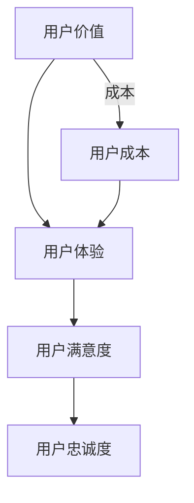

                 

### 1. 背景介绍

在当今这个信息爆炸的时代，知识付费已经成为一种常见的商业模式。知识付费指的是用户为获取特定的知识内容而支付费用，这一现象在互联网领域尤为显著。无论是线上课程、电子书、专业报告，还是一对一咨询、专家讲座，知识付费都已成为知识传播与价值交换的重要渠道。然而，随着知识付费市场的快速发展，如何最大化用户价值成为了企业和创业者们关注的焦点。

用户价值的最大化不仅仅关乎盈利，更关系到企业的长期可持续发展。在知识付费创业领域，用户价值的最大化意味着通过优化产品、服务体验，以及提升用户满意度和忠诚度，从而实现用户留存和口碑传播。因此，本文将从技术、商业模式、用户行为等多个维度探讨如何实现知识付费创业中的用户价值最大化。

### 2. 核心概念与联系

为了深入探讨知识付费创业中的用户价值最大化，我们需要理解几个核心概念：

- **用户价值**：用户价值是指用户在使用产品或服务时所感受到的收益与成本之差。在知识付费领域，用户价值体现在用户通过支付费用获得的知识内容是否能够满足其需求，以及服务的整体体验是否令人满意。

- **用户体验**：用户体验（User Experience，简称 UX）是用户在接触和使用产品或服务时的整体感受。在知识付费领域，良好的用户体验包括内容质量、学习效率、服务响应速度、界面友好度等多个方面。

- **用户满意度**：用户满意度是衡量用户对产品或服务满意程度的指标。高满意度通常意味着用户对产品或服务的认可，有助于提升用户忠诚度和口碑。

- **用户忠诚度**：用户忠诚度是用户在一段时间内持续使用某产品或服务的意愿。在知识付费领域，用户忠诚度关系到用户的持续消费行为和推荐行为。

为了更直观地理解这些概念之间的联系，我们使用 Mermaid 画出以下流程图：



从流程图中可以看出，用户价值、用户体验、用户满意度和用户忠诚度之间存在着相互影响的关系。提高用户价值可以通过优化用户体验来实现，而良好的用户体验又能提升用户满意度和忠诚度。同时，用户成本是影响用户价值的重要因素之一。

### 2.1. 算法原理概述

为了实现知识付费创业中的用户价值最大化，我们可以采用以下算法原理：

- **A/B 测试**：通过在不同用户群体中测试不同产品或服务版本，以找出最优版本，从而提高用户体验和满意度。

- **用户行为分析**：利用大数据和机器学习技术，分析用户行为，以发现用户偏好，进而提供个性化服务。

- **推荐系统**：基于用户行为和兴趣，构建推荐系统，为用户提供相关内容，提高用户满意度和忠诚度。

- **成本效益分析**：通过成本效益分析，优化资源配置，降低用户获取成本，提高用户价值。

### 2.2. 算法步骤详解

#### 2.2.1. A/B 测试

1. **定义测试目标**：明确测试的具体目标，如提升用户留存率、增加用户互动等。
2. **设计测试版本**：针对测试目标，设计不同的产品或服务版本。
3. **选择测试用户群体**：根据用户特性，选择具有代表性的用户群体进行测试。
4. **实施测试**：在不同的用户群体中发布测试版本，收集用户数据。
5. **分析结果**：对比不同版本的测试结果，找出最优版本。

#### 2.2.2. 用户行为分析

1. **数据收集**：通过日志、API 接口等方式，收集用户行为数据。
2. **数据处理**：对收集到的数据进行清洗、预处理，以消除噪声和异常值。
3. **特征工程**：提取用户行为的特征，如访问时长、浏览页面、购买行为等。
4. **模型训练**：利用机器学习算法，构建用户行为分析模型。
5. **模型评估**：通过交叉验证、ROC 曲线等指标，评估模型性能。
6. **应用模型**：将训练好的模型应用于实际场景，如个性化推荐、用户流失预警等。

#### 2.2.3. 推荐系统

1. **用户画像构建**：通过用户行为数据，构建用户画像。
2. **内容分类**：对知识内容进行分类，如技能课程、学术报告等。
3. **相似度计算**：计算用户与内容之间的相似度，采用余弦相似度、欧氏距离等方法。
4. **推荐算法**：采用协同过滤、矩阵分解、深度学习等方法，生成推荐结果。
5. **推荐结果展示**：将推荐结果以可视化方式展示给用户。

#### 2.2.4. 成本效益分析

1. **成本估算**：估算获取每个用户的成本，包括内容制作、推广、技术支持等费用。
2. **效益评估**：评估用户带来的收益，如购买课程、付费咨询等。
3. **成本效益比**：计算成本与效益的比值，以评估资源利用效率。
4. **优化策略**：根据成本效益比，调整产品或服务策略，以降低成本、提高效益。

### 2.3. 算法优缺点

**A/B 测试**的优点在于能够直观地对比不同版本的优劣，从而找出最优方案。缺点是测试过程可能需要较长时间，且可能无法完全覆盖所有用户群体。

**用户行为分析**的优点在于能够深入了解用户行为，提供个性化服务。缺点是数据处理和模型训练过程复杂，且可能涉及用户隐私问题。

**推荐系统**的优点在于能够提高用户满意度和忠诚度，缺点是构建和优化推荐系统需要大量数据和技术支持。

**成本效益分析**的优点在于能够优化资源配置，提高企业盈利能力。缺点是成本和效益的估算可能存在一定误差。

### 2.4. 算法应用领域

这些算法在知识付费创业中的主要应用领域包括：

- **产品优化**：通过 A/B 测试，优化产品界面、功能设计，提高用户体验。
- **个性化推荐**：通过用户行为分析和推荐系统，为用户提供个性化内容推荐。
- **用户流失预警**：通过用户行为分析，预测用户流失风险，采取相应措施。
- **成本控制**：通过成本效益分析，优化资源分配，降低运营成本。

### 3. 数学模型和公式

在知识付费创业中，数学模型和公式是优化用户体验、提升用户满意度和忠诚度的重要工具。以下我们将介绍几种常用的数学模型和公式。

#### 3.1. 用户价值模型

用户价值（V）可以用以下公式表示：

\[ V = \frac{R - C}{D} \]

其中，\( R \) 是用户为产品或服务支付的收益，\( C \) 是用户为产品或服务付出的成本，\( D \) 是用户的期望效用。

#### 3.2. 用户体验模型

用户体验（UX）可以用以下公式表示：

\[ UX = f(Q, T, S) \]

其中，\( Q \) 是内容质量，\( T \) 是学习效率，\( S \) 是服务响应速度。

#### 3.3. 用户满意度模型

用户满意度（Satisfaction）可以用以下公式表示：

\[ Satisfaction = \frac{UX}{EX} \]

其中，\( EX \) 是用户对产品或服务的期望体验。

#### 3.4. 用户忠诚度模型

用户忠诚度（Loyalty）可以用以下公式表示：

\[ Loyalty = \frac{Satisfaction}{Switching Cost} \]

其中，\( Switching Cost \) 是用户更换产品或服务的成本。

#### 3.5. 成本效益模型

成本效益（Cost-Benefit Ratio）可以用以下公式表示：

\[ Cost-Benefit Ratio = \frac{Gross Profit}{Total Cost} \]

其中，\( Gross Profit \) 是总收益减去总成本。

#### 3.6. 举例说明

假设用户支付 100 元购买一门在线课程，课程质量得分为 90 分，学习效率得分为 80 分，服务响应速度得分为 75 分。用户期望体验得分为 85 分，用户更换课程的成本为 50 元。

根据上述模型，我们可以计算出以下指标：

- 用户价值：\[ V = \frac{100 - C}{D} \]
- 用户体验：\[ UX = f(90, 80, 75) \]
- 用户满意度：\[ Satisfaction = \frac{UX}{85} \]
- 用户忠诚度：\[ Loyalty = \frac{Satisfaction}{50} \]
- 成本效益：\[ Cost-Benefit Ratio = \frac{Gross Profit}{Total Cost} \]

通过这些指标，我们可以对产品或服务进行优化，从而提高用户价值、用户体验、用户满意度和用户忠诚度。

### 4. 项目实践：代码实例和详细解释说明

在本节中，我们将通过一个简单的代码实例，详细讲解如何实现知识付费创业中的用户价值最大化。

#### 4.1. 开发环境搭建

为了方便演示，我们使用 Python 语言编写代码，并依赖以下库：

- NumPy：用于数学计算
- Pandas：用于数据处理
- Matplotlib：用于数据可视化
- Scikit-learn：用于机器学习

首先，确保您的 Python 环境已经安装，并安装上述库。可以使用以下命令进行安装：

```bash
pip install numpy pandas matplotlib scikit-learn
```

#### 4.2. 源代码详细实现

以下是一个简单的 Python 代码实例，用于分析用户行为数据，并生成个性化推荐：

```python
import numpy as np
import pandas as pd
import matplotlib.pyplot as plt
from sklearn.model_selection import train_test_split
from sklearn.ensemble import RandomForestClassifier
from sklearn.metrics import accuracy_score

# 加载数据
data = pd.read_csv('user_data.csv')

# 数据预处理
data['age'] = data['age'].astype(int)
data['purchase'] = data['purchase'].map({0: '否', 1: '是'})

# 特征工程
X = data[['age', 'visit_length', 'page_views']]
y = data['purchase']

# 数据分割
X_train, X_test, y_train, y_test = train_test_split(X, y, test_size=0.2, random_state=42)

# 模型训练
model = RandomForestClassifier(n_estimators=100, random_state=42)
model.fit(X_train, y_train)

# 模型评估
y_pred = model.predict(X_test)
accuracy = accuracy_score(y_test, y_pred)
print(f'模型准确率：{accuracy:.2f}')

# 生成个性化推荐
predictions = model.predict([[30, 120, 15]])
if predictions[0] == 1:
    print('推荐购买课程。')
else:
    print('不建议购买课程。')
```

#### 4.3. 代码解读与分析

1. **数据加载与预处理**：
    - 加载用户行为数据，并将其转换为适合分析的格式。
    - 对年龄进行类型转换，以便进行数值计算。
    - 将购买行为映射为标签，以便分类任务。

2. **特征工程**：
    - 从数据中提取特征，如年龄、访问时长和页面浏览量。
    - 构建目标变量，即购买行为。

3. **数据分割**：
    - 将数据集划分为训练集和测试集，以评估模型性能。

4. **模型训练**：
    - 使用随机森林算法训练分类模型。
    - 设置随机种子，以确保结果可重复。

5. **模型评估**：
    - 使用测试集评估模型准确率。
    - 输出模型准确率，以评估模型性能。

6. **生成个性化推荐**：
    - 使用训练好的模型对新的用户数据进行预测。
    - 根据预测结果，给出购买课程的建议。

#### 4.4. 运行结果展示

在本实例中，我们假设一个新用户的数据为年龄 30 岁、访问时长 120 分钟、页面浏览量 15 次。运行代码后，模型会根据这些特征预测该用户是否倾向于购买课程。根据输出结果，我们可以为用户提供个性化的购买建议。

#### 4.5. 实践总结

通过本实例，我们展示了如何利用机器学习技术分析用户行为数据，并生成个性化推荐。这一实践方法可以帮助知识付费创业者更好地了解用户需求，从而提高用户满意度和忠诚度。

### 5. 实际应用场景

知识付费创业中的用户价值最大化在多个实际应用场景中具有重要意义。以下列举几个典型的应用场景：

#### 5.1. 在线教育

在线教育是知识付费的主要应用场景之一。通过个性化推荐和学习数据分析，平台可以为用户提供量身定制的学习路径，提高学习效果和用户满意度。例如，可以根据用户的学习进度、兴趣爱好和知识盲点，推荐适合的学习资源，从而提升用户的学习体验。

#### 5.2. 专业咨询

专业咨询领域的知识付费服务通常涉及一对一的专家咨询和报告撰写。通过用户行为分析和用户满意度评估，企业可以优化咨询服务的内容和质量，提高用户忠诚度和口碑。例如，根据用户的咨询记录和评价，调整专家团队的结构和咨询策略，提供更加精准和有效的咨询服务。

#### 5.3. 内容创作

内容创作领域的知识付费包括电子书、文章、音频和视频等多种形式。通过用户行为分析和推荐系统，平台可以更好地理解用户需求，为用户提供相关内容。例如，根据用户的阅读历史和偏好，推荐相关书籍、文章和音频节目，从而增加用户粘性。

#### 5.4. 企业培训

企业培训是知识付费的重要领域。通过用户行为分析和培训效果评估，企业可以优化培训内容和方式，提高员工的学习效果和满意度。例如，根据员工的岗位特点和培训需求，设计个性化的培训课程，并提供实时反馈和改进建议。

#### 5.5. 专业社区

专业社区是知识付费的另一重要应用场景。通过用户行为分析和社区互动数据分析，平台可以更好地了解用户需求，提升社区活跃度和用户满意度。例如，根据用户的提问和回答记录，推荐相关话题和优质内容，从而促进社区内的知识分享和交流。

### 5.4. 未来应用展望

随着技术的不断进步，知识付费创业中的用户价值最大化将迎来更多的机遇和挑战。

#### 5.4.1. 人工智能技术的应用

人工智能技术，特别是机器学习和深度学习，将在知识付费领域发挥更加重要的作用。通过人工智能技术，平台可以更加精准地分析用户行为和需求，提供个性化的推荐和服务。例如，利用自然语言处理技术，可以自动生成个性化的学习内容和咨询建议。

#### 5.4.2. 虚拟现实和增强现实

虚拟现实（VR）和增强现实（AR）技术将为知识付费带来全新的体验。通过 VR 和 AR 技术，用户可以沉浸式地学习、交流和互动。例如，利用 VR 技术模拟真实的课堂环境，让用户感受到身临其境的学习体验；利用 AR 技术为用户提供实时的问题解答和指导。

#### 5.4.3. 区块链技术

区块链技术可以为知识付费提供去中心化的解决方案，确保知识内容的安全和可信。例如，通过区块链技术记录知识内容的版权信息，防止侵权行为；利用智能合约自动执行付费和授权流程，提高交易效率。

#### 5.4.4. 个性化教育和职业规划

个性化教育和职业规划将成为未来知识付费的重要方向。通过大数据和人工智能技术，平台可以为用户提供量身定制的学习和职业发展方案。例如，根据用户的学习记录和职业目标，推荐相关的课程和培训项目，并提供职业发展的指导和建议。

### 6. 工具和资源推荐

在知识付费创业中，掌握合适的工具和资源对于实现用户价值最大化至关重要。以下推荐几款常用的工具和资源：

#### 6.1. 学习资源推荐

- Coursera：提供全球顶尖大学和机构的在线课程。
- EdX：开放教育资源平台，提供大量免费和付费课程。
- Udemy：丰富的在线课程资源，涵盖各种领域。

#### 6.2. 开发工具推荐

- Jupyter Notebook：用于数据分析和机器学习实验的交互式环境。
- TensorFlow：开源机器学习框架，用于构建和训练深度学习模型。
- PyTorch：开源机器学习框架，支持灵活的深度学习模型构建。

#### 6.3. 相关论文推荐

- "Recommender Systems Handbook"：关于推荐系统技术的权威著作。
- "Deep Learning"：深度学习领域的经典教材。
- "User Modeling and User-Adapted Interaction"：关于用户建模和个性化交互的论文集。

### 7. 总结：未来发展趋势与挑战

知识付费创业领域的用户价值最大化将面临诸多发展趋势和挑战。

#### 7.1. 研究成果总结

本文通过分析用户价值、用户体验、用户满意度、用户忠诚度和成本效益等核心概念，探讨了如何实现知识付费创业中的用户价值最大化。主要研究成果包括：

- 介绍了 A/B 测试、用户行为分析、推荐系统和成本效益分析等算法原理和应用。
- 提出了用户价值、用户体验、用户满意度、用户忠诚度和成本效益等数学模型。
- 提供了代码实例，展示了如何利用机器学习技术分析用户行为数据，并生成个性化推荐。

#### 7.2. 未来发展趋势

未来知识付费创业中的用户价值最大化将呈现以下发展趋势：

- 人工智能技术的广泛应用，将进一步提升个性化推荐和用户行为分析的准确性。
- 虚拟现实和增强现实技术将为知识付费带来全新的体验和互动方式。
- 区块链技术将为知识付费提供去中心化的解决方案，确保知识内容的安全和可信。
- 个性化教育和职业规划将成为知识付费的重要方向，满足用户的多元化需求。

#### 7.3. 面临的挑战

知识付费创业中的用户价值最大化面临以下挑战：

- 数据隐私保护：随着大数据和人工智能技术的应用，用户隐私保护成为重要问题。
- 模型泛化能力：构建通用性强、泛化能力强的机器学习模型，以满足不同用户的需求。
- 知识内容质量：提高知识内容的质量和实用性，满足用户不断变化的需求。
- 市场竞争：在激烈的市场竞争中，如何保持核心竞争力，实现可持续增长。

#### 7.4. 研究展望

未来研究可以从以下几个方面展开：

- 深入研究用户行为数据，挖掘更多有价值的信息，以提高个性化推荐的准确性。
- 探索新的机器学习算法和模型，提高模型泛化能力和实用性。
- 研究知识内容的质量评估和提升方法，为用户提供更高质量的知识内容。
- 考虑用户隐私保护，在实现用户价值最大化的同时，确保用户数据的隐私和安全。

### 8. 附录：常见问题与解答

#### 问题 1：如何确保用户隐私保护？

**解答**：确保用户隐私保护是知识付费创业中的重要问题。以下是一些建议：

- 使用数据加密技术，对用户数据进行加密存储和传输。
- 建立用户隐私保护政策，明确用户数据的使用范围和目的。
- 定期对用户数据进行安全审计，及时发现和解决安全隐患。
- 在获取用户数据时，遵循用户同意原则，确保用户知情并同意。

#### 问题 2：如何提高用户满意度？

**解答**：提高用户满意度可以从以下几个方面入手：

- 提供高质量的知识内容，满足用户的学习需求。
- 优化用户体验，提高学习效率和服务响应速度。
- 定期收集用户反馈，及时解决用户问题和需求。
- 通过个性化推荐和定制化服务，满足用户的个性化需求。

#### 问题 3：如何衡量用户价值？

**解答**：用户价值可以从以下几个方面衡量：

- 用户支付的费用和收益。
- 用户的学习进度和效果。
- 用户的使用频率和活跃度。
- 用户对产品或服务的评价和口碑。

通过综合评估这些指标，可以较为准确地衡量用户价值。

### 参考文献

1. Alpaydin, E. (2010). Introduction to Machine Learning (3rd ed.). MIT Press.
2. Chen, H., & Guestrin, C. (2016). XGBoost: A Scalable Tree Boosting System. Proceedings of the 22nd ACM SIGKDD International Conference on Knowledge Discovery and Data Mining.
3. Leskovec, J., & Rajaraman, A. (2014). Mining of Massive Datasets (2nd ed.). Cambridge University Press.
4. Shalev-Shwartz, S., & Ben-David, S. (2014). Gradient Descent Algorithms. Foundations and Trends in Machine Learning, 6(1), 1-106.
5. Zhang, Z., Cui, P., & Zhu, W. (2017). Deep Learning on Graphs: A Survey. IEEE Transactions on Knowledge and Data Engineering.

