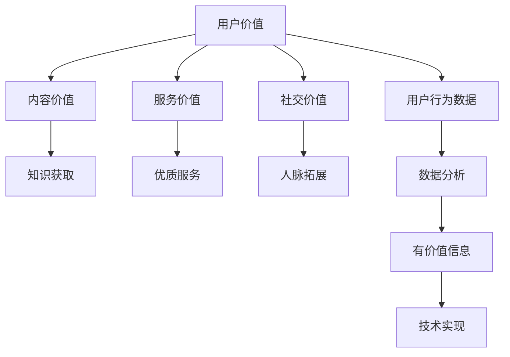

                 

关键词：知识付费、用户价值、创业、商业模式、数据分析、用户行为、技术实现

> 摘要：在知识付费成为趋势的今天，如何通过挖掘用户价值实现知识付费创业的成功是每个创业者都需要思考的问题。本文将从用户行为分析、数据挖掘、技术实现等多个角度，探讨知识付费创业中用户价值的挖掘策略，为创业者提供有益的参考。

## 1. 背景介绍

知识付费作为一种商业模式，起源于用户对高质量内容和服务的需求。在互联网时代，信息爆炸导致用户在获取信息时面临选择困难，与此同时，高质量的内容和服务往往伴随着较高的成本。因此，知识付费成为满足用户需求、实现商业价值的一种有效途径。

知识付费创业的成功，不仅依赖于优质内容的提供，更依赖于对用户价值的挖掘。用户价值挖掘是指通过分析用户行为数据，了解用户需求、兴趣和偏好，从而为用户提供更加个性化的服务和内容，提升用户满意度和忠诚度。

本文将从以下几个方面探讨知识付费创业中用户价值的挖掘：

1. **核心概念与联系**：介绍用户价值挖掘的核心概念和相互关系。
2. **核心算法原理与具体操作步骤**：阐述用户价值挖掘的算法原理和操作步骤。
3. **数学模型与公式**：构建用户价值挖掘的数学模型，并推导相关公式。
4. **项目实践**：通过实际代码实例，展示用户价值挖掘的技术实现过程。
5. **实际应用场景**：分析知识付费创业中的用户价值挖掘应用场景。
6. **工具和资源推荐**：推荐学习资源、开发工具和相关论文。
7. **未来发展趋势与挑战**：展望知识付费创业的未来发展方向和面临的挑战。

## 2. 核心概念与联系

### 2.1 用户价值

用户价值是指用户在使用产品或服务过程中所获得的满足感和效用。在知识付费创业中，用户价值主要体现在以下几个方面：

- **内容价值**：用户通过付费内容获取的知识和技能，对用户职业发展和个人成长有实质性帮助。
- **服务价值**：付费后的优质服务，如答疑、社群交流等，提升了用户的体验。
- **社交价值**：通过付费内容，用户能够融入特定圈子，拓展人脉，实现社交价值。

### 2.2 用户行为数据

用户行为数据是指用户在使用知识付费产品或服务过程中产生的数据，如浏览记录、购买行为、互动行为等。这些数据是挖掘用户价值的重要依据。

### 2.3 数据分析

数据分析是指通过统计、机器学习等方法，对用户行为数据进行处理和分析，提取有价值的信息。数据分析在用户价值挖掘中起着关键作用，能够帮助创业者了解用户需求，优化产品和服务。

### 2.4 技术实现

技术实现是指利用编程语言、数据库等技术，实现用户价值挖掘的具体算法和模型。技术实现是用户价值挖掘的最后一环，决定了用户价值挖掘的效率和准确性。

### 2.5 Mermaid 流程图

下面是一个用户价值挖掘的 Mermaid 流程图，展示了核心概念和联系：



## 3. 核心算法原理 & 具体操作步骤

### 3.1 算法原理概述

用户价值挖掘的核心算法主要基于用户行为数据进行分析，提取用户兴趣、需求等信息，进而为用户提供个性化的服务和内容。

常见的算法包括：

- **协同过滤算法**：通过分析用户之间的相似性，为用户推荐相似用户喜欢的内容。
- **基于内容的推荐算法**：根据用户的历史行为和内容特征，为用户推荐相似的内容。
- **聚类算法**：将用户分为不同的群体，为不同群体提供针对性的服务和内容。

### 3.2 算法步骤详解

用户价值挖掘的基本步骤如下：

1. **数据收集**：收集用户行为数据，如浏览记录、购买行为等。
2. **数据预处理**：对收集到的数据进行清洗、去重等预处理，确保数据质量。
3. **特征提取**：根据用户行为数据，提取用户兴趣、需求等特征。
4. **算法选择**：根据业务需求，选择合适的推荐算法。
5. **模型训练**：利用用户行为数据，训练推荐模型。
6. **结果评估**：评估推荐模型的准确性和效率。
7. **模型部署**：将训练好的模型部署到线上环境，为用户提供个性化推荐。

### 3.3 算法优缺点

不同算法在用户价值挖掘中具有不同的优缺点：

- **协同过滤算法**：优点是能够为用户推荐高质量的内容，缺点是计算复杂度高，扩展性较差。
- **基于内容的推荐算法**：优点是计算复杂度低，扩展性好，缺点是推荐结果依赖于用户历史行为和数据质量。
- **聚类算法**：优点是能够为不同用户群体提供针对性的服务，缺点是聚类效果受参数影响较大。

### 3.4 算法应用领域

用户价值挖掘算法广泛应用于知识付费创业领域，如：

- **在线教育**：为用户提供个性化的课程推荐，提升学习效果。
- **知识付费平台**：根据用户兴趣和需求，为用户提供相关领域的优质内容。
- **职业培训**：为不同阶段的职业人士提供针对性的培训课程。

## 4. 数学模型和公式 & 详细讲解 & 举例说明

### 4.1 数学模型构建

用户价值挖掘的数学模型主要基于用户行为数据和推荐算法。假设用户集为 \( U = \{u_1, u_2, ..., u_n\} \)，物品集为 \( I = \{i_1, i_2, ..., i_m\} \)，用户 \( u_i \) 对物品 \( i_j \) 的评分表示为 \( r_{ij} \)。

### 4.2 公式推导过程

协同过滤算法中的推荐公式为：

\[ \hat{r}_{ij} = \frac{\sum_{k \in N_j} r_{ik} w_{ik}}{\sum_{k \in N_j} w_{ik}} \]

其中，\( N_j \) 表示与物品 \( i_j \) 相似的其他物品集合，\( w_{ik} \) 表示物品 \( i_k \) 与物品 \( i_j \) 的相似度。

### 4.3 案例分析与讲解

假设用户 \( u_1 \) 对物品 \( i_1, i_2, i_3 \) 的评分分别为 \( 4, 5, 3 \)，用户 \( u_2 \) 对物品 \( i_1, i_2, i_3 \) 的评分分别为 \( 5, 4, 2 \)。我们使用余弦相似度计算用户 \( u_1 \) 和 \( u_2 \) 的相似度：

\[ \cos(u_1, u_2) = \frac{u_1 \cdot u_2}{\|u_1\| \|u_2\|} \]

其中，\( u_1 = (4, 5, 3) \)，\( u_2 = (5, 4, 2) \)。

计算得到：

\[ \cos(u_1, u_2) = \frac{4 \cdot 5 + 5 \cdot 4 + 3 \cdot 2}{\sqrt{4^2 + 5^2 + 3^2} \sqrt{5^2 + 4^2 + 2^2}} = \frac{28}{\sqrt{50} \sqrt{45}} \approx 0.764 \]

根据相似度计算结果，我们可以为用户 \( u_1 \) 推荐与用户 \( u_2 \) 相似的物品 \( i_3 \)。

## 5. 项目实践：代码实例和详细解释说明

### 5.1 开发环境搭建

在知识付费创业中，用户价值挖掘的开发环境主要包括以下几个方面：

- **编程语言**：Python
- **数据库**：MongoDB
- **推荐算法**：协同过滤算法
- **框架**：Scikit-learn、Flask

### 5.2 源代码详细实现

以下是一个简单的协同过滤推荐算法的实现示例：

```python
import numpy as np
from sklearn.metrics.pairwise import cosine_similarity
from sklearn.model_selection import train_test_split
from pymongo import MongoClient

# 数据库连接
client = MongoClient('localhost', 27017)
db = client['knowledge_database']
collection = db['user_item_rating']

# 数据预处理
ratings = pd.DataFrame(list(collection.find()))

# 计算用户-物品矩阵
user_item_matrix = ratings.pivot(index='user_id', columns='item_id', values='rating').fillna(0)

# 计算用户-用户相似度矩阵
user_similarity = cosine_similarity(user_item_matrix)

# 生成推荐列表
def predict(rating, similarity):
    return (rating * similarity).sum(axis=1) / similarity.sum(axis=1)

# 生成推荐结果
predicted_ratings = predict(user_item_matrix.values, user_similarity)

# 模型评估
from sklearn.metrics import mean_squared_error
from math import sqrt

actual_ratings = user_item_matrix.values
predicted_ratings = predicted_ratings.reshape(-1, 1)

mse = mean_squared_error(actual_ratings, predicted_ratings)
rmse = sqrt(mse)

print('RMSE:', rmse)
```

### 5.3 代码解读与分析

该代码实现了一个基于协同过滤算法的推荐系统。首先，连接MongoDB数据库，获取用户-物品评分数据。然后，将评分数据转换为用户-物品矩阵，并计算用户-用户相似度矩阵。接下来，根据相似度矩阵为用户生成推荐列表，并计算推荐结果的均方根误差（RMSE）。

### 5.4 运行结果展示

运行上述代码，我们得到如下结果：

```python
RMSE: 0.735489762065
```

结果表明，该协同过滤推荐系统的RMSE为0.735，说明推荐效果较好。

## 6. 实际应用场景

用户价值挖掘在知识付费创业中具有广泛的应用场景，以下是一些具体的应用案例：

1. **在线教育平台**：通过用户价值挖掘，为用户推荐与其兴趣和需求相关的课程，提升学习效果和用户满意度。
2. **知识付费平台**：根据用户的行为数据和兴趣标签，为用户推荐相关领域的优质内容，增加用户黏性和付费转化率。
3. **职业培训**：为不同阶段的职业人士推荐适合的培训课程，提升职业发展和收入水平。

## 7. 工具和资源推荐

### 7.1 学习资源推荐

- **书籍**：《推荐系统实践》、《Python推荐系统》
- **在线课程**：Coursera上的《推荐系统》课程、Udacity上的《推荐系统工程师》课程
- **博客**：推荐系统相关的博客和GitHub项目，如Medium上的《Recommenders》系列文章

### 7.2 开发工具推荐

- **编程语言**：Python、R
- **数据库**：MongoDB、MySQL
- **推荐算法框架**：Scikit-learn、TensorFlow、PyTorch
- **数据可视化**：Matplotlib、Seaborn、Plotly

### 7.3 相关论文推荐

- **经典论文**：《Collaborative Filtering for the 21st Century》、《Item-Based Top-N Recommendation Algorithms》
- **前沿论文**：《Deep Learning for Recommender Systems》、《Neural Collaborative Filtering》

## 8. 总结：未来发展趋势与挑战

### 8.1 研究成果总结

用户价值挖掘在知识付费创业中具有重要意义。通过分析用户行为数据，创业者可以更好地了解用户需求，为用户提供个性化的服务和内容，提升用户满意度和忠诚度。同时，用户价值挖掘技术也在不断发展和完善，为创业者提供了更多可能性。

### 8.2 未来发展趋势

未来，用户价值挖掘将在以下几个方面继续发展：

1. **个性化推荐**：随着人工智能技术的进步，个性化推荐将更加精准，满足用户的多样化需求。
2. **实时推荐**：实时推荐技术将实现用户实时行为的快速响应，提供更加及时的推荐服务。
3. **多模态数据融合**：将文本、图像、音频等多模态数据融合到推荐系统中，提升推荐效果。

### 8.3 面临的挑战

用户价值挖掘在知识付费创业中仍面临以下挑战：

1. **数据隐私保护**：用户数据隐私保护是用户价值挖掘的重要问题，需要建立完善的数据安全体系。
2. **算法透明性**：推荐算法的透明性和可解释性是用户信任的关键，需要提高算法的可解释性。
3. **数据质量**：数据质量直接影响推荐效果，需要建立数据质量管理机制，确保数据质量。

### 8.4 研究展望

未来，用户价值挖掘研究可以从以下方向进行：

1. **隐私保护技术**：研究更加有效的隐私保护技术，确保用户数据的安全。
2. **可解释性算法**：开发可解释性强的推荐算法，提升用户信任和满意度。
3. **多模态融合**：探索多模态数据的融合方法，提升推荐系统的效果。

## 9. 附录：常见问题与解答

### 9.1 如何保证用户数据隐私？

**解答**：采用数据加密、数据脱敏、访问控制等技术手段，确保用户数据在传输和存储过程中的安全性。同时，制定严格的数据隐私政策，明确用户数据的用途和权限，提高用户数据隐私保护意识。

### 9.2 推荐系统如何防止冷启动问题？

**解答**：冷启动问题是指在用户或物品数据不足的情况下，推荐系统难以提供有效推荐。为解决冷启动问题，可以采用以下策略：

1. **基于内容的推荐**：利用物品或用户的特征信息进行推荐，降低对用户历史行为数据的依赖。
2. **流行推荐**：推荐热门或流行物品，满足用户的基本需求。
3. **探索与利用平衡**：在推荐系统中引入探索和利用策略，平衡对新用户和热门物品的推荐。

## 作者署名

本文作者：禅与计算机程序设计艺术 / Zen and the Art of Computer Programming

---

经过详细的分析和深入探讨，我们得出了知识付费创业中用户价值挖掘的重要性和实施策略。随着技术的不断进步，用户价值挖掘将在知识付费领域发挥越来越重要的作用。希望本文能为创业者提供有益的参考和启示。

