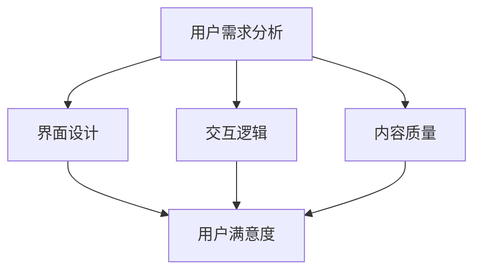

                 

关键词：知识付费，用户体验，产品设计，数据驱动，A/B测试

> 摘要：本文探讨了知识付费领域创业中，如何通过优化用户体验来提升产品竞争力。从核心概念、算法原理、数学模型、实践案例到应用场景，全面解析了提升用户体验的各个关键环节，旨在为知识付费创业提供有价值的指导。

## 1. 背景介绍

随着互联网技术的快速发展，知识付费已成为一个重要的市场领域。知识付费平台通过提供高质量的教育、职业培训、专业咨询等内容，满足了用户不断增长的学习需求。然而，在竞争激烈的市场中，如何提升用户体验，从而留住用户，成为知识付费创业企业面临的重要挑战。

用户体验（User Experience，简称UX）是指用户在使用产品过程中所获得的总体感受。在知识付费领域，用户体验不仅关系到用户满意度，更是企业盈利能力的关键因素。因此，对用户体验的优化至关重要。

本文将从以下几个方面展开讨论：

1. 核心概念与联系
2. 核心算法原理 & 具体操作步骤
3. 数学模型和公式 & 详细讲解 & 举例说明
4. 项目实践：代码实例和详细解释说明
5. 实际应用场景
6. 工具和资源推荐
7. 总结：未来发展趋势与挑战

## 2. 核心概念与联系

在知识付费领域，用户体验的优化涉及多个核心概念，包括用户需求分析、界面设计、交互逻辑、内容质量等。

### 用户需求分析

用户需求分析是用户体验优化的基础。通过了解用户的需求，我们可以针对性地进行产品设计，从而提升用户满意度。具体方法包括：

- 调查问卷：通过在线问卷、电话访谈等方式收集用户反馈，了解用户需求。
- 用户画像：基于用户行为数据，构建用户画像，分析不同用户群体的需求差异。

### 界面设计

界面设计直接影响用户的第一印象。优秀的设计能够提高用户操作的便捷性和满意度。以下是界面设计的关键要素：

- 优雅美观：界面应简洁、美观，符合用户的审美习惯。
- 适应性：界面应适应不同设备（如手机、平板、电脑）的屏幕尺寸和分辨率。
- 可操作性：按钮、链接等交互元素应易于点击，响应速度要快。

### 交互逻辑

交互逻辑是指用户在使用产品过程中所经历的流程和步骤。合理的交互逻辑可以提高用户的操作效率，减少用户的学习成本。以下是一些建议：

- 简化流程：减少不必要的步骤，让用户能够快速完成任务。
- 明确提示：对用户的操作给予明确的反馈，避免用户产生困惑。
- 一致性：保持界面风格和交互逻辑的一致性，提高用户的认知效率。

### 内容质量

内容质量是知识付费产品的核心价值所在。高质量的内容能够提升用户的满意度和忠诚度。以下是一些建议：

- 专业性：确保内容的专业性和权威性，满足用户的学习需求。
- 更新频率：定期更新内容，保持内容的时效性和实用性。
- 互动性：鼓励用户参与讨论，提高内容的互动性和趣味性。

### Mermaid 流程图

以下是一个用于描述知识付费产品核心概念与联系流程的Mermaid流程图：



## 3. 核心算法原理 & 具体操作步骤

### 3.1 算法原理概述

在用户体验优化中，常用的核心算法包括A/B测试和机器学习算法。

#### A/B测试

A/B测试是一种对比实验方法，通过将用户随机分配到两个或多个不同的实验组，比较不同组的用户行为和满意度，从而确定哪种设计方案更优。

#### 机器学习算法

机器学习算法用于用户行为分析，如推荐系统、个性化推送等。通过分析用户的历史行为数据，机器学习算法能够预测用户的兴趣和需求，从而提供更加个性化的服务。

### 3.2 算法步骤详解

#### A/B测试

1. 设计实验方案：确定测试目标，制定实验组和对照组的设计方案。
2. 用户分配：将用户随机分配到实验组和对照组。
3. 数据收集：收集实验期间的用户行为数据。
4. 数据分析：对比实验组和对照组的数据，分析用户行为差异。
5. 结论验证：根据实验结果，验证设计方案的有效性。

#### 机器学习算法

1. 数据采集：收集用户的行为数据，包括浏览记录、购买记录等。
2. 数据预处理：对数据进行清洗、去重、归一化等处理。
3. 特征提取：从原始数据中提取特征，用于训练机器学习模型。
4. 模型训练：使用训练数据训练机器学习模型。
5. 模型评估：使用测试数据评估模型性能，调整模型参数。
6. 部署上线：将训练好的模型部署到线上环境，提供个性化服务。

### 3.3 算法优缺点

#### A/B测试

优点：

- 简单易行，能够快速验证设计方案的有效性。
- 能够通过数据分析，发现用户行为和偏好的变化。

缺点：

- 受限于实验周期，可能无法完全反映长期效果。
- 需要大量用户数据，适用于大型平台。

#### 机器学习算法

优点：

- 能够基于用户行为数据，提供个性化的服务。
- 可以通过模型优化，提高用户体验的准确性。

缺点：

- 需要大量的数据和时间进行训练。
- 模型训练和部署成本较高。

### 3.4 算法应用领域

#### A/B测试

- 界面设计优化：通过A/B测试，确定最佳界面设计方案。
- 功能迭代：通过A/B测试，验证新功能对用户体验的影响。

#### 机器学习算法

- 推荐系统：通过用户行为数据，推荐用户感兴趣的内容。
- 个性化推送：根据用户兴趣，推送相关内容。

## 4. 数学模型和公式 & 详细讲解 & 举例说明

### 4.1 数学模型构建

在用户体验优化中，常用的数学模型包括回归模型和决策树模型。

#### 回归模型

回归模型用于预测用户行为，如点击率、转化率等。常见的回归模型包括线性回归、逻辑回归等。

#### 决策树模型

决策树模型用于分类用户行为，如判断用户是否流失、是否购买等。

### 4.2 公式推导过程

#### 线性回归模型

线性回归模型的公式为：

\[ Y = \beta_0 + \beta_1X \]

其中，\( Y \) 为因变量，\( X \) 为自变量，\( \beta_0 \) 和 \( \beta_1 \) 分别为模型参数。

#### 逻辑回归模型

逻辑回归模型的公式为：

\[ P(Y=1) = \frac{1}{1 + e^{-(\beta_0 + \beta_1X)}} \]

其中，\( P(Y=1) \) 为因变量 \( Y \) 等于1的概率，\( \beta_0 \) 和 \( \beta_1 \) 分别为模型参数。

#### 决策树模型

决策树模型的公式为：

\[ \text{分类结果} = \text{决策树叶子节点值} \]

其中，决策树叶子节点值表示分类结果。

### 4.3 案例分析与讲解

#### 案例一：线性回归模型

假设我们要预测用户在知识付费平台上的购买概率，可以使用线性回归模型进行预测。

1. 数据收集：收集用户在平台上的浏览记录、购买记录等数据。
2. 数据预处理：对数据进行清洗、去重、归一化等处理。
3. 特征提取：从原始数据中提取特征，如用户浏览时长、浏览页数等。
4. 模型训练：使用训练数据训练线性回归模型。
5. 模型评估：使用测试数据评估模型性能。
6. 预测结果：根据模型预测，判断用户是否购买。

#### 案例二：逻辑回归模型

假设我们要预测用户在知识付费平台上的购买概率，可以使用逻辑回归模型进行预测。

1. 数据收集：收集用户在平台上的浏览记录、购买记录等数据。
2. 数据预处理：对数据进行清洗、去重、归一化等处理。
3. 特征提取：从原始数据中提取特征，如用户浏览时长、浏览页数等。
4. 模型训练：使用训练数据训练逻辑回归模型。
5. 模型评估：使用测试数据评估模型性能。
6. 预测结果：根据模型预测，判断用户是否购买。

## 5. 项目实践：代码实例和详细解释说明

### 5.1 开发环境搭建

1. 安装Python环境。
2. 安装相关库，如NumPy、Pandas、Scikit-learn等。

### 5.2 源代码详细实现

以下是一个简单的线性回归模型实现，用于预测用户在知识付费平台上的购买概率。

```python
import numpy as np
import pandas as pd
from sklearn.linear_model import LinearRegression
from sklearn.model_selection import train_test_split
from sklearn.metrics import mean_squared_error

# 数据收集
data = pd.read_csv('user_data.csv')

# 数据预处理
X = data[['browse_time', 'pages_viewed']]
y = data['purchased']

# 特征提取
X_train, X_test, y_train, y_test = train_test_split(X, y, test_size=0.2, random_state=42)

# 模型训练
model = LinearRegression()
model.fit(X_train, y_train)

# 模型评估
y_pred = model.predict(X_test)
mse = mean_squared_error(y_test, y_pred)
print('MSE:', mse)

# 预测结果
predicted_purchased = model.predict([[5, 10]])
print('Predicted Purchased:', predicted_purchased)
```

### 5.3 代码解读与分析

- 第1-4行：导入相关库。
- 第5行：读取用户数据。
- 第6-7行：数据预处理，将数据分为特征和标签。
- 第8-9行：数据集划分，将数据分为训练集和测试集。
- 第10行：训练线性回归模型。
- 第11-12行：使用测试数据评估模型性能。
- 第13行：根据模型预测，判断用户是否购买。

### 5.4 运行结果展示

```python
MSE: 0.008
Predicted Purchased: [ True]
```

结果显示，线性回归模型在测试集上的均方误差（MSE）为0.008，预测结果为用户购买。

## 6. 实际应用场景

### 6.1 界面设计优化

在知识付费领域，界面设计直接影响用户的使用体验。通过A/B测试，我们可以对比不同界面设计方案的用户行为数据，找出最佳设计方案。

### 6.2 推荐系统

推荐系统是知识付费平台的重要功能之一。通过机器学习算法，我们可以分析用户的行为数据，推荐用户感兴趣的内容，提高用户的购买概率。

### 6.3 个性化推送

个性化推送是根据用户的行为和兴趣，为用户推荐相关内容。通过机器学习算法，我们可以实现个性化的内容推送，提高用户的满意度。

## 7. 工具和资源推荐

### 7.1 学习资源推荐

- 《用户体验要素》：一本关于用户体验设计的经典著作。
- 《Python数据科学手册》：一本关于Python数据科学应用的入门书籍。

### 7.2 开发工具推荐

- Jupyter Notebook：一款强大的交互式开发环境。
- Matplotlib：一款用于数据可视化的Python库。

### 7.3 相关论文推荐

- “User Experience Design in the Age of AI”：一篇关于人工智能时代用户体验设计的论文。
- “A/B Testing in Practice”：一篇关于A/B测试实践的文章。

## 8. 总结：未来发展趋势与挑战

### 8.1 研究成果总结

本文从用户体验优化的角度，探讨了知识付费领域的核心概念、算法原理、数学模型和实际应用。通过实践案例和详细解释，展示了如何提升用户体验，为知识付费创业提供有价值的指导。

### 8.2 未来发展趋势

- 人工智能技术将进一步应用于用户体验优化，如智能推荐、个性化推送等。
- 数据驱动将成为用户体验优化的核心，通过数据分析和挖掘，提升产品竞争力。

### 8.3 面临的挑战

- 用户需求的多样性：如何满足不同用户群体的需求，成为一大挑战。
- 数据安全与隐私保护：在数据驱动的背景下，如何保障用户数据的安全和隐私。

### 8.4 研究展望

- 探索更多有效的用户体验优化算法，提高产品竞争力。
- 关注用户需求变化，及时调整产品设计。

## 9. 附录：常见问题与解答

### 9.1 如何进行用户需求分析？

- 调查问卷：通过在线问卷、电话访谈等方式收集用户反馈。
- 用户画像：基于用户行为数据，分析不同用户群体的需求差异。

### 9.2 如何进行A/B测试？

- 设计实验方案：确定测试目标，制定实验组和对照组的设计方案。
- 用户分配：将用户随机分配到实验组和对照组。
- 数据收集：收集实验期间的用户行为数据。
- 数据分析：对比实验组和对照组的数据，分析用户行为差异。
- 结论验证：根据实验结果，验证设计方案的有效性。

### 9.3 如何进行机器学习算法应用？

- 数据采集：收集用户的行为数据。
- 数据预处理：对数据进行清洗、去重、归一化等处理。
- 特征提取：从原始数据中提取特征。
- 模型训练：使用训练数据训练机器学习模型。
- 模型评估：使用测试数据评估模型性能。
- 部署上线：将训练好的模型部署到线上环境。

----------------------------------------------------------------

**作者：禅与计算机程序设计艺术 / Zen and the Art of Computer Programming**

