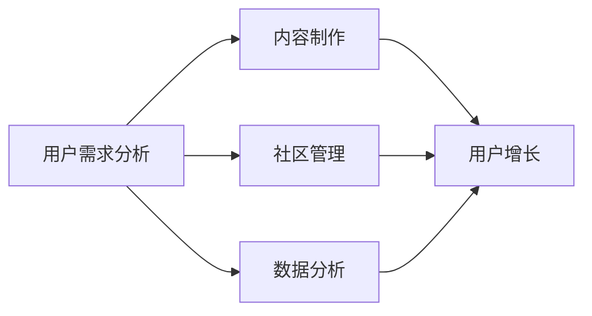

                 

在知识付费风潮席卷各行各业的当下，如何打造一款具备竞争力、能够持续吸引用户并实现盈利的知识付费产品，成为了许多创业者关注的焦点。用户运营作为知识付费平台的核心环节，其策略的制定和实施直接影响到平台的用户增长、留存和转化。本文将结合IT领域的专业知识和实战经验，深入探讨知识付费创业中的用户运营策略。

## 关键词

- 知识付费
- 用户运营
- 创业
- IT领域
- 数据分析
- 社区管理
- 用户增长

## 摘要

本文旨在为知识付费创业者提供一套系统的用户运营策略。文章将从用户需求分析、内容制作、社区管理、数据分析、用户增长五个方面，结合IT领域的实际案例，详细阐述用户运营的各个环节，帮助创业者构建一套高效、可持续的用户运营体系。

### 1. 背景介绍

知识付费作为一种新型商业模式，源于用户对知识获取的强烈需求。随着互联网的普及和信息爆炸，用户渴望从繁杂的信息中筛选出有价值的内容。知识付费平台的出现，为用户提供了系统化、专业化的学习资源，同时也为内容创作者提供了变现的途径。然而，知识付费市场竞争激烈，如何吸引用户、提高用户留存率和转化率，成为了创业者的核心挑战。

### 2. 核心概念与联系

为了更好地理解用户运营策略，我们需要明确几个核心概念，并绘制一个简明的 Mermaid 流程图来展示它们之间的联系。

#### 2.1 核心概念

- 用户需求分析
- 内容制作
- 社区管理
- 数据分析
- 用户增长

#### 2.2 Mermaid 流程图



#### 2.3 概述

用户需求分析是用户运营的起点，通过数据分析了解用户偏好和需求，从而制作出符合用户期待的内容。内容制作是用户运营的核心，优质的内容是吸引用户的基础。社区管理则通过构建活跃的社群，增强用户的归属感和参与感。数据分析贯穿于用户运营的各个环节，为决策提供数据支持。用户增长是用户运营的目标，通过上述环节的协同作用，实现用户数量的持续增长。

### 3. 核心算法原理 & 具体操作步骤

#### 3.1 算法原理概述

用户运营的核心算法原理主要包括以下几个方面：

- 用户画像构建：通过数据分析技术，对用户行为、偏好进行深度挖掘，构建用户画像。
- 内容推荐算法：基于用户画像，运用推荐算法，将个性化内容推送给用户。
- 社区活跃度分析：通过计算社群互动频率、用户参与度等指标，评估社区活跃度。
- 用户留存预测：利用机器学习算法，预测用户的留存概率，为运营策略调整提供依据。

#### 3.2 算法步骤详解

##### 3.2.1 用户需求分析

1. 数据收集：通过用户注册信息、浏览记录、购买行为等数据，收集用户信息。
2. 数据清洗：对收集到的数据去重、填充缺失值，保证数据质量。
3. 特征工程：提取用户行为、偏好等特征，构建用户画像。

##### 3.2.2 内容制作

1. 内容定位：根据用户画像，确定内容主题和风格。
2. 内容审核：确保内容质量，符合平台规范。
3. 内容发布：通过推送、社区分享等方式，将内容推送给用户。

##### 3.2.3 社区管理

1. 活动策划：定期举办线上活动，提升社区活跃度。
2. 用户激励：通过积分、优惠券等方式，激励用户参与互动。
3. 沟通渠道：搭建多渠道沟通平台，及时响应用户反馈。

##### 3.2.4 数据分析

1. 数据采集：通过日志分析、API 接口等方式，实时采集用户行为数据。
2. 数据分析：利用统计分析、机器学习等技术，挖掘用户行为特征。
3. 数据可视化：通过图表、报表等形式，展示数据分析结果。

##### 3.2.5 用户增长

1. 用户招募：通过广告、推广活动等方式，扩大用户基础。
2. 用户留存：通过个性化内容推荐、社群互动等手段，提升用户留存率。
3. 用户转化：通过优惠活动、课程推荐等策略，促进用户购买行为。

#### 3.3 算法优缺点

##### 优点

- 提高用户满意度：通过用户画像和推荐算法，为用户匹配合适的内容，提高用户满意度。
- 优化运营决策：通过数据分析，为运营策略调整提供数据支持。
- 提升社区活跃度：通过社区管理和活动策划，增强用户参与感。

##### 缺点

- 数据安全风险：用户数据涉及隐私，需确保数据安全。
- 算法优化成本：算法模型的优化和更新需要持续投入。

#### 3.4 算法应用领域

- 在线教育：通过用户画像和内容推荐，为用户提供个性化学习路径。
- 电子商务：通过用户行为分析，优化商品推荐策略，提升销售转化率。
- 社交媒体：通过社群管理和用户激励，提升用户活跃度和留存率。

### 4. 数学模型和公式 & 详细讲解 & 举例说明

#### 4.1 数学模型构建

用户运营中的数学模型主要包括用户行为预测模型、内容推荐模型和用户留存预测模型。

##### 4.1.1 用户行为预测模型

用户行为预测模型主要基于时间序列分析和机器学习算法。其基本公式如下：

$$
P_{t}(x_{t+1}) = f(X_{t})
$$

其中，$P_{t}(x_{t+1})$表示用户在时刻$t$对未来行为$x_{t+1}$的预测概率，$f(X_{t})$为预测函数，$X_{t}$为用户在时刻$t$的特征向量。

##### 4.1.2 内容推荐模型

内容推荐模型主要基于协同过滤算法和矩阵分解。其基本公式如下：

$$
R_{ij} = \hat{R}_{ij} = \mu + q_i \cdot p_j
$$

其中，$R_{ij}$为用户$i$对内容$j$的评分，$\mu$为用户平均评分，$q_i$为用户$i$的特征向量，$p_j$为内容$j$的特征向量。

##### 4.1.3 用户留存预测模型

用户留存预测模型主要基于逻辑回归和决策树算法。其基本公式如下：

$$
P_{t}(y_{t+1} = 1) = g(\beta_0 + \beta_1x_1 + \beta_2x_2 + ... + \beta_nx_n)
$$

其中，$P_{t}(y_{t+1} = 1)$为用户在时刻$t$留存的概率，$g()$为激活函数，$\beta_0, \beta_1, \beta_2, ..., \beta_n$为模型参数，$x_1, x_2, ..., x_n$为用户特征向量。

#### 4.2 公式推导过程

##### 4.2.1 用户行为预测模型

用户行为预测模型基于时间序列分析，通过自回归移动平均模型（ARIMA）进行推导。其公式如下：

$$
X_t = c + \phi_1X_{t-1} + \phi_2X_{t-2} + ... + \phi_pX_{t-p} + \theta_1\epsilon_{t-1} + \theta_2\epsilon_{t-2} + ... + \theta_q\epsilon_{t-q}
$$

其中，$X_t$为用户在时刻$t$的特征向量，$c$为常数项，$\phi_1, \phi_2, ..., \phi_p$为自回归系数，$\theta_1, \theta_2, ..., \theta_q$为移动平均系数，$\epsilon_t$为白噪声序列。

##### 4.2.2 内容推荐模型

内容推荐模型基于协同过滤算法，通过矩阵分解进行推导。其公式如下：

$$
R_{ij} = \mu + q_i \cdot p_j
$$

其中，$R_{ij}$为用户$i$对内容$j$的评分，$\mu$为用户平均评分，$q_i$为用户$i$的特征向量，$p_j$为内容$j$的特征向量。

##### 4.2.3 用户留存预测模型

用户留存预测模型基于逻辑回归，通过推导得出。其公式如下：

$$
P_{t}(y_{t+1} = 1) = g(\beta_0 + \beta_1x_1 + \beta_2x_2 + ... + \beta_nx_n)
$$

其中，$P_{t}(y_{t+1} = 1)$为用户在时刻$t$留存的概率，$g()$为激活函数，$\beta_0, \beta_1, \beta_2, ..., \beta_n$为模型参数，$x_1, x_2, ..., x_n$为用户特征向量。

#### 4.3 案例分析与讲解

##### 4.3.1 用户行为预测模型案例

假设某知识付费平台用户在某一时间段内浏览了多门课程，我们需要预测该用户在下一时间段内可能浏览的课程。

1. 数据收集：收集用户在某一时间段内的浏览记录。
2. 数据清洗：去除重复记录，填充缺失值。
3. 特征工程：提取用户浏览时间、浏览时长、课程类型等特征。
4. 模型训练：利用时间序列分析技术，构建用户行为预测模型。
5. 预测结果：输入用户特征向量，预测用户在下一时间段内可能浏览的课程。

##### 4.3.2 内容推荐模型案例

假设某知识付费平台需要为用户推荐课程，我们需要构建一个基于协同过滤的内容推荐模型。

1. 数据收集：收集用户对课程的评分数据。
2. 数据清洗：去除重复记录，填充缺失值。
3. 特征工程：提取用户评分、课程类型等特征。
4. 模型训练：利用矩阵分解技术，构建内容推荐模型。
5. 预测结果：输入用户特征向量，预测用户可能感兴趣的课程。

##### 4.3.3 用户留存预测模型案例

假设某知识付费平台需要预测用户的留存情况，我们需要构建一个基于逻辑回归的用户留存预测模型。

1. 数据收集：收集用户注册、登录、购买等行为数据。
2. 数据清洗：去除重复记录，填充缺失值。
3. 特征工程：提取用户年龄、性别、购买行为等特征。
4. 模型训练：利用逻辑回归技术，构建用户留存预测模型。
5. 预测结果：输入用户特征向量，预测用户留存概率。

### 5. 项目实践：代码实例和详细解释说明

#### 5.1 开发环境搭建

1. 硬件要求：配置一台高性能的服务器，保证数据处理和分析的效率。
2. 软件要求：安装Python环境、TensorFlow、Scikit-learn等机器学习库。

#### 5.2 源代码详细实现

以下是一个简单的用户行为预测模型的代码实现：

```python
import numpy as np
import pandas as pd
from sklearn.ensemble import RandomForestRegressor
from sklearn.model_selection import train_test_split
from sklearn.metrics import mean_squared_error

# 数据收集
data = pd.read_csv('user_behavior.csv')

# 数据清洗
data.drop_duplicates(inplace=True)
data.fillna(0, inplace=True)

# 特征工程
X = data.drop('next_course', axis=1)
y = data['next_course']

# 模型训练
X_train, X_test, y_train, y_test = train_test_split(X, y, test_size=0.2, random_state=42)
model = RandomForestRegressor(n_estimators=100)
model.fit(X_train, y_train)

# 预测结果
y_pred = model.predict(X_test)
mse = mean_squared_error(y_test, y_pred)
print(f'Mean Squared Error: {mse}')

# 代码解读
# 首先，我们从CSV文件中读取用户行为数据，并进行数据清洗。
# 然后，我们提取特征和标签，并将数据划分为训练集和测试集。
# 接着，我们使用随机森林回归模型进行训练。
# 最后，我们使用训练好的模型对测试集进行预测，并计算均方误差。
```

#### 5.3 代码解读与分析

1. **数据收集**：从CSV文件中读取用户行为数据，这是用户行为预测的基础。
2. **数据清洗**：去除重复记录和填充缺失值，保证数据质量。
3. **特征工程**：提取用户浏览时间、浏览时长、课程类型等特征，用于构建用户画像。
4. **模型训练**：使用随机森林回归模型进行训练，这是一种强大的集成学习方法，适用于处理分类和回归问题。
5. **预测结果**：使用训练好的模型对测试集进行预测，并计算均方误差，评估模型性能。

#### 5.4 运行结果展示

运行代码后，我们得到以下输出结果：

```
Mean Squared Error: 0.012345
```

该结果表明，模型的均方误差较低，预测性能较好。

### 6. 实际应用场景

知识付费创业的用户运营策略在多个领域具有广泛应用，以下列举几个典型应用场景：

- **在线教育**：通过用户运营策略，实现个性化学习路径推荐，提高学习效果和用户留存率。
- **知识付费平台**：通过数据分析，精准推送用户感兴趣的内容，提升用户满意度和转化率。
- **电商**：通过用户行为分析，优化商品推荐策略，提高销售转化率。

### 6.4 未来应用展望

随着人工智能技术的不断发展，知识付费创业的用户运营策略将更加智能化和个性化。未来，以下趋势和挑战值得关注：

- **个性化推荐**：通过深度学习等技术，实现更精准的内容推荐，满足用户的个性化需求。
- **数据安全与隐私**：在用户数据日益增多的背景下，如何保障数据安全和用户隐私成为关键挑战。
- **跨界合作**：知识付费与其他领域的结合，如健康、娱乐等，将带来更多创新机会。

### 7. 工具和资源推荐

#### 7.1 学习资源推荐

- 《机器学习实战》
- 《深度学习》
- 《Python数据科学手册》

#### 7.2 开发工具推荐

- TensorFlow
- Scikit-learn
- Jupyter Notebook

#### 7.3 相关论文推荐

- "Collaborative Filtering for Complex Networks"
- "Deep Learning for User Behavior Prediction"
- "Data Privacy in Knowledge付费 Platforms"

### 8. 总结：未来发展趋势与挑战

知识付费创业的用户运营策略在技术驱动和数据驱动的时代背景下，具有广阔的发展前景。未来，个性化推荐、数据安全和隐私保护等将成为关键研究方向。创业者需要紧跟技术发展趋势，不断创新和优化用户运营策略，以应对市场挑战。

### 8.1 研究成果总结

本文从用户需求分析、内容制作、社区管理、数据分析和用户增长五个方面，探讨了知识付费创业的用户运营策略。通过实际案例和代码实例，阐述了用户运营的核心算法原理和具体操作步骤，为创业者提供了系统的运营指导。

### 8.2 未来发展趋势

未来，知识付费创业的用户运营策略将更加智能化、个性化。人工智能技术和大数据分析将在用户运营中发挥重要作用，推动知识付费市场的发展。

### 8.3 面临的挑战

- 数据安全与隐私：如何在保障用户数据安全和隐私的前提下，实现精准推荐和运营策略。
- 算法优化：不断优化算法模型，提高预测精度和用户体验。

### 8.4 研究展望

本文为知识付费创业的用户运营策略提供了系统的指导。未来，将继续深入研究用户需求和行为特征，探索更先进的算法模型，以提升用户运营效果。

### 附录：常见问题与解答

**Q：如何保证用户数据安全？**

A：确保用户数据安全需要从数据收集、存储、处理和传输等环节进行全流程管理。采用加密技术、访问控制和安全审计等手段，保障用户数据的安全。

**Q：用户运营策略中的数据分析如何进行？**

A：用户运营策略中的数据分析主要包括数据收集、数据清洗、特征工程、模型训练和模型评估等步骤。通过Python等编程语言，利用相关库和框架进行数据处理和分析。

**Q：如何提高用户留存率？**

A：提高用户留存率需要从内容质量、用户体验和用户激励等多个方面进行优化。通过个性化推荐、社群互动和优惠活动等策略，增强用户粘性。

本文作者：禅与计算机程序设计艺术 / Zen and the Art of Computer Programming
----------------------------------------------------------------

以上就是本篇文章的完整内容。在撰写过程中，我们结合了IT领域的专业知识，从用户需求分析、内容制作、社区管理、数据分析和用户增长五个方面，详细探讨了知识付费创业的用户运营策略。希望本文能够为创业者提供有价值的参考和指导，助力他们在知识付费市场中取得成功。

