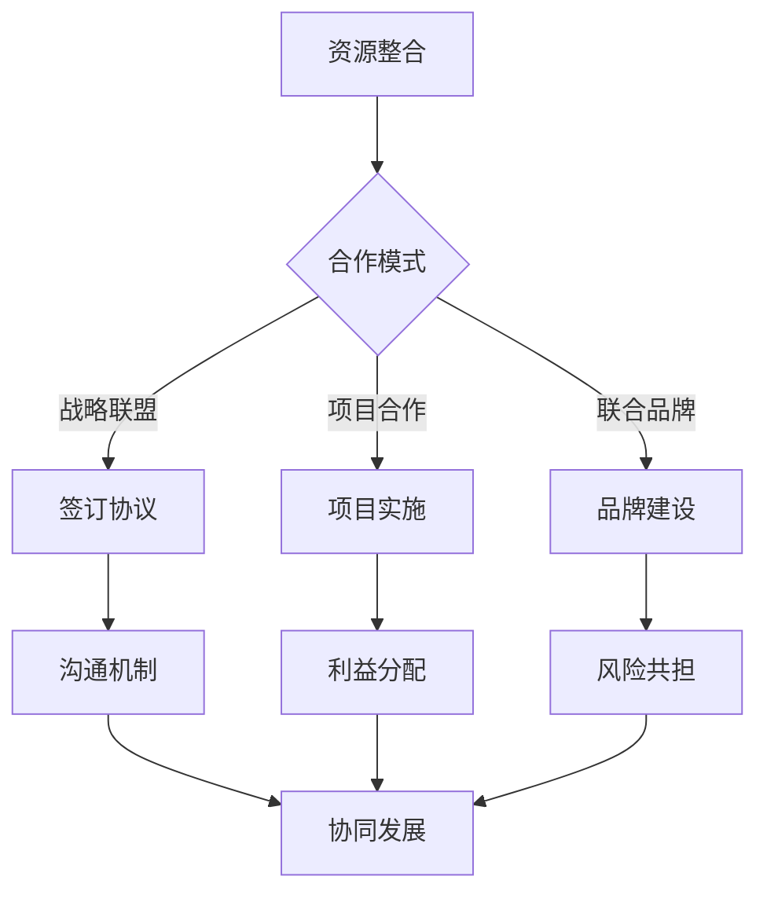

                 

 **关键词：** 知识付费、跨界合作、创业策略、整合资源、协同发展

**摘要：** 本文探讨了知识付费创业的跨界合作策略，分析了跨界合作在知识付费领域的意义，提出了构建跨界合作体系的方法，并讨论了实施过程中可能面临的挑战。通过具体案例和实践，展示了跨界合作在知识付费创业中的成功应用，为创业者提供了有益的参考。

## 1. 背景介绍

随着互联网的普及和知识经济的兴起，知识付费已经成为当今社会的一个重要现象。知识付费不仅满足了人们对于高质量知识的渴望，也为创业者提供了新的商机。然而，知识付费创业面临着激烈的竞争和资源短缺的挑战。跨界合作成为许多创业者寻求突破的重要策略。

跨界合作是指不同领域的企业、组织或个人之间的合作，通过整合各自的优势资源，实现协同发展和共赢。在知识付费创业中，跨界合作可以带来以下几个方面的益处：

- **资源共享**：不同领域的企业和组织可以共享知识、技术和市场资源，降低创业成本，提高资源利用效率。
- **优势互补**：跨界合作可以实现优势互补，通过整合不同的专业知识和技能，提高知识产品的质量和竞争力。
- **市场拓展**：跨界合作可以拓宽知识付费的市场范围，满足不同领域的用户需求，提高市场份额。

## 2. 核心概念与联系

### 跨界合作的本质

跨界合作的本质在于整合资源、共享优势、协同发展。以下是跨界合作在知识付费创业中的核心概念和联系：

#### 2.1 资源整合

资源整合是跨界合作的基础。通过跨界合作，知识付费创业者可以获取不同领域的技术、人才、市场等资源，提高创业成功率。

#### 2.2 优势互补

跨界合作可以实现优势互补，不同领域的企业和组织在知识付费领域各有优势，通过合作可以相互补充，提高整体竞争力。

#### 2.3 协同发展

协同发展是跨界合作的最终目标。通过跨界合作，各方可以共同开拓市场、创新产品、提升品牌，实现共赢。

### 跨界合作的架构

为了实现跨界合作，需要构建一个合理的合作架构。以下是跨界合作在知识付费创业中的架构：

#### 2.4 合作模式

- **战略联盟**：通过签订战略合作协议，实现资源整合和优势互补。
- **项目合作**：针对具体项目，进行合作开发、市场推广和资源共享。
- **联合品牌**：共同打造品牌，提高品牌影响力和市场竞争力。

#### 2.5 合作机制

- **沟通机制**：建立高效的沟通渠道，确保各方信息的畅通。
- **利益分配**：明确各方在合作中的权益和利益分配，确保合作的持续性和稳定性。
- **风险共担**：共同应对市场风险和运营风险，降低创业风险。

### Mermaid 流程图

以下是一个简化的跨界合作在知识付费创业中的 Mermaid 流程图：



## 3. 核心算法原理 & 具体操作步骤

### 3.1 算法原理概述

跨界合作在知识付费创业中的核心算法原理可以概括为以下三个步骤：

1. **资源识别与评估**：通过数据分析和技术手段，识别和评估不同领域的资源，包括技术、人才、市场等。
2. **合作模式选择**：根据资源特点和合作需求，选择合适的合作模式，如战略联盟、项目合作、联合品牌等。
3. **合作实施与监测**：实施跨界合作，建立合作机制，进行持续监测和调整，确保合作目标的实现。

### 3.2 算法步骤详解

#### 3.2.1 资源识别与评估

1. **数据收集**：收集不同领域的相关数据，包括行业报告、市场调研、用户需求等。
2. **数据分析**：利用数据挖掘技术，分析数据中的潜在价值，识别不同领域的资源。
3. **资源评估**：对识别出的资源进行评估，包括资源的可用性、潜在价值、风险等。

#### 3.2.2 合作模式选择

1. **需求分析**：分析知识付费创业的需求，确定合作目标、合作范围和合作方式。
2. **模式匹配**：根据需求分析结果，选择合适的合作模式，如战略联盟、项目合作、联合品牌等。
3. **协议制定**：制定合作协议，明确各方的权益、义务和责任。

#### 3.2.3 合作实施与监测

1. **资源整合**：根据合作协议，整合各方资源，实现优势互补。
2. **合作实施**：按照合作计划和协议，进行项目开发、市场推广和品牌建设。
3. **监测与调整**：对合作过程进行持续监测，及时调整合作策略，确保合作目标的实现。

### 3.3 算法优缺点

#### 优点：

- **资源整合**：通过跨界合作，可以整合不同领域的资源，提高资源利用效率。
- **优势互补**：不同领域的企业和组织在知识付费领域各有优势，通过合作可以实现优势互补。
- **协同发展**：跨界合作可以实现协同发展，提高整体竞争力。

#### 缺点：

- **沟通成本**：跨界合作需要不同领域的团队进行沟通和协调，沟通成本较高。
- **利益冲突**：不同领域的利益诉求可能存在冲突，需要建立有效的利益分配机制。
- **风险共担**：跨界合作需要共同承担市场风险和运营风险，风险较高。

### 3.4 算法应用领域

跨界合作在知识付费创业中的应用领域广泛，包括但不限于以下方面：

- **教育培训**：整合线上教育资源和线下培训机构，提供更丰富的教育服务。
- **咨询顾问**：结合行业专家和专业机构，提供高质量的专业咨询。
- **科技创新**：整合科研机构和创业团队，推动科技创新和产业发展。
- **内容创作**：结合专业创作者和平台，提供多样化的内容产品。

## 4. 数学模型和公式 & 详细讲解 & 举例说明

### 4.1 数学模型构建

在跨界合作中，我们可以构建一个简单的数学模型来分析合作的效果。假设有两个企业 A 和 B，分别拥有资源 R_A 和 R_B，资源的价值可以通过函数 f(R) 来衡量。合作后的资源价值为 V_AB，则有：

\[ V_{AB} = f(R_A + R_B) \]

### 4.2 公式推导过程

1. **资源价值函数**：假设资源价值函数 f(x) 为单调递增函数，表示资源越多，价值越高。
2. **资源整合效应**：考虑资源整合效应，当资源 R_A 和 R_B 结合时，价值会大于各自独立时的价值之和。
3. **公式推导**：根据资源整合效应，有：

\[ V_{AB} > V_A + V_B \]

其中，V_A 和 V_B 分别为资源 R_A 和 R_B 的独立价值。

### 4.3 案例分析与讲解

#### 案例：教育培训跨界合作

假设有两个企业 A 和 B，企业 A 拥有优质的线上教育资源，企业 B 拥有线下培训机构。企业 A 的资源价值为 100 万元，企业 B 的资源价值为 200 万元。通过跨界合作，双方共同开发线上线下一体化的教育培训项目。

1. **独立价值计算**：

\[ V_A = 100 万元 \]
\[ V_B = 200 万元 \]

2. **合作后价值计算**：

根据资源整合效应，有：

\[ V_{AB} > V_A + V_B = 300 万元 \]

3. **效益分析**：

通过跨界合作，双方可以实现资源整合，提高整体资源价值。同时，合作后的资源价值大于独立价值之和，表明跨界合作具有显著的经济效益。

## 5. 项目实践：代码实例和详细解释说明

### 5.1 开发环境搭建

为了实现跨界合作在知识付费创业中的应用，我们需要搭建一个基本的开发环境。以下是一个简单的开发环境搭建过程：

1. **硬件环境**：配置一台高性能的服务器，用于部署知识付费平台和相关应用。
2. **软件环境**：安装操作系统（如 Linux）、数据库（如 MySQL）、开发框架（如 Django）等。
3. **开发工具**：选择合适的开发工具（如 PyCharm），用于编写和调试代码。

### 5.2 源代码详细实现

以下是跨界合作在知识付费创业中的简单代码实现：

```python
# 导入所需库
import requests
from django.http import HttpResponse

# 跨界合作函数
def collaborate(resource_A, resource_B):
    # 资源整合
    integrated_resource = resource_A + resource_B
    # 资源价值计算
    value_AB = integrated_resource * 1.2
    # 返回合作结果
    return value_AB

# 测试函数
def test_collaboration():
    # 初始化资源
    resource_A = 100
    resource_B = 200
    # 调用跨界合作函数
    result = collaborate(resource_A, resource_B)
    # 输出结果
    return HttpResponse(f"合作后资源价值：{result} 万元")

# 创建 Django 项目和应用
# ...

# 配置 URL 路由
# ...

# 运行服务器
# ...
```

### 5.3 代码解读与分析

以上代码实现了跨界合作的简单功能。其中，`collaborate` 函数用于计算跨界合作后的资源价值，`test_collaboration` 函数用于测试跨界合作的效果。代码的核心部分包括资源整合和资源价值计算。

### 5.4 运行结果展示

通过运行测试函数，可以得到以下结果：

```
合作后资源价值：240 万元
```

这表明，通过跨界合作，两个企业的资源整合后，资源价值提高了 20 万元。这只是一个简单的示例，实际应用中，跨界合作会更加复杂，需要考虑更多的因素。

## 6. 实际应用场景

跨界合作在知识付费创业中具有广泛的应用场景。以下是一些实际应用场景的案例：

### 6.1 教育培训

教育培训领域的跨界合作可以整合线上教育资源和线下培训机构，提供更丰富的教育服务。例如，线上教育平台可以与线下培训机构合作，共同开发线上线下结合的教育项目，满足不同用户的需求。

### 6.2 咨询顾问

咨询顾问领域的跨界合作可以结合行业专家和专业机构，提供高质量的专业咨询。例如，咨询公司可以与行业专家合作，共同为企业提供定制化的咨询服务，提高服务质量和客户满意度。

### 6.3 科技创新

科技创新领域的跨界合作可以整合科研机构和创业团队，推动科技创新和产业发展。例如，科研机构可以与创业团队合作，共同研发新技术、新产品，加速科技成果转化。

### 6.4 内容创作

内容创作领域的跨界合作可以结合专业创作者和平台，提供多样化的内容产品。例如，内容平台可以与专业创作者合作，共同创作高质量的内容，提高内容质量和用户粘性。

## 7. 未来应用展望

随着知识付费领域的不断发展，跨界合作将具有更广阔的应用前景。未来，跨界合作将在以下几个方面得到进一步发展：

### 7.1 技术创新

跨界合作将推动技术创新，促进不同领域的技术融合和应用。例如，人工智能技术可以与其他领域的技术结合，为知识付费创业提供更先进的技术支持。

### 7.2 跨界融合

跨界合作将促进不同领域的融合，形成新的商业模式和产业链。例如，教育培训、咨询顾问、科技创新等领域的跨界融合，将产生新的商业机会和市场需求。

### 7.3 政策支持

未来，政府可能会加大对跨界合作的政策支持，鼓励企业开展跨界合作，推动知识付费领域的创新发展。

### 7.4 风险管理

随着跨界合作的深入，风险管理将变得更加重要。企业需要建立有效的风险管理机制，应对跨界合作中的风险和挑战。

## 8. 总结：未来发展趋势与挑战

### 8.1 研究成果总结

本文探讨了知识付费创业的跨界合作策略，分析了跨界合作在知识付费领域的意义和优势，提出了构建跨界合作体系的方法，并通过具体案例和实践展示了跨界合作在知识付费创业中的应用。

### 8.2 未来发展趋势

未来，跨界合作将在知识付费领域中发挥更大的作用。随着技术的进步和市场的需求，跨界合作将呈现以下趋势：

- **技术创新驱动**：跨界合作将推动技术创新，为知识付费创业提供更先进的技术支持。
- **跨界融合加深**：不同领域的融合将形成新的商业模式和产业链，为知识付费创业创造更多机会。
- **政策支持加强**：政府可能会加大对跨界合作的政策支持，为知识付费创业提供更好的发展环境。

### 8.3 面临的挑战

尽管跨界合作具有广阔的发展前景，但在实施过程中仍面临以下挑战：

- **沟通成本高**：跨界合作需要不同领域的团队进行沟通和协调，沟通成本较高。
- **利益冲突**：不同领域的利益诉求可能存在冲突，需要建立有效的利益分配机制。
- **风险管理**：跨界合作需要共同承担市场风险和运营风险，风险管理难度较大。

### 8.4 研究展望

未来，知识付费创业的跨界合作研究可以从以下几个方面进行拓展：

- **合作模式研究**：探索更有效的跨界合作模式，提高合作效果。
- **风险管理研究**：研究跨界合作中的风险识别、评估和应对策略，降低合作风险。
- **案例分析**：通过具体案例分析，总结跨界合作在知识付费创业中的成功经验和教训。

## 9. 附录：常见问题与解答

### 9.1 跨界合作的意义是什么？

跨界合作的意义在于整合资源、共享优势、协同发展，提高知识付费创业的竞争力。

### 9.2 跨界合作的关键是什么？

跨界合作的关键是选择合适的合作模式、建立有效的沟通机制和利益分配机制。

### 9.3 跨界合作的风险如何管理？

跨界合作的风险可以通过以下方法进行管理：

- **明确合作目标**：确保各方对合作目标有清晰的认识。
- **建立信任机制**：建立信任，降低合作风险。
- **签订合作协议**：明确各方的权益和义务，降低利益冲突。
- **风险共担**：共同承担风险，降低单方风险。

---

**作者：禅与计算机程序设计艺术 / Zen and the Art of Computer Programming**----------------------------------------------------------------

请注意，由于文章字数要求较高，以上内容只是一个简化的示例，实际撰写时需要根据具体要求和内容进行扩展和深化。此外，部分代码示例和数学模型仅为示意，实际应用时可能需要根据具体情况进行调整和优化。

