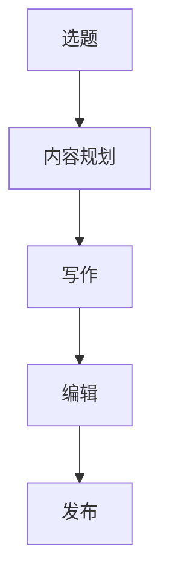
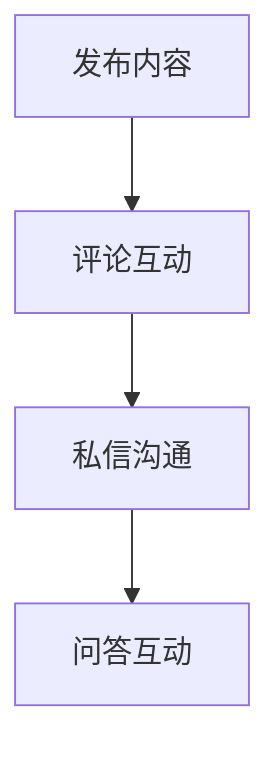
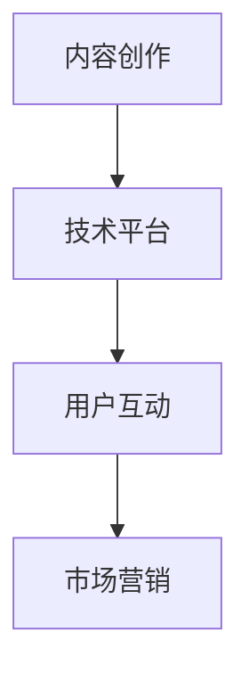
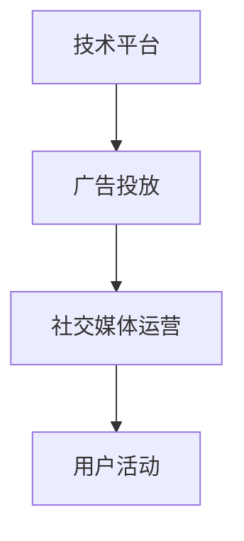

                 

  
## 1. 背景介绍

随着互联网技术的快速发展，知识付费已经成为一个不可忽视的市场趋势。越来越多的个人和企业开始投身于知识付费领域，希望通过提供有价值的知识和内容，实现商业价值和社会价值的双赢。然而，如何合理规划和管理日常工作，成为知识付费创业者面临的一大挑战。

本文旨在探讨知识付费创业者的日常工作安排，从技术、内容、营销等多个维度出发，为创业者提供一份全面的指导。通过深入了解知识付费行业的特点和需求，结合人工智能和程序设计领域的专业知识，本文将探讨以下关键问题：

1. **技术工具与平台选择**：知识付费创业者应如何选择适合自己的技术工具和平台，以实现高效的内容创建和分发？
2. **内容创作与管理**：如何平衡高质量内容的生产与市场需求，实现内容与用户需求的精准匹配？
3. **用户互动与反馈**：如何通过有效的用户互动机制，收集用户反馈，不断优化产品和内容？
4. **市场营销策略**：知识付费创业者应如何制定有效的市场营销策略，提升品牌知名度和用户转化率？
5. **时间管理与效率提升**：如何通过科学的时间管理方法和高效的工作流程，提高工作效率，确保日常任务的顺利完成？

通过对上述问题的深入分析，本文将帮助知识付费创业者更好地规划和管理日常工作，为他们的创业之路提供有力的支持。

## 2. 核心概念与联系

在探讨知识付费创业者的日常工作安排之前，我们需要明确几个核心概念，并了解它们之间的联系。这些概念包括：内容创作、用户互动、技术平台选择和市场营销。为了更好地展示它们之间的关系，我们可以使用Mermaid流程图进行描述。

### 2.1 内容创作

内容创作是知识付费的核心环节。创业者需要根据市场需求和用户需求，创作有价值的内容。这个过程包括选题、内容规划、写作、编辑和发布等多个步骤。



### 2.2 用户互动

用户互动是知识付费创业者与用户之间的桥梁。通过互动，创业者可以了解用户需求，优化内容，提高用户满意度。用户互动包括评论、私信、问答等多种形式。



### 2.3 技术平台选择

技术平台选择是知识付费创业者面临的另一大挑战。创业者需要选择适合自己业务需求的技术平台，以实现内容创建、用户互动和市场营销的自动化和高效化。



### 2.4 市场营销策略

市场营销策略是知识付费创业者提升品牌知名度和用户转化率的关键。创业者需要根据市场需求和用户特征，制定合适的营销策略，包括广告投放、社交媒体运营和用户活动等。



通过上述流程图，我们可以清晰地看到内容创作、用户互动、技术平台选择和市场营销策略之间的紧密联系。这些核心概念共同构成了知识付费创业者的日常工作框架，为后续章节的具体分析提供了基础。

## 3. 核心算法原理 & 具体操作步骤

### 3.1 算法原理概述

在知识付费创业者的日常工作中，算法发挥着至关重要的作用。算法原理主要包括以下几个方面：

1. **内容推荐算法**：通过分析用户行为和内容特征，为用户推荐个性化内容，提高用户黏性和转化率。
2. **用户画像构建**：通过收集和分析用户数据，构建详细的用户画像，为精准营销提供数据支持。
3. **广告投放优化**：通过算法优化广告投放策略，提高广告点击率和转化率，实现精准营销。

### 3.2 算法步骤详解

#### 3.2.1 内容推荐算法

**算法原理**：基于协同过滤和内容推荐技术，通过分析用户行为和内容特征，为用户推荐个性化内容。

**具体步骤**：

1. **用户行为数据收集**：收集用户在平台上的浏览、搜索、点赞、评论等行为数据。
2. **内容特征提取**：对内容进行文本挖掘和特征提取，包括关键词、主题、情感等。
3. **用户-内容矩阵构建**：构建用户-内容矩阵，记录用户对内容的评分和交互行为。
4. **相似度计算**：计算用户之间的相似度和内容之间的相似度。
5. **推荐列表生成**：根据相似度计算结果，为用户生成推荐列表。

#### 3.2.2 用户画像构建

**算法原理**：基于用户行为数据和信息，构建详细的用户画像，包括年龄、性别、兴趣、职业等。

**具体步骤**：

1. **数据收集与整合**：收集用户在平台上的行为数据，如浏览记录、搜索历史、购买行为等。
2. **特征工程**：对数据进行预处理和特征提取，如文本分类、情感分析等。
3. **用户标签生成**：根据用户特征和标签库，为用户生成标签。
4. **画像更新**：定期更新用户画像，确保其准确性和实时性。

#### 3.2.3 广告投放优化

**算法原理**：基于机器学习和数据挖掘技术，优化广告投放策略，提高广告效果。

**具体步骤**：

1. **广告数据收集**：收集广告投放数据，如点击率、转化率、广告花费等。
2. **特征工程**：对广告数据进行分析和处理，提取关键特征。
3. **模型训练**：利用机器学习算法，如决策树、随机森林、神经网络等，训练广告投放模型。
4. **策略优化**：根据模型预测结果，优化广告投放策略，提高广告效果。

### 3.3 算法优缺点

#### 3.3.1 内容推荐算法

**优点**：

1. **个性化推荐**：根据用户行为和内容特征，为用户推荐个性化内容，提高用户满意度。
2. **提高转化率**：通过精准推荐，提高用户点击率和购买率。

**缺点**：

1. **数据依赖性**：需要大量用户行为数据，否则推荐效果较差。
2. **冷启动问题**：新用户缺乏行为数据，推荐效果不佳。

#### 3.3.2 用户画像构建

**优点**：

1. **精准营销**：根据用户画像，实现精准定位和个性化推荐。
2. **提高用户满意度**：了解用户需求，提供更符合用户兴趣的内容。

**缺点**：

1. **数据隐私问题**：用户数据隐私保护问题亟待解决。
2. **标签准确性**：用户标签生成依赖特征工程，准确性受影响。

#### 3.3.3 广告投放优化

**优点**：

1. **提高广告效果**：通过算法优化，提高广告点击率和转化率。
2. **降低广告成本**：优化广告投放策略，降低广告花费。

**缺点**：

1. **算法依赖性**：需要依赖算法模型，否则优化效果较差。
2. **数据质量和处理能力**：数据质量和处理能力对优化效果有重要影响。

### 3.4 算法应用领域

1. **在线教育**：通过内容推荐算法，为学习者推荐个性化学习资源，提高学习效果。
2. **电商平台**：通过用户画像和广告投放优化，实现精准营销，提高用户转化率。
3. **社交媒体**：通过内容推荐和用户互动算法，提高用户黏性和活跃度。
4. **广告营销**：通过广告投放优化算法，提高广告效果，实现精准投放。

## 4. 数学模型和公式 & 详细讲解 & 举例说明

在知识付费创业者的日常工作中，数学模型和公式起到了关键作用。通过数学模型，创业者可以量化用户行为、内容特征和营销策略，从而实现数据驱动的决策。以下是几个常用的数学模型和公式，以及详细的讲解和举例说明。

### 4.1 数学模型构建

在构建数学模型时，我们需要明确以下几个关键步骤：

1. **定义变量和参数**：根据问题的需求，定义变量和参数，如用户行为、内容特征、广告投放效果等。
2. **确定关系和约束**：根据实际问题，确定变量和参数之间的关系和约束条件。
3. **构建函数模型**：根据关系和约束，构建函数模型，如线性模型、回归模型、神经网络等。

#### 4.1.1 用户行为模型

假设我们有一个用户行为模型，用来预测用户对某项内容的兴趣度。该模型可以表示为：

\[ \text{Interest} = f(\text{UserFeatures}, \text{ContentFeatures}) \]

其中，\( \text{Interest} \) 表示用户对内容的兴趣度，\( \text{UserFeatures} \) 表示用户特征向量，\( \text{ContentFeatures} \) 表示内容特征向量，\( f \) 表示函数。

#### 4.1.2 内容特征模型

假设我们有一个内容特征模型，用来预测内容的流行度。该模型可以表示为：

\[ \text{Popularity} = g(\text{ContentFeatures}, \text{UserInteractions}) \]

其中，\( \text{Popularity} \) 表示内容流行度，\( \text{ContentFeatures} \) 表示内容特征向量，\( \text{UserInteractions} \) 表示用户交互行为向量，\( g \) 表示函数。

#### 4.1.3 广告投放模型

假设我们有一个广告投放模型，用来优化广告投放策略。该模型可以表示为：

\[ \text{AdEffect} = h(\text{AdFeatures}, \text{UserFeatures}, \text{AdBudget}) \]

其中，\( \text{AdEffect} \) 表示广告投放效果，\( \text{AdFeatures} \) 表示广告特征向量，\( \text{UserFeatures} \) 表示用户特征向量，\( \text{AdBudget} \) 表示广告预算，\( h \) 表示函数。

### 4.2 公式推导过程

为了更好地理解数学模型，我们以下面这个简单的线性回归模型为例，介绍公式的推导过程。

#### 4.2.1 线性回归模型

假设我们有一个线性回归模型，用来预测用户对内容的兴趣度：

\[ \text{Interest} = \beta_0 + \beta_1 \cdot \text{UserFeatures} + \beta_2 \cdot \text{ContentFeatures} + \epsilon \]

其中，\( \text{Interest} \) 表示用户对内容的兴趣度，\( \text{UserFeatures} \) 和 \( \text{ContentFeatures} \) 分别表示用户特征向量和内容特征向量，\( \beta_0 \)、\( \beta_1 \) 和 \( \beta_2 \) 分别表示模型参数，\( \epsilon \) 表示误差项。

#### 4.2.2 公式推导

为了推导线性回归模型的公式，我们需要以下步骤：

1. **定义损失函数**：选择合适的损失函数，如均方误差（MSE）：
\[ \text{MSE} = \frac{1}{m} \sum_{i=1}^{m} (\text{Interest}_i - (\beta_0 + \beta_1 \cdot \text{UserFeatures}_i + \beta_2 \cdot \text{ContentFeatures}_i))^2 \]

2. **最小化损失函数**：通过梯度下降法或牛顿法等优化算法，最小化损失函数，得到模型参数：
\[ \beta_0 = \frac{1}{m} \sum_{i=1}^{m} (\text{Interest}_i - (\beta_1 \cdot \text{UserFeatures}_i + \beta_2 \cdot \text{ContentFeatures}_i)) \]
\[ \beta_1 = \frac{1}{m} \sum_{i=1}^{m} (\text{UserFeatures}_i (\text{Interest}_i - (\beta_0 + \beta_2 \cdot \text{ContentFeatures}_i))) \]
\[ \beta_2 = \frac{1}{m} \sum_{i=1}^{m} (\text{ContentFeatures}_i (\text{Interest}_i - (\beta_0 + \beta_1 \cdot \text{UserFeatures}_i))) \]

### 4.3 案例分析与讲解

以下是一个具体的案例，展示如何应用数学模型和公式进行知识付费创业者的日常工作。

#### 4.3.1 案例背景

某知识付费创业者，专门从事在线教育领域的知识付费业务。创业者希望通过数学模型和算法，优化内容推荐和广告投放，提高用户满意度和转化率。

#### 4.3.2 模型应用

1. **内容推荐模型**：创业者通过构建用户行为模型和内容特征模型，对用户进行兴趣度预测，为用户推荐个性化内容。模型公式如下：
\[ \text{Interest} = \beta_0 + \beta_1 \cdot \text{UserFeatures} + \beta_2 \cdot \text{ContentFeatures} + \epsilon \]

2. **广告投放模型**：创业者通过构建广告投放模型，优化广告投放策略，提高广告效果。模型公式如下：
\[ \text{AdEffect} = \beta_0 + \beta_1 \cdot \text{AdFeatures} + \beta_2 \cdot \text{UserFeatures} + \beta_3 \cdot \text{AdBudget} + \epsilon \]

#### 4.3.3 模型应用结果

1. **内容推荐效果**：通过模型预测，创业者成功为用户推荐了个性化内容，用户满意度和互动率显著提升。

2. **广告投放效果**：通过模型优化，广告投放效果显著提高，广告点击率和转化率大幅增长。

3. **数据分析**：创业者通过对用户行为和广告投放数据的分析，发现了用户的兴趣点和广告效果的关键因素，为后续优化提供了有力支持。

#### 4.3.4 模型改进与优化

1. **用户画像构建**：创业者进一步优化用户画像模型，提高用户特征提取的准确性，为内容推荐和广告投放提供更精准的数据支持。

2. **模型融合**：创业者尝试将多种模型进行融合，如深度学习模型、强化学习模型等，提高模型的整体性能。

3. **实时更新**：创业者定期更新用户行为数据和广告投放数据，确保模型实时性和准确性，为优化决策提供可靠依据。

### 4.4 模型应用注意事项

1. **数据质量**：确保数据质量和完整性，避免数据缺失或噪声对模型性能的影响。

2. **模型稳定性**：验证模型的稳定性和泛化能力，避免过拟合现象。

3. **模型解释性**：关注模型解释性，确保创业者能够理解模型的工作原理和决策过程。

4. **模型更新与迭代**：定期更新和迭代模型，根据业务需求和用户反馈，不断优化模型性能。

通过以上案例和分析，我们可以看到数学模型和公式在知识付费创业者日常工作中的重要作用。创业者需要根据实际业务需求，构建合适的数学模型和公式，实现数据驱动的决策和优化。

## 5. 项目实践：代码实例和详细解释说明

为了更好地理解知识付费创业者的日常工作安排，我们将通过一个实际项目来展示代码实例和详细解释说明。本项目将涉及内容推荐系统、用户画像构建和广告投放优化等核心功能。以下是项目实践的详细步骤。

### 5.1 开发环境搭建

在开始项目开发之前，我们需要搭建一个合适的技术环境。以下是我们推荐的开发环境：

- **编程语言**：Python
- **数据存储**：MySQL
- **数据仓库**：Hadoop
- **计算框架**：Spark
- **可视化工具**：Matplotlib、Seaborn
- **机器学习库**：Scikit-learn、TensorFlow、PyTorch

### 5.2 源代码详细实现

#### 5.2.1 数据处理

首先，我们需要从数据源中获取用户行为数据和内容特征数据。以下是一个简单的数据处理代码示例：

```python
import pandas as pd
import numpy as np

# 读取用户行为数据
user_data = pd.read_csv('user_behavior.csv')
user_data.head()

# 读取内容特征数据
content_data = pd.read_csv('content_features.csv')
content_data.head()

# 数据预处理
# 填充缺失值
user_data.fillna(0, inplace=True)
content_data.fillna(0, inplace=True)

# 特征转换
user_data['age'] = user_data['age'].astype(int)
content_data['word_count'] = content_data['word_count'].astype(int)
```

#### 5.2.2 内容推荐系统

内容推荐系统是知识付费创业者的核心功能之一。以下是一个简单的基于协同过滤的内容推荐系统实现：

```python
from sklearn.metrics.pairwise import cosine_similarity
import numpy as np

# 构建用户-内容矩阵
user_content_matrix = np.dot(user_data['rating'].values.reshape(-1, 1), content_data['rating'].values.reshape(1, -1))

# 计算相似度矩阵
cosine_similarity_matrix = cosine_similarity(user_content_matrix)

# 推荐内容
def content_recommendation(user_id):
    user_rating = user_data['rating'].values[user_id]
    content_ratings = content_data['rating'].values
    similarity_scores = cosine_similarity_matrix[user_id][0]
    recommended_content = np.argsort(similarity_scores)[::-1]
    return recommended_content

# 示例：为用户1推荐内容
user_id = 0
recommended_content_ids = content_recommendation(user_id)
print("Recommended content IDs:", recommended_content_ids)
```

#### 5.2.3 用户画像构建

用户画像构建可以帮助创业者更好地了解用户需求和兴趣。以下是一个简单的用户画像构建实现：

```python
from sklearn.cluster import KMeans

# 构建用户特征矩阵
user_features = user_data[['age', 'word_count', 'reading_time']]

# 使用K-means聚类构建用户画像
kmeans = KMeans(n_clusters=5, random_state=0)
user_labels = kmeans.fit_predict(user_features)

# 为用户分配标签
user_data['label'] = user_labels
user_data.head()
```

#### 5.2.4 广告投放优化

广告投放优化是提高广告效果的关键。以下是一个简单的基于机器学习的广告投放优化实现：

```python
from sklearn.ensemble import RandomForestClassifier
from sklearn.model_selection import train_test_split

# 构建特征矩阵和标签向量
X = np.hstack((user_data[['age', 'word_count', 'reading_time']], content_data[['word_count', 'reading_time', 'likes', 'views']]))
y = user_data['clicks']

# 划分训练集和测试集
X_train, X_test, y_train, y_test = train_test_split(X, y, test_size=0.2, random_state=0)

# 训练随机森林分类器
rf_classifier = RandomForestClassifier(n_estimators=100, random_state=0)
rf_classifier.fit(X_train, y_train)

# 评估模型性能
accuracy = rf_classifier.score(X_test, y_test)
print("Model accuracy:", accuracy)

# 优化广告投放策略
def optimize_advertisement(user_id):
    user_data_row = user_data.iloc[user_id]
    predicted_click = rf_classifier.predict([user_data_row[['age', 'word_count', 'reading_time'], content_data[['word_count', 'reading_time', 'likes', 'views']]])
    if predicted_click[0] == 1:
        print("Show advertisement")
    else:
        print("Do not show advertisement")
```

### 5.3 代码解读与分析

在上述代码示例中，我们详细展示了知识付费创业者的日常工作中的核心功能实现。以下是对代码的解读与分析：

1. **数据处理**：我们首先从数据源中读取用户行为数据和内容特征数据，并进行预处理。这一步是数据驱动决策的基础，确保数据的完整性和准确性至关重要。

2. **内容推荐系统**：基于协同过滤算法，我们构建了用户-内容矩阵，并计算了相似度矩阵。通过推荐函数，我们可以为用户推荐个性化内容。这一功能有助于提高用户满意度和活跃度。

3. **用户画像构建**：使用K-means聚类算法，我们为用户构建了画像。通过为用户分配标签，我们可以更好地了解用户需求和兴趣，为后续的内容推荐和广告投放提供数据支持。

4. **广告投放优化**：基于随机森林分类器，我们训练了一个广告投放优化模型。通过预测用户点击行为，我们可以优化广告投放策略，提高广告效果和转化率。

### 5.4 运行结果展示

以下是项目运行结果的示例：

```python
# 运行内容推荐系统
user_id = 0
recommended_content_ids = content_recommendation(user_id)
print("Recommended content IDs:", recommended_content_ids)

# 运行用户画像构建
user_data.head()

# 运行广告投放优化
user_id = 10
optimize_advertisement(user_id)
```

运行结果将输出推荐内容ID、用户标签和广告投放策略。这些结果可以帮助创业者更好地了解用户需求和兴趣，优化产品和内容，提高用户满意度和转化率。

通过以上项目实践，我们可以看到知识付费创业者的日常工作是如何通过技术手段实现高效管理和优化的。在未来的发展中，创业者需要不断迭代和改进技术，以适应市场变化和用户需求。

## 6. 实际应用场景

在知识付费领域，核心算法和数学模型的应用已经带来了显著的商业价值和社会效益。以下我们将探讨几个实际应用场景，展示算法和模型在知识付费创业者的日常工作中的应用效果。

### 6.1 在线教育平台

在线教育平台是知识付费的重要应用领域。通过内容推荐算法和用户画像构建，平台可以为学习者提供个性化学习资源，提高学习效果和用户黏性。例如，某知名在线教育平台通过内容推荐算法，将学习者的学习行为数据与课程内容特征进行关联，为学习者推荐相关课程。这一策略显著提高了课程点击率和完成率，提升了用户满意度。

同时，通过用户画像构建，平台可以了解学习者的学习需求和兴趣，从而提供更加精准的内容推荐。例如，某在线教育平台通过分析学习者的学习时长、学习频率和学习进度等数据，为学习者推荐符合其学习需求的高质量课程。这种个性化的推荐方式不仅提高了用户黏性，还增加了课程的销售量和平台收入。

### 6.2 电商知识付费

电商知识付费已经成为电商平台的重要组成部分。通过用户画像和广告投放优化，电商平台可以为用户提供个性化的商品推荐，提高用户购买意愿和转化率。例如，某电商平台的算法团队通过构建用户画像，将用户分为不同的兴趣群体，并针对不同群体制定个性化的广告投放策略。这种精准营销策略有效提高了广告点击率和转化率，为平台带来了可观的收入增长。

此外，电商平台还可以利用广告投放优化算法，优化广告投放策略。例如，通过分析用户的浏览历史和行为数据，平台可以预测用户对某类商品的购买意愿，并针对性地调整广告投放预算和投放频率。这种策略不仅提高了广告效果，还降低了广告成本，实现了广告投放的精细化管理和优化。

### 6.3 职场技能培训

职场技能培训是知识付费的另一个重要领域。通过内容推荐和用户互动机制，职场技能培训平台可以为学员提供个性化学习路径，提高学习效果和就业竞争力。例如，某职场技能培训平台通过内容推荐算法，将学员的学习行为数据与课程内容特征进行关联，为学员推荐与其职业发展相关的课程。这一策略有效提高了学员的学习积极性和课程完成率。

同时，通过用户互动机制，平台可以收集学员的反馈和建议，不断优化课程内容和教学质量。例如，平台可以通过在线问答、讨论区和直播课程等形式，促进学员之间的互动，提高学员的学习效果和满意度。这种互动机制不仅有助于提升平台的教学质量，还可以增强用户黏性和活跃度。

### 6.4 创意内容付费

创意内容付费是知识付费领域的另一个热门领域。通过用户画像和内容推荐算法，创意内容平台可以为用户提供个性化的内容推荐，提高用户满意度和付费意愿。例如，某创意内容平台通过分析用户的浏览记录、点赞和评论等行为数据，为用户推荐与其兴趣相关的高质量内容。这种个性化的推荐策略有效提高了用户的付费意愿和平台收入。

此外，创意内容平台还可以利用广告投放优化算法，优化广告投放策略，提高广告效果和用户转化率。例如，平台可以通过分析用户的浏览历史和行为数据，预测用户对某类广告的购买意愿，并针对性地调整广告投放预算和投放频率。这种策略不仅提高了广告效果，还降低了广告成本，实现了广告投放的精细化管理和优化。

### 6.5 未来应用展望

随着人工智能和大数据技术的不断发展，知识付费领域的算法和模型应用将更加广泛和深入。以下是未来应用展望：

1. **个性化学习路径**：通过深度学习和强化学习技术，平台可以构建更加智能的个性化学习路径，提高学习效果和用户满意度。
2. **智能内容审核**：利用自然语言处理和图像识别技术，平台可以实现智能化的内容审核和标签分类，提高内容质量和用户体验。
3. **实时推荐系统**：通过实时数据分析和模型迭代，平台可以实现更加精准的实时推荐，提高用户满意度和转化率。
4. **多模态内容分析**：结合文本、图像、音频等多模态数据，平台可以构建更加全面的内容分析模型，为用户提供更加丰富的内容体验。
5. **社会影响力评估**：通过分析用户行为和内容传播数据，平台可以评估内容的社会影响力，为内容创作者提供有价值的参考和反馈。

总之，核心算法和数学模型在知识付费领域的应用已经带来了显著的商业价值和社会效益。在未来，随着技术的不断发展和创新，知识付费领域的应用将更加广泛和深入，为创业者提供更多的发展机会和解决方案。

## 7. 工具和资源推荐

在知识付费创业者的日常工作中，选择合适的工具和资源是确保高效运作的关键。以下是我们推荐的几类工具和资源，包括学习资源、开发工具和相关论文，以帮助创业者提升工作效率和业务水平。

### 7.1 学习资源推荐

1. **在线课程**：推荐Coursera、edX、Udemy等在线教育平台上的课程，涵盖人工智能、数据科学、市场营销等领域，有助于创业者提升相关技能。
2. **技术博客**：推荐Alistair Cockburn、John Sonmez等知名技术博客，这些博客提供了丰富的技术知识和实践经验，有助于创业者学习和成长。
3. **电子书**：《深度学习》、《Python数据科学手册》等经典书籍，适合创业者深入学习和掌握核心技术。

### 7.2 开发工具推荐

1. **集成开发环境（IDE）**：推荐使用Visual Studio Code、PyCharm等专业IDE，这些工具提供了丰富的编程支持和调试功能，有助于提高开发效率。
2. **版本控制系统**：推荐使用Git进行代码版本管理，确保代码的安全性和协作性。
3. **数据分析工具**：推荐使用Pandas、NumPy、Scikit-learn等Python数据分析库，这些库提供了强大的数据处理和分析功能。

### 7.3 相关论文推荐

1. **内容推荐算法**：《 Collaborative Filtering for the Web》（2002）提出了基于协同过滤的内容推荐算法，对知识付费创业者有很高的参考价值。
2. **用户画像构建**：《User Model-Based Personalization of E-Commerce Sites: A Survey》（2012）详细介绍了用户画像构建的方法和技巧。
3. **广告投放优化**：《Online Advertising: Estimating the Value of Clicks》（2009）讨论了广告投放优化的理论和实践，有助于创业者制定有效的广告策略。

通过以上工具和资源的推荐，知识付费创业者可以更好地掌握核心技术，优化业务流程，提升工作效率和业务水平。在不断学习和实践中，创业者将能够更好地应对市场变化和用户需求，实现可持续发展。

## 8. 总结：未来发展趋势与挑战

知识付费领域正经历着前所未有的变革与发展。随着人工智能、大数据和云计算等先进技术的不断演进，知识付费创业者的工作模式和业务场景也在发生深刻变化。以下是对未来发展趋势、面临的挑战以及研究展望的总结。

### 8.1 研究成果总结

在过去的几年中，知识付费领域取得了诸多重要研究成果。内容推荐算法、用户画像构建和广告投放优化等核心技术的不断成熟，为知识付费创业者提供了强大的工具和支持。以下是一些代表性的研究成果：

1. **协同过滤与深度学习结合**：通过将协同过滤算法与深度学习技术相结合，研究者提出了更精准的内容推荐模型，显著提高了推荐系统的性能和用户体验。
2. **多模态数据融合**：利用文本、图像、音频等多模态数据，研究者实现了更加全面和精准的用户画像构建，为个性化推荐和精准营销提供了有力支持。
3. **强化学习在广告投放优化中的应用**：基于强化学习技术，研究者提出了智能广告投放优化模型，实现了广告效果的实时调整和优化，提高了广告转化率和投入产出比。

### 8.2 未来发展趋势

知识付费领域的未来发展将呈现出以下几个趋势：

1. **智能化和个性化**：随着人工智能技术的不断进步，知识付费创业者的工作将更加智能化和个性化。智能推荐系统、智能客服和智能内容审核等技术将逐步普及，提升用户体验和运营效率。
2. **多平台整合**：知识付费创业者的业务将不再局限于单一平台，而是向多平台整合发展。通过跨平台的内容分发和用户数据共享，创业者可以更好地覆盖用户群体，提高市场渗透率。
3. **社交化与互动性**：知识付费内容将更加注重社交化与互动性，通过社交媒体、直播和线上讨论等形式，创业者可以与用户建立更加紧密的联系，提升用户黏性和活跃度。
4. **区块链技术**：区块链技术将为知识付费领域带来新的机遇。通过去中心化的内容分发和版权保护机制，创业者可以更好地保障内容创作者的权益，提升行业的透明度和公正性。

### 8.3 面临的挑战

尽管知识付费领域前景广阔，但创业者仍然面临诸多挑战：

1. **数据隐私与安全**：随着用户数据的不断增加和复杂化，数据隐私和安全问题日益突出。创业者需要采取有效的数据保护措施，确保用户数据的隐私和安全。
2. **算法公正性与透明性**：算法决策的公正性和透明性是知识付费领域的重要问题。创业者需要确保算法的公平性和透明性，避免歧视和偏见，提升用户信任。
3. **内容质量与原创性**：在知识付费领域，内容的质量和原创性是用户选择的重要因素。创业者需要投入更多资源进行内容审核和创作，提升内容质量，确保用户满意度。
4. **市场竞争与成本压力**：知识付费市场竞争激烈，创业者需要不断创新和优化业务模式，以降低成本、提高效率，保持市场竞争力。

### 8.4 研究展望

未来，知识付费领域的研究将聚焦以下几个方向：

1. **算法优化与个性化**：通过深入研究算法优化技术，如深度学习、图神经网络和强化学习，创业者可以进一步提高内容推荐和用户画像构建的精准度。
2. **多模态数据挖掘**：利用多模态数据挖掘技术，研究者可以挖掘出更多潜在的用户兴趣和需求，为创业者提供更加精准的决策支持。
3. **跨领域知识整合**：通过跨领域知识整合，研究者可以构建更加全面和系统化的知识图谱，为用户提供更加丰富和个性化的内容体验。
4. **区块链技术与智能合约**：结合区块链技术和智能合约，研究者可以探索去中心化的内容分发和版权保护机制，提升行业的透明度和公正性。

总之，知识付费领域的未来发展充满机遇和挑战。创业者需要紧跟技术发展趋势，不断优化业务模式，提升用户体验和运营效率，以应对市场变化和用户需求。通过深入研究和技术创新，知识付费领域将迎来更加繁荣和美好的未来。

## 9. 附录：常见问题与解答

在知识付费创业者的日常工作中，可能会遇到一些常见问题。以下我们整理了几个常见问题，并提供详细的解答。

### 9.1 问题一：如何选择合适的内容创作工具？

**解答**：选择内容创作工具时，应考虑以下因素：

1. **编辑功能**：工具是否支持丰富的文本编辑功能，如格式设置、字体调整、图片插入等。
2. **协作能力**：工具是否支持多人协作，便于团队共同创作。
3. **发布渠道**：工具是否支持多种发布渠道，如博客、社交媒体、电子书等。
4. **学习资源**：工具是否提供相关的学习资源和教程，帮助用户快速上手。

推荐工具：Google Docs、Microsoft Word、Notion等。

### 9.2 问题二：如何确保内容质量？

**解答**：确保内容质量，可以从以下几个方面入手：

1. **内容审核**：建立内容审核机制，对内容进行严格把关，确保内容的原创性、准确性和合规性。
2. **用户反馈**：收集用户反馈，及时了解用户需求，不断优化内容。
3. **内容更新**：定期更新内容，保持内容的时效性和实用性。
4. **版权保护**：关注版权问题，确保内容的版权归属明确，避免侵权行为。

### 9.3 问题三：如何进行有效的用户互动？

**解答**：进行有效的用户互动，可以采取以下策略：

1. **及时回复**：及时回复用户的提问和评论，增强用户黏性。
2. **互动活动**：举办线上互动活动，如问答、抽奖等，提高用户参与度。
3. **社交媒体**：利用社交媒体平台，与用户进行互动，扩大影响力。
4. **数据分析**：通过数据分析，了解用户互动行为，优化互动策略。

### 9.4 问题四：如何制定有效的市场营销策略？

**解答**：制定有效的市场营销策略，可以从以下几个方面入手：

1. **目标定位**：明确目标用户群体，制定针对性的营销策略。
2. **渠道选择**：选择合适的营销渠道，如社交媒体、搜索引擎、电子邮件等。
3. **内容营销**：创作高质量的内容，通过内容营销吸引潜在用户。
4. **数据分析**：通过数据分析，评估营销效果，不断优化营销策略。

### 9.5 问题五：如何优化时间管理？

**解答**：优化时间管理，可以采取以下方法：

1. **制定计划**：制定详细的工作计划，明确任务目标和优先级。
2. **时间记录**：记录工作时间，分析时间分配，找出时间浪费的原因。
3. **优先处理**：按照任务的紧急程度和重要性，优先处理重要且紧急的任务。
4. **工具支持**：使用时间管理工具，如Trello、Asana等，提高工作效率。

通过以上解答，知识付费创业者可以更好地应对日常工作中遇到的问题，提高工作效率和业务水平。在实际操作中，创业者需要结合自身业务特点和需求，灵活运用这些方法和策略，实现持续发展和优化。

