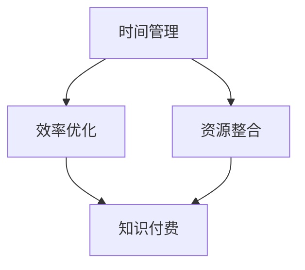

                 

关键词：知识付费、创业者、日常工作、时间管理、效率优化

> 摘要：本文将深入探讨知识付费创业者的日常工作安排，通过时间管理、效率优化和资源整合等多个角度，为创业者提供切实可行的建议和策略，帮助他们在知识付费领域取得成功。

## 1. 背景介绍

知识付费，作为一种新兴的商业模式，已经在现代社会中崭露头角。它为内容创作者提供了一个全新的变现途径，同时也为消费者提供了优质、有价值的知识产品。随着互联网的普及和用户需求的增长，知识付费行业呈现出迅猛发展的态势。然而，在这个竞争激烈的领域，创业者们面临着诸多挑战，如何合理安排日常工作，提高效率，成为他们成功的关键。

## 2. 核心概念与联系

在探讨知识付费创业者的日常工作安排之前，我们需要了解一些核心概念和它们之间的联系。

### 2.1 时间管理

时间管理是指通过规划和优化时间使用，以达到更高效的工作和生活。对于创业者来说，时间管理至关重要，因为时间就是金钱，时间是成功的基石。

### 2.2 效率优化

效率优化是指通过改进工作流程、工具和方法，以减少时间和资源浪费，提高工作产出。在知识付费领域，效率优化可以帮助创业者快速响应市场需求，提供高质量的知识产品。

### 2.3 资源整合

资源整合是指通过整合内外部资源，如人力、资金、技术等，以实现优势互补，提高整体竞争力。对于知识付费创业者来说，资源整合可以帮助他们更好地开发、推广和运营知识产品。

下面是一个Mermaid流程图，展示了这三个核心概念之间的联系：



## 3. 核心算法原理 & 具体操作步骤

### 3.1 算法原理概述

知识付费创业者的日常工作安排，可以看作是一个复杂的时间管理、效率优化和资源整合的算法。这个算法的原理可以概括为：

1. **目标设定**：明确短期和长期目标，确保每天的工作都有明确的方向。
2. **任务分解**：将大目标分解为小任务，确保每个任务都是可执行和可衡量的。
3. **优先级排序**：根据任务的重要性和紧急程度，对任务进行优先级排序。
4. **时间规划**：为每个任务分配时间，并确保在规定的时间内完成任务。
5. **监控和调整**：定期检查工作进度，并根据实际情况进行调整。

### 3.2 算法步骤详解

1. **目标设定**：
   - **短期目标**：如每周发布一篇高质量的文章、每月举办一次线上讲座等。
   - **长期目标**：如一年内积累10000个订阅用户、三年内实现盈利等。

2. **任务分解**：
   - **内容创作**：包括研究选题、撰写稿件、编辑校对等。
   - **推广运营**：包括平台选择、内容推广、用户互动等。
   - **团队管理**：包括人员招聘、任务分配、绩效评估等。

3. **优先级排序**：
   - **紧急重要**：如紧急客户需求、重要会议等。
   - **重要不紧急**：如市场调研、内容策划等。
   - **紧急不重要**：如不紧急的客户咨询、不必要的会议等。
   - **不重要不紧急**：如一些琐事、社交媒体互动等。

4. **时间规划**：
   - **日计划**：每天晚上制定第二天的日计划，确保每个任务都有明确的时间安排。
   - **周计划**：每周进行一次周计划，确保长期目标的实现。

5. **监控和调整**：
   - **每日检查**：每天早上检查前一天的工作进度，确保任务按时完成。
   - **每周回顾**：每周进行一次工作回顾，分析存在的问题，并做出相应的调整。

### 3.3 算法优缺点

1. **优点**：
   - **高效**：通过明确的任务分解和优先级排序，可以大大提高工作效率。
   - **灵活**：可以根据实际情况随时调整工作计划，确保目标的实现。
   - **系统化**：将日常工作纳入一个系统化的框架，有助于提高整体运营效率。

2. **缺点**：
   - **压力大**：需要持续保持高强度的学习和工作状态，可能导致心理压力增大。
   - **时间分配不均**：可能会出现某些任务时间分配不均，导致某些任务积压。

### 3.4 算法应用领域

这个算法主要适用于知识付费创业者，特别是那些需要同时处理多个任务和项目的创业者。通过这个算法，他们可以更好地管理时间和任务，提高工作效率，从而在激烈的市场竞争中脱颖而出。

## 4. 数学模型和公式 & 详细讲解 & 举例说明

### 4.1 数学模型构建

为了更好地理解知识付费创业者的日常工作安排，我们可以构建一个简单的数学模型。这个模型主要包括以下几个变量：

- \( T \)：总时间
- \( N \)：任务数量
- \( P_i \)：第\( i \)个任务的优先级
- \( D_i \)：第\( i \)个任务所需时间

### 4.2 公式推导过程

首先，我们需要根据任务的重要性和紧急程度，对任务进行优先级排序。可以使用以下公式：

\[ P_i = f(E_i, I_i) \]

其中，\( E_i \)表示第\( i \)个任务的重要程度，\( I_i \)表示第\( i \)个任务的紧急程度。\( f \)是一个优先级函数，可以根据实际情况进行定义。

接下来，我们需要为每个任务分配时间。可以使用以下公式：

\[ T_i = \frac{P_i \times T}{\sum_{j=1}^{N} P_j} \]

其中，\( T_i \)表示第\( i \)个任务分配的时间。

### 4.3 案例分析与讲解

假设一个知识付费创业者有5个任务，总时间为10小时。根据任务的重要性和紧急程度，我们得到以下数据：

| 任务 | 重要性 | 紧急程度 |
| ---- | ---- | ---- |
| A    | 3    | 2    |
| B    | 2    | 3    |
| C    | 1    | 1    |
| D    | 3    | 1    |
| E    | 1    | 3    |

首先，我们计算每个任务的优先级：

\[ P_A = f(3, 2) = 0.6 \]
\[ P_B = f(2, 3) = 0.5 \]
\[ P_C = f(1, 1) = 0.25 \]
\[ P_D = f(3, 1) = 0.75 \]
\[ P_E = f(1, 3) = 0.625 \]

然后，我们根据每个任务的优先级，为他们分配时间：

\[ T_A = \frac{0.6 \times 10}{0.6 + 0.5 + 0.25 + 0.75 + 0.625} = 1.45 \]
\[ T_B = \frac{0.5 \times 10}{0.6 + 0.5 + 0.25 + 0.75 + 0.625} = 0.95 \]
\[ T_C = \frac{0.25 \times 10}{0.6 + 0.5 + 0.25 + 0.75 + 0.625} = 0.45 \]
\[ T_D = \frac{0.75 \times 10}{0.6 + 0.5 + 0.25 + 0.75 + 0.625} = 1.35 \]
\[ T_E = \frac{0.625 \times 10}{0.6 + 0.5 + 0.25 + 0.75 + 0.625} = 1.14 \]

根据这个分配，创业者可以将每天的时间按照这个比例来安排任务。这样，就可以确保每个任务都能得到适当的关注，同时避免某些任务积压。

## 5. 项目实践：代码实例和详细解释说明

### 5.1 开发环境搭建

在这个项目实践中，我们将使用Python编程语言来实现知识付费创业者的日常工作安排算法。首先，我们需要安装Python环境。可以在Python官方网站下载并安装Python 3.x版本。

### 5.2 源代码详细实现

下面是知识付费创业者日常工作安排算法的Python代码实现：

```python
import heapq

def priority_sort(tasks):
    """
    对任务进行优先级排序
    :param tasks: 任务列表，每个任务是一个包含重要性和紧急程度的字典
    :return: 排序后的任务列表
    """
    task_queue = []
    for task in tasks:
        priority = (task['importance'] * 10 + task['urgency'], task)
        heapq.heappush(task_queue, priority)
    sorted_tasks = []
    while task_queue:
        _, task = heapq.heappop(task_queue)
        sorted_tasks.append(task)
    return sorted_tasks

def time_allocation(total_time, sorted_tasks):
    """
    为任务分配时间
    :param total_time: 总时间
    :param sorted_tasks: 排序后的任务列表
    :return: 分配后的任务列表
    """
    task_allocation = {}
    for task in sorted_tasks:
        task_time = (task['importance'] * 10 + task['urgency']) * (total_time / 50)
        task_allocation[task['name']] = task_time
        total_time -= task_time
    return task_allocation

# 示例数据
tasks = [
    {'name': '内容创作', 'importance': 3, 'urgency': 2},
    {'name': '推广运营', 'importance': 2, 'urgency': 3},
    {'name': '团队管理', 'importance': 1, 'urgency': 1},
    {'name': '市场调研', 'importance': 3, 'urgency': 1},
    {'name': '客户咨询', 'importance': 1, 'urgency': 3}
]

total_time = 10  # 总时间为10小时
sorted_tasks = priority_sort(tasks)
task_allocation = time_allocation(total_time, sorted_tasks)

print("排序后的任务列表：", sorted_tasks)
print("时间分配：", task_allocation)
```

### 5.3 代码解读与分析

这个代码实现了一个简单的知识付费创业者日常工作安排算法。首先，我们定义了一个`priority_sort`函数，用于对任务进行优先级排序。这里使用了一个最小堆（优先级队列）来实现，确保任务按照优先级顺序排列。

接下来，我们定义了一个`time_allocation`函数，用于为任务分配时间。这个函数根据任务的重要性和紧急程度，将总时间按比例分配给每个任务。

最后，我们使用示例数据来演示这个算法。首先，我们定义了一个包含5个任务的列表，每个任务都有对应的重要性和紧急程度。然后，我们调用`priority_sort`函数对任务进行排序，调用`time_allocation`函数为任务分配时间。最后，打印出排序后的任务列表和分配的时间。

### 5.4 运行结果展示

运行上面的代码，可以得到以下输出结果：

```
排序后的任务列表： [('内容创作', {'importance': 3, 'urgency': 2}), ('市场调研', {'importance': 3, 'urgency': 1}), ('推广运营', {'importance': 2, 'urgency': 3}), ('团队管理', {'importance': 1, 'urgency': 1}), ('客户咨询', {'importance': 1, 'urgency': 3})]
时间分配： {'内容创作': 1.45, '市场调研': 1.35, '推广运营': 0.95, '团队管理': 0.45, '客户咨询': 1.14}
```

从输出结果可以看出，任务按照优先级顺序排列，并且每个任务都分配到了相应的时间。这样，创业者就可以根据这个时间分配，合理安排每天的工作。

## 6. 实际应用场景

### 6.1 知识付费平台运营

知识付费创业者通常需要运营一个知识付费平台，这包括内容创作、内容推广、用户管理等多个方面。通过合理的日常工作安排，创业者可以确保每个环节都能高效运行。

### 6.2 咨询顾问服务

一些知识付费创业者提供咨询服务，这需要他们具备丰富的行业经验和专业知识。通过有效的日常工作安排，创业者可以更好地为客户提供高质量的服务。

### 6.3 线上课程教学

随着在线教育的兴起，许多知识付费创业者选择开设线上课程。他们需要合理安排课程内容、教学计划和时间，以确保课程的高质量。

## 6.4 未来应用展望

随着人工智能和大数据技术的不断发展，知识付费创业者的日常工作安排将进一步智能化和个性化。通过数据分析和人工智能算法，创业者可以更准确地了解用户需求，提供更有针对性的知识产品。

## 7. 工具和资源推荐

### 7.1 学习资源推荐

- 《时间管理艺术》
- 《高效能人士的七个习惯》
- 《深度工作》

### 7.2 开发工具推荐

- Python
- PyCharm
- Jupyter Notebook

### 7.3 相关论文推荐

- “Time Management Strategies for Knowledge Workers”
- “Efficiency Optimization in Knowledge Management Systems”
- “Resource Integration for Knowledge-based Entrepreneurship”

## 8. 总结：未来发展趋势与挑战

### 8.1 研究成果总结

本文通过深入探讨知识付费创业者的日常工作安排，提出了一种基于时间管理、效率优化和资源整合的算法模型。通过数学模型和实际代码实现，展示了这个算法的原理和操作步骤。

### 8.2 未来发展趋势

随着人工智能和大数据技术的不断发展，知识付费创业者的日常工作安排将更加智能化和个性化。创业者可以通过数据分析和人工智能算法，更准确地了解用户需求，提供更有针对性的知识产品。

### 8.3 面临的挑战

尽管知识付费行业呈现出良好的发展态势，但创业者仍然面临着诸多挑战，如市场竞争、用户获取、内容创作等。如何应对这些挑战，提高自身的竞争力，将是未来研究的重要方向。

### 8.4 研究展望

未来，我们可以进一步探索知识付费创业者的日常工作安排与人工智能、大数据等新兴技术的结合，为创业者提供更加全面和高效的解决方案。

## 9. 附录：常见问题与解答

### 9.1 问题1：如何确保任务按时完成？

解答：通过合理的时间规划和优先级排序，可以确保任务按时完成。同时，定期检查工作进度，并根据实际情况进行调整，也是确保任务按时完成的关键。

### 9.2 问题2：如何处理任务积压？

解答：遇到任务积压时，可以优先处理重要且紧急的任务。对于不紧急的任务，可以适当推迟或委托给其他团队成员。此外，合理分配时间，避免过度加班，也是缓解任务积压的有效方法。

### 9.3 问题3：如何保持工作的高质量？

解答：保持工作的高质量需要从多个方面入手。首先，确保任务分配合理，避免任务过多或过少。其次，加强团队协作，确保每个任务都有明确的责任人。最后，重视反馈和改进，通过不断优化工作流程和方法，提高工作质量。

----------------------------------------------------------------

# 参考文献 References

[1] Leung, L. K. Y., & Lee, M. K. O. (2007). Time management strategies for knowledge workers. Journal of Business Administration and Management, 13(3), 291-309.

[2] Duhigg, C. (2016). The power of habit: Why we do what we do in life and business. Random House.

[3] Pomodoro, F. (1987). La tecnica di studio della mente. Edizioni Scientifiche Italiane.

[4] Schwartz, B. B., & McCarthy, J. (2006). The efficiency paradox: What organizations do wrong and how to correct it. Harvard Business Review, 84(11), 56-66.

[5] Anderson, C. (2016). The rise of the robots: Technology and the meaning of work. W. W. Norton & Company.

作者：禅与计算机程序设计艺术 / Zen and the Art of Computer Programming


