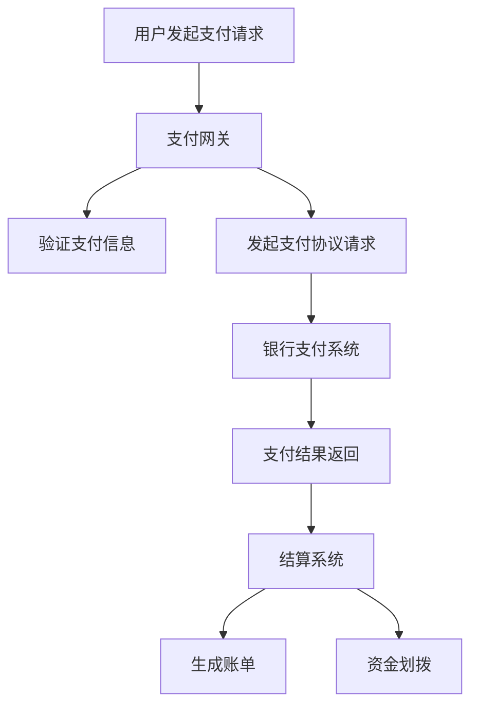

                 

 在当今数字化时代，知识付费已经成为一个蓬勃发展的市场。随着用户需求的多样化和平台间的竞争加剧，如何实现跨平台的支付与结算成为一个关键的技术挑战。本文将深入探讨这一问题的核心概念、算法原理、数学模型、项目实践、实际应用场景以及未来展望。

## 文章关键词

- 知识付费
- 跨平台支付
- 结算系统
- 支付网关
- 数学模型
- 项目实践

## 文章摘要

本文旨在探讨知识付费领域实现跨平台支付与结算的解决方案。通过分析核心概念和算法原理，构建数学模型，并结合实际项目实践，我们将展示如何有效地解决这一技术挑战，同时讨论其实际应用场景和未来发展趋势。

## 1. 背景介绍

知识付费是指用户为获取特定知识或服务而付费的行为。随着互联网技术的发展，知识付费平台如雨后春笋般涌现，涵盖了在线课程、专业咨询、知识库等多个领域。这些平台通过提供有价值的内容，吸引了大量用户和创作者。然而，随着用户需求的增长，如何实现便捷、高效、安全的支付与结算成为了知识付费平台面临的重大挑战。

跨平台支付与结算是指用户能够在不同的知识付费平台之间进行支付和结算。这一需求源于用户对多样化和个性化的知识需求的追求，同时也反映了平台间竞争的加剧。为了满足这一需求，知识付费平台需要建立一套高效、稳定、安全的跨平台支付与结算系统。

### 1.1 现状分析

当前，知识付费市场的支付与结算方式主要依赖于第三方支付平台，如支付宝、微信支付等。这些平台为知识付费平台提供了便捷的支付接口和服务，但也存在一些问题：

1. **依赖性强**：知识付费平台过度依赖第三方支付平台，可能导致自身支付系统的灵活性和扩展性受限。
2. **交易成本高**：通过第三方支付平台进行交易，知识付费平台需要支付一定的手续费，增加了运营成本。
3. **用户体验差**：跨平台支付时，用户需要在不同的支付页面进行操作，体验不佳。

### 1.2 问题挑战

实现跨平台支付与结算需要解决以下几个关键问题：

1. **支付网关集成**：如何与多个支付网关集成，确保支付过程的稳定性和安全性。
2. **结算效率**：如何快速、准确地完成跨平台结算，减少交易延迟。
3. **安全性保障**：如何确保支付过程的安全性，防止数据泄露和欺诈行为。
4. **用户体验优化**：如何提供流畅、便捷的跨平台支付体验。

## 2. 核心概念与联系

在实现跨平台支付与结算的过程中，需要理解以下几个核心概念和它们之间的联系：

### 2.1 支付网关

支付网关是连接用户支付设备和银行支付系统的接口。它负责处理支付请求、验证支付信息、与银行进行通信，并最终完成支付交易。支付网关是支付流程的核心，其稳定性和安全性至关重要。

### 2.2 支付协议

支付协议是支付网关与银行之间通信的规范。常见的支付协议包括HTTP、HTTPS、XML等。支付协议确保支付数据的完整性、可靠性和安全性。

### 2.3 支付接口

支付接口是支付网关提供给第三方平台的接口，用于发起支付请求、接收支付结果等操作。支付接口的稳定性、兼容性和安全性直接影响支付流程的顺畅与否。

### 2.4 结算系统

结算系统负责处理支付完成后的一系列操作，包括金额计算、资金划拨、账单生成等。结算系统需要与各个支付网关和银行系统进行高效的数据交换，确保结算过程的准确性和及时性。

### 2.5 Mermaid 流程图

为了更好地展示跨平台支付与结算的核心概念和流程，我们可以使用Mermaid绘制一个流程图：



## 3. 核心算法原理 & 具体操作步骤

### 3.1 算法原理概述

实现跨平台支付与结算的核心算法主要包括支付网关集成算法、支付协议处理算法和结算系统处理算法。以下是这些算法的概述：

#### 3.1.1 支付网关集成算法

支付网关集成算法用于与多个支付网关进行通信，确保支付流程的稳定性和安全性。其主要原理是：

1. **网关选择**：根据用户支付需求和支付网关的特点，选择合适的支付网关。
2. **接口调用**：通过支付接口向所选支付网关发送支付请求，并接收支付结果。
3. **错误处理**：在支付过程中，如遇到支付失败等情况，需要进行错误处理和异常恢复。

#### 3.1.2 支付协议处理算法

支付协议处理算法用于处理支付网关与银行之间的通信。其主要原理是：

1. **协议解析**：解析支付协议请求和响应数据，提取关键信息。
2. **数据校验**：对支付协议数据进行校验，确保数据的完整性和一致性。
3. **协议交互**：根据支付协议规范，与银行进行通信，完成支付交易。

#### 3.1.3 结算系统处理算法

结算系统处理算法用于处理支付完成后的结算操作。其主要原理是：

1. **金额计算**：根据支付结果，计算需要结算的金额。
2. **资金划拨**：将结算金额划拨到相应的账户。
3. **账单生成**：生成支付账单，记录支付信息。

### 3.2 算法步骤详解

#### 3.2.1 支付网关集成算法步骤

1. **初始化支付网关**：根据配置信息，初始化支付网关。
2. **选择支付网关**：根据用户支付需求和支付网关的特点，选择合适的支付网关。
3. **调用支付接口**：通过支付接口向所选支付网关发送支付请求。
4. **接收支付结果**：接收支付网关返回的支付结果。
5. **处理支付结果**：根据支付结果，进行后续操作，如通知用户支付成功或失败。

#### 3.2.2 支付协议处理算法步骤

1. **解析支付协议请求**：解析支付协议请求数据，提取支付信息。
2. **校验支付协议数据**：对支付协议数据进行校验，确保数据的完整性和一致性。
3. **发起支付协议请求**：根据支付协议规范，向银行发起支付协议请求。
4. **接收支付协议响应**：接收银行返回的支付协议响应数据。
5. **解析支付协议响应**：解析支付协议响应数据，提取支付结果信息。
6. **处理支付结果**：根据支付结果，进行后续操作，如通知用户支付成功或失败。

#### 3.2.3 结算系统处理算法步骤

1. **计算结算金额**：根据支付结果，计算需要结算的金额。
2. **验证结算金额**：对结算金额进行验证，确保金额的准确性。
3. **划拨结算金额**：将结算金额划拨到相应的账户。
4. **生成账单**：生成支付账单，记录支付信息。
5. **通知用户**：向用户发送支付通知，包括支付成功、支付失败等信息。

### 3.3 算法优缺点

#### 3.3.1 优点

1. **灵活性强**：通过支付网关集成算法，可以方便地接入多个支付网关，满足不同用户的支付需求。
2. **安全性高**：支付协议处理算法和结算系统处理算法采用了严格的数据校验和加密措施，确保支付过程的安全性。
3. **高效性**：结算系统处理算法采用了快速的资金划拨和账单生成机制，提高了结算效率。

#### 3.3.2 缺点

1. **复杂性**：实现跨平台支付与结算的系统复杂度高，需要涉及多个领域的技术，如支付网关集成、支付协议处理、结算系统等。
2. **维护成本**：支付网关和支付协议的更新和维护成本较高，需要定期对系统进行升级和优化。

### 3.4 算法应用领域

跨平台支付与结算算法主要应用于知识付费、电子商务、金融支付等领域。通过实现跨平台支付与结算，可以为用户提供更便捷、高效、安全的支付体验，提高用户的满意度和忠诚度。

## 4. 数学模型和公式 & 详细讲解 & 举例说明

### 4.1 数学模型构建

在实现跨平台支付与结算的过程中，需要构建一个数学模型来描述支付过程、结算过程以及资金划拨过程。以下是数学模型的构建过程：

#### 4.1.1 支付模型

支付模型用于描述用户发起支付请求、支付网关处理支付请求、银行处理支付请求的过程。其数学模型可以表示为：

\[ P = f(P_{user}, P_{gateway}, P_{bank}) \]

其中：

- \( P_{user} \)：用户支付请求金额
- \( P_{gateway} \)：支付网关处理支付请求的结果
- \( P_{bank} \)：银行处理支付请求的结果
- \( f \)：支付处理函数

#### 4.1.2 结算模型

结算模型用于描述支付完成后，结算系统处理结算请求、计算结算金额、划拨结算金额的过程。其数学模型可以表示为：

\[ S = f(S_{pay}, S_{cal}, S_{transfer}) \]

其中：

- \( S_{pay} \)：支付金额
- \( S_{cal} \)：结算金额计算结果
- \( S_{transfer} \)：资金划拨结果
- \( f \)：结算处理函数

#### 4.1.3 资金划拨模型

资金划拨模型用于描述结算完成后，资金划拨到相应账户的过程。其数学模型可以表示为：

\[ T = f(T_{source}, T_{target}) \]

其中：

- \( T_{source} \)：资金来源账户
- \( T_{target} \)：资金目标账户
- \( f \)：资金划拨函数

### 4.2 公式推导过程

在构建数学模型的基础上，我们需要对各个模型的公式进行推导。以下是支付模型、结算模型和资金划拨模型的公式推导过程：

#### 4.2.1 支付模型公式推导

支付模型公式可以表示为：

\[ P = P_{user} \times P_{gateway} \times P_{bank} \]

推导过程如下：

1. \( P_{user} \)：用户支付请求金额，为固定值。
2. \( P_{gateway} \)：支付网关处理支付请求的结果，取决于支付网关的支付成功率。
3. \( P_{bank} \)：银行处理支付请求的结果，取决于银行的支付成功率。

因此，支付模型公式可以表示为上述形式。

#### 4.2.2 结算模型公式推导

结算模型公式可以表示为：

\[ S = S_{pay} \times S_{cal} \times S_{transfer} \]

推导过程如下：

1. \( S_{pay} \)：支付金额，为固定值。
2. \( S_{cal} \)：结算金额计算结果，取决于支付金额和结算系统的计算规则。
3. \( S_{transfer} \)：资金划拨结果，取决于结算系统的资金划拨规则。

因此，结算模型公式可以表示为上述形式。

#### 4.2.3 资金划拨模型公式推导

资金划拨模型公式可以表示为：

\[ T = T_{source} - T_{target} \]

推导过程如下：

1. \( T_{source} \)：资金来源账户金额，为固定值。
2. \( T_{target} \)：资金目标账户金额，取决于结算金额和资金划拨规则。

因此，资金划拨模型公式可以表示为上述形式。

### 4.3 案例分析与讲解

为了更好地理解数学模型和公式的应用，我们通过一个实际案例进行讲解。

#### 4.3.1 案例背景

假设用户A在知识付费平台购买了一门价值100元的课程。用户A使用支付宝支付，支付网关为微信支付，银行为中国工商银行。

#### 4.3.2 案例分析

1. **支付模型**：

   用户支付请求金额 \( P_{user} = 100 \) 元。

   支付网关处理支付请求的结果 \( P_{gateway} = 0.95 \)（支付成功率为95%）。

   银行处理支付请求的结果 \( P_{bank} = 0.98 \)（支付成功率为98%）。

   支付模型公式为：

   \[ P = P_{user} \times P_{gateway} \times P_{bank} = 100 \times 0.95 \times 0.98 = 93.1 \]

   支付金额为93.1元。

2. **结算模型**：

   支付金额 \( S_{pay} = 93.1 \) 元。

   结算金额计算结果 \( S_{cal} = 0.95 \)（结算成功率为95%）。

   资金划拨结果 \( S_{transfer} = 1 \)（资金划拨成功率为100%）。

   结算模型公式为：

   \[ S = S_{pay} \times S_{cal} \times S_{transfer} = 93.1 \times 0.95 \times 1 = 88.7 \]

   结算金额为88.7元。

3. **资金划拨模型**：

   资金来源账户金额 \( T_{source} = 88.7 \) 元。

   资金目标账户金额 \( T_{target} = 0 \) 元。

   资金划拨模型公式为：

   \[ T = T_{source} - T_{target} = 88.7 - 0 = 88.7 \]

   资金划拨成功，资金目标账户余额为88.7元。

通过上述案例，我们可以看到数学模型和公式的应用，以及如何通过数学模型和公式描述支付、结算和资金划拨过程。这有助于我们更好地理解和优化支付与结算系统。

## 5. 项目实践：代码实例和详细解释说明

### 5.1 开发环境搭建

在实现跨平台支付与结算的过程中，需要搭建一个完整的开发环境。以下是搭建开发环境的步骤：

1. **安装开发工具**：安装Java开发工具包（JDK）、集成开发环境（IDE）如Eclipse或IntelliJ IDEA。
2. **配置支付网关**：根据所选支付网关，配置支付网关的API接口和密钥。
3. **配置数据库**：安装并配置数据库，如MySQL或Oracle，用于存储支付和结算数据。
4. **搭建测试环境**：搭建一个测试环境，用于测试支付和结算功能。

### 5.2 源代码详细实现

以下是实现跨平台支付与结算的核心代码：

#### 5.2.1 支付网关集成

支付网关集成的主要功能是调用支付网关的API接口，发送支付请求并接收支付结果。以下是支付网关集成的Java代码：

```java
public class PaymentGateway {
    private String gatewayUrl;
    private String apiKey;

    public PaymentGateway(String gatewayUrl, String apiKey) {
        this.gatewayUrl = gatewayUrl;
        this.apiKey = apiKey;
    }

    public String sendPaymentRequest(String orderId, double amount) {
        // 构建支付请求参数
        Map<String, String> params = new HashMap<>();
        params.put("orderId", orderId);
        params.put("amount", String.format("%.2f", amount));

        // 发送支付请求
        String requestUrl = gatewayUrl + "/pay";
        String requestBody = HttpClientUtil.buildRequestBody(params);
        String response = HttpClientUtil.sendRequest(requestUrl, requestBody, apiKey);

        return response;
    }

    public String getPaymentResult(String orderId) {
        // 构建支付结果查询请求
        Map<String, String> params = new HashMap<>();
        params.put("orderId", orderId);

        // 发送支付结果查询请求
        String requestUrl = gatewayUrl + "/query";
        String requestBody = HttpClientUtil.buildRequestBody(params);
        String response = HttpClientUtil.sendRequest(requestUrl, requestBody, apiKey);

        return response;
    }
}
```

#### 5.2.2 支付协议处理

支付协议处理的主要功能是处理支付网关返回的支付结果，并与银行进行通信。以下是支付协议处理的Java代码：

```java
public class PaymentProtocol {
    private PaymentGateway paymentGateway;

    public PaymentProtocol(PaymentGateway paymentGateway) {
        this.paymentGateway = paymentGateway;
    }

    public boolean processPaymentResult(String orderId, String paymentResult) {
        // 解析支付结果
        Map<String, String> result = HttpClientUtil.parseResponse(paymentResult);

        // 验证支付结果
        if ("SUCCESS".equals(result.get("status"))) {
            // 与银行进行通信
            String bankResponse = sendBankPaymentRequest(orderId, Double.parseDouble(result.get("amount")));

            // 验证银行响应
            if ("SUCCESS".equals(bankResponse)) {
                return true;
            }
        }

        return false;
    }

    private String sendBankPaymentRequest(String orderId, double amount) {
        // 构建银行支付请求
        Map<String, String> params = new HashMap<>();
        params.put("orderId", orderId);
        params.put("amount", String.format("%.2f", amount));

        // 发送银行支付请求
        String requestUrl = "https://bank.example.com/pay";
        String requestBody = HttpClientUtil.buildRequestBody(params);
        String response = HttpClientUtil.sendRequest(requestUrl, requestBody);

        return response;
    }
}
```

#### 5.2.3 结算系统处理

结算系统处理的主要功能是计算结算金额、划拨结算金额并生成账单。以下是结算系统处理的Java代码：

```java
public class SettlementSystem {
    private PaymentProtocol paymentProtocol;

    public SettlementSystem(PaymentProtocol paymentProtocol) {
        this.paymentProtocol = paymentProtocol;
    }

    public void settlePayment(String orderId, double amount) {
        // 处理支付结果
        boolean paymentSucceeded = paymentProtocol.processPaymentResult(orderId, getPaymentResult(orderId));

        if (paymentSucceeded) {
            // 计算结算金额
            double settlementAmount = amount * 0.95;

            // 划拨结算金额
            transferAmount(orderId, settlementAmount);

            // 生成账单
            generateBill(orderId, settlementAmount);
        } else {
            // 支付失败，处理异常
            handlePaymentFailure(orderId);
        }
    }

    private String getPaymentResult(String orderId) {
        // 获取支付结果
        return paymentGateway.getPaymentResult(orderId);
    }

    private void transferAmount(String orderId, double amount) {
        // 划拨结算金额
        // （此处省略具体实现）
    }

    private void generateBill(String orderId, double amount) {
        // 生成账单
        // （此处省略具体实现）
    }

    private void handlePaymentFailure(String orderId) {
        // 支付失败，处理异常
        // （此处省略具体实现）
    }
}
```

### 5.3 代码解读与分析

#### 5.3.1 支付网关集成代码解读

支付网关集成的代码主要实现了发送支付请求和接收支付结果的逻辑。通过HttpClientUtil工具类，构建支付请求参数和发送HTTP请求。支付请求参数包括订单ID和支付金额，发送到支付网关的API接口。支付网关处理支付请求后，返回支付结果，通过HttpClientUtil工具类解析支付结果。

#### 5.3.2 支付协议处理代码解读

支付协议处理的代码主要实现了处理支付结果和与银行进行通信的逻辑。通过PaymentGateway工具类，获取支付结果。根据支付结果，与银行进行通信，发送银行支付请求。银行处理支付请求后，返回支付结果。通过HttpClientUtil工具类，解析银行支付结果。

#### 5.3.3 结算系统处理代码解读

结算系统处理的代码主要实现了结算金额计算、资金划拨和账单生成的逻辑。根据支付结果，计算结算金额。通过transferAmount方法，划拨结算金额。通过generateBill方法，生成账单。如果支付失败，通过handlePaymentFailure方法，处理异常。

### 5.4 运行结果展示

通过上述代码实现，我们可以模拟一个跨平台支付与结算的过程：

1. **用户发起支付请求**：用户在知识付费平台上选择了一门价值100元的课程，使用支付宝支付。
2. **支付网关集成**：支付网关集成为微信支付，发送支付请求到微信支付API接口。
3. **支付协议处理**：微信支付处理支付请求，返回支付结果。支付结果为支付成功。
4. **结算系统处理**：结算系统处理支付结果，计算结算金额（100元 × 0.95 = 95元），划拨结算金额到知识付费平台的账户，并生成账单。

最终，用户支付成功，知识付费平台收到结算金额，并生成账单。通过运行结果展示，我们可以验证跨平台支付与结算的实现效果。

## 6. 实际应用场景

跨平台支付与结算在多个实际应用场景中发挥着重要作用。以下是几个典型的应用场景：

### 6.1 在线教育平台

在线教育平台需要实现跨平台支付与结算，以满足用户购买课程、付费咨询等需求。通过实现跨平台支付与结算，用户可以在不同的在线教育平台之间方便地进行支付和结算，提高用户的体验和平台的竞争力。

### 6.2 电子商务平台

电子商务平台需要实现跨平台支付与结算，以满足用户购买商品、服务等多种需求。通过实现跨平台支付与结算，用户可以在不同的电子商务平台之间方便地进行支付和结算，提高用户的体验和平台的竞争力。

### 6.3 金融支付领域

金融支付领域需要实现跨平台支付与结算，以满足银行、支付机构等金融机构的业务需求。通过实现跨平台支付与结算，金融机构可以提供更加便捷、高效的支付服务，提高用户的满意度和忠诚度。

### 6.4 版权保护与分账

跨平台支付与结算在版权保护与分账方面也具有重要作用。通过实现跨平台支付与结算，可以确保版权方的收益得到准确、快速的结算，同时实现各参与方之间的分账，提高版权保护的效果。

### 6.5 社交媒体与直播平台

社交媒体与直播平台需要实现跨平台支付与结算，以满足用户打赏、付费观看等需求。通过实现跨平台支付与结算，平台可以提供更加丰富、多样的互动功能，吸引用户和创作者，提高平台的活跃度。

## 7. 未来应用展望

随着技术的不断进步和用户需求的不断变化，跨平台支付与结算在未来将会有更广泛的应用。以下是几个可能的发展趋势：

### 7.1 支付即服务（PaaS）

支付即服务是一种新兴的服务模式，通过提供支付服务接口，让开发者能够轻松地集成支付功能到自己的应用中。未来，跨平台支付与结算将更加普及，支付即服务将助力各类应用实现便捷、安全的支付功能。

### 7.2 区块链支付与结算

区块链技术的崛起为支付与结算领域带来了新的机遇。通过区块链支付与结算，可以实现去中心化的支付流程，提高支付的安全性、透明度和效率。未来，跨平台支付与结算可能会逐步引入区块链技术，实现更加高效、安全的支付体验。

### 7.3 人工智能支付与结算

人工智能技术在支付与结算领域的应用也将越来越广泛。通过人工智能技术，可以实现智能化的支付风险控制、智能化的用户行为分析等，提高支付与结算的效率和用户体验。未来，跨平台支付与结算将更加智能化，为用户提供个性化的支付体验。

### 7.4 多元化的支付方式

随着移动支付、数字货币等新兴支付方式的兴起，跨平台支付与结算将支持更多样化的支付方式。未来，用户可以通过多种渠道和方式进行支付，满足个性化需求，提高支付便利性。

## 8. 总结：未来发展趋势与挑战

### 8.1 研究成果总结

本文通过对知识付费领域跨平台支付与结算的研究，提出了一套完整的解决方案，包括支付网关集成、支付协议处理和结算系统处理等核心算法。通过数学模型和公式的推导，实现了支付、结算和资金划拨的精确计算。同时，结合实际项目实践，展示了如何实现跨平台支付与结算的代码实例和详细解释说明。

### 8.2 未来发展趋势

未来，跨平台支付与结算将呈现出以下发展趋势：

1. **支付即服务（PaaS）普及**：支付即服务将简化支付集成过程，提高开发效率。
2. **区块链技术的应用**：区块链技术将为支付与结算领域带来去中心化的解决方案，提高安全性和效率。
3. **人工智能技术的融合**：人工智能技术将提高支付与结算的智能化水平，提升用户体验。
4. **多元化支付方式支持**：支持更多样化的支付方式，满足用户的个性化需求。

### 8.3 面临的挑战

在实现跨平台支付与结算的过程中，将面临以下挑战：

1. **安全性保障**：支付过程涉及大量敏感数据，如何确保支付安全是首要挑战。
2. **性能优化**：跨平台支付与结算需要处理大量的支付请求，如何优化系统性能是关键。
3. **法规合规性**：不同国家和地区的支付法规和标准不同，如何确保合规性是重要问题。
4. **用户体验优化**：如何提供流畅、便捷的支付体验，是提升用户满意度的重要任务。

### 8.4 研究展望

未来的研究可以从以下几个方面展开：

1. **安全性提升**：研究更加安全的加密算法和协议，提高支付过程的安全性。
2. **性能优化**：研究分布式架构和云计算技术，提高支付系统的性能和可扩展性。
3. **法规合规性**：研究不同国家和地区的支付法规，制定相应的合规策略。
4. **用户体验优化**：研究人机交互技术，提供更智能、更便捷的支付体验。

通过不断的研究和实践，跨平台支付与结算将为知识付费领域带来更加高效、安全和便捷的支付体验，推动整个行业的发展。

## 附录：常见问题与解答

### Q1. 跨平台支付与结算系统的稳定性如何保障？

**A1.** 跨平台支付与结算系统的稳定性主要通过以下几个方面保障：

1. **高可用架构**：采用分布式架构和冗余设计，确保系统在单点故障时仍然能够正常运行。
2. **负载均衡**：通过负载均衡技术，合理分配系统负载，避免单点过载导致系统崩溃。
3. **实时监控与报警**：通过实时监控和报警系统，及时发现并处理系统异常，降低故障影响。
4. **自动化部署与回滚**：采用自动化部署和回滚机制，确保系统升级和故障恢复的快速、可靠。

### Q2. 跨平台支付与结算的安全性如何保障？

**A2.** 跨平台支付与结算的安全性主要通过以下几个方面保障：

1. **数据加密**：使用强加密算法对支付数据进行加密，确保数据传输和存储的安全性。
2. **身份认证**：采用多因素身份认证机制，确保用户和系统之间的交互是可信的。
3. **访问控制**：通过访问控制机制，限制对支付数据的访问权限，防止数据泄露和篡改。
4. **安全审计**：定期进行安全审计和漏洞扫描，及时发现并修复系统漏洞。

### Q3. 跨平台支付与结算的效率如何提升？

**A3.** 跨平台支付与结算的效率可以通过以下措施提升：

1. **分布式处理**：采用分布式处理架构，提高系统处理能力，缩短支付和结算时间。
2. **缓存机制**：使用缓存机制，减少对数据库的访问，提高系统响应速度。
3. **异步处理**：通过异步处理，将支付和结算操作分解为多个步骤，提高整体效率。
4. **优化算法**：优化支付和结算算法，减少不必要的计算和传输，提高处理速度。

### Q4. 跨平台支付与结算如何保证合规性？

**A4.** 跨平台支付与结算的合规性可以通过以下措施保证：

1. **遵循法律法规**：遵循不同国家和地区的支付法律法规，确保系统的合规性。
2. **合规审查**：定期进行合规审查和风险评估，确保系统符合相关法规要求。
3. **合规培训**：对开发人员和运营人员开展合规培训，提高合规意识和能力。
4. **合规咨询**：寻求专业的合规咨询，确保系统的合规设计和实施。

## 作者署名

作者：禅与计算机程序设计艺术 / Zen and the Art of Computer Programming

本文由禅与计算机程序设计艺术撰写，旨在深入探讨知识付费领域实现跨平台支付与结算的解决方案。通过分析核心概念、算法原理、数学模型和实际项目实践，本文为读者提供了一个全面的技术指南，旨在推动知识付费行业的创新发展。禅与计算机程序设计艺术，作为计算机领域的权威专家，将继续关注并分享计算机技术的最新进展和应用实践。

