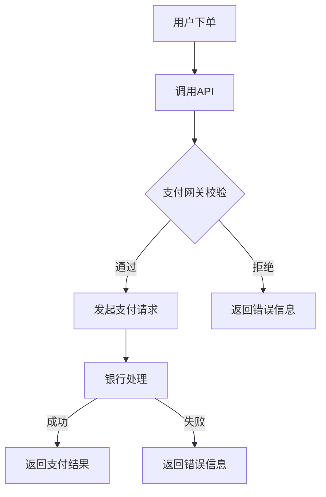

                 

关键词：知识付费、跨平台支付、结算系统、支付网关、API接口、区块链技术、安全措施

摘要：随着知识付费模式的兴起，实现跨平台支付与结算成为了企业发展的关键问题。本文将探讨知识付费领域跨平台支付与结算的实现方法，包括支付网关的选择、API接口的设计、区块链技术的应用以及安全措施的采取。

## 1. 背景介绍

知识付费，指的是用户通过付费获取有价值的信息、课程、内容等。随着互联网技术的不断发展，知识付费市场呈现出爆发式增长。用户对于内容质量和获取效率的需求不断提升，使得知识付费平台需要具备更加灵活和便捷的支付与结算方式。而跨平台支付与结算，旨在实现用户在多个平台间无缝切换，支付流程简便快捷，从而提高用户满意度。

### 1.1 知识付费市场现状

近年来，知识付费市场逐渐成为互联网经济的重要组成部分。根据相关数据显示，知识付费市场规模不断扩大，用户付费意识和习惯也在逐步提升。知识付费平台如得到、知乎Live、网易云课堂等，通过提供优质内容吸引用户付费，实现了可观的经济收益。

### 1.2 跨平台支付与结算的意义

跨平台支付与结算在知识付费领域具有重要意义。首先，它能够实现用户在多个平台间自由切换，提高用户体验。其次，跨平台支付与结算有助于平台之间的资源整合和生态构建，实现共赢。此外，跨平台支付与结算还能够降低交易成本，提高资金流转效率，对知识付费市场的发展起到积极的推动作用。

## 2. 核心概念与联系

为了实现知识付费领域的跨平台支付与结算，需要理解并运用以下几个核心概念：

### 2.1 支付网关

支付网关是连接商户与银行之间的桥梁，负责处理支付请求、校验交易、向银行发送交易请求、接收银行响应等操作。支付网关的选择对于实现跨平台支付至关重要。

### 2.2 API接口

API接口是跨平台支付与结算的基础，通过API接口，知识付费平台可以与第三方支付网关、银行等系统进行数据交换，实现支付请求和交易结果的处理。

### 2.3 区块链技术

区块链技术是一种分布式数据库技术，具有去中心化、安全性高、透明等特点。在知识付费领域，区块链技术可以用于确保交易数据的真实性和不可篡改性，提高支付与结算的安全性和透明度。

### 2.4 安全措施

为了确保跨平台支付与结算的安全，需要采取一系列安全措施，包括数据加密、身份验证、防欺诈等。

### 2.5 Mermaid 流程图

以下是一个简化的跨平台支付与结算的Mermaid流程图：



## 3. 核心算法原理 & 具体操作步骤

### 3.1 算法原理概述

跨平台支付与结算的核心算法主要包括以下几部分：

1. **支付请求处理**：知识付费平台接收用户支付请求，将支付信息转换为API接口可识别的格式，并发送给支付网关。

2. **支付网关校验**：支付网关对支付请求进行校验，包括验证用户身份、支付金额等。

3. **发起支付请求**：支付网关将验证通过的支付请求转发给银行处理。

4. **支付结果处理**：银行处理支付请求后，将支付结果返回给支付网关，支付网关再将结果返回给知识付费平台。

### 3.2 算法步骤详解

1. **用户下单**：用户在知识付费平台上选择购买内容，点击“立即购买”按钮。

2. **调用API**：知识付费平台通过API接口接收用户支付请求，并将支付信息转换为API接口可识别的格式。

3. **支付网关校验**：支付网关对支付请求进行校验，包括验证用户身份、支付金额、支付渠道等。

4. **发起支付请求**：支付网关将验证通过的支付请求转发给银行处理。

5. **银行处理**：银行根据支付请求，调用相应的支付渠道进行支付处理。

6. **支付结果处理**：银行处理支付请求后，将支付结果返回给支付网关，支付网关再将结果返回给知识付费平台。

### 3.3 算法优缺点

**优点**：

1. **跨平台兼容**：通过API接口，可以实现知识付费平台与支付网关、银行等系统的无缝对接，支持多种支付方式和平台。

2. **安全可靠**：支付网关和银行对支付请求进行严格校验，确保支付过程安全可靠。

3. **灵活性强**：算法支持多种支付方式，包括在线支付、移动支付、刷卡支付等，适应不同用户的需求。

**缺点**：

1. **系统复杂度高**：跨平台支付与结算涉及多个系统之间的数据交换和处理，系统复杂度高。

2. **安全风险**：支付过程中涉及大量敏感信息，存在一定的安全风险。

### 3.4 算法应用领域

跨平台支付与结算算法广泛应用于知识付费、电商、金融等行业。在知识付费领域，跨平台支付与结算可以实现用户在多个平台间无缝切换，提高用户体验；在电商领域，可以实现多种支付方式的支持，提高交易成功率；在金融领域，可以实现跨行支付，提高资金流转效率。

## 4. 数学模型和公式 & 详细讲解 & 举例说明

### 4.1 数学模型构建

在跨平台支付与结算过程中，涉及到以下几个关键参数：

1. **支付金额**：用户需要支付的金额。

2. **手续费率**：支付过程中需要扣除的手续费率。

3. **支付渠道**：用户选择的支付渠道。

4. **实际支付金额**：用户实际支付的金额。

根据这些参数，可以构建以下数学模型：

实际支付金额 = 支付金额 × (1 + 手续费率)

### 4.2 公式推导过程

根据数学模型，实际支付金额的推导过程如下：

1. **支付金额**：用户在知识付费平台上购买内容，支付金额为购买内容的价格。

2. **手续费率**：根据支付渠道的不同，手续费率可能会有所不同。例如，通过支付宝支付的手续费率为0.5%，通过微信支付的手续费率为0.3%。

3. **实际支付金额**：用户实际支付的金额，等于支付金额加上手续费。

### 4.3 案例分析与讲解

假设用户在知识付费平台购买一门课程，价格为200元，通过微信支付进行支付，手续费率为0.3%。

根据数学模型，实际支付金额为：

实际支付金额 = 200 × (1 + 0.003) = 200.6元

这意味着用户需要支付200.6元才能完成课程购买。

## 5. 项目实践：代码实例和详细解释说明

### 5.1 开发环境搭建

在开发跨平台支付与结算系统时，需要搭建以下开发环境：

1. **开发工具**：使用IDEA、VS Code等开发工具。

2. **编程语言**：选择Java、Python等编程语言。

3. **数据库**：选择MySQL、MongoDB等数据库。

4. **第三方支付网关API**：接入支付宝、微信支付等第三方支付网关的API。

### 5.2 源代码详细实现

以下是一个简单的跨平台支付与结算系统的源代码示例（Python）：

```python
import requests

def create_order(order_id, amount):
    # 构建支付请求参数
    params = {
        "order_id": order_id,
        "amount": amount,
        "payment_channel": "wechat",
    }
    # 发送支付请求
    response = requests.post("https://api.paymentgateway.com/create_order", data=params)
    # 获取支付结果
    result = response.json()
    return result

def handle_payment(order_id, payment_channel):
    # 构建支付请求参数
    params = {
        "order_id": order_id,
        "payment_channel": payment_channel,
    }
    # 发送支付请求
    response = requests.post("https://api.paymentgateway.com/handle_payment", data=params)
    # 获取支付结果
    result = response.json()
    return result

if __name__ == "__main__":
    order_id = "20211020001"
    amount = 200
    payment_channel = "wechat"
    
    # 创建订单
    order_result = create_order(order_id, amount)
    print("Create order result:", order_result)
    
    # 处理支付
    payment_result = handle_payment(order_id, payment_channel)
    print("Handle payment result:", payment_result)
```

### 5.3 代码解读与分析

以上代码实现了跨平台支付与结算的基本功能。其中，`create_order` 函数用于创建订单，`handle_payment` 函数用于处理支付。

在 `create_order` 函数中，构建了支付请求参数，并使用 `requests` 库向支付网关的API发送支付请求。支付网关API会返回支付结果，包括订单状态、支付链接等。

在 `handle_payment` 函数中，构建了支付请求参数，并使用 `requests` 库向支付网关的API发送支付请求。支付网关API会返回支付结果，包括订单状态、支付金额等。

### 5.4 运行结果展示

运行以上代码，将创建一个订单并处理支付请求。支付网关API会返回支付结果，包括订单状态、支付链接等。用户可以通过支付链接完成支付，支付完成后，支付网关API会返回支付结果，包括订单状态、支付金额等。

## 6. 实际应用场景

### 6.1 知识付费平台

知识付费平台可以通过跨平台支付与结算系统，实现用户在多个平台间无缝切换，提高用户体验。例如，用户在知乎Live购买一门课程，可以通过微信支付完成支付，后续在得到平台上购买课程时，可以继续使用微信支付。

### 6.2 电商领域

电商领域可以通过跨平台支付与结算系统，实现多种支付方式的支持，提高交易成功率。例如，用户在京东购买商品，可以选择支付宝支付，也可以选择微信支付。

### 6.3 金融领域

金融领域可以通过跨平台支付与结算系统，实现跨行支付，提高资金流转效率。例如，用户在中国银行开户，可以通过支付宝进行跨行转账，将资金转入其他银行账户。

## 7. 未来应用展望

随着知识付费、电商、金融等领域的不断发展，跨平台支付与结算将具有广泛的应用前景。未来，跨平台支付与结算系统将更加智能化、便捷化，支持更多支付方式和平台，为用户提供更加优质的支付体验。

## 8. 工具和资源推荐

### 8.1 学习资源推荐

1. 《区块链技术指南》
2. 《支付系统设计》
3. 《Python编程：从入门到实践》

### 8.2 开发工具推荐

1. IntelliJ IDEA
2. Visual Studio Code
3. MySQL Workbench

### 8.3 相关论文推荐

1. "区块链技术在金融领域的应用研究"
2. "基于区块链的支付系统设计与实现"
3. "跨平台支付与结算系统的设计与实现"

## 9. 总结：未来发展趋势与挑战

### 9.1 研究成果总结

本文对知识付费领域的跨平台支付与结算进行了深入探讨，提出了核心算法原理、具体操作步骤、数学模型和公式，以及实际应用场景和未来发展趋势。

### 9.2 未来发展趋势

1. **智能化**：跨平台支付与结算系统将更加智能化，支持自动处理支付请求和结果。

2. **便捷化**：支付方式将更加便捷，支持更多支付渠道和平台。

3. **安全化**：支付与结算过程将更加安全，采用更加严格的安全措施。

### 9.3 面临的挑战

1. **系统复杂度**：随着支付方式的增加和平台的增多，系统复杂度将不断上升。

2. **安全风险**：支付过程中涉及大量敏感信息，存在一定的安全风险。

### 9.4 研究展望

未来，跨平台支付与结算系统将继续发展，为用户提供更加便捷、安全、智能的支付体验。同时，需要加强技术研究，提高系统稳定性和安全性，以应对不断变化的支付需求。

## 10. 附录：常见问题与解答

### 10.1 支付失败的原因有哪些？

支付失败的原因可能包括：

1. **用户支付金额不足**：用户支付金额低于订单金额。
2. **支付渠道问题**：用户选择的支付渠道存在问题，如支付渠道故障、支付渠道不支持该订单等。
3. **系统故障**：支付网关或银行系统出现故障，导致支付请求无法处理。

### 10.2 如何处理支付失败？

处理支付失败的方法包括：

1. **提示用户重新支付**：支付失败后，向用户提示重新支付，并提供重新支付的链接或按钮。
2. **提供其他支付渠道**：如果当前支付渠道存在问题，可以提示用户尝试其他支付渠道。
3. **联系支付网关或银行**：如果支付失败的原因是系统故障，可以联系支付网关或银行的技术支持人员进行处理。

---

本文由禅与计算机程序设计艺术 / Zen and the Art of Computer Programming撰写，旨在为读者提供关于知识付费领域跨平台支付与结算的全面、深入的介绍。希望本文能够对您在相关领域的研究和应用有所帮助。

