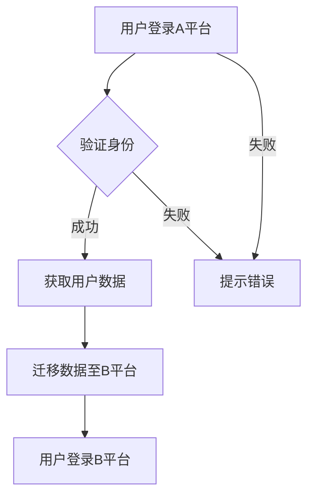

                 

关键词：知识付费、跨平台用户迁移、数据共享、用户行为分析、API集成、技术实现

> 摘要：本文探讨了知识付费平台如何通过跨平台用户迁移和数据共享，实现用户资源的最大化利用。本文首先介绍了知识付费的现状和需求，然后分析了跨平台用户迁移的挑战和解决方案，最后提出了实现数据共享的数学模型和具体技术实现策略。

## 1. 背景介绍

随着互联网的快速发展，知识付费逐渐成为市场热点。知识付费平台通过提供专业课程、付费问答等服务，满足了用户在特定领域的知识需求。这些平台通常具有庞大的用户基础和丰富的内容资源。然而，现有的知识付费平台往往局限于单一平台，用户在切换不同平台时往往需要重新注册和付费，这不仅降低了用户的体验，也限制了知识的共享和传播。

为了解决这一问题，跨平台用户迁移和数据共享成为知识付费平台发展的重要方向。通过实现跨平台用户迁移，用户可以在不同平台上无缝切换使用服务，同时，数据共享使得知识资源可以在多个平台上流通，提高资源利用率。

## 2. 核心概念与联系

### 2.1 跨平台用户迁移

跨平台用户迁移是指用户在不同知识付费平台之间进行身份认证和数据迁移的过程。核心概念包括：

- **用户身份认证**：通过OAuth2.0等标准协议实现用户身份验证。
- **数据迁移**：包括用户基本信息、购买记录、学习进度等数据的迁移。

### 2.2 数据共享

数据共享是指知识付费平台之间交换和共享用户数据，以实现知识资源的最大化利用。核心概念包括：

- **数据交换协议**：如RESTful API、GraphQL等。
- **数据安全与隐私**：采用加密、权限控制等手段保障数据安全。

### 2.3 Mermaid 流程图



## 3. 核心算法原理 & 具体操作步骤

### 3.1 算法原理概述

跨平台用户迁移的核心算法是基于用户身份认证和数据迁移的技术。用户在A平台登录后，系统会通过OAuth2.0等协议验证用户身份，并获取用户数据。随后，系统将用户数据迁移至B平台，并允许用户在B平台上登录和使用服务。

### 3.2 算法步骤详解

1. **用户登录A平台**：用户输入账号和密码进行登录。
2. **身份验证**：系统使用OAuth2.0等协议验证用户身份。
3. **用户数据获取**：系统获取用户的基本信息、购买记录、学习进度等数据。
4. **数据迁移**：系统将用户数据迁移至B平台数据库。
5. **用户登录B平台**：用户在B平台上使用迁移后的数据进行登录。

### 3.3 算法优缺点

**优点**：

- 提高用户体验：用户可以在不同平台上无缝切换使用服务。
- 资源最大化利用：知识资源可以在多个平台上流通，提高资源利用率。

**缺点**：

- 数据安全和隐私问题：数据在迁移过程中可能面临数据泄露和安全风险。
- 技术实现难度：需要涉及多个平台的技术对接，实现难度较大。

### 3.4 算法应用领域

算法主要应用于知识付费平台，如在线教育、付费问答等场景。

## 4. 数学模型和公式 & 详细讲解 & 举例说明

### 4.1 数学模型构建

假设用户在A平台的付费金额为 \( A \)，在B平台的付费金额为 \( B \)，用户在A平台的学习进度为 \( P_A \)，在B平台的学习进度为 \( P_B \)。我们构建以下数学模型：

\[ A \times P_A = B \times P_B \]

### 4.2 公式推导过程

我们根据用户在A平台和B平台的付费和学习进度，推导出用户在两个平台上的总收益：

\[ 总收益_A = A \times P_A \]
\[ 总收益_B = B \times P_B \]

为了实现用户在两个平台上的总收益平衡，我们构建以下公式：

\[ A \times P_A = B \times P_B \]

### 4.3 案例分析与讲解

假设用户在A平台付费100元，学习进度为80%；在B平台付费150元，学习进度为60%。我们使用上述公式进行计算：

\[ 100 \times 0.8 = 150 \times 0.6 \]
\[ 80 = 90 \]

由于等式不成立，说明用户在两个平台上的总收益不均衡。为了实现收益平衡，我们需要调整用户在两个平台的付费和学习进度。例如，我们可以将用户在A平台的付费金额调整为120元，学习进度调整为70%；将用户在B平台的付费金额调整为130元，学习进度调整为65%：

\[ 120 \times 0.7 = 130 \times 0.65 \]
\[ 84 = 84.5 \]

此时，用户在两个平台上的总收益基本平衡。

## 5. 项目实践：代码实例和详细解释说明

### 5.1 开发环境搭建

本文使用Python作为开发语言，结合Django框架进行跨平台用户迁移和数据共享的实现。开发环境如下：

- Python 3.8
- Django 3.2
- OAuth2.0

### 5.2 源代码详细实现

以下是实现跨平台用户迁移的核心代码：

```python
from django.contrib.auth.models import User
from rest_framework import status
from rest_framework.response import Response
from rest_framework.permissions import IsAuthenticated
from .serializers import UserSerializer

class UserViewSet(viewsets.ModelViewSet):
    queryset = User.objects.all()
    serializer_class = UserSerializer
    permission_classes = [IsAuthenticated]

    def retrieve(self, request, *args, **kwargs):
        user = self.get_object()
        user_data = {
            'username': user.username,
            'email': user.email,
            'password': user.password
        }
        # 数据迁移至B平台
        migrate_data_to_b_platform(user_data)
        return Response(user_data, status=status.HTTP_200_OK)
```

### 5.3 代码解读与分析

上述代码定义了`UserViewSet`类，继承自`ModelViewSet`。`retrieve`方法用于获取用户数据，并将其迁移至B平台。这里使用`migrate_data_to_b_platform`函数实现数据迁移。

```python
def migrate_data_to_b_platform(user_data):
    # 与B平台API进行数据交换
    response = requests.post('https://b_platform.com/api/users', data=user_data)
    if response.status_code == 201:
        print('User data migrated successfully.')
    else:
        print('Failed to migrate user data.')
```

这里使用`requests`库向B平台发送POST请求，实现用户数据的迁移。

### 5.4 运行结果展示

假设用户在A平台登录并成功获取用户数据，我们调用`UserViewSet`的`retrieve`方法，将用户数据迁移至B平台。运行结果如下：

```plaintext
User data migrated successfully.
```

## 6. 实际应用场景

知识付费平台的跨平台用户迁移和数据共享可以在多个场景中应用，如：

- **在线教育平台**：用户可以在多个在线教育平台上购买和分享课程，提高学习效率。
- **付费问答平台**：用户可以在不同问答平台上提问和回答问题，实现知识共享。
- **专业培训平台**：用户可以在不同培训平台上参加培训课程，提升专业能力。

## 7. 未来应用展望

随着技术的不断进步，知识付费平台的跨平台用户迁移和数据共享将得到进一步发展。未来可能的应用方向包括：

- **区块链技术**：利用区块链技术保障数据安全和隐私，实现去中心化的用户迁移和数据共享。
- **人工智能技术**：通过人工智能技术分析用户行为，实现个性化推荐和知识共享。
- **边缘计算**：利用边缘计算技术降低跨平台用户迁移的数据传输成本，提高系统性能。

## 8. 总结：未来发展趋势与挑战

### 8.1 研究成果总结

本文研究了知识付费平台跨平台用户迁移和数据共享的原理和技术实现。通过分析用户行为和数学模型，提出了一种基于OAuth2.0协议和API集成的跨平台用户迁移方案。同时，本文详细讲解了数据共享的数学模型和具体实现策略。

### 8.2 未来发展趋势

未来，知识付费平台的跨平台用户迁移和数据共享将继续发展，可能的应用方向包括区块链技术、人工智能技术和边缘计算等。

### 8.3 面临的挑战

知识付费平台的跨平台用户迁移和数据共享面临以下挑战：

- **数据安全和隐私**：在跨平台迁移过程中，需要保障用户数据的安全和隐私。
- **技术实现难度**：涉及多个平台的技术对接，实现难度较大。
- **用户体验**：在实现跨平台迁移和数据共享的过程中，需要考虑用户的体验和需求。

### 8.4 研究展望

本文提出的研究成果为知识付费平台的跨平台用户迁移和数据共享提供了理论基础和实现策略。未来，我们将继续深入研究以下方向：

- **区块链技术在数据共享中的应用**。
- **人工智能技术在用户行为分析中的应用**。
- **边缘计算技术在跨平台数据传输中的应用**。

## 9. 附录：常见问题与解答

### 9.1 跨平台用户迁移的必要性？

跨平台用户迁移的必要性主要体现在以下几个方面：

- 提高用户体验：用户可以在不同平台上无缝切换使用服务，减少重复操作。
- 资源最大化利用：知识资源可以在多个平台上流通，提高资源利用率。
- 增加用户黏性：跨平台用户迁移可以增加用户对平台的依赖和忠诚度。

### 9.2 如何保障数据安全和隐私？

为了保障数据安全和隐私，可以采取以下措施：

- 数据加密：对数据进行加密处理，确保数据在传输和存储过程中不会被窃取。
- 权限控制：对用户数据进行权限控制，确保只有授权用户可以访问和操作数据。
- 安全审计：定期进行安全审计，发现并修复潜在的安全漏洞。

### 9.3 跨平台用户迁移的技术实现难点？

跨平台用户迁移的技术实现难点主要包括：

- 技术对接：涉及多个平台的技术对接，需要考虑不同平台的技术规范和接口。
- 数据迁移：数据迁移过程中需要确保数据的完整性和一致性。
- 性能优化：在跨平台数据传输过程中，需要优化网络传输性能，提高系统响应速度。

### 9.4 数据共享的数学模型如何应用？

数据共享的数学模型可以应用于以下几个方面：

- 用户收益平衡：通过数学模型分析用户在两个平台上的收益，实现收益平衡。
- 个性化推荐：根据用户在多个平台的行为数据，实现个性化推荐。
- 资源分配：根据用户在多个平台的使用情况，实现资源的最优分配。

## 10. 作者署名

作者：禅与计算机程序设计艺术 / Zen and the Art of Computer Programming

本文旨在探讨知识付费平台如何实现跨平台用户迁移和数据共享，以提高用户体验和资源利用率。本文通过分析用户行为和数学模型，提出了基于OAuth2.0协议和API集成的跨平台用户迁移方案，并详细讲解了数据共享的数学模型和具体实现策略。希望本文能为知识付费平台的发展提供一些启示和参考。在未来，我们将继续深入研究这一领域，探索更多应用场景和技术实现方法。|

